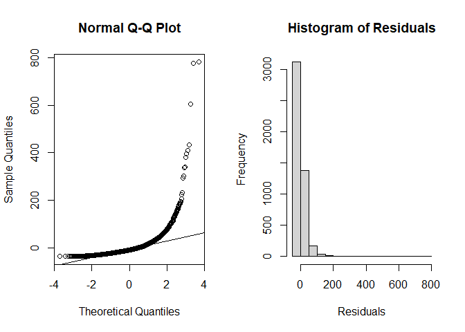
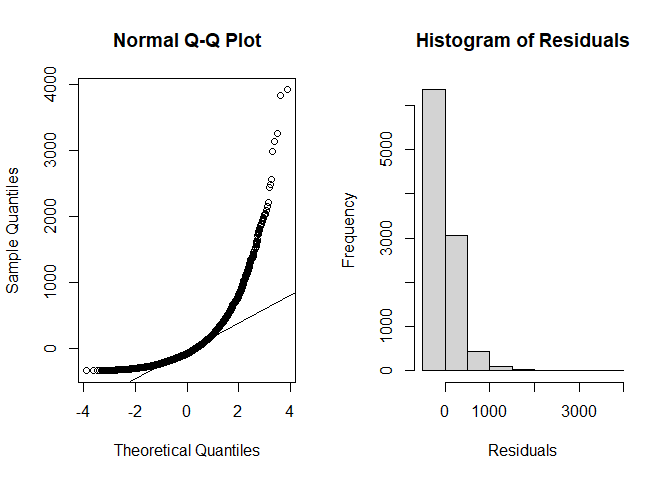
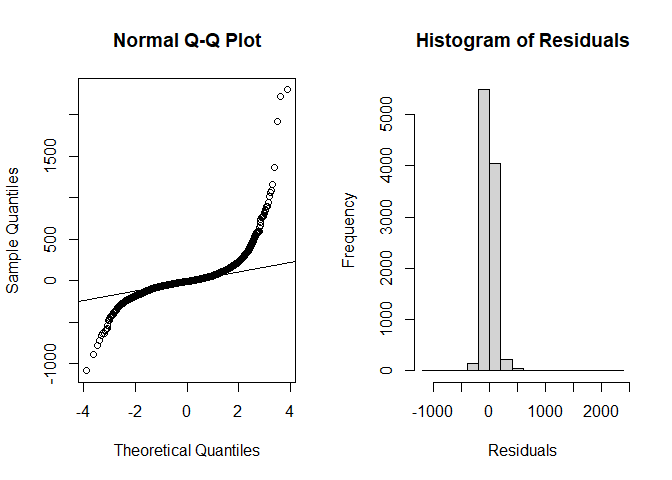

Part 2: Linear regression models
================
Charles Julien, Chike Odenigbo, Atul Sharma, Gabriel Jobert
10/20/2023

# Instructions

• Explore linear regression models for the response variables of
interest, specifically, for trip lengths (duration) and revenue.

• Be sure that your analyses allow you to answer well formulated
business / research questions that you wish to explore through these
models. The goal is to use linear regression models to provide
interesting and relevant insights from the data.

• Comment on findings and discuss the main takeaways from these analyses
from a business perspective. Be sure to provide relevant model outputs
that support your discussion.

• Discuss any shortcomings or limitations of the analyses carried out.

# Business/Research questions

Examples :

## Revenue

Is revenue significantly higher during the weekend?

Is revenue significantly higher during long weekend (holiday on Friday
and/ or Monday)?

Is revenue significantly different during AM, PM and night?

Is revenue significantly different when it is hot or cold?

Is revenue significantly higher when it is raining?

## Duration

Does the average trip duration varies from member to non-member?

How does temperature impact the trip duration? We can make is
categorical( Cold, Normal and hot)

<<<<<<< HEAD
How does rain impact the trip duration? We can make is categorical(
Rain, No Rain)

# Build some regression models, discuss their relevances and test assumptions
=======
# Research Question 1: How do seasonal factors impact trip durations and revenue for BIXI Montréal?
>>>>>>> 1a3dfe01d7c34b92d84987062663cdae9b23e77b

## Seasonal effect on trip duration

    ## 
    ## Call:
    ## lm(formula = dur ~ mm + temp * rain, data = df_main)
    ## 
    ## Residuals:
    ##    Min     1Q Median     3Q    Max 
    ## -343.2 -189.2  -81.4   94.5 3910.2 
    ## 
    ## Coefficients:
    ##              Estimate Std. Error t value Pr(>|t|)    
    ## (Intercept) 129.79659   14.32005   9.064  < 2e-16 ***
    ## mm5          76.47150   14.43951   5.296 1.21e-07 ***
    ## mm6          91.81831   16.61872   5.525 3.38e-08 ***
    ## mm7         117.72149   16.03643   7.341 2.29e-13 ***
    ## mm8         101.18642   17.49632   5.783 7.55e-09 ***
    ## mm9         134.18174   14.88978   9.012  < 2e-16 ***
    ## mm10         38.83674   13.56798   2.862  0.00421 ** 
    ## mm11         18.82041   16.09615   1.169  0.24233    
    ## temp          4.16439    0.84554   4.925 8.57e-07 ***
    ## rain         -3.65130    1.58760  -2.300  0.02147 *  
    ## temp:rain    -0.06314    0.09347  -0.676  0.49937    
    ## ---
    ## Signif. codes:  0 '***' 0.001 '**' 0.01 '*' 0.05 '.' 0.1 ' ' 1
    ## 
    ## Residual standard error: 300.5 on 9989 degrees of freedom
    ## Multiple R-squared:  0.04691,    Adjusted R-squared:  0.04596 
    ## F-statistic: 49.17 on 10 and 9989 DF,  p-value: < 2.2e-16

### Findings and interpretation

From a business perspective, here’s how you would interpret the output
of the linear model:

**Model Overview**: The model is trying to observe the effect of month
(`mm`), average temperature (`temp`), and rainfall (`rain`), along with
the interaction between temperature and rainfall (`temp:rain`) on the
trip duration (`dur`).

**Coefficients**: - **(Intercept)**: The base duration (when all other
factors are 0) is approximately 129.8. However, since some factors (like
temperature) cannot realistically be zero, we have to interpret this
value with caution.

- **Month (`mm`)**: Compared to April :

  - Trips in May (`mm5`) are on average 76.5 minutes longer.
  - Trips in June are approximately 91.8 minutes longer.
  - July sees the most significant increase with trips being about 117.7
    minutes longer. (what about september?)
  - This trend decreases a bit in August with an increase of 101.2
    minutes.
  - September trips are approximately 134.2 units minutes. (more than
    september)
  - The effect diminishes in the later months with October seeing an
    increase of just 38.8 minutes and November just 18.8 minutes.
    However, note that the coefficient for November is not statistically
    significant (p-value \> 0.05). Thus the effect of seasonality is
    similar to april.

- **Temperature (`temp`)**: For each additional degree Celsius in
  temperature, trip duration increases by around 4.16 minutes on
  average, all else being equal.

- **Rainfall (`rain`)**: For each additional millimeter of rain,average
  trip duration decreases by approximately 3.65 minutes. All else being
  equal. This might suggest that people tend to shorten their trips when
  it rains.

- **Interaction Term (`temp:rain`)**: The interaction term is not
  statistically significant (p-value \> 0.05), which means that the
  combined effect of temperature and rainfall on trip duration is not
  distinctly different from the sum of their individual effects.

**Model Fit**: - The **Multiple R-squared** value is 0.04691, which
means that only about 4.69% of the variance in trip duration can be
explained by the model. This is a pretty low value, suggesting that
there may be other factors not considered in the model that influence
trip duration.

- The overall **F-statistic** has a very low p-value (p \< 2.2e-16),
  indicating that the model is statistically significant and that at
  least one of the predictors has a relationship with trip duration.

**Business Implications**:

1.  **Seasonality**: There’s a clear seasonality in trip duration, with
    trips tending to be longer in the middle of the year (around July
    and September) compared to April. This could be due to various
    reasons like vacations, events, or other factors that influence trip
    behavior during these months.

2.  **Weather**: Temperature has a positive relationship with trip
    duration, meaning people might take longer trips when it’s warmer.
    On the other hand, rainfall tends to reduce trip length, which could
    be due to discomfort or safety concerns associated with traveling
    during rain.

3.  **Model Improvements**: The low R-squared value indicates there are
    other factors not in the model affecting trip duration. Further
    research could help improve the predictive power of the model.

4.  **Operational Decisions**: If a business relies on this data, it
    could optimize operations based on these insights. For example, they
    might expect longer trips and possibly more revenue during warmer,
    drier months. On rainy days, they might expect shorter trips and can
    adjust resources and strategies accordingly.

## Seasonal effect on revenue

    ## 
    ## Call:
    ## lm(formula = rev ~ mm + temp + rain, data = df_main)
    ## 
    ## Residuals:
    ##    Min     1Q Median     3Q    Max 
    ## -35.02 -17.16  -7.91   6.28 780.11 
    ## 
    ## Coefficients:
    ##             Estimate Std. Error t value Pr(>|t|)    
    ## (Intercept)  10.6632     2.6304   4.054 5.12e-05 ***
    ## mm5           4.5252     2.6259   1.723   0.0849 .  
    ## mm6           8.6248     2.9339   2.940   0.0033 ** 
    ## mm7          17.2568     2.8647   6.024 1.83e-09 ***
    ## mm8          15.7850     3.0995   5.093 3.67e-07 ***
    ## mm9          18.6931     2.6860   6.959 3.88e-12 ***
    ## mm10         12.1186     2.4922   4.863 1.20e-06 ***
    ## mm11          6.9401     2.9942   2.318   0.0205 *  
    ## temp          0.3833     0.1456   2.632   0.0085 ** 
    ## rain         -0.4932     0.1097  -4.495 7.13e-06 ***
    ## ---
    ## Signif. codes:  0 '***' 0.001 '**' 0.01 '*' 0.05 '.' 0.1 ' ' 1
    ## 
    ## Residual standard error: 35.98 on 4724 degrees of freedom
    ##   (5266 observations deleted due to missingness)
    ## Multiple R-squared:  0.04008,    Adjusted R-squared:  0.03825 
    ## F-statistic: 21.92 on 9 and 4724 DF,  p-value: < 2.2e-16

**Objective of Analysis:** This regression model is examining the impact
of the month (`mm`), average daily temperature (`temp`), and total
amount of rainfall (`rain`) on the revenue (`rev`) generated by trips
leaving from a specified station.

**Business Interpretation:**

**Seasonality (Month):** - The revenue seems to have a seasonal pattern.
Compared to April (reference month), May (`mm5`) sees an increase in
revenue by about
4.525$. This increase is even more pronounced in the following months, with September (`mm9`) having the most substantial uplift of around 18.693$.

**Temperature (`temp`):** - For every 1°C increase in temperature, the
revenue increases by approximately 0.383 \$, which is statistically
significant (p-value: 0.0085). - This suggests that warmer days tend to
generate more revenue.

**Rainfall (`rain`):** - For every additional mm of rainfall, the
revenue decreases by approximately 0.493\$, which is statistically
significant (p-value: 7.13e-06). - This implies that rainfall negatively
impacts the revenue.

**Model Fit:** - The Multiple R-squared value (0.04008) implies that
around 4% of the variation in revenue is explained by the predictors in
the model. While statistically significant (F-statistic p-value: \<
2.2e-16), the model might benefit from considering additional predictors
or non-linear effects to explain more of the variance in revenue.

**Recommendations for Business:**

1.  **Operational Adjustments:** Given that revenue is higher in warmer
    months, consider optimizing operations for this period. This might
    involve higher staffing, more promotional activities, or ensuring
    optimal equipment availability.

2.  **Rainy Day Strategies:** Since rainfall seems to negatively impact
    revenue, consider implementing strategies to mitigate this. For
    instance, promotional offers or special activities/events for rainy
    days might help attract customers.

## residual Analysis

<!-- --><!-- -->

    ## $x
    ##    [1]  0.9996281513  0.0792423228 -0.7786156317 -1.0261598924  0.8127702247
    ##    [6] -1.7078525292 -1.4756022637  0.9737820539  0.9831826898  0.2098870765
    ##   [11]  1.4709001422  0.8164594068  0.2250678527 -0.0792423228  1.0083931977
    ##   [16] -0.0479376312 -1.3693451090 -2.5933100426 -1.0128049023 -1.6152681378
    ##   [21]  0.8135071751 -0.4815544116 -0.8441137763 -0.7026786749 -0.8732042600
    ##   [26] -0.7108352860 -1.4524092973  0.5394667264  0.0500581547  1.3857550401
    ##   [31]  0.2517618078  0.9797542592  0.2028554791  0.4455898605 -0.1111576432
    ##   [36]  0.9900744573  1.2972358086  1.2112143466 -0.6952426421 -0.0999760631
    ##   [41]  1.3272964238  1.0119209857  1.3260198511  1.2290484146  0.1058314337
    ##   [46] -0.1239537152  1.0580567442  0.5778411710  1.5434188085  1.5177940375
    ##   [51]  0.8010383905  1.4585175915  0.0421072743  1.1578210993  1.4646807950
    ##   [56]  1.8097007554  1.5646735024  1.1980874496  1.3234731683 -0.4385836521
    ##   [61] -0.9361884432 -1.6270909340 -1.5810911271 -1.9666946856 -2.3665403364
    ##   [66] -1.1734886257 -0.5036733813 -0.9485706256  1.0901083938  1.7805289361
    ##   [71]  1.9594221278  1.4539312891  0.0840236851 -2.1729439326  0.5659932125
    ##   [76]  0.8990799912 -1.0881920114  0.5012704207 -2.3935151870 -0.4380007768
    ##   [81] -0.5872523763 -0.0983797470 -0.8186782584 -0.8864600619 -0.6126085670
    ##   [86] -2.8162707291 -0.1314273396 -0.0818984045 -0.3397410541  0.3492928643
    ##   [91] -0.1866663202  0.4188477314 -0.4526180103 -0.4228974427  0.7293632890
    ##   [96] -0.1985333444  0.3346967897  0.0029122254  0.2692907408  1.4226510170
    ##  [101]  0.8539843767  0.6658731494  0.7544645199  0.1969135039 -0.8616341202
    ##  [106]  0.3268669976 -0.0135025271 -0.6286575123 -1.6290836566 -1.1536908076
    ##  [111] -0.5691033338 -0.7439487552 -0.1839729914 -0.2544954730  0.0394575971
    ##  [116] -0.2109697737 -0.4327615606 -1.0190146138 -1.3311391798  0.6183678116
    ##  [121] -0.3425471548  0.1485382017  2.1618532584  1.8433872052  1.3058818685
    ##  [126]  1.7010631135  1.2189690604  1.0424315178 -0.8456269636  1.1323223339
    ##  [131] -0.1802045673 -0.3577474508  0.3095999028  0.9653100838 -1.6899186713
    ##  [136] -0.1915177402 -1.5646735024 -0.8532221511 -0.5272581038  0.0957197751
    ##  [141] -0.8786438296 -0.2692907408 -0.3051590280  0.1630091942 -1.3816176152
    ##  [146]  0.6062331400  1.4478633912  1.3706985468  0.2490300227  0.0330994664
    ##  [151]  1.1404013321  1.7430403106  0.8974946886  0.2813897339  0.7272923315
    ##  [156]  0.7266027053  0.7087917165  0.0463473806 -1.2472821965 -1.2766321372
    ##  [161] -0.1026371582 -1.1085175575 -0.6331802070 -0.7565776841 -0.9594206972
    ##  [166] -0.0558907838 -0.5548416771 -0.1367701164 -0.0288614717  0.3662276872
    ##  [171] -0.7502482624  1.6855190819 -0.4655615617  0.4940788018  0.7679055435
    ##  [176]  0.7995796658 -0.4113449649 -0.1143548735 -1.3829941271  0.5784669858
    ##  [181] -1.1475320178 -1.5829418121 -0.3929738094 -0.2033960108 -0.2201828269
    ##  [186] -0.5866233511 -0.3815592169 -0.2687417354 -0.1068964306  0.2632561051
    ##  [191] -0.4673326016 -0.2343098981  0.0092662912  0.4892985694  1.5262245552
    ##  [196]  0.4809599075  0.2386659825  1.2838418527  0.5878816340  0.0346888636
    ##  [201]  0.1362356655 -0.8888155096  0.6468269012  0.5597893164 -0.1308932707
    ##  [206] -1.2935598729 -0.8509384423 -0.9427742865  0.8763094107 -0.5187586965
    ##  [211] -0.1512155792  0.9419488223 -0.2566837743 -0.5853659963  0.4176919344
    ##  [216]  0.5078855817  0.3622670029 -0.7481451292  0.5345737263  0.6844946534
    ##  [221]  1.0092739671 -0.5566954441 -0.1437215910  1.3009293573  0.2452086384
    ##  [226] -1.0599120307  0.8112976465  0.2736857219  0.7342077387  0.5406919926
    ##  [231] -0.1812809964  0.4773964412  0.9763373064  0.3924018745  1.3734129807
    ##  [236] -0.0341590550 -0.2610640785 -0.2830427530 -0.5468305661 -1.0270567397
    ##  [241] -0.0877438454  0.4461746950 -0.3981270389 -0.6043253188  0.0824296896
    ##  [246]  0.7053923274  0.3753024121 -0.8578029738 -0.5024715383 -0.2709382446
    ##  [251]  1.0497526403 -0.1463970670  0.4067393875 -0.1522868327  0.4881052605
    ##  [256]  0.1958338974 -0.5042745756  0.3566187072  0.8547470988  0.0066187330
    ##  [261]  0.3707612331  1.2507474960 -1.5045254154  0.2534017798 -0.6965917798
    ##  [266] -0.1947545192 -1.1454887341 -0.1850501617 -0.2120527182  0.3034952550
    ##  [271]  0.6422647315 -0.1501444992  0.3639637396 -0.7944874665 -0.4032908628
    ##  [276] -0.2802881484 -0.8716548382  0.3023865398 -0.6945685477  0.4643816796
    ##  [281] -0.4875088667 -0.0739318170 -2.4125160697 -1.2850499765 -0.7362892111
    ##  [286] -3.1788384121 -0.2775356688 -2.0955551312 -0.6838255351 -0.2228960740
    ##  [291]  1.1183592202 -0.2846965460 -0.0935922860  0.5910314237  0.5000700258
    ##  [296] -0.6151657117  0.6546792755 -0.0882753948  0.2791869029  0.1122232588
    ##  [301] -0.6177268852 -0.7988509413  0.6573057058 -0.3662276872 -0.4543785330
    ##  [306] -0.0537696182 -0.5772155825  0.2044772528  0.8778651584  0.7850847390
    ##  [311] -0.3998471274  0.1159539250 -0.6351224711 -0.0803046873 -1.8580626482
    ##  [316] -1.7287076697 -1.5719179472 -0.8471420896 -1.5094700353 -0.0771178607
    ##  [321] -1.0862796171 -0.1170201239 -1.4631347796 -2.0458726101 -0.6030546593
    ##  [326] -1.4600531972 -1.0683063600  0.3673603646  0.2902148450 -0.3380586783
    ##  [331] -0.1544298654 -1.1991734760 -0.4356707604 -0.7149313608 -0.7771824761
    ##  [336] -2.4987553050 -1.4344021264 -1.0534343852 -1.4125275765 -3.2751151123
    ##  [341] -1.1243165744 -0.1458618886  0.3285431077  0.0368081969 -0.3330172652
    ##  [346] -0.6260788830 -1.9487038774 -2.1564061547 -1.4851056379  0.0553604692
    ##  [351]  1.2659403699  0.5254336140  1.7334457242 -0.3453559554  1.3829941271
    ##  [356]  1.8580626482  2.5499728594  0.0235646983 -0.0516486945  1.2588921599
    ##  [361]  1.4433472102  1.4693399728  1.4182945953  1.6682390992  1.9968763742
    ##  [366]  1.6371199556 -0.7286726227  0.7686168020  0.2506688694 -0.2098870765
    ##  [371]  0.2885584348  0.6527124132  0.8083577541  1.5127870638  0.8794230338
    ##  [376]  1.7170293663  0.5998822594  0.5647506970  0.7376786332  0.4738390267
    ##  [381]  0.9255721801  0.3101554399  1.1485554585  1.1734886257  1.5469129345
    ##  [386]  1.3927039399  2.1673652720  1.8234859258  1.0552806232  0.3821287550
    ##  [391]  0.3057138065  0.7162993856  0.5853659963  0.6671955507  1.2718622876
    ##  [396]  0.9046464386  0.2370319246  0.9247598641  0.6945685477  0.8998734904
    ##  [401] -0.3849783101 -0.1990734068 -0.3583119935 -0.5511398472  0.4136510236
    ##  [406] -0.8105620167 -0.6170862125 -0.8935412636 -1.5469129345 -1.0608410435
    ##  [411]  0.3713284606 -0.5859945579  0.0076777497 -0.1469322874 -0.1667663894
    ##  [416]  0.5859945579  0.9118447611  0.2797374832  0.7743209420  0.0925287009
    ##  [421]  0.7551685333 -0.9552342855 -0.4339247997  0.4976713938  0.8670190739
    ##  [426]  0.8755323317  0.0193277626  0.6081431704 -0.3134906801  0.1196862059
    ##  [431]  1.1991734760  0.2643525923  1.1547215341  0.4263741500  0.9619406344
    ##  [436]  0.9150592222  1.3285751631  1.2778291475 -0.3696271357 -0.0034417228
    ##  [441]  0.7252244885 -0.4044398362  0.7886929178  0.1651558777  0.2769854258
    ##  [446]  0.8786438296  0.2364873794 -0.1415819515  1.0048779150 -0.0166798589
    ##  [451]  0.2060995644 -0.5327421521  0.3408631721  1.5664769149 -0.0813671426
    ##  [456] -0.4596685888 -0.9831826898  0.4567280905 -1.3506546566 -1.7909611145
    ##  [461] -0.2473918445 -0.0564211141 -0.6592785074 -0.0718082068 -0.9304589624
    ##  [466] -1.1313176467  0.3696271357 -0.0410473690 -0.1378391355  0.3815592169
    ##  [471]  1.3802437161  0.5967158854  0.2512153011  0.7721789460  0.3090444612
    ##  [476] -0.4455898605 -0.3656615248 -0.7952136604 -0.4107687924 -0.2310457546
    ##  [481] -0.8024988216  0.2555894707  2.1843085086 -1.6682390992  0.0983797470
    ##  [486]  1.2145288534 -1.5061695323  0.4124977201 -2.4324300625 -0.8896017552
    ##  [491] -1.6172229470 -0.4887018280  0.1904392613  0.5266497458 -1.4388602771
    ##  [496] -0.7020010703  0.1931358768  0.6055969547  0.1780523339 -0.5904009975
    ##  [501]  0.6811521165 -0.1807427557 -0.5018708890 -2.5499728594  0.2381212259
    ##  [506] -1.4740312672 -1.3997207481 -0.7757509150 -0.5248258395 -0.2299582553
    ##  [511] -0.8701075060 -1.7240081085 -1.7334457242  0.0431672270 -1.3234731683
    ##  [516] -0.5351846495  0.5834816971 -1.1444688834 -1.8179303544 -0.8410931844
    ##  [521] -0.0941241182 -0.2364873794 -0.0957197751 -1.1916007559 -2.1404379341
    ##  [526] -2.1003371066 -0.7894157859 -1.2167459583 -1.4996173088 -1.1303141002
    ##  [531] -0.3906868388 -0.5006701330 -0.0452872789 -0.5529898149 -0.8046926836
    ##  [536] -0.6370671341  0.8054248319 -0.2698398273 -1.5211532773 -0.7822055393
    ##  [541] -0.1630091942 -1.8462906053 -1.1588567631 -1.3298560786  0.5797192956
    ##  [546] -0.8433579071 -0.9746330977 -2.4029071940 -1.5737420073 -0.3730308610
    ##  [551] -1.9279153773 -0.4691051084 -0.5560773095 -2.2730208076 -1.8319263131
    ##  [556] -1.3612766537 -0.0198573591 -0.1969135039 -0.2621599344 -1.1671872227
    ##  [561]  1.0252638697 -1.5755713187 -0.9823244997 -1.5885266470 -1.8731495275
    ##  [566] -1.9968763742 -1.5628751644 -1.6639960263 -1.2057195501 -0.5916620849
    ##  [571] -2.5365334000 -1.2790279915 -0.0654392801 -0.2808388985 -0.1942149152
    ##  [576] -0.3901154157 -0.7033566023 -1.0664344581 -1.9451803648 -0.7800503882
    ##  [581] -0.2223532939 -2.0207682589 -0.9577441183 -0.2381212259  0.4922848972
    ##  [586] -0.7300543035 -0.3408631721 -0.1823576357 -1.5774059179 -0.1271558250
    ##  [591]  1.2079130929  1.7216725361  0.1255546092 -0.0203869611  1.7382230158
    ##  [596]  0.5278666570  0.3123785477 -1.3666457329 -0.2403006780 -0.4679232738
    ##  [601] -0.6049610145 -0.2599685361 -0.9312755876  0.9345483186 -0.4450051784
    ##  [606]  0.2153030498 -0.8794230338  0.0082072612  0.5139187044 -0.4223184892
    ##  [611] -0.1282234831  0.3263084984  0.1154208751 -1.0910680880 -0.2714875758
    ##  [616]  0.6500938506  0.2446630199 -0.8872446642  1.0013750061 -0.5878816340
    ##  [621] -1.6661138133  0.6798172318 -0.7328218560 -0.6758198211 -0.9477406279
    ##  [626] -0.6972668243 -0.2891104834  0.1920570631 -0.0325696861  0.1340982495
    ##  [631] -0.9653100838 -1.4110931399 -0.4188477314 -1.6965800305 -1.2911189271
    ##  [636] -0.8911758988  0.3583119935  0.1410471433 -0.1974533931  1.5885266470
    ##  [641]  0.9712331439  0.3246336107  1.1193493547 -0.0389276955  1.0543570549
    ##  [646]  0.2055587338  1.2335684606  1.2911189271 -0.0898701933  2.4324300625
    ##  [651]  0.9477406279  0.8253591442  0.3464802377 -0.9030531703  0.3487301186
    ##  [656]  0.0378679249 -0.5072832885 -0.7162993856 -0.9952743018 -1.5451635134
    ##  [661] -1.4418483393 -1.4787552286 -1.6351009675  0.0909335191 -0.3487301186
    ##  [666]  1.0664344581  0.4142278817  0.6592785074 -0.7930363342 -0.8164594068
    ##  [671]  0.0558907838  2.1149786129  2.1404379341  2.2264768786  1.5998473749
    ##  [676]  1.8376265875  2.0289949113  1.7831188266  2.3172508347  0.7952136604
    ##  [681]  0.3804205116  1.3652997712  0.0325696861 -0.3872602059  0.1234201547
    ##  [686] -0.4246351548  0.2125942837 -0.2769854258  0.7108352860  0.4821490859
    ##  [691] -0.7293632890 -0.3878309946  0.6222187226  0.4673326016 -0.4555529974
    ##  [696]  0.7047134280  1.0599120307  0.7865267816  0.9288275706  0.5242182588
    ##  [701]  0.7858055561 -0.6698438611 -0.3622670029 -0.2501225126 -1.4053842240
    ##  [706] -0.3268669976 -0.0267426735 -0.0866808208  0.2698398273  1.5922775768
    ##  [711]  1.9703703229  1.5364865424  1.5399434249  0.8896017552  0.3196143860
    ##  [716]  1.0342614753  1.1213329228  0.6119699069 -0.3492928643  0.0606643405
    ##  [721] -0.4982707829 -0.6844946534 -0.4409166467  0.1437215910 -0.9619406344
    ##  [726] -0.1549657340 -0.0442272281 -0.4744315116 -1.6310828694  0.0893385686
    ##  [731] -0.5139187044 -0.0045007208 -1.6943512167 -1.8492096530 -0.1063639171
    ##  [736] -1.5028853554 -0.0904018434 -0.1100921538 -0.0097958100 -1.2211982033
    ##  [741] -1.1333281654 -1.4285019143 -0.7314373795 -0.4432520436  0.0813671426
    ##  [746] -0.2731360618 -0.2419360159 -1.0342614753 -0.3090444612 -1.9347522818
    ##  [751] -1.2553913907 -0.0500581547  0.2050179633 -0.3251918052 -0.1576457479
    ##  [756]  0.4620238513 -0.5242182588 -1.2112143466  0.9263851072  0.6254348762
    ##  [761] -0.1893610038  0.9636239916  0.4223184892 -0.5345737263 -0.3628324657
    ##  [766] -0.0834923298  0.3352568408 -0.0749937466  1.0843711873 -0.8320770740
    ##  [771] -0.6705066726 -1.6473163978 -0.1373046064 -1.1253133519  0.2017745933
    ##  [776] -1.5664769149 -1.8262849496 -0.5828540577  0.7231597419 -0.8555103184
    ##  [781] -0.3724632743 -0.2813897339 -1.4211958785 -0.4067393875 -1.1124412945
    ##  [786] -1.8234859258 -0.9126474922  0.9661541598 -0.9918047591  0.0458173233
    ##  [791]  0.0039712213 -1.1424327451 -1.9740727748 -1.9046699873 -0.4649715397
    ##  [796] -1.2507474960 -0.9712331439 -0.0415773158  0.3521082567  0.2484838892
    ##  [801] -1.1650970245 -1.5941614729 -1.0627018211 -1.7989151219 -0.5672366025
    ##  [806] -0.7879704617 -0.4397498502  0.1447916569 -0.6959170526 -2.1300880703
    ##  [811] -2.4533581113 -1.2134225364  0.6871741983  0.0760557608  0.1314273396
    ##  [816]  1.8793055206  0.9394762713 -0.5413049301  0.2006939431  1.0110378591
    ##  [821]  0.4107687924  0.3369376260  1.9279153773  1.1883761318  0.8864600619
    ##  [826]  1.9891598163  1.4270346069  1.0636335912  1.2495907286  1.3414838381
    ##  [831]  0.9502325844  2.6599252048  1.7857207329  2.1510222919  1.6473163978
    ##  [836]  2.0633540427  1.3171437275  0.7026786749  2.0207682589  2.4223529965
    ##  [841]  1.7055806476  2.2524736955  1.4418483393  1.0796173053  0.3459180419
    ##  [846]  2.3020026411  1.9145058251  0.5579323520  0.1100921538  0.1597905736
    ##  [851]  0.2337657018  0.7467448772  1.0853249081  0.6579630218  1.6094404447
    ##  [856]  0.6235044100  1.0333579496  0.9729317149  0.6481328507  0.1587180695
    ##  [861]  1.7193463178  1.9079281222  1.3983118734  1.6661138133  0.0198573591
    ##  [866]  0.2115112149  0.3190571934  1.0261598924 -0.0824296896 -0.0797734938
    ##  [871]  1.1434502217  1.3146266665  0.5413049301  0.7764664966  0.8601001468
    ##  [876] -0.0299209188  0.9370094506 -0.0781800476  0.0882753948  1.6703719471
    ##  [881]  1.5539584045  1.2947832413  2.3095596167  2.3753410516  1.7454642050
    ##  [886]  2.2945748851  1.9347522818  2.1457000660  0.0055597238  1.1223263633
    ##  [891]  1.3493375824  0.7446472397  0.1694515393  1.0234742893  1.1007208557
    ##  [896] -0.8358255280 -0.1255546092  0.2951888768  1.3108666184  1.0451703742
    ##  [901]  0.1127561143  1.4819229629  0.6209340629  0.3667939671  0.6979421866
    ##  [906]  1.2612346042 -0.1689144122  0.5573137915 -1.2530660654  0.1191529220
    ##  [911]  1.4388602771  0.6260788830  0.7537608803  0.6474797379  1.6988173041
    ##  [916]  0.4269541015  0.3134906801  0.8231281013  0.6049610145  0.7020010703
    ##  [921] -1.1495801037  0.4050145231  1.1798369730  0.8090920715  0.0718082068
    ##  [926]  0.5296934914  0.7314373795  0.3633980445  0.9361884432  0.9038495176
    ##  [931]  1.4771769105  1.7078525292  1.6231247601  0.5610283656 -0.3543625808
    ##  [936]  0.1656926671  0.8157206825  0.2753351991  1.1393873882 -0.1480028546
    ##  [941]  0.8919637992  1.1363525618  0.8967028826  1.1526613052 -0.2245248089
    ##  [946] -0.3112668015  0.3577474508 -0.4438362703  0.1996135273 -0.2588733055
    ##  [951]  0.9510645488  0.2627079803 -0.0368081969 -0.1490735914  0.7328218560
    ##  [956]  0.5554593873  1.4125275765  0.9215166833  0.8268487911 -0.7714657343
    ##  [961]  0.4532046951  0.2802881484  0.3302201413  0.0516486945 -0.5941870882
    ##  [966]  0.9239481579  0.4119212741  0.0580122009  1.2426849664  0.5715953990
    ##  [971]  0.9849012459  1.6075099736  1.0910680880  1.0730025724  0.2968485056
    ##  [976]  0.1512155792 -0.3274255987 -0.0209165688  0.6986178674 -0.2902148450
    ##  [981]  0.7643550594  1.2886856499  0.1015726340  1.9245304444  0.0341590550
    ##  [986] -0.1116904351 -0.2539485884  0.6228614376 -0.3162727118  0.4815544116
    ##  [991]  1.7287076697  2.5365334000  2.0723367061  0.9577441183  1.6555986374
    ##  [996]  0.5036733813  1.1682342365  0.2808388985 -0.5333524780  1.4344021264
    ## [1001]  1.2267977790  1.9178259841  0.4009945104  1.5592935751 -0.1646191358
    ## [1006]  0.9070406565  0.3889729515  0.2962952053 -1.0711212526  0.2033960108
    ## [1011]  1.0066340015  0.4732467081  0.4982707829  1.6391456393  0.7879704617
    ## [1016]  1.5313353911  0.6364186457 -0.2736857219  1.7753846941  2.1959624026
    ## [1021]  1.9211674198  0.0898701933  0.6351224711  0.8179381938  2.4533581113
    ## [1026]  0.2979553789  0.6520573536  1.0683063600  0.4964731516  0.0240943434
    ## [1031]  0.8654779553  0.6764853050  1.1630119043 -0.7087917165  0.6992938673
    ## [1036]  0.7714657343  0.5822266479  0.0627863587  0.3611364246  0.6918753187
    ## [1041] -0.2632561051  0.5443726764  0.5006701330 -0.1079615488  0.4851250219
    ## [1046]  0.1613996749  1.3599404991  1.1233209126  1.4448493307  0.4228974427
    ## [1051]  0.4508588894 -0.7307456668  1.0145751136 -0.3787133776  0.7474448200
    ## [1056]  0.3549264429 -0.1207528758 -0.5217898671 -1.2923384375 -0.1785903146
    ## [1061] -1.6231247601 -0.7335146213 -0.6113314964  0.5327421521  0.0203869611
    ## [1066] -0.6305942302 -0.1528225249 -0.1010404151  0.4159592841 -0.4415002700
    ## [1071] -0.3007241633 -1.2245533405  0.8456269636 -0.4768031203 -0.0320399150
    ## [1076] -0.1485382017 -0.2408457190  1.0288529172 -0.6055969547  1.0225807271
    ## [1081]  1.4154052016 -0.7721789460  1.3532958570  1.2935598729 -0.3844081497
    ## [1086]  0.6885158221  0.3431086980  1.4996173088  1.4740312672  1.0515917309
    ## [1091]  0.2272406935 -0.0256833200  0.9970135737 -0.0002647474  0.3498557206
    ## [1096] -0.3084891149  0.6586206221  0.0999760631 -0.0129729859 -1.1755994784
    ## [1101] -0.9543990108 -0.5573137915 -0.5321320246  0.4044398362  0.5431449647
    ## [1106] -0.6455220540 -0.9788989495 -0.2082634915 -0.6605951349  0.6778171726
    ## [1111]  1.0608410435  1.7478983980 -1.3083701797  0.5175475632 -1.1383746144
    ## [1116] -0.8624018676 -1.0739446579 -0.5339630026 -0.6036898672  0.1888219577
    ## [1121] -0.4009945104  0.1319614460  0.1624726410 -0.8149824031 -0.2523083897
    ## [1126]  0.0866808208  0.7693284496  0.1753632004  1.4508906625  0.5382422696
    ## [1131] -0.6652123853  0.5499075828 -0.9510645488  0.0135025271 -1.1114587558
    ## [1136] -1.3146266665  0.2577783855  0.3554904178 -0.9094400851 -0.1399776477
    ## [1141] -0.0723390786  0.0680926621  0.9110426171  0.8616341202 -1.1862332291
    ## [1146] -0.6293028226  0.3425471548  1.9558243697  0.5400792582  0.5370186193
    ## [1151] -1.4508906625  0.2239818313 -0.4298560189 -1.3586067680 -2.2524736955
    ## [1156] -2.0589244269 -1.2347024174 -2.0248644555 -1.1777155823 -0.6865038502
    ## [1161] -0.2643525923 -0.0590730067  0.3588766503 -0.4004207530  1.0997509655
    ## [1166] -1.1661414867  0.2985089524 -0.5622682767 -0.4252146769 -0.9182831663
    ## [1171] -0.6898586862  0.3012781962  0.1068964306 -0.4090410917  0.8120337155
    ## [1176] -0.2430266005 -0.5815994672  0.2528550470 -1.1323223339 -0.7886929178
    ## [1181]  0.5891408483 -0.2764352667  0.5127105895  0.8149824031  1.2530660654
    ## [1186]  0.1143548735  1.7677553241  1.5682854365 -0.3363772587 -0.0187981716
    ## [1191]  0.2196403726  0.4090410917  0.3419857195  1.1414164498  1.2090120470
    ## [1196]  0.5929241140 -0.7081111844 -0.1442566033  0.5284754058 -0.6299483951
    ## [1201]  0.2594208819 -0.3594414217  1.3871394665  0.5922929816 -0.1298252448
    ## [1206]  0.7197253295 -0.3285431077  0.9610999772 -0.7686168020 -0.7629375618
    ## [1211] -1.3337119776 -1.2279223193  0.0946559770  0.2659979197  0.3684935134
    ## [1216] -0.0617253149  0.9182831663  0.1244873110  0.3073787076 -1.8950150352
    ## [1221] -1.0805661284 -0.7060715522  0.2315896067 -0.2386659825 -0.4304368362
    ## [1226] -0.5834816971  0.1031694639 -0.5992485043  0.1592542986 -0.2256109629
    ## [1231] -0.0225054277  0.8275943030  0.0161502928  0.6068695708  0.2131359115
    ## [1236] -0.0458173233  1.4963652003  0.4397498502  0.1047665568  0.0776489432
    ## [1241] -0.6999701870 -0.2758851912  0.7169839008 -2.0545348457 -1.7454642050
    ## [1246] -1.4615922534 -1.3375878088 -1.0092739671 -1.3788724175 -0.5462157845
    ## [1251] -0.7101537667  0.4345066393 -1.2200828740 -0.7544645199 -0.5797192956
    ## [1256]  0.1802045673  0.3173862090 -0.4910898407  0.2676439675  0.9386533631
    ## [1261]  0.0002647474 -0.4573158735 -0.2572310414 -1.0101555202  0.1678403040
    ## [1266] -0.9527304556 -0.0643780573 -2.1959624026  0.4061642985 -0.3079338638
    ## [1271] -0.6579630218 -0.0272723614 -1.5960510438 -2.0501844988 -0.7959402739
    ## [1276]  0.1845115498  0.1501444992  0.7750357304 -1.2624084258  0.1646191358
    ## [1281] -0.2857995071  0.0267426735  0.1116904351 -0.3436703495  0.0357485102
    ## [1286] -0.8539843767 -1.2046249512  0.1533582610 -1.1223263633 -1.7216725361
    ## [1291] -0.7349012090 -0.0315101528 -1.1883761318 -0.0082072612 -0.2163869977
    ## [1296] -0.3324576327 -1.0397004587 -1.1873039990 -0.3207290692 -0.9223265689
    ## [1301] -2.0289949113 -0.4714707469 -2.0633540427  0.1037017988 -0.2913195607
    ## [1306] -0.1148878580 -0.4194258396 -0.6422647315 -1.8069845959  0.4726545554
    ## [1311]  0.5425314158 -0.4857207242  1.7702870099  1.4082329449 -0.0978476975
    ## [1316]  0.7565776841 -0.3958354175  0.5641297662  1.0571304652  0.6731608715
    ## [1321]  0.6645519115  0.8380802472  0.3207290692  1.1343351448  1.3480228448
    ## [1326]  0.6507480728  0.9078398853  1.0075132098  1.6017542187  1.5847979348
    ## [1331]  1.6725124209  1.4662303192 -0.0399875098  0.4327615606 -0.8380802472
    ## [1336] -1.4241091741  0.3436703495  0.8747557811  1.0101555202 -0.1764387005
    ## [1341]  0.9892104170 -0.0230350598  0.9223265689 -0.0659699190  1.4358850069
    ## [1346]  0.3481674833  1.5245297707  1.8762186364  0.5948189307 -0.0378679249
    ## [1351]  1.1557534889  1.7962511454  1.6535174286  1.2766321372  1.4615922534
    ## [1356]  1.1916007559  0.0050302216  0.0145616210  0.9754848479  0.5616482132
    ## [1361]  1.1104772889  0.9231370600  1.0692437162  0.8817638572  1.0939532181
    ## [1366]  1.9382049294  1.7101332601  0.7793328094  1.0645662856  1.9630454286
    ## [1371]  1.3222030395  1.7989151219  1.9522517509  1.7627256762  0.4356707604
    ## [1376]  0.9552342855  1.2850499765  1.5941614729  1.0022495804  1.1661414867
    ## [1381]  0.0696849203  1.1808996622  1.2706743371  0.4217396773  0.7757509150
    ## [1386]  2.2660650330  1.3337119776  1.5521898060 -0.3040497524 -1.1273102686
    ## [1391]  1.6411780715 -0.2272406935  0.0904018434  1.6290836566  0.1823576357
    ## [1396]  0.3958354175  1.1303141002  1.3559465318  0.3735985679  0.8631701237
    ## [1401]  0.4596685888  2.6785882404  1.8550954741 -0.2266973831 -0.2985089524
    ## [1406] -0.8061574122 -1.0406099493  1.3046407394  1.1948378183 -0.2028554791
    ## [1411]  0.6331802070  0.5765902198 -0.9610999772  0.4350886262 -0.7915868698
    ## [1416]  0.4875088667  0.8872446642  0.2709382446  0.7636461188  0.6390142093
    ## [1421]  1.3083701797  1.4524092973  0.4473448221  1.8640465549  1.8347689981
    ## [1426]  1.6191839556  0.4827439307 -0.0304506549  1.0987821088  0.5653718457
    ## [1431]  0.4602571649  1.2438318103 -0.2627079803  0.7664841905  0.0712773552
    ## [1436]  1.0479170934  1.4803372389  0.0771178607  1.6746605849  1.4241091741
    ## [1441]  1.5045254154  1.2647613018  1.5382126859  1.3775037069  0.7586942323
    ## [1446] -0.0283317604  1.5211532773  2.0501844988  1.2519059395  2.4987553050
    ## [1451]  0.1796664311  1.8700979619  2.7893775415  2.2140228453  1.5610818666
    ## [1456]  0.8098268254  1.3311391798 -0.6312403285  2.3579191857  0.7894157859
    ## [1461]  0.8888155096 -0.1716005382  0.4491011625  0.7650643844  1.0834184518
    ## [1466]  0.4916872812  0.9271986471  0.6293028226  1.0920287881  1.6618856763
    ## [1471]  2.3411848966  1.1046108131  2.0415984268  1.9778024871  1.0470006427
    ## [1476]  1.2200828740  0.9569068376  1.4299723037  0.5722189698  0.4246351548
    ## [1481]  1.1173701809  0.6514025736  0.2720369890  0.3941180652  0.1496090239
    ## [1486]  0.3912583894  1.2068155957  1.8404992618  0.8246150072  1.8319263131
    ## [1491]  1.1724351574  2.2079223988  2.1564061547  1.8982137207  0.7988509413
    ## [1496]  0.2687417354  0.5449868400  0.1271558250  0.4970721835  0.6247911288
    ## [1501]  0.3374980991  0.5841095663  0.3040497524  0.6925481548  1.4211958785
    ## [1506]  1.7033175354  0.6665342043  0.5523729490  0.3218441510  1.0031249220
    ## [1511]  1.3388842277  1.8521445431  1.4979892742  0.9814670325 -0.5175475632
    ## [1516]  2.0458726101  2.4869180131  2.2392861324  1.1862332291  0.6685191198
    ## [1521]  1.5774059179  0.7923113939  2.1352344119  1.6576870421  0.7245358965
    ## [1526] -0.6241476402 -0.3605713086  0.7135646727 -1.0958817081 -1.1851638176
    ## [1531] -0.8778651584 -0.7743209420 -0.1431866198  0.7156152058  0.1522868327
    ## [1536] -0.6461743401  0.5979817154 -2.0908206006 -1.8124303321 -0.1196862059
    ## [1541] -0.2479378299 -0.1324955900  0.3453559554 -0.1587180695  0.0829609980
    ## [1546]  0.0283317604 -0.9353680664 -1.0901083938 -0.6325333164  0.3718958076
    ## [1551] -0.9560702273 -1.1630119043  0.1759009250 -0.4934806572  0.5217898671
    ## [1556]  1.1075392864  0.6599366782 -0.0087367750  0.0060892276 -0.5290843505
    ## [1561] -1.1094968906 -0.0235646983 -0.2239818313 -0.6247911288  0.2501225126
    ## [1566] -0.9158643157 -0.6280124636 -1.4358850069  0.1276896359 -0.9602599987
    ## [1571] -0.1861275467 -0.4159592841 -1.1363525618 -0.4952756218 -0.2742354647
    ## [1576] -0.2017745933 -0.5647506970 -0.6481328507  0.4898954851 -1.3467104332
    ## [1581] -1.1414164498 -1.8886752183 -0.0495280031 -0.1775144048  0.2929773016
    ## [1586]  0.2457543300 -0.5523729490 -0.6357704249  0.5885111245 -1.2415397547
    ## [1591] -1.0470006427 -1.0369771324 -1.5486671027  0.0166798589 -0.1565736075
    ## [1596] -0.8677904058 -0.2550424337 -0.2088046253 -0.3935458729  0.7321294423
    ## [1601] -0.9883471146 -0.1292912874 -0.7135646727  0.3335770021  0.1952941799
    ## [1606]  0.2077224187  0.4845294917 -1.1557534889 -0.7183539403 -0.8171985769
    ## [1611]  0.6638917274  0.3560545059  0.2974018967  0.5121068126 -0.2234389197
    ## [1616] -0.6196504271 -0.8343247398 -0.2305019709 -0.9062420067 -1.1766568717
    ## [1621] -1.1046108131 -1.3247454357  0.3809898025 -0.2174711998 -0.4485155620
    ## [1626] -0.0050302216  0.9207074016  0.8024988216  1.3639562785 -2.0007796762
    ## [1631] -0.1303592392 -0.5715953990 -0.8486591628 -1.9594221278 -1.2461304191
    ## [1636]  0.5703489237  1.7240081085  1.6639960263  1.9930032611 -0.1319614460
    ## [1641] -2.8770972191  0.9337291983  0.3001702226  0.8076238724 -1.4915165095
    ## [1646] -0.3895441200 -1.0939532181 -0.3964081275  0.6938947688  0.2082634915
    ## [1651] -2.0723367061 -1.0692437162 -1.4255703654 -0.6183678116  0.4887018280
    ## [1656]  0.2256109629  0.0389276955  1.1333281654  0.8555103184  0.5223966761
    ## [1661] -0.1340982495  1.2223150537  0.7488458055 -0.5054775115  1.3184053932
    ## [1666] -0.6164457930 -1.0562050924  0.9444271453  0.1963736720 -1.1434502217
    ## [1671] -0.5419180710 -1.6036669043  0.8410931844 -1.7577402292  0.0140320721
    ## [1676]  0.2228960740 -0.2797374832  0.5986149898  0.9857616157 -0.5722189698
    ## [1681]  0.8216430130  0.8343247398 -0.7432506334 -1.0225807271 -0.1474675499
    ## [1686]  0.0707465237  0.0834923298 -0.5084880591 -0.5211832502 -1.0843711873
    ## [1691] -0.7750357304  0.1726753343  1.9313225451 -0.8261037385  1.6833314669
    ## [1696]  1.1609318282  1.3021644922  1.6514433575  0.5954510108  0.9678443803
    ## [1701]  1.5575102564 -0.1931358768  0.2403006780 -0.1683773338 -1.2403961689
    ## [1706]  0.8046926836  0.5992485043 -0.7446472397 -0.1963736720 -0.1952941799
    ## [1711]  0.9883471146  1.3788724175  0.9987558668 -0.0787111741  1.1506059573
    ## [1716]  0.7629375618  1.1894496325  0.0845550642  1.8610462717  0.1571096551
    ## [1721]  0.7657740945  0.4385836521  0.7224721780 -0.0691541482  1.3096173788
    ## [1726]  0.1549657340  0.2093458202 -0.1154208751 -1.8550954741 -0.0431672270
    ## [1731]  1.0279544139  0.5828540577  0.6912027956  0.6632318326 -0.6744897502
    ## [1736]  0.4298560189 -1.0543570549  0.2681928110 -0.6094177572  0.2441174742
    ## [1741]  0.3062686792  0.3140468917  0.3118226264 -0.1651558777  1.1243165744
    ## [1746]  0.8209011480 -0.2703889952 -1.0415203015 -1.6133194815 -1.2874718675
    ## [1751]  0.1947545192  0.5236108716  0.0023827288 -0.7142478500  0.7060715522
    ## [1756] -0.0627863587  0.6409637101  0.4304368362 -0.2207253460 -0.3924018745
    ## [1761]  0.2835939311  0.1207528758  0.2012342388  0.7836443271  0.3929738094
    ## [1766]  0.5199705913  0.6151657117  0.8061574122  0.9436003937  0.8724292873
    ## [1771] -0.0845550642  0.1148878580 -0.2665465220  0.6999701870  1.2635839894
    ## [1776]  0.4368354721  0.0119139143  0.1399776477  0.3476049582  0.4426679682
    ## [1781]  0.0442272281  1.1703321153 -0.2681928110  1.0199049262  0.7707529149
    ## [1786] -0.0962517147  0.4315989068  0.6494399065  0.3946903866  1.1124412945
    ## [1791] -0.0156207312  0.3861190067  1.4756022637 -0.1796664311  2.0955551312
    ## [1796]  1.2381138509  1.4463547185  0.6370671341  1.2123177026  0.3594414217
    ## [1801]  1.1465097776 -0.4310177988 -0.0973156757  0.8585681947  0.0585425956
    ## [1806]  0.1861275467 -0.4685141093  0.2616119672  0.7259134245  0.0219758019
    ## [1811] -0.3509817660  0.1785903146 -1.3761375721  0.3764389135 -0.4292753465
    ## [1816]  0.1737503300  0.5102966005 -0.5635090528  1.1153953744  0.2245248089
    ## [1821]  0.3617016560  1.2234334309  1.5347649648  2.2872716074  0.7432506334
    ## [1826] -0.2044772528  0.7142478500  1.8042817024  1.1353432757  1.0216879806
    ## [1831]  0.3235175249  1.0881920114  0.3363772587 -0.0251536541  0.7728925506
    ## [1836] -0.2321335272  1.0815159253  1.3666457329  0.6965917798  2.2328357120
    ## [1841] -0.2261541396 -0.2039366020  0.6164457930  0.0574818225  1.0525126113
    ## [1846]  0.8201597346  0.2104283942  0.7981226406  2.3843296822  2.1199614734
    ## [1851]  1.8731495275  0.7800503882  0.9585820709  1.4600531972 -0.6267231494
    ## [1856] -0.6228614376  0.1915177402 -1.4448493307  0.2066404553 -0.0601338791
    ## [1861] -0.2720369890  0.7183539403 -0.2583258068 -1.1948378183  0.1250209423
    ## [1866] -1.1036367579 -0.9729317149 -0.4473448221  0.1807427557 -0.2066404553
    ## [1871] -0.0925287009  1.2134225364  1.1373630068 -1.2754369533  0.8403392351
    ## [1876]  0.6952426421  0.8624018676  0.0781800476  0.4101927562  1.0406099493
    ## [1881] -1.6017542187  1.5094700353  1.4493753665 -0.0893385686  0.4084654629
    ## [1886] -0.5641297662 -1.0199049262  0.7279823037  0.3656615248 -0.1705259403
    ## [1891]  0.3901154157  1.5061695323  0.2408457190  0.3724632743  1.0387918272
    ## [1896]  0.9669989248  0.2896626200 -0.5357957724  0.5529898149  0.4958742978
    ## [1901]  0.1635457942  0.9952743018  1.2358379641  2.5638893098  1.6310828694
    ## [1906]  2.2458310931  1.6152681378  2.0861324786 -0.9987558668  0.9961435610
    ## [1911]  0.3240755174  1.6036669043  0.2174711998  0.7101537667  1.8179303544
    ## [1916]  1.1094968906 -0.3447939780 -0.1394429600  1.5111264712 -0.9460825882
    ## [1921]  0.5163371885  0.3747343432  0.1828960345  1.5719179472  1.8950150352
    ## [1926] -1.0333579496  1.3546200047  0.2397557084 -1.4931288412 -0.8670190739
    ## [1931] -0.1603268945 -1.0673699416 -0.1597905736  0.2136776018  0.0622558280
    ## [1936] -1.5382126859  1.1671872227 -0.7601071543  0.4004207530  0.6718331804
    ## [1941] -0.8770870192 -0.5254336140 -0.9054439345  0.4839341334 -0.0611948191
    ## [1946]  0.1010404151 -0.5388543970  0.5211832502 -0.2337657018 -0.6390142093
    ## [1951] -0.1678403040 -0.2060995644 -0.5456012093 -1.2178567570  0.0177390053
    ## [1956] -0.1405123754 -0.5437587181 -0.3107110727  0.8880298130  0.3918300679
    ## [1961] -0.0569514603  0.0797734938 -0.4420840438  1.6921307883  0.8639388896
    ## [1966]  0.5230036775  0.8833270940  0.6138866376  0.4691051084 -0.6190089921
    ## [1971] -0.8501781918 -0.9686905283  0.8494184323 -0.1673033226 -0.1721379114
    ## [1976]  0.2566837743 -0.4970721835  1.8290983550  0.6357704249  0.2725864842
    ## [1981]  0.4015683998  0.1866663202 -1.2838418527  0.7786156317 -0.1266220504
    ## [1986]  0.6711697789  0.4514451078  1.0415203015  0.9353680664 -1.4039641305
    ## [1991]  0.9014621911  0.8509384423  1.0506717414 -0.3296610272 -0.3554904178
    ## [1996] -0.0744627713 -1.4025468627  1.0978142824 -0.4027165757 -0.5096935682
    ## [2001] -0.2918720519 -0.1212862623  0.0272723614 -1.1373630068  0.1170201239
    ## [2006]  0.1877440299 -0.3611364246 -1.2996962039  0.5193645486  0.0962517147
    ## [2011]  0.5591701141 -0.4176919344  0.2288710279  0.1764387005 -0.6724968778
    ## [2016] -0.3571830221  1.3121179071  0.6891870988 -0.6106933349  1.4724639002
    ## [2021]  1.1840957598  0.3279843020  1.0369771324  0.4720625684 -0.1737503300
    ## [2026] -0.5585511261 -0.8054248319 -1.1926783883 -1.3260198511 -0.1996135273
    ## [2031] -0.6024196946 -0.6100554220 -0.8951209547 -0.6553354591 -0.5740910191
    ## [2036] -0.8524604209  1.5330479239 -0.1058314337  0.2326775165  0.0436972214
    ## [2041] -0.0919969477 -0.2863511180  1.5504260494 -1.1745433979  0.7300543035
    ## [2046] -0.0989118243  1.2035317936  1.7147215958  1.7503429922  0.4496869170
    ## [2051]  1.5903993149  0.8017683923  0.8105620167  0.0489978654  2.8770972191
    ## [2056]  2.6421450620 -0.0373380557  2.5109534396  1.0673699416  0.7439487552
    ## [2061] -0.2424812722 -0.2006939431  0.3679268799  1.2392542030  0.2758851912
    ## [2066] -0.9150592222  0.2163869977  0.4768031203  0.1063639171 -0.5193645486
    ## [2071] -0.9190906446 -0.3912583894 -1.4585175915 -0.8631701237 -0.3792822994
    ## [2076] -1.4947450638 -0.2441174742  0.8194187717  0.0103253316 -0.3537988314
    ## [2081]  0.1974533931  0.0951878626  1.4011324066  1.2754369533  1.0949169541
    ## [2086]  1.4255703654  0.2001537060  0.8708809115  0.7608141846  0.4655615617
    ## [2091]  0.2747852904  0.1560376049  0.2714875758  1.4677833718  1.2694881771
    ## [2096]  1.2324360877  2.0331602761 -0.1877440299 -0.1159539250  0.7959402739
    ## [2101]  1.9853455328  1.7263531231  1.4867026325  1.0958817081  0.8959116384
    ## [2106]  0.8701075060  1.8015919264  1.1873039990  1.4329223934  1.7124229215
    ## [2111]  1.0360710644  1.5979463306  0.9006675566  1.3761375721  0.2649009551
    ## [2116] -1.4463547185 -1.5866595334 -0.7272923315  0.0633169070  0.1490735914
    ## [2121]  0.9320928344  1.9046699873  1.2484356309  1.4554566563  1.6270909340
    ## [2126]  0.9780443554 -0.2852479832  0.2588733055  1.5866595334  0.8335750500
    ## [2131]  0.1308932707  2.0908206006  1.6133194815 -0.2725864842  0.3386193637
    ## [2136] -0.5765902198 -0.0092662912 -0.1791283469  0.2946358481  1.0181251084
    ## [2141] -0.2468459328 -0.8755323317 -0.3481674833  0.3146032004 -1.2659403699
    ## [2146]  0.1138219215  0.1882829665  0.8578029738  0.5728427631  0.1421168002
    ## [2151]  1.3997207481 -0.1694515393  0.2343098981 -0.1624726410 -0.3941180652
    ## [2156]  0.0304506549 -0.0596034345  0.0989118243 -0.1538940411 -0.0060892276
    ## [2161] -1.2256747879 -0.4234765379  0.0670312528 -0.9636239916  0.2610640785
    ## [2166] -1.1393873882  0.0013237373  0.2638043091 -0.4602571649 -0.2962952053
    ## [2171]  0.5060792538  0.4113449649 -0.4988703510  0.0702157121  0.4321801607
    ## [2176]  0.2158449921 -0.0574818225 -0.3095999028 -0.3212865602 -1.4329223934
    ## [2181] -0.0840236851 -0.4015683998 -1.0571304652 -0.9944057939  0.5866233511
    ## [2186] -0.2819406546 -0.4514451078  0.6113314964 -0.3224018420  0.1426516896
    ## [2191] -0.8135071751 -1.5245297707 -1.4373710515 -1.6493763662 -1.8376265875
    ## [2196] -0.8010383905  1.3885265567  0.9918047591  0.6377158905  1.2802286766
    ## [2201] -1.3857550401  0.2294146077  0.2266973831  0.4148048776 -0.1042341630
    ## [2206] -0.0103253316  0.8486591628 -2.3172508347 -0.4976713938 -0.9892104170
    ## [2211] -2.4427603618 -1.7503429922 -0.3185000998  0.6652123853  0.0426372447
    ## [2216]  0.5339630026 -0.5090907212  1.1016917824 -0.3690602653 -0.5315220952
    ## [2221]  2.0814897632  2.5235370426  0.6566486738 -0.5205768251  0.0930604803
    ## [2226]  2.8453693765  0.5536068913  2.0248644555  1.3133712535 -0.5822266479
    ## [2231]  1.6877147931  0.6100554220  0.0484677415  0.9062420067 -0.5278666570
    ## [2236]  1.9451803648 -0.0696849203  1.0862796171  2.2730208076 -0.6364186457
    ## [2241] -0.4130743032 -0.4881052605 -1.3802437161 -0.8833270940 -0.3770073465
    ## [2246] -0.6132474771  0.1942149152  0.1458618886 -0.5935554827  0.7530576137
    ## [2251]  0.7495468497  0.5517562932  1.1619712378  0.3571830221 -1.3532958570
    ## [2256] -1.0777225691 -0.6784835573  0.4078899695  0.4685141093  0.0278020570
    ## [2261] -0.1640824414  0.2907671585 -0.4632024436  0.0850864672 -0.5284754058
    ## [2266] -0.7238476478  0.4438362703 -0.5973486808 -0.6500938506 -0.2880064742
    ## [2271]  0.5505236105  0.7307456668  0.4286948189 -0.0468774509 -1.2335684606
    ## [2276] -0.1888219577 -1.4899080459 -2.2140228453 -0.8547470988 -0.9806102862
    ## [2281] -0.5542241786 -0.4579038145 -0.5121068126  0.1186196721 -0.2457543300
    ## [2286]  1.4631347796  2.2800883277  0.4171142453  0.2218105793  1.5228393538
    ## [2291]  1.1055859175 -0.6599366782 -0.8747557811 -0.2050179633 -1.0853249081
    ## [2296] -1.0243686694  0.2913195607  0.1742879030 -0.2250678527 -0.2935300607
    ## [2301]  0.6678571890 -0.0521789033  0.1517511842 -1.5228393538  0.0320399150
    ## [2306]  0.3895441200 -1.3388842277  0.2413908316 -2.6599252048 -0.1662295043
    ## [2311]  0.4502728259 -0.0808359036 -0.0680926621 -0.8570382548 -0.3498557206
    ## [2316]  0.6905305850  0.1640824414  0.1132890018 -0.1132890018 -0.1710632146
    ## [2321]  0.2605162682 -0.5979817154 -0.3057138065 -0.7923113939  0.7601071543
    ## [2326]  0.7190394659 -0.2929773016  0.3084891149  0.4200040881 -0.8223853304
    ## [2331]  0.1689144122 -1.0066340015  0.1389083122 -0.7728925506  0.8003088153
    ## [2336] -1.2024400723 -0.8841095223 -2.2800883277 -1.3158841549  0.8951209547
    ## [2341] -0.3313386797 -0.0994439296  0.7778988542 -0.8448701282  0.3403020595
    ## [2346] -0.0362783484  1.0005011971 -0.4124977201  0.9280128011  0.0617253149
    ## [2351]  0.8693346207  1.2671212005  1.1203405877  0.5678586263  1.1926783883
    ## [2356]  0.8524604209  1.8492096530  2.3494698029  1.9815599168  3.1788384121
    ## [2361]  2.9508928849  2.5933100426  3.7051833752  2.2592171991  2.9948173687
    ## [2366]  2.4754192609  3.1052565213  3.2751151123  3.4167589821  2.7189791551
    ## [2371]  1.0057555705  3.0454121632 -0.3173862090  2.0373612185  0.8395857631
    ## [2376]  1.2984650237  1.4285019143  1.1114587558  0.4310177988  1.7358294180
    ## [2381]  1.2553913907  0.2918720519  0.1662295043 -1.7170293663  1.2369751066
    ## [2386]  1.4569854175  1.5755713187  1.3324244762  1.8886752183  1.2002609186
    ## [2391]  0.2169290669 -0.4922848972 -0.3414243920  0.7502482624 -0.4403331735
    ## [2396] -0.9754848479 -1.5575102564 -1.6075099736  1.2624084258 -0.2896626200
    ## [2401] -0.0760557608  1.1424327451 -0.9320928344 -0.2104283942 -1.1007208557
    ## [2406] -1.7602274840  0.1005082249 -0.8305809628 -0.2484838892 -1.5847979348
    ## [2411] -1.0479170934  0.2583258068 -0.1769765271 -0.5115032224 -0.3667939671
    ## [2416]  0.0856178942 -0.5376303438 -0.4726545554 -1.0181251084 -1.2984650237
    ## [2421] -0.3218441510 -0.7995796658 -0.2561365842 -0.1979933399 -0.3673603646
    ## [2426]  0.4257943419  0.9874845482 -1.0758316942 -0.6119699069  0.0225054277
    ## [2431] -1.0110378591 -1.4182945953 -2.3579191857 -0.0489978654 -1.9014319468
    ## [2436] -0.8739797576 -0.8039609663 -1.3983118734 -0.0124434484  0.0739318170
    ## [2441]  0.4182697631 -0.9288275706 -0.8268487911 -1.3108666184 -0.8209011480
    ## [2446]  0.2479378299  1.0163485099  0.6383649154 -2.0415984268 -0.4281144357
    ## [2451] -0.5078855817 -1.5903993149 -1.3058818685 -1.2426849664 -0.2277840710
    ## [2456]  0.3129345655 -0.1828960345  0.2392108100  0.4904925754 -0.6645519115
    ## [2461] -0.7047134280 -0.9022573952  0.0542998865  0.7736065490 -0.0405174337
    ## [2466]  1.6493763662  0.0914652204  2.1785910496 -0.3101554399  0.0521789033
    ## [2471]  2.2019030310  0.9703849083 -1.2730520357  0.3628324657 -0.2946358481
    ## [2476] -0.4839341334 -1.2588921599  0.1084941537  0.0214461823 -0.8943308302
    ## [2481]  0.1985333444 -1.1233209126 -1.4011324066 -1.3034016168 -2.1843085086
    ## [2486] -0.1090267895 -0.3713284606  0.6831567229 -1.0163485099 -1.1465097776
    ## [2491] -2.1249975329 -2.2872716074 -1.4646807950 -2.6251629026 -1.1404013321
    ## [2496] -0.4257943419 -0.5060792538 -0.6798172318 -0.6691813436 -1.8640465549
    ## [2501] -1.3955024208 -0.9970135737 -0.4940788018 -0.7204115319 -0.8708809115
    ## [2506] -2.1673652720 -1.0378840526 -1.7193463178 -3.0454121632  0.4561404652
    ## [2511] -0.8927522537 -0.3838381142 -0.2638043091 -0.4833389465 -0.0029122254
    ## [2516]  0.5790930271 -0.3952628372 -0.4038652828 -0.3781445783 -0.6938947688
    ## [2521] -2.6089056709 -0.4050145231  0.4096168560 -0.2142193549  0.0034417228
    ## [2526]  0.0108548561 -0.4240557752  0.6784835573  0.8261037385 -0.3718958076
    ## [2531]  0.3162727118  0.1090267895  0.1791283469 -0.7404617596 -0.7169839008
    ## [2536] -1.7263531231 -1.7779509338 -0.4096168560 -1.1578210993  0.2940829094
    ## [2541]  0.2299582553 -1.8042817024 -0.9070406565 -1.0297522518 -2.1618532584
    ## [2546] -1.6452633962  0.1266220504 -0.5610283656 -1.2600625178 -1.9930032611
    ## [2551] -1.1598936714 -0.9737820539 -0.6448700425  0.1164870079  0.5635090528
    ## [2556] -0.7664841905  0.8039609663 -1.2035317936  0.2468459328 -1.7805289361
    ## [2561] -0.7094725771 -1.2358379641 -0.5133145533 -0.0633169070 -1.7101332601
    ## [2566] -0.3018323217  0.6024196946 -0.1234201547  1.0589839318 -1.0834184518
    ## [2571]  0.0564211141 -0.7342077387 -1.3196691611  0.0967836815  0.4762099672
    ## [2576]  0.3781445783 -0.6851640783 -0.1074289745  0.5935554827  0.4073146111
    ## [2581] -0.9006675566 -0.7279823037 -1.1547215341 -0.6377158905 -1.2123177026
    ## [2586] -0.9926710245 -0.5000700258 -1.6211512108  0.1026371582  1.0243686694
    ## [2591]  1.0562050924  1.6251046516  2.5783207603  1.2057195501  1.1313176467
    ## [2596]  0.6030546593  0.8562740367  0.9312755876 -1.9313225451  1.3679941749
    ## [2601] -1.6789802469  1.1755994784 -1.7147215958 -0.0076777497 -0.5753401703
    ## [2606] -0.8802027724 -0.9436003937 -0.7411584375 -1.6432173057 -2.8453693765
    ## [2611] -0.7700404869 -0.4928826891 -1.9245304444 -1.7702870099 -1.5592935751
    ## [2616] -1.4270346069 -1.5296273375 -1.0636335912 -1.4979892742 -1.3626152431
    ## [2621] -1.4554566563 -0.6925481548  0.6338273626 -0.6586206221 -1.7883347849
    ## [2626] -2.5638893098 -0.1635457942 -0.2659979197 -0.2577783855 -0.5517562932
    ## [2631] -1.2577235239 -1.3679941749 -1.6877147931 -0.7908627610  0.2891104834
    ## [2636] -2.3020026411 -1.8015919264 -0.6804845226 -2.6982336678  0.2207253460
    ## [2641]  0.9304589624  1.5829418121 -1.2449802924 -1.8151734796  1.0190146138
    ## [2646]  0.7149313608 -1.1263112488 -1.2718622876  0.1716005382 -0.6209340629
    ## [2651] -0.7778988542 -0.6254348762 -0.9296429572 -0.2676439675 -1.2519059395
    ## [2656] -2.0768914850 -1.3843732645 -1.4299723037 -1.2706743371 -1.7652349182
    ## [2661] -1.3969057689 -2.0814897632  0.4444206484  0.2544954730  2.4642387836
    ## [2666]  2.6251629026  1.9112066373  0.2359429044 -0.3826984171  1.0872353172
    ## [2671]  1.5486671027 -1.6618856763  0.6771510886 -0.3358169970  0.9518971720
    ## [2676] -0.1936753678  1.5451635134  2.4427603618 -0.4345066393 -1.0589839318
    ## [2681]  0.5560773095  1.1692825326 -0.4708790904  0.0744627713  0.6612538782
    ## [2686]  0.3878309946  1.2461304191  0.0643780573  1.5960510438  0.8685622544
    ## [2691] -0.0585425956  1.0701820128  1.6330886226  1.2301760705  0.6758198211
    ## [2696]  1.6452633962  0.1576457479  0.7944874665  0.5904009975  1.1588567631
    ## [2701]  0.9411239994  0.5759650825  0.7615215955  0.4391666765  0.7572828232
    ## [2706] -0.8216430130 -0.5954510108 -0.4537915359 -0.9046464386 -0.3352568408
    ## [2711] -0.3639637396 -1.7430403106 -1.5194715141 -1.2802286766 -1.0968474832
    ## [2716] -0.4946771232 -0.2283275158 -0.1560376049 -0.4590801719 -0.2490300227
    ## [2721] -2.2945748851  0.3257501010 -0.9978843416 -0.0776489432  0.1463970670
    ## [2726] -0.7128818283  0.3981270389  0.3872602059 -0.3246336107  1.0128049023
    ## [2731] -1.7406266140  0.0532393649  0.2190979829  0.3515449556  0.9427742865
    ## [2736]  0.7094725771  1.3034016168  1.2996962039  1.3626152431  1.7935998559
    ## [2741]  0.5468305661  1.4899080459  0.3318981042  0.8943308302 -0.4055893438
    ## [2746]  0.1775144048  0.4555529974  0.8825452060 -0.7764664966 -0.8825452060
    ## [2751] -1.3480228448 -0.0463473806 -0.1619361346  1.3247454357 -0.3240755174
    ## [2756]  0.9329107041 -0.6619129086  0.6553354591 -0.6540233737 -0.1180864558
    ## [2761]  0.9296429572 -0.3257501010 -0.3118226264 -1.6597827017 -0.8253591442
    ## [2766] -0.9370094506 -0.0394575971 -0.0638474732 -1.0387918272 -0.3515449556
    ## [2771]  0.4857207242 -1.4226510170 -1.2324360877 -2.2079223988 -1.8433872052
    ## [2776] -1.4677833718 -0.3346967897  0.1346325457 -0.0505883203  0.4205824770
    ## [2781]  0.6170862125  0.8350748988 -0.0702157121  0.9102410589  0.7807683690
    ## [2786]  0.5753401703  0.0124434484  0.2786364072  0.0654392801  0.3324576327
    ## [2791]  1.7310718393  1.3506546566  1.9014319468  0.3185000998  0.6691813436
    ## [2796]  0.2212679301  0.4579038145 -0.7622293876  0.3229596332 -0.0071482404
    ## [2801]  0.7509500445 -0.3798513440  1.1444688834  1.3586067680  0.6851640783
    ## [2806]  0.3157161103  1.0351658461  0.5734667794  1.3816176152  0.7973947631
    ## [2811]  0.4696962715  0.1394429600  0.0638474732  0.1474675499 -0.5151275698
    ## [2816] -2.0678245185  0.5303028289  0.5740910191 -0.3747343432  0.5585511261
    ## [2821]  0.1528225249 -1.4068071574 -1.3209350402 -0.1031694639  0.8171985769
    ## [2826] -0.6632318326 -0.9763373064 -0.3566187072  0.3358169970 -0.3650954795
    ## [2831] -0.2077224187 -1.1203405877  0.1979933399 -0.6992938673 -1.6725124209
    ## [2836]  0.8365766285 -0.0140320721 -1.2068155957  0.1111576432 -0.2907671585
    ## [2841] -0.6559919250  0.6005162556  0.2863511180  0.0468774509  0.7930363342
    ## [2846]  0.8732042600  0.0315101528  0.0601338791  0.3701941248 -0.0829609980
    ## [2851] -0.7814867524 -1.0075132098 -0.8112976465 -1.8700979619 -0.5616482132
    ## [2856] -0.2885584348  0.6435668409  0.9627819720  0.3600063077 -0.1021048816
    ## [2861] -0.2940829094  0.3168294113  0.3112668015 -1.1343351448  0.0410473690
    ## [2866]  0.0007942422 -1.0279544139 -0.8848924922 -0.6932213047 -0.8724292873
    ## [2871]  0.0665005766 -0.8068904254 -0.7937616914 -0.6005162556 -1.4154052016
    ## [2876] -1.3272964238 -1.6514433575 -0.9840416046 -0.3318981042 -0.6318866904
    ## [2881] -1.9891598163 -0.9961435610  0.4194258396  0.9134508118  0.3770073465
    ## [2886] -0.1581818859 -0.3431086980  0.3179431051  0.0728699708 -0.0872123208
    ## [2891]  0.3838381142 -0.1389083122  0.0808359036 -0.6435668409 -1.7055806476
    ## [2896] -0.6081431704 -0.8194187717 -0.1453267519  0.6461743401  0.5456012093
    ## [2901]  0.9535644014  0.9840416046  1.8855335673 -0.5199705913 -0.6918753187
    ## [2906] -1.0136896108  0.3650954795 -0.5653718457  0.5054775115  0.3079338638
    ## [2911] -0.9166700033 -0.4661517458 -0.8998734904 -0.2780859959 -0.5296934914
    ## [2916] -1.4168484199  0.2819406546  1.1516330231  0.2957419958  0.2180133967
    ## [2921]  0.3251918052 -0.0675619480 -0.2375765400  0.7238476478  0.6305942302
    ## [2926]  0.3296610272  0.4803655734  0.9543990108 -0.7252244885 -1.3401829008
    ## [2931]  0.4165366952 -0.4391666765  0.1673033226  1.0786694532  1.2730520357
    ## [2936] -0.4101927562 -0.3775759014  0.6455220540  0.2665465220 -0.6396637727
    ## [2941]  1.1454887341 -1.3899163236  0.0373380557 -0.3701941248 -1.0022495804
    ## [2946] -0.7259134245  0.1855888273 -0.4779899302  0.2071814067  0.3341368435
    ## [2951]  1.3913087803  1.3969057689  1.5700991021  1.6943512167 -0.0383978048
    ## [2956]  0.7335146213  1.0617709727  1.5144518385 -0.1421168002 -0.1122232588
    ## [2961] -0.6764853050 -0.2654493975 -0.7176687522  0.2924246321 -1.0515917309
    ## [2966] -0.4720625684  0.6318866904  0.2495762304 -0.5449868400 -0.7390694808
    ## [2971]  0.4374180502 -0.0309803995 -0.1095594561  0.2305019709  0.5815994672
    ## [2976]  0.7516521965 -0.0930604803 -1.6811518782 -1.2886856499  0.0256833200
    ## [2981] -0.4549656868  0.0818984045 -0.3832682034  1.0805661284 -1.0654999070
    ## [2986] -0.9669989248 -1.9522517509 -0.4061642985  0.0156207312 -0.7495468497
    ## [2991]  0.1431866198  0.5960833289  1.3427870498  0.6824882161  1.3572754492
    ## [2996]  0.6106933349  0.3645295512  0.4708790904  0.1721379114 -0.1228866293
    ## [3001] -0.9078398853  0.4833389465 -1.0119209857 -0.8662482574 -0.1608632616
    ## [3006]  0.7558729211  0.4485155620  0.8809830464  0.6017849727  1.1819636867
    ## [3011]  0.3855485957  0.1095594561  0.4590801719  0.1212862623 -2.3411848966
    ## [3016] -2.2660650330 -0.1517511842 -1.2267977790 -0.9411239994 -0.0606643405
    ## [3021]  0.3414243920 -0.1218196832  1.1085175575 -1.0057555705 -0.6468269012
    ## [3026] -0.7467448772 -0.7643550594 -1.0730025724  0.1202195238 -0.1186196721
    ## [3031] -0.0850864672  1.1263112488  0.7033566023  0.8516991850  0.1818192897
    ## [3036]  0.0723390786  0.1480028546 -0.7537608803 -1.2101124631 -1.5504260494
    ## [3041] -0.6658731494 -0.7872484165 -0.9444271453  0.3758706021 -0.3034952550
    ## [3046]  0.1850501617 -0.8246150072  1.1777155823 -0.7636461188  0.6605951349
    ## [3051]  0.1748255264  0.4526180103  0.0919969477 -0.1699887153  0.5772155825
    ## [3056] -0.5303028289 -1.7478983980  0.9720820788 -0.9780443554  0.4863165989
    ## [3061]  0.5066811793  1.4053842240  1.1253133519  2.6982336678  1.7577402292
    ## [3066]  1.3941018156  0.9602599987  1.1640538318  1.2600625178  0.6403136062
    ## [3071] -0.2218105793 -0.2446630199  0.9126474922 -0.3809898025 -0.3335770021
    ## [3076] -1.4433472102  0.8716548382  0.7067511029  0.5419180710  1.4168484199
    ## [3081] -1.2189690604  0.4362530423 -0.1882829665  0.0352186819 -0.0665005766
    ## [3086]  0.6312403285  0.7937616914  0.3832682034  0.4573158735  1.1144096005
    ## [3091] -0.5659932125  0.9452545429 -0.3442321094  1.3440925460  0.8501781918
    ## [3096]  0.7013237878 -0.5967158854 -0.5486761529 -0.4643816796  0.5357957724
    ## [3101] -0.6818200142 -0.2353984992  0.0071482404 -0.8463842837  0.2742354647
    ## [3106]  0.6273676762  0.5376303438 -0.3391801555  0.3201716779  0.2654493975
    ## [3111] -0.1899001050  0.6036898672 -0.0172094297 -1.2234334309 -0.8017683923
    ## [3116]  0.8935412636  1.6432173057 -0.0426372447  1.0534343852  0.7418554752
    ## [3121]  2.1003371066  0.4211610067  0.7594005038  1.0767766504  0.6094177572
    ## [3126] -0.9866227159  2.1900982757  0.5548416771  0.2599685361 -0.3291020160
    ## [3131] -0.4750241632 -0.9996281513 -0.8003088153 -0.7793328094 -1.4835124221
    ## [3136] -0.2288710279 -0.8967028826 -0.4021424215  0.1303592392 -0.9014621911
    ## [3141] -2.1100477182 -0.4426679682  2.7643620334  2.4125160697  1.1970028345
    ## [3146]  1.6965800305  1.8069845959  0.6791502436  1.6811518782  2.0047137018
    ## [3151]  0.1218196832  0.0495280031 -0.2924246321 -0.6068695708  0.3775759014
    ## [3156] -0.6885158221 -0.0066187330  0.7210980736 -1.0497526403  0.2120527182
    ## [3161] -0.5986149898 -1.8982137207 -1.3941018156  0.4467596821 -0.2093458202
    ## [3166] -0.5145230431 -0.9263851072 -1.9112066373 -0.6573057058  0.9494012772
    ## [3171] -0.4620238513  0.1834344864 -0.3151596066  0.9174762864  0.2846965460
    ## [3176]  0.3798513440 -1.2484356309  0.0288614717  0.3787133776  0.8238713265
    ## [3181]  0.8911758988  0.6724968778 -0.5703489237  0.4632024436  1.3158841549
    ## [3186]  0.1357012536  0.1839729914 -0.0018532328  0.0611948191  0.5542241786
    ## [3191] -0.7657740945  1.0040010328  1.1273102686  2.0678245185  1.3747740007
    ## [3196] -0.1052989804 -0.1845115498  0.7404617596 -0.3969809676 -0.4084654629
    ## [3201]  0.3330172652  0.5672366025 -0.5127105895 -0.1287573669 -0.4803655734
    ## [3206] -0.8350748988 -1.3184053932  0.5181530349 -0.8608668803 -0.2190979829
    ## [3211]  0.5388543970  0.1260883118 -0.8426025194  0.0479376312 -0.3889729515
    ## [3216] -0.3062686792 -0.4532046951 -0.2332215746 -0.2979553789 -1.1980874496
    ## [3221] -1.0442565517 -0.0532393649 -1.3285751631 -0.6202921172  1.2565566030
    ## [3226]  0.0994439296 -0.6158056262  0.6932213047 -0.3753024121 -1.2814312102
    ## [3231]  0.1544298654 -1.0172364078  0.6533677531  1.0172364078  0.3532351944
    ## [3236]  0.1239537152 -0.2874546013 -0.2212679301 -0.0622558280 -1.0824666988
    ## [3241] -0.5425314158 -1.7728300933  0.5604087335 -0.2841451954 -0.1276896359
    ## [3246]  0.6487862401  0.0474075344 -0.3386193637  1.6055854748  1.5194715141
    ## [3251] -0.1555016471 -0.8290867084 -0.5960833289 -0.8328258284  1.4039641305
    ## [3256] -1.0216879806 -0.0240943434 -0.3374980991  0.6442183049 -0.7608141846
    ## [3261] -0.4827439307 -0.9174762864  0.4479301153  0.7411584375 -0.0712773552
    ## [3266] -0.4732467081  1.0627018211  0.4409166467 -0.1138219215  0.4520314813
    ## [3271]  1.3362936341  2.1051675991  0.9094400851  1.8670637120  1.1905245056
    ## [3276] -0.3279843020  0.2880064742  0.6619129086 -0.0670312528  0.8739797576
    ## [3281] -0.3560545059 -0.2506688694 -0.2512153011  0.5151275698 -1.5012493279
    ## [3286]  0.2023150066  0.1699887153  0.0872123208 -0.9909392373 -0.2670952045
    ## [3291]  0.4432520436  0.5205768251 -0.0548301701  0.0150911739  1.0460850704
    ## [3296]  0.9460825882 -0.4898954851  1.2313052930 -0.2001537060  0.8662482574
    ## [3301]  0.9030531703  0.0018532328  0.0415773158 -0.6824882161 -0.4791774138
    ## [3306] -0.2185556577 -1.5364865424 -0.9494012772 -0.8479003823 -0.2115112149
    ## [3311] -1.2438318103 -0.1818192897  0.0187981716  0.1936753678 -0.3129345655
    ## [3316]  0.1667663894  0.1074289745  0.3397410541  1.5012493279  1.3209350402
    ## [3321]  0.6744897502 -0.0484677415  0.2088046253 -0.8959116384 -0.3341368435
    ## [3326] -1.8290983550 -1.3871394665 -0.5012704207  0.1287573669  0.5709720504
    ## [3331]  0.2435720011 -0.5591701141  0.6241476402  1.3196691611  0.8570382548
    ## [3336]  1.0442565517  1.2449802924 -0.1506800176 -0.6665342043 -0.5370186193
    ## [3341]  0.2775356688  0.3969809676 -1.2778291475  0.8593339186  0.7040348531
    ## [3346] -0.6507480728 -0.0177390053  0.0973156757  0.6804845226 -1.0040010328
    ## [3351] -1.4867026325 -0.1496090239  1.0891497026  0.1538940411  0.1925964419
    ## [3356]  0.2261541396  0.8388327675 -1.5313353911  0.8426025194  0.0262129931
    ## [3361]  0.1052989804  0.0675619480 -0.2990626174 -0.1742879030 -1.6746605849
    ## [3366] -1.0031249220 -0.2747852904 -1.0786694532 -0.3549264429 -1.0978142824
    ## [3371] -0.3821287550 -0.0474075344 -0.1127561143 -1.3599404991 -0.2055587338
    ## [3376] -0.6222187226 -0.0182685859 -0.4869126463  2.1249975329  1.8207011158
    ## [3381]  2.1729439326  2.2202068178  2.0167056905  1.2167459583 -0.6011504932
    ## [3386]  0.4994700985  0.4038652828 -0.4374180502 -0.8238713265 -1.5979463306
    ## [3391] -0.5910314237  0.0749937466 -0.1164870079  0.6818200142 -0.7121993161
    ## [3396] -0.0113843836  0.0336292560 -0.0145616210 -0.5443726764  0.4292753465
    ## [3401] -0.6638917274  1.3693451090 -0.0580122009  0.7074309801  0.5897708059
    ## [3406] -0.0357485102 -0.5929241140 -1.9815599168  0.4934806572 -1.3324244762
    ## [3411]  0.0405174337  0.0362783484 -0.8919637992 -0.6738251621 -0.8880298130
    ## [3416]  0.3964081275 -0.0946559770  0.2185556577  0.8313287858 -0.1037017988
    ## [3421] -0.0219758019 -1.7831188266  0.4415002700 -0.8809830464 -0.2649009551
    ## [3426]  0.0293911911 -0.7523547194 -0.4286948189 -0.6979421866 -0.9402998162
    ## [3431] -0.6409637101 -0.7736065490 -0.5891408483 -0.0447572472  0.3866895434
    ## [3436] -0.3946903866  0.5941870882  0.3884019097 -0.3157161103 -0.5030723690
    ## [3441] -1.2960085505 -2.0167056905  0.0383978048 -0.4561404652 -1.2565566030
    ## [3446] -0.2125942837 -0.2957419958 -0.4863165989 -0.0728699708 -0.2534017798
    ## [3451] -0.8990799912  0.1769765271  0.1872051479 -1.2079130929 -0.6273676762
    ## [3456] -0.2495762304  0.0087367750  0.6075062474  0.5628885564 -0.9569068376
    ## [3461] -0.9695373704 -0.6718331804 -0.7850847390  0.9402998162 -0.4904925754
    ## [3466]  0.8802027724  0.0935922860  0.1383737041  0.9190906446  0.4785835876
    ## [3471]  0.8320770740  0.3068236462 -0.9134508118  0.7006468269 -1.2694881771
    ## [3476] -1.4493753665 -0.6487862401 -1.0154614125 -0.6771510886 -1.9178259841
    ## [3481]  0.6396637727 -0.9644666949 -1.6833314669 -0.6912027956 -1.2947832413
    ## [3486] -0.4148048776 -0.1592542986 -0.9329107041  0.0113843836 -0.4200040881
    ## [3491] -0.6678571890  0.4450051784 -1.5416787891  0.1732128071  0.5018708890
    ## [3496]  0.6158056262 -0.5998822594  0.7814867524 -1.6768165049 -0.5604087335
    ## [3501] -1.3171437275 -1.1905245056 -0.5474455545  0.2348541639  0.1330297718
    ## [3506]  0.9926710245  0.9686905283  1.0968474832 -0.6891870988  0.0888069692
    ## [3511] -2.0861324786 -1.5111264712 -2.4642387836  0.7671946733  0.2039366020
    ## [3516]  0.0172094297 -1.6191839556  0.3046043434 -1.0324552667 -1.5144518385
    ## [3521] -0.0951878626 -1.1293116907 -1.0306524201  0.3826984171  0.0765867999
    ## [3526]  0.3741663952 -0.5747154826 -0.4958742978 -0.4171142453 -1.0013750061
    ## [3531] -0.7383738785 -0.2136776018 -1.0207960477 -1.1937574075  0.4667420923
    ## [3536]  0.2990626174  1.2472821965  1.2046249512  1.5737420073  0.4649715397
    ## [3541]  1.2742435885  0.4779899302  0.4032908628 -0.0330994664 -0.1920570631
    ## [3546] -0.0013237373 -0.2131359115  0.7460453000  1.1495801037  0.2424812722
    ## [3551]  1.5416787891 -1.9416808377 -2.1785910496 -0.3179431051 -0.1335639916
    ## [3556]  0.5042745756  1.2024400723  1.1745433979 -1.2013497823  1.5628751644
    ## [3561] -0.7579883390 -0.0909335191  0.5108998185 -0.5628885564  1.4096616009
    ## [3566]  0.3526716696  1.3519740779  0.6299483951  0.9086396944  0.9866227159
    ## [3571]  1.3401829008  1.2013497823  0.2869028160 -0.1202195238  0.3849783101
    ## [3576]  1.5296273375  0.5684808700  1.8462906053  0.3447939780  0.1175532732
    ## [3581]  0.6087803402  0.2670952045  0.6898586862 -0.1244873110  0.1367701164
    ## [3586] -0.6878448554 -0.7321294423 -0.8593339186 -2.2202068178 -0.8231281013
    ## [3591]  0.8290867084 -0.7807683690  0.5084880591 -0.8982870577  0.4403331735
    ## [3596]  0.0569514603  0.2824916609 -0.3403020595  1.2178567570  0.4614347959
    ## [3601]  0.5115032224 -0.9271986471  0.3730308610 -0.4626130671 -1.2683038006
    ## [3606]  0.5462157845  0.0527091267  0.0686233955  0.5364070956  0.8373282012
    ## [3611]  0.1223531388 -2.7893775415 -2.2392861324 -0.9678443803  0.6698438611
    ## [3616]  0.2223532939 -0.7210980736  0.5321320246 -1.0815159253 -0.3476049582
    ## [3621] -1.6703719471 -0.7650643844 -1.4569854175 -1.3454003370 -0.0861493453
    ## [3626] -0.4502728259 -0.5236108716 -1.5610818666 -2.5235370426 -1.6371199556
    ## [3631] -1.1213329228 -0.5048759522 -0.8142445676 -0.8373282012  0.0505883203
    ## [3636] -0.0421072743  0.0230350598 -0.1410471433 -0.3168294113  0.1899001050
    ## [3641] -1.2290484146 -2.6785882404  0.9771904749 -0.7693284496 -0.2996163740
    ## [3646] -0.3235175249 -0.4142278817 -1.3519740779 -0.4785835876  0.6132474771
    ## [3651] -1.1819636867 -0.7397654410 -0.9849012459  0.8856760050 -0.0888069692
    ## [3656] -0.7901390666 -1.3493375824 -0.5394667264 -2.1900982757 -1.6113769323
    ## [3661] -2.5783207603 -0.3532351944 -1.6391456393 -2.1510222919 -1.3559465318
    ## [3666] -0.2315896067  0.3212865602 -1.4139649255 -0.1909784730  0.1565736075
    ## [3671]  0.1228866293  0.3224018420 -0.5260415827  0.4153820117 -0.0734008836
    ## [3676]  1.4787552286  1.7406266140  0.8298336040  1.6113769323  1.9666946856
    ## [3681]  0.8471420896  1.7909611145 -0.0023827288 -1.4314457913 -1.1798369730
    ## [3686] -1.2671212005 -1.0451703742 -0.4263741500 -0.4756169816  0.0691541482
    ## [3691]  0.7915868698  0.2234389197 -0.7973947631  0.7700404869 -1.2647613018
    ## [3696]  0.5090907212  0.3690602653 -0.5684808700  0.6878448554 -0.6338273626
    ## [3701]  0.4584919139  0.2201828269  1.0378840526  0.3380586783  1.4947450638
    ## [3706]  1.4110931399  1.0270567397  1.1475320178  1.5792458416  1.9487038774
    ## [3711]  0.7425528736  0.1351668803 -0.2517618078 -0.2196403726  1.3899163236
    ## [3716]  0.5511398472  0.6858338103  1.7728300933  0.8532221511  1.4373710515
    ## [3721]  0.1990734068 -0.4073146111  0.4240557752  0.5096935682  0.6751546363
    ## [3726]  1.8262849496  0.8479003823  1.0654999070  0.3029408509  1.8124303321
    ## [3731]  1.0758316942  1.9416808377 -0.1047665568  1.2347024174  1.2211982033
    ## [3736]  2.3330576382  0.8848924922  2.1100477182  1.2156366589 -0.5803457914
    ## [3741] -1.1619712378 -1.0506717414 -0.3866895434  0.4797714089 -0.3741663952
    ## [3746]  0.5248258395  1.4068071574  1.2279223193  1.5028853554  2.0589244269
    ## [3751]  2.0007796762  2.1300880703  1.2923384375  1.3071250125  0.8770870192
    ## [3756]  0.6865038502 -0.9469112827  1.0929904971  0.0877438454 -0.0553604692
    ## [3761] -0.1748255264  0.9594206972  0.7397654410 -1.4082329449 -0.7013237878
    ## [3766] -0.9585820709  0.3509817660  0.0129729859  0.5916620849 -0.2528550470
    ## [3771] -0.9280128011 -0.8494184323  0.1812809964  0.1469322874  0.9166700033
    ## [3776]  0.8186782584 -0.0262129931 -0.3987002706 -0.1656926671 -0.2370319246
    ## [3781]  0.6959170526 -0.1191529220  0.4339247997  0.3504186878 -0.2452086384
    ## [3786] -0.4182697631  0.7128818283  0.4744315116  0.2353984992  0.3313386797
    ## [3791]  1.0720614382 -0.8076238724 -1.1016917824 -0.9900744573 -0.6075062474
    ## [3796] -0.7488458055 -0.0511185002  0.0097958100 -1.1134249083 -1.8918356219
    ## [3801] -1.5700991021 -0.5266497458 -0.2326775165  0.6416140850 -0.1780523339
    ## [3806] -0.2359429044 -1.0005011971 -0.4136510236 -0.2435720011 -0.3123785477
    ## [3811]  0.7829247306  0.6202921172 -1.1183592202 -0.5431449647 -0.6858338103
    ## [3816]  0.3987002706  0.0787111741 -0.5309123634 -0.6520573536 -1.7552638014
    ## [3821] -1.4096616009 -1.1703321153 -0.9038495176 -0.8585681947 -0.1346325457
    ## [3826] -1.7857207329  1.6172229470 -0.0007942422  0.7901390666  1.5810911271
    ## [3831]  0.5145230431 -0.1447916569 -0.3029408509  0.2731360618 -0.3001702226
    ## [3836] -0.2616119672 -0.4845294917 -0.8562740367 -0.8693346207  0.1292912874
    ## [3841] -0.9102410589  0.9823244997  0.5260415827  1.0154614125  2.0768914850
    ## [3846]  1.2542278803 -1.8793055206 -0.0707465237 -2.3753410516 -1.1353432757
    ## [3851] -1.0891497026  0.7362892111  0.6738251621 -0.6831567229 -2.7409652947
    ## [3856] -0.3617016560 -2.3095596167 -0.9874845482 -0.4809599075 -0.7551685333
    ## [3861]  0.8841095223 -0.9661541598 -0.3521082567  0.5872523763 -1.9145058251
    ## [3866]  0.1324955900 -0.5697260183 -0.8127702247 -0.6791502436 -0.7558729211
    ## [3871]  0.7349012090  0.3274255987 -0.1533582610 -0.9231370600 -0.4508588894
    ## [3876]  0.4543785330 -1.6330886226 -1.7010631135  0.4661517458 -1.2369751066
    ## [3881]  0.1909784730 -0.6612538782 -1.8762186364  0.1619361346 -1.0525126113
    ## [3886] -0.2180133967  0.4869126463 -0.4821490859  0.6215762645  0.2935300607
    ## [3891]  0.8903885512 -0.3012781962 -1.3009293573  0.2550424337  0.7872484165
    ## [3896] -0.2555894707  0.6972668243  1.0433436003  0.2332215746  0.9746330977
    ## [3901]  0.5315220952  0.7523547194  1.6597827017  0.9485706256  0.5697260183
    ## [3906]  0.0452872789 -0.0161502928 -1.3362936341 -1.1144096005 -1.8670637120
    ## [3911] -0.6215762645 -0.7707529149  0.0447572472 -0.5728427631 -0.3918300679
    ## [3916] -1.0929904971  0.1282234831 -0.2786364072 -1.4963652003 -0.4217396773
    ## [3921] -1.4693399728  0.1415819515 -0.3679268799 -0.9452545429 -0.5505236105
    ## [3926] -0.8120337155 -1.3096173788 -0.3735985679 -0.1571096551  0.4928826891
    ## [3931] -1.4709001422 -0.7217849555  0.4756169816 -0.8032296793  0.2473918445
    ## [3936]  0.5187586965  0.9560702273  0.8677904058  1.3454003370  0.1180864558
    ## [3941]  0.1079615488  0.9806102862  1.2256747879  1.2403961689  0.2310457546
    ## [3946]  0.7822055393  1.5161208211  1.1134249083  0.7966673078 -1.1075392864
    ## [3951]  0.7481451292 -0.1383737041 -0.5784669858  0.9022573952 -1.9558243697
    ## [3956] -0.9535644014 -0.3146032004  0.4679232738 -1.0987821088  0.4946771232
    ## [3961] -1.3706985468 -1.1485554585  0.5048759522  2.9120159035  0.5157322848
    ## [3966]  0.7908627610  2.7409652947  2.8162707291  2.3935151870 -0.9247598641
    ## [3971] -1.0997509655  0.5309123634 -0.1834344864 -0.8647081664  0.4252146769
    ## [3976] -1.1567866760 -0.5480607499  1.3720545001  0.7383738785  1.6351009675
    ## [3981]  1.5279237349  1.5557318771 -0.0246239953 -0.0352186819  0.4537915359
    ## [3986] -1.7358294180 -0.2397557084 -1.9630454286 -0.8685622544 -1.0360710644
    ## [3991] -0.6235044100 -0.3263084984 -1.4883034277  0.1378391355 -0.0214461823
    ## [3996]  1.0777225691  0.4275341966  0.0659699190  0.4281144357 -0.5597893164
    ## [4001] -1.3071250125 -0.6871741983  0.0649086595 -0.0967836815 -1.1526613052
    ## [4006] -0.0436972214 -0.3855485957 -0.0293911911 -0.8418476122  0.1555016471
    ## [4011] -0.6527124132 -0.2413908316 -0.3600063077 -0.2294146077  1.0711212526
    ## [4016]  0.1581818859  0.3051590280  0.9935380354 -0.6494399065  0.4626130671
    ## [4021]  0.5290843505 -0.4078899695  0.5333524780  0.1683773338 -0.8157206825
    ## [4026] -1.3546200047 -1.0460850704 -0.9378310901 -0.5364070956  0.2277840710
    ## [4031]  0.6625722265  0.4130743032  0.7217849555  0.7355950329 -1.3747740007
    ## [4036] -0.2392108100  0.5030723690  0.8032296793 -0.3073787076  0.3018323217
    ## [4041]  1.4314457913  0.3952628372 -0.5223966761 -0.9814670325 -0.5579323520
    ## [4046] -0.6625722265 -0.3459180419  0.2852479832 -0.6403136062 -0.8283402751
    ## [4051]  0.1603268945 -0.1855888273 -0.2605162682 -1.1713829888 -0.7190394659
    ## [4056] -1.5521898060 -0.6017849727  0.3998471274 -0.4153820117 -0.4211610067
    ## [4061] -0.2824916609 -0.6474797379  0.2780859959  0.5272581038 -1.2090120470
    ## [4066]  0.9054439345  0.4608459005 -0.2147611708  0.4791774138  0.7369837443
    ## [4071]  0.6448700425  0.6011504932  0.4750241632 -0.6778171726  0.0299209188
    ## [4076] -0.6429156500 -0.4362530423  0.1335639916 -0.9198987225 -1.2542278803
    ## [4081] -1.3639562785 -1.3133712535  0.1021048816 -1.5177940375  0.2764352667
    ## [4086]  1.1026637487 -1.2826355997 -0.9386533631 -0.7966673078 -1.1173701809
    ## [4091] -0.5897708059 -0.9771904749 -2.0331602761 -2.4754192609 -1.0424315178
    ## [4096]  0.5072832885 -0.9935380354 -1.1506059573 -1.3720545001  1.0397004587
    ## [4101] -0.3633980445  0.6267231494 -0.5108998185 -0.4520314813 -0.8903885512
    ## [4106]  0.0755247430 -0.8403392351  0.2463000947  0.0045007208 -0.1005082249
    ## [4111] -0.1015726340  0.1373046064 -0.4702875987 -0.4797714089 -0.1726753343
    ## [4116] -0.4479301153 -0.7829247306  0.4234765379 -1.2145288534 -0.9857616157
    ## [4121] -1.0234742893 -0.2158449921  1.2814312102  0.3792822994  0.7579883390
    ## [4126] -0.8974946886  1.1567866760  0.1608632616 -0.4584919139  1.1036367579
    ## [4131]  0.2430266005  1.1163822335 -0.7586942323  0.0803046873 -1.1959196257
    ## [4136] -1.2862599789 -0.3645295512 -0.2071814067 -0.8179381938 -0.8313287858
    ## [4141]  0.5566954441 -1.6855190819  0.5169422812 -1.0252638697 -0.7369837443
    ## [4146] -0.5734667794  0.0978476975 -0.3023865398 -1.4771769105 -0.8365766285
    ## [4151] -1.4819229629 -0.7197253295 -1.1640538318 -0.8601001468 -0.4350886262
    ## [4156]  0.2561365842  0.2419360159 -1.5347649648 -2.2264768786 -2.6421450620
    ## [4161] -0.0055597238 -0.7074309801 -0.3684935134  1.1065620742 -0.0755247430
    ## [4166] -0.6344747838 -0.8516991850  0.6540233737  0.8142445676 -0.3464802377
    ## [4171]  1.4931288412 -0.7425528736  0.3442321094 -0.6566486738  0.7622293876
    ## [4176] -0.7156152058  0.0590730067  1.2101124631  0.1705259403  0.0537696182
    ## [4181] -0.5163371885 -0.5790930271  1.4883034277  0.5973486808 -0.4205824770
    ## [4186] -0.8395857631 -1.0488344251  0.7771824761  0.4055893438  1.1787756145
    ## [4191]  0.5351846495  0.1042341630  0.3470425431 -0.1223531388 -1.2495907286
    ## [4196] -0.1958338974 -1.9703703229  0.5747154826 -2.0047137018 -2.2019030310
    ## [4201] -1.2223150537 -0.8639388896 -0.3419857195  0.1506800176  1.1830290510
    ## [4206] -1.4662303192 -1.2972358086 -0.1330297718  0.0548301701 -0.7231597419
    ## [4211] -0.4315989068 -0.7836443271 -0.4637919809 -2.1051675991 -0.7355950329
    ## [4216]  0.6145260489 -0.3861190067 -1.5399434249 -1.5262245552 -1.5330479239
    ## [4221] -0.2951888768  0.3107110727 -0.6905305850 -0.7006468269 -1.0872353172
    ## [4226] -0.5922929816 -1.9079281222 -0.3068236462 -0.2012342388  0.5847376660
    ## [4231]  0.5666147980  1.3843732645  1.7527980914  1.3612766537  0.5622682767
    ## [4236]  0.6196504271  1.5078177306  1.1383746144  0.3391801555 -0.7516521965
    ## [4241] -0.4491011625 -0.9215166833 -2.2328357120 -0.3369376260 -1.4539312891
    ## [4246] -1.5922775768 -3.1052565213  0.8068904254  1.9740727748  1.2415397547
    ## [4251]  0.0182685859  0.7081111844  1.0297522518  0.9944057939  0.8448701282
    ## [4256]  0.6043253188  1.2960085505 -0.3804205116  0.2283275158  1.2790279915
    ## [4261]  0.0209165688 -0.0278020570  0.2841451954  0.8328258284 -1.7677553241
    ## [4266]  1.2245533405  0.6280124636 -0.1925964419  0.6126085670  0.4910898407
    ## [4271] -0.9394762713 -0.1426516896  0.4380007768  1.2683038006  1.6789802469
    ## [4276]  2.3665403364  2.0545348457 -0.0686233955 -0.2153030498 -0.9720820788
    ## [4281] -0.6671955507 -0.6383649154 -0.5157322848 -0.8388327675  0.8433579071
    ## [4286] -0.0119139143 -1.5078177306 -1.6411780715 -1.2002609186  0.9695373704
    ## [4291] -0.2968485056  1.4139649255  0.0251536541 -0.0914652204 -0.8083577541
    ## [4296]  1.1959196257  1.1293116907  1.8151734796  1.8918356219 -0.4444206484
    ## [4301]  0.8463842837 -0.2974018967  1.2577235239 -1.5539584045 -0.7865267816
    ## [4306] -1.7935998559 -0.8098268254 -1.0617709727 -0.5400792582  1.6899186713
    ## [4311] -0.5382422696 -0.5666147980 -0.4333431068 -0.7981226406  0.4420840438
    ## [4316] -0.5536068913 -0.4461746950 -0.6138866376 -0.9239481579 -1.1724351574
    ## [4321] -1.3927039399 -0.0346888636 -1.7627256762  1.7602274840 -0.0108548561
    ## [4326]  1.4851056379  0.0246239953  0.3992736334  1.0324552667 -0.2753351991
    ## [4331] -1.0552806232 -1.3121179071  0.7204115319 -0.0527091267 -1.6251046516
    ## [4336]  1.2826355997 -0.1250209423 -0.8298336040  1.1713829888  1.2899013338
    ## [4341]  0.5691033338  0.2321335272 -0.3707612331 -0.0856178942  0.4637919809
    ## [4346] -0.4738390267 -2.1199614734  0.0861493453 -0.7679055435 -1.0145751136
    ## [4351] -2.3330576382 -2.4869180131 -1.2313052930  0.0511185002 -1.4403527007
    ## [4356] -1.6055854748 -0.4496869170 -1.8855335673 -2.9508928849  0.3975539380
    ## [4361] -1.3222030395 -1.1516330231 -1.6576870421  0.1405123754 -1.0645662856
    ## [4366] -1.3046407394 -1.2381138509 -0.8335750500 -0.4773964412  0.8223853304
    ## [4371] -1.6555986374 -0.6546792755 -0.9086396944 -0.5885111245  1.0315534243
    ## [4376]  0.1442566033  0.5133145533  0.6344747838  0.7176687522  1.0748876976
    ## [4381] -0.1175532732  0.2857995071  0.6705066726 -1.1808996622 -1.7962511454
    ## [4386] -2.0086790004 -0.2869028160 -0.5169422812 -1.2742435885 -0.7572828232
    ## [4391] -0.8275943030 -1.8404992618 -0.7530576137 -0.7266027053 -1.8097007554
    ## [4396] -0.7245358965 -1.1104772889 -0.1613996749  0.7843643297  1.4197437430
    ## [4401]  1.3375878088 -0.5499075828 -0.4567280905  0.8418476122 -1.6921307883
    ## [4406] -1.6535174286 -0.9703849083 -0.1753632004 -0.6751546363 -1.3427870498
    ## [4411] -3.4167589821 -1.1830290510 -1.0288529172 -1.7033175354 -1.1026637487
    ## [4416] -0.4269541015 -0.0765867999 -1.0048779150 -0.2594208819 -1.0351658461
    ## [4421] -1.1609318282 -1.0720614382  0.6190089921 -0.5759650825  0.2874546013
    ## [4426]  1.1536908076  2.3250816227  2.4029071940  1.7883347849 -0.7418554752
    ## [4431] -0.4696962715 -1.0949169541  0.3151596066 -1.1283104147  0.3935458729
    ## [4436] -0.5492917638  0.3543625808 -2.3250816227 -0.4368354721 -0.7053923274
    ## [4441] -0.7376786332  0.0941241182 -0.6685191198 -0.0542998865 -1.0767766504
    ## [4446] -0.6514025736 -0.3190571934 -1.7382230158 -0.5102966005 -2.3494698029
    ## [4451] -0.2791869029 -1.3440925460 -0.4119212741 -2.9120159035 -0.3504186878
    ## [4456] -0.7594005038  0.1893610038 -0.1084941537 -0.2348541639 -1.1163822335
    ## [4461]  0.8358255280 -0.9207074016 -1.7124229215 -0.9142547214 -1.0315534243
    ## [4466]  0.6325333164 -0.7453460877  0.5486761529 -1.0701820128 -0.7460453000
    ## [4471] -2.0126761365 -1.5998473749 -1.4197437430 -1.3885265567 -0.4275341966
    ## [4476] -0.1872051479 -1.3775037069 -1.0920287881 -0.5841095663 -0.4467596821
    ## [4481] -0.9502325844 -1.5127870638 -1.1193493547 -0.0649086595 -1.4803372389
    ## [4486] -1.2392542030  0.4714707469 -1.8521445431 -0.7224721780 -0.1260883118
    ## [4491] -1.0748876976  0.6559919250  0.2142193549  1.6768165049 -0.3140468917
    ## [4496]  0.9378310901  0.2375765400 -0.6416140850 -1.8824104170 -0.8654779553
    ## [4501]  0.7115171356  1.4915165095  1.3298560786  0.1106248828  0.8441137763
    ## [4506]  1.3467104332  1.0306524201  0.9142547214 -1.1894496325  1.1766568717
    ## [4511]  0.8608668803 -0.8856760050 -0.7115171356  0.8647081664 -1.3021644922
    ## [4516] -2.1457000660  0.3307793588 -0.6145260489 -0.7509500445 -0.3884019097
    ## [4521] -0.4892985694 -1.9853455328 -1.0796173053 -1.1682342365  1.3955024208
    ## [4526]  1.0136896108  2.6089056709  1.7652349182  1.3350016936  1.1937574075
    ## [4531] -0.8817638572 -0.7858055561 -0.5181530349  0.4549656868 -1.6094404447
    ## [4536] -1.1970028345  0.4988703510  0.1453267519  1.4835124221  1.1851638176
    ## [4541]  1.7552638014 -0.2169290669 -0.4916872812 -0.3196143860 -0.7067511029
    ## [4546]  0.1710632146 -1.2899013338 -0.9627819720 -1.5161208211 -1.0580567442
    ## [4551] -0.0193277626 -0.4614347959 -1.1065620742 -0.5709720504 -0.6986178674
    ## [4556] -0.9118447611 -0.0150911739 -0.1732128071 -0.4851250219  0.5803457914
    ## [4561] -2.4223529965 -1.5279237349 -1.5434188085 -0.9255721801 -2.7189791551
    ## [4566] -0.4964731516 -0.9518971720  0.2830427530 -1.5792458416 -1.2635839894
    ## [4571] -0.1357012536  0.5437587181  1.0207960477  0.7453460877 -0.7615215955
    ## [4576]  0.9527304556  0.6429156500 -0.5554593873  1.1650970245 -0.9419488223
    ## [4581] -1.7753846941 -1.4724639002 -1.3350016936 -0.6711697789 -1.2301760705
    ## [4586] -0.3526716696  0.5024715383 -2.7643620334 -0.6062331400 -0.3588766503
    ## [4591] -1.9211674198 -2.1149786129 -1.3734129807 -0.9110426171 -1.9382049294
    ## [4596] -2.1352344119 -1.8347689981 -0.1351668803  0.0734008836 -3.7051833752
    ## [4601] -0.5066811793 -2.5109534396 -0.8090920715 -0.1904392613  1.7779509338
    ## [4606]  1.2874718675  2.0126761365  1.2862599789 -0.7843643297  0.8305809628
    ## [4611] -1.8610462717 -1.1692825326 -1.7527980914 -1.1055859175 -0.7474448200
    ## [4616] -0.9337291983  0.4702875987  0.8982870577 -0.2023150066 -0.7671946733
    ## [4621] -1.8207011158 -1.0433436003 -0.4321801607 -1.1153953744 -0.6442183049
    ## [4626] -1.3913087803  1.0488344251 -0.6731608715  0.9644666949 -0.3992736334
    ## [4631]  0.3844081497 -1.6988173041 -1.3572754492 -0.9797542592 -2.3843296822
    ## [4636] -0.3201716779  0.0309803995  0.4027165757 -0.1759009250  0.2109697737
    ## [4641] -0.6811521165 -0.5406919926  0.8283402751  0.9158643157  0.2572310414
    ## [4646] -0.7040348531 -1.1840957598 -1.5557318771  1.4403527007  2.0086790004
    ## [4651]  1.6211512108 -1.4478633912  0.9469112827 -0.4994700985  0.4021424215
    ## [4656] -0.3307793588 -1.0083931977  1.4025468627  0.8927522537 -0.3470425431
    ## [4661]  0.2147611708  0.9788989495 -2.0373612185  0.7286726227 -0.5809725152
    ## [4666] -0.9345483186 -2.9948173687  0.1298252448 -0.5847376660 -0.5948189307
    ## [4671] -0.6533677531  0.2996163740  0.2621599344  0.9909392373 -0.8763094107
    ## [4676] -0.4165366952  0.0399875098  0.3537988314  0.2539485884  0.6286575123
    ## [4681] -0.3764389135 -0.4667420923 -1.2612346042 -1.9778024871 -2.2592171991
    ## [4686] -1.5682854365 -2.2458310931 -0.2463000947 -0.5678586263 -0.0336292560
    ## [4691]  0.6177268852 -0.3229596332  0.6838255351  0.4952756218  0.3007241633
    ## [4696]  0.5492917638  0.5480607499  0.7390694808 -1.1787756145 -1.7310718393
    ## [4701]  0.2703889952  0.3291020160  0.5809725152  0.7121993161  0.3906868388
    ## [4706] -0.3302201413 -0.1106248828  0.4333431068  1.1283104147  1.1598936714
    ## [4711] -0.3975539380 -0.4608459005 -0.5778411710 -1.2156366589 -1.3652997712
    ## [4716]  1.8824104170 -0.2835939311 -0.3046043434 -1.3414838381 -0.1362356655
    ## [4721] -0.4762099672 -0.0039712213 -0.3758706021  0.5474455545  0.0596034345
    ## [4726] -0.5230036775  1.0824666988  0.9198987225  0.9978843416  1.0739446579
    ## [4731] -0.8201597346  0.3605713086  0.2523083897 -0.6087803402
    ## 
    ## $y
    ##             3             4             6             7             8 
    ##  17.630039238  -6.484941154 -18.550734546 -21.684271277  10.677748426 
    ##            14            15            19            20            23 
    ## -28.625503139 -26.369304665  16.564083603  16.834544844  -4.294221670 
    ##            25            26            27            31            33 
    ##  39.829171634  10.805172803  -3.956129627  -9.102691752  17.933691183 
    ##            34            38            39            40            44 
    ##  -8.672226544 -25.366672064 -33.663705757 -21.511771277 -27.689627109 
    ##            48            58            59            61            62 
    ##  10.697564041 -14.772082159 -19.258968625 -17.522030877 -19.662646465 
    ##            64            66            68            71            72 
    ## -17.619851698 -26.174782703   3.007890389  -6.961000868  35.645895330 
    ##            75            77            80            81            83 
    ##  -3.516351910  16.743714186  -4.417226544   0.841970258  -9.610785828 
    ##            86            87            88            89            91 
    ##  17.235027674  30.318349048  26.448403850 -17.429626733  -9.459961969 
    ##            92            93            94            95            97 
    ##  31.837872891  18.000923761  31.780068476  27.138641576  -6.129058652 
    ##           101           104           105           106           109 
    ##  -9.807857525  19.769452146   3.820599656  43.118572582  41.931389611 
    ##           110           111           112           113           114 
    ##  10.066346556  39.124476153  -7.114744138  23.512917841  39.581590155 
    ##           116           117           118           124           131 
    ##  62.590245893  44.008670172  25.815951954  31.693775104 -14.232082159 
    ##           132           136           137           142           143 
    ## -20.695157515 -27.825921408 -27.428274388 -30.889851698 -32.881557752 
    ##           148           149           150           154           155 
    ## -23.404058652 -15.049307155 -20.793805423  20.881037927  60.618184127 
    ##           157           158           159           160           162 
    ##  73.752539238  38.977353535  -6.400772588 -32.012249095   3.578173928 
    ##           163           164           165           170           171 
    ##  13.565245893 -22.360150962   2.135126888 -32.996526632 -14.203151960 
    ##           172           173           176           180           186 
    ## -16.057072308  -9.440989546 -19.048178387 -19.853610389 -16.349702877 
    ##           187           188           191           192           193 
    ## -34.133127156  -9.985529742  -9.124259714 -12.864121283  -1.237955156 
    ##           198           201           203           204           205 
    ## -10.731645757   0.328714186 -14.399723585 -14.035523847   7.836590155 
    ##           207           208           210           211           213 
    ## -10.886759714  -1.695916397  -7.869140781  -3.026322173  37.462972545 
    ##           215           216           217           223           225 
    ##  11.917324197   6.060038031   8.650874154  -4.520802579 -19.552646465 
    ##           226           228           230           231           234 
    ##  -1.856640781  -8.103272588 -16.637675803 -27.859961969 -23.217785324 
    ##           236           237           239           240           241 
    ## -15.838489546 -18.092231738 -10.672850223 -11.601462073  -7.173290344 
    ##           243           245           246           247           248 
    ## -11.018761525 -14.144048046 -21.613644639 -24.945126196   4.938889611 
    ##           249           252           260           261           262 
    ## -12.934240854  -5.405455156  97.701370373  64.979372844  30.771996861 
    ##           264           265           266           270           278 
    ##  54.459808248  26.616389611  19.227577526 -19.292463592  22.672539238 
    ##           281           283           286           288           289 
    ## -10.630008694 -13.130703190  -2.268272588  16.257972545 -28.398729203 
    ##           290           292           293           294           295 
    ## -10.840870299 -27.239104670 -19.419125846 -15.361358424  -6.244584276 
    ##           303           304           307           308           312 
    ## -19.726110389 -11.850989546 -12.355523847  -5.121953926 -25.425008694 
    ##           313           314           316           319           321 
    ##   4.621825885  38.675859219  34.546355361  -3.560598964  -7.298648331 
    ##           325           327           329           331           335 
    ##  23.011828129  57.031872844  13.531214186  -2.850989546   7.753297945 
    ##           343           345           349           352           353 
    ##   7.740854243   7.280273456  -7.003302579 -24.090008694 -24.438178387 
    ##           356           362           364           366           367 
    ##  -9.509453926 -22.611557752 -16.671247242 -18.229058652 -20.919404099 
    ##           372           373           376           378           382 
    ##  -8.774555856 -15.641108272 -10.092027455  -8.357559976  -0.882938580 
    ##           383           384           385           394           395 
    ## -18.165734546  53.868359219 -14.587252750   2.013064545   9.126467637 
    ##           397           400           401           405           406 
    ##   9.987241597 -13.883426421  -9.646640781 -25.450547854   3.831671634 
    ##           407           408           411           416           417 
    ## -23.109827197 -27.437775016 -13.566935455 -10.939202055 -11.129226859 
    ##           421           422           423           431           440 
    ## -16.054873112 -13.403421408 -11.823047854  -9.549202055  -3.147431524 
    ##           445           447           449           450           455 
    ## -14.598997733 -11.297223585  -7.753963917   1.899620654  42.446170172 
    ##           456           459           462           468           469 
    ##   1.690766765  -3.733098964  29.682398608   4.076194577  -7.267422474 
    ##           471           473           474           476           477 
    ##  -5.578608272 -19.881815873   5.675859219   3.422787272  -9.968761525 
    ##           478           481           482           485           486 
    ## -24.598948669 -19.404527455 -20.757254370  12.689372844 -15.231904099 
    ##           487           488           489           490           492 
    ## -10.301656065  15.195692845 -11.627226544 -16.053805423   0.298670696 
    ##           499           504           506           508           511 
    ##   2.256573579  -0.956650952 -18.156357816   2.911389611   6.562776415 
    ##           512           513           517           518           522 
    ##  17.936467637 -15.662089832 -10.209911155  30.462241597  -3.615774388 
    ##           524           525           526           528           529 
    ## -22.068320692  10.577324197  -2.943857816   8.023008636   3.011892231 
    ##           530           534           535           536           539 
    ## -10.653805423   1.590064041  16.630287272  -0.369319031  34.807527674 
    ##           541           543           545           548           549 
    ##  -8.462204676 -11.664935959 -12.071759714 -15.557174685 -21.693729203 
    ##           554           555           557           559           561 
    ##  -9.248107769   0.845648466 -13.617089832 -16.252650962  -6.411845688 
    ##           564           565           567           568           569 
    ##   7.186877736  -0.721625846 -19.499572308 -15.037456327 -11.888963917 
    ##           573           575           576           578           579 
    ##  19.489853535 -10.242650962  -0.001771277 -10.305195557   1.894171634 
    ##           583           588           590           592           593 
    ##  -4.545607769 -15.068203190  -1.071733235  11.926389611  -7.779307155 
    ##           594           601           603           606           608 
    ##  -0.814691821  27.843670172 -26.696771277  -3.458370299 -17.433426458 
    ##           609           610           612           613           614 
    ## -10.861604670 -23.097461969 -10.697223585 -11.027775813  -2.386702055 
    ##           618           619           620           621           622 
    ##   5.534741597 -10.293426421  -0.911181008 -18.784959087 -13.712254370 
    ##           623           624           625           626           628 
    ## -12.030926458 -19.660050125  -2.405427371 -17.419322916   1.297971884 
    ##           633           635           637           638           640 
    ## -14.875934648  -9.020791023 -33.074972326 -24.527373112 -17.981229203 
    ##           642           643           644           645           647 
    ## -34.678500868 -11.993629627 -31.702927371 -17.224627109 -11.144435455 
    ##           652           653           654           656           657 
    ##  22.091590155 -12.093608272  -9.363968625   4.150039238   2.131825885 
    ##           663           666           667           669           670 
    ## -16.394026632   5.870077526  -9.248997733  -2.870529742  -6.033585570 
    ##           672           676           678           679           683 
    ## -16.437089832 -18.835547854   5.903374154 -13.212431524 -14.417850223 
    ##           687           689           691           693           695 
    ##  -8.767144870 -15.920734546  -4.366523243  12.743600774   9.485599656 
    ##           696           699           700           703           705 
    ## -13.642626196  -5.951149827 -16.684192299  -9.106322173 -30.040772588 
    ##           706           707           710           711           715 
    ## -28.783644639 -27.385547854 -19.350175803 -26.733857816  -9.067411155 
    ##           719           720           722           723           724 
    ## -22.345368520  -9.713724099 -26.269057752 -31.331576239 -16.234931524 
    ##           725           726           728           731           732 
    ## -26.264782703 -22.169435455  -0.867082159  -2.685146465 -12.840357525 
    ##           733           734           739           742           745 
    ## -10.325150962 -23.594023243 -14.166815873 -17.676640781 -18.525820692 
    ##           746           747           749           750           751 
    ## -33.383328366 -26.002626196 -21.979851698 -25.741539273 -34.902202877 
    ##           752           755           756           757           761 
    ## -22.812084276 -10.241032363  -1.767141476  -7.217212728 -12.781523243 
    ##           762           764           765           768           771 
    ## -16.582249095 -30.670126196 -31.986557752 -26.502282703  -6.874744138 
    ##           772           774           778           780           783 
    ##  28.601697421   2.726583603  56.448179116 -12.987155069  35.462440024 
    ##           785           787           790           794           795 
    ##  66.024227412 159.993001800  -7.466247242  -8.751826072  28.155064041 
    ##           797           799           801           803           806 
    ##  38.419741597  39.817969123  37.237142475  52.161177827  77.669129701 
    ##           808           813           814           817           821 
    ##  48.907927692 -17.892655424   9.137890389  -3.521991364 -11.006953926 
    ##           825           826           829           831           832 
    ##  -2.695008694   5.804642475  10.340903850  41.766600006  12.775923761 
    ##           833           835           836           837           840 
    ##  55.457568476   4.401214186   3.559541052   8.113889611   1.538670696 
    ##           841           844           845           848           851 
    ##  14.584476153  -2.264326072  23.268967637  24.287917841  43.380594498 
    ##           852           858           859           860           862 
    ##  35.957119255  99.438004334  63.032214676  19.675759146  -0.617322141 
    ##           865           874           875           876           878 
    ##  -2.300438580   7.537491306   4.009393137   6.090472545  28.891963262 
    ##           880           881           882           883           884 
    ##  13.800564545  -3.760989546  14.578343935   6.828846556  13.638775104 
    ##           885           886           887           889           890 
    ## -13.458029742 -10.886826072 -13.142204676 -15.604911155   0.168537927 
    ##           891           898           900           901           902 
    ## -18.970455156 -16.417251574 -19.978421408 -27.063644639 -22.080926458 
    ##           903           905           907           908           909 
    ##  -0.804145757 -16.054076239  -7.775607769 -10.243808817 -10.447231738 
    ##           913           914           915           916           917 
    ##   4.029090155  14.075064041  -2.865916397   9.283184127  -6.285145455 
    ##           919           922           925           927           928 
    ##   8.687349038 -20.862472326 -14.159976018   2.062398608  12.371848040 
    ##           930           932           933           935           937 
    ##  12.627797123  -7.535607769   4.655843935 -12.456740854  -5.861953926 
    ##           941           944           945           947           949 
    ##  25.882858524  -3.118178387  23.458670172   0.494227412  16.105599656 
    ##           950           951           952           953           954 
    ##  14.164397647  31.937568476  29.403775104 -13.233029742  -7.991149827 
    ##           958           959           961           962           963 
    ##   7.713738475 -13.751448669   9.683851669  -5.077322141  -2.877463592 
    ##           964           965           966           967           968 
    ##  12.755469123  -3.773426421 -10.169752750  17.763670172  -8.173822173 
    ##           969           970           971           972           975 
    ##  -4.341144639 -15.412277064  -1.547550125  44.286148090  -9.117775813 
    ##           977           978           982           984           985 
    ## -14.463285828 -21.198174115   1.092750905 -25.213399994 -29.419304665 
    ##           987           993           995           997          1001 
    ## -11.496995666  -8.775934648 -16.918962073  -9.006815873 -20.614357253 
    ##          1004          1005          1006          1009          1010 
    ## -22.926181008  -0.844345688  -8.553899226 -10.114851698  -0.619125846 
    ##          1011          1012          1014          1016          1017 
    ##  35.328641576   4.346191183  -3.519058652   9.264680626  -2.272191821 
    ##          1019          1023          1024          1025          1027 
    ## -14.337082159 -13.209212033 -18.805598964 -13.865155424 -11.239240854 
    ##          1028          1032          1033          1035          1039 
    ## -18.858653444  -3.383585570 102.195039238 -28.243705757  -6.207550125 
    ##          1040          1041          1046          1047          1050 
    ##  26.506600006 -26.708003139   0.143297945 -33.225368520 -19.882327197 
    ##          1052          1055          1058          1061          1062 
    ## -27.714702877 -14.895319374  -4.606815873   2.732241597 -26.028320692 
    ##          1063          1064          1065          1066          1067 
    ## -17.504754370  -4.575870299   4.551877736  -4.848102353 -16.068489546 
    ##          1069          1070          1071          1072          1075 
    ##   6.496583603 -10.644319031 -15.017254107 -33.537472326  -3.743272588 
    ##          1077          1078          1079          1080          1083 
    ## -26.351000868 -25.640175803 -18.508003139 -15.326351910 -11.230146465 
    ##          1084          1086          1087          1088          1089 
    ## -19.639172064 -28.745144447 -28.819754370  -7.103036738 -24.882456327 
    ##          1092          1093          1096          1100          1103 
    ## -15.436462073   3.952855130 -23.094752750 -29.667461969 -19.229702877 
    ##          1104          1108          1113          1114          1117 
    ##  -9.376625846 -11.318585570  -9.402736247 -23.559048046 -31.961900344 
    ##          1118          1119          1120          1121          1122 
    ## -31.705126196 -18.728629627 -23.800536738 -26.626991364 -22.921904099 
    ##          1123          1125          1126          1127          1129 
    ## -13.535423276 -14.986032363  -8.589226859 -15.624582159 -18.881819031 
    ##          1130          1131          1133          1134          1135 
    ## -16.710678387  10.257401768 -11.863106863 -26.820368520 -18.615774388 
    ##          1136          1138          1139          1140          1141 
    ## -10.416144639 -29.930126196 -23.265175803 -24.943122264   3.885895330 
    ##          1142          1143          1144          1149          1151 
    ## -19.252927371 -21.116539273 -33.015191752 -27.386148331 -13.278629627 
    ##          1153          1161          1166          1169          1170 
    ## -30.572927371 -14.613761525 -15.651771277 -32.375651960 -29.892927371 
    ##          1171          1172          1175          1176          1178 
    ## -25.341285814  -8.224691821 -10.877879346 -11.670455156 -23.346448669 
    ##          1179          1180          1181          1182          1183 
    ##  18.643670172 -27.389972326 -21.196672064 -27.474873112 -30.125155424 
    ##          1185          1187          1192          1193          1194 
    ## -31.112644447 -27.169609611 -28.159851698 -23.660050125 -16.080602353 
    ##          1195          1197          1199          1201          1202 
    ## -33.504057752 -24.451991364  -8.898489546 -12.046354807 -10.860802579 
    ##          1204          1205          1206          1208          1210 
    ## -13.523761525 -17.536857253 -22.148948669 -30.650220360 -18.571205757 
    ##          1211          1212          1213          1214          1216 
    ## -11.141148331 -31.187650999 -20.896740854 -11.338023847   1.975295324 
    ##          1221          1222          1223          1224          1227 
    ## -17.901153444 -12.882422474 -10.667144870 -27.405734546  -9.899221670 
    ##          1230          1231          1233          1237          1238 
    ##  26.161191183  55.580564545  -5.773829304  -8.234959087  56.477748426 
    ##          1241          1244          1249          1250          1260 
    ##   2.736877736  -2.221224896 -25.355734546 -11.382508694 -14.600989546 
    ##          1263          1264          1265          1269          1272 
    ## -16.254319031 -11.651640781 -20.622880745  14.926952146 -14.329076239 
    ##          1274          1275          1278          1281          1283 
    ##  -4.164731738 -19.734404099  -7.772055856   2.390036408 -14.024959087 
    ##          1285          1287          1288          1289          1295 
    ##  -9.905368520  -1.857650999  -5.973857816 -22.377461969 -11.889407035 
    ##          1296          1297          1298          1299          1300 
    ##   5.727917841  -3.615909845 -19.853968625  17.672241597 -16.059530877 
    ##          1303          1305          1306          1307          1309 
    ## -28.229096150   6.404808248 -17.927381917 -17.172282703 -20.787513833 
    ##          1311          1313          1316          1317          1321 
    ## -17.440523847 -12.136428064  -4.593585570  -8.434582159  -5.595368520 
    ##          1322          1323          1325          1326          1327 
    ## -20.970050125 -25.736557752 -13.994322916 -28.481247242 -24.588610389 
    ##          1329          1331          1332          1339          1340 
    ## -19.961558652  -1.037089832  -5.492460762 -10.883036738  45.198374154 
    ##          1342          1344          1346          1347          1349 
    ##  16.488092965  -1.941905677  22.127917841  -8.512411155  19.662061420 
    ##          1352          1353          1354          1355          1357 
    ##  -4.343899226  27.321355361  30.078001800  -9.281000868 138.820874154 
    ##          1358          1359          1362          1363          1365 
    ##  15.498714186  10.983343935  -1.328968625 -20.136712033  -1.245678387 
    ##          1366          1367          1370          1373          1374 
    ##  -7.214221670 -15.099448593 -17.704726544 -21.348968625 -27.000008694 
    ##          1378          1380          1381          1384          1385 
    ## -26.042109611 -26.427650999 -27.921952806  -6.309351534 -13.022422474 
    ##          1390          1392          1393          1397          1399 
    ##  19.953738475   0.207180426   5.944179308 -18.778805423 -19.041978509 
    ##          1400          1404          1406          1407          1408 
    ##  -6.872223585  92.208094498  95.520728723 107.556727412  46.429227412 
    ##          1410          1412          1413          1414          1415 
    ##  64.177224984  82.165148302  60.628047194 114.601148090   9.877971884 
    ##          1416          1418          1421          1423          1426 
    ##  -0.624240854  34.352808179  -7.303968625 -13.477650962  -5.798036738 
    ##          1427          1431          1435          1436          1437 
    ## -14.056539273  -4.274156065 -11.989704676   7.379090155   1.720064041 
    ##          1438          1439          1441          1443          1444 
    ## -17.897411155 -13.489963592   4.971573579   1.367263753 -14.442720360 
    ##          1446          1447          1450          1453          1455 
    ##   7.175728723  19.782344576   9.520923761  14.636976153   2.718173928 
    ##          1456          1457          1459          1464          1465 
    ##   9.506697421 -17.104960762 -13.177141476 -11.535050125 -25.698747242 
    ##          1467          1470          1471          1473          1480 
    ## -12.677785324  -8.304240854  -9.219940961  -3.004226859  45.774227412 
    ##          1484          1486          1487          1489          1490 
    ##  75.218001800  42.683354243  42.927648302  13.104100006  -2.081247242 
    ##          1492          1494          1496          1499          1500 
    ##  18.947618083  22.212486167   4.782076724 -13.029655069  -6.812244138 
    ##          1501          1502          1503          1505          1506 
    ## -14.971108272 -17.227435959 -14.244911155  -5.470157515 -20.940674115 
    ##          1508          1509          1510          1511          1515 
    ## -10.329959087  -8.579023243 -14.662027455 -27.902644447  -6.320319374 
    ##          1516          1522          1524          1526          1527 
    ## -15.164351534  -8.017459087 -28.445319574 -29.969749095  -9.548272588 
    ##          1529          1530          1533          1534          1537 
    ## -26.667601392  -9.285627156  -9.606308817  -8.066110389 -23.822249095 
    ##          1539          1542          1544          1545          1546 
    ## -22.974096150 -25.927381917 -17.910013833 -14.309307155  -6.448464080 
    ##          1550          1551          1554          1557          1559 
    ## -11.940653583 -11.390926421 -21.749345688 -12.416224099 -30.604961969 
    ##          1562          1565          1567          1568          1570 
    ## -24.171904099  -8.732055856  -4.347441154 -12.643416397 -10.364405502 
    ##          1571          1573          1578          1582          1583 
    ##   1.228818992 -15.321672064 -23.723376851  14.593004334   5.066191183 
    ##          1584          1585          1590          1596          1597 
    ## -10.807958948  16.188846556   0.391031375 -15.427277064 -13.178127156 
    ##          1599          1600          1604          1605          1606 
    ##  -9.152513833  -1.691978509  -9.039641476  20.486846417 -19.171523243 
    ##          1607          1608          1609          1614          1616 
    ## -17.114873112 -28.038274388 -10.114448593 -22.831305423  -4.434963592 
    ##          1618          1621          1622          1624          1629 
    ## -27.287249095 -29.808648331 -16.009609611   7.672944144 -19.459609611 
    ##          1635          1637          1639          1640          1641 
    ## -13.271004623 -12.048532363 -25.807508694 -13.792254107 -22.654959087 
    ##          1643          1645          1647          1649          1650 
    ## -29.731129627 -20.306557752  16.258374154 -21.322785324  -7.022819374 
    ##          1651          1655          1656          1657          1659 
    ##  -7.862191821 -23.042857525 -30.979172064 -30.397927371 -14.574881917 
    ##          1660          1661          1662          1663          1664 
    ## -24.117958948 -21.069058652  -8.560909845  -1.197435959  -3.567460762 
    ##          1666          1669          1670          1672          1673 
    ## -23.295357525 -27.530921408 -22.108102353 -29.468127156 -15.819931524 
    ##          1676          1677          1680          1681          1684 
    ## -18.724240854 -14.237223585  -5.459911155 -17.433426421 -31.888272588 
    ##          1686          1688          1691          1692          1693 
    ## -33.292927371 -23.733858424   6.619321613  -6.528274388  -5.643644639 
    ##          1695          1700          1701          1702          1703 
    ##  68.387648302  15.070273456 -15.479240854  -4.441978509  17.996145193 
    ##          1705          1709          1711          1713          1714 
    ##   0.083914430  -1.663948669  70.663179116  25.195778330  12.928600774 
    ##          1715          1716          1717          1718          1719 
    ##  76.936355361  37.653051407  19.840245630  27.766877736  32.728148466 
    ##          1720          1722          1724          1726          1727 
    ##  15.549470258 184.977855130  60.655807701  96.508094498  49.414642475 
    ##          1728          1730          1731          1734          1735 
    ##  84.015859219  31.266901036   7.069393137  81.065148302 137.544100006 
    ##          1736          1737          1738          1741          1742 
    ##  54.775427692 110.182717297  38.250059039  20.357344576  -1.343899226 
    ##          1746          1747          1748          1751          1752 
    ## 113.819348040  69.985874154   3.390427692  -6.073532363  -5.154655069 
    ##          1753          1757          1761          1764          1765 
    ##  -3.795934648   8.340951954  20.646275901   5.914463262  46.886072582 
    ##          1768          1770          1771          1772          1775 
    ##   5.020564545  18.882180626  16.553775104   5.707224187  -5.179182436 
    ##          1780          1783          1786          1787          1789 
    ##  55.503327936  69.878008636  36.274724187  52.106036083  -7.511702055 
    ##          1791          1793          1794          1795          1796 
    ##  -4.283649827  -2.094985188  18.669741597  -9.126712033  -9.104972326 
    ##          1797          1800          1802          1805          1806 
    ##  23.071355361  31.160854243   3.018460727   9.305648466  12.174576724 
    ##          1807          1808          1809          1815          1817 
    ##  -8.368963917  15.001145193  -9.085802579  -6.344491364  52.246389611 
    ##          1818          1819          1824          1825          1827 
    ##  43.698192845  30.232776415 114.052745893 129.568670172  57.743476757 
    ##          1828          1829          1832          1840          1844 
    ## 113.427324197  71.623642184  96.258691183  -7.786905502  22.216671634 
    ##          1846          1849          1850          1854          1857 
    ##  33.588691183   8.281467637  -4.981905677  18.454842485  21.350472545 
    ##          1859          1860          1861          1865          1869 
    ## -19.193274388  -9.864851698  -2.586427418  31.116148090  19.291002267 
    ##          1872          1874          1876          1877          1879 
    ##  -6.032650999  40.172872891   4.965427692  -0.873107769   6.926495377 
    ##          1880          1882          1883          1886          1888 
    ##  28.319476153 -10.477879346   3.385417841 -24.139320884  -5.867559976 
    ##          1889          1890          1891          1896          1897 
    ##  38.119065352   5.081583603   8.645684127   5.683327936  54.261848040 
    ##          1898          1904          1905          1906          1907 
    ##   0.495695335  -2.206905502  10.929073579   4.497747250   7.049763753 
    ##          1908          1911          1913          1915          1916 
    ## -23.167819574  -0.078648331  24.732745630  10.363047194  -6.629125846 
    ##          1919          1920          1926          1928          1930 
    ##   2.768502267   7.885276415  -0.929405502  14.996170172  13.786727412 
    ##          1932          1938          1939          1943          1944 
    ##  40.089078592  54.815273456  47.710276415   3.435058846 -13.072645455 
    ##          1947          1948          1949          1950          1952 
    ##  -5.067857525  10.794901768  -2.894233235  23.000679116 -10.262126733 
    ##          1953          1958          1960          1962          1964 
    ##  13.157373804  22.801510454  13.470521491  23.407776415 -11.172879346 
    ##          1965          1967          1968          1973          1977 
    ## -12.439259714  -1.064319031 -14.323285828  -4.454322916 -11.636305423 
    ##          1979          1980          1982          1983          1984 
    ##  15.561170696  -3.159182436  -8.495008694 -10.288948669   7.964901768 
    ##          1985          1987          1988          1989          1990 
    ##   3.341072582  36.848775104  14.429090155  10.999680426 -18.438106863 
    ##          1991          1992          1993          1994          1997 
    ##   1.010472545  -2.860828366  -1.758500868  -6.928171871 -16.109452806 
    ##          2000          2001          2004          2005          2006 
    ##  14.566170696   0.139476153  -6.839121283  27.579265454   3.661846417 
    ##          2007          2008          2009          2011          2013 
    ##  16.905859219  46.727119255  20.891318992  20.195599656  -2.540523847 
    ##          2015          2017          2018          2019          2021 
    ##  -5.375145455 -12.696857253  -8.238174115   6.959296810 -12.147459087 
    ##          2022          2023          2026          2027          2029 
    ##   9.048154312  29.780728723  -6.181148331  70.648572582  -7.279956327 
    ##          2032          2033          2035          2037          2039 
    ##  -9.626904099 -11.596004623   4.982076724 -12.501463917   1.717564041 
    ##          2045          2047          2049          2052          2053 
    ##  56.274179308 158.888572582  85.738714186  15.996002267  50.444649777 
    ##          2055          2058          2059          2060          2071 
    ##   2.186290831  24.023642184  -2.852351698 -15.417461969  38.044842485 
    ##          2076          2077          2080          2081          2083 
    ##  26.955895330  70.139100006  -0.196726859  43.816708977 -10.427598232 
    ##          2085          2086          2087          2089          2092 
    ##  13.877180426  -0.445606863  -2.569674685 -22.186948593  -4.410622264 
    ##          2093          2094          2098          2100          2101 
    ##  17.890118083   1.527717297   2.063670696  48.966467637   9.595410168 
    ##          2102          2104          2105          2107          2108 
    ##  42.511708977   5.437787272 -11.959963592  60.385849048 103.046877736 
    ##          2109          2114          2119          2122          2126 
    ##  70.617797123  -6.316953926   5.401573579  10.831952146 143.983691183 
    ##          2128          2133          2139          2141          2142 
    ##  -2.534959087   5.795854243  20.020692845   2.039197421  -7.456726859 
    ##          2143          2144          2145          2146          2147 
    ##  12.308184127   6.332354545  23.710472545 -17.583729203   6.993460727 
    ##          2148          2150          2151          2153          2154 
    ##   9.202618083   3.931510454  -6.762850223  -0.977485188   6.716765454 
    ##          2155          2157          2159          2160          2163 
    ## -11.675921408   3.111828129   2.134392231  -9.559404099   1.768092965 
    ##          2165          2167          2168          2169          2173 
    ##  -5.144259714  34.127279640  22.242355553  38.611872844   0.420941348 
    ##          2176          2178          2182          2184          2185 
    ##   0.916709656 -17.907938580  18.071848040 -13.367456327   8.425059039 
    ##          2187          2189          2190          2191          2192 
    ##  -1.129911155  -9.774405502 -15.295772588 -24.598421408 -10.597695557 
    ##          2196          2197          2198          2199          2200 
    ## -27.794125846 -17.931576239 -16.319881917   2.848775104  -7.504691821 
    ##          2201          2202          2203          2204          2205 
    ## -16.655790344 -10.314941154  -9.471905502   0.282527674 -14.258705757 
    ##          2207          2208          2210          2211          2212 
    ## -12.306998200 -23.868500868  11.618691183 -14.686740854  -8.429478509 
    ##          2217          2218          2219          2221          2228 
    ## -10.279453926 -11.385790344  18.753307701 -16.260703190  18.448460727 
    ##          2230          2231          2237          2238          2239 
    ##  36.938648090 -18.438426421  33.671141576  30.218967637 -13.437411155 
    ##          2242          2243          2246          2247          2252 
    ##   6.651051331  -1.455598964  41.371573542  39.912648302  19.572717297 
    ##          2255          2256          2258          2260          2261 
    ##  -3.927460762  -8.292030877  17.575951954  -7.915921408  -1.223122264 
    ##          2262          2265          2267          2270          2273 
    ## -12.414702877   5.924476153  -6.199582159  -8.091692299 -23.407072308 
    ##          2275          2276          2277          2281          2282 
    ## -20.855458948 -15.668610389 -15.407440961  -0.104641476   3.066238475 
    ##          2284          2285          2286          2287          2288 
    ## -16.752459087 -21.163705757 -10.996845688 -16.928106863   6.344849001 
    ##          2289          2290          2291          2299          2303 
    ##  19.787672803  58.086629701 -24.713171871   2.528228723 -23.024851698 
    ##          2304          2305          2307          2308          2309 
    ## -19.558036738 -22.211625846 -15.423610389 -16.246153444  -4.659723585 
    ##          2311          2313          2320          2322          2323 
    ## -13.649259714  -5.640785828  -5.134145757 -19.026822916 -11.584478509 
    ##          2326          2327          2329          2330          2332 
    ##  -6.378178387   9.142119255  -4.873320692  38.748775901   2.962373804 
    ##          2335          2336          2341          2345          2346 
    ## -17.018174115   3.204763753 -20.826656065  -7.697955156 -22.627249095 
    ##          2347          2348          2352          2353          2354 
    ## -24.755772588  -3.307251574  -1.123122264 -20.222675803 -10.126285814 
    ##          2356          2357          2361          2362          2363 
    ##  -9.011935455  -6.675350223  14.064849038  12.195976757 -23.514221670 
    ##          2364          2367          2368          2370          2373 
    ## -16.639827197  -1.514026632  73.673648090   3.008995377   2.945027674 
    ##          2374          2375          2377          2379          2381 
    ## -26.173899226  -3.970144447 -14.118370299 -25.278171871 -32.294057752 
    ##          2382          2384          2385          2386          2387 
    ## -31.437927371 -23.979039273 -31.226804665 -23.419058652 -17.264478509 
    ##          2389          2390          2391          2392          2396 
    ## -11.723928064  -8.824555856  -1.013290344 -13.647441154  21.349377736 
    ##          2397          2402          2406          2407          2409 
    ## -23.321129627  -2.507758403 -15.728648331 -14.064754370 -20.449626733 
    ##          2412          2417          2418          2422          2423 
    ## -17.366804665  -2.417819374  -6.106497733 -13.837435959  10.593307701 
    ##          2424          2426          2427          2428          2429 
    ## -11.395734546 -15.986448669  -3.500150962 -22.972720360 -18.725368520 
    ##          2430          2431          2434          2437          2438 
    ##   4.096727412 -11.982775016   2.350372891  10.771976153  27.962514812 
    ##          2440          2446          2447          2452          2453 
    ##  -5.976819031  59.608889611  44.297971884 -12.819911155  -8.209644870 
    ##          2454          2457          2460          2462          2463 
    ##  -4.109963592   0.051952146  -1.514702877  23.048004334  26.226191183 
    ##          2465          2468          2473          2477          2478 
    ##   4.221145193 -17.580150962 -10.226625846   2.751495377 -16.640275813 
    ##          2483          2485          2487          2492          2494 
    ##  -3.243962073 -13.147645455  35.662748426   4.212568476  -9.941978509 
    ##          2496          2497          2498          2499          2504 
    ##   7.580059039 -12.706462073  16.055039238 -18.374963592 -18.284150952 
    ##          2506          2508          2510          2512          2513 
    ## -25.001645757 -23.899125846  -6.262226544  -3.078928064  -0.861907035 
    ##          2516          2518          2519          2521          2522 
    ##  -8.861108272  14.284171634  -5.791224099  -2.284145757 -30.328629627 
    ##          2525          2527          2528          2529          2530 
    ## -22.276625846 -17.565350223  -3.824691821 -11.339226859 -14.124960762 
    ##          2534          2535          2537          2541          2542 
    ## -16.011144639  -6.158098964 -16.182373112  -5.173376851 -11.176129627 
    ##          2543          2546          2547          2548          2550 
    ##  -8.264039273  11.042773456  -7.641004623   4.623775104  -4.219935959 
    ##          2551          2552          2555          2557          2561 
    ##  -8.603962073  40.964741597   0.703359219  -6.142819574  -6.492126733 
    ##          2562          2565          2566          2569          2570 
    ## -17.483857816 -11.976247242   7.560118083 -31.425368520 -28.924777064 
    ##          2572          2573          2576          2577          2579 
    ## -26.267476018 -25.083036738 -21.494931524 -25.411935455 -15.544935959 
    ##          2582          2583          2588          2589          2590 
    ## -17.616692299   0.598677827 -23.819961969 -18.204322916 -15.939881917 
    ##          2591          2593          2597          2598          2599 
    ##  -4.811308817  -2.112958948 -14.913963917  -3.064202055  15.016590155 
    ##          2600          2601          2603          2604          2605 
    ##  -7.912460762 -14.451692299 -11.630622264 -21.496357816  -5.029104670 
    ##          2606          2607          2608          2609          2612 
    ## -20.834961969  -8.884452806 -32.076576239  -0.011851534 -12.414121283 
    ##          2615          2616          2619          2622          2623 
    ## -16.889777064  -8.327251574 -27.547775016 -31.394026632 -18.812127109 
    ##          2625          2626          2627          2630          2631 
    ##  -4.731904099  -5.394156065   9.289680626 -24.241523243  -5.079498200 
    ##          2633          2634          2637          2638          2639 
    ## -12.099026632  -7.413036738  -6.035964080 -12.948997733  -7.262485188 
    ##          2641          2643          2644          2645          2646 
    ## -19.457144870 -23.651329828  -5.350236247 -22.810319574 -28.738098964 
    ##          2647          2648          2651          2653          2655 
    ## -17.949702877  -8.418003139 -23.536978509  -8.054655069 -11.084704676 
    ##          2661          2664          2665          2666          2667 
    ## -12.773203190 -21.774873112 -23.536148331 -12.560828366 -20.510622264 
    ##          2668          2669          2670          2671          2672 
    ## -31.265275016 -14.625876851 -31.462351698  -6.155602353 -12.163851910 
    ##          2674          2676          2677          2678          2686 
    ##  -9.656354807 -13.995145455 -16.738174115 -29.526229203   1.521583603 
    ##          2687          2691          2695          2697          2701 
    ##   3.035358524 -14.847868520  59.903691183  36.488259146  -9.423962073 
    ##          2702          2703          2710          2711          2712 
    ##   8.710058846 -13.594121283   3.557745630  19.748001800   6.261142184 
    ##          2713          2714          2716          2718          2720 
    ##   6.056191183  11.385268262  -2.069240854  22.701145193  33.477917841 
    ##          2721          2722          2723          2725          2726 
    ##   5.784090155  13.936825885  17.897527674  46.452748426  44.982972545 
    ##          2729          2730          2732          2738          2739 
    ##  52.271828129  39.708423761  -8.539240854   0.571177827 -19.209233235 
    ##          2740          2741          2744          2747          2750 
    ## -25.824674685  -1.444527455  12.598572582  17.953571936 -10.569453926 
    ##          2753          2754          2755          2756          2757 
    ##  17.192747250  -8.271322173  14.433855361  -8.901721670  38.089855553 
    ##          2758          2762          2763          2765          2767 
    ##  -1.275150999  42.329372844  68.111600006   4.306467637  -8.499822141 
    ##          2768          2771          2772          2776          2777 
    ##  23.470126888  61.281623149  50.314073542  29.377180626  39.147776415 
    ##          2778          2779          2780          2782          2784 
    ##  25.353536083  -7.821032363  -7.686815873  16.567349038   3.437349001 
    ##          2786          2787          2788          2792          2793 
    ##  21.990373267  14.522648302  20.053395330  12.835068476  21.018004334 
    ##          2794          2798          2802          2804          2806 
    ##  71.741389611  54.992564041   9.364991306  19.852401768  73.773775901 
    ##          2807          2810          2811          2812          2813 
    ##  31.669873804  61.456510454  73.418021491  59.594724187   0.633046074 
    ##          2816          2818          2820          2822          2825 
    ##  15.832917841  29.709561420  45.792263753  17.713770797  23.913192845 
    ##          2826          2827          2831          2834          2835 
    ##  -6.655002975  24.777917841  28.861355361   0.389452146   9.302224984 
    ##          2838          2840          2841          2842          2844 
    ## 111.646897647  32.130874154  43.670273456 -12.343532363 -22.883948669 
    ##          2845          2848          2849          2850          2853 
    ##  49.060040913 -11.205820692  -6.309609611  48.321848040  -4.786978509 
    ##          2854          2856          2857          2858          2859 
    ##  -0.290964080  22.517917841  33.982564041  -0.759960762  12.261583603 
    ##          2864          2866          2869          2871          2873 
    ##   1.135222936 185.755172803  65.784392231 -11.196953926 -12.257559976 
    ##          2876          2880          2882          2884          2888 
    ## -18.886229203 -21.781557752  30.750068476  25.483889611 -10.930002975 
    ##          2890          2892          2898          2900          2901 
    ##   5.366796810   3.804741597 -20.922277064   0.600472545 -18.754976018 
    ##          2902          2903          2906          2907          2909 
    ##   1.865390389  12.937373804  -2.959572308   9.045217297   5.484986167 
    ##          2911          2912          2913          2914          2917 
    ##  30.999854545  38.810807701   0.867536408  66.327279640  64.078228723 
    ##          2919          2922          2924          2929          2933 
    ##  47.535903850   1.730564545  -8.387089832  21.328154312   3.563177084 
    ##          2934          2935          2938          2939          2940 
    ##   1.140427692  27.641510454 -11.673968625   9.099741597  -6.633174115 
    ##          2942          2943          2944          2945          2947 
    ##  19.370859219  40.160827936  -6.507174685  52.375126888  37.552224984 
    ##          2950          2951          2952          2953          2955 
    ##  41.605297123  28.422618083  42.782768262  35.150521491   8.843184127 
    ##          2957          2964          2966          2967          2970 
    ##  -8.355455156  41.991963262  83.677568476  27.950843935 148.902858524 
    ##          2971          2973          2979          2980          2982 
    ##  -4.824121283  66.459849038 225.642355553 105.448051407  43.848999132 
    ##          2991          2992          2994          2996          2998 
    ##  10.482401768  32.053266765 -16.660606863 127.689372844   9.710118083 
    ##          3000          3001          3003          3005          3006 
    ##  13.072915724 -10.526904099   0.883259146   9.051976153  20.457944144 
    ##          3007          3009          3010          3011          3012 
    ##   1.964065352  14.594741597   5.145642747  20.942747250  50.835040913 
    ##          3014          3015          3016          3017          3018 
    ## 116.777972545  21.511578592  82.499804443  76.294171634  19.329849001 
    ##          3020          3021          3022          3028          3029 
    ##  26.640854243  15.865677084  37.788775104   3.669842485   0.453094498 
    ##          3030          3031          3032          3035          3039 
    ##  22.089296810   5.787527674  -2.951144639  -0.342785324  -5.396682436 
    ##          3040          3041          3042          3043          3044 
    ##  -0.393968625  26.153378717  64.500469123  10.946825885  63.927540913 
    ##          3046          3047          3050          3053          3055 
    ##  24.249763753 103.362279640  97.515951954  69.029714676   9.955759146 
    ##          3058          3061          3062          3065          3066 
    ##  -3.034326072   3.120039238  -5.732938580   2.054991306   5.042722936 
    ##          3067          3068          3069          3070          3071 
    ##  -1.658047854   3.962873267  -2.371000868   6.748870373  37.373395330 
    ##          3074          3075          3076          3077          3078 
    ##  54.682041052   6.070941348   3.254476153  -2.054453926  17.730684127 
    ##          3079          3086          3088          3091          3093 
    ##  32.385469123  65.605854243  41.036872844  16.786565352 -15.225455156 
    ##          3094          3098          3099          3100          3109 
    ##  82.997527674 147.795501800 108.498870373  25.075077526   6.134901768 
    ##          3110          3111          3114          3115          3116 
    ##  44.670126888   9.828051407  95.453047194  50.640874154   7.710941348 
    ##          3122          3123          3125          3126          3127 
    ## -16.529589832 -13.163434648   7.447044844 -22.427650962 -23.503822173 
    ##          3130          3132          3134          3135          3138 
    ## -19.697655424 -18.477202877 -10.189881917   7.480843935  -5.362141476 
    ##          3139          3140          3143          3144          3149 
    ## -16.752508694   4.383359219 -31.677249095 -29.582277064  -9.766978509 
    ##          3151          3153          3154          3159          3160 
    ## -11.498023847 -10.002082159  -1.432645455 -10.372254107  -6.409959087 
    ##          3165          3166          3167          3168          3171 
    ##  -7.396224099 -20.679145757 -22.371129627 -16.670671871  -0.797202877 
    ##          3173          3174          3178          3179          3181 
    ## -20.894881917 -23.276904099  -4.861354807 -14.932435959   2.617061420 
    ##          3182          3184          3185          3186          3187 
    ##  21.637969123   5.964073579  -8.060357525  -7.784752750 -15.387650962 
    ##          3193          3195          3201          3202          3205 
    ## -22.618785814  -8.277084276 -11.171085570 -16.557460762  -3.543153583 
    ##          3208          3211          3212          3214          3215 
    ## -20.392720360 -16.630547854 -26.011129627  -5.724435455 -20.920285324 
    ##          3218          3219          3222          3224          3225 
    ## -10.727955156 -13.967252750 -23.006247242 -14.947282703 -11.961308817 
    ##          3226          3227          3231          3233          3234 
    ## -10.921904099 -15.804156065 -16.769259714   1.924346417 -25.167254370 
    ##          3235          3239          3241          3243          3244 
    ## -23.042327197 -30.286427418  -8.721935455 -10.574922474  -2.639407035 
    ##          3247          3248          3249          3251          3255 
    ##  -3.614226859 -15.613962073 -16.695790344   4.085807701 -24.047027455 
    ##          3258          3259          3260          3263          3264 
    ## -21.865275016 -21.762126733 -27.065536738  -7.637440961 -10.357435959 
    ##          3265          3266          3268          3269          3270 
    ## -19.612645455 -11.602459087 -10.997251574 -13.575921408   7.956679308 
    ##          3272          3273          3274          3276          3279 
    ## -21.251952806  -9.924702877 -17.662958948  -1.716224896  -4.549326072 
    ##          3280          3282          3284          3289          3290 
    ##  -4.329182436   1.753790831 -23.249405502 -17.731625846 -19.046978509 
    ##          3293          3294          3307          3309          3310 
    ##   6.055295324  -1.117485188  -2.537485188   2.350245893 -11.156733235 
    ##          3316          3317          3323          3326          3328 
    ## -16.448747242 -19.191656065 -11.236354807 -20.208416397 -23.410455156 
    ##          3330          3337          3339          3340          3342 
    ## -22.577655424 -24.883610389  -0.621004623 -11.087422474 -14.358928064 
    ##          3343          3344          3347          3349          3350 
    ##  -8.026354807  14.360245893  10.197263753  34.338476757 -31.134873112 
    ##          3351          3355          3362          3364          3365 
    ##  -9.964221670 -15.871000868 -19.361733235 -30.798047854 -24.087775016 
    ##          3366          3375          3382          3383          3385 
    ##   3.629348040  55.739209656  50.945043673  77.523641576  -9.996702055 
    ##          3389          3390          3394          3395          3396 
    ## -34.213705757  14.916727412  -2.430050125  10.339463262 -26.553003139 
    ##          3399          3400          3401          3402          3403 
    ## -13.517785324 -22.398805423 -13.599478509   6.825308179  -4.325802579 
    ##          3406          3407          3408          3409          3417 
    ## -31.551205757 -22.171845688 -25.861650952 -16.440622264   1.899296810 
    ##          3419          3421          3423          3425          3426 
    ##  -3.937775016  -7.189452806  22.677872891  11.968374154   2.666697421 
    ##          3432          3433          3435          3436          3438 
    ## -10.025653583  26.723818992   8.434631480 -15.092249095  31.540778330 
    ##          3439          3440          3442          3444          3447 
    ## -16.409150952 -22.021000868  15.303714186  -4.521329304 -23.091952806 
    ##          3449          3450          3451          3453          3456 
    ## -15.485651960 -27.627927371  11.439100006 -28.989125846  -7.696935455 
    ##          3457          3458          3460          3462          3466 
    ##  -4.008724896 -12.023608272   4.384854545  17.010172803 -15.872460762 
    ##          3467          3468          3469          3472          3473 
    ##  10.894209656  11.319227412 -18.085598964 -21.653122264 -10.256645757 
    ##          3477          3478          3483          3484          3485 
    ##  -6.635607769  -6.407440961 -15.102938580 -15.295150962 -22.312027455 
    ##          3487          3488          3490          3492          3493 
    ## -18.504976018  -4.911108272  71.165287272 -19.110686240  53.770248426 
    ##          3496          3497          3499          3500          3501 
    ##  23.632224984  30.534123149  50.198354243   4.308460727  16.334714676 
    ##          3504          3506          3507          3508          3511 
    ##  43.804680626 -10.852155069  -3.702322141 -10.469644870 -24.040319574 
    ##          3515          3518          3522          3523          3525 
    ##  10.257224984   4.385297123 -18.104351534 -10.867850223 -10.863416397 
    ##          3526          3527          3530          3533          3536 
    ##  17.099849038  35.323670172  17.609227412  -9.102109611  23.312373804 
    ##          3539          3543          3544          3545          3546 
    ##   9.044544844  25.271170172  -6.390220360  66.116355361  -5.234777064 
    ##          3550          3552          3553          3556          3557 
    ##   9.085960727   0.695297123   7.662915724  -8.962204676  31.115797945 
    ##          3560          3561          3562          3564          3570 
    ##  -5.258761525  -4.301224099  -9.684498200 -29.987126733  -8.571428064 
    ##          3575          3576          3577          3578          3579 
    ##  18.734208977   3.938180969   6.709346417   6.010040913 -17.161205757 
    ##          3582          3583          3584          3588          3590 
    ##   0.513642184 -22.004731738  -3.046558652 -16.309589832  -3.635934648 
    ##          3591          3593          3594          3596          3597 
    ##  -2.289935959  -2.199644870  -2.226819031 -10.434212033  22.244849038 
    ##          3601          3602          3603          3607          3609 
    ##  10.893228723 -11.876229203 -21.783421408 -27.668426458 -24.553504623 
    ##          3611          3612          3613          3614          3616 
    ##  -4.553829304   2.690797945  -7.874960762 -17.676462073   7.190287272 
    ##          3617          3620          3622          3623          3624 
    ##  -8.870150962   5.514849001   0.514808248 -11.131740854 -13.548504623 
    ##          3627          3628          3629          3630          3633 
    ##  -2.807155069  -5.854744138  -4.438416397   9.433531375  -0.346548046 
    ##          3634          3635          3636          3637          3638 
    ##   2.602398608   4.874824197  10.321252758  15.285268262  12.502539238 
    ##          3639          3640          3641          3642          3644 
    ##  -9.165455156  -5.976261525 -11.796905502   7.015250905  28.410501800 
    ##          3653          3655          3656          3657          3658 
    ##   0.654649777  -7.724405677  -5.527441154  -1.298416397   0.775355130 
    ##          3659          3662          3664          3666          3669 
    ##  -7.081819031  24.097748426 -11.821650952  18.335854243   9.181071936 
    ##          3670          3674          3675          3678          3682 
    ##  -9.403416397   0.529296810   5.709073579  -0.317675803  22.008648090 
    ##          3685          3687          3691          3695          3698 
    ##  -8.138608272  -0.491261525  39.944463262 -10.612441154  88.403670172 
    ##          3703          3704          3705          3708          3710 
    ##  27.445895330  38.617072629   5.438460727  26.471389611  -0.998724896 
    ##          3711          3714          3716          3717          3718 
    ##  23.206697421 -14.136905502  -9.416645757  12.140297123  -6.838724896 
    ##          3719          3722          3724          3726          3727 
    ##  -4.713532363 -14.606819031  -3.171448669   7.728855361  -7.485772588 
    ##          3728          3730          3731          3733          3734 
    ## -13.047027455  -4.846998200 -25.397126733  -0.688036738 -14.114452806 
    ##          3735          3738          3739          3740          3741 
    ##  -4.891851534   2.312917841 -15.801759714  22.042235044  -3.962144870 
    ##          3743          3744          3745          3746          3747 
    ##  -0.970678387  26.835976757  42.679844576 113.120248426   8.271877736 
    ##          3748          3750          3752          3753          3756 
    ## -10.942775016   7.450973368  61.966848040  22.725874154  18.446892231 
    ##          3758          3759          3762          3763          3764 
    ##  -1.961740854  20.845308179  -1.669202055  -8.286149827   9.274065352 
    ##          3765          3766          3768          3769          3770 
    ## -11.254121283  20.387539238  34.388354243   6.870038031 108.056848040 
    ##          3771          3776          3777          3779          3780 
    ## -11.192927371 -10.941085570   4.883790831  -6.842141476  19.616565352 
    ##          3782          3784          3785          3788          3791 
    ##  10.881238475  -4.290926421   9.944642475 130.630248426  92.743395330 
    ##          3792          3794          3795          3796          3800 
    ##  66.953473368   9.374986167  15.998694577  39.137076724 -16.582254107 
    ##          3802          3803          3807          3808          3811 
    ## -16.512857525  -4.596733235 -26.061557752  -4.337082159  -8.844963592 
    ##          3812          3815          3823          3825          3828 
    ## -11.913106863   7.572543673 -11.634448593 -23.575126196  -5.778171871 
    ##          3829          3830          3831          3835          3836 
    ## -22.577461969 -21.090536738 -14.356822916  -4.810350223 -10.994704676 
    ##          3838          3839          3843          3845          3846 
    ##  -9.333649827  26.475064041  22.827527674 -24.421229203  11.421952146 
    ##          3849          3851          3852          3853          3857 
    ##   6.858423761  12.222497025  -6.486907035   0.081420268  19.160684127 
    ##          3862          3863          3864          3868          3869 
    ## -27.604104670  41.696872844  38.746389611  -9.266428064   0.051170172 
    ##          3872          3873          3878          3879          3882 
    ## -15.803500868 -21.631247242   7.806976153  -0.884407035 -10.513649827 
    ##          3883          3884          3885          3886          3887 
    ##  -0.431672064  41.638476757  -3.685772588  -0.774976018  19.067449875 
    ##          3889          3890          3892          3893          3894 
    ##  16.259572629  -2.691625846 -15.439956327   3.270843935   2.035592965 
    ##          3896          3898          3899          3901          3903 
    ##  -5.115916397  17.512354545  27.420040913 162.183001800  48.482373804 
    ##          3907          3909          3910          3918          3921 
    ## 109.668648090  47.262568476  87.855843935 -21.381621283  17.513266765 
    ##          3924          3926          3928          3930          3931 
    ##  -1.941948593  46.490501800  -4.149057752   7.376996861  62.898648090 
    ##          3933          3935          3936          3937          3939 
    ##  21.853021491 -12.984582159 -10.124752750  41.707279640 -20.768098964 
    ##          3941          3942          3943          3944          3945 
    ##   2.524855553  -0.734609611  -4.780150999  44.330599656  68.856623149 
    ##          3949          3960          3963          3964          3965 
    ## -21.749058652  33.930679116  -3.708421408 -26.579491364 -19.604435455 
    ##          3967          3968          3970          3973          3974 
    ## -10.390989546 -22.153805423 -10.382819374  -4.210703190  -6.789023243 
    ##          3975          3979          3982          3984          3985 
    ## -26.965547854  23.930297123 -18.266740854  -0.220802579   6.237564041 
    ##          3988          3989          3990          3992          3993 
    ## -19.694752750 -15.327650962 -20.171322173   1.750472545  -8.857109611 
    ##          3996          3998          3999          4002          4003 
    ##  -6.184956327 -15.456305423   2.604997025 -11.277089832 -16.719911155 
    ##          4004          4005          4006          4007          4008 
    ## -10.462764956 -10.988761525 -15.530357525 -23.807880745  -7.563899226 
    ##          4009          4011          4013          4015          4017 
    ## -10.128320692 -15.516351910 -12.431995666  12.964714676  -0.380013833 
    ##          4019          4020          4022          4023          4025 
    ##  -8.777322141  -6.483409845 -14.264233235  54.118855361  12.284123149 
    ##          4027          4029          4031          4032          4033 
    ##   2.670854243  12.863442248   4.823846556   1.399724187 -16.444259714 
    ##          4034          4035          4036          4037          4038 
    ## -19.374644870 -21.041621283  11.703094498 -10.453174115 -10.531181008 
    ##          4039          4041          4043          4044          4045 
    ##  -3.365236247 -14.961672064  63.713228723   5.429401036  -2.947277064 
    ##          4047          4051          4054          4057          4061 
    ##  -0.185607769  -4.705790344 -24.503274388   9.354372844  -9.896807155 
    ##          4065          4066          4068          4069          4072 
    ##   6.226565352   0.921825885  19.190040913  14.992279640 -25.698272588 
    ##          4073          4074          4076          4079          4081 
    ##  13.653403850  11.734724984  19.512648302 -12.734731738 -13.096740854 
    ##          4085          4088          4089          4093          4096 
    ##  -9.036149827 -25.667644447  21.318642184 -13.711558652 -15.122028116 
    ##          4098          4099          4100          4103          4105 
    ## -12.165319374  -9.777422474  -7.412191821 -23.024271277  -5.887695557 
    ##          4107          4108          4109          4112          4114 
    ##  -4.688857816 -13.171427418 -24.658003139   2.579724187  -6.231702055 
    ##          4116          4117          4125          4126          4129 
    ##   3.419779640 -13.970368520  -3.915964080  -4.854723585 -17.136759714 
    ##          4130          4131          4132          4133          4135 
    ## -13.121468625  31.150859219   6.658451954 -16.319777064  39.872373804 
    ##          4136          4138          4140          4141          4143 
    ##  24.967324197  -1.789104670  19.013423761   1.520059039 -10.544644870 
    ##          4144          4147          4148          4150          4152 
    ## -15.674192299 -18.885319574 -23.565606863 -24.895427371 -10.905013833 
    ##          4155          4156          4162          4165          4168 
    ## -16.234530877 -16.315734546 -19.988047854 -16.839702877 -15.885989546 
    ##          4170          4172          4176          4178          4179 
    ## -19.418829304  42.663967637  -9.543681008  -3.799048046  -7.087373112 
    ##          4180          4182          4183          4185          4188 
    ##  -9.296721670 -12.109754370  43.579129701 -23.405622264   7.884541052 
    ##          4190          4193          4194          4196          4197 
    ##  -9.442485188  26.103154312  55.437626888  58.847324197   0.904073542 
    ##          4199          4200          4202          4203          4206 
    ##  45.397717297  10.181389611  10.574642475  -6.976448669 301.313451954 
    ##          4209          4211          4212          4215          4216 
    ## 181.067797123  -8.499404099 151.517773456  20.000648466   8.272944144 
    ##          4217          4218          4220          4222          4224 
    ## -11.391085570 -10.907879346  -0.865791023  27.467353535  -2.888681008 
    ##          4226          4227          4232          4235          4236 
    ## -20.389345688  -4.157327197   1.583021491  -6.111428064 -15.264589832 
    ##          4240          4241          4242          4246          4247 
    ## -20.459752750 -13.537598232 -26.252819574 -19.562550125 -13.368102353 
    ##          4249          4250          4252          4257          4258 
    ## -26.591247242 -11.416004623  10.870444144  -7.749712728 -13.064960762 
    ##          4259          4261          4266          4270          4271 
    ##  -4.516692299  -6.253234546  36.329824197  29.306191183  21.079714676 
    ##          4272          4273          4275          4277          4278 
    ##  37.588889611  -4.451904099  12.467559039   8.921145193   1.312910168 
    ##          4279          4281          4282          4284          4286 
    ##  -2.905264956  -5.251448669  -2.954674685  39.755390389  28.815692845 
    ##          4287          4288          4289          4292          4294 
    ##  27.314476153  82.273536083 -10.751085570  -9.708285828   9.921177827 
    ##          4295          4296          4297          4298          4301 
    ##  76.785728723  55.830148302  40.263004334  21.217915724  13.394853535 
    ##          4302          4303          4304          4308          4309 
    ##  12.455040913  61.860679116  25.129393137  38.004824197  55.189073542 
    ##          4311          4313          4314          4315          4322 
    ##  19.003442248  46.218889611  13.647486167  35.078148466  -3.115703190 
    ##          4323          4324          4325          4331          4332 
    ## -26.080606863 -27.469674685 -17.879777064  -6.761351910  -5.397850223 
    ##          4333          4334          4335          4337          4338 
    ##  14.825358524  69.866727412  27.719401036  38.991828129  48.282538031 
    ##          4340          4342          4344          4346          4347 
    ##  16.687149777 -12.098854807  -3.288106863  45.015849048  11.272523982 
    ##          4348          4349          4350          4355          4356 
    ##  -5.655126196  87.991872844  47.127927692 -11.922435959  -1.595157515 
    ##          4357          4358          4359          4360          4363 
    ## -15.918174115  -8.065703190 -10.611548046  -2.597373112  18.188572582 
    ##          4364          4367          4368          4370          4373 
    ## -11.494039273 -19.680926421 -13.020921408  -2.197644447 -24.315671871 
    ##          4375          4376          4378          4380          4383 
    ##  -6.004182436  -4.681726859  12.096583603   3.678738475  -5.483272588 
    ##          4384          4387          4388          4392          4393 
    ##  36.278476757 -10.499096150  -3.788629627 -10.414731738 -13.576656065 
    ##          4394          4396          4397          4400          4401 
    ##  -7.356826072  -8.839960762  -6.205790344 -10.319752750  -8.044972326 
    ##          4402          4407          4408          4409          4413 
    ## -23.870828366 -14.038416397  -6.688968625 -20.959644870  -3.179405502 
    ##          4414          4416          4417          4419          4421 
    ## -23.025703190  -7.897880745  -3.146144639 -14.476900344 -12.214881917 
    ##          4422          4423          4425          4427          4428 
    ##   2.201002267   0.086976153 -14.974192299  -6.643761525   0.535594498 
    ##          4429          4431          4436          4441          4442 
    ##  -4.157857525  -8.782650999 -12.418023847 -12.565380745 -25.987720360 
    ##          4443          4445          4446          4447          4448 
    ##  -9.156771277 -13.664448593 -22.032476018 -21.348102353   4.048374154 
    ##          4451          4456          4462          4464          4465 
    ## -12.067923276 -14.380674115   4.770444144 -12.589315873  -5.479192299 
    ##          4468          4470          4474          4475          4477 
    ## -18.997880745 -26.850220360 -26.023648331 -28.041357816 -29.913927418 
    ##          4478          4485          4486          4487          4488 
    ## -18.841576239  35.664901768  17.324779640   5.457722936  29.504227412 
    ##          4491          4494          4495          4496          4497 
    ## -25.489491364  -3.890964080  -3.930002975   0.222559039  -9.523434648 
    ##          4499          4500          4501          4502          4503 
    ##  -8.070653583  11.702540913 -32.636229203 -14.965144447 -21.266596150 
    ##          4504          4507          4513          4516          4518 
    ## -33.252601392 -28.943927418 -12.537089832   6.059741597  -7.105157515 
    ##          4519          4526          4527          4529          4530 
    ##   2.885245893 -15.116358424  21.443691183 -13.231807155 -15.407028116 
    ##          4532          4535          4536          4538          4539 
    ##  87.092944144 154.582342485   5.897825315 -15.288899226  -6.277126733 
    ##          4541          4542          4544          4545          4548 
    ## 294.584397647   3.288473368  81.608572582  31.152872891 -15.994307155 
    ##          4549          4550          4553          4554          4559 
    ##  53.885273456   4.690648466  -6.979233235  13.869804443 -15.382691752 
    ##          4560          4561          4565          4567          4570 
    ##  72.570874154  -8.968107769  20.689680426 111.856877736 -16.696305423 
    ##          4576          4580          4581          4582          4583 
    ## -13.922485188 -14.885772588 -25.423729203 -19.770921408 -13.345144447 
    ##          4588          4589          4590          4591          4595 
    ## -16.366995666  -4.565379346  -5.440008694 -16.106905502   8.638004334 
    ##          4597          4598          4600          4602          4604 
    ##   8.491709656   3.252241597  23.663670172  -1.065921408 -25.248171871 
    ##          4607          4608          4609          4611          4613 
    ## -22.251904099 -17.199528116   0.040773141   1.397972545  -7.406110389 
    ##          4614          4616          4619          4620          4621 
    ## -10.422785324  -2.679691821 -14.527030877  -6.385674115 -15.385678387 
    ##          4623          4625          4626          4628          4630 
    ## -17.816144639   0.828451954 -16.164221670 -16.805774388 -12.124039273 
    ##          4633          4634          4635          4637          4640 
    ##   3.215444144   7.884842485   0.509849038  -8.626548046 -23.964754370 
    ##          4641          4642          4644          4645          4647 
    ## -10.787327197 -26.533857816 -32.159702877 -19.457282703 -21.189478509 
    ##          4648          4649          4650          4655          4656 
    ## -15.637923276 -14.461224896 -15.147411155  -5.874674685 -11.468729203 
    ##          4658          4659          4660          4661          4664 
    ##  39.205501800 113.047398608   0.296623149  -4.021129627  42.077717297 
    ##          4665          4666          4669          4670          4671 
    ##  21.551389611 -16.921851534 -19.673234546 -10.955653583 -22.334221670 
    ##          4674          4676          4677          4678          4679 
    ## -21.679961969  -2.674125846  -4.889782703 -11.174435455 -12.177785324 
    ##          4680          4683          4687          4688          4690 
    ##   6.098343935  -8.752645455  -5.370678387 -26.837655424  -7.326948593 
    ##          4691          4692          4693          4694          4695 
    ##  -0.433376851 -25.115622264  -3.678927418 -33.841625846 -10.444307155 
    ##          4698          4700          4701          4703          4705 
    ##   0.905444144  -9.109259714  -8.938968625 -19.489963592 -13.040703190 
    ##          4709          4710          4711          4712          4713 
    ##   6.687398608  -5.091247242  -6.019881917  -9.636807155 -10.523724896 
    ##          4714          4717          4721          4722          4727 
    ##  -3.205523847 -16.172089832 -12.372472326 -18.767373112   8.901573542 
    ##          4729          4731          4733          4737          4739 
    ##   7.576963262 -12.174307155  -2.273724896   0.347527674 -19.101650952 
    ##          4742          4744          4746          4747          4751 
    ##  -4.986357816 -21.469125846  -5.556358424 -18.445013833  10.018307701 
    ##          4752          4755          4757          4760          4762 
    ## -23.648203190 -19.792249095 -32.455547854 -24.762456327  13.295471884 
    ##          4766          4767          4771          4774          4775 
    ## -12.765529742  -9.456149827   9.337349038 -19.272174685  -1.562254370 
    ##          4776          4777          4782          4785          4787 
    ##  -8.493122264  17.645599656 -13.900319374  14.596697421  -6.802485188 
    ##          4791          4795          4796          4797          4800 
    ##  12.453180969  28.676318992  22.211578592   3.596963262  25.380923761 
    ##          4802          4808          4811          4812          4813 
    ##  11.775077526  65.367349038 124.293476757  76.524225612 433.256275901 
    ##          4814          4815          4816          4819          4824 
    ## 339.786877736 170.848642184 780.106897647 110.534680626 380.925287272 
    ##          4825          4826          4828          4830          4833 
    ## 146.399265454 409.724619255 605.848855361 774.722304443 192.190245630 
    ##          4835          4836          4838          4840          4849 
    ##  17.797717297 395.304541052 -12.518928064  82.460064041  11.411725612 
    ##          4853          4857          4860          4861          4863 
    ##  30.343047194  37.694392231  21.994997025   0.525594323  56.462944144 
    ##          4864          4865          4867          4870          4871 
    ##  28.027235044  -2.674121283  -5.060674115 -28.677174685  27.440778330 
    ##          4873          4874          4875          4876          4880 
    ##  39.106270797  44.480551407  32.115373267  68.779873804  25.932927692 
    ##          4884          4887          4888          4889          4894 
    ##  -4.152485188 -14.917460762 -12.905157515   8.526765454 -14.243272588 
    ##          4895          4900          4904          4909          4910 
    ## -21.119609611 -27.099320884 -27.631625846  28.371565352 -12.138291023 
    ##          4911          4912          4913          4914          4915 
    ##  -9.052441154  23.067241597 -20.623174115 -11.015926421 -22.502252750 
    ##          4917          4918          4920          4921          4922 
    ## -29.002373112  -6.198370299 -19.157351698 -11.503927418 -27.469304665 
    ##          4923          4924          4932          4934          4941 
    ## -21.872381917  -3.298610389 -10.570790344 -15.140455156 -13.212485188 
    ##          4942          4943          4946          4950          4952 
    ##  -6.384530877 -15.447857525 -14.652126733 -21.609702877 -24.641004623 
    ##          4953          4959          4960          4961          4965 
    ## -12.568968625 -18.838927418 -11.625802579 -10.883416397 -13.213320692 
    ##          4966          4967          4968          4969          4970 
    ##   0.473775901  17.059724984 -22.234702877 -16.340458948  -7.482084276 
    ##          4977          4979          4982          4983          4984 
    ## -21.510686240 -25.770772588 -32.865126196  -8.715175803 -30.359851698 
    ##          4992          4994          4998          5001          5002 
    ## -19.669754107 -18.880772588 -25.638127156  -8.081702055  -6.595379346 
    ##          5004          5006          5008          5010          5011 
    ##   0.317241597 -20.589754107 -19.116771277 -24.715622264 -19.093426458 
    ##          5015          5017          5019          5022          5023 
    ##  -3.571497733  18.095287272   5.484853535 -31.309626733 -14.101357816 
    ##          5025          5026          5027          5029          5032 
    ## -15.099851698 -27.484851698 -24.709627109 -24.063747242 -11.206462073 
    ##          5034          5035          5037          5039          5040 
    ##  -2.215785828 -10.670734546  -3.715921408   1.934179308 -17.013500868 
    ##          5041          5044          5046          5049          5050 
    ## -17.545050125 -20.134125846  -6.891625846   9.275308179  -8.551428064 
    ##          5053          5055          5056          5057          5058 
    ##  50.052514812  -6.305934648 101.394209656 -12.425008694  -6.923153583 
    ##          5060          5061          5063          5064          5066 
    ## 103.092745893  16.479642475 -24.396523243  -0.935144447 -12.194976018 
    ##          5067          5069          5071          5073          5076 
    ## -14.823122264 -24.211526632  -6.100458948  -7.490802579 -19.984963592 
    ##          5079          5080          5081          5082          5083 
    ##  -4.492857525 -22.811820884 -25.645828366 -24.669851698 -32.020651960 
    ##          5087          5090          5091          5095          5097 
    ##  -9.567850223 -13.259233235   6.532795324 -21.597650962 -23.100622264 
    ##          5098          5099          5100          5102          5103 
    ## -31.880126196 -32.495926458 -26.275651960 -33.774076239 -23.041247242 
    ##          5104          5110          5111          5112          5115 
    ## -14.081995666 -15.092460762 -17.203153583 -17.087472326 -30.058122264 
    ##          5117          5118          5124          5125          5127 
    ## -25.609125846 -21.366285814 -14.943272588 -17.768648331 -19.654058652 
    ##          5133          5136          5140          5145          5150 
    ## -32.011557752 -21.767785324 -28.686721670 -34.478151960   1.072061420 
    ##          5151          5153          5155          5160          5162 
    ## -19.974530877 -13.434655069 -11.686108272 -14.816497733  -7.982440961 
    ##          5163          5165          5173          5174          5175 
    ##   3.843273141 -13.593608272 -13.744911155 -13.358234546 -17.418153583 
    ##          5178          5184          5185          5186          5187 
    ## -33.741399226 -13.761032363   0.060295324 -11.037082159  -7.867435959 
    ##          5188          5192          5193          5196          5197 
    ##  -7.747764956 -14.048681008   6.350027674  10.990903850 -13.266000868 
    ##          5198          5200          5201          5202          5204 
    ##  -2.115285324  -6.080423276  -4.832155069 -18.057764956 -17.714941154 
    ##          5207          5209          5211          5212          5214 
    ## -28.780671871 -29.310191752 -13.843107769 -23.262958948  -2.613610389 
    ##          5217          5220          5226          5233          5236 
    ##  -3.871224896 -29.520772588 -20.214528116 -21.732880745 -31.997550125 
    ##          5242          5243          5244          5245          5246 
    ## -28.008234546  -5.767254107 -15.715926421 -24.218948669 -31.103098964 
    ##          5248          5249          5253          5256          5257 
    ## -23.267202877 -21.093851910 -16.749723585  -5.934911155   3.547969123 
    ##          5258          5259          5262          5265          5266 
    ## -18.340008694  10.240245893 -23.649626733  -3.590602353 -29.324057752 
    ##          5270          5271          5272          5281          5284 
    ## -17.612785324 -23.986904099 -15.159922474  -8.871948593 -28.640191752 
    ##          5286          5288          5289          5291          5297 
    ## -12.317502975   4.452235044  -9.796819031  19.776170172 -22.297381917 
    ##          5300          5302          5303          5305          5307 
    ##  -6.863585570 -17.944121283 -24.803153583  -6.227277064   1.579078592 
    ##          5311          5315          5316          5317          5318 
    ##  -0.656354807 -17.234212033  -9.552955156   4.240859219   0.014779640 
    ##          5323          5325          5329          5330          5331 
    ## -20.125926458 -17.882084276 -23.222955156 -16.715357525 -23.727252750 
    ##          5335          5338          5339          5343          5345 
    ## -21.337251574 -14.985101392 -27.784039273  -6.167485188  18.549321613 
    ##          5346          5347          5349          5351          5352 
    ##  19.689844576  47.883278330 164.664129701  26.146148090  22.583177084 
    ##          5353          5354          5355          5356          5357 
    ##   4.463889611  12.008359219  14.793179116 -30.601845688  34.446727412 
    ##          5358          5359          5361          5365          5366 
    ## -28.289674685  24.424179308 -28.669627109  -8.052204676 -15.906759714 
    ##          5367          5370          5372          5374          5376 
    ## -19.747254107 -20.761548046 -18.059448593 -27.994851698 -34.163151960 
    ##          5380          5385          5392          5393          5394 
    ## -18.405013833 -14.922223585 -30.524976018 -29.145870299 -27.106427418 
    ##          5396          5403          5405          5408          5409 
    ## -25.888107769 -26.884609611 -22.112327197 -26.625602353 -25.341526632 
    ##          5410          5414          5417          5418          5422 
    ## -26.246991364 -17.411978509   5.375039238 -16.902460762 -29.383500868 
    ##          5423          5429          5437          5438          5440 
    ## -33.571427418 -10.417435959 -11.760523847 -11.632055856 -15.612089832 
    ##          5442          5443          5446          5447          5454 
    ## -24.185703190 -25.362880745 -28.385921408 -18.733648331  -2.692819574 
    ##          5455          5457          5459          5465          5467 
    ## -32.520547854 -29.501900344 -17.206305423 -33.867650999  -4.077691752 
    ##          5471          5472          5473          5477          5480 
    ##  14.765245893  44.845027674 -24.069172064 -29.651229203  18.216872844 
    ##          5491          5492          5493          5495          5497 
    ##   7.453228723 -22.867650999 -24.381900344  -4.942351698 -16.471625846 
    ##          5498          5500          5501          5502          5503 
    ## -18.550013833 -16.562212728 -20.604963592 -11.821261525 -24.135678387 
    ##          5504          5508          5515          5516          5522 
    ## -31.573370299 -25.468610389 -25.958376851 -24.356904099 -29.088328366 
    ##          5524          5530          5540          5543          5544 
    ## -25.629057752 -31.576771277   0.832142475  -3.420774388 145.633855361 
    ##          5547          5550          5552          5557          5558 
    ## 173.796877736  69.970068476  -3.776953926 -13.424935959  20.755355130 
    ##          5559          5561          5563          5564          5566 
    ##  43.462342485 -28.137277064   6.340472545 -12.818899226  15.710551407 
    ##          5567          5568          5570          5571          5572 
    ## -10.859754370  43.137398608 142.956897647 -14.161625846 -22.044125846 
    ##          5573          5577          5578          5580          5581 
    ##   3.347041052  24.059649777 -14.625523847  -6.559182436   5.980773141 
    ##          5582          5583          5586          5587          5589 
    ##  -0.464582159  27.651708977  -6.718203190  46.183359219  12.383228723 
    ##          5591          5592          5593          5594          5595 
    ##  -8.807655424  20.091578592  48.533775901  27.237672803   6.307373804 
    ##          5596          5598          5600          5601          5604 
    ##  49.217538031  -5.199076239   9.857308248   4.148008636  23.573967637 
    ##          5606          5607          5608          5610          5613 
    ##  15.130039238   3.755039238   8.962855130   0.697539238   8.743738475 
    ##          5614          5615          5617          5618          5619 
    ## -19.100598964 -16.126399226 -14.414039273 -20.166625846 -12.808785814 
    ##          5621          5626          5627          5628          5630 
    ## -13.182513833 -28.922277064 -26.801721670 -24.475774388 -22.438122264 
    ##          5631          5633          5634          5635          5641 
    ## -14.944104670 -11.209202055 -10.356149827 -14.462435959 -11.516625846 
    ##          5643          5644          5647          5649          5653 
    ## -32.517127109  -1.859555856 -21.376468625  -9.075098232  -5.439104670 
    ##          5657          5660          5661          5663          5665 
    ## -17.649478509  -0.257559976  -0.472435959 -12.632646465  18.009855553 
    ##          5666          5668          5670          5671          5672 
    ## -28.917327197  -6.918653444  -4.129655069  -1.200529742  15.256583603 
    ##          5673          5674          5676          5678          5681 
    ##   7.366031375  30.663307701  30.395472545  34.324171634  61.148047194 
    ##          5682          5683          5684          5685          5686 
    ##   3.143343935  40.292180626  -1.739351534  13.237076724 -13.782155069 
    ##          5687          5689          5690          5692          5693 
    ##  -4.849555856   1.065642747  12.841355361 -18.510155424 -19.769104670 
    ##          5695          5696          5697          5700          5701 
    ## -25.186822916  -8.625458948 -10.409528116  31.741318992 -12.603186240 
    ##          5702          5707          5708          5710          5712 
    ##  14.857748426 -16.969911155   5.884214172 -16.829530877  -9.729752750 
    ##          5713          5714          5715          5716          5717 
    ##  14.642263753 -12.663644639 -12.439345688 -28.129749095 -19.109751574 
    ##          5719          5720          5721          5725          5730 
    ## -20.695774388  -8.516948593  -8.878047854 -21.773610389 -13.047082159 
    ##          5733          5734          5735          5739          5743 
    ##   1.795040913 -25.814777064 -23.956721670 -32.140275016 -29.924057752 
    ##          5744          5745          5749          5750          5751 
    ## -26.296539273 -12.808504623  -5.591468625  -8.735598964   0.354844576 
    ##          5753          5754          5756          5757          5758 
    ##   4.918600774  11.345373267  -8.977072308  14.000068476   9.399392231 
    ##          5759          5762          5763          5764          5769 
    ##   3.738889611  -7.702089832  -2.873416397  -6.713285828  -1.729976018 
    ##          5773          5775          5776          5781          5782 
    ##  56.306072582  33.592927692  69.348641576  -2.104172064   6.168794243 
    ##          5783          5784          5785          5787          5790 
    ##  -4.070686240   1.121578592 -18.279626733  -1.988036738  -8.050002975 
    ##          5791          5792          5793          5796          5797 
    ##   8.586970258 -13.372485188  23.090684127  34.074073579   6.595247250 
    ##          5798          5799          5801          5803          5805 
    ##  -2.151820884  18.975827936   3.687131480  35.349898608   9.943423761 
    ##          5806          5807          5808          5810          5811 
    ##   1.405564545  -5.539351534  -6.726428064  -5.414259714 -15.176621283 
    ##          5812          5813          5814          5818          5820 
    ## -31.491205757   2.819227412   3.706270797 -13.307764956   3.407119255 
    ##          5821          5823          5826          5830          5833 
    ##  -5.352277064 -25.699626733 -24.833747242  -9.513585570  10.811821613 
    ##          5834          5836          5840          5846          5847 
    ## -17.003186240 -21.140155424 -13.106650952  -1.675989546 -13.209058652 
    ##          5855          5856          5857          5858          5859 
    ## -10.996771277 -22.748272588  -4.512251574 -17.476229203 -28.246144639 
    ##          5860          5862          5864          5866          5867 
    ##  11.357355553  -8.112351698 -23.669956327  -6.056656065 -12.156807155 
    ##          5871          5873          5874          5875          5876 
    ## -16.851468625   4.407342485  -2.775734546  -7.002508694   9.830245893 
    ##          5879          5881          5884          5888          5889 
    ##  12.560248426  -7.327476018  -6.813003139  -0.821032363  -9.127485188 
    ##          5891          5892          5894          5896          5898 
    ## -18.614644870 -21.471621283 -18.992646465 -30.123705757 -15.726548046 
    ##          5899          5901          5902          5904          5905 
    ## -12.129777064   5.552304443  16.181848040  -0.988851910  -9.496358424 
    ##          5912          5914          5918          5920          5923 
    ## -12.180008694  -2.113203190  -2.240686240 -22.989345688  -7.153106863 
    ##          5924          5925          5928          5931          5932 
    ##  -7.907277064 -21.718272588 -19.827927371 -17.417381917 -19.661904099 
    ##          5936          5938          5939          5942          5943 
    ##  -6.693291023 -18.914963592 -18.778822173 -16.203421408 -25.756650952 
    ##          5944          5945          5946          5947          5950 
    ## -24.900275016 -28.096357816 -21.201129627 -12.768102353 -16.663851910 
    ##          5951          5952          5956          5959          5962 
    ## -31.074572308 -21.351558652   0.346420268  14.140039238  -0.664320884 
    ##          5969          5970          5971          5972          5974 
    ## -10.366558652 -12.946740854  -2.109351534  -6.617422474  -9.224589832 
    ##          5975          5976          5977          5978          5980 
    ##  -0.560916397 -10.120785828  -6.472720360 -16.743644639 -28.620368520 
    ##          5981          5983          5986          5989          5991 
    ## -16.287626196 -19.086822916 -10.233653444   5.667855130   3.125594498 
    ##          5992          5993          5994          5996          5999 
    ##  15.749227412  16.848855361  68.759804443 -15.277126733 -17.405458948 
    ##          6000          6001          6003          6004          6005 
    ## -21.531305423  -0.889478509 -15.805059976   2.198531375  -2.276819031 
    ##          6007          6008          6010          6012          6014 
    ## -20.408234546 -14.593174115 -20.109023243 -11.999749095 -15.388426458 
    ##          6016          6020          6022          6023          6024 
    ## -25.757431524  -2.848029742  23.377944144  -2.580934648  -4.147144870 
    ##          6026          6029          6033          6036          6037 
    ##  -1.909357253  -8.922927371 -11.332508694   7.692825315   5.180903850 
    ##          6038          6045          6046          6048          6049 
    ##  -1.759626733   1.683142747  15.795859219 -17.824057752 -25.116804665 
    ##          6052          6054          6056          6057          6059 
    ##   0.290797945 -14.233608272  -5.040916397  20.350039238  28.969328129 
    ##          6060          6061          6062          6064          6066 
    ## -13.860503139 -13.348107769   5.629541052  -3.073464080 -16.725934648 
    ##          6068          6074          6075          6079          6081 
    ##  23.122263753 -25.537927371  -7.214589832 -13.247819574 -21.393421408 
    ##          6086          6087          6091          6092          6095 
    ## -17.838805423  -4.713997733 -14.712460762  -4.335678387  -1.706224896 
    ##          6096          6098          6099          6100          6104 
    ##  35.808273141  36.207235044  44.320355130  54.155642747  -8.508106863 
    ##          6107          6108          6110          6112          6113 
    ##   7.983403850  19.797224984  41.832041052 -10.172226544  -9.629935959 
    ##          6114          6117          6120          6122          6123 
    ## -17.177441154 -11.758203190 -17.716672064  -2.655772588 -21.953729203 
    ##          6124          6125          6129          6135          6136 
    ## -14.630275016   5.229073542  -3.550275813 -15.523174115 -18.022459087 
    ##          6138          6139          6140          6141          6148 
    ##   0.673179116  -8.405547854  -9.604827197  -3.864498200   3.919854545 
    ##          6151          6156          6157          6158          6159 
    ##   8.630247250  -9.338648331 -28.302626196 -24.554304665  -7.446285814 
    ##          6160          6161          6166          6168          6169 
    ## -14.426308817  -6.439528116 -13.434530877  20.359619255 -22.117252750 
    ##          6171          6172          6173          6174          6175 
    ## -21.019959087 -30.738272588 -13.783644639  -7.644498200 -18.161000868 
    ##          6176          6178          6179          6181          6183 
    ##  -5.476351910   4.338094323  32.975444144   6.532440024  34.032235044 
    ##          6184          6191          6193          6194          6195 
    ##   4.744853535  -0.897601392   1.510118083  -4.926935455  -9.793829304 
    ##          6197          6198          6203          6204          6205 
    ## -20.217650999   1.735854243 -21.511110389 -19.604058652 -10.398504623 
    ##          6208          6209          6212          6215          6217 
    ##   8.697241597   0.882353535  12.802349038   4.444631480  24.812872891 
    ##          6218          6223          6224          6225          6231 
    ##  -0.526625846  -6.079058652   1.130595901  -5.844478509 -32.820275016 
    ##          6232          6238          6241          6246          6248 
    ## -32.345622264 -10.302463592 -23.871733235 -20.738036738  -8.852223585 
    ##          6253          6254          6256          6258          6259 
    ##  -1.523153583  -9.777646465  21.798670172 -21.442174685 -16.753047854 
    ##          6262          6264          6265          6267          6268 
    ## -18.133857816 -18.296539273 -22.203747242  -5.859691821  -9.739960762 
    ##          6269          6273          6276          6280          6281 
    ##  -9.194960762  22.393451954   7.073001800  11.765471884  -4.791682436 
    ##          6283          6284          6286          6291          6293 
    ##  -6.622645455  -5.408285828 -18.201905502 -23.704104670 -27.076427418 
    ##          6294          6296          6298          6299          6300 
    ## -17.029495666 -18.719058652 -20.764478509  -0.707204676 -12.339960762 
    ##          6301          6302          6303          6304          6305 
    ##  -4.723962073 -19.106448669  24.619227412 -18.294498200   5.977398608 
    ##          6306          6309          6310          6311          6313 
    ##  -4.875622264   1.010068476  -6.294495666 -10.500319374   3.816391728 
    ##          6314          6315          6317          6319          6321 
    ## -15.399259714 -28.940606863  16.503001800 -21.154240854   1.831590155 
    ##          6322          6323          6325          6327          6328 
    ##   2.221583603  36.439741597  22.314642475 187.261727412  59.152355553 
    ##          6330          6332          6333          6335          6338 
    ##  36.037324197  16.003752758  23.746214186  28.192773456   5.497497025 
    ##          6341          6343          6346          6349          6350 
    ## -11.133968625 -11.434530877  14.117745893 -13.383320692 -12.791948593 
    ##          6352          6353          6358          6360          6362 
    ## -26.054626733  12.502373804   7.201389611   3.018920268  37.094227412 
    ##          6364          6365          6366          6367          6369 
    ## -23.812695557   0.636952146 -10.772675803  -7.262550125  -8.909931524 
    ##          6371          6372          6374          6375          6379 
    ##   5.223889611   9.837768262  -0.577775813   1.097149777  22.028094498 
    ##          6380          6382          6388          6389          6390 
    ## -15.810146465  15.335248426 -12.972927371  33.087872891  11.722214676 
    ##          6393          6396          6399          6401          6403 
    ##   7.044997025 -16.159935959 -15.579752750 -14.570098232   2.924225612 
    ##          6404          6406          6407          6409          6412 
    ## -17.214976018 -11.303829304  -7.776354807 -19.335674115  -2.911721670 
    ##          6413          6415          6416          6418          6420 
    ##   5.122972545   2.953642184 -12.857691752  -2.069435455  -3.088963917 
    ##          6421          6423          6425          6426          6429 
    ## -10.819704676   4.468537927  -8.182657515 -23.865653583 -18.844749095 
    ##          6430          6433          6435          6436          6437 
    ##  13.224804443  49.122944144  -8.566448669  19.642349038   8.253451954 
    ##          6439          6440          6441          6442          6443 
    ##  89.475501800   0.367224984   8.889073542  20.248642184   4.683870373 
    ##          6444          6445          6448          6451          6452 
    ## -21.247461969 102.608572582   3.317149777  -3.212485188 -12.724315873 
    ##          6453          6454          6456          6461          6462 
    ## -14.667645455 -21.383047854 -18.840828366 -18.562958948 -26.473610389 
    ##          6464          6465          6467          6469          6472 
    ## -11.209404099 -19.991740854 -13.702598232  -5.667695557 -20.128370299 
    ##          6474          6476          6481          6484          6486 
    ## -31.755503139 -14.289881917 206.607539238 135.997745893  25.634680426 
    ##          6489          6491          6493          6494          6495 
    ##  54.233349048  62.139328129   6.403047194  53.739572629  79.635118083 
    ##          6498          6499          6502          6505          6507 
    ##  -5.836702055  -6.972435959 -12.169357253 -16.270921408  -0.659498200 
    ##          6508          6509          6511          6518          6519 
    ## -17.344104670  -8.046427418   7.635308179 -21.889976018  -4.275870299 
    ##          6521          6523          6524          6526          6528 
    ## -16.172601392 -30.343426458 -25.608171871   0.867149777 -11.005529742 
    ##          6530          6532          6538          6541          6543 
    ## -15.176261525 -20.560674115 -30.407927371 -16.872072308  15.510118083 
    ##          6545          6547          6550          6551          6553 
    ## -14.518805423  -4.779655069 -12.470785828  14.262539238  -2.798822173 
    ##          6554          6557          6559          6561          6562 
    ##  -0.630195557 -24.108747242  -7.389691821  -0.635790344  10.941901036 
    ##          6563          6564          6565          6566          6567 
    ##  13.125849048   6.247672803 -15.854096150   1.285695335  31.201191183 
    ##          6568          6570          6572          6575          6576 
    ##  -5.581108272  -4.746733235  -7.963648331  -6.809702877   3.311191183 
    ##          6577          6581          6583          6586          6587 
    ## -18.334404099  17.743173928  22.446765454  85.645679116  34.827131480 
    ##          6588          6589          6590          6591          6597 
    ##  -9.536354807 -10.682155069   8.227539238 -13.600195557 -13.819723585 
    ##          6599          6603          6604          6605          6606 
    ##  -1.718724896   3.584065352 -15.159121283  -9.920438580 -14.768178387 
    ##          6607          6608          6609          6610          6612 
    ## -19.192880745 -24.793681008   2.539844576 -19.534498200 -11.101351910 
    ##          6614          6615          6618          6619          6629 
    ##   2.992514812  -5.771692299 -19.251857253  -6.981733235 -13.502785324 
    ##          6633          6634          6635          6640          6641 
    ## -12.380423276 -14.410275813 -11.275523847 -12.256815873 -23.590653583 
    ##          6642          6643          6645          6646          6647 
    ## -21.844405502  -8.761845688 -24.910774388 -16.468500868  28.056897647 
    ##          6649          6652          6654          6655          6656 
    ##  -6.201625846 -16.399435455   6.768273141 -13.311712033 -24.484357253 
    ##          6659          6660          6661          6664          6665 
    ##  -5.282249095 -21.608320692   5.822523982  18.162971884  -1.171851534 
    ##          6669          6671          6672          6673          6674 
    ##  -5.792758403 -12.121712033 -11.132463592  -8.862736247 -22.291144639 
    ##          6675          6676          6682          6683          6687 
    ## -15.488098964 -29.189976018   3.433092965 -12.074960762  -9.899712728 
    ##          6688          6689          6691          6692          6696 
    ##   5.708094498  -6.988174115 -12.849221670  46.511629701  41.991848040 
    ##          6697          6703          6706          6707          6708 
    ## -10.332691752 -19.150674115 -16.136229203 -19.178644639  36.415903850 
    ##          6712          6714          6717          6718          6719 
    ## -21.647231738  -8.282028116 -12.827460762   5.578228723 -18.270774388 
    ##          6721          6726          6727          6730          6732 
    ## -14.799145757 -20.429726544   0.872808179   8.231590155  -8.999644870 
    ##          6735          6737          6738          6740          6746 
    ## -14.652598232  19.797373804   0.715942248  -9.639655069   0.963180969 
    ##          6747          6751          6752          6757          6759 
    ##  32.189991306  91.178670172  13.990976757  66.365849048  25.277797123 
    ##          6764          6765          6766          6774          6775 
    ## -12.699985188  -2.707141476   5.986846417  -8.917691752  12.578374154 
    ##          6776          6777          6779          6782          6784 
    ## -13.097785324 -11.538532363 -11.542144870   2.455642747 -26.630774388 
    ##          6786          6794          6797          6801          6802 
    ##  -4.419400344  -4.981826072  -6.374315873 -21.309527455 -11.820195557 
    ##          6804          6805          6808          6809          6810 
    ##   0.827745630   2.602398608  -8.768747242  -7.673858424  19.310564545 
    ##          6812          6818          6819          6820          6821 
    ##  15.336355361 -14.909125846  27.306148090 -10.907456327  12.342717297 
    ##          6823          6824          6826          6829          6835 
    ##  13.774680626  -7.888724896  -7.139405677 -17.220653583 -14.723320692 
    ##          6838          6839          6840          6846          6847 
    ## -11.099452806 -26.964627109 -20.797691752 -19.356621283 -11.027460762 
    ##          6850          6860          6862          6863          6864 
    ## -24.066845688 -10.665678387  -7.539096150  -4.567601392 -12.451129627 
    ##          6865          6866          6869          6872          6874 
    ##  -5.059627109  -6.104731738  -1.572435959  41.420859219  31.622263753 
    ##          6877          6879          6883          6885          6887 
    ##   6.284123149  -8.697072308  -4.325438580 -19.991144639 -12.800606863 
    ##          6890          6891          6892          6894          6897 
    ## -29.885175803 -25.506604670 -15.006804665  -5.701351910   3.633536083 
    ##          6898          6900          6901          6902          6905 
    ##  -3.643532363 -15.681108272   5.030358524  31.544544844  12.079849038 
    ##          6907          6908          6909          6910          6913 
    ##  19.243600774  27.646578592 -10.300622264 -17.036000868 -15.447461969 
    ##          6915          6916          6917          6918          6924 
    ##  -2.876427418  -0.276110389 -24.444404099  12.161414430   7.154348040 
    ##          6927          6929          6931          6932          6933 
    ## -16.806625846  -8.192879346  -6.224121283   6.407969123 -21.420157515 
    ##          6934          6938          6939          6940          6941 
    ## -26.513644639 -10.292879346  20.861590155  -5.332441154  -4.576692299 
    ##          6942          6943          6945          6946          6948 
    ##  -3.932938580  11.395469123 -26.887868520  11.473278330  -7.416129627 
    ##          6952          6954          6955          6956          6963 
    ##  -6.137191821  -6.679822141 -12.262485188 -10.544935959 -28.257126733 
    ##          6964          6966          6967          6969          6971 
    ## -21.408399994 -11.962456327 -22.258610389 -13.087141476 -22.463203190 
    ##          6973          6978          6979          6981          6983 
    ## -13.417598232  -8.661604670  -9.633036738 -25.284572308 -10.969782703 
    ##          6984          6985          6987          6988          6990 
    ## -16.506558652  -8.192923276 -14.872775813  93.820444144  63.020594498 
    ##          6991          6993          6995          6996          7000 
    ##  99.700859219 105.587626888  81.029898608  26.580297123 -16.225934648 
    ##          7001          7003          7005          7012          7014 
    ##   2.108537927  -0.107645455 -14.179212033 -19.104851698 -27.553151960 
    ##          7016          7019          7022          7023          7027 
    ## -16.074572308  -6.539582159  -9.713178387   6.522401768 -17.647695557 
    ##          7028          7030          7032          7033          7034 
    ##  -8.081224099  -7.293500868  -8.113003139 -15.521285814   0.512486167 
    ##          7035          7036          7039          7043          7048 
    ## -17.007435959  34.529208977  -8.805438580   7.243855361   4.101583603 
    ##          7050          7053          7055          7056          7057 
    ##  -8.479963592 -16.092695557 -31.021148331   2.011952146 -24.961650952 
    ##          7058          7060          7064          7065          7066 
    ##  -7.165150999  -7.256129627 -19.967282703 -17.151656065 -19.860013833 
    ##          7067          7068          7070          7074          7075 
    ##  -0.276978509  -9.382223585  -4.142645455  11.210027674  -9.518098964 
    ##          7076          7078          7079          7081          7084 
    ##  -8.248729203 -29.335175803   0.726142184 -19.756308817 -11.749723585 
    ##          7086          7087          7088          7090          7091 
    ##  -7.376907035 -18.199712728 -14.112463592 -17.448648331 -20.720828366 
    ##          7092          7094          7096          7097          7098 
    ## -16.734754370 -18.467675803 -16.061427418  -8.582431524  -0.476807155 
    ##          7099          7100          7101          7102          7103 
    ## -13.587422474   4.244724187  -0.452055856 -12.500916397 -15.044319031 
    ##          7106          7107          7108          7109          7110 
    ## -24.625547854 -31.164150952  -7.201952806 -14.443127156 -24.173003139 
    ##          7111          7112          7114          7116          7121 
    ## -11.031110389 -12.207422474 -14.866224896  -9.019691821 -11.592141476 
    ##          7122          7123          7125          7128          7130 
    ## -20.103203190  -4.853948669  -4.697251574 -23.681604670 -16.590607769 
    ##          7132          7133          7135          7138          7141 
    ## -11.533997733  -7.759691821   4.647349038   3.474129701 -20.896285814 
    ##          7142          7146          7147          7148          7151 
    ## -21.055285324 -17.124351534 -18.663829304  15.102855130 -14.909345688 
    ##          7153          7155          7156          7157          7158 
    ##  12.780951954  -6.276948593  -5.561148331  14.321877736   1.620547194 
    ##          7159          7161          7163          7164          7165 
    ##  11.235677084  -2.289935959 -20.344963592   7.022263753 -24.343320692 
    ##          7167          7170          7171          7173          7175 
    ## -26.170622264 -16.769935959 -21.580145455 -17.189754107 -30.481771277 
    ##          7176          7178          7182          7184          7185 
    ##   5.490951954 -20.967251574 -28.321576239 -17.384881917 -24.621935455 
    ##          7186          7190          7191          7192          7193 
    ## -13.951978509 -10.380802579 -20.648416397  -7.742212728 -14.000146465 
    ##          7194          7196          7202          7203          7204 
    ## -17.083948669   0.840654312 -26.978747242  -4.905523847   2.145287272 
    ##          7207          7210          7211          7215          7217 
    ##   4.880642747 -16.195686240   9.401727412 -28.280876851 -15.707550125 
    ##          7219          7220          7222          7223          7224 
    ## -24.784125846 -23.554491364 -15.569121283  -3.783153583  -5.627254107 
    ##          7225          7226          7228          7231          7235 
    ##  17.366821613  16.356051331  21.226318992 -17.356148331  -6.329731738 
    ##          7241          7242          7243          7247          7248 
    ## -31.652174685 -26.740622264 -33.327626196   9.106037927  -4.409121283 
    ##          7249          7254          7258          7264          7265 
    ##  -7.602460762 -27.767644447  -2.355264956 -21.740921408 -26.744448593 
    ##          7266          7267          7269          7271          7282 
    ##  -9.390828366 -22.906596150 -21.738629627  -0.615627156  -6.521905677 
    ##          7285          7286          7287          7291          7294 
    ##  -0.750934648 -15.900916397 -14.958761525 -13.968370299 -21.390191752 
    ##          7299          7302          7305          7307          7308 
    ## -18.007252750 -11.035820692 -21.643858424 -23.568653444   1.325797945 
    ##          7309          7311          7312          7313          7317 
    ##  -2.486085570  27.710469123  26.107491306  44.367353535   1.298851669 
    ##          7318          7319          7325          7326          7328 
    ##  29.150854243   1.620043673  -0.161905677  -8.439985188 -10.841815873 
    ##          7329          7330          7335          7336          7337 
    ##  -7.948968625 -11.035145455   8.338154312  23.275023982  -3.659322916 
    ##          7338          7342          7343          7351          7352 
    ##  43.005471884 -30.648274388 -32.019851698 -12.527422474 -10.025423276 
    ##          7354          7355          7356          7362          7363 
    ##   2.190410168  26.090058846  24.344763753 -23.633857816  43.953870373 
    ##          7364          7365          7366          7370          7371 
    ## -18.258805423  -9.294240854   2.321495377 -15.762502975  36.534476153 
    ##          7373          7374          7375          7376          7377 
    ##  -1.192244138  33.608173928   5.175740286  13.959083603  17.052354545 
    ##          7378          7379          7381          7382          7383 
    ##  32.393738475  25.958855361  -2.768532363  -9.769202055  -0.551468625 
    ##          7386          7387          7389          7390          7391 
    ##  42.471901036   3.604631480  65.199100006  -1.436995666  -5.884881917 
    ##          7392          7396          7397          7399          7401 
    ##   4.666389611  -3.065002975   6.667149777  -9.815934648  -5.575653583 
    ##          7405          7406          7407          7408          7410 
    ## -17.337868520 -17.924749095 -19.523729203 -32.168421408 -19.104145757 
    ##          7411          7413          7416          7417          7420 
    ##  11.136191183 -18.609528116   2.261583603 -20.027463592   0.715547194 
    ##          7422          7425          7426          7427          7428 
    ##  -6.847231738  -2.823532363 -12.866108272  26.589208977   1.175287272 
    ##          7429          7430          7431          7434          7435 
    ##   2.327241597 -20.570678387  -0.773681008 -14.524754370 -24.328629627 
    ##          7440          7443          7444          7446          7447 
    ##   3.127717297  -6.922502975  -6.669582159   2.943359219  11.362263753 
    ##          7448          7449          7450          7451          7452 
    ##  -5.817720360 -34.030772588 -32.186229203 -21.023421408   6.219804443 
    ##          7454          7457          7458          7462          7463 
    ##  -4.013370299 -17.787231738   2.847180626 -22.284754107 -13.017695557 
    ##          7465          7466          7467          7469          7471 
    ## -28.244096150 -18.329400344 -26.248500868 -25.167072308  -9.203489546 
    ##          7474          7475          7478          7479          7480 
    ## -14.368290344 -15.316905502 -27.135368520 -33.504048046 -27.930921408 
    ##          7481          7482          7483          7484          7486 
    ## -22.758370299 -15.078851910 -19.026358424 -19.195458948  -6.944922474 
    ##          7488          7491          7493          7494          7497 
    ##  -8.562204676  -7.470319574 -10.162850223 -12.511354807  -4.621692299 
    ##          7499          7500          7509          7513          7519 
    ## -23.914400344 -33.847351698  16.645469123 -18.375899994 -12.276819031 
    ##          7520          7521          7522          7523          7532 
    ## -12.601621283 -13.945098232 -25.222472326 -14.721672064   4.810058846 
    ##          7539          7545          7547          7549          7551 
    ## -23.469212033 -18.034121283 -21.208644639  12.926877736  -9.266149827 
    ##          7552          7557          7560          7563          7564 
    ## -18.733290344 -25.190458948 -15.460258403 -32.056144639 -27.645820692 
    ##          7565          7567          7568          7570          7572 
    ## -33.652675803 -13.057657515 -27.957459087 -31.980899994 -25.272282703 
    ##          7573          7574          7576          7579          7582 
    ## -11.242435959  -2.062460762 -25.742174685 -10.821953926  -5.241621283 
    ##          7587          7588          7589          7590          7592 
    ##  -5.804956327  -2.048610389 -15.335285324   0.238021491  -9.019922474 
    ##          7595          7597          7598          7609          7610 
    ##  40.144321613  56.971318992  11.189763753  46.951370373  74.753374154 
    ##          7611          7613          7617          7621          7622 
    ##  11.650677084  60.978775104  -7.970791023 -25.960921408 -23.452351698 
    ##          7623          7624          7627          7628          7630 
    ## -24.323151960 -21.853399994 -14.086358424 -14.670423276  -6.668302579 
    ##          7631          7632          7633          7634          7635 
    ##   9.826590155  -3.979192299 -18.817508694   9.145248426 -24.309609611 
    ##          7638          7639          7641          7642          7643 
    ##   2.272072629  -0.853003139 -15.832440961   6.650444144 -16.674259714 
    ##          7644          7645          7646          7649          7651 
    ##   1.122558846  -4.109315873  19.013531375  -1.637089832  40.817858524 
    ##          7652          7655          7658          7659          7660 
    ##  36.552969123  18.686355361  23.246370373  44.701897647  72.857797123 
    ##          7666          7668          7671          7674          7675 
    ##   8.259346417  -5.590772588 -11.579961969 -11.113747242  35.780273456 
    ##          7680          7684          7689          7693          7694 
    ##   3.249842485   6.602401768  60.379372844  11.793995377  38.117944144 
    ##          7695          7697          7700          7703          7705 
    ##  -4.483434648 -13.799911155   0.445807701   2.290027674   6.290960727 
    ##          7706          7707          7708          7712          7719 
    ##  63.300874154  11.685504334  19.856892231  -2.405002975  62.611623149 
    ##          7721          7725          7726          7730          7731 
    ##  20.227872891  72.122180626  -9.531497733  27.339401036  26.696100774 
    ##          7735          7737          7738          7740          7741 
    ## 116.012568476  12.925595901  91.540692845  26.543502267 -15.949960762 
    ##          7744          7746          7747          7750          7751 
    ## -23.276322173 -21.914754370 -13.473376851   1.644986167 -13.306004623 
    ##          7755          7759          7761          7762          7763 
    ##   2.723273141  36.480827936  27.080250905  41.594844576  83.767224984 
    ##          7764          7765          7766          7768          7772 
    ##  78.345038031  94.487797123  30.190043673  30.855077526  12.712241597 
    ##          7773          7775          7776          7777          7780 
    ##   6.614849038 -20.786672064  21.002722936  -6.360101392  -8.771285814 
    ##          7781          7783          7784          7788          7800 
    ## -10.548610389  15.999208977   8.222342485 -25.702174685 -17.499959087 
    ##          7805          7807          7808          7812          7813 
    ## -20.910627156  -1.212460762  -7.699641476   4.175859219 -11.590150962 
    ##          7814          7815          7816          7817          7818 
    ## -20.582472326 -19.362249095  -4.804498200  -5.438376851  14.225504334 
    ##          7820          7822          7823          7825          7827 
    ##  10.867041052  -8.301935455 -13.630285324 -10.437559976 -11.319121283 
    ##          7829          7831          7832          7835          7837 
    ##   6.869842485  -9.743153583   0.594325885  -1.217819574 -11.460598964 
    ##          7840          7842          7846          7848          7849 
    ## -13.989527455   7.441671634   1.541848040  -3.778107769  -1.743610389 
    ##          7851          7853          7856          7858          7859 
    ##  20.174724187 -18.935146465 -22.509754370 -21.297675803 -16.286358424 
    ##          7860          7862          7863          7867          7870 
    ## -18.159240854  -8.747204676  -7.753649827 -22.664023243 -30.316625846 
    ##          7871          7873          7874          7875          7877 
    ## -27.354572308 -15.356463917 -11.271085570   5.522514812 -10.582212728 
    ##          7886          7888          7890          7891          7895 
    ## -11.310523847 -21.385145455 -13.935734546 -11.401905502 -12.450774388 
    ##          7896          7897          7900          7901          7902 
    ##   9.431679308   4.949377736 -22.738610389 -15.497231738 -17.236305423 
    ##          7903          7904          7907          7908          7909 
    ##  -0.255275813  -6.486702055 -15.400678387 -16.809048046 -28.987109611 
    ##          7910          7911          7913          7919          7922 
    ## -25.718500868 -23.351129627 -20.164104670 -19.521329304 -10.034960762 
    ##          7925          7928          7929          7931          7932 
    ## -29.341650952  47.321623149  -7.919125846   9.720843935  44.774680626 
    ##          7933          7937          7940          7942          7943 
    ##   2.394035920 -10.228272588 -12.330155424  -2.944691821 -12.286032363 
    ##          7944          7945          7946          7958          7962 
    ## -11.669985188 -14.824960762 -19.467955156 -19.631733235  -5.679125846 
    ##          7965          7970          7971          7974          7978 
    ## -20.232028116  16.789735044   2.727855130  18.079763753  86.477398608 
    ##          7981          7988          7990          7991          7992 
    ##  27.999372844 -30.220220360  -8.987650999 -32.928151960 -23.004572308 
    ##          7993          7999          8001          8002          8006 
    ## -22.365607769   8.107354545   6.262353535 -17.220703190 -33.966000868 
    ##          8007          8008          8009          8010          8013 
    ## -13.175926458 -32.582351698 -21.247550125 -14.769495666 -18.204528116 
    ##          8014          8017          8018          8019          8020 
    ##  12.875444144 -21.008274388 -13.047109611   4.074824197 -30.429125846 
    ##          8021          8022          8023          8026          8028 
    ##  -5.631822916 -15.844956327 -18.996978509 -17.201462073 -18.212857525 
    ##          8033          8035          8038          8039          8040 
    ##   8.052304443  -1.847109611 -10.318858424 -20.518610389 -14.370423276 
    ##          8041          8046          8048          8049          8050 
    ##   1.027149777 -27.917819574 -28.566229203   1.323051407 -23.999498200 
    ##          8051          8052          8054          8055          8056 
    ##  -4.602675803 -16.969851698 -30.186822916  -5.136308817 -21.971558652 
    ##          8060          8062          8063          8065          8067 
    ## -11.097819374   1.860276415 -14.776129627   4.970874154  -2.628785814 
    ##          8068          8069          8075          8076          8078 
    ##  13.104392231 -12.317485188 -24.658203190  -3.414873112   9.545415724 
    ##          8080          8082          8085          8086          8087 
    ## -11.606978509   6.902808179  19.237539238  -3.796759714  16.565058846 
    ##          8089          8090          8092          8095          8096 
    ##   2.839901768   8.635023982  50.720172803  15.509649777   3.628536083 
    ##          8098          8100          8102          8104          8105 
    ##  -7.040790344  -8.169959087 -25.082819574 -22.678629627 -30.101991364 
    ##          8107          8109          8111          8112          8116 
    ## -16.479307155 -18.413829304  -7.072850223 -15.876463917 -13.541621283 
    ##          8118          8123          8126          8128          8129 
    ## -22.384172064  -5.704125846 -12.006463917 -26.617657515 -14.015653583 
    ##          8132          8137          8138          8140          8141 
    ## -26.315275016  -5.484453926 -13.218608272 -20.766621283 -15.601692299 
    ##          8143          8147          8149          8150          8151 
    ## -18.996857253 -24.713186240 -13.288106863 -10.363927418   1.992308248 
    ##          8156          8157          8160          8165          8171 
    ## -26.319048046 -17.810828366   1.571499132 -18.868808817  -3.586621283 
    ##          8174          8175          8176          8178          8179 
    ##   2.552745893  15.861821613  12.377527674  33.318354243  -5.879961969 
    ##          8180          8181          8184          8187          8189 
    ##  -6.101539273  16.770372891  26.911727412  27.545849048  -3.829156065 
    ##          8190          8195          8196          8200          8202 
    ##   9.418148466  41.845039238  22.015247250   9.923451954 -22.596129627 
    ##          8203          8208          8211          8212          8215 
    ##   8.425895330 -10.116004623 -15.923186240  13.689227412 -30.774125846 
    ##          8218          8220          8221          8223          8224 
    ## -20.840013833 -12.468829304   1.367559039 -22.480357525   2.014227412 
    ##          8225          8229          8230          8232          8234 
    ## -25.374609611 -23.124702877   2.197308248 338.131467637   2.509620654 
    ##          8235          8238          8240          8243          8247 
    ##   9.763537927 193.877648302 232.120068476 132.195059039 -20.527650999 
    ##          8252          8253          8254          8257          8258 
    ## -22.490607769   2.828967637 -10.672144870 -19.584851698   0.467568476 
    ##          8259          8261          8265          8267          8269 
    ## -23.249881917 -15.569307155  34.615040913   8.182626888  48.651725612 
    ##          8270          8274          8275          8276          8277 
    ##  42.463851669  43.700692845  -8.284405677  -8.478585570   1.016031375 
    ##          8279          8280          8281          8282          8283 
    ## -28.846000868 -11.370651960 -30.859304665 -19.614956327 -21.758858424 
    ##          8285          8291          8292          8293          8294 
    ## -16.522223585 -12.675703190 -26.522819574  -5.563320692  -8.247254370 
    ##          8297          8298          8299          8302          8304 
    ##  20.346148090   0.508889611  -6.708585570   0.509346417 -15.686448669 
    ##          8305          8308          8311          8313          8317 
    ## -24.710772588 -17.291952806  -6.714935959  -9.409712728 -23.184749095 
    ##          8318          8320          8321          8323          8325 
    ##  -8.578724099 -13.461952806  -8.360627156 -19.231305423  -5.255191752 
    ##          8327          8328          8329          8332          8334 
    ## -16.818724896 -11.389712728 -13.147758403 -11.222626196  20.128473368 
    ##          8336          8339          8340          8342          8345 
    ##  -5.197927371  -2.351285814  17.478691183 -16.779351534   1.234620654 
    ##          8346          8348          8349          8351          8354 
    ##   2.757514812 -13.817089832   2.856037927  -5.007646465 -19.037251574 
    ##          8355          8358          8359          8360          8362 
    ## -25.258421408 -21.864754370 -20.698426458 -15.446357816  -3.923927418 
    ##          8363          8364          8369          8374          8376 
    ##   5.998374154   0.166872844   7.647514812   8.103670172 -25.391672064 
    ##          8377          8379          8381          8382          8384 
    ## -11.362868520   2.184804443  10.201148090 -12.407456327  -2.411935455 
    ##          8385          8386          8388          8389          8390 
    ##  37.821346556  -0.303963917 -15.297252750 -21.191820884 -15.670150999 
    ##          8394          8395          8397          8399          8400 
    ## -16.980503139 -13.000458948  -2.792084276 -16.726004623 -19.146978509 
    ##          8401          8402          8404          8408          8410 
    ##  -5.148653444 -10.725529742 -11.657880745 -23.371523243 -17.743102353 
    ##          8411          8412          8419          8421          8422 
    ## -27.084322916 -16.234240854  -0.238426421 -13.959172064 -14.009345688 
    ##          8424          8426          8427          8430          8431 
    ## -12.068644639 -16.768426458  -2.874145757   2.732648302 -23.689076239 
    ##          8433          8434          8436          8438          8441 
    ##  13.831389611   1.163192845 -11.039351534   1.639214172   8.108476757 
    ##          8446          8447          8448          8451          8455 
    ##   5.612873267   4.439824197   1.548441348 -17.190264956  -7.357254107 
    ##          8457          8459          8460          8463          8464 
    ## -16.740934648 -14.175678387  -5.616820884 -20.463421408 -24.139626733 
    ##          8470          8472          8474          8480          8483 
    ## -25.343234546 -24.754271277  -6.178409845 -26.792254370  -2.879076239 
    ##          8486          8490          8491          8492          8494 
    ##  21.470444144 -24.493234546 -20.712508694 -18.813174115 -22.731181008 
    ##          8495          8496          8500          8501          8502 
    ## -16.066820884 -21.146771277 -31.275651960 -33.371625846 -21.796935455 
    ##          8503          8509          8512          8514          8518 
    ##   2.255276415 -21.341712033 -23.175144447 -25.384491364  19.127944144 
    ##          8519          8520          8521          8522          8524 
    ## -13.180934648   5.104779640 -15.134271277 -14.382249095 -19.902644447 
    ##          8529          8535          8537          8542          8543 
    ##  -6.538504623 -19.222938580  -3.592736247  -7.841427418  -9.468858424 
    ##          8545          8548          8549          8550          8551 
    ##  -9.496329304  -5.566702055 -14.622460762 -14.740790344 -10.533285828 
    ##          8553          8555          8558          8559          8560 
    ## -14.358761525 -18.620686240   0.437373804 -23.736247242 -21.224404099 
    ##          8561          8562          8564          8565          8566 
    ## -21.675013833 -11.062223585  29.594741597  -0.632938580   8.814849038 
    ##          8572          8574          8575          8577          8582 
    ## -20.017675803  23.471897647  -5.144627109 -14.461904099  21.487342485 
    ##          8583          8584          8585          8587          8588 
    ##  -3.658178387  22.071318992 -18.262720360  -6.478370299 -23.579702877 
    ##          8592          8593          8594          8602          8603 
    ## -24.553504623 -13.203653444 -10.994940961 -19.047955156 -19.159405502 
    ##          8605          8610          8611          8613          8615 
    ##   3.354321613 -28.354400344   2.526623149 -21.680671871 -17.989125846 
    ##          8619          8620          8622          8625          8627 
    ## -15.880523847  -6.219985188 -12.324712728 -26.370598964 -19.194448593 
    ##          8629          8630          8631          8632          8633 
    ## -26.456000868 -17.758747242 -23.294156065 -19.524726544 -14.161978509 
    ##          8635          8636          8639          8642          8643 
    ##  -3.367155069  -3.659744138 -26.949172064 -32.176845688 -33.839873112 
    ##          8648          8649          8651          8653          8654 
    ##  -8.042775813 -17.575350223 -13.224259714  21.567539238  -9.045678387 
    ##          8656          8657          8659          8660          8663 
    ## -16.681399226 -19.408421408   5.824724984  10.736072582 -13.001935455 
    ##          8664          8666          8667          8668          8669 
    ##  40.567768262 -18.077775813  -1.439319031 -16.869212033   9.005859219 
    ##          8672          8675          8678          8683          8684 
    ## -17.698106863  -6.833927418  26.326583603  -4.964319031  -6.916692299 
    ##          8685          8687          8689          8692          8695 
    ## -15.191261525 -15.924023243  40.287748426   4.349714676 -14.003409845 
    ##          8696          8698          8699          8700          8701 
    ## -19.220674115 -21.878421408   9.334129701  -0.043122264  24.706600006 
    ##          8702          8703          8705          8712          8714 
    ##   2.918714186  -6.149782703  -1.303805423  -9.791032363 -24.110220360 
    ##          8715          8716          8718          8720          8721 
    ## -10.863724099 -30.934961969   3.734372844 -31.155503139 -32.135191752 
    ##          8733          8734          8735          8736          8740 
    ## -23.828653444 -19.571329304 -12.924655069  -5.386085570  24.852527674 
    ##          8742          8746          8748          8753          8756 
    ## -26.283421408 -24.637675803 -10.003851910  -6.890319374 -17.814963592 
    ##          8761          8762          8763          8765          8768 
    ## -14.142411155 -18.641815873 -14.543761525 -31.718272588 -17.962626196 
    ##          8771          8774          8777          8782          8787 
    ##   4.832491306 -13.468629627 -26.966247242 -26.874150952 -26.922072308 
    ##          8788          8791          8794          8795          8798 
    ## -12.204881917  -2.250350223 -17.379644870 -17.490926421 -22.349827197 
    ##          8800          8802          8803          8812          8822 
    ## -16.084076239 -30.404304665 -12.393653444 -10.916726859   3.990295324 
    ##          8823          8824          8825          8826          8830 
    ##   3.583794243  35.636828129  58.878473368  34.253064545   3.467559039 
    ##          8834          8839          8843          8844          8846 
    ##   4.949073579  41.654949875  22.931976153  -1.594691821 -18.185145455 
    ##          8849          8850          8852          8853          8854 
    ## -14.360357525 -20.496672064 -32.178106863 -12.824221670 -26.205144447 
    ##          8857          8863          8866          8871          8872 
    ## -27.511804665 -34.615627156  10.330039238  75.828228723  27.575472545 
    ##          8874          8875          8876          8877          8878 
    ##  -7.551399226   7.265551407  18.793851669  17.480217297  11.603889611 
    ##          8880          8881          8882          8884          8885 
    ##   4.481346556  30.306002267 -13.372502975  -3.922082159  29.435039238 
    ##          8886          8887          8888          8890          8893 
    ##  -7.500059976  -8.340734546  -2.806905502  11.257349038 -29.116205757 
    ##          8895          8898          8901          8903          8905 
    ##  26.879804443   5.133572582 -10.849156065   4.789680626   1.941071936 
    ##          8910          8911          8914          8919          8921 
    ## -20.713724099 -10.184851698   0.676389611  28.768195335  53.458374154 
    ##          8922          8923          8924          8927          8928 
    ## 128.361141576  83.704724187  -8.952082159 -11.047030877 -21.085380745 
    ##          8932          8938          8940          8944          8951 
    ## -17.052223585 -16.717472326 -15.185899994 -19.215146465  11.475878717 
    ##          8953          8958          8960          8961          8963 
    ##  -8.081692299 -26.710876851 -27.994304665 -23.597231738  16.461901036 
    ##          8964          8965          8968          8971          8972 
    ## -12.222626196  36.927538031  -7.447411155  -9.294963592 -18.940734546 
    ##          8977          8979          8980          8985          8986 
    ##  25.614078592  22.478851669  62.786275901  68.800895330 -14.323747242 
    ##          8988          8989          8991          8997          8998 
    ##  11.619714676 -12.249058652  28.135059039 -27.090606863 -18.702254370 
    ##          8999          9000          9001          9002          9006 
    ## -29.421645757 -18.964961969 -22.107513833 -15.461153444  54.116709656 
    ##          9007          9014          9017          9018          9019 
    ## -15.449641476 -15.819827197 -14.157456327 -18.822381917   0.771389611 
    ##          9021          9022          9024          9030          9031 
    ## -15.626110389 -14.348653444 -16.374121283 -20.521148331 -23.398857816 
    ##          9032          9033          9034          9035          9036 
    ## -25.577351698  -8.467461969 -29.076576239  59.475874154  -8.080607769 
    ##          9037          9038          9039          9042          9044 
    ##  40.251389611  -7.447460762  -0.244192299  18.857398608 -11.966625846 
    ##          9046          9047          9048          9053          9054 
    ## -22.009076239 -24.732691752   7.623648090  -8.760791023 -27.802508694 
    ##          9055          9056          9057          9059          9061 
    ##  29.662745893  -9.858174115 -19.156148331  24.105501800  29.866370373 
    ##          9062          9063          9064          9065          9066 
    ##   3.615874154  -3.805627156 -13.253003139  -9.196804665   1.292768262 
    ##          9070          9071          9073          9074          9075 
    ## -14.655772588 -31.875598964  -6.383291023 -18.372645455 -21.559754107 
    ##          9077          9078          9079          9081          9082 
    ## -32.738171871 -33.380427371 -23.926308817  -6.929960762 -26.034357253 
    ##          9085          9087          9089          9090          9095 
    ## -27.629572308 -14.363285828 -30.265050125 -34.455602353  -0.270157515 
    ##          9096          9097          9107          9111          9112 
    ## -24.849357253 -23.180678387 -28.127127109  -5.498178387 -22.115144447 
    ##          9113          9114          9115          9119          9120 
    ## -24.702601392 -24.016427418 -19.188851910 -14.692850223  10.920787967 
    ##          9121          9122          9125          9128          9129 
    ## -28.110734546 -16.837459087 -20.221733235 -16.060774388  18.824377736 
    ##          9130          9132          9134          9135          9137 
    ##  -5.466822916   2.358536083   5.390469123   7.566238475  20.217748426 
    ##          9140          9142          9143          9144          9148 
    ##  -9.729400344  -2.776952806   6.220297123 -23.454304665 -29.457868520 
    ##          9149          9152          9155          9158          9167 
    ## -31.156721670 -12.111557752 -15.199641476 -24.414145757 -18.238421408 
    ##          9170          9171          9173          9177          9182 
    ## -19.146000868 -29.916645757 -18.201285814 -17.848761525 -29.529851698 
    ##          9184          9187          9188          9190          9192 
    ## -17.817857525 -22.619827197 -10.407351698   9.435973368  37.292568476 
    ##          9194          9195          9196          9197          9202 
    ##  32.369714676 -15.596558652 -14.444240854  11.460276415 -28.409125846 
    ##          9205          9206          9212          9218          9222 
    ## -28.107720360 -21.057644447 -10.559351534 -17.169960762 -25.152644447 
    ##          9224          9228          9230          9232          9234 
    ## -34.950126196 -23.479478509 -21.727373112 -28.605921408 -22.559976018 
    ##          9239          9240          9242          9245          9247 
    ## -14.088829304  -9.063928064 -21.429271277 -11.649881917 -21.757254107 
    ##          9248          9250          9252          9257          9258 
    ## -23.268203190 -22.194752750   4.942263753 -15.916807155  -2.742226544 
    ##          9261          9263          9265          9266          9275 
    ##  23.428327936 115.528228723 134.149804443  60.669171634 -18.076539273 
    ##          9276          9277          9282          9284          9285 
    ## -14.619192299 -22.425008694  -2.189221670 -22.889931524  -0.343858424 
    ##          9287          9289          9293          9295          9297 
    ## -15.581329304  -1.142938580 -32.728328366 -14.175876851 -17.556285814 
    ##          9298          9299          9300          9301          9303 
    ## -18.006558652  -6.273464080 -17.086329304  -8.767460762 -22.243098964 
    ##          9306          9308          9313          9316          9317 
    ## -16.808127156 -12.541358424 -28.911144639 -15.132601392 -32.831000868 
    ##          9318          9322          9323          9329          9330 
    ## -12.019881917 -25.157476018 -13.886427418 -34.354674685 -13.044221670 
    ##          9332          9333          9335          9336          9338 
    ## -18.264150952  -4.626998200  -9.565175803 -11.301129627 -22.723036738 
    ##          9340          9342          9346          9356          9357 
    ##  11.352776415 -20.480150962 -28.646523243 -20.362282703 -21.738808817 
    ##          9360          9361          9365          9369          9370 
    ##   5.246318992 -18.112720360   3.176727412 -22.181991364 -18.116558652 
    ##          9376          9379          9381          9384          9385 
    ## -31.156804665 -27.579172064 -25.787109611 -25.522126733 -14.090175803 
    ##          9387          9388          9391          9394          9395 
    ## -10.738102353 -25.406539273 -22.380607769 -16.021497733 -14.350523847 
    ##          9397          9400          9401          9402          9404 
    ## -20.798174115 -26.743106863 -22.742373112  -8.891229203 -26.443234546 
    ##          9406          9409          9410          9411          9412 
    ## -24.026733235   1.512355553 -29.978648331 -17.814145757  -9.867431524 
    ##          9413          9415          9417          9418          9426 
    ## -22.216656065   5.895521491  -4.210350223  53.434779640 -12.458822173 
    ##          9427          9428          9431          9433          9435 
    ##  15.005951954  -3.744626733 -16.737351698 -30.241991364 -19.586935455 
    ##          9437          9441          9443          9444          9445 
    ##   7.401765454  40.337648302  31.979808248  -6.071822916  11.548714186 
    ##          9446          9447          9449          9454          9458 
    ##  33.375118083  18.795843935  14.155469123 -23.541650952  24.559572629 
    ##          9460          9464          9470          9471          9474 
    ##  12.185217297 -19.837650962 -17.643151960  12.291072582 -24.661399226 
    ##          9477          9478          9484          9486          9487 
    ## -31.965126196  -1.745602353 -16.387456327 -18.181851534 -13.492923276 
    ##          9489          9492          9498          9499          9502 
    ## -14.903153583 -31.040319574 -22.269731738 -23.349404099  36.185859219 
    ##          9503          9504          9505          9508          9511 
    ##  18.047119255 171.331318992  59.595827936  32.141578592  25.454377736 
    ##          9515          9517          9521          9524          9530 
    ## -19.758610389 -18.664320884 -15.227126733   1.056214186 -27.641625846 
    ##          9531          9535          9537          9540          9541 
    ## -23.589584276   2.071813760  -5.449752750  40.187304443  24.981142184 
    ##          9542          9543          9544          9546          9549 
    ##  58.999100006 -11.086804665 -14.915191752 -12.557440961 -17.565772588 
    ##          9553          9555          9560          9561          9564 
    ##  -4.959307155 -24.556672064 -20.949851698 -26.763747242 -22.032513833 
    ##          9566          9568          9569          9570          9571 
    ##  -8.216224896 -14.503928064 -22.591733235 -15.854271277 -17.472655424 
    ##          9572          9573          9574          9576          9577 
    ## -20.278648331  -8.125602353 -10.539881917 -14.841004623   3.889576724 
    ##          9579          9580          9581          9582          9583 
    ## -33.094221670 -26.880870299 -26.987601392 -20.529145757 -33.896557752 
    ##          9587          9588          9592          9600          9601 
    ## -14.961558652 -20.831978509  -2.822251574 -27.419873112 -24.250820692 
    ##          9603          9605          9606          9608          9611 
    ## -10.060671871   3.073343935  18.402180626   8.337324197 -18.271247242 
    ##          9612          9614          9619          9621          9622 
    ##  15.732568476   5.545273456 -15.650503139  23.777224187 -20.751948593 
    ##          9629          9630          9632          9633          9637 
    ## -29.290536738 -26.326625846 -25.027282703 -17.121308817 -23.919057752 
    ##          9640          9642          9643          9648          9650 
    ## -13.054495666   2.146275104 -33.995368520 -16.263107769 -13.144528116 
    ##          9652          9653          9655          9658          9659 
    ## -30.509751574 -31.871596150 -25.386526632 -20.266305423 -30.624400344 
    ##          9663          9664          9665          9666          9667 
    ## -31.936224099 -29.909626733 -10.044039273  -6.617202877 -35.019304665 
    ##          9669          9672          9673          9676          9677 
    ## -15.098107769 -33.390150999 -18.941998200 -10.819940961  60.476499132 
    ##          9678          9680          9682          9687          9693 
    ##  29.757324197  80.045874154  29.744714676 -18.657084276  11.208001800 
    ##          9694          9702          9704          9706          9707 
    ## -30.045876851 -23.350547854 -28.951129627 -22.582381917 -18.148808817 
    ##          9708          9709          9711          9712          9713 
    ## -20.673036738   1.406148090  13.550068476 -10.923107769 -18.368610389 
    ##          9715          9717          9718          9720          9722 
    ## -29.719961969 -21.839726544 -14.143644639 -22.712644447 -16.745275016 
    ##          9723          9724          9730          9734          9735 
    ## -25.538426458  19.385973368 -17.143747242  16.243349048 -13.640101392 
    ##          9739          9748          9750          9753          9758 
    ##  -0.551952806 -28.494039273 -25.274322916 -21.164240854 -32.932675803 
    ##          9759          9761          9762          9766          9767 
    ## -12.559609611  -7.330175803  -0.175926458 -10.565013833  -4.283997733 
    ##          9768          9769          9770          9771          9772 
    ## -17.207775016 -15.475427371  11.088889611  14.203343935  -3.337923276 
    ##          9775          9783          9784          9791          9792 
    ## -17.536991364 -23.484026632 -27.095458948  38.209100006  79.813374154 
    ##          9793          9794          9795          9796          9797 
    ##  47.540564545 -26.092351698  15.416897647 -14.981539273  -0.176625846 
    ##          9800          9802          9805          9808          9809 
    ## -12.746004623 -21.483500868  36.396848040  13.162971884 -13.006305423 
    ##          9810          9814          9815          9819          9821 
    ##  -4.201740854  16.708714186 -31.306000868   7.825268262 -15.955423276 
    ##          9825          9826          9827          9828          9830 
    ## -20.674156065 -34.459827197  -5.671539273 -16.052127109 -16.111358424 
    ##          9834          9836          9846          9847          9848 
    ## -16.821656065  -2.460275016  -3.166129627  17.238354243 -19.684851698 
    ##          9849          9850          9851          9852          9853 
    ## -13.968127156  -7.167381917  -1.164782703  -3.429307155   5.137577526 
    ##          9860          9864          9865          9867          9868 
    ## -13.328928064 -14.597351698 -24.225602353 -30.985651960 -32.305427371 
    ##          9871          9876          9880          9887          9888 
    ## -27.341625846 -32.197351698 -11.475191752 -15.827223585  -8.447191821 
    ##          9891          9892          9893          9896          9898 
    ##   4.922072629 -12.596539273   6.544808248   2.020059039  -2.426995666 
    ##          9899          9900          9901          9903          9908 
    ##   3.189714676   3.149680626   8.221275104 -23.439039273 -28.804491364 
    ##          9910          9911          9912          9913          9914 
    ##  -2.997282703  -1.766004623   3.906170696   7.428195335  -0.428851910 
    ##          9915          9916          9920          9927          9928 
    ## -12.744491364  -9.609495666   0.587577526  22.460648466  23.601892231 
    ##          9930          9935          9936          9938          9952 
    ## -13.601935455 -14.492223585 -15.921224896 -23.772958948 -25.352231738 
    ##          9954          9956          9961          9962          9971 
    ##  68.503889611 -12.074922474 -12.347502975 -25.143610389 -10.068724896 
    ##          9973          9977          9979          9980          9981 
    ## -14.683805423  -8.011904099 -13.321978509   3.147076724  -6.824731738 
    ##          9983          9986          9988          9990          9991 
    ## -15.311329304  20.422497025  14.336535920  17.588846556  20.209649777 
    ##          9994          9996          9997          9998 
    ## -19.086851534  -0.987440961  -3.507850223 -16.302502975

    ## $breaks
    ##  [1] -50   0  50 100 150 200 250 300 350 400 450 500 550 600 650 700 750 800
    ## 
    ## $counts
    ##  [1] 3115 1384  165   41   15    3    1    3    2    2    0    0    0    1    0
    ## [16]    0    2
    ## 
    ## $density
    ##  [1] 1.316012e-02 5.847064e-03 6.970849e-04 1.732150e-04 6.337136e-05
    ##  [6] 1.267427e-05 4.224757e-06 1.267427e-05 8.449514e-06 8.449514e-06
    ## [11] 0.000000e+00 0.000000e+00 0.000000e+00 4.224757e-06 0.000000e+00
    ## [16] 0.000000e+00 8.449514e-06
    ## 
    ## $mids
    ##  [1] -25  25  75 125 175 225 275 325 375 425 475 525 575 625 675 725 775
    ## 
    ## $xname
    ## [1] "seasonal_effect_rev_model$residuals"
    ## 
    ## $equidist
    ## [1] TRUE
    ## 
    ## attr(,"class")
    ## [1] "histogram"

    ## $x
    ##     [1]  0.0555503730 -0.0425001402  0.1546465117 -0.7048557663  0.7148528084
    ##     [6] -1.6262334634 -1.2991280158 -0.1424811090  0.2651420954  0.9367250643
    ##    [11]  0.9159368838 -0.0857061665 -0.9166997446 -2.2217530385 -2.0716295709
    ##    [16] -1.0968659394  0.2374599319  1.7653795379 -0.0196783019 -0.0430019242
    ##    [21]  0.4472424701  0.3301322977 -0.7268791349  0.7794749299  0.4301314824
    ##    [26] -0.3545856876 -0.5916275817  1.2434555800 -0.2961703380  0.8111143601
    ##    [31] -0.8097219493 -0.4804604772  0.3216735734 -0.3439285771 -0.3481866673
    ##    [36]  0.5614365110 -0.2109836879 -1.6711097596 -2.6828395697 -1.2864100294
    ##    [41]  0.6696200961 -1.0751669264 -1.0496044723 -1.8350383999  0.6555712948
    ##    [46]  0.3420676262  0.2888449922 -0.1101379140  0.9686897664  1.1385281770
    ##    [51]  1.5501729936  0.6217595316  1.3604106821  0.8862181223  0.0766524910
    ##    [56] -0.0826875307 -0.1288201007 -0.9243579122 -1.5160765385 -0.8755035123
    ##    [61] -1.2156979641 -1.4128494327 -0.1179591821 -1.3355389993  0.3513843789
    ##    [66] -0.9320706788  0.6586819908 -0.2791887197  0.5590904383  0.1202312038
    ##    [71] -0.9674882747  0.4066024466  0.9539676851  0.5943171651 -0.2781463719
    ##    [76]  1.0422409109  0.1404556389  0.9235896588  0.9658884549 -0.2641037167
    ##    [81] -0.1815957301  1.4245061710 -0.9220547849  2.2750988607  2.0824651821
    ##    [86]  0.0492751787  0.2125217644  0.1752286158 -1.3597785886  1.8542737893
    ##    [91] -0.7535824263  0.0708715327 -0.1043394149  0.4326074172  0.3367571202
    ##    [96]  0.9917899524 -0.2258732546  0.9795667996  1.5636490887  2.1557908536
    ##   [101] -0.8932935335  1.7196284570  1.2423702144 -0.0114054059 -0.4993966198
    ##   [106]  0.3892381292  2.5863442417  1.1247381746  0.5323263287  0.1280618837
    ##   [111]  0.5820989981 -0.2025330802  0.1836347502  0.5366636053  1.8035619854
    ##   [116]  0.6705613677  0.3752157738  0.0728820223  1.5129199252  2.3932468762
    ##   [121]  2.3244759330  2.1406781715  2.5034185153  0.5173669877  1.2494514510
    ##   [126]  0.0083973034  0.6987632480  0.6358104124  0.9205220801 -0.1518566499
    ##   [131] -0.8936671622 -1.6511889438 -0.1632774347 -0.8059008866 -0.1541391752
    ##   [136] -1.6271746974 -1.8418301391 -1.4761635203 -1.4527254423 -1.8203875963
    ##   [141] -0.2395230826 -2.3026241352 -2.4650346562 -0.5696722719 -0.7934769389
    ##   [146]  0.2560658381  0.1775199452 -0.7206904328 -0.3021994808 -0.6235852498
    ##   [151]  2.5150959280 -0.9622978673 -0.6926965574  0.2325639803  0.8692690267
    ##   [156]  0.9041799311  1.1351797793  0.5453686463 -0.5482795019 -2.3207563048
    ##   [161]  1.3693176602  0.0902355937 -0.0126588109 -1.4469890158 -0.3425992053
    ##   [166]  0.6248035507 -2.0589398603 -0.9926101017  0.0897322343 -2.4977054744
    ##   [171] -0.9543628584 -0.9626962085 -0.0372320301 -0.0728820223 -0.8226624051
    ##   [176] -1.2549414925 -0.9917899524 -1.5216372443 -1.9908261810 -0.7184173373
    ##   [181] -0.1569300206 -0.5809116503  0.2227886526 -0.6431912658 -2.0506607070
    ##   [186] -1.0323674805 -2.9999769927 -0.4356371672  0.5349274876  0.2472690625
    ##   [191] -0.7423092314 -1.2162229591 -0.5847735374  0.1151830921  0.0721280546
    ##   [196]  0.0317141632 -0.1465338118 -0.7426394460 -0.7347364778 -0.1455204131
    ##   [201] -0.1053475921  0.5025225418 -0.3455246261 -0.3889677544 -0.2053483129
    ##   [206]  0.9297510423 -0.8336113991 -0.7442917355  0.5285754419 -0.8914272577
    ##   [211] -0.9022953407  1.1702509366  0.5082186686  1.2047495531 -0.4202538770
    ##   [216] -0.4466884810 -0.4988287952  1.6040637557  1.7909582187  1.5113472557
    ##   [221]  0.7781170706  0.8163499736 -0.2602123220  0.5162210928 -1.5012148510
    ##   [226] -0.6468948487  0.2328215220 -0.8146022886  0.5395607369 -1.3642147095
    ##   [231] -1.5418913430  0.3601967566  0.4541789952 -0.8925466502  1.2353507330
    ##   [236] -0.2750211360 -0.6105462739  0.4304064558 -0.3195625072 -0.9182270688
    ##   [241] -0.8414426513  0.5085039068 -0.7733758130  0.6159916966 -1.1662831093
    ##   [246] -1.3441496485 -1.7076570283 -0.0844483082 -0.3730650903  0.3762917660
    ##   [251]  0.6072274164 -0.9840315511  1.1214414519  0.7900475488  1.1888466932
    ##   [256]  0.6962057296  0.9618996787  0.4359127970  1.2869836126  1.1863097440
    ##   [261]  0.6229764464  0.0139122357  1.3264218659  0.5047990260  0.2713784172
    ##   [266]  0.2771043262  0.6971642645  0.2752814694  1.4491345896 -1.1657884207
    ##   [271]  0.8608875124  0.8443031971  0.9819996919  1.5296636725  0.8378766216
    ##   [276]  1.0587799652  0.6336641896  0.2591752843  1.2380433161  0.1726837723
    ##   [281] -1.1593832530  0.3087653878 -1.0349334325  0.4461346289  0.7562488654
    ##   [286] -0.5326151683 -0.4516793454  0.1516030851 -1.8217034118 -0.6768517818
    ##   [291] -0.9186092347 -1.3770396160 -1.2610245562 -0.5340600333 -0.2040684612
    ##   [296] -0.6614870762 -0.0864609464  0.5188003125 -0.4583514026 -0.5378219161
    ##   [301]  0.2413291758 -0.6847526804 -0.7784564008 -0.2166257713  0.6812710468
    ##   [306]  0.2040684612 -0.3695739015 -0.2677392958  1.3686778407  1.4942893789
    ##   [311]  0.9767357329 -2.3435734709 -0.3433967556  0.4068747255  0.9197565381
    ##   [316]  0.3749468436  0.7710116944  1.2944790533 -0.7324400849  1.4874348434
    ##   [321] -0.7161479477  1.4121696995  1.2214914523  1.6395440717  0.0640881969
    ##   [326]  0.2323064540  0.6621111352  0.9398392937  0.0852030070  1.7431924720
    ##   [331] -0.0234391204  0.7903900693  0.3862655656  0.2099585810  0.0925009959
    ##   [336]  0.2851881480  0.8847342103  1.1172206345  0.6614870762  1.0891222030
    ##   [341]  0.9963090663  0.3989907771 -0.1933306805  1.3210040914  0.2433942471
    ##   [346]  0.6105462739  0.8718320634  0.5199477400 -0.3171892584  0.0156670676
    ##   [351] -0.6649225997 -2.1072028501 -1.7810762197  0.4917444654  1.2950586439
    ##   [356] -0.3556535969 -0.3222015636  0.3615343920  0.1359004244  0.3298676078
    ##   [361]  0.3425992053 -1.4328524797  0.6759065167 -0.8627044229  0.5474057585
    ##   [366] -0.5386911229 -0.6003094829  0.0319649531  0.0530400466 -0.0839452025
    ##   [371]  0.2724188245 -0.3922141363 -0.9876991723  0.5617299872  1.0636219383
    ##   [376] -0.5634918621  0.5465324327 -0.7080728802  0.8696348250  1.1462299950
    ##   [381]  0.5761704153 -0.5940181105 -1.5835331373  0.7462771694 -1.0070723654
    ##   [386]  0.4508467563  1.0054088918  1.2750261116  0.9690905746  0.9698926582
    ##   [391]  0.8375206047  1.5986427728  1.3361507650 -0.0510320269 -0.0980406686
    ##   [396]  0.3016747744 -0.1495749156  0.7038920544  0.0036346190 -1.0405165050
    ##   [401] -0.9205220801  1.3392171220  0.3873461016  0.6768517818 -1.4791508585
    ##   [406] -0.2859714349 -1.3835378825 -2.0868687544  1.1990718726  0.5065081069
    ##   [411] -0.4959920783  0.5973106430  0.5904335848  0.1940969114  0.4661613672
    ##   [416] -0.4339840824 -0.4394990089  0.5430432855  0.5865588891  0.6302974363
    ##   [421] -1.0579022704 -0.8703667709 -1.0487352190 -0.0229376599  0.3511177661
    ##   [426]  0.2091898957  0.5976102850  1.0259821457  0.0814299897  0.3169256746
    ##   [431] -0.3652832237  0.8297148914  0.4251874942  1.0196383709  0.4216232953
    ##   [436] -0.0655953391  0.4894826993  0.4439205867  0.6114525837 -0.1887356615
    ##   [441]  0.7026081212  0.7730378173  0.8918002644  0.4328826846 -0.3984479752
    ##   [446]  0.4768063831 -0.2617684038  0.6624232614 -0.1818505662 -0.0738873771
    ##   [451]  1.5696352193  1.3718825612  2.0673625959  2.1903343139  0.3069256039
    ##   [456] -0.6184177504  1.8190749251  1.0405165050 -0.9382810415  1.7810762197
    ##   [461]  1.7152467333  0.1376715564  1.0609777785  1.5950547191  1.3509857422
    ##   [466]  1.6309541238  1.3484925958  0.0706202418 -0.2056043235  1.3460078034
    ##   [471] -0.5465324327  0.8836225536 -1.4821514555 -0.5329040522  0.6574369491
    ##   [476] -0.3846456063 -0.7171200909 -1.8684455000  0.4611374426  0.4227193994
    ##   [481] -1.0491697466 -1.3751014336  0.7074288719  0.6009098984 -0.2731993235
    ##   [486] -0.5162210928 -0.4430908821  0.3439285771 -0.3053494729 -0.4717573454
    ##   [491]  0.7129123444 -0.1214937056  0.2661807600  0.2791887197  0.9723026618
    ##   [496]  0.0495261476  0.9872910030  0.8336113991 -0.5349274876  0.8514849861
    ##   [501]  1.0392252282 -0.6920594428  0.0299586887 -0.6994033418  0.4877880170
    ##   [506] -0.9864751575  0.6099423459 -0.1546465117  1.0187956317  0.7479339474
    ##   [511]  0.1010635660  0.2202197704 -1.0327946670  0.9402292135  1.5176605263
    ##   [516]  1.5443647275 -0.8251261058  0.1923092158  1.4335525239  1.4217460034
    ##   [521]  1.2801283488 -0.6661738272  0.8489663802 -1.4462753027 -0.2508889084
    ##   [526] -0.4940087499  1.3312705647 -0.1889908349 -0.1151830921 -0.4550128420
    ##   [531]  1.0864046618  1.3343169650  1.5879395902 -0.5503198670 -0.0583121370
    ##   [536] -0.6689929111  1.5377898751  1.7318515333  0.2641037167  0.1460270937
    ##   [541] -0.4218972738  1.0729356263 -0.9603084471  1.1772393169 -0.8951629259
    ##   [546]  1.3180108973  1.5687766115 -1.2209630771 -1.3744565193  1.4033919237
    ##   [551]  1.0509098414  1.2915876016  1.3367630313 -0.3604642321 -0.0392387994
    ##   [556]  0.6187212629 -0.9787571229  0.1604837771 -1.1732389413  0.4954252143
    ##   [561] -0.7522512144  0.5886441657  0.3722590292 -0.1869497907 -0.5720324364
    ##   [566]  0.3383492682 -1.1752367782 -0.5392708203 -0.3543187735  0.9457031802
    ##   [571]  0.6327452732  0.5389809490 -0.0176726492  0.9425717407 -0.9575296268
    ##   [576] -0.4700770082  0.8125083452 -0.8237176646 -0.3714532099  1.2621355920
    ##   [581]  1.4556116705  1.1457466390 -0.2140603439  0.6580593424  0.4175173999
    ##   [586]  0.8471706684  1.1549766221 -1.1544883795  0.9441363032 -0.8191514687
    ##   [591]  1.4851654569  0.1073642688 -0.0751441757  0.1164448399  0.7177685631
    ##   [596]  0.5664322156  1.0627397261  0.8318386936  0.6084334980 -0.6370381409
    ##   [601]  0.1144261316  0.4197063304 -1.8112639708  0.5369531155  0.9421809605
    ##   [606] -0.5646674175  0.8265361857 -1.3435312937 -0.7549149749 -1.3528611274
    ##   [611]  0.5039450384 -0.2927673320 -0.3441945243 -0.1719205380  0.5056533818
    ##   [616]  0.1414683014  0.8689033447 -0.2752814694 -0.9702939341 -0.7649522145
    ##   [621] -1.6319026296 -0.9212881619 -1.0667162210 -1.2577007526 -0.6555712948
    ##   [626] -1.0353617539  0.7856031815  0.0179233518  0.4079641430  0.7206904328
    ##   [631]  0.4754026584  0.2768438619 -0.9727048783 -0.3682323374 -0.9607060269
    ##   [636]  0.5239691459 -2.4348005526 -1.6040637557 -0.1498284029 -1.1190940921
    ##   [641] -0.0867125507 -3.1381807681 -0.8031293071 -2.2015091451 -1.1980437124
    ##   [646]  0.1584528138 -0.4991126874 -0.2171390274 -0.2721586951  0.1711574038
    ##   [651] -0.1172019774  0.1874599784 -0.8055541009 -1.0720446005  1.0357902654
    ##   [656] -0.3744090646 -0.4008915112  1.9625369767  1.5027636602  0.7035709624
    ##   [661]  0.9535726607  1.4203699721 -1.2418280801  1.2402038628  1.3156248163
    ##   [666]  0.1172019774 -0.2197061689  0.4218972738 -0.1795574648 -0.3754847311
    ##   [671]  0.3532513692 -1.0832443029  1.1965038425  1.3528611274  0.8307763241
    ##   [676] -1.1682647238  1.5208399753 -0.3870759252 -0.5717372418  1.0662735555
    ##   [681]  0.3976339923  0.7132355685 -0.4370156477  1.0496044723  1.7262636040
    ##   [686]  1.9040782031 -1.0649468110  0.7298203561 -1.4844106919  0.4697970811
    ##   [691] -0.7599240247  1.8164589464 -0.2263875632  1.2761570724 -0.4063301979
    ##   [696] -1.1574219755  0.4855306169  0.4942919634 -0.2287026950 -1.1385281770
    ##   [701]  0.3447264918  0.3274864365 -1.1148843126  0.1146784445 -2.0935509599
    ##   [706] -1.6741557167 -1.8570784055 -0.3569890543  0.8992866432 -1.5995430095
    ##   [711] -1.3038052270 -0.4748414309  1.4988983674  0.3014124523 -0.7642806735
    ##   [716]  0.4925932761  0.6608632747  0.1424811090 -1.3987098809 -0.7515861082
    ##   [721] -0.1785386124 -1.8459463207 -2.3514580120 -0.4942919634 -0.9367250643
    ##   [726] -0.9072019741  0.5277109097 -0.4954252143  0.5002486589  0.6054199480
    ##   [731] -0.5681987797 -0.9856599681 -0.9015424013 -1.4142108609  0.0527890326
    ##   [736] -0.0907389760  0.4082365730  0.3256356979 -1.0747202383  0.1417214896
    ##   [741] -0.6441163328 -1.2565959004 -0.4320569808 -1.3654871154 -1.0238629757
    ##   [746] -2.3635660481 -1.6833880246 -1.0340773586 -1.4889520341 -1.3848445673
    ##   [751] -3.6153000069 -0.8493258512 -0.1356474404 -0.3367571202 -0.4937255761
    ##   [756] -0.6306032092 -0.7632740077  0.6422667489  0.4928762918  0.4776490689
    ##   [761] -1.0973235036 -1.1888466932 -0.1480541925 -2.2920978057 -2.5863442417
    ##   [766] -0.0001253314 -0.1823602737 -0.9464874900  1.3435312937  0.6275481259
    ##   [771] -0.1935860782  0.4038813111  1.4746747785 -0.7747286803  2.0037205843
    ##   [776]  1.9523218913  2.2072012857  0.5687880283  2.4396868113 -0.5693774746
    ##   [781]  1.1767382397  0.4049694053  0.3660872114  1.9729610513  0.7489290002
    ##   [786]  2.1794264905  1.7296098780  2.4021280847  1.4548889768 -0.8400149577
    ##   [791]  0.5922248965  1.3144345797  0.6324390865 -0.3127113127  0.2056043235
    ##   [796]  2.1714125643  0.4569597169  1.4258903339  0.3567219119  2.1212591502
    ##   [801]  0.3309265061  1.5224354817  0.5593835289  2.3676802160  1.6823551129
    ##   [806]  0.9359479255  2.1583581095  0.4224453258  1.7606361853  0.8173997824
    ##   [811]  0.6978036438  0.9312969099 -1.2037143601 -0.1843995791  0.4619739521
    ##   [816]  0.6755915625 -0.5841788344  0.4320569808  1.1657884207  1.9357363503
    ##   [821] -0.4276581816  2.0589398603  2.1188872112  1.0733814588 -0.9128907555
    ##   [826] -0.3841058443  1.9244356458  1.7141564320 -0.2426197242  1.6113658772
    ##   [831]  0.3219375573 -0.4284823238  0.8630681468  0.9056899187 -0.0482713341
    ##   [836] -0.2076528953 -0.0136615490  1.2299922687  0.9615016425 -0.1217462291
    ##   [841]  0.1879702149  0.8325474619  0.9182270688 -0.1516030851  0.2911978589
    ##   [846]  0.4678386204  0.5587973958  0.2066285010  1.8979702586  1.9836040264
    ##   [851]  0.3035116113  0.1564225038  2.0957992830  2.8135353387  2.4598373354
    ##   [856]  2.6921171530  2.4920728107  1.3222046893  0.7609281228  0.2687786809
    ##   [861]  0.4117809302 -0.0422492522  0.5823959632  0.3455246261 -0.6593048946
    ##   [866]  0.2506302395  0.1930752954  0.2511475941  0.2781463719  1.0986975765
    ##   [871]  0.7223163547  1.3578855601  1.6492325593 -0.5862612008 -0.4914616073
    ##   [876] -0.0967813940  1.4398847793  0.0116560854  1.7065807804  0.1242718941
    ##   [881] -0.0552993249  0.1209886817 -0.0129094942  0.1851645159 -0.5850709665
    ##   [886] -0.4134185310 -0.5705569611  0.0455110091 -1.1370915883 -0.5239691459
    ##   [891] -1.3993768674  1.0800947264 -0.0061412779  0.6033137312  0.2132909910
    ##   [896]  0.4497371234  0.6120570693 -1.1510783594  0.5509032492 -1.3686778407
    ##   [901] -1.6049718492 -1.5208399753 -0.5652554879 -0.3346355824 -1.2125550065
    ##   [906]  0.4841209979 -0.3505846154 -0.4875057063 -0.3749468436  1.0066562358
    ##   [911]  0.6630477076  0.6450419513 -0.3668914357 -0.0387370926 -0.8062477693
    ##   [916] -0.4014348439 -0.9555492736  0.5363741402 -0.3508511783  0.1981854128
    ##   [921]  0.0995520036 -1.4658102055  0.4706369729  0.7599240247 -1.2375040815
    ##   [926]  1.0996147788 -0.5868566295 -0.3410047578  0.8732992303 -0.4030655541
    ##   [931]  0.9512056320 -0.3949226142 -0.0379845506  0.4158770143 -0.3551195916
    ##   [936]  1.1088381720 -0.3011501510  0.8160002373  1.0200600122  0.9413998313
    ##   [941] -0.0046372789  1.2818365206  1.0171123203 -0.6407271059 -0.0244420591
    ##   [946]  1.3079213122 -0.5743957917  1.4570593430 -0.2747608214 -0.2664404709
    ##   [951]  0.4383949591  0.5782431058 -0.5741001971 -0.3156080853  1.0895759090
    ##   [956]  0.7442917355  1.2220201688 -0.1592143480 -1.1919011684  0.5544074919
    ##   [961] -0.3407391009 -0.1579451754 -0.6165978697 -0.2017655689 -0.8272418422
    ##   [966] -0.9654888861 -0.1412151222 -1.1327958372 -0.5738046526 -1.0959514993
    ##   [971] -0.5997092838  0.6039152340  1.0238629757  1.1433338642 -0.3148177947
    ##   [976]  0.1187164544 -1.0565872542 -1.3144345797  0.4350860069  0.5308827964
    ##   [981]  0.5331929807 -0.5202347039  0.4544569090 -1.6281173751 -2.3802690840
    ##   [986]  0.3553865816 -0.2925057031  0.7058201332  0.2799706795  0.5699671187
    ##   [991]  0.3709161311  1.0474328229 -0.7900475488  0.1925645631 -1.1569323513
    ##   [996]  0.4450273351 -0.9228219501  0.6882426342  0.0046372789  0.2033007108
    ##  [1001] -1.8010182723  0.5883461125  0.8166998099 -1.8627318674 -0.5471146035
    ##  [1006] -1.0029188850 -0.0495261476  0.7109745610 -0.8678069951 -0.4650439267
    ##  [1011]  0.4770872407 -0.0394896565  1.1252101336 -0.1749740807  0.7330958026
    ##  [1016]  0.1434940627  0.0698663958  0.7272056265 -0.8989111283  0.3730650903
    ##  [1021]  0.0109040491  0.5291520163 -1.0396554612 -1.2527409441 -1.0255579432
    ##  [1026]  0.4686777406 -0.2974800982 -0.6108483214  0.6202396816  0.2742402478
    ##  [1031] -0.1798122070 -0.1134169529  1.3547412829 -0.6923779650 -1.9102580204
    ##  [1036]  0.7203654771 -0.1549001949  0.4748414309 -0.6404193596  0.3150812030
    ##  [1041] -1.8190749251 -0.3827569284 -0.0256957672 -0.4397751050 -0.0224362053
    ##  [1046] -0.0809270094 -2.5034185153  0.6030130617 -0.5761704153 -1.4279717149
    ##  [1051] -0.7370367518 -1.9133754886  0.0447582543 -0.7582522283 -0.3077139551
    ##  [1056] -0.1742105432  0.2731993235 -0.6318268908  1.3566262395  0.5803182835
    ##  [1061] -0.2888449922 -1.5791572188 -1.2251996668 -0.6159916966 -0.2935523387
    ##  [1066] -0.6169010412 -0.2849270913  0.2459770477 -0.3058747654 -1.0950379748
    ##  [1071] -1.2543907859 -2.5723867293  0.4339840824 -0.2604716251 -0.4945752166
    ##  [1076]  0.2233026049 -1.7108976961 -1.9228411692 -1.4534458647 -0.5294403695
    ##  [1081] -0.6506073261 -0.4425379152 -1.0012623292 -1.3623102316 -0.7495927810
    ##  [1086] -1.7174334735 -1.6761950166 -0.8403717205 -0.8371646939 -0.0099013435
    ##  [1091]  0.2583976890 -1.1452635506 -0.4900479057  0.6141745334  0.6278533703
    ##  [1096] -1.5280505005  0.3116585925  0.3148177947 -0.0950186669 -1.7701629463
    ##  [1101]  0.4846847299  0.5928224226 -1.3008786357 -0.8153010638  0.2207334300
    ##  [1106] -0.0892288976  0.2945992960 -0.4536232727 -0.1432408105 -0.7272056265
    ##  [1111] -0.3830266558  0.0713741279 -0.3620696272 -1.5019888052 -0.4630898013
    ##  [1116] -0.7512536798 -2.5458884944 -2.5793026782 -0.9539676851 -1.6959254460
    ##  [1121] -1.5337141139 -0.6946095910 -0.3402078592 -0.0292063711 -0.7038920544
    ##  [1126] -0.3200901399 -0.9642911034  0.4525122477 -1.4047353159 -1.1827707900
    ##  [1131]  0.0419983669  0.2379756245 -0.8891918168 -1.8859625608 -1.1467136188
    ##  [1136] -0.8762392187  0.0791667390 -2.4066407211 -1.7997507735 -1.8431987318
    ##  [1141] -0.1559150274 -1.2532905124 -1.2236083716 -2.4702994284  0.6015105306
    ##  [1146]  0.6367311188  1.3096921507  0.4453041074 -1.6580865414  0.2248448166
    ##  [1151] -0.8656174189 -0.5259830268 -2.2188049076 -0.6330515193 -0.0819329905
    ##  [1156] -0.0525380220  0.8024373760  0.0831905836 -0.0369811946 -0.3658191892
    ##  [1161] -0.8955371799  0.7045344563  0.1116511673  0.9599110190 -0.5360847199
    ##  [1166] -1.1481661023  0.1884805004  0.1882253515 -2.3676802160 -1.9591091967
    ##  [1171] -0.8630681468 -0.0435037190  0.1500818999  0.3719903960 -0.4480737112
    ##  [1176] -0.9852526189  0.7545817122 -1.8670113706 -0.0191768816 -1.7872319958
    ##  [1181] -1.3861536209 -1.8323452465 -2.0305565416  0.0354762302 -1.8528769332
    ##  [1186]  0.3460568379 -1.4484186573  0.1609916210 -0.2581385253  0.2737197486
    ##  [1191]  0.6484406279 -2.0610318670 -1.7618183107 -1.2391228664 -2.6158716718
    ##  [1196]  0.3253713979 -1.4556116705  0.4458577543 -0.0620788999  0.2145733161
    ##  [1201] -0.5254074149 -0.4392229463  0.3222015636 -0.7737138970 -1.3447685176
    ##  [1206] -1.7251524629  1.1837804071 -1.9341067840  0.3003633713 -1.2151733040
    ##  [1211] -0.8504049231 -2.3845505185 -0.5637856779 -0.2674794948  1.2560440491
    ##  [1216] -0.0036346190  0.7699998191  1.6896235372  1.6385836487  1.1447807293
    ##  [1221] -0.5640795424 -0.3372877411 -1.1097657077 -2.6236230987  0.4951418420
    ##  [1226]  0.2256161228 -0.9515997665  1.0129165972  0.0965295576  0.3962779391
    ##  [1231]  0.8371646939  0.8139039110 -0.3687688833  0.6920594428 -0.1701400466
    ##  [1236]  0.6689929111 -1.0200600122  0.7832164781  1.4405919358  1.5435392165
    ##  [1241] -0.4381190302  0.6558820786  0.5952146482 -0.0836936575  0.2418453468
    ##  [1246] -0.0598187399  0.9075803121  0.0500280947 -2.4299717437 -1.1332721104
    ##  [1251]  0.3473877967 -0.3001011527  0.5176535676  0.8034754169  0.1513495299
    ##  [1256] -0.0312125893  0.4076917433  0.6293804711  0.2263875632 -0.2765834163
    ##  [1261] -0.1675974213  0.1637855087 -1.2089032953 -1.0336496058 -1.5568756993
    ##  [1266]  0.5826929797  1.2445424123  0.2097023388 -0.0475184826  0.5145035200
    ##  [1271] -0.2867548972 -1.0230165941  0.1131646762 -0.1192213404 -0.6045169553
    ##  [1276]  0.1859295611 -0.0106533717 -0.3489857602  0.6752766753  0.2867548972
    ##  [1281] -0.2654017347  0.9803771189 -1.2267940706  1.0225936779 -0.8475295921
    ##  [1286]  0.1551538880 -0.7067851569 -0.3962779391 -1.3967126454  0.0733846904
    ##  [1291]  0.6636724123 -0.0199290139  0.0945150850  0.3457907197 -0.5526545222
    ##  [1296] -0.1050955378 -0.5976102850 -1.5765461145  0.0701176734 -1.4912342669
    ##  [1301]  0.4136915722  0.8261835117 -1.7273768804  0.3449925121 -0.2125217644
    ##  [1306] -0.6844358256 -0.5450778151 -0.6447333504 -0.5812084104  0.5599698543
    ##  [1311] -0.4968426733 -0.1361534170 -0.2718985841  0.1920538810  0.7125891947
    ##  [1316] -0.2568429664 -0.6611751433  1.2278587414  0.4238160116  0.3187712249
    ##  [1321] -0.6911042972 -1.4614207852 -1.7713651497  0.4577946219 -0.9125105850
    ##  [1326] -1.7630029033 -1.0426724968  0.8536480979 -0.6196321427  0.2452020360
    ##  [1331] -0.4334333178 -0.6422667489  1.0886687210  0.4829939950  0.8518452279
    ##  [1336]  1.1574219755  1.4101344049  0.8219594075 -1.1347024749  0.5523625258
    ##  [1341]  0.6087351567  0.1447604621  1.2778565805 -0.2359132325  2.0486127183
    ##  [1346]  0.0671026302 -0.8041679255  2.1236430840 -0.1417214896  2.4066407211
    ##  [1351]  1.6844227355 -0.9117506392  0.0033839546  0.0517850098 -0.9567370353
    ##  [1356]  2.2015091451  1.4210576514  0.0349745934  0.0512830180  0.3612668132
    ##  [1361]  0.4208015496 -0.8325474619 -1.4370633284  0.8468118538 -0.7321123442
    ##  [1366] -0.8795557855 -1.0850488952  0.3045616920  0.4087815239 -0.4770872407
    ##  [1371]  1.0882154629 -0.1602298706 -1.7737772658 -2.4496377503  0.1485610620
    ##  [1376]  0.3090282993  0.0482713341 -1.3604106821  0.3973627233 -1.8756744236
    ##  [1381] -1.9981536942  1.3067430281  0.6693064707 -0.2107273905 -0.3428650312
    ##  [1386]  0.3269575399  1.6031569830  1.2846918139  1.5782856547  0.0515340122
    ##  [1391]  1.7922058370 -0.6524669296 -0.2609902839  1.7022954358  1.6680792284
    ##  [1396]  0.4500144797 -0.5880481116  0.7619329886 -0.6193284590 -0.1879702149
    ##  [1401]  0.5758745188  2.1165271337  2.2920978057  1.0379356820  1.6376247348
    ##  [1406]  1.0982393218  1.2593609152  0.3932971811  2.7113987488  0.5841788344
    ##  [1411]  1.9557042822  0.8407285903  0.5901352171  1.4251979111  0.0505300545
    ##  [1416] -0.0846998691  1.6938173297  0.5964120387  1.0583410159  1.0530894448
    ##  [1421] -0.9457031802  0.5631980949 -1.0025044881  0.0246927976 -0.1521102246
    ##  [1426] -0.7757442620 -0.8758713062  0.5871544218  0.8583486014  0.6284640347
    ##  [1431] -0.2261304014  0.2281881158  0.7662963326  0.8290077886 -0.5225319600
    ##  [1436] -0.2708583237 -0.4389469171 -1.2016478347 -0.9630947025  1.6271746974
    ##  [1441] -0.4773681360  1.0684889771 -0.0831905836 -1.0509098414  1.1347024749
    ##  [1446] -0.3085024977 -0.0613254786  1.5594073406  1.8919323116 -0.3444604959
    ##  [1451]  1.1299435776  1.0751669264  0.2238166163 -0.1081206347 -0.0184247602
    ##  [1456]  0.2084213339 -1.1409277269 -0.0214333127 -1.1153510899  0.1963962898
    ##  [1461]  0.7696627025  0.4436439845  0.7747286803 -0.9771396915 -1.4548889768
    ##  [1466]  0.8590734394 -0.6132667121  0.1793027343  0.4514017809 -0.1338767950
    ##  [1471] -0.2251019038  1.5905983325 -0.1917985587  0.7472709900  1.8844805743
    ##  [1476]  1.7108976961  1.8727711027  1.6772172861  1.2784239041  0.4742803529
    ##  [1481]  1.4412998134  1.7307296185  2.0285906666  0.9007899727  0.9155556532
    ##  [1486]  0.4664408182  0.2698183565  1.4806494906 -0.2245877443 -0.6936527569
    ##  [1491]  1.7489480484  0.2369443025  1.4541670422  0.3229937175  1.3914137416
    ##  [1496]  0.0628323565  1.6262334634  1.6570963350 -0.5711470020 -0.1900116519
    ##  [1501] -0.9504178059 -1.1535127192 -1.0504745195 -0.9030487919 -0.9045572346
    ##  [1506] -1.2938998973  0.3237860741 -1.1525381556 -0.9807825201 -0.9201392417
    ##  [1511] -1.5977438299 -0.1859295611  0.3471215558  0.3857254667 -0.1182115987
    ##  [1516] -0.4951418420  0.1030793425  0.5125016011  0.2607309457  0.6465858783
    ##  [1521] -0.6711892124 -0.9347832761 -0.0104026950 -1.7897133819 -0.2312765027
    ##  [1526] -2.1875828802 -0.8884476567 -0.4695171909 -1.9180868467 -0.8353867281
    ##  [1531]  0.2045803617 -0.1068600590 -0.3383492682 -0.3511177661 -0.5331929807
    ##  [1536] -0.1379246104 -1.8800592747 -0.2102148370 -1.4356568828 -0.1402024958
    ##  [1541] -0.6543287922 -0.9060677383  0.4759640357 -0.5122157805 -0.2703383036
    ##  [1546]  0.1536318784  0.1035833517 -0.1328651864 -0.0588143231 -0.9682891139
    ##  [1551] -0.8992866432  1.0448333463  0.5623170848 -1.2887069080 -0.2838830585
    ##  [1556] -0.0650929420 -0.8940409156 -0.0091493208 -1.8815289573  0.2421034565
    ##  [1561]  0.2477859840 -0.7555817521 -0.0859577544  0.3378184571 -0.4555689157
    ##  [1566]  0.4489052620 -0.6621111352 -1.0707096554  1.1139514858 -0.9007899727
    ##  [1571] -0.6024118861  0.3327804720 -1.2241384589  0.1928199230  0.9864751575
    ##  [1576]  1.1069859568  1.2052676341 -1.7420482600  0.6926965574  0.9053122283
    ##  [1581]  0.8090263323  0.3693055355 -0.0573078089 -0.4577946219  0.2305042003
    ##  [1586]  0.1969074034  0.4027936948  0.7080728802  0.7019665888 -0.6796912145
    ##  [1591]  0.5629043764 -0.3495186126  0.4709170106  0.0053892769  0.0683588225
    ##  [1596] -0.8732992303 -1.0526531240  0.4406035947 -0.1841446241 -0.0063919456
    ##  [1601]  0.4552908613 -0.5262708981  0.3830266558 -0.8710991833  0.1683600944
    ##  [1606] -1.2599150748 -1.2047495531 -1.7547621518 -0.7393409323  0.4849666536
    ##  [1611]  0.2844050361  0.3029866965  0.3800611817 -0.6605514704 -0.2656613918
    ##  [1616] -0.6299917224 -0.4282075775 -1.6980411263  0.4120537869  0.9343953413
    ##  [1621] -1.9642595503 -0.8806634594 -0.6153857498  0.1207361814  0.8940409156
    ##  [1626]  0.4784920940  0.5033759176  1.0918478112 -1.0818931702 -0.0419983669
    ##  [1631]  0.3535181825 -0.0547972391  0.8729322624  0.0987963079 -0.3741402157
    ##  [1636]  0.1800669609 -0.6232808192 -0.4169704801 -2.2072012857 -1.0171123203
    ##  [1641] -1.9694625415  0.2297320353 -1.7262636040 -0.9723026618 -1.2505464454
    ##  [1646] -0.2043244048  0.1300839604  0.4511242512 -0.8558152113 -0.0530400466
    ##  [1651] -0.0317141632 -0.1762468702 -0.1394431204 -1.1908817753 -1.5394273554
    ##  [1656] -2.2367910466 -2.0093502719 -0.8522055803 -0.4824307236 -0.8482477673
    ##  [1661] -0.6721314758 -0.7821949702 -0.3943806874 -0.5546998190 -0.4003482968
    ##  [1666] -1.5627984878 -0.0540441362 -0.4572379831 -1.9025445535 -1.5192483310
    ##  [1671] -0.8307763241 -2.0824651821 -0.5791321623 -0.5297287666 -0.1849095249
    ##  [1676] -0.5256951991 -0.3941097675 -0.1265456702 -0.1604837771 -0.7750671187
    ##  [1681] -1.1116236491  0.0347237783 -1.0145927431 -2.2129658520 -1.3324876410
    ##  [1686] -2.5523466521 -0.0116560854 -0.8195021076 -0.1235141121 -0.5167939555
    ##  [1691] -0.4925932761 -0.8132059301 -0.7575841029  1.5121331230  0.7383529464
    ##  [1696]  0.8114627085  0.3492521740  1.2016478347  1.3809315763  0.3177164922
    ##  [1701] -0.4403273979 -0.1963962898  0.2454603569  0.0912423813 -0.1247771218
    ##  [1706]  1.7984861595  2.0781016253  1.7174334735 -0.7197157937  1.6917167143
    ##  [1711]  0.7559152667  2.2217530385  0.0369811946 -0.1232615339  1.0413783208
    ##  [1716]  0.3851854804 -0.0409948519  0.1285673535  0.4282075775  0.2467522072
    ##  [1721]  1.5386080996  1.8528769332  1.5240348731  0.7770996169  2.4702994284
    ##  [1726]  1.0769558280  0.5105017341  1.0469990854  1.2006164938  0.1490679696
    ##  [1731] -0.4653232323  2.0716295709  1.7012289695  0.9603084471  1.4527254423
    ##  [1736]  0.5456595236  1.2418280801  0.6263277323  1.1280471668  1.5800299841
    ##  [1741] -0.0869641604 -0.6914226090  0.6376523654  1.5361565077  1.5627984878
    ##  [1746]  1.1898636183  0.8055541009 -0.5047990260  0.5931212651  0.4109625440
    ##  [1751] -0.4139646442 -0.2737197486 -0.6636724123  0.6911042972  1.2733327219
    ##  [1756]  1.5861733122 -0.4628107850  1.6700978777  1.2094239813  1.6927660883
    ##  [1761]  0.0038852836  1.4279717149  1.5662077028 -0.3449925121  0.3900494246
    ##  [1766]  1.1186253596  0.8962860643 -0.1729382060  1.4321531371  0.3372877411
    ##  [1771]  0.2620278123  0.0884739349  1.4798997591  0.4161503341 -0.1035833517
    ##  [1776]  0.6876074745  1.0845974160  1.7119819222  1.4505686866  0.6686794173
    ##  [1781]  1.9489616896  2.4112029050  0.8547311528  1.4183109540  1.8404649876
    ##  [1786]  0.5862612008  0.7945075765  0.8446612511 -0.3322506510  1.6833880246
    ##  [1791] -0.1177067730  1.2565959004 -0.2527000620  0.0269495157 -1.0175328778
    ##  [1796] -0.9909704698  0.1386838254  1.6077041009  1.5418913430  0.2073967763
    ##  [1801]  1.5304717535 -0.4232676419  1.7098154776  1.7466388715  0.0409948519
    ##  [1806]  0.1714117708 -0.2521825052  0.2341094625 -0.4136915722  0.5982097299
    ##  [1811]  1.4621504004  0.9136514927  1.5019888052  2.0890858041 -0.7856031815
    ##  [1816]  1.7677661861  0.6939716310  0.7071069778  0.3946516363  0.6847526804
    ##  [1821]  2.0913131700  1.7352304223  1.6443690217  1.2188529767  1.3324876410
    ##  [1826]  2.2100743887  0.5755786728  1.1535127192  0.7972600793  2.9200279444
    ##  [1831]  2.8861388963  1.1510783594  2.3061903242  1.9872021473  1.2246688905
    ##  [1836]  0.7757442620  0.7585864179  1.3763929806  0.4589083253 -0.8966606951
    ##  [1841]  0.8865894053  0.3375530872  1.4702280506  0.0277017850  1.1593832530
    ##  [1846]  0.4948585094  1.0698207510  0.3609992603  0.0081466320 -0.3111323619
    ##  [1851]  1.2283915991  1.5844119688  1.0306606155 -0.2457186941  0.8558152113
    ##  [1856]  1.2841199175  0.0472675381  0.7767606444 -1.3661241483 -0.9860674809
    ##  [1861] -0.8181001557  1.0720446005  1.7163390775  0.9262809371  0.3441945243
    ##  [1866]  1.0049934580  1.2472659449  1.0614179565  0.3227296437  1.6215487674
    ##  [1871]  1.0574637285 -0.9262809371  1.1559539340  0.3639437686  1.2835484407
    ##  [1876] -0.3709161311 -0.2638441666  1.0162717444 -0.0706202418  0.4060579792
    ##  [1881]  0.6834856734 -0.4271089149 -0.3524510801  1.4844106919  0.6361172546
    ##  [1886] -1.4851654569  1.0217483939 -0.6465858783  0.4019782952 -0.5398506989
    ##  [1891] -0.5389809490  1.1442981748  1.7547621518  1.5543539971  1.7055065056
    ##  [1896] -0.4539011164  0.5225319600 -0.7409891814  1.5232346903  1.2396631836
    ##  [1901]  1.1618411390  0.6453506136  1.3585160287 -0.8634319849 -0.1129124068
    ##  [1906] -0.3237860741  0.0339713461 -1.4702280506  0.7419790977  0.8707329187
    ##  [1911] -0.5045143226  0.9868829981  0.1177067730  1.2505464454 -0.4197063304
    ##  [1916] -0.8648884820  1.0809935113  1.3061545657  0.0374828679  0.1379246104
    ##  [1921]  1.1399671193  0.8572621891  0.6407271059  1.0315136724  1.1209714858
    ##  [1926] -0.7314570984  1.0025044881 -0.1976741703  1.2682743323 -0.1159401186
    ##  [1931]  1.2125550065  0.4017065547  1.7363611335  1.1707482116  1.4498512654
    ##  [1936]  1.7374940690  2.1687719737  0.8142530502  0.7838979377  0.2488200256
    ##  [1941]  0.7656241006  1.0923028684 -0.4858126564 -1.3150294651  0.5693774746
    ##  [1946]  1.2026804554 -0.7119431185 -0.0726306952 -0.9767357329 -0.0347237783
    ##  [1951]  1.5602534462 -0.8357421099 -0.4860947345  1.2156979641  1.4965898992
    ##  [1956]  1.5739457148  1.5756781304  0.5093598695  1.0796456610  0.1915432489
    ##  [1961]  1.4981279907  0.3806001095  1.4859210690 -0.4605799489 -0.9159368838
    ##  [1966]  0.7948513099 -0.7016459310 -1.0483008894  1.2369652066  1.5826555271
    ##  [1971]  1.5852920257  1.5272454034 -0.7386821949  1.3186085914  1.4328524797
    ##  [1976]  1.0435362519 -0.3776373695  1.0702650975  0.1691228654 -0.0781609806
    ##  [1981]  0.2470106266 -1.1111588041 -1.1361351647 -0.1283146145 -0.5856659799
    ##  [1986]  0.8700007396  0.4583514026 -0.0101520189 -0.3359613664 -1.2099449953
    ##  [1991] -0.3463229805 -0.7054986046 -0.6990832591 -0.6955670615  1.0008486194
    ##  [1996]  1.4265834410 -1.2933211750  0.8258309405  1.1817623771  0.1782839283
    ##  [2001]  0.0171712475  0.1015674713  0.4908960089 -1.0729356263 -0.0304602432
    ##  [2006] -0.5113585695 -0.0219347562  0.5326151683  0.0013786460  0.7804942682
    ##  [2011] -0.0282033066  0.8279479109 -0.0814299897  0.4052415038 -0.8457360635
    ##  [2016]  1.4585100755 -1.3610433197 -0.8314844662 -0.4128725411  1.1792465876
    ##  [2021] -1.4709671536 -0.2212471479  0.0993000988  1.5337141139  0.8891918168
    ##  [2026] -0.8511248548  0.7808342279  1.4114906182 -0.3607317333  1.3927348036
    ##  [2031]  1.6122847053 -0.2596937682 -0.4796166569  0.8475295921  0.0681075755
    ##  [2036]  1.4776555411 -0.3272219768  1.5097783154 -0.5433337948  1.8310036385
    ##  [2041]  2.0506607070  2.7761903354  2.2129658520  3.0757128222  0.5262708981
    ##  [2046]  3.4807564043  1.5160765385  3.3895791411  1.0605378060  3.2636163701
    ##  [2051]  1.9574039028  0.2372021093  0.6515368462  0.2700783209  0.1826151452
    ##  [2056]  1.0552740627  0.4695171909  0.2524412751 -0.7499247952 -1.0882154629
    ##  [2061]  1.4441385718  1.0658310989  1.6347569915  0.7602586389  0.7893627856
    ##  [2066]  1.1409277269  0.9132710581  0.0821844987  0.7740520695  1.0945815550
    ##  [2071]  0.2956465763  2.2367910466  0.3266931259  1.0707096554  1.5168680567
    ##  [2076]  0.1902668870  0.8149516265  0.7532494982  1.5551934660 -0.1803217264
    ##  [2081]  0.4033374433  1.9308629748 -0.6515368462  1.8048382306 -0.2143168229
    ##  [2086] -0.5699671187 -0.6971642645  1.4643439293 -1.4054079637  1.9292486596
    ##  [2091]  1.3306627653 -0.7652881144  0.2081651741 -0.1706487031  1.4307565492
    ##  [2096]  1.5288565892  1.2997111132 -0.0608232171  0.2269019316  0.7370367518
    ##  [2101] -0.1409619521  0.4334333178  1.2927428854 -0.4697970811 -0.9476650476
    ##  [2106]  1.8125581338  0.7116201918  1.1491357719  0.8762392187  1.7512665891
    ##  [2111]  1.4020510595  1.2722058209  0.6633600276 -0.2667001999  0.9117506392
    ##  [2116]  1.4189966251  1.5510070269  1.2693956132 -0.3378184571  1.9010153658
    ##  [2121]  1.9963117488 -0.4199800880  2.1931024299  2.0405055382  2.0759346011
    ##  [2126]  1.6620637147  1.0693766156 -0.8446612511  1.1266275167  1.1428521073
    ##  [2131]  1.1060612717  1.1223821281 -0.3800611817  0.9622978673  0.4210754333
    ##  [2136]  0.4044252983  0.7801543987  0.9332323796  0.3410047578  1.3497381203
    ##  [2141]  0.0272002704 -0.3259000207 -0.3203539896 -0.4095991780  0.2545120448
    ##  [2146] -1.2494514510 -0.3527178180 -0.1063558764  0.7067851569  0.1470405676
    ##  [2151] -0.2086775075  0.5889422712 -0.1141738260 -0.6382668305 -0.9759282935
    ##  [2156]  1.2824067431 -0.5764663622  1.2078629055 -0.2966941810 -0.4315066753
    ##  [2161]  0.6241942844  0.7639450322 -0.1305895624  1.3822335558 -0.7281855666
    ##  [2166]  1.9165116639  0.3599293069  0.1402024958  0.1450137698  1.7594565151
    ##  [2171]  1.5585623500  1.2898579011 -0.1197262569  1.4356568828  1.3337066943
    ##  [2176] -0.5150758754  0.9901516520 -1.2621355920  1.5526783378  1.6281173751
    ##  [2181]  1.3835378825 -0.2071406710  1.4904726598 -0.4711970852  0.1979297851
    ##  [2186]  0.5076483164 -0.5623170848  1.0310870501 -1.0033334541 -1.2337394731
    ##  [2191] -1.5435392165 -0.9686897664  0.6677393298  1.1404472916  0.6796912145
    ##  [2196] -1.9872021473 -1.3484925958 -0.6102442821 -0.0362287022 -0.0179233518
    ##  [2201] -1.1697539507 -0.9049346669 -1.0658310989 -0.6379595678 -1.1742372739
    ##  [2206]  0.9844384106 -0.9747183260 -1.7141564320  0.9893334976  0.1166972116
    ##  [2211] -0.3995336966 -0.3071883664  0.8725654121  0.4807418266  0.4852486160
    ##  [2216]  0.6790597565 -0.3878865391 -0.9975450876 -0.0154163745  1.1153510899
    ##  [2221] -1.2299922687  1.1289948647  1.3453879022  1.3610433197  1.2225492271
    ##  [2226]  1.1051375315  2.0802784525  0.1861846003  2.1532377279  0.4892001547
    ##  [2231] -1.2510945053  1.3330969200  1.1842856685  1.2136013272  1.3126527084
    ##  [2236]  1.3894366898  0.4312315715  0.4675589869 -0.9942524065  1.7273768804
    ##  [2241]  1.8112639708 -0.5127874637 -0.5205217105  2.0631329328  1.7630029033
    ##  [2246]  0.4411560892  0.2251019038  1.9133754886  2.0737772818  1.7207290629
    ##  [2251]  2.0305565416  0.2122653835  1.7713651497  1.6854592529 -0.6269378124
    ##  [2256] -0.8216080610  0.1719205380 -0.0799211102  0.6391889803 -0.9751214899
    ##  [2261] -0.6117547986 -1.0204818349  0.8817722148  0.7931335803  0.0781609806
    ##  [2266]  0.2143168229 -0.6144772530 -0.4552908613 -0.1389369149 -0.7958830742
    ##  [2271] -1.0162717444 -0.7406593706 -1.3712404900  0.3386147095 -0.8111143601
    ##  [2276] -0.6974839186 -0.3849155293  1.5535156222  0.8293612882  1.6290615019
    ##  [2281] -0.5541152121 -0.3503180774  1.6086175241 -1.7055065056 -1.4162579314
    ##  [2286] -0.9305236981 -1.1158181105 -0.4514017809  0.0736360315  0.6968446818
    ##  [2291] -1.6206160868  0.9714987004  0.7022873189 -0.0515340122  0.5139313331
    ##  [2296]  0.2969561330  0.4477965964 -0.3897789643 -0.4082365730 -0.3349006921
    ##  [2301]  0.3195625072  0.6490593735 -1.4717070611 -1.3920739689 -1.6004445444
    ##  [2306]  0.1093813822 -0.6850696038 -0.5456595236 -0.0633346807  0.2797100073
    ##  [2311] -0.9755248123  1.3108749952 -0.6496783677  1.1608571430  0.9828119487
    ##  [2316]  0.6425748602  0.4667203057  0.9216714057  0.8275948250 -0.7103292264
    ##  [2321]  0.4594653905 -1.1375701904 -0.3927556011  0.8486070190  1.8655810708
    ##  [2326] -0.9363364242 -0.5776506554  2.0610318670 -0.6962057296  0.3050868582
    ##  [2331]  1.4013815717 -0.5994092652  0.9508116452  1.0565872542 -1.1209714858
    ##  [2336] -0.0169205482  0.6108483214  0.1696314341  0.4240902443  0.2718985841
    ##  [2341] -0.6888780716  0.3095541863  0.0058906105  0.0191768816 -0.8428720621
    ##  [2346] -1.4599638842 -1.7798531296 -0.7605933382  0.0645905613  0.5907320051
    ##  [2351]  1.0293824346 -0.6072274164 -1.5577184707 -0.4422614824  1.1515646855
    ##  [2356] -0.4580729945 -0.1566762572  1.6168993906  1.3404471977  1.0904839945
    ##  [2361] -0.2786675079 -0.2317914476 -1.5696352193 -1.1817623771  0.8170497461
    ##  [2366]  1.4614207852 -0.6825361379  1.0570253899  1.4606919472  0.0146643010
    ##  [2371]  1.1271004810  0.6413427807 -0.2930289808 -2.0208045658 -0.5723276809
    ##  [2376]  0.3399422744 -0.9106117069  0.4464115378 -1.5460189140 -0.3069256039
    ##  [2381] -2.3134119626 -2.1333015153 -0.2745005253 -1.2467204984 -2.5589130504
    ##  [2386] -0.7219910177 -0.5372426706  0.3846456063 -0.2552888644 -0.4600225982
    ##  [2391] -0.5970110547 -1.0196383709  0.4639270667  1.2177999588  0.3911315513
    ##  [2396]  0.0857061665 -1.2434555800 -0.0610743459  0.8314844662  0.7791353304
    ##  [2401]  1.1093018205 -0.4765255631  0.9527830580  1.3300554571  1.1584020573
    ##  [2406] -1.1200322955 -1.0066562358  0.9611037587 -1.4013815717  0.8417998427
    ##  [2411]  0.8985357401 -1.2722058209  0.7446224373  0.5895386393  0.5511950106
    ##  [2416]  0.8346762808 -0.0696151227 -0.1475473611  0.1391900132  0.1366594284
    ##  [2421]  0.5476969598 -1.0183745333 -0.1754831623 -1.1515646855  0.9460952623
    ##  [2426] -1.3578855601 -0.7396704213 -1.3757469202 -1.2204350425 -0.5288637072
    ##  [2431] -1.1832754478  0.7689887316  0.7897051209 -0.6063234346  1.4477034667
    ##  [2436]  1.1677688902  0.1457737487  0.4616950797  1.5870558323 -0.8254784719
    ##  [2441]  2.0266326003  2.1141787866  2.6828395697  2.4496377503  2.1875828802
    ##  [2446]  0.8663468161  0.7917610799  1.8022886711  1.5369726788  1.0070723654
    ##  [2451]  0.6853865961 -0.9587196433 -1.0289567478 -0.6752766753  0.9147935910
    ##  [2456]  0.5958132367 -0.5105017341  1.1873236067  0.2302467967 -0.7058201332
    ##  [2461]  1.5568756993  0.5216701664  0.3690371961  1.0855005957  0.0307110233
    ##  [2466]  1.2510945053  0.1887356615 -1.1797491483 -0.0076452907  0.4566814860
    ##  [2471] -0.0801725774 -0.2408130691 -0.9278218267 -0.4326074172  0.8623408131
    ##  [2476] -0.2433942471  0.1194737948 -0.4931593470 -0.3333103864  1.2938998973
    ##  [2481]  0.6838023222  1.6751744959 -0.6214554468  1.8800592747 -1.3204045059
    ##  [2486]  1.5144963455  0.3163985729  1.6690877028  1.1692572536  1.9390109897
    ##  [2491]  1.6521695106 -0.0575588855  1.4650766737 -0.3219375573  0.9682891139
    ##  [2496]  0.1336238800 -1.0543996116 -0.1003077562 -1.1893550020  0.4271089149
    ##  [2501]  0.6724456962  0.3908609768  0.3423334037 -1.2654780835  1.0020902634
    ##  [2506] -1.4814000553 -0.1744650444 -1.5168680567  0.1994637460 -0.2384913803
    ##  [2511]  0.2197061689 -0.0277017850 -0.1828700286  0.3916727864  0.5853684473
    ##  [2516] -0.7636094770  0.5352167285  0.0129094942 -0.6806389101  0.3280154248
    ##  [2521] -0.5231067047 -1.8099728344  0.3306617468  1.0108254082 -1.4859210690
    ##  [2526]  0.6543287922 -0.5188003125  0.0615766152 -0.4500144797 -0.9531777851
    ##  [2531] -0.0993000988  0.4260107675  0.9791618810 -1.0548367363 -0.8667116876
    ##  [2536]  0.6441163328 -1.1447807293  0.7158240503  0.6533975777  1.2167482894
    ##  [2541] -0.7615979479 -0.8233658096 -0.7064634093  0.9285930982  1.1337486409
    ##  [2546]  0.2112399993 -0.2917209367  0.1040873873  0.9626962085 -0.7061417347
    ##  [2551] -0.8903089811  0.4580729945  1.2183262989  1.1233237984 -0.7051771490
    ##  [2556]  0.9938415790 -0.7187418377  0.8569002764  0.5427528220  0.8223108555
    ##  [2561] -0.7693256734 -1.0268311049  0.9670880877  0.5167939555 -1.0187956317
    ##  [2566] -0.0334697353  1.0087386303  0.0309618053 -2.1284474809 -1.5320909204
    ##  [2571]  0.0450091697 -1.8125581338 -1.6991018229 -0.6521568391 -0.2716384914
    ##  [2576] -0.7294932423 -0.9437449460  0.1179591821 -1.0500393965  0.2828393349
    ##  [2581]  0.6444248109 -1.1965038425 -0.7777778299 -0.3770990462 -0.0618277556
    ##  [2586]  0.5179401899  0.6416507092 -1.4183109540 -1.1603655663 -0.4869412013
    ##  [2591] -0.2901519421  0.1818505662 -0.0957740849  0.5381116065  0.4166970669
    ##  [2596]  0.6401116740 -0.3760227272 -0.1966518402 -0.0349745934 -0.7612629926
    ##  [2601] -0.9921999436  0.7304748182 -0.8828820553 -1.1256823434 -0.4920273629
    ##  [2606] -1.2750261116 -0.8518452279 -2.2619579732 -0.1103901053  0.6793754517
    ##  [2611]  0.8529266172 -1.3705989836  0.5401407063  1.0818931702 -0.9488439207
    ##  [2616] -0.9559450443  0.3061374433  0.1739560532 -1.9729610513 -0.1131646762
    ##  [2621]  0.9771396915 -2.4158158335 -1.3073319433  0.3527178180 -0.1678516348
    ##  [2626] -0.2692984823  0.1828700286  0.9363364242  0.8747682794 -1.5782856547
    ##  [2631] -0.8000186358  0.7476024276 -1.1313685569 -0.8536480979  0.2346247474
    ##  [2636]  0.3572562221  0.1670890268 -0.3251071206 -0.3703791592  0.3232578138
    ##  [2641] -1.7512665891 -0.0051386106 -1.7454877670 -0.2379756245 -1.3373757990
    ##  [2646] -2.0112410668 -1.2973813682 -0.9390598826 -0.3452585569 -0.2695584103
    ##  [2651] -0.7135588671  0.3505846154 -0.3473877967  0.6487499697 -0.4866590070
    ##  [2656]  0.1088770624  0.4575162848  0.3277509192  0.6800070452  0.2009981764
    ##  [2661] -1.0112432922  0.6730743363  0.6512269436 -1.5756781304 -1.4060812480
    ##  [2666] -0.8843635366 -1.3693176602 -2.1003279752 -0.9971329112 -2.4446320226
    ##  [2671] -0.7419790977 -0.5036604576  1.0150122252 -0.4210754333  0.0769038937
    ##  [2676] -1.2892821910 -1.1069859568 -1.9540102924  0.2191926253  0.4036093622
    ##  [2681] -0.3343704963  0.4014348439 -0.0003759943  0.3319857755  0.5479882076
    ##  [2686] -0.5886441657 -0.5285754419  1.0120795905  1.3572556308  0.8403717205
    ##  [2691] -1.0557115909  1.2677142894  2.5458884944  2.4810391066  0.8364531903
    ##  [2696]  2.6158716718  0.4692373374  2.1095167704  0.7549149749  0.7429697416
    ##  [2701] -0.9328450061 -0.1946077953 -1.3667617360  0.9504178059  1.0782997693
    ##  [2706]  1.4996696346  0.2726789724  1.0877624282  0.3027242705 -0.4522345787
    ##  [2711]  0.0003759943 -0.2413291758 -0.1091292188  0.0352254107  1.8771320331
    ##  [2716] -0.2294746775  0.3738713939  0.3631404090  1.4040633031  0.4337086836
    ##  [2721] -0.2356555042 -0.1187164544 -0.0555503730  1.4196829639  0.3922141363
    ##  [2726]  0.5940181105  1.4027211764  1.9071590075  0.4101444329  0.2552888644
    ##  [2731]  1.6013473819 -0.2904133915  0.7393409323 -0.0249435377  0.3859955021
    ##  [2736]  1.3738121763  0.7193910659 -0.8425145480 -1.6531516686 -2.1431631514
    ##  [2741] -0.4033374433  1.0504745195  1.0104077006 -0.5110729160  0.8202036878
    ##  [2746]  1.3960481368  0.2919825055  0.3703791592  0.0655953391 -0.4049694053
    ##  [2751]  0.2289600073  1.2439988124 -0.1136692367 -0.9151745557 -0.1923092158
    ##  [2756] -0.9662881780  0.5213829880 -0.8083311066  1.4224350297  1.6731386723
    ##  [2761]  1.5493400372  0.2176523407  0.7986385979  0.9836248544 -0.1341297185
    ##  [2766]  0.9480578589 -0.2400390292  0.0771553013  0.9417903241  0.9328450061
    ##  [2771]  0.8184504928  0.4801791658  1.2063047678  1.6721233555  0.9274363979
    ##  [2776]  0.4717573454  0.5576257049  0.3930263767 -0.4979773596 -0.9178450370
    ##  [2781]  1.3410629968 -0.0882222919  1.7524293986 -0.6930152201  1.8431987318
    ##  [2786] -0.0309618053 -0.2959084470 -0.0236898528  2.0425197740  2.2990869921
    ##  [2791]  2.1635357130  0.0633346807  0.4022500653  0.9519940489  1.5320909204
    ##  [2796]  1.1652940172  1.6234183718  0.5910304779  1.3294486391  1.8010182723
    ##  [2801]  2.2277078981 -0.6178108962  1.9149412219  0.1033313438  2.3170685112
    ##  [2806]  0.8118111554  0.0525380220  2.3026241352  2.1333015153  0.9121305463
    ##  [2811]  0.9386703909  0.8062477693 -0.0522870146  0.8576242140  0.8339662546
    ##  [2816] -0.1033313438  1.0836951201  0.2199629624  1.6531516686  0.7622681148
    ##  [2821]  1.5619490162 -0.1255350230  2.6236230987  2.1072028501  0.4672793900
    ##  [2826] -0.2415872532  0.1849095249  0.9464874900  1.0640633550  0.3402078592
    ##  [2831]  0.1645476991  1.3132462023  1.1544883795 -0.6646099555 -0.3516510167
    ##  [2836]  0.8382327447  0.9926101017  1.1787443246  1.6159736980  0.0462637897
    ##  [2841]  0.6655480832 -0.5794286161  0.7669689110 -1.6521695106  0.5294403695
    ##  [2846]  1.2671546437  0.4400512347 -0.8297148914 -0.5308827964  0.4295816331
    ##  [2851]  1.0631807288  0.7155002280 -0.2586568700  0.2542531391  0.6885603181
    ##  [2856]  0.1531246211  0.2581385253 -0.5404307591 -0.2230456214  1.4455623256
    ##  [2861]  1.5035394185  1.2151733040  1.6300070830 -0.4464115378  1.7409063242
    ##  [2866]  1.8230223890  2.3282280026  2.2784463085  0.7862859189  1.1802520070
    ##  [2871] -0.4372914434  0.4229935048 -0.9735097838  0.8925466502  1.0234396932
    ##  [2876] -1.1672733436  0.8132059301  1.3616765024  0.8360975972 -1.5826555271
    ##  [2881]  1.0964086048  0.3508511783  0.8974103345  0.2423615822  1.1111588041
    ##  [2886]  0.8587109640  0.6090368708 -0.4383949591 -0.1895012187 -0.4301314824
    ##  [2891]  0.1267983522 -0.4131455207  0.3650152804  1.1598742697  1.1342254289
    ##  [2896]  0.9209050535  0.9293649225 -1.2021639849  0.5073632022 -0.1589604930
    ##  [2901] -1.4007127113 -0.3843757113 -0.3725276893 -0.1013155155  0.7249218099
    ##  [2906] -0.8052074120 -0.1222512995  0.9243579122  0.0648417496  1.4950553400
    ##  [2911] -0.0693638539  0.3995336966 -0.5093598695  0.7213405727  1.9228411692
    ##  [2916]  1.2543907859  0.6933339533  1.3757469202  0.5779468552  1.7737772658
    ##  [2921]  2.5793026782 -0.3615343920  1.5137076652 -0.7093617787  1.0431042771
    ##  [2926]  0.8069418259  0.5447870301  1.1687608448  0.2537353787  1.3591470378
    ##  [2931]  1.0281059332  1.6472824669 -0.3119217401 -0.6015105306  0.5637856779
    ##  [2936]  0.4348104763  0.5676097282 -1.2172739558 -0.1381776732 -0.8766072499
    ##  [2941]  1.0968659394  0.0590654217  0.3685005971 -1.0452661019  0.6502976109
    ##  [2946]  1.3980435160  0.2974800982  1.7386292391  1.4142108609  0.1526174032
    ##  [2951]  0.3206178617  0.6208474495  0.3884270900  1.1158181105 -0.3639437686
    ##  [2956]  0.8832522439 -1.0150122252  1.0900298393  0.7242699853  1.0791968132
    ##  [2961]  0.7535824263  0.8989111283  0.6330515193  0.4669998296  2.0365017256
    ##  [2966]  1.1005329071  0.3744090646  1.2705184923  2.9999769927  1.6104484075
    ##  [2971] -0.9480578589  2.3514580120  0.7706743149  3.1746835275  3.1381807681
    ##  [2976]  2.7532878252  1.8830027152  2.9781436844  2.1308682223  1.2257307885
    ##  [2981]  2.5655916724  0.3816782970  2.0227396178  2.8269068327  3.2159797608
    ##  [2986]  1.9118144320  3.0484829030  2.5723867293  0.9958973974  1.3516103425
    ##  [2991]  0.0063919456  0.0914940926  1.4427177393 -1.2538404594  1.6792670994
    ##  [2996]  1.2665953947  1.9782545289 -0.0919975326  1.9260350300 -0.0008773200
    ##  [3001] -0.4787731780  1.3373757990 -0.0756469283  0.7737138970  0.1331180757
    ##  [3006]  0.2679991149 -0.4644854243  1.7847615656 -0.0761497000 -0.7334237797
    ##  [3011]  0.0952704668  0.5122157805  2.4158158335  1.4094572697  0.0404931100
    ##  [3016]  1.0927581518  0.9587196433 -0.0691125895  2.6478727836  0.0397405161
    ##  [3021] -0.0804240497  0.5444962910  0.8065947490  0.6819034559  0.7951951373
    ##  [3026]  0.1900116519  1.5679191586 -0.6281586732 -0.6667998321 -0.0998039148
    ##  [3031] -0.5085039068 -0.6257178852  1.1812586210  1.0954946228 -0.3946516363
    ##  [3036]  0.8641600043  1.5730812755  1.2571481347 -0.1088770624 -0.7167959679
    ##  [3041]  0.0239405868  0.6708752570 -0.1846545460  0.5815052217  1.7774149064
    ##  [3046]  0.3021994808  1.1083747617  1.4007127113  1.8874487009  1.1219116659
    ##  [3051]  2.0150443724  1.4927600812  0.9270511068  1.8889390215  0.1025753594
    ##  [3056]  1.3466282222  1.3472491598 -0.1821054140  0.6627354522  0.0844483082
    ##  [3061] -0.4886351827 -0.9004139495  0.9390598826  0.9015424013 -0.9274363979
    ##  [3066] -0.3206178617 -0.7013253452 -0.5142174055 -0.8561767877 -0.3354309821
    ##  [3071]  0.3314560943  1.9853998739  1.1476816721  0.8332566486 -0.0088986478
    ##  [3076] -0.0970332366 -0.1508424489 -0.1989523737  0.0899839111  2.0345119995
    ##  [3081]  1.7934562513  1.7229365490  1.3953842441  1.6187549435  1.8350383999
    ##  [3086]  0.8268889625  2.0652431460  0.1427343336  0.3127113127  0.7993284265
    ##  [3091] -0.0568056665  1.5817791342 -1.2985453597  0.8888196752  2.1382063406
    ##  [3096]  1.5704949859  1.6948704463  1.4919967399  1.1647998985  0.3607317333
    ##  [3101]  1.8949426497  1.9659879722  1.0561493213  0.4494598017  1.4272772341
    ##  [3106]  0.8181001557  1.5897108361  1.3318788562 -0.2446854434  0.4392229463
    ##  [3111] -0.3932971811  1.4377676185  1.4391783422  1.0539626883  0.3171892584
    ##  [3116]  0.0061412779  1.4370633284  1.5518421405  0.8873323381  0.9811880825
    ##  [3121]  0.8212568159 -1.0904839945 -0.8862181223  1.2251996668 -0.2045803617
    ##  [3126] -1.4541670422 -1.8445707856  0.9170813751  0.6784285692 -1.2364266906
    ##  [3131]  0.5535307944 -1.4427177393  1.1370915883 -0.2771043262  0.0967813940
    ##  [3136]  0.8825119877  0.2140603439 -0.6828525813 -1.3252145526 -0.3061374433
    ##  [3141]  0.4739998699  0.6652353089 -3.0233414397 -1.5986427728  0.5311714143
    ##  [3146]  0.7883363343  0.7321123442  1.0133353668 -0.1630234135  0.2501129520
    ##  [3151] -0.2253590058  0.0917458097 -0.7373656807 -0.6453506136  0.8758713062
    ##  [3156]  1.0272558622  0.9060677383  1.1752367782 -0.8329020029 -0.9193739692
    ##  [3161]  0.4115081042  0.2464938043  0.0414966042  0.6493688395 -0.7602586389
    ##  [3166] -1.2407449049 -1.2688347733 -1.1009923193  0.7982938260  0.2674794948
    ##  [3171] -0.6123593960  0.1333709736 -0.7720243597 -0.7116201918 -0.0927527363
    ##  [3176]  0.3290736769 -0.2333366517 -0.2573611381 -1.0923028684  0.0384862428
    ##  [3181] -0.5005327526  0.0294571418  0.6232808192 -0.4304064558 -0.7353933018
    ##  [3186] -0.7129123444 -1.0474328229  0.1310951978  0.5579185558  0.5684933793
    ##  [3191]  0.9255113164  0.1759922895 -0.7921040651  0.8247738421 -0.4614162432
    ##  [3196]  0.1384307449  0.3832964111  0.3235219327  0.0570567359  0.1000558323
    ##  [3201] -0.4469654584 -1.1120887344  0.7683151098  0.2677392958 -0.7252478378
    ##  [3206]  0.5538229796  0.3679641041 -1.2733327219 -0.0093999945 -0.0399913782
    ##  [3211] -1.1172206345 -1.5653536925  0.6456593374 -0.3588597654 -0.9056899187
    ##  [3216]  0.4469654584  0.0532910640 -1.0886687210 -1.1289948647  0.3663552598
    ##  [3221] -0.1752286158 -1.2412863104 -0.1025753594 -0.5579185558 -0.4508467563
    ##  [3226] -0.3719903960 -0.5702620151 -0.0194275912  0.3865356572  0.4832756882
    ##  [3231] -1.1028322964 -0.6493688395 -0.5314600764 -1.5345272283 -1.9087062226
    ##  [3236] -0.8017458288 -0.0342221547 -0.2599530364 -2.2429506041 -1.8641545775
    ##  [3241] -0.5011010613 -0.2020213927 -0.2885836615 -0.3032491435  0.5424624043
    ##  [3246]  0.5991093006 -0.1673432186 -1.0787481828 -1.2626916946  1.1130196273
    ##  [3251] -0.4597439765  1.2864100294  0.9967209042  0.8135548710 -1.1782423588
    ##  [3256]  0.8921733951  0.1549001949 -1.4592365944 -1.4081049349 -1.7972244152
    ##  [3261]  0.7979491491  0.6774822946 -0.1663265159 -0.8290077886 -1.5493400372
    ##  [3266] -1.1530253005  0.7703370232 -0.7730378173 -0.8799248902 -0.0952704668
    ##  [3271]  0.6841190396 -1.4094572697 -0.8825119877 -0.5901352171  0.9336198932
    ##  [3276] -0.0189261733  0.5520705765  0.4889176492 -0.2397810479 -0.0746414422
    ##  [3281]  0.3251071206  0.1698857348  0.9437449460 -1.6650639400  0.7016459310
    ##  [3286]  0.6571258480  0.1126601446  0.1219987604 -1.2289248058 -0.6202396816
    ##  [3291]  0.1780292557  0.2705983045  0.0854545841 -0.1209886817  0.5681987797
    ##  [3296]  0.7135588671  0.2266447399  0.3463229805  0.1675974213  0.1288201007
    ##  [3301] -0.1457737487 -0.2428778823 -0.1058517208 -0.0816814875  0.3776373695
    ##  [3306]  0.7200405974 -0.2209902817  0.9258960582 -0.5222446524 -1.1812586210
    ##  [3311] -0.3808696149  0.5182268548  0.7693256734  0.7924471435  1.4286668851
    ##  [3316] -1.1438158865 -0.6705613677  0.2935523387  0.6994033418 -0.2063724364
    ##  [3321] -0.3965490914 -0.5844761601 -0.4965591017  0.1313480280 -0.5567474389
    ##  [3326] -1.5304717535 -0.2877997876 -1.7318515333 -0.0294571418 -1.3635793339
    ##  [3331] -0.5573329018 -0.3738713939 -0.1854195189 -0.5679042293  0.1192213404
    ##  [3336]  0.4689575206 -1.0618583403 -0.2439106768 -0.0261972617 -0.3108692789
    ##  [3341]  0.2048363320 -0.3174528643 -0.4011631628 -0.3161350551  0.7083949945
    ##  [3346]  0.1951187299  0.1255350230  1.2120323436  0.3071883664 -2.3244759330
    ##  [3351] -0.8275948250  0.3792529969  1.0456990534  0.5008168867 -1.3026332515
    ##  [3356] -1.0439684216  1.0738275048  0.2114963245  0.6602397302  0.6844358256
    ##  [3361] -0.0467656580 -1.8391032575  0.4194326043 -2.0980582505 -2.1532377279
    ##  [3366] -0.5130733681 -0.4205276975 -0.7265527208  0.5271347739 -0.1300839604
    ##  [3371] -0.0048879446 -0.1126601446 -0.0925009959  0.0149149912  0.6879250196
    ##  [3376]  2.3976638410  2.7214307615  2.6649489967  2.8703636333  2.3888761148
    ##  [3381]  2.3635660481  0.8007092263  1.0873096167 -0.1759922895 -0.3851854804
    ##  [3386]  0.5673152764  1.2083829369  0.5288637072 -2.9026668560 -0.0794181910
    ##  [3391] -0.3288090794 -0.4906132686 -0.0259465136 -0.7626033267 -0.3150812030
    ##  [3396] -1.9439622793  0.3182438143  0.5652554879 -0.5952146482 -0.6394964843
    ##  [3401] -0.4348104763  0.2576202498 -0.2050923157 -0.0947668729  0.1298311719
    ##  [3406] -2.4396868113 -1.2278587414 -1.8964542812 -1.0918478112 -0.4273835321
    ##  [3411] -0.2269019316 -0.2612496396 -0.2155994302  2.2886447772  2.3474974998
    ##  [3416]  2.2247206072 -0.5800216767  2.3134119626 -0.6693064707  2.2158759362
    ##  [3421] -0.7666325784  1.9406561375 -0.0681075755  2.1848479084 -0.2846660540
    ##  [3426]  0.0043866135  1.2806973242  1.0596584763  1.1144177780  1.5941609069
    ##  [3431]  1.8598977058 -0.8670766745 -0.0134108633  1.0375062166 -0.3903199134
    ##  [3436] -1.1707482116  0.8766072499  0.2817959194 -1.2214914523 -1.6252936680
    ##  [3441]  1.3478706173  0.1361534170  1.0950379748 -0.1635314664  0.6318268908
    ##  [3446]  0.4093265963 -1.5636490887  0.6214554468 -1.2767231654 -1.9818145535
    ##  [3451] -0.1020714024  0.0568056665 -1.9836040264  0.5329040522  0.4838391896
    ##  [3456] -0.5096452733 -0.1452670868 -0.8616139353  1.4462753027 -0.5500282462
    ##  [3461]  2.0131390795 -0.1986967071  0.9755248123 -0.0550482802 -0.2292173348
    ##  [3466] -1.0645049791 -0.1866947151 -0.3140277008 -1.2898579011  0.4883527552
    ##  [3471]  0.2392651331 -1.3616765024 -0.7838979377 -0.0442564318  1.0345053008
    ##  [3476] -0.1124078896 -0.3559206375 -0.1189688936  0.1777745947  0.0676050943
    ##  [3481] -0.2713784172  0.3019371172 -1.0827937057 -1.0400858867 -1.1520512841
    ##  [3486]  0.3519176794 -1.1205017671 -0.6321329591  1.5105623208  0.8777120565
    ##  [3491]  1.3553690667 -0.8321930255  0.5746914366  1.6980411263  1.2921650279
    ##  [3496]  0.0869641604  0.2617684038  1.9472898073  0.6404193596 -0.3008878704
    ##  [3501]  0.1273037404  1.4791508585  1.3032190155  0.8076362714  1.0543996116
    ##  [3506] -0.4832756882 -0.1055996531 -1.1652940172  0.6981234405  0.7825353821
    ##  [3511] -1.4398847793  0.7649522145  0.6923779650  0.7452840852 -0.1574375777
    ##  [3516]  0.7934769389  0.5433337948 -0.4406035947  0.9106117069  0.5500282462
    ##  [3521]  0.7869690230 -0.5611430831 -0.2690385725  1.5959498074 -1.0366478595
    ##  [3526] -0.0688613295  0.3190349635  1.4420084140  1.9212515663 -0.1625154026
    ##  [3531]  1.8994906105  2.1767396251 -0.7842388040  1.4074297320  1.6328526059
    ##  [3536]  0.0630835166  2.4251989391  0.5517786742 -0.1897564291  1.8445707856
    ##  [3541]  1.9642595503  1.5914870835 -0.0058906105 -0.7459460596  0.9166997446
    ##  [3546] -0.6135692631  1.3192067568  1.8177653808  0.3765608322 -0.2120090166
    ##  [3551]  2.0246822734 -0.7190664139  0.0287048352  1.4363597505  0.5070781293
    ##  [3556] -0.4461346289  0.5102162056  0.1265456702  0.9848454331 -0.5053685556
    ##  [3561] -0.6120570693 -0.7764217611  0.9022953407 -2.0266326003  0.7064634093
    ##  [3566]  0.6254130490  1.1762374579  0.3575234154  0.5156483996 -0.1826151452
    ##  [3571]  0.1043394149  0.5877501628  1.3422961230  0.8226624051  0.0367303615
    ##  [3576] -0.4807418266 -0.4323321827 -0.3789836570 -1.3914137416  1.4829036935
    ##  [3581]  1.4912342669 -0.4494598017 -0.6755915625 -0.1551538880  1.0653888508
    ##  [3586]  0.5829900477  1.1732389413 -1.0724900070  0.5334819537 -0.5384013421
    ##  [3591] -0.5070781293  1.2326670767 -0.8364531903 -0.7585864179  0.3200901399
    ##  [3596] -1.1065234960  0.1749740807  1.0045781975  0.6042160673  0.6138718701
    ##  [3601] -0.1612455586 -0.9666880555 -1.4169416088  0.5265588131  0.6822197628
    ##  [3606]  1.1588925157 -2.2277078981  1.0859525178 -0.7914181878  0.6740177955
    ##  [3611] -0.2594345175 -0.0337205397 -0.6981234405 -1.2104663380  0.7760829670
    ##  [3616] -0.3311912886 -0.8230140564  1.1242664660  1.1116236491 -0.3113954664
    ##  [3621]  0.2094461104 -0.5797251209 -0.2940757771 -0.5079334719  0.5251196743
    ##  [3626]  0.9876991723 -0.2820567445 -0.1538855219 -0.8865894053 -0.5013852763
    ##  [3631]  0.9579261482  1.5082130827 -0.6223678738 -0.5107873043 -0.5620235118
    ##  [3636] -0.2972181054  0.2495957314 -0.0940115271 -1.0671590957 -0.5877501628
    ##  [3641] -1.0552740627 -0.3048242646  0.7921040651  0.2527000620  1.0778515726
    ##  [3646]  0.1465338118  1.2554925800  0.8561767877  1.0444007863  0.6593048946
    ##  [3651]  1.3673998798  0.5794286161 -0.0733846904  0.0703689554 -0.3248428660
    ##  [3656] -0.7862859189 -0.6624232614 -0.6831690931 -0.9468798633  1.5256381726
    ##  [3661]  1.5611006702  0.0618277556  0.4914616073 -1.0104077006  1.3085111359
    ##  [3666] -0.1227564010  1.2358885330  1.3751014336  0.1569300206 -1.1083747617
    ##  [3671]  1.5427147561  0.9378918343  1.6405060095 -0.6419586986 -0.3245786340
    ##  [3676]  1.1832754478  1.4821514555 -0.6272429399  1.1662831093  0.8321930255
    ##  [3681]  0.9555492736  0.3351658253  0.8216080610  0.8736663158 -0.6677393298
    ##  [3686]  2.0547826783 -0.3981766183  1.8323452465  1.8904335493  2.0112410668
    ##  [3691]  0.4112353088  2.1986896134  2.2955783820  0.2864937235 -0.9836248544
    ##  [3696]  0.8038216230  1.1777406897  1.0823433282  0.9638921498  0.6984433085
    ##  [3701]  1.3874650542  1.0289567478  0.2038125311  0.3556535969 -0.4262852562
    ##  [3706]  0.9087161065  1.4176259491  0.2685188075  0.7485972336 -0.1262929963
    ##  [3711]  0.4614162432  1.0041631102 -0.1999751704 -1.1252101336 -0.8024373760
    ##  [3716] -0.7376946894 -0.2550299074 -0.2068845792 -0.3479203525  0.6930152201
    ##  [3721]  0.1136692367 -1.1772393169  0.5856659799 -0.6743324153  0.5679042293
    ##  [3726] -0.3142910436 -0.7155002280 -0.7673053303  0.1703943693 -0.7164719202
    ##  [3731] -1.4965898992 -0.7559152667 -0.7676418365 -1.0836951201 -0.2498543333
    ##  [3736]  0.1986967071  0.6024118861 -0.3436626542 -1.0357902654 -0.0284540700
    ##  [3741] -0.9301373008  1.6802946576 -0.6006096636  0.1770106808  0.4414323869
    ##  [3746]  1.2499987608 -0.4109625440 -1.1990718726  1.2632481879 -0.4527899515
    ##  [3751]  1.8377449290  0.7340799706  0.0236898528  0.5042296601  2.0018580547
    ##  [3756]  0.1805765037  1.1065234960 -0.1298311719  0.4519569446  0.4547348579
    ##  [3761]  0.5110729160 -0.1907773945 -0.3309265061 -0.1951187299 -1.1181568727
    ##  [3766]  0.0134108633  1.2887069080  0.3243144248 -0.5179401899  1.2727690693
    ##  [3771] -1.0605378060 -0.0251942793  0.2212471479  0.0329681330  0.1673432186
    ##  [3776] -0.4350860069  0.2243306868  0.5529465658 -0.8880757611  0.0776581311
    ##  [3781]  2.3554557554 -0.1810860934  2.0868687544 -0.7213405727 -0.1614995065
    ##  [3786]  2.6315354457  2.7016324106  1.4672796398  1.6243553058  2.2852188235
    ##  [3791]  1.1980437124  0.7106518567  2.3718348548  0.1422278934  0.2030448206
    ##  [3796]  0.5961126110  0.1658182291  0.1321065692  0.2338518434 -1.3783346170
    ##  [3801]  0.1854195189 -1.2220201688 -0.8696348250  0.4815861034 -0.2817959194
    ##  [3806]  0.5303056932 -1.6502099620 -0.5859635644  0.2184224182  0.3827569284
    ##  [3811] -0.7917610799 -0.9535726607  0.8230140564  0.7363791332 -0.1106423036
    ##  [3816]  0.1650558791 -0.0201797271 -0.6162947549  0.7572501669 -0.4208015496
    ##  [3821] -0.5375322708  0.5022381645 -0.9472723824 -0.0053892769 -1.6927660883
    ##  [3826]  0.9551536525  0.6312149319 -0.7639450322 -1.3102833438 -1.6640622000
    ##  [3831] -0.9950745654 -0.5125016011 -0.0038852836  0.6997234961 -0.1336238800
    ##  [3836] -0.4829939950  1.1807551645 -0.3198263124  0.3245786340 -0.0512830180
    ##  [3841]  1.0526531240  1.1176886311  0.1053475921  1.5722180102 -1.4942893789
    ##  [3846] -0.1775199452  1.5004417950  1.6453386188 -0.1467871850  0.9476650476
    ##  [3851]  0.1440005947 -0.3666233346  0.1018194336  0.3391456637  0.4164236850
    ##  [3856]  0.5764663622  0.0372320301 -0.0603209709  1.1501065232  1.9908261810
    ##  [3861]  1.1366132465 -1.4087807802  0.2961703380  0.5717372418  1.1939436789
    ##  [3866]  1.1285208891  1.1949668045 -0.2112399993 -0.5242567129  0.4381190302
    ##  [3871]  0.4536232727 -1.3980435160 -1.3270262483 -0.1938414884  1.0099901692
    ##  [3876]  0.3311912886  0.8425145480  0.0598187399 -0.1376715564  0.5468234949
    ##  [3881]  0.1668348457 -0.3706476318 -0.3832964111  0.4199800880 -0.7801543987
    ##  [3886] -0.6324390865 -0.1427343336  1.2467204984 -0.0332189331 -0.6093386403
    ##  [3891]  1.0500393965 -0.6150828612  0.0819329905 -0.1212411898  0.4976936280
    ##  [3896] -0.9239737173  1.4761635203 -0.2964322494  0.0161684568  1.8964542812
    ##  [3901]  1.7397666540  0.9523884794  0.3714532099  2.4756335756  2.4446320226
    ##  [3906]  2.6008245636  1.2738967793  2.4547056226  0.5702620151  1.0209038393
    ##  [3911]  2.1118420411  1.9694625415  1.1797491483  0.6990832591  0.5743957917
    ##  [3916]  1.1181568727  1.1757369709 -1.7847615656  1.3828854251  0.9852526189
    ##  [3921] -0.2441689160  1.2710805331  1.8473253574 -0.5874522663  1.4935242934
    ##  [3926]  0.6063234346  1.7897133819 -0.6866552548  1.4434277913 -0.5311714143
    ##  [3931]  0.8300685984  1.4512868552  0.3111323619  0.4720375310 -0.8283011001
    ##  [3936] -0.9019188071  0.5196608190  0.7907326826 -1.5082130827 -0.1772653073
    ##  [3941] -0.1364064183 -0.3886974080 -0.7259001248  0.5850709665  0.8645241858
    ##  [3946]  0.7612629926  0.1599759745  0.5749871317 -0.6425748602 -0.0327173350
    ##  [3951]  0.2235596032  0.7171200909  0.1278091611  0.1159401186  0.1589604930
    ##  [3956]  0.4810232141  0.8740335190  0.5497366721  0.4074193738  0.5090745072
    ##  [3961]  0.3330454175  0.0194275912 -0.5749871317 -1.5296636725 -0.7726999099
    ##  [3966]  0.6345836414 -0.2089336947 -0.6266327432 -0.1225038463 -0.2243306868
    ##  [3971]  0.5985095329  1.1097657077 -0.6315208818 -0.7552483216 -1.6366673243
    ##  [3976]  0.3736025990  0.8773436686 -0.4038813111  0.1121556417  0.4979773596
    ##  [3981]  0.6132667121 -0.5090745072 -0.1440005947 -0.0517850098 -0.2857103198
    ##  [3986]  0.0442564318  0.3889677544 -1.3497381203 -1.2001013019 -1.7352304223
    ##  [3991]  0.4000767340 -0.3135010804 -0.7699998191  0.3943806874 -0.4068747255
    ##  [3996] -0.3087653878  1.1782423588 -0.5025225418 -0.1273037404 -0.4041532897
    ##  [4001] -0.4450273351 -0.8547311528 -1.1285208891 -0.9144127591 -0.7710116944
    ##  [4006] -1.2369652066 -1.8151556049 -0.8821420409 -0.7096841874  0.8188009305
    ##  [4011] -0.6490593735  0.9113708638 -0.2794493540  0.6428830325  0.1013155155
    ##  [4016]  0.3325155498 -0.0450091697  0.1437473241 -0.2503715874 -0.7344081847
    ##  [4021]  0.6762215379 -1.2230786279  0.7592550515  1.3731684031 -0.3593944848
    ##  [4026]  0.9654888861 -0.4728783104  0.6661738272  0.0565546007  0.8041679255
    ##  [4031]  0.0477694301 -0.0502790730 -1.0756138291 -1.5739457148 -1.7397666540
    ##  [4036] -0.1726837723 -0.8814025093 -1.0137543142 -0.1637855087  0.8460945515
    ##  [4041] -1.1247381746  0.6269378124  0.7890205428 -0.2633251197 -0.3420676262
    ##  [4046]  0.2387492821 -0.1884805004  0.5436243500 -0.1156877691  0.6096404653
    ##  [4051] -0.6527770828 -0.4433674164  0.5552846156 -1.6150493880 -0.1892460207
    ##  [4056]  0.5372426706 -0.3095541863  0.1838896812 -0.1622614129  0.6135692631
    ##  [4061] -0.1490679696  0.4522345787  0.1452670868  0.7879943684 -0.2646228704
    ##  [4066] -0.5136453028  1.3102833438  0.0359778759  0.0435037190  0.7679784297
    ##  [4071]  1.4060812480 -1.7409063242 -0.0748928066 -0.2436524538  1.3258179677
    ##  [4076]  0.0666001831  0.6872899987 -0.1348885406 -0.3090282993  0.5357953446
    ##  [4081] -0.3816782970  0.8703667709  0.9706953663  0.3085024977 -0.3024618652
    ##  [4086]  0.4123266742 -0.2739799889 -1.4981279907  0.2163691647  0.8100699047
    ##  [4091]  0.4516793454  0.2880610592 -0.3914021545  0.4911787885  0.0970332366
    ##  [4096] -0.4411560892  0.3053494729 -0.1969074034 -0.2534765241 -0.0149149912
    ##  [4101] -0.6834856734  0.5898369020 -1.4108121872  0.4872234344 -0.7931335803
    ##  [4106] -0.4784920940 -0.3930263767 -0.9147935910 -2.0131390795  0.5485708427
    ##  [4111]  0.1348885406  0.1412151222  0.3543187735 -0.2217609242  0.2998389547
    ##  [4116] -0.4101444329 -1.0782997693  1.0396554612  1.0116613529  0.2480444695
    ##  [4121]  0.6006096636  0.7029289959  0.4790542997  0.7569163155  0.1933306805
    ##  [4126] -0.2084213339  0.4221712840  0.0073946208 -1.1223821281 -1.3210040914
    ##  [4131]  0.1472939596 -0.3636759560 -1.0684889771  1.0298083079  0.4041532897
    ##  [4136]  0.0457619331  0.9751214899 -0.5614365110  0.9351713516 -0.0701176734
    ##  [4141]  0.0289556023  0.2596937682 -1.2571481347 -1.0742737645  0.4642062274
    ##  [4146]  0.9034257099 -1.4286668851 -1.5050936552  0.1953742164 -1.6453386188
    ##  [4151] -0.0791667390 -0.3634081695 -0.2215040288  0.1948632562 -1.4027211764
    ##  [4156] -1.5184539501  0.3604642321  0.2253590058  0.2794493540  0.4025218652
    ##  [4161] -0.1731926510 -1.3422961230 -0.7285123687 -0.0239405868 -1.6570963350
    ##  [4166] -0.3116585925 -0.0119067656 -0.3351658253  0.0417474842 -0.6475129747
    ##  [4171] -0.2945992960  0.6866552548  1.8627318674  1.1009923193 -0.1681058592
    ##  [4176] -1.0306606155  0.6952478339 -0.6099423459 -0.6456593374 -0.7982938260
    ##  [4181]  0.1997194517 -0.7696627025  0.5541152121 -0.0753955496 -1.4000444771
    ##  [4186]  0.3591271123  0.8177499189  0.1141738260  1.1313685569 -0.4798978923
    ##  [4191]  0.3588597654  0.8721986791  0.1815957301  0.7845797614  1.2461754225
    ##  [4196]  0.8000186358 -0.7022873189  1.1452635506  0.7265527208 -0.0299586887
    ##  [4201]  0.4169704801 -0.1831249239 -0.9336198932  2.5271267213  1.2521917540
    ##  [4206]  2.4348005526  2.0694913735  2.9576439173  1.8670113706  1.7823019800
    ##  [4211] -0.2176523407  1.8487079162  0.8072890000  1.4534458647  0.3636759560
    ##  [4216]  0.0635858487 -0.4569597169 -0.4491825146  1.5264412951 -0.6730743363
    ##  [4221]  0.4353615705  0.2245877443  1.4889520341 -0.6190248324  0.4731586445
    ##  [4226] -1.3802814635 -0.7562488654  0.9775438096  1.5312808351  0.8396583017
    ##  [4231]  0.4773681360 -0.0226869319  0.3418018729  0.3364918452 -0.1374185112
    ##  [4236] -1.0877624282 -0.0427510308  0.8799248902  0.7976045669 -1.4155749154
    ##  [4241] -0.6819034559 -1.6680792284  0.2217609242  0.8929200296  1.2527409441
    ##  [4246] -1.2516429413 -1.1476816721  1.4128494327 -1.6844227355 -0.4681182905
    ##  [4251]  0.5045143226  0.1058517208  0.6468948487  0.8450194135 -0.1808312927
    ##  [4256]  0.7938203911 -0.9266659532 -1.0461322010 -0.7337518357  0.8453776842
    ##  [4261] -1.1433338642  1.3770396160  1.1727402133  1.5485081543  1.5280505005
    ##  [4266]  0.1956297156  1.3150294651  1.5748113318  1.5713559149  0.3811391479
    ##  [4271]  0.2271591384  0.5170804504 -0.2058603476  1.3441496485  0.3338403944
    ##  [4276]  1.6670724475  0.0563035385 -0.6051188956 -0.7798146193  1.7420482600
    ##  [4281] -0.8439452513 -0.7832164781  1.7884713124  0.5503198670  1.7665716042
    ##  [4286]  0.4273835321  0.3814087086  1.2037143601 -0.4251874942  1.5476773417
    ##  [4291]  1.5932683664 -0.8543700231  1.7947094759 -0.5147896766  1.0079051480
    ##  [4296]  0.5016695318  0.7236184683  0.1701400466  1.1481661023  1.0711544250
    ##  [4301] -0.2948610858 -0.3701107133  0.7798146193  0.2654017347  1.1924113297
    ##  [4306]  1.1505923055  1.2364266906  0.2708583237  0.4433674164  1.6196848139
    ##  [4311] -0.2127781593  0.7294932423  0.6974839186  0.1974185685  0.5812084104
    ##  [4316]  0.9201392417  0.6777976520  1.0175328778  0.1129124068  0.2366865114
    ##  [4321]  0.5346382915 -0.8268889625 -1.6492325593 -2.0285906666 -1.0913929801
    ##  [4326]  0.6891958946  0.9239737173  0.9759282935  0.9212881619  0.3642116073
    ##  [4331] -0.4279328634 -0.2035566143 -0.0887255835  0.7512536798  0.0056399435
    ##  [4336]  1.7535945824  0.2690385725  0.4394990089  1.4731892979  0.2630656228
    ##  [4341]  0.6021113799 -0.5279990432  0.3317209232 -0.7045344563  1.5809039545
    ##  [4346]  0.4188852463 -0.3132378028 -0.8407285903  1.0323674805  0.4128725411
    ##  [4351]  0.7750671187  1.4717070611  0.2896291028  0.0176726492 -0.9132710581
    ##  [4356] -0.7026081212 -1.1299435776 -0.8244216807 -0.9508116452 -0.6715032339
    ##  [4361]  1.0814432313  1.2193799929 -0.2094461104 -0.8107661100  0.9189915347
    ##  [4366]  0.5404307591 -1.2499987608 -0.9815938064 -0.2348824132 -0.5497366721
    ##  [4371]  0.5611430831 -0.7897051209 -1.5748113318  0.4558470054 -0.1323594331
    ##  [4376] -0.2560658381  1.6049718492 -0.2297320353  0.8525660433 -0.2651420954
    ##  [4381]  1.1361351647  1.1394872097 -0.7433001183  0.2299894084  1.3667617360
    ##  [4386]  1.2042317953 -0.7350648502 -0.5818020842  1.7798531296  1.5043160826
    ##  [4391]  1.9890108988 -0.3722590292 -0.4801791658 -0.3042991404  1.0491697466
    ##  [4396] -0.8125083452 -0.7955390587  0.4968426733  1.1102298338 -0.9739124732
    ##  [4401] -0.9355595680 -1.4665445268  0.9815938064  1.1995864283  1.6319026296
    ##  [4406]  0.8532873020 -1.3294486391 -0.9799718788 -1.7859954182  0.4703569721
    ##  [4411]  0.1066079643  0.8828820553 -0.7879943684 -1.5861733122 -0.0414966042
    ##  [4416] -0.9963090663 -0.5782431058  0.4903305676 -1.1898636183  0.8329020029
    ##  [4421] -0.4894826993  0.0542951671  0.0154163745 -0.0623300482 -1.1134854357
    ##  [4426]  0.6617990735 -0.6205435369 -0.5444962910 -0.6686794173 -0.3415361438
    ##  [4431] -0.9359479255  0.2498543333  0.2966941810  0.2130345682  0.1640395616
    ##  [4436] -0.3187712249  0.0829390545  0.0104026950  0.2431360566 -1.1294690941
    ##  [4441] -1.1380490531 -1.6700978777 -0.8435874136 -1.5176605263 -0.9282073935
    ##  [4446] -1.4636119704 -1.3559973852 -0.3596618830  0.1028273477 -0.0071439513
    ##  [4451] -0.2726789724  0.4550128420  0.7262263842  0.5573329018  0.0764010931
    ##  [4456] -1.0315136724 -0.6891958946 -0.6141745334  0.2825784522  0.6715032339
    ##  [4461]  0.7006843898 -0.0500280947 -0.0841967527 -1.0561493213 -0.6599280543
    ##  [4466]  0.3082396289  0.4356371672 -1.4217460034  0.3998052006 -1.7835304241
    ##  [4471]  0.1597220887  0.1737015746  0.2932906497 -1.6414694676 -1.4135298193
    ##  [4476]  0.0026319627 -2.1821291824 -1.4265834410  0.5036604576  0.3569890543
    ##  [4481] -0.2227886526 -0.5059382491  0.1813409059  0.1989523737  0.4844028446
    ##  [4486] -0.0068932823 -0.3577906343  0.1154354269 -0.0743900824  0.9224382996
    ##  [4491] -1.5443647275  0.7344081847  0.4293067572  0.1935860782 -0.2325639803
    ##  [4496] -0.0625812004 -0.6968446818  0.3431308812 -0.7659601733 -0.1447604621
    ##  [4501] -2.2043462877 -0.8104179583 -1.2944790533 -2.6478727836 -0.3623372837
    ##  [4506] -0.2862325694 -2.2307152021  0.4860947345 -0.2893677129 -0.1838896812
    ##  [4511]  0.1498284029 -0.0520360106 -0.9270511068  1.1042147333 -0.1627694028
    ##  [4516] -0.1576913715  0.9575296268 -0.7976045669 -0.5022381645  0.5800216767
    ##  [4521]  0.2534765241  1.6541354238  0.0211825929  0.9543628584  0.1038353662
    ##  [4526] -0.5788357593  0.3733338312 -0.0086479753 -0.2810135592 -0.3895085325
    ##  [4531]  0.3938388765  1.2310611351  2.6563140750  2.4650346562  1.6150493880
    ##  [4536] -0.3100801590  2.3358319832 -1.2772896678 -0.8223108555  0.9488439207
    ##  [4541]  2.5523466521 -0.4087815239  1.2577007526  1.1613490004  0.2320489431
    ##  [4546]  2.3396851999  1.4231247319 -0.2914593878  0.9591166172  0.0111547271
    ##  [4551]  1.3174136737 -0.2864937235 -0.8623408131  0.1182115987 -0.4661613672
    ##  [4556] -0.5684933793 -0.4238160116 -0.1992080534 -1.0095728139  1.1237950074
    ##  [4561] -0.2382334945  0.1245245040  1.3282364694  1.6141264559  0.0691125895
    ##  [4566]  0.7456150316  1.3933962470 -0.1617534649  1.0756138291 -0.5016695318
    ##  [4571]  0.5634918621  0.3583251487  0.8439452513  0.2872773032  0.2985282737
    ##  [4576] -0.6156886950  0.8031293071  0.0221854800  0.3024618652 -0.9698926582
    ##  [4581] -1.7594565151 -1.4512868552 -0.8500451225  0.4900479057  0.4608586778
    ##  [4586]  0.3835661942  0.2490785775 -0.4006198893 -0.2669599468 -0.9889246687
    ##  [4591] -1.3416793049  1.2755913880  1.6761950166  0.9666880555  0.2194493898
    ##  [4596]  0.3951936211 -0.2831002369 -0.3227296437  0.9011661232  0.0266987627
    ##  [4601]  0.6205435369 -0.5170804504 -0.3768299255 -1.5427147561 -0.1048434902
    ##  [4606]  0.3343704963 -0.6639848619 -0.4815861034 -0.0824360121  0.7180929124
    ##  [4611] -0.2724188245  0.6733887561 -0.3752157738 -0.6244988886  0.3407391009
    ##  [4616]  0.0578099657  0.5127874637  0.2441689160 -1.2710805331 -0.6740177955
    ##  [4621] -1.1767382397  0.8616139353 -1.2456307167  0.1108945089 -0.4019782952
    ##  [4626] -1.0302343681  1.0592191185 -1.1873236067  0.2747608214 -0.9079587801
    ##  [4631]  0.4447505970  0.3452585569 -0.0648417496 -0.4458577543 -0.6078303467
    ##  [4636] -0.0066426138 -0.9174631392  0.3296029411  0.4793354594 -1.4363597505
    ##  [4641] -1.0535259662 -1.3887788780 -0.1787933081 -2.4021280847 -0.6499879582
    ##  [4646]  0.1328651864 -0.6608632747 -0.3762917660 -0.4328826846 -1.0259821457
    ##  [4651]  0.6936527569  0.5407208574  0.2953847259  0.2841440376 -0.8652528930
    ##  [4656] -0.9449194517  1.1190940921  0.4974099364  1.2858368691 -0.6781130769
    ##  [4661] -0.5937191090  0.5279990432 -0.0465147224  0.6385741534  0.3346355824
    ##  [4666] -0.5631980949  0.0761497000 -0.5485708427 -1.7823019800 -1.0640633550
    ##  [4671] -1.4650766737 -0.1777745947 -0.6114525837 -1.2445424123 -0.5268467716
    ##  [4676] -0.6664867970 -0.2755418214 -0.6655480832 -0.4863768514  0.0547972391
    ##  [4681] -0.1119034009  0.3468553395 -1.0319404824 -0.4125995923  0.3628726745
    ##  [4686]  0.2904133915 -0.8832522439 -1.6395440717  0.2102148370 -0.7216657571
    ##  [4691] -0.5946162729 -1.4384726225 -0.5119300017 -2.6737873155 -0.1691228654
    ##  [4696]  0.1984410535 -0.0558014247 -0.1462804481 -0.1531246211 -0.7416490448
    ##  [4701] -1.1271004810  0.1767560658 -1.1792465876  0.5564547790 -1.0285312474
    ##  [4706]  0.3079767814  0.4996805925  0.6172042694 -0.4419850835 -0.7158240503
    ##  [4711] -0.4312315715 -0.2335942398 -0.3037741001 -0.1478007721  0.0071439513
    ##  [4716]  1.0522170036 -1.0653888508  0.3787143446  1.3043918869  1.1055992837
    ##  [4721] -0.9646902105 -1.3168169197  1.0016762105  1.0327946670  0.1290728561
    ##  [4726]  1.3026332515 -0.4561251303  0.9068237659 -0.3290736769  0.6036144553
    ##  [4731] -0.1874599784  0.7161479477 -0.0854545841  0.0816814875 -0.7794749299
    ##  [4736] -0.0935079930 -0.4720375310 -0.6181142948 -1.3234071961  0.2711183613
    ##  [4741] -0.8641600043 -0.6345836414  0.3203539896 -1.4245061710 -1.2472659449
    ##  [4746] -0.3177164922 -0.4849666536  0.1790480154 -0.5407208574 -0.0638370208
    ##  [4751] -0.1958852275 -1.6690877028  0.0196783019 -0.8034754169 -1.3306627653
    ##  [4756] -1.2078629055 -2.1714125643 -0.5785394071 -0.2189358751 -0.8318386936
    ##  [4761]  0.1846545460  0.3208817561 -0.3757537155 -0.4683979972  0.4003482968
    ##  [4766] -0.5535307944 -0.3264287347  0.5661379602  0.7054986046  1.0366478595
    ##  [4771] -0.2168823922  1.1643060639  1.0251339252 -1.5113472557 -0.6211514194
    ##  [4776] -0.7866274251  0.0535420847  0.9278218267  0.2402970265  0.6051188956
    ##  [4781]  0.8802941147 -0.2635846343  0.0159177617  2.3760308420  0.2763229895
    ##  [4786]  1.6969823366 -0.4106898098  1.7251524629  1.3967126454  2.3845505185
    ##  [4791] -0.2114963245  2.1026085720  2.2818194836  1.1323198208  0.1620074336
    ##  [4796]  0.0201797271 -0.6787441291  1.7641899750  1.7559321183  0.0610743459
    ##  [4801]  0.8612506670  0.2148298234  1.2599150748  1.5074318501  2.5092144526
    ##  [4806]  3.1054340273  2.7882110723  0.9410094821  2.5935164298  2.0093502719
    ##  [4811]  1.4520057732  1.1014519640  2.9383164487  2.6396160530  1.8391032575
    ##  [4816]  3.8905918864  1.0909383746  1.8099728344  1.5774152879  0.7676418365
    ##  [4821]  0.9090949653  0.5955139158 -0.0507810391  2.8006487301  1.6650639400
    ##  [4826]  2.9026668560  2.4299717437  3.3200541167  2.5589130504  3.6153000069
    ##  [4831]  2.3802690840  3.0233414397  1.9800314044  2.2491964538  0.2638441666
    ##  [4836]  2.8408037179  0.9251267116 -0.2372021093  1.6600718457  1.1308933086
    ##  [4841]  0.7522512144  2.7423570211  1.6610669564  1.9747194010  1.8243445453
    ##  [4846]  2.4204807485  2.7645578447  2.6737873155 -0.2186791395  2.1357475054
    ##  [4851]  2.0527173331  1.5058721390  0.1364064183  1.9944765516  1.8584862092
    ##  [4856]  0.9889246687  0.5979099806  1.7618183107  1.5410689740  0.4276581816
    ##  [4861] -0.0987963079  0.3706476318  0.8014001990  0.1212411898 -0.9678886167
    ##  [4866]  2.2523525778 -0.6696200961  2.5332820120  0.7096841874 -2.4810391066
    ##  [4871]  0.1351414986  2.3207563048  0.3596618830  0.4298565415  0.2990524845
    ##  [4876]  0.7716867166  1.9591091967  2.4865181202  1.9712087805  0.1559150274
    ##  [4881]  1.2209630771  1.9276393564  0.1627694028 -0.2361709764  0.1655641017
    ##  [4886]  0.5720324364 -1.0004350809 -1.1995864283 -0.2742402478  0.9038027562
    ##  [4891]  0.8597987290  0.4923102998  1.1697539507 -1.0945815550 -1.1106941991
    ##  [4896]  0.0184247602  0.6475129747 -0.0324665390 -1.1399671193 -1.6782413113
    ##  [4901] -1.7307296185 -0.8736663158 -0.4414323869 -1.8256698984  0.4098717902
    ##  [4906]  0.6459681228 -0.1237666982  0.0297079143  0.3521843672 -1.0800947264
    ##  [4911] -0.9658884549  0.2594345175 -1.2738967793 -0.8784491897 -1.4746747785
    ##  [4916]  0.0613254786 -1.8613129178 -0.6942905757  0.1538855219 -1.3629445084
    ##  [4921] -1.1139514858 -1.9056163444 -0.7542485332 -0.3618019966  0.2397810479
    ##  [4926]  0.3668914357  0.4959920783  0.1061037952  0.2589160685  0.5165075030
    ##  [4931]  1.0841461577 -0.8888196752  0.1197262569 -1.2915876016  0.5136453028
    ##  [4936]  0.6509171036  0.6147800289  0.3559206375  1.0383653389  0.2274163601
    ##  [4941] -0.5823959632 -0.9232057364 -1.2315960960  0.2058603476  0.7334237797
    ##  [4946] -1.1598742697  0.2550299074 -0.4889176492  0.3897789643 -1.6196848139
    ##  [4951]  0.4502918705 -0.7972600793 -1.1195630706 -0.9189915347 -1.1032928745
    ##  [4956] -2.7016324106 -0.7485972336 -0.7619329886 -1.2604696215 -0.4754026584
    ##  [4961] -1.0383653389  0.8839929844  0.5210958526  0.8880757611 -0.8065947490
    ##  [4966] -0.4591868401 -0.0023812991 -1.7119819222 -0.6434995603 -0.2506302395
    ##  [4971]  0.7652881144  0.8601615435  0.3179801422  0.2940757771 -0.0698663958
    ##  [4976]  0.4625318047 -0.9527830580  0.5752828771 -1.4672796398  0.0302094650
    ##  [4981]  0.0927527363 -2.5271267213 -0.7311295933 -2.2158759362  0.5030914183
    ##  [4986]  0.5185135623 -0.9938415790 -0.3976339923  0.0520360106 -0.4060579792
    ##  [4991] -0.5453686463 -1.3228057036 -0.4400512347 -1.2246688905 -1.5888245901
    ##  [4996] -0.7308021666 -0.8906816162 -1.6224828607 -0.6984433085 -0.1219987604
    ##  [5001] -0.2977421114 -0.2480444695 -0.6580593424 -0.3418018729 -0.7380237779
    ##  [5006] -1.4996696346 -0.3711846571 -1.2927428854  0.7409891814 -1.4067551702
    ##  [5011] -1.2784239041 -0.8311303431  0.7743903306  0.3293382975 -0.0563035385
    ##  [5016]  0.4317818117  0.0726306952 -0.3905904308 -0.2589160685 -0.7472709900
    ##  [5021] -0.5925236331 -2.0405055382 -0.7122661194 -0.2048363320 -1.0845974160
    ##  [5026] -1.8487079162 -1.6013473819 -1.0213260255 -1.3198053947 -0.5931212651
    ##  [5031]  0.1161924756 -0.8959115593  0.9975450876 -0.6096404653 -1.1807551645
    ##  [5036] -0.2012539607 -0.6348902446 -0.0440055248 -0.3319857755 -1.3933962470
    ##  [5041] -1.2026804554  1.0649468110 -0.4287571026 -1.4196829639  0.5797251209
    ##  [5046] -0.6879250196 -0.3572562221  0.8821420409  0.3524510801 -0.1346355913
    ##  [5051]  0.0962777272  1.4636119704  0.8970354518  1.7749872043 -0.6652353089
    ##  [5056]  1.4067551702 -1.1944550854 -0.7090394437  1.6741557167  1.2875576196
    ##  [5061]  0.0658465438  0.8652528930 -1.9040782031 -0.3277509192  1.1037536866
    ##  [5066] -0.9563409648 -0.9832183203  1.4665445268 -1.5809039545 -0.3663552598
    ##  [5071] -0.2938140479 -0.0329681330 -0.3388801747 -0.1098857298  0.5314600764
    ##  [5076] -1.2146489782  0.1247771218  0.6499879582 -0.6238897382 -1.3789829852
    ##  [5081] -1.5105623208 -1.6385836487 -2.2990869921  0.3577906343 -0.2854492242
    ##  [5086]  0.3074511501 -0.3269575399  0.2516650160 -0.4417087183 -1.3318788562
    ##  [5091]  0.1003077562 -0.2369443025  0.5245443233  0.2150863448 -1.3868090394
    ##  [5096]  0.2390071997 -1.2761570724 -2.2818194836 -2.4598373354 -1.7065807804
    ##  [5101] -1.3079213122 -2.6921171530 -1.3379890694 -0.2956465763 -0.6199358835
    ##  [5106] -0.1396962366  0.1008116230 -0.2812743268 -0.1757377202 -1.0141734395
    ##  [5111] -1.3091014151 -1.1093018205 -0.6081318947 -1.4224350297 -1.8514836832
    ##  [5116] -1.0444007863 -1.5602534462 -0.6642973762 -0.2672197118 -0.3865356572
    ##  [5121] -0.4877880170  0.3396767136 -0.2828393349 -0.9731072523 -1.0927581518
    ##  [5126] -0.4386709214 -0.6054199480 -0.3561877036 -0.2648824740 -0.2364287361
    ##  [5131] -0.5159347251 -0.9332323796 -2.2652066705 -1.3731684031 -0.8576242140
    ##  [5136] -0.7509213343 -0.4224453258 -0.6571258480  0.3132378028 -1.7571044933
    ##  [5141] -1.4114906182 -0.5658437538 -1.2332030976 -0.1925645631 -3.0757128222
    ##  [5146] -0.4821491454  1.1304183157  1.3868090394 -0.4436439845 -0.4566814860
    ##  [5151] -1.6347569915  0.3676958974 -0.5910304779  0.0480203806 -0.7845797614
    ##  [5156] -0.3919434470 -0.1813409059 -0.5865588891 -1.9489616896 -0.3521843672
    ##  [5161] -0.4827123402 -0.1308423759  0.0507810391  0.1943523470 -0.8810329242
    ##  [5166] -0.7436305761 -0.9595137424 -1.4687522492 -0.1584528138 -0.2529588657
    ##  [5171] -0.1260403305  0.0206811574 -0.9441363032 -1.2795597875 -1.2348132902
    ##  [5176]  0.1630234135  0.6907860554 -2.8703636333 -1.0281059332 -0.7255739427
    ##  [5181] -0.2233026049 -0.0269495157  0.0804240497 -0.6438079159 -0.1139215277
    ##  [5186] -0.7962271839 -0.8300685984 -0.8360975972  0.6667998321  0.0711228281
    ##  [5191]  0.4945752166 -1.2358885330 -0.3056121086  0.6266327432  0.5776506554
    ##  [5196] -0.0359778759 -1.0517810832 -0.3642116073  0.1729382060 -0.0962777272
    ##  [5201] -0.3158715592 -1.3085111359  0.2356555042 -1.2806973242  0.2333366517
    ##  [5206]  1.8742207884 -1.6721233555 -0.1485610620 -1.8874487009  0.0174219478
    ##  [5211] -0.3992622222 -0.8659820600  0.4630898013 -0.1290728561 -0.3660872114
    ##  [5216] -0.2449437315 -0.0977888013 -0.0216840338 -1.5066515363 -1.8949426497
    ##  [5221] -0.8258309405 -1.9523218913 -1.4335525239 -1.1266275167 -0.8261835117
    ##  [5226] -0.5506115347 -0.2366865114  0.1889908349 -0.8212568159 -0.7452840852
    ##  [5231] -0.4156037256  0.0673538601 -1.5451912922 -0.0021306356 -0.1668348457
    ##  [5236] -2.1767396251  0.0041359484 -0.0078959611 -0.4361884599  1.1903725426
    ##  [5241] -0.5815052217 -2.8861388963 -0.6627354522 -0.9946634019 -1.8283302668
    ##  [5246] -2.1456614365 -0.6327452732 -1.6854592529 -0.8076362714 -0.4880703667
    ##  [5251] -0.0671026302  0.2079090278 -0.4594653905  0.0892288976  1.6424344518
    ##  [5256] -0.6727599830 -0.3282799533 -1.7284923018 -0.1780292557 -0.0018799723
    ##  [5261]  0.2635846343 -1.5670628570  1.3204045059 -0.5459504471 -0.5585044012
    ##  [5266] -2.0345119995  0.4656025743  0.3098171619  0.9019188071 -0.7298203561
    ##  [5271] -0.7469396345 -0.3811391479  0.1257876727  0.5770584076  0.4254618866
    ##  [5276] -0.4852486160  0.9763319336 -0.3465891477  0.2428778823 -0.4025218652
    ##  [5281] -0.7399999907 -0.0902355937 -0.7476024276 -1.9625369767 -0.4052415038
    ##  [5286] -0.3806001095  0.6126617787 -0.3736025990 -1.0362189672  1.2660365415
    ##  [5291] -0.0686100738  0.7216657571  0.9983699491  0.5696722719  0.1632774347
    ##  [5296] -0.0374828679 -0.7811742779  0.3727963764  0.0950186669 -0.2464938043
    ##  [5301]  0.0864609464 -1.4176259491 -1.8363899829 -0.2343670972 -0.4982611313
    ##  [5306] -0.4793354594 -0.4589083253 -0.4188852463  0.0344729654 -0.1620074336
    ##  [5311] -0.1910326668  0.1429875675  0.3166621128  0.9128907555 -1.3020479341
    ##  [5316] -1.0116613529 -0.4331579848 -0.5602630892  0.3854554595  0.5205217105
    ##  [5321]  0.3849155293 -0.0246927976 -1.4628807948  0.1653099851 -0.7226417682
    ##  [5326] -0.0159177617  0.7278588422  1.0137543142 -1.8598977058 -1.2326670767
    ##  [5331] -1.5914870835 -0.4759640357  0.7589206923  0.0001253314 -1.2257307885
    ##  [5336]  0.4653232323  0.8936671622 -1.1643060639 -1.4477034667  0.4906132686
    ##  [5341]  0.6165978697  1.3447685176 -0.2659210669  2.3320131383 -0.0960259030
    ##  [5346] -0.2007424052  0.3768299255  2.1260391482  1.7329756322  1.9373710731
    ##  [5351]  0.2789281043  0.1374185112 -0.1442538746 -0.1061037952 -0.0144136116
    ##  [5356] -1.9456233505  0.4057857907 -2.1406781715  0.1554075912  1.3020479341
    ##  [5361] -1.8086847082 -0.1861846003  0.1642936250  0.2846660540 -0.3989907771
    ##  [5366] -1.0422409109 -1.4321531371 -0.2891063427 -0.2299894084 -1.4769091197
    ##  [5371] -0.7462771694 -1.1162853745 -0.7288392486 -1.8979702586 -1.1233237984
    ##  [5376] -2.9781436844 -0.5248319771 -0.2685188075 -0.1240192922 -0.5323263287
    ##  [5381]  0.0588143231 -0.5898369020 -1.2353507330 -0.3881568004 -0.3685005971
    ##  [5386] -0.5468234949 -0.2841440376 -1.4731892979 -0.9599110190 -1.2846918139
    ##  [5391] -1.6551207825 -2.0074666334 -1.6328526059 -1.6731386723  0.0136615490
    ##  [5396] -0.9209050535 -0.3169256746  0.0834421179 -0.0031332905  0.2209902817
    ##  [5401]  0.0510320269  0.2120090166 -1.4300593005 -0.0339713461 -1.6434009679
    ##  [5406] -1.3841909295 -1.0058244993 -1.7665716042 -1.8771320331 -1.6300070830
    ##  [5411] -0.2279308488 -0.4229935048 -0.5476969598 -0.4976936280 -0.9090949653
    ##  [5416] -0.8747682794 -0.1683600944 -1.1308933086 -0.8802941147 -0.9811880825
    ##  [5421] -1.1847912324 -1.9244356458 -2.7761903354 -0.7808342279  0.0643393771
    ##  [5426] -0.7716867166 -0.6895137872 -0.2274163601 -0.8332566486 -1.0133353668
    ##  [5431] -0.6583706347 -0.7242699853  0.1323594331  0.0972850853 -0.0437546205
    ##  [5436] -0.2033007108 -0.2875385355 -0.5251196743  0.0940115271 -1.0298083079
    ##  [5441] -1.0037481958 -1.7374940690 -1.9890108988 -0.6410349129 -2.0246822734
    ##  [5446] -2.0000024439 -0.9872910030 -2.2100743887 -1.5950547191 -1.0008486194
    ##  [5451] -0.7249218099 -0.4453041074 -1.5923770934 -0.3868057771 -2.1903343139
    ##  [5456] -0.8202036878 -2.2491964538 -0.2061163852 -0.4675589869 -0.0455110091
    ##  [5461]  1.3993768674  1.4349547236 -1.2660365415 -0.2563248636 -2.8269068327
    ##  [5466] -2.8135353387 -0.5608497036 -0.6958863601 -0.3797917592 -0.7529166536
    ##  [5471] -0.0585632282  0.5741001971 -1.6630621271 -0.8460945515  1.2068238215
    ##  [5476] -0.1523638090 -1.9712087805  0.1742105432 -1.3940583006  0.0608232171
    ##  [5481] -1.0868570280 -0.1278091611  0.9492371716  0.0801725774  0.7449532205
    ##  [5486]  0.4728783104 -0.0297079143  0.3754847311  0.3516510167  0.2831002369
    ##  [5491] -0.1030793425 -1.5879395902 -1.7535945824  0.2857103198 -0.5523625258
    ##  [5496]  0.0605720921 -1.0715994066 -0.5369531155 -0.1483076225 -1.2305265262
    ##  [5501] -1.2554925800 -0.6863379866 -1.7431924720 -1.9423065546 -3.3200541167
    ##  [5506] -3.4807564043 -1.7466388715 -1.0192169108 -1.5121331230 -1.1687608448
    ##  [5511] -1.7501061428 -1.5941609069 -0.7479339474 -2.1026085720 -1.7098154776
    ##  [5516] -0.7669689110 -0.1093813822 -0.1331180757 -0.8048608198 -0.9402292135
    ##  [5521] -1.1868165229 -1.7761997468 -1.5353413585 -1.5905983325 -1.0370769425
    ##  [5526] -0.6533975777 -0.7301475481 -0.0542951671 -1.0774035922 -2.0737772818
    ##  [5531] -1.9659879722 -1.9212515663 -1.6938173297 -2.6008245636 -1.3180108973
    ##  [5536] -2.5332820120 -0.7938203911 -0.6312149319  1.5152859691 -0.5517786742
    ##  [5541]  2.2429506041  0.8393017526 -0.4934424418  1.6885797189  1.4448500826
    ##  [5546]  1.5577184707  1.9056163444  1.8815289573  2.0384995471  1.1633192457
    ##  [5551]  0.7317846820 -0.1686143405  1.8203875963  0.1533782448  0.7539154379
    ##  [5556]  0.3620696272 -0.9893334976 -0.0056399435  0.3970914834  0.4147840457
    ##  [5561] -1.4643439293 -0.0849514354 -0.0877190227 -0.8974103345  1.0936693989
    ##  [5566]  0.0292063711 -0.9011661232  0.4572379831  0.4875057063  1.7087352578
    ##  [5571] -1.0841461577 -1.3680385810  0.0144136116  0.5384013421  0.6111504247
    ##  [5576] -0.2511475941  0.3808696149 -0.4221712840  0.7187418377 -0.1526174032
    ##  [5581]  0.0425001402 -0.4762447806  0.1872048785  0.8670766745  1.0204818349
    ##  [5586] -0.8854759226  0.4737194242  0.7866274251 -0.1503354066  1.0426724968
    ##  [5591] -0.8836225536 -0.0537931087  0.6351969074 -0.0083973034 -0.4558470054
    ##  [5596]  0.6156886950  1.6561077508 -0.9316837246  1.4384726225 -0.5033759176
    ##  [5601] -0.4120537869  0.8504049231  1.4599638842  0.3618019966  1.2979631442
    ##  [5606]  0.0031332905 -0.3394111767 -0.4290319137  1.0517810832 -0.4846847299
    ##  [5611]  0.9856599681  0.5570401465 -0.1665806754 -1.2744612422 -1.2461754225
    ##  [5616]  0.7659601733 -0.9583228203 -1.5200436718 -0.5056533818  0.8869608105
    ##  [5621] -0.3535181825  1.0154318859  1.0765082796 -0.2351400946  0.4389469171
    ##  [5626] -1.5312808351 -1.8377449290 -1.4866775303 -0.2027889438 -1.3192067568
    ##  [5631] -0.8389453101  0.5785394071 -0.4483508603 -0.3650152804 -1.0587799652
    ##  [5636] -0.2883223505  0.2161125723 -0.8486070190 -0.0402422428  0.4290319137
    ##  [5641] -1.0733814588  0.3288090794 -2.3170685112 -0.3050868582 -0.0206811574
    ##  [5646] -0.2310190533 -1.7774149064 -0.4756833283 -0.5904335848 -0.4472424701
    ##  [5651] -0.4444738928 -0.2132909910 -0.5082186686 -0.9235896588 -0.4213493485
    ##  [5656]  0.1803217264 -0.5544074919  0.3495186126  0.1678516348 -0.3916727864
    ##  [5661] -0.4838391896  0.0126588109 -1.0129165972  0.3303970106  0.1295783917
    ##  [5666] -2.1958874532  0.7416490448 -0.2423615822  0.1023233777 -0.2844050361
    ##  [5671] -0.2130345682 -0.1571837941 -0.4835574197  0.2628061436  1.5888245901
    ##  [5676]  0.2664404709  1.6640622000  0.2648824740  1.1530253005  1.3841909295
    ##  [5681]  0.6027124466 -0.0445073416  0.6857036573 -0.1295783917  0.2359132325
    ##  [5686] -0.6087351567 -0.2729391387  0.3356961624 -0.6287694548 -0.0683588225
    ##  [5691]  0.5605563723 -1.2402038628 -1.0387951876 -0.0764010931 -1.4973585021
    ##  [5696] -0.4115081042 -0.2807528107  0.5107873043  0.6904678836  0.1795574648
    ##  [5701] -0.6290749336  0.0490242129  0.5142174055 -0.7429697416  1.2348132902
    ##  [5706]  0.9650894713 -1.1423706156 -0.2980041450  0.6869725922 -1.3478706173
    ##  [5711]  0.1225038463 -0.9433537333  0.2168823922 -0.8612506670 -1.0087386303
    ##  [5716] -2.0802784525 -1.4391783422  0.3924848543 -1.2824067431 -0.7883363343
    ##  [5721] -0.8163499736  0.0011279830  0.8884476567  0.1227564010 -0.8839929844
    ##  [5726]  0.9064456873  0.4858126564  1.2021639849  1.0579022704 -0.8981604785
    ##  [5731]  0.7579181233  1.2172739558 -0.6869725922 -1.3776868277 -1.3927348036
    ##  [5736]  0.8806634594  0.6860207875  0.3784450597 -2.2555312986  0.8507648338
    ##  [5741]  0.7367079027  0.7119431185 -2.1165271337 -1.4307565492 -0.3567219119
    ##  [5746]  0.4940087499  0.8858469614  0.8104179583 -0.9885160049 -0.7439611152
    ##  [5751] -0.5532386565  0.8681723290 -0.4669998296 -0.2898905126  1.1908817753
    ##  [5756] -0.7945075765  0.1343826506  0.0219347562 -0.0382353955  0.5050837703
    ##  [5761]  0.5488622301 -0.7360504432 -0.6774822946 -0.7662963326  2.1049001574
    ##  [5766]  1.4754187407  1.9341067840  1.8459463207 -0.6777976520  2.2043462877
    ##  [5771]  2.0980582505  2.1431631514  0.6226721313  2.1506985613  0.2317914476
    ##  [5776]  0.9905609779  1.2073432006  1.1275736976  0.4153304680  0.5415914255
    ##  [5781] -0.7502568921 -0.5529465658 -0.4180644446 -0.5838815604 -1.2321314097
    ##  [5786]  0.9934309192 -0.7071069778  0.7459460596  1.3416793049 -0.2995767774
    ##  [5791]  0.0862093477 -0.5919262127 -0.0033839546  2.0074666334  1.3661241483
    ##  [5796]  0.2521825052 -0.3973627233 -0.7304748182 -0.0146643010  1.0221709446
    ##  [5801] -0.6069260340  1.9926480473  0.1971629795  1.2654780835 -0.5019538279
    ##  [5806] -0.2150863448 -0.2271591384 -0.1609916210  1.1603655663 -0.6803229437
    ##  [5811] -1.3900951034 -2.4112029050 -0.5829900477 -0.4586298462  1.3038052270
    ##  [5816]  1.0618583403  1.1682647238 -1.0796456610  0.0068932823 -0.3854554595
    ##  [5821] -0.5102162056  0.7164719202 -1.5248360328  0.0688613295 -0.0658465438
    ##  [5826] -1.4829036935  0.7373656807  0.3876163062  0.3404734681 -0.3647473632
    ##  [5831]  0.3113954664  0.8619773173 -0.2405550398 -0.7890205428  0.3927556011
    ##  [5836] -1.3460078034  0.5667265201  0.5300172079  1.1569323513 -1.0977812976
    ##  [5841]  0.9515997665  1.2407449049  0.6825361379  0.7852619501  0.9394495168
    ##  [5846] -0.0254450224 -0.4917444654  0.6917409908  0.9946634019  0.1076163839
    ##  [5851]  0.1856745339  1.0805440097  0.4723177537  0.5459504471 -0.8114627085
    ##  [5856] -1.3216041522 -0.7579181233 -1.0045781975 -1.7653795379 -0.0432528202
    ##  [5861]  0.2807528107 -0.8304224092  1.0370769425 -0.8385889742  0.3359613664
    ##  [5866] -0.2459770477 -0.1872048785  0.8540090049  0.8637959374  0.7726999099
    ##  [5871] -1.4258903339  1.0166919425 -0.5381116065 -0.9324577725 -1.0120795905
    ##  [5876] -0.3519176794  1.0513453625  0.2815351135 -0.1653099851  1.5248360328
    ##  [5881] -0.7706743149  1.2688347733  0.8496854319 -0.8514849861  0.0748928066
    ##  [5886]  1.3987098809  0.2643632847 -0.2328215220 -0.4639270667  0.8522055803
    ##  [5891] -1.6309541238 -1.8022886711  0.1396962366 -1.3572556308  0.6577481139
    ##  [5896] -2.3760308420  1.0991560621 -1.2778565805 -0.7679784297  0.7958830742
    ##  [5901] -0.3693055355 -0.1359004244  0.7818546490 -0.2763229895 -0.4455809137
    ##  [5906]  0.7386821949  0.2287026950 -0.1450137698  0.7226417682  0.5062231575
    ##  [5911]  0.1139215277 -1.2649200198  0.8814025093 -0.7100066700  0.3077139551
    ##  [5916] -0.3224655924  0.2959084470 -0.3335753787  0.4527899515 -1.4897119164
    ##  [5921]  0.1892460207 -0.0899839111 -0.6484406279 -0.5626107063 -1.3392171220
    ##  [5926]  1.3629445084  1.2104663380 -1.4988983674  1.3379890694  1.0465655449
    ##  [5931] -0.6033137312 -0.5991093006  0.6639848619  0.4988287952  0.6898317496
    ##  [5936] -0.7781170706  0.6169010412 -1.1496210121 -1.4455623256  0.6287694548
    ##  [5941]  0.4243645088 -1.0264065328 -1.5713559149 -1.5004417950 -1.4210576514
    ##  [5946] -1.1852970993 -0.9519940489  0.8977853434  0.1389369149 -0.6444248109
    ##  [5951] -1.9292486596 -0.6248035507  0.4104171061  0.5067930975 -0.0736360315
    ##  [5956]  0.1098857298  0.8810329242  0.3142910436 -0.0796696481  1.0941253632
    ##  [5961]  1.0977812976 -0.5415914255  1.3168169197  1.0362189672  0.8659820600
    ##  [5966]  0.4622528604  1.2516429413  0.6642973762 -0.4153304680 -0.3214096119
    ##  [5971] -0.1010635660 -0.1805765037  0.9079587801 -0.8177499189 -0.6254130490
    ##  [5976] -0.8788179354 -0.8170497461 -1.1046760148  1.0667162210 -1.9557042822
    ##  [5981] -1.1638125132  0.7565825483 -1.2183262989  0.3841058443  0.7255739427
    ##  [5986] -0.3341054336  0.7288392486  0.9045572346 -0.5182268548  0.7552483216
    ##  [5991] -0.6561929258 -0.1836347502 -0.0139122357  0.9607060269  1.1327958372
    ##  [5996] -1.2869836126  1.4484186573  1.2332030976 -0.6952478339 -0.6000093563
    ##  [6001] -0.0666001831  0.6699337873 -1.0413783208 -0.6518468113 -0.7000437222
    ##  [6006]  0.4993966198 -1.5535156222 -0.9650894713  0.4370156477 -1.5377898751
    ##  [6011]  0.3760227272 -1.0614179565  0.8910543750 -1.1975301069  0.7941639369
    ##  [6016] -0.8877039883  0.4866590070  0.5514868189  0.7439611152 -0.2789281043
    ##  [6021]  0.0575588855  0.3108692789 -0.6060222174 -0.8714655649  2.2684794523
    ##  [6026] -0.7787958207  1.2956386698  1.8684455000 -0.8579863514  2.3594915020
    ##  [6031]  0.5738046526  0.7713491616 -1.2904340390  1.5329020123  1.6206160868
    ##  [6036] -0.4017065547 -0.3006256105 -0.5985095329  1.6660673536  1.8269984663
    ##  [6041]  1.9540102924  0.9840315511  1.5645008224  1.1125540603 -0.6030130617
    ##  [6046] -0.1510959846  0.9453112434 -1.3466282222 -1.9324823377  0.8304224092
    ##  [6051]  0.8048608198 -0.1174543715  1.4680155465 -0.9170813751  1.1046760148
    ##  [6056] -0.8496854319 -0.0352254107  1.0548367363  0.2050923157 -1.1934325845
    ##  [6061] -0.6027124466 -0.0862093477  1.2968000311  0.2158559941  0.7615979479
    ##  [6066] -1.0986975765  0.8457360635  0.4246388053  0.8769753998  0.6646099555
    ##  [6071]  1.2638050728  0.8594360277  0.6000093563 -1.7329756322 -0.7125891947
    ##  [6076]  0.7376946894  0.7197157937  1.1712457764 -0.8944147939  0.7090394437
    ##  [6081] -1.3822335558  0.6530872988  1.0973235036  0.4647646574  0.1602298706
    ##  [6086] -0.4985449432 -0.0995520036  0.0364795307 -0.1391900132 -0.0121574466
    ##  [6091] -1.0698207510 -0.7010048315 -0.5277109097 -0.2135474279 -0.1066079643
    ##  [6096]  0.6196321427  1.5923770934  0.3106062174  0.4315066753  0.6321329591
    ##  [6101]  1.3699580407  2.1609396701  1.9196668032 -0.7818546490  2.0000024439
    ##  [6106]  2.0445423308 -0.4044252983 -0.1270510422  1.9423065546  0.5967115199
    ##  [6111]  1.7725699186 -0.2969561330 -0.8529266172 -1.2423702144  0.7423092314
    ##  [6116]  0.7686518771 -1.0251339252  0.9500241140  1.1074486544 -1.3043918869
    ##  [6121]  1.1959911825 -0.7229672583 -1.3947209659 -1.2789916395 -0.3876163062
    ##  [6126]  1.1742372739  1.1623335591  0.6946095910 -0.1877150906  0.7723620907
    ##  [6131]  0.3537850209  0.6220636739  0.6123593960 -0.0204304416 -1.0234396932
    ##  [6136] -1.5485081543  0.6373452231 -0.4923102998 -0.7236184683 -0.9140320597
    ##  [6141] -0.6708752570  1.0760609468  0.6965251701  0.2462354178  0.8755035123
    ##  [6146]  0.3870759252  0.6803229437 -0.6278533703  0.1808312927  0.1409619521
    ##  [6151] -0.2501129520  0.1917985587  0.5555770851  0.3476540623  0.4779300395
    ##  [6156] -0.7572501669 -2.0957992830 -1.7152467333 -0.3690371961 -0.6702475445
    ##  [6161] -0.1734471072  0.6102442821  0.1505889229 -0.1790480154  0.6546393231
    ##  [6166] -1.1913913171 -0.3612668132 -0.1038353662 -1.4434277913  0.7327679044
    ##  [6171] -1.7677661861 -2.2247206072 -0.9868829981 -0.8601615435 -1.2858368691
    ##  [6176] -0.2537353787  0.9186092347 -0.0472675381  0.5202347039  0.3655511933
    ##  [6181] -0.2571020436  0.5259830268  0.1493214378 -0.4057857907  0.0051386106
    ##  [6186]  0.2415872532  0.5532386565  1.1667780834  0.5835843379  0.4372914434
    ##  [6191] -0.6680526267  1.2273262321 -0.0241913222 -0.3235219327 -0.3814087086
    ##  [6196]  0.1999751704 -1.3534873143 -0.3951936211  0.0114054059  0.6257178852
    ##  [6201]  0.4683979972  0.0756469283 -0.8689033447 -0.6039152340 -0.3601967566
    ##  [6206]  0.6743324153  0.4441972228 -0.1513495299 -0.5767623597  0.5791321623
    ##  [6211]  0.6496783677 -0.2266447399  0.9232057364  1.0158517256 -0.4658819525
    ##  [6216]  0.7268791349  0.0093999945 -0.7446224373  0.9316837246  1.1628262612
    ##  [6221]  1.2615798794  1.2483579526 -0.2238166163 -0.0942633030 -0.3019371172
    ##  [6226] -0.2015097582  0.2883223505 -0.4486280439 -0.1714117708 -0.5664322156
    ##  [6231] -2.3888761148 -2.1141787866 -0.1310951978  0.2457186941  0.2395230826
    ##  [6236]  0.7582522283  0.9743153205 -0.8605244713  0.4213493485  0.8389453101
    ##  [6241] -1.9196668032  0.7413190727  0.7842388040  0.8605244713  0.3056121086
    ##  [6246] -1.4881930105  0.8932935335 -0.2173956769  0.4505692961  0.5916275817
    ##  [6251]  0.5053685556  0.3626049661 -0.6275481259 -0.9258960582  0.8464531482
    ##  [6256]  0.0048879446  0.5378219161 -1.6031569830 -1.2011320046  0.7886783924
    ##  [6261]  0.8428720621 -0.9251267116  0.3725276893 -1.0469990854 -1.3725251985
    ##  [6266]  0.6809549444  0.0412457267 -0.8550923940 -0.8970354518  0.6434995603
    ##  [6271]  0.7314570984  0.5421720324  0.1204836888  1.4293627464  1.4592365944
    ##  [6276] -0.2341094625  1.3940583006  1.0213260255  1.4054079637  0.1810860934
    ##  [6281] -0.0917458097 -0.0653441385 -0.9121305463 -0.7622681148 -0.2392651331
    ##  [6286] -1.4148925591 -0.7924471435 -0.0289556023 -0.1015674713  0.2917209367
    ##  [6291] -1.2094239813 -0.2558068297 -1.9782545289 -0.4342595141  0.7965713880
    ##  [6296] -0.6208474495  0.3285445048 -0.6401116740 -0.2390071997 -0.9309102344
    ##  [6301] -0.6907860554 -1.4101344049  0.0021306356 -1.1970168171 -0.4145108809
    ##  [6306] -0.7239441884  0.4934424418  0.0324665390 -0.1267983522 -0.1833798311
    ##  [6311] -0.2289600073  0.6438079159 -0.2402970265 -1.0091556343 -1.8556742728
    ##  [6316]  0.4055136322 -0.0713741279  0.2449437315 -0.5758745188  0.2977421114
    ##  [6321] -0.5245443233 -0.7330958026  0.4030655541  1.1471975111 -0.0758983118
    ##  [6326]  1.2795597875  1.8514836832  0.7000437222  1.7076570283  0.2514062966
    ##  [6331]  1.8363899829 -0.2191926253  0.3322506510  1.3491150965  0.5193739408
    ##  [6336]  1.3854987973  1.5460189140 -0.0703689554  0.0879706545  1.0192169108
    ##  [6341] -1.1102298338  0.8634319849 -1.1491357719  0.2993146206  0.5079334719
    ##  [6346] -0.1250297475  0.4886351827  0.0894805631 -0.8773436686 -1.0154318859
    ##  [6351]  0.2410711144 -1.5560340322 -0.1369124473 -0.2444271715  0.5767623597
    ##  [6356]  0.2951228957  0.9563409648 -0.0447582543  0.6018109281  0.1488145110
    ##  [6361]  0.4937255761  0.2558068297  0.7281855666 -1.4491345896 -0.4293067572
    ##  [6366] -0.9694915384 -0.8205546294  0.2667001999 -0.3792529969  0.6296860673
    ##  [6371] -0.0731333541  0.0977888013  0.9921999436 -0.0367303615 -0.0560524798
    ##  [6376]  0.7103292264  0.8435874136  1.6511889438  0.0199290139 -1.2141249861
    ##  [6381]  1.6224828607 -0.1536318784  1.2881320511  1.5050936552  1.7859954182
    ##  [6386]  1.9677222874  1.3848445673 -1.1019118416  0.1821054140  0.1020714024
    ##  [6391]  0.9151745557  1.0095728139  0.0304602432  0.5970110547  0.4835574197
    ##  [6396] -1.0895759090  0.9881075062  0.5462414168 -1.1501065232  1.2230786279
    ##  [6401] -0.7317846820  0.7849208101 -0.4295816331 -1.1903725426  0.8400149577
    ##  [6406] -0.3924848543 -0.3862655656  0.5567474389 -1.1837804071  1.0145927431
    ##  [6411]  1.0230165941 -0.6036144553 -0.2235596032  1.0091556343 -0.5065081069
    ##  [6416] -1.0909383746  1.2973813682 -0.3040366097  0.7629386243 -0.0565546007
    ##  [6421] -0.4737194242  1.7701629463 -0.3303970106  1.2489045151 -0.9775438096
    ##  [6426] -1.7185299303  0.6583706347  0.7252478378 -1.4577843257  0.0234391204
    ##  [6431]  0.1762468702  0.2171390274  0.7525838924  0.2760625814 -0.8869608105
    ##  [6436]  0.0226869319 -0.3460568379  1.3162206342  1.1106941991 -0.5300172079
    ##  [6441] -0.3380838507  0.1475473611 -0.2591752843 -1.3055665553  1.3789829852
    ##  [6446]  1.0340773586  0.8128570882  0.0224362053  0.7595894956  0.4644854243
    ##  [6451] -0.2004866472 -1.1414084258 -1.2483579526 -1.3541140324  0.7811742779
    ##  [6456] -1.2682743323  0.7469396345  0.2382334945 -0.1419746870  0.4106898098
    ##  [6461] -0.7519186198 -1.0020902634  0.1895012187 -0.3327804720 -0.5271347739
    ##  [6466]  0.3797917592 -0.6917409908  0.2849270913 -0.6512269436 -1.0513453625
    ##  [6471]  0.0106533717 -1.1929218016 -0.7609281228 -2.3320131383  0.2166257713
    ##  [6476] -0.5193739408 -0.5153621164 -0.0272002704  0.8027832935  1.1294690941
    ##  [6481]  2.0935509599  2.6082743022  2.5395348059  1.5468475960  2.5210657136
    ##  [6486]  0.2784069305  1.4081049349  1.9506390373  0.7138822404  1.1934325845
    ##  [6491]  0.8240696216  0.8350314518 -0.3098171619  0.6771670045  1.2375040815
    ##  [6496]  2.2460625764  0.7927903152 -0.2555478385 -0.7174442893  1.2204350425
    ##  [6501]  0.9320706788 -1.1471975111  1.1120887344  1.0689326911 -1.1858032696
    ##  [6506]  0.7859445044 -0.4745608732 -0.9634933496 -0.7774386787  0.2898905126
    ##  [6511]  0.2138038789  1.4658102055  0.8784491897  1.4563351252  1.3216041522
    ##  [6516]  1.0557115909  1.2933211750 -1.4520057732 -0.5439149510  0.8788179354
    ##  [6521] -1.1628262612  1.0000217133 -2.2523525778 -1.5817791342  1.1375701904
    ##  [6526]  0.0244420591  0.1308423759 -0.4844028446  0.5708519567 -0.9285930982
    ##  [6531] -0.1940969114 -1.2705184923  0.0261972617  0.4142377471 -0.2630656228
    ##  [6536]  0.6674260985 -0.9958973974 -2.1848479084 -0.5670208737  0.1048434902
    ##  [6541] -1.1005329071  0.3487193712  0.2436524538 -0.2431360566 -0.4603012557
    ##  [6546]  0.0794181910 -0.2578793789  1.0319404824  0.8156506007 -0.9378918343
    ##  [6551] -0.0274510269  0.6787441291 -0.8219594075 -0.4903305676  0.6605514704
    ##  [6556]  0.0874673964 -1.4293627464  1.0074886693 -0.0131601783  0.9433537333
    ##  [6561] -0.6987632480 -0.3540518846 -0.2320489431 -0.4541789952 -0.9484508166
    ##  [6566] -0.5282872207  0.4985449432 -0.6658609226  0.9301373008 -0.8777120565
    ##  [6571]  1.1390075624 -0.6904678836  1.2829773829  0.9783525251 -0.7193910659
    ##  [6576] -0.0776581311 -0.5958132367  0.9930204268  0.9289789412  0.4603012557
    ##  [6581]  0.2755418214  2.2188049076 -0.0811784970  2.1481731858  1.8138553396
    ##  [6586]  1.0487352190  0.2284453978 -0.4142377471 -0.4742803529 -0.2030448206
    ##  [6591] -0.9967209042  0.8966606951  1.1332721104  1.2385829108  0.9220547849
    ##  [6596]  0.7632740077 -0.3746779406  0.8205546294 -0.0643393771  0.9583228203
    ##  [6601]  1.2456307167  0.1617534649 -0.3298676078 -1.2057860388 -0.9255113164
    ##  [6606] -1.1418893885 -1.5410689740 -1.9357363503 -0.4647646574 -1.1954788367
    ##  [6611]  0.1270510422 -0.4575162848  0.5233941419 -0.1533782448 -0.6749618551
    ##  [6616]  0.4561251303  0.2838830585 -1.6067920172 -1.1559539340  0.4180644446
    ##  [6621]  1.2011320046  1.1717436313  0.8543700231  0.5231067047  0.7210154647
    ##  [6626]  0.4920273629  0.8414426513  0.4177909066 -0.5943171651  0.7626033267
    ##  [6631]  0.4965591017  0.9702939341 -0.2338518434 -0.4475195161 -0.3773681942
    ##  [6636]  0.2086775075  0.2015097582  0.7492608493  0.2027889438 -1.1883386914
    ##  [6641] -1.6813239930 -1.5027636602 -0.8121597010  0.6815872173 -1.6751744959
    ##  [6646] -1.1677688902  0.2353977916  0.0096506687 -0.7815144182  0.0638370208
    ##  [6651]  0.8511248548 -0.6746471018 -0.2622872384  0.0623300482 -1.0478667574
    ##  [6656] -2.0846619152  0.6290749336  0.7324400849 -0.7589206923 -1.2199073480
    ##  [6661] -0.3884270900  0.7482655493  0.4408798251  0.3489857602 -0.1543928385
    ##  [6666]  1.0004350809  0.5847735374  0.2812743268 -0.6172042694 -0.2323064540
    ##  [6671] -1.1304183157 -0.9087161065 -0.3375530872 -1.2997111132 -1.0418095190
    ##  [6676] -2.1506985613 -0.1086249129 -0.9512056320 -0.9413998313  0.3140277008
    ##  [6681]  0.3803306318 -0.0266987627 -0.9791618810  1.0264065328  1.1564430043
    ##  [6686]  1.1200322955 -0.9068237659 -0.5955139158 -0.9591166172  0.8121597010
    ##  [6691] -1.0583410159  0.5658437538  0.7275321955  1.4469890158  1.1822664333
    ##  [6696]  0.4636479421 -0.9351713516  0.9807825201  0.6175075544  1.1380490531
    ##  [6701]  0.4287571026  1.1847912324 -1.1692572536  0.9832183203  0.8550923940
    ##  [6706] -1.1549766221 -1.1023719523  0.3394111767  1.2582537548  1.5200436718
    ##  [6711]  0.8421571416 -0.7180929124  0.5526545222 -0.2418453468  0.8097219493
    ##  [6716]  0.8003638833 -0.8895640815 -0.3803306318 -1.2068238215  0.6199358835
    ##  [6721] -1.0276808049  1.0112432922  0.8667116876  1.0827937057 -0.0307110233
    ##  [6726] -0.5355060141  0.1648017838 -0.0930044827  0.4483508603 -0.2896291028
    ##  [6731]  0.3465891477 -1.1554651401  0.9996085166  0.7828758847 -0.7367079027
    ##  [6736]  0.8648884820 -0.1008116230 -0.5228193108  1.1985576341 -0.4246388053
    ##  [6741]  0.0985444219  0.8343212151  1.5977438299  0.7529166536  1.3355389993
    ##  [6746] -0.6057210552  0.1635314664  1.7284923018  1.6551207825  1.3014630625
    ##  [6751]  1.0850488952 -0.1655641017  1.9324823377  2.0055900908  1.9608202068
    ##  [6756]  1.9981536942  0.7835571624  1.7443389708  0.0430019242  1.8061174222
    ##  [6761]  0.5655495964  0.0522870146  0.0099013435 -0.5599698543 -0.6759065167
    ##  [6766] -0.4046973368 -0.0460128600  0.6737032425  0.3066628625 -0.2615090129
    ##  [6771]  0.5159347251  0.9026720023  0.1912879516 -0.8587109640 -0.2117526636
    ##  [6776] -0.6333578248 -0.5410110012 -0.6898317496 -1.1564430043  0.5649614283
    ##  [6781] -1.0855005957 -0.4608586778  1.3705989836 -1.5704949859 -0.3679641041
    ##  [6786] -0.7595894956 -0.8339662546  0.6914226090  0.9824057393 -2.3097860860
    ##  [6791] -1.1237950074  0.4863768514  0.2004866472 -0.2104711068 -0.3580578787
    ##  [6796]  1.1944550854 -0.8464531482  0.3965490914  0.1992080534  0.2071406710
    ##  [6801] -1.0936693989 -0.9053122283  0.4796166569 -0.5667265201 -0.5617299872
    ##  [6806] -0.1040873873  0.7399999907 -0.9109912197 -0.4779300395  0.1772653073
    ##  [6811]  1.1919011684 -0.2066285010  0.2043244048  1.3559973852  0.5729183196
    ##  [6816]  0.7515861082  0.8482477673 -1.0522170036  0.3436626542 -0.4150572413
    ##  [6821]  0.0731333541  1.1356573424  0.2053483129 -0.2987903688  0.8627044229
    ##  [6826] -0.3537850209  0.0653441385  0.3119217401 -1.3108749952  0.9375027692
    ##  [6831]  0.4821491454  0.7876524946  0.9449194517 -0.3998052006 -0.9460952623
    ##  [6836]  1.0400858867  0.3905904308 -0.9075803121 -1.7443389708 -1.3763929806
    ##  [6841]  0.7777778299  0.2909363499  0.0693638539  0.0241913222  0.3362265940
    ##  [6846] -1.6864975842 -0.8569002764 -0.4689575206 -1.0310870501 -1.4739316317
    ##  [6851] -0.3873461016 -0.8038216230 -0.7132355685 -0.5133593144  0.3103431775
    ##  [6856]  1.0409473163  0.9731072523  0.7142056883  0.8107661100 -0.9618996787
    ##  [6861]  1.1414084258 -0.7791353304 -0.7927903152 -0.8247738421 -0.6589934107
    ##  [6866] -0.1018194336  0.4172439244 -0.0480203806 -0.5274228199  0.9747183260
    ##  [6871]  0.4125995923  0.4131455207  0.8914272577  0.4186116144  0.9913801279
    ##  [6876]  1.3776868277 -0.3471215558  1.5995430095 -0.9083373782  0.8478886250
    ##  [6881]  1.7130681646  0.4284823238 -0.7592550515  0.4265597769 -1.2262622562
    ##  [6886]  0.0806755270 -1.0941253632  0.5859635644  0.4331579848 -2.3554557554
    ##  [6891] -1.3349277329 -1.3809315763  0.0678563328 -0.4378431346 -0.0161684568
    ##  [6896]  0.0475184826  0.1199787265 -0.2454603569  0.4600225982 -0.9897424920
    ##  [6901] -0.3784450597  0.2483029716  1.6366673243  0.8254784719 -0.2079090278
    ##  [6906]  1.4769091197 -0.0344729654  0.2485614903 -0.9425717407 -1.2109880099
    ##  [6911]  0.7436305761  1.2236083716 -1.0079051480  1.4238151118 -0.7032499429
    ##  [6916] -0.1353944652 -0.7723620907  0.1833798311  0.3479203525  0.3032491435
    ##  [6921]  1.1418893885  1.1525381556  0.2568429664 -0.3513843789 -0.3859955021
    ##  [6926]  0.6060222174 -1.1647998985  0.1262929963 -0.3208817561 -0.4810232141
    ##  [6931] -0.8279479109 -0.2542531391 -1.7489480484 -1.5468475960 -1.4680155465
    ##  [6936] -0.3330454175  0.9739124732 -0.4186116144 -0.0462637897 -0.7754056459
    ##  [6941] -0.7383529464 -0.6790597565 -0.2545120448  0.4962755701 -1.8934353358
    ##  [6946] -0.1005596864  1.0671590957 -0.6949286771  1.1205017671  1.3270262483
    ##  [6951]  0.2089336947  0.0314633752  0.2225316985 -0.1698857348 -0.5401407063
    ##  [6956] -0.8382327447  0.4804604772  0.5494451448  0.4897652829  0.6315208818
    ##  [6961]  0.5119300017  0.9309102344 -1.9853998739 -1.3907541202  0.6506073261
    ##  [6966] -0.5176535676 -0.9113708638  0.1214937056 -1.0272558622  0.2508889084
    ##  [6971] -1.5272454034 -0.0784124127 -0.6771670045  0.1897564291 -0.1782839283
    ##  [6976] -0.8681723290  0.4006198893 -0.5913290035 -0.9098530744  0.2925057031
    ##  [6981] -1.5288565892 -0.2643632847 -0.3787143446 -0.5216701664 -0.1703943693
    ##  [6986]  0.1765014623 -0.4672793900  1.3008786357  0.3695739015  0.7774386787
    ##  [6991]  1.2321314097  2.4977054744  1.3541140324  1.9456233505  0.9991954904
    ##  [6996]  0.0789152919  0.4279328634  0.0282033066  0.3957357219 -1.0609777785
    ##  [7001] -0.3765608322  0.7996734835 -0.7646164009  0.3593944848 -1.1055992837
    ##  [7006]  0.5832871671 -0.2778858322  0.2315339675  0.0585632282  0.1071121605
    ##  [7011]  0.3370224188 -1.3585160287 -0.5265588131 -2.0018580547  0.0947668729
    ##  [7016] -1.1242664660  0.3354309821  0.2565839064 -0.6293804711  0.2778858322
    ##  [7021] -0.1658182291 -0.9779480874 -0.0937597571  1.1467136188 -0.0477694301
    ##  [7026]  0.3214096119 -1.2582537548 -0.8597987290 -0.2462354178 -0.7941639369
    ##  [7031]  0.0440055248 -0.8540090049 -0.5643734556 -0.0151656824 -1.1394872097
    ##  [7036]  0.3333103864  0.9674882747  0.4262852562 -0.8608875124  0.0723793726
    ##  [7041]  0.1086249129  0.2294746775 -0.3370224188  0.8554537468  0.3545856876
    ##  [7046]  0.4586298462  0.2646228704 -0.5305942227  0.0809270094 -0.7689887316
    ##  [7051]  0.5297287666  0.6958863601 -1.0809935113  0.6333578248 -1.9574039028
    ##  [7056] -0.4235418108 -1.6243553058 -0.5430432855  0.6184177504 -0.6876074745
    ##  [7061]  0.2035566143  0.5005327526  0.3822175571 -0.6765366262 -0.5729183196
    ##  [7066] -0.5961126110 -0.0914940926 -0.1882253515  0.0716254323 -0.9136514927
    ##  [7071]  0.1230089635  0.9954858971  0.2529588657 -0.1144261316 -0.7859445044
    ##  [7076] -0.7142056883  0.2364287361 -2.0527173331 -0.3211456728  0.4403273979
    ##  [7081] -0.6853865961  0.2692984823 -0.0779095534 -0.2836220986  0.0006266571
    ##  [7086] -0.4085090333 -1.2593609152 -0.9991954904  0.0799211102 -1.1462299950
    ##  [7091] -1.5152859691 -1.0166919425  0.9098530744 -1.3067430281  0.9347832761
    ##  [7096] -1.3330969200 -0.4268343298  0.0867125507 -0.3106062174  0.0470165966
    ##  [7101] -0.1505889229 -1.1390075624 -1.2115100116  0.2312765027  0.2179090188
    ##  [7106] -1.4203699721 -2.2750988607 -0.7042132190 -1.1342254289 -1.6472824669
    ##  [7111] -0.4928762918 -0.3027242705  0.1005596864 -0.4533454640  0.2750211360
    ##  [7116] -0.0721280546  0.1338767950  0.2127781593  0.3551195916 -0.1399493617
    ##  [7121] -1.0124980052 -1.4349547236 -0.7545817122  0.2810135592 -0.8350314518
    ##  [7126]  0.5340600333  0.7666325784 -1.2073432006  0.0497771196 -0.6358104124
    ##  [7131]  0.5236816223 -0.3163985729 -0.0264480114  0.4008915112 -0.4243645088
    ##  [7136]  0.3129745469  0.3100801590 -0.1597220887  0.1938414884  0.5248319771
    ##  [7141] -0.7003640201 -0.8450194135  0.2615090129  0.0955222728  0.2519237521
    ##  [7146] -0.5208087601 -0.6129642174 -0.1650558791  0.5913290035  0.9140320597
    ##  [7151] -1.1623335591  0.7642806735 -0.2097023388  0.1543928385 -0.6737032425
    ##  [7156] -0.5755786728 -0.1071121605 -0.4183380138 -0.1073642688  0.3647473632
    ##  [7161] -0.6138718701 -0.1326123055 -1.2380433161  0.0322157450 -1.3282364694
    ##  [7166]  0.0663489658 -1.5264412951  0.5546998190  0.4425379152 -1.1275736976
    ##  [7171] -1.8073995762  0.7575841029 -1.3246116196 -0.1076163839 -2.0913131700
    ##  [7176] -0.2998389547 -0.4257363110 -1.2852641309  0.7311295933  0.7229672583
    ##  [7181]  0.3580578787 -1.9149412219  0.8947887973 -0.6565038363 -0.9670880877
    ##  [7186] -0.4530676903  0.0101520189  0.2669599468 -0.0904872820 -0.4164236850
    ##  [7191] -1.5730812755 -0.7969156864 -1.1717436313 -1.4448500826 -0.3970914834
    ##  [7196] -0.4216232953  0.8045143244  0.0151656824  0.0437546205 -0.0322157450
    ##  [7201] -0.3317209232 -1.5662077028 -0.1660723671 -0.5050837703  0.8951629259
    ##  [7206]  1.3138401591 -0.4027936948  0.7426394460  0.6521568391 -0.8118111554
    ##  [7211] -0.2346247474  1.4148925591  0.6162947549  0.7955390587 -2.1260391482
    ##  [7216]  0.3224655924 -1.0873096167  0.4419850835 -1.6122847053 -1.4806494906
    ##  [7221]  0.4268343298 -1.4251979111 -0.8069418259 -0.8453776842 -0.0932562349
    ##  [7226]  0.0312125893  1.0535259662  0.0141629232  0.9340075470  0.3914021545
    ##  [7231] -1.1404472916  1.2549414925  0.5337709712  0.1754831623 -0.2485614903
    ##  [7236]  0.2109836879  0.7347364778  1.2146489782 -0.1366594284 -0.9293649225
    ##  [7241] -2.2955783820 -1.5870558323 -2.6563140750 -0.1161924756  0.2555478385
    ##  [7246]  0.2446854434 -0.2870160904 -0.8014001990 -0.8135548710  0.1394431204
    ##  [7251]  0.2007424052  0.4085090333 -0.5418817061 -1.5852920257  0.4798978923
    ##  [7256]  0.7077508394  0.6658609226 -0.6260227796  0.3264287347  0.5190871053
    ##  [7261]  0.4145108809  0.3671595632 -0.9000380537 -1.3061545657 -1.5897108361
    ##  [7266] -0.7869690230 -1.3264218659  0.2061163852 -1.3114671058  0.4150572413
    ##  [7271] -0.5922248965  0.8209056720  0.7308021666  0.7100066700  0.0066426138
    ##  [7276]  0.9382810415  1.1827707900  0.9634933496  0.6075288539  0.6599280543
    ##  [7281]  0.8237176646 -0.3280154248  0.3185075085 -0.0302094650 -0.4734390157
    ##  [7286] -1.2801283488 -0.9155556532  0.7051771490  0.0696151227 -0.4776490689
    ##  [7291] -0.9041799311  0.0603209709 -0.8086786706 -1.3222046893  0.2625466822
    ##  [7296]  0.2862325694  0.5714420970 -0.1116511673 -1.3120596766  0.6045169553
    ##  [7301]  0.1369124473 -0.6933339533 -0.2797100073  0.4628107850 -0.7760829670
    ##  [7306]  0.3540518846 -0.7138822404 -0.1242718941 -0.1285673535  1.2985453597
    ##  [7311]  0.0231883894  0.0960259030  0.4605799489  1.8086847082  1.5402476459
    ##  [7316]  1.9025445535 -0.6075288539  0.0399913782 -0.1953742164  1.6004445444
    ##  [7321]  1.4000444771  1.2391228664  0.9163182475  1.4169416088 -0.1207361814
    ##  [7326] -0.4306814618  1.6482567296 -1.1074486544 -1.0622989300 -1.1042147333
    ##  [7331]  1.1858032696  1.5451912922  1.4135298193  1.1883386914 -0.3016747744
    ##  [7336]  0.0786638498 -0.6388815367  0.5608497036 -0.6546393231 -0.0912423813
    ##  [7341] -0.8507648338 -1.9118144320 -2.2717767139 -1.1722417767 -0.1561687606
    ##  [7346] -0.4505692961 -0.1437473241  0.2859714349  0.5561621668  0.1731926510
    ##  [7351] -0.2625466822 -0.1928199230  1.2699568526 -0.3935680143  0.2104711068
    ##  [7356]  0.3048242646  1.3534873143  1.4709671536  1.4314544941  1.9818145535
    ##  [7361]  1.8283302668 -1.1727402133  0.6419586986 -0.5629043764 -0.3261643663
    ##  [7366] -0.0111547271  1.8713253422  1.8570784055  1.6991018229 -0.5366636053
    ##  [7371]  0.6589934107  1.5394273554 -0.0786638498  0.6549499171 -0.2576202498
    ##  [7376] -0.2547709676 -0.2148298234  0.4824307236  0.1508424489  1.4687522492
    ##  [7381] -0.2607309457 -0.3727963764 -0.7245958592  1.2910106055  1.3049789960
    ##  [7386]  0.4725980135 -0.5028069597  1.1028322964  0.7636094770 -0.0081466320
    ##  [7391] -0.2514062966 -0.0026319627  0.6348902446  1.0715994066  0.5343491400
    ##  [7396] -0.2472690625  0.0091493208  0.5130733681 -0.7109745610  0.4011631628
    ##  [7401] -0.7035709624 -0.0635858487 -0.0490242129 -0.2698183565 -1.1351797793
    ##  [7406] -1.2818365206 -1.1356573424 -2.1794264905  0.3795223643 -0.9819996919
    ##  [7411]  0.1356474404  0.1556613043 -0.5357953446  0.6260227796  0.7151764808
    ##  [7416] -0.5538229796 -1.2167482894  0.5732137139 -0.1648017838 -0.6838023222
    ##  [7421]  1.0012623292 -0.3824872289  0.6211514194  0.5549921936 -0.2158559941
    ##  [7426] -0.9102323252  0.1541391752 -0.4962755701 -0.3045616920 -1.4754187407
    ##  [7431] -0.8240696216  0.9305236981  0.4095991780 -1.1186253596 -1.4231247319
    ##  [7436] -0.1493214378  1.0037481958  0.8877039883  0.6649225997 -0.2532176864
    ##  [7441]  0.6850696038  0.8579863514 -0.4249131337 -0.6364241567  0.4491825146
    ##  [7446] -0.6558820786  0.0078959611 -0.9763319336 -2.7214307615 -2.1095167704
    ##  [7451] -1.3509857422 -0.5139313331  0.9174631392 -0.6472038808  0.9979574334
    ##  [7456]  0.9484508166 -0.5949154340  0.1050955378  0.0990482002  0.1081206347
    ##  [7461]  0.2426197242 -1.5402476459 -1.0435362519  0.9445278050 -1.5645008224
    ##  [7466] -1.4836567715 -1.9944765516 -0.5708519567 -1.5144963455  0.0668514045
    ##  [7471] -0.0718767412  0.1237666982 -0.4957086264 -1.0332220420 -1.1949668045
    ##  [7476]  0.3008878704 -0.2225316985 -2.0652431460 -2.6082743022 -1.9608202068
    ##  [7481] -1.3894366898 -0.6901497817 -0.7683151098 -0.7903900693  0.2377177703
    ##  [7486] -0.1930752954  0.0284540700 -0.3644794722  0.1721749383  0.3011501510
    ##  [7491] -0.6633600276 -0.1023233777 -0.2410711144 -0.5424624043  0.1787933081
    ##  [7496]  0.6481313482 -0.6793754517  0.2220178343 -1.6969823366 -2.7882110723
    ##  [7501] -0.7278588422 -0.3243144248  0.3272219768  0.1571837941 -0.1912879516
    ##  [7506]  0.1510959846 -0.3412704387  0.4386709214 -0.0605720921 -0.1166972116
    ##  [7511] -0.7232928250 -0.2799706795 -1.2521917540 -1.1079115892 -0.2302467967
    ##  [7516] -0.5073632022  0.6339706140  0.1078685059 -1.1167528824 -1.2006164938
    ##  [7521] -0.7029289959 -1.6620637147 -1.1822664333  0.0975369402 -0.6812710468
    ##  [7526]  0.2893677129  0.4309565003  0.1612455586  0.5147896766  0.4658819525
    ##  [7531]  0.2734595268 -0.2477859840 -0.2922440943 -1.6670724475 -1.6590783761
    ##  [7536] -0.6549499171 -0.7482655493 -1.2841199175 -1.6376247348 -2.0465732861
    ##  [7541] -1.0392252282 -1.3186085914  0.0796696481  0.4046973368 -1.5224354817
    ##  [7546]  0.1478007721 -1.4189966251 -0.1770106808 -0.1111467213  0.3124481002
    ##  [7551] -0.3166621128 -1.3174136737 -2.9576439173 -0.9224382996 -1.1144177780
    ##  [7556] -2.3932468762 -0.9064456873 -0.9930204268 -0.3529845810 -0.9803771189
    ##  [7561] -1.6095322914 -1.7524293986 -2.0631329328 -1.4935242934 -2.7113987488
    ##  [7566] -0.0766524910 -1.1323198208 -2.7645578447 -1.2910106055 -2.1609396701
    ##  [7571] -1.0074886693 -0.8847342103 -0.8744008402 -0.4375672723 -0.1711574038
    ##  [7576] -1.6885797189 -1.1214414519 -1.3547412829 -0.4191589096  1.2610245562
    ##  [7581]  0.6831690931 -0.8410855672  0.6244988886  0.8385889742  1.0622989300
    ##  [7586]  1.0787481828 -0.4079641430 -0.2493371461 -0.6800070452 -0.0711228281
    ##  [7591]  0.8795557855 -0.2240736441  0.6863379866  1.7786326963  0.3564547950
    ##  [7596]  1.7501061428  0.6683659892  0.1528710072  1.6959254460  1.4087807802
    ##  [7601]  2.2587329747  1.6711097596  1.8756744236  2.0208045658  1.7218317571
    ##  [7606]  1.3642147095  1.8296653181  1.3246116196  0.4486280439  0.8500451225
    ##  [7611] -0.3431308812  1.5012148510  0.9571332559  1.3802814635  0.2612496396
    ##  [7616] -0.0041359484 -0.8432296839 -0.2202197704 -0.0741387274  0.5392708203
    ##  [7621] -1.7229365490 -1.6463097653 -1.6058812681 -1.3258179677  0.3211456728
    ##  [7626]  0.2002309023 -0.5889422712 -0.3356961624  0.6078303467 -0.2993146206
    ##  [7631] -0.1765014623 -0.5907320051 -1.7947094759 -0.2002309023 -1.2273262321
    ##  [7636]  0.4430908821  0.0839452025 -0.5555770851 -0.7413190727  0.5735091582
    ##  [7641] -0.4074193738 -0.0314633752 -1.0964086048 -0.5806149413 -0.8554537468
    ##  [7646] -0.0975369402  1.6782413113  0.8906816162 -0.5156483996  1.1023719523
    ##  [7651]  0.4700770082  0.3058747654  0.7403296404  0.8283011001  0.0846998691
    ##  [7656]  1.1438158865  2.0568568260  0.1607376939  0.3979052907  0.7733758130
    ##  [7661]  2.3435734709  1.0332220420  0.9496305693  0.7910753887  0.6540183243
    ##  [7666] -0.4782110479  0.3153446332 -0.8769753998  1.2892821910  0.9971329112
    ##  [7671] -0.8645241858  0.9371138459  1.1672733436 -0.9034257099  0.6355036300
    ##  [7676]  0.6190248324  1.5216372443  1.5192483310  1.7761997468 -0.6481313482
    ##  [7681]  1.0124980052  1.5765461145  1.4047353159 -0.1318537137  1.4739316317
    ##  [7686]  1.8217034118  1.7454877670  1.3744565193  0.7003640201  1.8859625608
    ##  [7691]  1.6590783761  1.3091014151  0.0932562349  0.5788357593 -0.6355036300
    ##  [7696]  1.0724900070 -1.0209038393  1.7972244152  0.9228219501 -0.4547348579
    ##  [7701]  1.4108121872  1.1423706156 -0.4999646055  1.6906691998 -0.2679991149
    ##  [7706]  0.6462769697  0.1660723671  0.2493371461  1.3881216666  0.7301475481
    ##  [7711]  1.2267940706 -0.1280618837  1.1134854357  0.2972181054  1.4694897498
    ##  [7716]  1.1256823434  1.7997507735  1.3234071961  0.6901497817  1.2789916395
    ##  [7721] -0.1554075912  1.3783346170  1.3654871154  1.1878309961  1.0645049791
    ##  [7726] -0.2825784522  0.7815144182  1.0029188850  1.8336901607  0.0377337080
    ##  [7731] -0.1230089635  1.5560340322  1.1554651401  1.9439622793  1.3623102316
    ##  [7736]  2.2652066705  0.1681058592  1.1868165229  1.4784027866  0.3161350551
    ##  [7741] -1.0693766156  0.2261304014  0.2820567445 -1.8164589464  1.0268311049
    ##  [7746] -1.3699580407 -1.2439988124  1.1520512841  1.3920739689  0.0254450224
    ##  [7751] -0.5447870301  0.7013253452  0.6193284590  1.2767231654 -0.0287048352
    ##  [7756]  1.8934353358  1.6022515266  1.8073995762  0.3428650312  1.5835331373
    ##  [7761]  0.0249435377  0.2885836615  0.8996622849  0.9144127591  0.9247422436
    ##  [7766]  0.4235418108  1.8698834826  0.5386911229  1.1079115892  1.1852970993
    ##  [7771]  1.3900951034 -0.0492751787 -0.3325155498  1.4628807948 -1.3516103425
    ##  [7776]  0.2578793789 -0.8184504928  0.7962271839  0.9567370353 -0.3185075085
    ##  [7781] -0.5210958526  0.5868566295 -0.2009981764 -0.4897652829  0.9178450370
    ##  [7786]  0.9559450443  0.9987826347 -1.8404649876  0.5375322708  1.2130780008
    ##  [7791]  1.1228528388  1.3712404900  0.4971262849  0.6431912658  0.8311303431
    ##  [7796]  0.9735097838  0.3687688833  0.8251261058 -0.0404931100 -1.3973777713
    ##  [7801]  0.5413011906  1.0033334541  0.7093617787 -0.1343826506 -1.3132462023
    ##  [7806]  0.0251942793 -0.6784285692 -0.8045143244  0.5268467716  0.1706487031
    ##  [7811]  0.8153010638 -0.4364641560 -1.0431042771 -1.3404471977 -1.6290615019
    ##  [7816] -0.7151764808 -0.6509171036  0.3886974080  0.7145292110  0.1283146145
    ##  [7821]  0.8146022886 -0.3628726745 -0.6568148104  0.7245958592 -0.8791868006
    ##  [7826]  1.7689632960 -1.1219116659  0.8052074120 -0.4337086836  0.7390115235
    ##  [7831] -0.9848454331 -0.3564547950  0.8272418422  1.2001013019 -0.6048178981
    ##  [7836]  0.5320375336 -1.0225936779  1.0959514993  1.1747368794 -0.7505890718
    ##  [7841]  1.0276808049 -0.3492521740  0.8674417770  1.6178264708  1.4836567715
    ##  [7846] -0.4996805925  1.2241384589 -0.2833611581 -0.2909363499  0.8899364696
    ##  [7851]  0.3156080853  0.5398506989 -1.3522354705 -0.2163691647  0.0937597571
    ##  [7856] -1.3138401591  0.3757537155 -1.4377676185 -0.5732137139 -0.5042296601
    ##  [7861] -0.2932906497 -0.4353615705 -0.2488200256  0.2189358751 -0.5934201605
    ##  [7866]  0.1096335525 -1.8584862092  0.2017655689  0.1293256198 -2.1382063406
    ##  [7871] -1.7884713124 -0.5726229753 -0.3979052907 -0.4519569446  0.0264480114
    ##  [7876]  0.0537931087 -0.9410094821  0.5711470020  0.4361884599 -0.2705983045
    ##  [7881]  0.0023812991 -0.5491536641  0.4455809137 -0.1154354269 -0.0028826265
    ##  [7886] -0.3256356979 -0.0769038937 -1.7749872043  0.4090540449 -1.3240091678
    ##  [7891] -1.1125540603  0.0362287022 -0.1096335525  0.0593165240 -0.8565384760
    ##  [7896] -0.2222747591 -0.2248448166  0.4756833283  0.2361709764 -0.9343953413
    ##  [7901] -0.5002486589 -0.5219573879 -0.0231883894 -0.2307616191 -0.2524412751
    ##  [7906]  0.1318537137 -1.1777406897 -1.2671546437 -1.4950553400 -1.9373710731
    ##  [7911] -1.3398319064 -0.0945150850 -1.0627397261 -0.1948632562  0.0382353955
    ##  [7916] -0.1793027343  0.1346355913  0.0998039148 -0.6530872988  0.0836936575
    ##  [7921]  0.8751358367 -0.8725654121  1.2538404594  0.7605933382 -2.0188770512
    ##  [7926]  0.9102323252  0.4818676053  0.4257363110 -1.0041631102  1.3597785886
    ##  [7931]  0.0887255835  0.7509213343  0.3261643663  0.3903199134 -0.2305042003
    ##  [7936] -0.3240502381 -0.7275321955 -0.0640881969 -2.1661464194 -0.8707329187
    ##  [7941] -0.0894805631  0.1260403305 -0.5752828771 -0.5173669877 -0.9934309192
    ##  [7946] -1.4405919358 -0.1121556417 -0.2153428804  0.0119067656 -1.5585623500
    ##  [7951]  0.1831249239  0.1275564467 -0.0181740554 -0.3591271123 -0.0124081283
    ##  [7956]  0.1419746870  0.0467656580 -1.7163390775  0.2307616191  0.5099307187
    ##  [7961]  0.6251082708 -0.8188009305  0.3001011527  0.3092912321 -0.5514868189
    ##  [7966]  0.2400390292  0.1432408105 -0.3957357219  1.6132048966  0.0076452907
    ##  [7971] -0.5928224226  0.9942524065  0.3711846571  0.3037741001  0.4306814618
    ##  [7976]  0.9885160049  1.2289248058  1.1162853745  1.1318440608  1.6067920172
    ##  [7981]  0.1665806754 -0.5199477400  0.7380237779 -0.2760625814  0.2222747591
    ##  [7986]  0.0686100738  0.2276735969 -1.8830027152 -0.0354762302 -0.7492608493
    ##  [7991] -2.5092144526 -1.3367630313 -0.8020915544 -0.0972850853  0.0216840338
    ##  [7996] -0.1460270937  0.3717217895 -0.5421720324 -0.3296029411 -0.0011279830
    ##  [8001] -0.1800669609 -1.2136013272 -1.3553690667  0.0485222906  0.0274510269
    ##  [8006] -2.8552718881 -0.8478886250 -2.3976638410 -1.2812667145 -0.2687786809
    ##  [8011] -0.1384307449  0.6565038363 -0.5714420970  0.2656613918  1.2532905124
    ##  [8016]  1.2962191319 -1.2188529767 -0.8532873020 -0.3179801422 -1.9963117488
    ##  [8021] -0.5561621668 -0.5233941419 -0.5582114545  0.4564032905 -0.0615766152
    ##  [8026] -1.1712457764  1.2162229591 -1.3453879022  0.5410110012  0.9719006026
    ##  [8031]  0.3433967556  0.5705569611 -0.3153446332  0.9355595680 -0.4477965964
    ##  [8036]  0.9678886167  0.6680526267 -0.4841209979 -0.8198528473 -0.3216735734
    ##  [8041] -0.0593165240 -0.0774067138 -0.2851881480  0.2117526636 -0.3819479132
    ##  [8046] -1.8727711027 -0.3391456637 -1.8473253574 -0.3301322977 -1.3343169650
    ##  [8051] -0.6537079196 -1.2031972470 -0.5590904383 -1.8048382306 -0.2022772298
    ##  [8056] -0.6540183243 -0.2953847259 -0.1184640228 -0.3968202728 -0.1556613043
    ##  [8061]  0.4367398853  0.1445071637 -0.9445278050  0.5219573879 -0.4367398853
    ##  [8066] -0.0570567359 -0.0806755270  0.2384913803 -0.5413011906  1.2141249861
    ##  [8071]  0.4232676419  0.6306032092  0.8083311066  0.8353867281 -1.8061174222
    ##  [8076] -0.7767606444  0.5355060141  0.0849514354  0.7787958207 -0.3954646570
    ##  [8081]  0.0432528202  0.2599530364  0.9799718788  1.0452661019  0.0545462013
    ##  [8086] -0.7210154647 -0.2815351135  1.1000737270 -0.2804920812 -0.2161125723
    ##  [8091]  1.6813239930  0.5558696022  1.7835304241  1.7044341955  0.1625154026
    ##  [8096] -0.0412457267  0.3548526269 -0.7703370232 -0.2661807600 -0.9429626649
    ##  [8101]  0.2633251197 -1.6792670994 -0.2081651741 -1.3881216666 -1.8177653808
    ##  [8106]  0.0743900824 -0.3137643797  0.3682323374 -0.6042160673  0.0256957672
    ##  [8111] -0.2194493898 -0.4254618866 -0.1164448399  0.1217462291  0.0121574466
    ##  [8116] -1.2643623498 -0.7087171823 -1.4776555411 -0.8346762808  0.1353944652
    ##  [8121] -0.5746914366  0.0327173350 -0.6296860673 -0.0660977527  0.3282799533
    ##  [8126] -0.3003633713  0.2938140479 -2.2587329747 -1.1051375315  0.0181740554
    ##  [8131] -0.2315339675 -1.8243445453 -0.4066024466 -0.0708715327 -0.5803182835
    ##  [8136]  0.0389879448 -0.2330790791 -0.8590734394  0.9109912197 -1.7044341955
    ##  [8141] -1.0702650975  0.3240502381 -1.5800299841  1.1540004120  0.1106423036
    ##  [8146]  0.0427510308 -1.0760609468  0.2204765930 -0.9611037587 -1.1924113297
    ##  [8151] -0.6860207875  0.9646902105  1.0242864417  0.6828525813  0.2987903688
    ##  [8156] -1.6823551129 -1.1959911825 -0.4611374426 -0.4636479421 -0.4971262849
    ##  [8161]  0.2292173348 -0.2490785775  0.6888780716 -0.2919825055 -0.6416507092
    ##  [8166]  0.3444604959  0.0718767412  0.1587066483 -0.1981854128  0.9266659532
    ##  [8171] -0.7532494982  1.0868570280  1.6414694676 -0.6822197628 -0.1915432489
    ##  [8176] -0.3190349635  1.4577843257  0.2922440943 -0.7629386243 -0.7203654771
    ##  [8181] -0.1920538810  1.8641545775  0.5222446524  0.2186791395  0.9072019741
    ##  [8186]  0.6447333504  0.2995767774  0.5620235118 -0.3124481002  0.0784124127
    ##  [8191]  0.6150828612  1.2478117627  0.8854759226  0.7087171823  0.4591868401
    ##  [8196]  0.0889772378  1.4342532713  0.9324577725  2.1740683829 -0.2207334300
    ##  [8201]  1.0478667574 -1.3828854251 -0.0389879448  0.2854492242  0.9710969550
    ##  [8206]  1.2588071421  0.8656174189 -0.2906748608  0.3701107133  0.1866947151
    ##  [8211] -0.8003638833 -0.1199787265  0.3484530069  0.1068600590 -2.0325302955
    ##  [8216]  0.4555689157  0.4745608732 -0.5835843379  0.3773681942 -0.4544569090
    ##  [8221] -0.0209318745  0.7112973393 -1.4919967399 -0.5116442647 -1.3032190155
    ##  [8226]  0.0746414422 -0.1607376939 -0.4112353088 -1.6610669564 -0.3900494246
    ##  [8231]  0.6069260340  2.7317443759  1.4897119164  0.0394896565 -0.1640395616
    ##  [8236]  2.8552718881  0.3040366097  2.0325302955  0.9779480874  2.3097860860
    ##  [8241]  2.0188770512  1.5653536925  1.8151556049 -1.4342532713 -2.4547056226
    ##  [8246] -1.3156248163 -1.3815822733 -2.3474974998 -1.7477922950 -1.5256381726
    ##  [8251] -1.9010153658 -0.8090263323 -0.1000558323 -1.0247100915  0.2181657113
    ##  [8256]  0.4957086264 -1.3953842441 -0.2421034565 -0.8286543926 -0.1045914492
    ##  [8261] -0.3314560943  0.7232928250  1.6580865414  1.7240434477  0.2586568700
    ##  [8266]  1.5968461762 -0.4104171061  2.2555312986  0.4765255631  0.3824872289
    ##  [8271]  2.2619579732  1.7872319958  2.0169570083  0.6370381409 -0.3476540623
    ##  [8276] -0.3192987242 -0.4892001547  0.4342595141 -2.0037205843 -0.9406192762
    ##  [8281] -2.1931024299 -0.6351969074 -0.7825353821  0.1232615339 -0.4497371234
    ##  [8286]  0.0826875307  0.1958852275  0.2906748608  0.6003094829  0.7259001248
    ##  [8291] -1.0864046618 -1.7033638417 -0.8583486014 -0.6997234961  0.7466083610
    ##  [8296]  0.6478221305  0.2609902839 -0.2467522072 -0.2943375265  0.3674277171
    ##  [8301]  0.6012101874 -0.7112973393  0.9004139495 -1.2385829108 -1.7725699186
    ##  [8306] -0.2199629624 -0.0186754662 -1.2063047678  0.2153428804  0.3388801747
    ##  [8311] -0.6450419513 -0.0545462013 -0.8780805634  0.5150758754 -0.2276735969
    ##  [8316] -0.1724293497 -1.6424344518 -1.0293824346 -0.4172439244 -1.1228528388
    ##  [8321] -0.9197565381  0.8955371799 -0.5511950106 -0.8525660433 -0.7340799706
    ##  [8326]  0.7032499429 -0.4855306169 -0.9824057393 -0.8572621891 -0.5099307187
    ##  [8331] -0.4022500653 -0.9375027692  0.3634081695  0.1594682132  0.0980406686
    ##  [8336] -0.8594360277  0.3623372837  0.2573611381 -0.1599759745  0.3415361438
    ##  [8341]  0.3895085325 -0.5576257049  0.1055996531 -0.1371654749 -0.1422278934
    ##  [8346] -0.1642936250  1.1195630706 -0.9905609779 -0.5687880283 -0.4911787885
    ##  [8351] -0.7390115235  0.9860674809  0.2716384914 -1.3300554571 -1.6159736980
    ##  [8356]  0.3981766183  0.5582114545 -1.2693956132 -1.5097783154 -0.7835571624
    ##  [8361]  0.3529845810 -0.7539154379 -0.3306617468 -0.6126617787 -0.2091898957
    ##  [8366]  0.7190664139  0.4480737112  0.2330790791  0.0909906757  0.2943375265
    ##  [8371]  0.4397751050  0.9531777851  0.3248428660 -0.5030914183  0.6153857498
    ##  [8376] -1.5240348731 -0.9881075062  0.9094739545 -0.4731586445  0.6611751433
    ##  [8381]  0.1521102246 -0.4872234344  1.0418095190 -0.3229937175  0.6364241567
    ##  [8386] -0.0016293091 -0.3364918452 -1.2120323436 -1.3472491598 -1.1280471668
    ##  [8391]  0.5096452733 -0.1113989407 -0.0417474842 -1.3288423102 -0.5474057585
    ##  [8396]  0.5602630892 -0.2620278123  0.3503180774 -0.5883461125 -0.5655495964
    ##  [8401] -0.2220178343 -0.4686777406  0.2012539607 -1.0814432313  0.0379845506
    ##  [8406] -0.0829390545 -0.4751220260 -1.6215487674 -0.3583251487 -1.2716429757
    ##  [8411] -1.5551934660 -0.4166970669  0.3968202728  1.3276311158  1.2904340390
    ##  [8416]  1.2812667145  1.0680454734  1.5353413585 -0.6478221305  1.2626916946
    ##  [8421] -1.0592191185 -1.1130196273  1.3002946529 -0.8985357401  1.3120596766
    ##  [8426] -1.4927600812 -0.6630477076  0.7754056459  0.7873107128 -0.6602397302
    ##  [8431] -1.6561077508  0.6664867970  0.0131601783  0.0229376599  0.4982611313
    ##  [8436] -0.4175173999  0.5153621164 -0.4408798251  1.3947209659  1.4814000553
    ##  [8441] -0.2990524845  1.2262622562  1.2643623498  1.6252936680  1.1032928745
    ##  [8446] -0.3779065722 -0.5291520163 -0.0377337080  1.3503616685  0.7167959679
    ##  [8451] -1.3386028434  0.5360847199  0.3585924442  0.5988093898 -0.8692690267
    ##  [8456] -0.4240902443 -1.1000737270  0.0625812004 -1.1787443246 -0.5967115199
    ##  [8461]  0.0779095534  0.5256951991 -1.3049789960 -1.4958221793  0.4323321827
    ##  [8466]  0.5019538279  1.0302343681  0.4475195161  0.3741402157 -2.4251989391
    ##  [8471] -0.2281881158 -1.7218317571  0.8010546648 -0.6596164424 -0.0909906757
    ##  [8476]  0.4999646055  0.1688685975 -0.4525122477  0.5028069597 -1.7363611335
    ##  [8481]  0.1483076225  0.4880703667 -0.6815872173  0.0859577544  0.2444271715
    ##  [8486]  0.4139646442  0.1579451754 -1.4020510595 -0.6885603181 -2.0445423308
    ##  [8491] -1.5518421405 -1.2310611351 -0.8010546648 -1.6906691998 -1.0062402805
    ##  [8496] -1.2615798794  0.0922492613 -0.2823175888 -0.1414683014 -2.4204807485
    ##  [8501] -2.5395348059 -0.8873323381  0.1561687606  0.2279308488 -0.1902668870
    ##  [8506] -0.1404556389  0.2745005253 -0.4908960089 -1.5369726788 -0.1979297851
    ##  [8511] -0.8166998099 -1.2956386698 -0.3103431775 -1.5361565077 -0.1864396516
    ##  [8516]  0.3380838507  0.0008773200  0.2659210669 -0.9496305693 -0.3338403944
    ##  [8521] -1.1176886311 -1.2962191319  0.3954646570 -1.1588925157 -0.1149307646
    ##  [8526]  0.1462804481  0.1063558764  0.7122661194 -0.3553865816  1.6864975842
    ##  [8531]  0.2230456214  1.5345272283 -0.0889772378  0.4533454640 -1.3648506362
    ##  [8536]  0.7989834647 -0.1716661488  0.3145544083  0.6596164424  0.4183380138
    ##  [8541]  0.1174543715 -0.8293612882 -0.4447505970  0.4191589096 -0.3121849094
    ##  [8546]  0.2020213927  0.3349006921 -0.1971629795 -0.9828119487 -1.1366132465
    ##  [8551] -0.8368088892  0.8410855672 -0.8817722148  0.5317487829 -0.8093740918
    ##  [8556] -0.0384862428  0.1407087910 -0.6018109281 -1.3960481368 -0.6733887561
    ##  [8561] -0.6226721313 -0.3066628625  0.3497850760  0.2348824132 -0.6398040489
    ##  [8566] -0.2872773032  1.1167528824  1.0439684216  1.0483008894  1.3288423102
    ##  [8571]  1.0742737645 -1.5386080996  0.9909704698 -0.0590654217 -0.7223163547
    ##  [8576]  1.2315960960 -0.4265597769  1.1261548043  0.5946162729  0.2729391387
    ##  [8581] -0.1028273477  0.0465147224 -0.6111504247 -0.0013786460 -1.2968000311
    ##  [8586]  0.0334697353 -0.7077508394 -1.7240434477  0.0402422428  0.2405550398
    ##  [8591]  0.4530676903 -0.7910753887 -0.4739998699 -0.1984410535 -0.1472939596
    ##  [8596]  0.4156037256  0.5892404290  0.6309090410  0.4134185310  0.5925236331
    ##  [8601] -0.0982925422 -1.5074318501 -1.4904726598  0.7720243597 -0.3500515643
    ##  [8606] -0.7828758847  0.1785386124  0.0392387994  0.2475275150 -1.9308629748
    ##  [8611] -0.3484530069  0.4444738928 -1.3503616685 -0.8375206047 -1.0932136619
    ##  [8616]  0.3198263124 -0.0985444219  0.1961407523 -0.4227193994 -0.3274864365
    ##  [8621]  0.7291662065 -1.0448333463 -0.0505300545  0.5254074149 -1.7296098780
    ##  [8626]  0.0016293091 -1.3673998798  0.2622872384 -1.8742207884 -1.0689326911
    ##  [8631] -0.8156506007 -0.5494451448 -0.4619739521  0.2927673320 -0.2038125311
    ##  [8636] -0.0771553013 -0.1696314341 -0.2776253114 -1.8655810708 -0.2951228957
    ##  [8641]  0.1877150906 -2.1212591502 -2.7317443759 -0.3457907197 -0.4090540449
    ##  [8646] -0.5593835289  0.2408130691 -0.2181657113 -0.5190871053  0.0942633030
    ##  [8651] -0.8910543750  0.1518566499  0.1592143480 -1.0158517256  0.2765834163
    ##  [8656] -1.2875576196 -1.2283915991  0.8017458288 -0.3396767136 -0.3082396289
    ##  [8661]  0.9950745654  1.1737379614 -0.6309090410  0.7219910177  0.2343670972
    ##  [8666] -0.5488622301 -0.6577481139 -1.2755913880 -0.3285445048  0.6746471018
    ##  [8671]  0.5874522663 -1.1584020573  0.7784564008  0.9595137424 -0.8421571416
    ##  [8676]  0.6066247068  0.6942905757  0.0935079930  1.3887788780  0.7502568921
    ##  [8681]  0.7061417347  0.5013852763 -0.7740520695 -0.8007092263 -0.9289789412
    ##  [8686]  0.8959115593 -1.0539626883  0.9694915384  0.5809116503  0.9547581808
    ##  [8691] -0.2539942504 -0.0580610495  0.3412704387  0.7042132190 -1.0000217133
    ##  [8696] -1.2632481879  0.5418817061 -1.3162206342 -0.1747195569 -0.5062231575
    ##  [8701]  0.1303367573  0.0660977527 -0.2768438619  0.9406192762 -0.0676050943
    ##  [8706]  0.6949286771  0.8233658096 -2.0486127183 -3.1746835275 -1.4505686866
    ##  [8711] -2.5150959280 -0.5236816223  0.5482795019 -1.4694897498 -0.8139039110
    ##  [8716] -1.9165116639  0.1442538746 -0.3938388765  0.6129642174 -2.4920728107
    ##  [8721] -2.2684794523  0.5450778151 -0.1961407523  0.3174528643 -0.7006843898
    ##  [8726] -2.1118420411 -0.9783525251 -2.1357475054 -1.8310036385 -2.0150443724
    ##  [8731] -1.9260350300 -1.9747194010 -0.7262263842 -0.6552605743 -0.5673152764
    ##  [8736] -0.2387492821  0.7969156864  0.1189688936  1.0600980387  0.2025330802
    ##  [8741]  0.5994092652 -1.7582792883  0.5113585695  1.0747202383  0.0824360121
    ##  [8746] -1.8138553396  0.4650439267 -0.4642062274  0.9642911034  0.5937191090
    ##  [8751]  0.3481866673  0.3781758022 -0.1407087910  0.0214333127 -0.0043866135
    ##  [8756] -1.0791968132 -1.1337486409 -1.4585100755 -0.1693771443 -0.3671595632
    ##  [8761] -0.9638921498 -1.3854987973 -0.8265361857 -1.2450863801 -2.1740683829
    ##  [8766] -0.6263277323 -0.6857036573 -1.1939436789 -0.6882426342 -0.0109040491
    ##  [8771] -0.3145544083 -1.0242864417 -0.9453112434 -0.8142530502 -0.6376523654
    ##  [8776] -1.9276393564 -1.4563351252  0.1250297475 -0.4818676053  0.2107273905
    ##  [8781]  1.2649200198 -1.8713253422 -0.0716254323  0.7505890718  0.3137643797
    ##  [8786]  0.8244216807 -1.5611006702 -0.4883527552  0.6537079196  0.6394964843
    ##  [8791] -0.0884739349  0.2802313709  0.2739799889 -1.6338040580 -1.1863097440
    ##  [8796] -0.1146784445 -0.2284453978 -1.6802946576 -0.8918002644 -1.0570253899
    ##  [8801]  1.0461322010 -2.3282280026 -0.3717217895 -0.1333709736 -0.3626049661
    ##  [8806] -0.9371138459 -0.9297510423 -1.0765082796 -2.0694913735 -1.6357114117
    ##  [8811] -0.0073946208 -0.4298565415 -1.0778515726 -1.0574637285 -1.6113658772
    ##  [8816] -1.9764838774 -1.3410629968 -0.8079836402 -0.1204836888 -0.2073967763
    ##  [8821]  0.2068845792 -0.0211825929 -0.5076483164  0.3121849094  0.6527770828
    ##  [8826]  0.3666233346  0.5491536641  1.2305265262  0.6568148104  0.1240192922
    ##  [8831]  0.7495927810  0.5506115347  1.6058812681 -0.4177909066  1.9180868467
    ##  [8836]  2.2307152021  1.6875377370  2.2337428169  0.3500515643  2.1821291824
    ##  [8841]  1.9087062226  1.4162579314  0.2758021920  0.0930044827  0.5087891862
    ##  [8846] -1.5329020123  0.5274228199  0.5596766676 -1.0054088918 -1.3276311158
    ##  [8851]  0.7357218328 -2.0759346011 -0.8471706684 -1.4420084140  0.2173956769
    ##  [8856]  0.8357421099 -2.0547826783 -0.3232578138  0.0204304416 -1.7984861595
    ##  [8861] -1.2921650279 -2.1583581095 -3.2159797608  0.6048178981  1.7582792883
    ##  [8866] -0.0364795307  2.2717767139  1.5670628570  0.8903089811  1.2716429757
    ##  [8871]  0.9468798633  0.2571020436  1.6338040580 -0.8173997824 -0.5661379602
    ##  [8876] -0.1721749383  0.1907773945  0.0209318745  0.5880481116  0.1103901053
    ##  [8881]  0.6895137872 -0.4948585094  0.2891063427 -0.4622528604  0.3941097675
    ##  [8886] -0.7965713880 -1.0379356820 -0.8977853434  1.4300593005 -0.2374599319
    ##  [8891]  1.3228057036  1.4958221793 -2.1986896134  1.7033638417  0.2063724364
    ##  [8896]  1.4155749154  1.8418301391 -0.4564032905  1.4724477751  1.2099449953
    ##  [8901] -0.4667203057  1.1975301069  0.0877190227  1.2852641309  0.0552993249
    ##  [8906]  0.2310190533  0.9193739692  0.6702475445  0.5773545062 -1.2429127142
    ##  [8911] -0.9386703909  0.6955670615  1.0062402805 -0.1943523470  1.0141734395
    ##  [8916]  1.0255579432  1.2772896678  1.3198053947  0.0279525449  1.8556742728
    ##  [8921]  0.5133593144  1.3907541202  1.2294583621 -0.6251082708 -0.9398392937
    ##  [8926] -0.5892404290 -1.0456990534 -1.4874348434 -1.2727690693 -1.0083218016
    ##  [8931] -2.1635357130 -0.4723177537 -0.5303056932 -0.5346382915 -1.2588071421
    ##  [8936] -0.8149516265 -1.3014630625 -0.9979574334 -1.0636219383 -0.8393017526
    ##  [8941] -1.1737379614  0.8198528473  0.6718173217 -1.3738121763 -0.9394495168
    ##  [8946] -0.2519237521  0.6749618551 -0.8858469614  0.3335753787  1.1929218016
    ##  [8951] -0.2911978589 -0.9954858971 -0.7951951373 -1.0049934580 -0.3266931259
    ##  [8956]  0.5282872207 -0.3182438143 -1.9506390373 -0.1194737948 -2.1188872112
    ##  [8961] -0.7525838924  1.2342762037 -0.0872157756 -1.1505923055  0.4364641560
    ##  [8966]  1.7571044933  1.0285312474 -0.8128570882  0.8565384760  1.2604696215
    ##  [8971] -0.7456150316 -1.6917167143  1.1954788367  0.5011010613  0.7285123687
    ##  [8976]  0.8093740918  0.1574375777  0.7396704213  0.0841967527  0.8195021076
    ##  [8981]  1.6630621271  1.6434009679  1.0676021797  1.3635793339  0.9727048783
    ##  [8986] -0.8718320634  0.9429626649  0.1716661488 -0.3293382975  0.1495749156
    ##  [8991]  0.6238897382 -1.0680454734 -0.9551536525  0.1910326668 -0.7907326826
    ##  [8996] -0.4194326043 -1.6132048966 -1.1428521073 -1.7022954358 -0.9901516520
    ##  [9001] -0.6413427807 -0.4633688536  0.3960068160  0.2503715874  0.3006256105
    ##  [9006]  0.7048557663 -1.1702509366  0.0342221547  0.8895640815  0.4991126874
    ##  [9011]  0.0169205482  0.3561877036  0.1686143405 -1.2130780008  0.6382668305
    ##  [9016]  0.4751220260 -0.5067930975 -0.6683659892 -0.0497771196  0.4597439765
    ##  [9021] -0.6361172546 -0.4678386204  0.5670208737 -1.3874650542  1.0083218016
    ##  [9026]  0.8493258512  1.3725251985 -0.3497850760  0.2870160904 -1.2677142894
    ##  [9031] -1.1613490004 -1.7606361853 -0.5871544218 -2.0055900908  0.8678069951
    ##  [9036] -0.2516650160  0.6806389101 -0.8685377788 -0.3655511933  1.2744612422
    ##  [9041]  0.9282073935 -0.1351414986  1.2057860388 -1.1088381720  1.3114671058
    ##  [9046] -1.5968461762 -1.7922058370  0.0774067138  0.6398040489  1.1496210121
    ##  [9051]  1.3861536209  1.1148843126 -0.8851050056 -2.6649489967  0.3064001423
    ##  [9056] -0.7876524946 -1.2560440491  0.0086479753  0.0595676301  1.2089032953
    ##  [9061]  0.3949226142 -0.5462414168 -0.8740335190 -1.0805440097 -0.9844384106
    ##  [9066] -0.0600698535  0.3843757113  0.8086786706 -1.7012289695 -0.8947887973
    ##  [9071] -2.2852188235 -1.8698834826 -0.6965251701 -1.5501729936 -1.5959498074
    ##  [9076] -0.5779468552 -2.1481731858 -2.5935164298 -0.9026720023 -0.2734595268
    ##  [9081] -0.6502976109 -2.1308682223 -1.6443690217 -1.3718825612 -1.5129199252
    ##  [9086] -0.3892381292 -0.9690905746 -1.3429134523 -2.0890858041 -3.1054340273
    ##  [9091] -1.4606919472 -0.7743903306 -0.4706369729 -0.3362265940 -0.6373452231
    ##  [9096] -1.9926480473 -1.6077041009 -0.5442055981 -0.6339706140  0.6721314758
    ##  [9101]  0.1124078896  0.0407439796  0.1091292188  0.1523638090  0.8944147939
    ##  [9106]  0.5934201605 -1.8785936417  0.1235141121  0.0422492522 -0.5564547790
    ##  [9111] -0.6367311188 -1.1442981748 -1.6875377370 -1.4724477751 -0.7074288719
    ##  [9116]  0.0650929420 -0.0789152919 -0.1470405676 -0.4502918705 -0.0965295576
    ##  [9121] -2.9200279444 -1.4441385718  0.6561929258 -0.3423334037 -1.6178264708
    ##  [9126] -0.4036093622 -0.0955222728 -1.0662735555  0.0487732503 -0.6671129326
    ##  [9131]  0.1747195569  0.0811784970 -0.1737015746 -0.4158770143 -0.1169495908
    ##  [9136] -0.4000767340  0.1693771443  0.8432296839  0.7184173373 -0.8417998427
    ##  [9141]  0.2672197118 -0.5549921936 -0.4117809302 -1.7341019252  0.6781130769
    ##  [9146]  1.0832443029 -0.0096506687 -2.0384995471 -2.0425197740 -1.6600718457
    ##  [9151] -0.5964120387 -0.8378766216  0.2258732546 -1.0179536154 -1.1579118774
    ##  [9156] -1.3796319336 -1.5510070269 -1.3337066943 -1.0631807288 -0.7200405974
    ##  [9161] -0.7148528084 -0.4489052620 -0.9706953663  0.2901519421  1.0336496058
    ##  [9166] -0.5363741402 -1.0769558280  0.1381776732 -0.1275564467 -1.2699568526
    ##  [9171] -1.7641899750  0.1724293497 -0.6302974363  0.1757377202 -1.1608571430
    ##  [9176] -0.3399422744 -1.0016762105 -0.6574369491 -1.2083829369 -0.7449532205
    ##  [9181] -0.9996085166 -2.2784463085  0.0166698500 -1.3126527084  1.2031972470
    ##  [9186]  0.4681182905 -1.5526783378 -1.0221709446  1.8785936417 -0.4161503341
    ##  [9191]  1.6357114117  0.5997092838  1.8500940179  0.3259000207 -0.5343491400
    ##  [9196] -0.4511242512  0.2076528953 -0.8396583017 -1.4314544941 -2.1236430840
    ##  [9201] -1.3312705647 -1.9071590075 -1.8904335493 -0.6617990735 -1.6141264559
    ##  [9206] -1.1540004120 -1.8919323116 -2.0673625959 -0.2377177703 -2.0781016253
    ##  [9211] -1.1633192457 -0.2802313709 -0.5558696022  0.7433001183 -1.1985576341
    ##  [9216] -0.9571332559 -0.9795667996 -1.1457466390 -0.3674277171 -0.1851645159
    ##  [9221]  0.2532176864 -1.3566262395 -0.2784069305 -3.3895791411 -0.7686518771
    ##  [9226] -0.2452020360 -0.8100699047 -0.7106518567  0.4378431346 -1.5679191586
    ##  [9231]  0.8059008866 -1.8889390215  0.2682589521 -1.4074297320  0.4813046397
    ##  [9236]  0.6765366262  0.0460128600  0.0982925422 -0.4692373374 -0.1528710072
    ##  [9241]  0.1169495908 -1.4784027866  0.2240736441  0.4931593470 -0.4616950797
    ##  [9246]  0.0751441757 -1.6187549435 -1.6086175241  0.1905221345 -1.4498512654
    ##  [9251]  0.3881568004  0.0018799723  1.0058244993 -0.0470165966  0.3698422941
    ##  [9256]  0.6181142948 -0.2880610592 -0.0630835166  0.2836220986  2.1003279752
    ##  [9261]  0.1252823813 -0.4703569721  1.3815822733  1.2450863801  1.6095322914
    ##  [9266]  0.7555817521  0.0124081283  0.1111467213 -0.6175075544  0.0904872820
    ##  [9271] -0.5008168867 -1.1014519640 -0.4317818117 -0.8929200296 -0.9523884794
    ##  [9276] -1.0900298393 -2.0568568260  0.4714771968  0.6727599830  0.7337518357
    ##  [9281]  0.7646164009 -0.5165075030  0.2980041450 -0.7363791332 -0.0673538601
    ##  [9286]  0.0558014247 -0.5320375336  0.2948610858 -0.6066247068 -0.0452600880
    ##  [9291] -1.0954946228 -1.1802520070 -2.2460625764 -1.0676021797 -0.9710969550
    ##  [9296] -1.0859525178 -0.6021113799 -0.5853684473  0.1576913715 -0.5973106430
    ##  [9301] -0.8721986791  0.2773648094 -1.4272772341  0.4633688536  0.6272429399
    ##  [9306] -1.2881320511  0.8780805634 -0.5735091582  0.4762447806  0.1581989895
    ##  [9311]  0.2022772298 -0.3074511501 -1.8500940179 -0.8489663802 -0.5570401465
    ##  [9316] -1.1757369709 -2.4756335756 -0.3585924442  0.3919434470 -0.1564225038
    ##  [9321]  0.5242567129 -1.5137076652 -1.0217483939 -0.3404734681 -0.2711183613
    ##  [9326] -0.0166698500  0.0332189331 -0.6462769697 -3.2636163701 -1.0711544250
    ##  [9331] -0.2184224182 -1.2638050728 -0.6459681228  0.3878865391 -0.9094739545
    ##  [9336] -1.0375062166  0.0882222919 -1.7196284570  0.2914593878  0.3341054336
    ##  [9341]  0.2563248636 -1.2950586439 -1.5932683664 -1.4621504004 -0.2628061436
    ##  [9346] -1.8269984663 -1.5543539971 -1.4412998134  0.2439106768 -1.7207290629
    ##  [9351] -1.7959655257  0.2335942398 -0.3575234154 -0.0457619331 -0.8729322624
    ##  [9356] -0.7565825483 -0.7893627856 -0.3795223643 -0.1500818999 -0.5334819537
    ##  [9361] -1.1261548043  0.3042991404  0.4869412013 -0.5087891862 -0.4625318047
    ##  [9366] -0.0532910640  0.5059382491  0.4417087183 -1.1878309961 -0.5352167285
    ##  [9371] -0.6009098984 -0.6147800289  0.3135010804  0.9083373782  0.5305942227
    ##  [9376] -2.5210657136  0.6552605743  0.2135474279 -1.8035619854 -0.7177685631
    ##  [9381] -1.3361507650 -0.1316008667 -0.0645905613 -1.5089952369 -1.1060612717
    ##  [9386]  0.0164191529 -0.9163182475 -1.3591470378 -0.8674417770 -0.4768063831
    ##  [9391] -0.8027832935 -0.3835661942 -0.4359127970 -0.4076917433 -0.4071470346
    ##  [9396]  1.3252145526 -1.2829773829  0.8710991833  1.0179536154 -1.5722180102
    ##  [9401] -1.7087352578 -0.9421809605  1.0183745333 -2.3718348548 -0.2758021920
    ##  [9406] -1.9406561375 -0.5196608190  0.1399493617 -0.2204765930 -1.9800314044
    ##  [9411] -1.2177999588 -0.3092912321 -0.7569163155  0.0738873771  0.1149307646
    ##  [9416]  0.5838815604 -0.1587066483  0.6178108962  1.0247100915  0.5844761601
    ##  [9421]  1.7959655257  1.3349277329  1.7341019252  0.6518468113  0.9787571229
    ##  [9426] -1.1618411390  0.0872157756 -0.6939716310 -0.1581989895  0.3935680143
    ##  [9431] -1.1842856685  1.1913913171 -1.8336901607  0.7360504432 -0.7713491616
    ##  [9436]  0.3746779406 -0.6674260985  1.4973585021  2.1284474809  1.8613129178
    ##  [9441]  0.1305895624  2.1958874532  0.1843995791 -0.5773545062  0.0620788999
    ##  [9446]  0.4063301979  0.2721586951  1.1019118416 -0.1488145110  1.1486508021
    ##  [9451]  0.8744008402  0.6117547986  0.1946077953 -1.6022515266  0.4249131337
    ##  [9456]  0.0387370926  0.6711892124  0.1480541925  0.9897424920  0.2786675079
    ##  [9461]  0.4345349787 -0.4725980135  0.1326123055 -1.2489045151  0.5723276809
    ##  [9466] -0.3599293069 -1.8542737893 -0.3129745469 -1.1318440608 -1.0991560621
    ##  [9471]  0.0337205397 -0.3548526269 -0.0578099657 -1.6896235372 -0.1594682132
    ##  [9476] -0.7403296404 -2.3061903242 -0.5895386393 -1.0530894448  0.1341297185
    ##  [9481] -0.6284640347 -1.6234183718  0.0452600880 -0.5427528220  0.1614995065
    ##  [9486] -0.5649614283 -0.3386147095 -0.2495957314 -1.2342762037 -0.7989834647
    ##  [9491] -0.8663468161 -1.9472898073 -0.4790542997 -0.0141629232 -0.8209056720
    ##  [9496] -0.7873107128 -0.4813046397 -0.7489290002 -0.7145292110 -0.3029866965
    ##  [9501]  0.7519186198  0.2215040288 -0.0990482002  1.7477922950  0.8020915544
    ##  [9506]  1.8256698984  1.6463097653  0.0957740849  1.9102580204  1.9764838774
    ##  [9511]  0.0580610495  2.2398602028  2.0846619152  1.4881930105 -0.7804942682
    ##  [9516] -0.0723793726 -1.0982393218 -0.7327679044 -0.0319649531 -0.8751358367
    ##  [9521] -0.9615016425 -0.4709170106 -0.1108945089  0.0088986478 -0.1386838254
    ##  [9526]  0.4734390157 -0.3079767814 -0.9216714057 -0.9579261482 -1.6660673536
    ##  [9531] -0.8921733951 -0.2145733161 -0.2179090188 -0.1956297156 -0.1078685059
    ##  [9536]  1.3973777713 -0.7886783924  1.3386028434  2.0465732861  0.4787731780
    ##  [9541]  0.3984479752  0.8191514687 -0.9500241140 -1.0596584763  0.4205276975
    ##  [9546] -0.2583976890 -1.4033919237 -1.3491150965 -1.2193799929  0.5726229753
    ##  [9551]  0.5949154340 -0.1303367573 -0.0628323565  0.6379595678 -1.5619490162
    ##  [9556]  0.0186754662  0.1316008667 -0.6487499697  0.4375672723 -1.5058721390
    ##  [9561] -1.5476773417 -0.1245245040  0.3158715592 -0.6391889803  0.1663265159
    ##  [9566] -0.1645476991 -0.0852030070 -0.3253713979 -1.7689632960 -0.9987826347
    ##  [9571] -1.1037536866 -1.2478117627 -0.9719006026 -0.3468553395  0.8286543926
    ##  [9576] -0.5587973958  0.0741387274 -1.0409473163 -2.3594915020 -1.5232346903
    ##  [9581] -1.9677222874 -1.0738275048 -2.7532878252 -0.6978036438 -0.3733338312
    ##  [9586] -0.5552846156 -0.3911315513 -0.6428830325 -0.3447264918 -0.0171712475
    ##  [9591]  0.7174442893 -0.7357218328  0.3652832237 -0.5395607369  0.1566762572
    ##  [9596]  0.4782110479  0.5818020842  0.1734471072 -0.0879706545 -1.8230223890
    ##  [9601] -1.4238151118  1.1970168171 -0.7979491491  0.9472723824  0.0758983118
    ##  [9606]  0.4466884810  0.2547709676 -0.4098717902  0.6093386403  1.0349334325
    ##  [9611] -1.1747368794  0.0753955496  0.6472038808  0.0502790730  0.5442055981
    ##  [9616]  1.5089952369  1.2109880099  1.0913929801 -1.2294583621  1.4866775303
    ##  [9621]  0.3987193615 -1.2052676341 -0.5520705765 -1.4121696995 -0.8160002373
    ##  [9626] -1.2396631836 -1.0600980387 -0.3960068160 -1.8994906105 -1.6541354238
    ##  [9631] -0.7993284265 -0.8700007396 -0.6217595316 -0.5436243500  0.0189261733
    ##  [9636]  1.3429134523 -1.7001644346  1.3073319433  1.3240091678 -0.3035116113
    ##  [9641]  0.6299917224 -0.0156670676 -2.7423570211  0.7353933018  0.8851050056
    ##  [9646]  0.9125105850  1.2991280158 -0.6220636739 -0.0279525449 -0.4656025743
    ##  [9651] -1.7386292391 -2.0227396178 -2.0169570083 -1.1486508021 -1.5687766115
    ##  [9656] -0.3014124523 -0.6762215379 -0.5982097299 -2.0365017256 -0.5832871671
    ##  [9661] -0.1429875675  1.1579118774 -2.1557908536 -1.8844805743 -0.6724456962
    ##  [9666] -0.7770996169 -3.8905918864  0.0259465136 -0.5145035200  0.0445073416
    ##  [9671]  0.1045914492 -2.6396160530 -1.0823433282 -0.2099585810 -0.0874673964
    ##  [9676] -0.1905221345  0.6081318947  0.1113989407  1.7001644346  0.8791868006
    ##  [9681]  2.1661464194  0.3789836570  0.1467871850 -0.0821844987  0.4071470346
    ##  [9686]  0.2539942504 -0.7019665888  0.1222512995 -1.6948704463 -1.7934562513
    ##  [9691] -2.2398602028 -0.6699337873 -0.0834421179 -2.2337428169 -1.6772172861
    ##  [9696] -2.4865181202 -0.6385741534 -0.5820989981  0.7914181878 -1.7559321183
    ##  [9701] -1.3002946529 -1.3096921507 -0.9913801279 -1.6168993906 -2.3358319832
    ##  [9706] -0.7986385979 -0.7291662065 -1.4798997591 -0.0922492613 -0.0535420847
    ##  [9711]  0.1976741703 -0.4428143817 -0.7083949945 -0.0006266571 -1.7786326963
    ##  [9716] -2.5655916724 -0.5979099806 -0.9417903241 -0.9547581808 -1.2665953947
    ##  [9721]  0.1798122070 -1.0996147788 -1.9390109897 -0.1997194517  1.5791572188
    ##  [9726]  0.0573078089 -0.9340075470 -1.2225492271 -1.4570593430 -0.8899364696
    ##  [9731] -0.5039450384  0.0919975326  0.1083727704 -0.2122653835 -1.0891222030
    ##  [9736]  0.9049346669  0.7350648502  0.5228193108 -0.7466083610 -1.5774152879
    ##  [9741]  1.3055665553  1.2429127142  0.7764217611 -1.0345053008 -0.6241942844
    ##  [9746] -0.2483029716 -0.6229764464 -1.5043160826 -0.7849208101 -1.4040633031
    ##  [9751] -0.6872899987 -0.1767560658 -0.5770584076  0.8843635366  0.5646674175
    ##  [9756] -1.5844119688 -0.6342770979 -2.9383164487 -0.7656241006  1.0932136619
    ##  [9761] -0.7948513099 -0.6336641896  0.5208087601  1.0387951876  0.4422614824
    ##  [9766] -0.4055136322 -0.1257876727 -1.2835484407 -1.1667780834  0.1184640228
    ##  [9771]  0.1841446241 -0.1293256198  0.1371654749 -0.6187212629 -0.9743153205
    ##  [9776]  0.1869497907  0.1455204131  0.2877997876  0.4428143817  0.9000380537
    ##  [9781]  0.5116442647 -0.5676097282 -1.6482567296 -1.0099901692  0.3838360053
    ##  [9786] -0.1252823813  1.7185299303  1.3522354705  1.6502099620  2.1456614365
    ##  [9791]  0.1966518402  0.9662881780  0.6524669296 -1.8296653181 -0.0357270519
    ##  [9796] -0.7996734835 -0.4441972228  1.1722417767  0.5806149413 -0.4714771968
    ##  [9801]  0.8079836402 -1.5594073406  1.3796319336  0.5690827267  0.3819479132
    ##  [9806]  1.2115100116  0.7406593706  0.2833611581 -0.3838360053 -0.1202312038
    ##  [9811]  1.3398319064  0.5643734556 -0.1434940627  0.2776253114 -2.1687719737
    ##  [9816]  1.2337394731  0.8714655649  0.2930289808  0.1864396516  0.5919262127
    ##  [9821] -0.3908609768  0.6671129326 -2.1049001574 -0.3781758022 -0.6809549444
    ##  [9826] -3.0484829030 -0.5826929797 -1.2042317953  0.7499247952 -0.6841190396
    ##  [9831]  1.3648506362  0.0550482802  0.6410349129 -0.5596766676  0.7542485332
    ##  [9836] -0.5988093898  0.6342770979  0.4539011164  0.7239441884  0.5640795424
    ##  [9841]  1.0353617539  0.9030487919  0.8368088892  0.9630947025  0.1823602737
    ##  [9846] -0.6718173217  0.0540441362 -1.5035394185 -1.1762374579 -0.3064001423
    ##  [9851] -0.2256161228 -0.0487732503  0.0560524798  0.7821949702  0.1119034009
    ##  [9856]  0.4711970852  0.3658191892  0.2703383036  0.1622614129 -0.2682589521
    ##  [9861] -1.7130681646 -0.8072890000 -0.1994637460 -0.9714987004 -1.6104484075
    ##  [9866] -1.0465655449 -2.3396851999 -2.2886447772  0.4202538770 -0.3857254667
    ##  [9871] -1.7909582187  0.4827123402  0.1156877691 -0.0668514045  0.3644794722
    ##  [9876] -2.6315354457 -2.8408037179 -0.9492371716 -0.6012101874 -0.8619773173
    ##  [9881]  0.6144772530  0.3770990462  0.7010048315  0.5471146035  0.2602123220
    ##  [9886]  0.6235852498 -0.4147840457 -0.0485222906  0.3779065722 -0.1688685975
    ##  [9891] -0.6084334980 -0.8637959374 -0.5337709712  1.5066515363  0.5626107063
    ##  [9896]  0.0028826265  1.5184539501 -0.0897322343 -0.1445071637  0.1134169529
    ##  [9901]  0.0600698535  1.2412863104 -1.2979631442 -0.2138038789 -0.0407439796
    ##  [9906] -0.0221854800  0.0357270519 -1.6405060095  1.2199073480 -0.2470106266
    ##  [9911] -0.0678563328 -0.0397405161 -0.3631404090 -0.0663489658 -0.9247422436
    ##  [9916] -0.1670890268  0.2351400946  1.0774035922  0.8981604785 -0.0527890326
    ##  [9921] -2.8006487301 -0.8996622849  0.1101379140 -0.1709030480  1.1638125132
    ##  [9926]  1.3680385810  0.2695584103  0.2823175888  0.3992622222 -0.6586819908
    ##  [9931]  0.1744650444  0.6281586732  0.6388815367 -0.0174219478 -0.4093265963
    ##  [9936] -0.4439205867 -0.3676958974 -0.8962860643 -0.2565839064 -0.4309565003
    ##  [9941] -1.0108254082 -0.5690827267 -0.4123266742 -0.2773648094 -0.1321065692
    ##  [9946] -0.5479882076  0.1709030480 -0.5509032492 -0.4260107675 -0.3987193615
    ##  [9951] -0.3698422941 -0.8468118538  0.0583121370  1.1893550020  0.7673053303
    ##  [9956] -0.2982661991 -0.1974185685 -0.3532513692 -0.5185135623 -0.2475275150
    ##  [9961] -0.3822175571 -0.9312969099 -0.5317487829 -0.2700783209 -0.2353977916
    ##  [9966] -0.8343212151 -0.9038027562 -0.4974099364 -0.1083727704 -0.7852619501
    ##  [9971] -0.1856745339  0.1503354066 -0.4664408182  0.3868057771  0.3192987242
    ##  [9976] -0.4345349787 -0.2985282737  0.6057210552 -0.3609992603  0.0907389760
    ##  [9981] -0.1739560532 -0.0595676301 -0.5213829880 -0.8443031971 -0.9983699491
    ##  [9986]  0.2982661991  0.2604716251  0.5585044012  0.2155994302  0.2964322494
    ##  [9991]  0.2875385355 -0.3487193712  0.2804920812 -0.6090368708  0.6223678738
    ##  [9996] -0.0164191529 -0.1313480280 -0.5605563723  0.5439149510  0.8685377788
    ## 
    ## $y
    ##             1             2             3             4             5 
    ##  -69.75874541  -89.24481886  -47.49208103 -193.42095561  108.77816340 
    ##             6             7             8             9            10 
    ## -286.11860167 -261.52473333 -107.73103167  -20.60761035  184.31857142 
    ##            11            12            13            14            15 
    ##  177.72551319  -96.95131421 -220.45839848 -316.61557810 -310.53796010 
    ##            16            17            18            19            20 
    ## -240.29968975  -28.13541358  648.37606255  -85.10579326  -89.43388788 
    ##            21            22            23            24            25 
    ##   28.30133366   -4.23397314 -196.55669774  129.66656834   24.36725436 
    ##            26            27            28            29            30 
    ## -142.33354074 -177.39230035  320.04731687 -133.90517688  139.69857889 
    ##            31            32            33            34            35 
    ## -206.59382254 -159.63302308   -6.28016284 -140.78882109 -141.52929295 
    ##            36            37            38            39            40 
    ##   58.48529726 -119.54268702 -288.00532883 -329.13362272 -260.37473333 
    ##            41            42            43            44            45 
    ##   92.98563500 -238.71867688 -235.75517688 -296.44610595   87.90976990 
    ##            46            47            48            49            50 
    ##   -0.78381328  -13.81143126 -102.52472991  196.09193676  268.95928788 
    ##            51            52            53            54            55 
    ##  492.51977410   76.10825872  385.50151037  166.57800450  -65.05310761 
    ##            56            57            58            59            60 
    ##  -96.44070538 -105.45208025 -221.32129608 -279.39803608 -215.54411156 
    ##            61            62            63            64            65 
    ## -253.58137820 -270.70670702 -103.50566065 -264.70393079    1.64482312 
    ##            66            67            68            69            70 
    ## -222.60070810   89.23445870 -131.08142858   57.61857142  -55.48534354 
    ##            71            72            73            74            75 
    ## -227.37209916   18.00147698  190.45389405   68.59537324 -130.92482390 
    ##            76            77            78            79            80 
    ##  226.00031025  -50.22320428  179.42023566  195.02692142 -129.08882109 
    ##            81            82            83            84            85 
    ## -114.71830215  414.66458642 -220.92518621 1096.22661867  876.05241144 
    ##            86            87            88            89            90 
    ##  -71.30441622  -34.21186820  -43.05519280 -266.40510375  696.39456750 
    ##            91            92            93            94            95 
    ## -200.13087669  -66.26277261 -101.10552785   24.99518516   -2.28153176 
    ##            96            97            98            99           100 
    ##  204.95362680 -122.54324955  199.29950528  500.29108559  962.43644077 
    ##           101           102           103           104           105 
    ## -217.69866634  601.91949202  319.81956286  -83.43259417 -162.54059105 
    ##           106           107           108           109           110 
    ##   13.44857889 1443.12514189  263.90317049   49.84197948  -53.86553800 
    ##           111           112           113           114           115 
    ##   64.95856643 -118.41755947  -41.08796275   51.10472484  672.23529726 
    ##           116           117           118           119           120 
    ##   93.17912835    9.19830469  -65.86857321  467.74990167 1219.15289620 
    ##           121           122           123           124           125 
    ## 1132.96147387  937.14489625 1357.65887430   46.17888353  325.20488602 
    ##           126           127           128           129           130 
    ##  -79.85986275  103.77988741   80.65675045  178.79618832 -109.81441202 
    ##           131           132           133           134           135 
    ## -217.72129608 -287.09234106 -111.42528674 -206.22017028 -110.20669774 
    ##           136           137           138           139           140 
    ## -286.12427702 -296.68950437 -276.27779143 -274.12456554 -295.57506514 
    ##           141           142           143           144           145 
    ## -124.97607311 -319.83726412 -324.21022078 -174.40517688 -204.49069288 
    ##           146           147           148           149           150 
    ##  -22.80552785  -42.75047995 -196.04324955 -135.16180456 -182.12098708 
    ##           151           152           153           154           155 
    ## 1359.43557644 -226.76741749 -191.69883955  -29.03751798  159.87571486 
    ##           156           157           158           159           160 
    ##  173.33963215  268.32458564   53.55995965 -171.18683694 -320.63158944 
    ##           161           162           163           164           165 
    ##  389.77415728  -62.46441202  -83.65420498 -273.76515630 -140.56834506 
    ##           166           167           168           169           170 
    ##   76.81896833 -309.93343166 -230.48830952  -62.54115348 -325.38749227 
    ##           171           172           173           174           175 
    ## -225.90301818 -226.83588366  -88.01309768  -94.85404287 -208.79268702 
    ##           176           177           178           179           180 
    ## -257.64004799 -230.45671466 -279.73502864 -305.69710380 -195.39135385 
    ##           181           182           183           184           185 
    ## -110.46309768 -176.10641191  -31.70874770 -185.04769833 -309.36057634 
    ##           186           187           188           189           190 
    ## -234.13315738 -334.25233372 -153.56830215   50.83169785  -24.93422614 
    ##           191           192           193           194           195 
    ## -198.27906480 -253.64668524 -176.58388788  -56.82678670  -66.03468298 
    ##           196           197           198           199           200 
    ##  -75.57825928 -108.72027394 -198.28989505 -197.68726412 -108.50462676 
    ##           201           202           203           204           205 
    ## -101.32320428   41.75180158 -141.22567951 -147.77476690 -118.86194183 
    ##           206           207           208           209           210 
    ##  181.52139150 -210.02906480 -198.50579326   48.96998143 -217.29697412 
    ##           211           212           213           214           215 
    ## -218.56775330  283.71933471   43.39682739  302.78392102 -151.35566065 
    ##           216           217           218           219           220 
    ## -154.99754336 -162.47356343  527.43722739  666.56775523  467.50976990 
    ##           221           222           223           224           225 
    ##  129.16980859  141.51406843 -128.49249785   45.62093520 -278.30670702 
    ##           226           227           228           229           230 
    ## -185.54697412  -28.99758856 -207.53683694   52.46237493 -266.72232731 
    ##           231           232           233           234           235 
    ## -281.13087669    4.87997258   29.79857889 -217.65824867  317.52531282 
    ##           236           237           238           239           240 
    ## -130.66309768 -180.02091494   24.37214181 -137.06997570 -220.58751798 
    ##           241           242           243           244           245 
    ## -211.18737621   43.40629882 -202.29894382   74.39099227 -248.93523988 
    ##           246           247           248           249           250 
    ## -265.36377047 -289.73762507  -96.77468718 -145.56388346    9.39193676 
    ##           251           252           253           254           255 
    ##   72.06149674 -229.36722121  262.08484370  133.03713060  293.61476012 
    ##           256           257           258           259           260 
    ##  102.91602686  193.91956286   25.75609033  346.50826819  291.99103299 
    ##           261           262           263           264           265 
    ##   76.49766628  -78.96557810  367.06775523   42.15617746  -18.92468718 
    ##           266           267           268           269           270 
    ##  -17.28568473  103.39326341  -18.14887134  430.73918739 -248.89411156 
    ##           271           272           273           274           275 
    ##  157.25825872  151.81313460  200.39467117  475.91795426  149.30829171 
    ##           276           277           278           279           280 
    ##  234.20112537   79.63805817  -22.20874770  318.50939589  -43.48638521 
    ##           281           282           283           284           285 
    ## -247.88823432   -9.39004035 -234.37406578   27.80310743  121.83574477 
    ##           286           287           288           289           290 
    ## -168.63683694 -155.65837496  -47.96983928 -295.76676499 -189.55815878 
    ##           291           292           293           294           295 
    ## -220.68852613 -267.89852302 -257.94023010 -168.94819842 -118.59523244 
    ##           296           297           298           299           300 
    ## -187.45824867  -97.02047835   46.55765382 -156.65337912 -169.71022078 
    ##           301           302           303           304           305 
    ##  -27.02356343 -190.82715587 -202.87468718 -120.74643101   97.31802348 
    ##           306           307           308           309           310 
    ##  -36.63714502 -144.90810024 -129.90737205  389.27070705  457.34483007 
    ##           311           312           313           314           315 
    ##  198.51998143 -321.52156765 -140.72602035   18.00302588  178.30825872 
    ##           316           317           318           319           320 
    ##    9.03622953  126.71956286  349.64971061 -197.29871241  451.16476012 
    ##           321           322           323           324           325 
    ## -195.27150497  407.23312593  311.84184122  541.31535246  -67.73601646 
    ##           326           327           328           329           330 
    ##  -29.11518968   90.18099961  185.70976990  -63.30653762  618.97531282 
    ##           331           332           333           334           335 
    ##  -85.74643101  133.09998790   12.34740176  -34.66977428  -62.04432307 
    ##           336           337           338           339           340 
    ##  -15.45874770  165.52982972  261.11881783   90.09832161  250.45058769 
    ##           341           342           343           344           345 
    ##  206.57543446   16.24480720 -116.80656172  364.51846824  -26.10548776 
    ##           346           347           348           349           350 
    ##   73.03952812  160.69082394   46.70225465 -136.70916451  -78.60055942 
    ##           351           352           353           354           355 
    ## -187.64883955 -312.62156765 -293.57338133   39.16049563  349.90749061 
    ##           356           357           358           359           360 
    ## -142.49070538 -137.50806324    5.30518114  -51.53686540   -4.33362272 
    ##           361           362           363           364           365 
    ##   -0.76867688 -272.41022078   95.20850943 -214.10277848   54.50476756 
    ##           366           367           368           369           370 
    ## -169.87658288 -178.71325648  -75.57111647  -70.46178064  -96.62209839 
    ##           371           372           373           374           375 
    ##  -18.65737205 -148.23109023 -229.85075082   58.74125230  235.60540587 
    ##           376           377           378           379           380 
    ## -173.63650594   54.07458792 -193.81148553  160.12184781  271.60904819 
    ##           381           382           383           384           385 
    ##   63.23664809 -177.83227048 -283.55193500  119.28635921 -231.62021900 
    ##           386           387           388           389           390 
    ##   29.12295605  210.52551319  340.91100602  196.16518078  196.27917439 
    ##           391           392           393           394           395 
    ##  149.02870657  521.49722152  373.11322074  -91.44112570  -99.25917606 
    ##           396           397           398           399           400 
    ##  -10.71368638 -109.31696118  105.50995965  -80.65935369 -235.04689257 
    ##           401           402           403           404           405 
    ## -220.81364079  374.64649639   12.90230167   95.70554190 -276.56592751 
    ##           406           407           408           409           410 
    ## -132.28274564 -268.43354074 -311.79173181  299.74274228   42.81237493 
    ##           411           412           413           414           415 
    ## -161.97445903   69.50468784   67.21335763  -38.82844731   32.51480303 
    ##           416           417           418           419           420 
    ## -153.32765640 -154.11167419   52.99595713   66.16637215   78.54646793 
    ##           421           422           423           424           425 
    ## -236.83501173 -214.97427702 -235.71592751  -85.65725772    1.63201912 
    ##           426           427           428           429           430 
    ##  -34.83989505   69.50769965  218.71185182  -63.95779237   -7.72047835 
    ##           431           432           433           434           435 
    ## -144.06098973  145.10567693   23.57527009  216.19108559   22.73483216 
    ##           436           437           438           439           440 
    ##  -93.50317261   38.83578997   27.31524556   73.43442190 -116.18814818 
    ##           441           442           443           444           445 
    ##  104.90864615  127.18810089  168.75841800   25.10523541 -148.79531216 
    ##           446           447           448           449           450 
    ##   35.53264402 -128.87567951   90.33002430 -114.74006992  -94.94165977 
    ##           451           452           453           454           455 
    ##  505.19193676  391.62192276  850.05195513 1015.85995201   -9.55169531 
    ##           456           457           458           459           460 
    ## -181.28983138  679.96956286  224.77471326 -223.44871241  660.16316306 
    ##           461           462           463           464           465 
    ##  599.53622953  -51.03694061  234.78191222  519.03350929  381.51203990 
    ##           466           467           468           469           470 
    ##  539.12284413  380.44575173  -66.32098708 -118.91901806  378.15619478 
    ##           471           472           473           474           475 
    ## -171.10075082  164.89193676 -276.79095181 -168.66364079   88.93851447 
    ##           476           477           478           479           480 
    ## -147.03523646 -195.29894382 -298.67507461   31.35266805   22.93198369 
    ##           481           482           483           484           485 
    ## -235.71983928 -267.82456554  106.69184122   70.27790084 -130.43566705 
    ##           486           487           488           489           490 
    ## -165.79658981 -154.42307858   -0.19513790 -135.48882109 -158.85432041 
    ##           491           492           493           494           495 
    ##  108.07190207 -104.29685808  -20.42476690  -16.44207874  196.93832581 
    ##           496           497           498           499           500 
    ##  -71.29208103  202.71637215  146.98528846 -169.11355923  153.46977410 
    ##           501           502           503           504           505 
    ##  224.09809346 -191.53501173  -75.77779143 -192.71186820   38.53962271 
    ##           506           507           508           509           510 
    ## -229.81815256   72.89197948 -110.29135385  215.82152877  119.70278321 
    ##           511           512           513           514           515 
    ##  -59.80901285  -32.19250939 -234.14883955  185.73449379  469.45404038 
    ##           516           517           518           519           520 
    ##  489.64125230 -209.05737878  -39.48362785  422.39806500  413.74350195 
    ##           521           522           523           524           525 
    ##  342.51133784 -187.93950437  153.01049563 -273.70678987 -126.95566065 
    ##           526           527           528           529           530 
    ## -161.73481922  370.00850943 -116.21635641 -103.18381328 -156.18765374 
    ##           531           532           533           534           535 
    ##  250.02888353  372.86525933  515.35404038 -171.57472991  -92.31856979 
    ##           536           537           538           539           540 
    ## -188.37558108  482.31473166  613.70149883  -20.82108289  -48.96031682 
    ##           541           542           543           544           545 
    ## -151.58519697  241.35518114 -226.60806324  286.22458564 -217.92906480 
    ##           546           547           548           549           550 
    ##  363.05241144  505.15723109 -254.04620274 -267.73343166  402.16779204 
    ##           551           552           553           554           555 
    ##  231.07815646  348.20389405  373.26595857 -143.25047995  -88.49874599 
    ##           556           557           558           559           560 
    ##   75.24189976 -228.84883955  -46.11141057 -249.71515630   39.78873921 
    ##           561           562           563           564           565 
    ## -199.92678670   66.48713060    8.37146513 -115.86798088 -174.95689677 
    ##           566           567           568           569           570 
    ##   -1.74968975 -249.78588366 -169.97216597 -142.30673659  188.16503118 
    ##           571           572           573           574           575 
    ##   79.44193676   52.32093520  -84.69004035  186.82978100 -226.31515630 
    ##           576           577           578           579           580 
    ## -158.64139999  140.46795426 -208.89390967 -145.19941231  334.17815646 
    ##           581           582           583           584           585 
    ##  435.89013725  271.51322074 -120.23381328   88.95929462   21.29125459 
    ##           586           587           588           589           590 
    ##  152.57184781  275.84108559 -247.29073245  187.34646793 -208.03983138 
    ##           591           592           593           594           595 
    ##  450.89766628  -58.52468718  -95.02847123  -56.76178064  109.79326341 
    ##           596           597           598           599           600 
    ##   59.84836452  235.24694812  145.75588844   72.21176568 -184.10840795 
    ##           601           602           603           604           605 
    ##  -56.90169531   22.45179130 -294.94139999   51.13165494  186.46896833 
    ##           606           607           608           609           610 
    ## -173.67482545  143.86237493 -265.30337912 -200.38185635 -266.04754336 
    ##           611           612           613           614           615 
    ##   41.95847522 -133.20901285 -140.88458900 -112.97765640   42.32070705 
    ##           616           617           618           619           620 
    ##  -50.15874770  159.82606255 -130.66696118 -227.78022590 -201.49758856 
    ##           621           622           623           624           625 
    ## -286.55353207 -220.85789887 -237.62004579 -257.77607311 -186.85680894 
    ##           626           627           628           629           630 
    ## -234.42485811  131.67514189  -78.18334543   18.20314192  110.67294003 
    ##           631           632           633           634           635 
    ##   35.25993008  -17.57815219 -228.12929295 -144.64208103 -226.67393745 
    ##           636           637           638           639           640 
    ##   47.75196392 -323.37108289 -284.98501173 -109.35063981 -242.98343166 
    ##           641           642           643           644           645 
    ##  -97.04149212 -337.15543250 -205.97563368 -315.50680894 -251.67943928 
    ##           646           647           648           649           650 
    ##  -46.35462676 -162.49112570 -120.90001210 -130.36388346  -43.78197652 
    ##           651           652           653           654           655 
    ## -103.43458900  -40.49527516 -206.20075082 -238.43136941  222.45906787 
    ##           656           657           658           659           660 
    ## -145.69208103 -148.99268702  767.57683528  461.48016072  105.33132312 
    ##           661           662           663           664           665 
    ##  190.34343828  412.70726022 -256.37082561  319.36983716  362.05486210 
    ##           666           667           668           669           670 
    ##  -56.33568473 -121.46197883   22.82790161 -114.46830215 -145.75055942 
    ##           671           672           673           674           675 
    ##    2.36591585 -239.31550621  297.42070705  382.37458564  145.40174389 
    ##           676           677           678           679           680 
    ## -249.13259417  471.96535246 -147.45689677 -174.95481484  237.68650382 
    ##           681           682           683           684           685 
    ##   15.65278321  108.21541100 -153.70330904  230.41458642  609.33737371 
    ##           686           687           688           689           690 
    ##  726.89193676 -237.51036785  114.10525610 -276.91860167   34.01845797 
    ##           691           692           693           694           695 
    ## -200.90122209  678.91544458 -122.58113314  341.04382897 -149.77392438 
    ##           696           697           698           699           700 
    ## -247.72095840   37.87596128   39.70224311 -122.93541358 -245.36141057 
    ##           701           702           703           704           705 
    ##    0.44329298   -4.91836197 -242.43441997  -56.90028939 -312.12017028 
    ##           706           707           708           709           710 
    ## -288.16377047 -297.79926084 -142.70839848  171.02904160 -284.80566065 
    ##           711           712           713           714           715 
    ## -262.00148589 -159.08266857  459.17783403  -10.72765640 -201.44071212 
    ##           716           717           718           719           720 
    ##   39.29581535   89.94239961  -49.81533301 -269.79784884 -199.71159261 
    ##           721           722           723           724           725 
    ## -114.25148589 -296.79355411 -321.65552785 -161.77148151 -223.20070810 
    ##           726           727           728           729           730 
    ## -219.32445903   48.84175133 -161.95462941   40.72458564   71.48439619 
    ##           731           732           733           734           735 
    ## -174.19004035 -229.58199967 -218.53182297 -270.75122209  -70.50689677 
    ##           736           737           738           739           740 
    ##  -97.96048921   18.27679572   -5.46143126 -238.69095181  -50.09208103 
    ##           741           742           743           744           745 
    ## -185.17658700 -257.68030746 -153.05840795 -266.78043714 -233.42345653 
    ##           746           747           748           749           750 
    ## -322.04941231 -288.45429173 -234.20656172 -277.10393079 -268.50735955 
    ##           751           752           753           754           755 
    ## -341.14982404 -212.37856578 -106.65548776 -139.51792233 -161.70917606 
    ##           756           757           758           759           760 
    ## -183.20759879 -201.30190313   83.70331476   39.30289620   35.75128759 
    ##           761           762           763           764           765 
    ## -240.33455542 -251.09825611 -109.02185947 -319.57095840 -326.57688745 
    ##           766           767           768           769           770 
    ##  -81.39319608 -114.91635641 -224.78404143  376.33192600   77.79689239 
    ##           771           772           773           774           775 
    ## -116.81755947   17.32416882  445.61591585 -202.35579326  805.90775225 
    ##           776           777           778           779           780 
    ##  756.30331476 1035.78439619   60.32389776 1299.73392102 -174.38382806 
    ##           781           782           783           784           785 
    ##  286.04791975   17.70834023    6.65518114  778.41361479  119.97982972 
    ##           786           787           788           789           790 
    ##  992.96795426  611.99217985 1233.26535246  435.01814365 -211.06944515 
    ##           791           792           793           794           795 
    ##   67.83611654  360.69189976   79.36355905 -136.33107869  -36.14139657 
    ##           796           797           798           799           800 
    ##  987.47296549   30.23303882  418.08922177    3.68528846  925.20765894 
    ##           801           802           803           804           805 
    ##   -4.06533301  472.13512463   57.68224670 1185.51476012  575.22716230 
    ##           806           807           808           809           810 
    ##  183.84184122  963.04537324   22.93078300  642.63207767  141.71262379 
    ##           811           812           813           814           815 
    ##  103.42982972  182.14832161 -252.08468298 -115.21476192   31.51156292 
    ##           816           817           818           819           820 
    ##   95.00976990 -176.51635641   24.85675045  281.38169785  746.49083549 
    ##           821           822           823           824           825 
    ## -152.47403872  846.23918739  924.09420674  241.53922177 -219.98823432 
    ##           826           827           828           829           830 
    ## -146.94866634  739.30302588  598.49649639 -125.43852613  529.79868579 
    ##           831           832           833           834           835 
    ##   -6.27652942 -152.60552785  157.84518516  173.68399810  -90.83987095 
    ##           836           837           838           839           840 
    ## -119.09637320  -83.94135385  315.66802348  193.67888353 -104.36352474 
    ##           841           842           843           844           845 
    ##  -40.30810024  146.45619478  178.05634985 -109.74774535  -13.30917606 
    ##           846           847           848           849           850 
    ##   33.09910720   57.57458792  -35.92129608  724.67139150  788.68918739 
    ##           851           852           853           854           855 
    ##  -10.20760039  -46.73183451  896.07471326 1805.96645926 1324.92517455 
    ##           856           857           858           859           860 
    ## 1597.77767269 1348.20850943  364.71733143  124.00841800  -19.83055013 
    ##           861           862           863           864           865 
    ##   19.20929462  -89.11143450   65.14404870    0.55928788 -187.28227048 
    ##           866           867           868           869           870 
    ##  -24.03753832  -39.33686540  -23.92528674  -17.08683694  253.47814053 
    ##           871           872           873           874           875 
    ##  111.46617194  384.20791897  550.29148046 -176.77156765 -161.39170829 
    ##           876           877           878           879           880 
    ##  -99.08650594  425.42220857  -79.48851021  593.24180855  -54.52445903 
    ##           881           882           883           884           885 
    ##  -91.81309768  -55.22307858  -83.78220467  -40.85444980 -176.71830215 
    ##           886           887           888           889           890 
    ## -150.56441202 -174.45186364  -72.84207874 -245.02404545 -167.12085132 
    ##           891           892           893           894           895 
    ## -269.80055455  245.85995965  -82.41355923   70.78466699  -33.82019874 
    ##           896           897           898           899           900 
    ##   28.90723109   73.49467117 -246.69769833   55.75220020 -267.14094369 
    ##           901           902           903           904           905 
    ## -285.03043714 -279.62004579 -173.77322838 -139.28087669 -253.13886119 
    ##           906           907           908           909           910 
    ##   37.60031025 -141.76714661 -160.79682951 -145.72091494  210.96406843 
    ##           911           912           913           914           915 
    ##   90.37596128   84.73125309 -144.24527516  -88.34139657 -206.30579326 
    ##           916           917           918           919           920 
    ## -149.02428514 -226.00516993   51.06476354 -141.78182297  -38.10353207 
    ##           921           922           923           924           925 
    ##  -60.03441997 -275.28774955   34.18713060  123.23548449 -255.89371062 
    ##           926           927           928           929           930 
    ##  253.90940895 -176.83694061 -140.40301818  160.86364849 -149.28315738 
    ##           931           932           933           934           935 
    ##  189.74722152 -148.50047995  -88.03974524   20.47901292 -142.38055013 
    ##           936           937           938           939           940 
    ##  257.80856643 -134.84070538  141.42165914  216.19125230  186.28760186 
    ##           941           942           943           944           945 
    ##  -82.20759879  343.13277879  215.21176568 -184.77338133  -86.13502864 
    ##           946           947           948           949           950 
    ##  355.50540587 -175.22017028  436.71531702 -130.64059105 -129.41831593 
    ##           951           952           953           954           955 
    ##   26.04518516   64.24555020 -175.21830215 -136.53541358  250.54167356 
    ##           956           957           958           959           960 
    ##  118.77738203  311.86476354 -110.74894382 -251.35840795   56.59832161 
    ##           961           962           963           964           965 
    ## -140.38817164 -110.51143450 -181.12744490 -118.39804487 -209.31355923 
    ##           966           967           968           969           970 
    ## -227.17021900 -107.43502864 -244.55108663 -175.21377047 -240.25063981 
    ##           971           972           973           974           975 
    ## -178.69273978   71.09184277  218.12023566  269.98819544 -136.48458900 
    ##           976           977           978           979           980 
    ##  -55.73541358 -236.60851954 -262.85935369   25.59260088   49.65310743 
    ##           981           982           983           984           985 
    ##   50.21795426 -166.59825611   29.82814053 -286.14319608 -322.53796010 
    ##           986           987           988           989           990 
    ##    3.13055485 -133.18266857  106.31117891  -16.26755947   61.49813636 
    ##           991           992           993           994           995 
    ##    7.90834023  228.62139150 -204.12929295  -39.47906480 -247.70418465 
    ##           996           997           998           999          1000 
    ##   27.66237773 -220.95761848   99.97816340  -80.56856979  -36.74474390 
    ##          1001          1002          1003          1004          1005 
    ## -294.24325367   66.36311434  141.56817703 -298.26425523 -171.14345336 
    ##          1006          1007          1008          1009          1010 
    ## -231.23113314  -91.15678987  107.64516169 -214.67059745 -157.60689677 
    ##          1011          1012          1013          1014          1015 
    ##   35.65180158  -88.53016284  263.90841800 -113.47658288  114.93469015 
    ##          1016          1017          1018          1019          1020 
    ##  -49.63714502  -66.47844731  112.93821936 -218.42129608    8.76203725 
    ##          1021          1022          1023          1024          1025 
    ##  -79.62541436   49.05585406 -234.93638521 -257.26537908 -233.56801631 
    ##          1026          1027          1028          1029          1030 
    ##   33.86411634 -134.26388346 -180.03220467   75.55125401  -18.31716139 
    ##          1031          1032          1033          1034          1035 
    ## -114.47810116 -103.08389275  382.94125230 -191.54073245 -301.33362272 
    ##          1036          1037          1038          1039          1040 
    ##  110.60266805 -110.29710380   35.06518078 -184.75940644   -8.00986275 
    ##          1041          1042          1043          1044          1045 
    ## -295.49891143 -146.72856578  -86.29234618 -154.11352474  -85.50089280 
    ##          1046          1047          1048          1049          1050 
    ##  -96.11098973 -325.66451551   70.71881783 -175.39887463 -271.91687407 
    ##          1051          1052          1053          1054          1055 
    ## -197.84023010 -301.56649071  -72.88381328 -200.72992315 -135.70381168 
    ##          1056          1057          1058          1059          1060 
    ## -113.25075082  -18.44481886 -183.29095181  383.70629882   64.60775225 
    ##          1061          1062          1063          1064          1065 
    ## -132.68362785 -283.44012320 -254.47456554 -181.12482545 -133.43464754 
    ##          1066          1067          1068          1069          1070 
    ## -181.16831593 -132.19643101  -25.15140733 -135.55579326 -240.20891441 
    ##          1071          1072          1073          1074          1075 
    ## -257.53753832 -326.45441622   25.41225045 -128.51857321 -161.80350361 
    ##          1076          1077          1078          1079          1080 
    ##  -31.65483831 -289.97209916 -301.73899398 -274.16557810 -167.99149057 
    ##          1081          1082          1083          1084          1085 
    ## -186.25819145 -154.40653762 -231.15670702 -266.48866216 -199.55122209 
    ##          1086          1087          1088          1089          1090 
    ## -290.16112476 -288.24123221 -211.12184354 -210.60549930  -83.06180456 
    ##          1091          1092          1093          1094          1095 
    ##  -22.28382806 -246.15418465 -161.04370118   74.00775225   77.85814712 
    ##          1096          1097          1098          1099          1100 
    ## -280.00355233   -8.70353207   -8.13501173  -98.49769833 -293.18087669 
    ##          1101          1102          1103          1104          1105 
    ##   37.63031516   67.90985773 -261.66649071 -207.65689677  -32.14452486 
    ##          1106          1107          1108          1109          1110 
    ##  -97.68207932  -12.51178064 -155.98389275 -108.10208025 -196.69139657 
    ##          1111          1112          1113          1114          1115 
    ## -146.77070954  -66.17426546 -143.36384132 -278.36857321 -157.37724300 
    ##          1116          1117          1118          1119          1120 
    ## -199.68843708 -326.09059105 -326.47095840 -225.87563368 -289.10517688 
    ##          1121          1122          1123          1124          1125 
    ## -280.54968975 -192.06325648 -140.16735598  -86.77844731 -193.34250939 
    ##          1126          1127          1128          1129          1130 
    ## -137.17834086 -227.00462941   29.56237773 -270.12558108 -250.39004799 
    ##          1131          1132          1133          1134          1135 
    ##  -73.43154203  -27.83154203 -217.20837496 -299.63118217 -246.27283770 
    ##          1136          1137          1138          1139          1140 
    ## -215.71377047  -64.59492594 -322.97095840 -294.23899398 -296.73464754 
    ##          1141          1142          1143          1144          1145 
    ## -110.39852302 -257.50680894 -254.34069288 -324.34382254   70.31503118 
    ##          1146          1147          1148          1149          1150 
    ##   81.23851447  356.63028145   27.69159205 -287.52150497  -31.18989505 
    ##          1151          1152          1153          1154          1155 
    ## -214.54230035 -167.49852302 -316.30680894 -183.51900039  -96.29968975 
    ##          1156          1157          1158          1159          1160 
    ##  -91.55089280  136.75225465  -63.57499311  -87.89595962 -144.14804487 
    ##          1161          1162          1163          1164          1165 
    ## -217.93227715  105.64239961  -57.38983138  193.06133784 -169.28362272 
    ##          1166          1167          1168          1169          1170 
    ## -246.30806666  -40.17283770  -40.28464754 -322.05301818 -303.44014227 
    ##          1171          1172          1173          1174          1175 
    ## -214.12320428  -89.49511398  -48.34006992    8.21617194 -155.12499311 
    ##          1176          1177          1178          1179          1180 
    ## -229.46722121  121.47661867 -298.65840795  -84.90169531 -293.80441622 
    ##          1181          1182          1183          1184          1185 
    ## -268.53866216 -296.30167839 -308.63468298  -75.06436500 -297.61112476 
    ##          1186          1187          1188          1189          1190 
    ##    0.66779204 -273.93142858  -46.03354074 -128.00782015  -18.42095840 
    ##          1191          1192          1193          1194          1195 
    ##   85.59731687 -309.97059745 -292.77607311 -256.05164926 -328.36022078 
    ##          1196          1197          1198          1199          1200 
    ##   -5.47184354 -274.38302308   27.74722152  -92.72976434  -33.72705997 
    ##          1201          1202          1203          1204          1205 
    ## -167.46807400 -154.09249785   -6.26098973 -202.33227715 -265.39325367 
    ##          1206          1207          1208          1209          1210 
    ## -290.67507461  289.11497136 -302.37792746  -10.90532883 -253.51695605 
    ##          1211          1212          1213          1214          1215 
    ## -212.55483831 -322.53830952 -173.64721679 -129.79143357  328.56892131 
    ##          1216          1217          1218          1219          1220 
    ##  -82.00186364  126.50791897  583.00939589  541.20302588  271.29809346 
    ##          1221          1222          1223          1224          1225 
    ## -173.64887134 -139.68568473 -241.84370118 -328.48526834   39.75995201 
    ##          1226          1227          1228          1229          1230 
    ##  -30.99170829 -225.59003108  213.22643657  -60.89933523   15.23650382 
    ##          1231          1232          1233          1234          1235 
    ##  149.00887430  140.68469015 -144.78019141  101.34193676 -112.87744490 
    ##          1236          1237          1238          1239          1240 
    ##   92.80825872 -232.88686540  130.93563500  425.43523808  488.29184122 
    ##          1241          1242          1243          1244          1245 
    ## -153.86798088   87.90985773   68.93856874  -96.58778313  -26.66977428 
    ##          1246          1247          1248          1249          1250 
    ##  -92.45089280  174.32416882  -71.20806324 -323.15193500 -244.57156765 
    ##          1251          1252          1253          1254          1255 
    ##    0.79064631 -134.70739912   46.21816549  137.13484370  -48.06730647 
    ##          1256          1257          1258          1259          1260 
    ##  -86.99230035   18.14857889   78.34319106  -30.92856578 -130.74643101 
    ##          1261          1262          1263          1264          1265 
    ## -112.45055942  -45.72499311 -252.60891441 -234.18030746 -282.26516784 
    ##          1266          1267          1268          1269          1270 
    ##   65.18548449  320.22572298  -34.73043714  -90.71592751   44.95826819 
    ##          1271          1272          1273          1274          1275 
    ## -132.48087669 -233.30552785  -57.08987095 -103.83758160 -179.14658981 
    ##          1276          1277          1278          1279          1280 
    ##  -40.65049472  -83.29476783 -141.54775689   95.00472484  -14.73737621 
    ##          1281          1282          1283          1284          1285 
    ## -129.34411156  199.61862180 -254.82019874  217.61949202 -211.86451551 
    ##          1286          1287          1288          1289          1290 
    ##  -47.13950437 -193.67164286 -148.60148589 -269.58087669  -65.80653762 
    ##          1291          1292          1293          1294          1295 
    ##   90.47143422  -85.12658288  -61.56197883    0.62155269 -171.89365015 
    ##          1296          1297          1298          1299          1300 
    ## -101.32129608 -178.54527516 -283.36470274  -66.41696118 -277.16471154 
    ##          1301          1302          1303          1304          1305 
    ##   19.75540587  143.71779204 -290.90519280    0.47767269 -119.87715587 
    ##          1306          1307          1308          1309          1310 
    ## -190.68677926 -170.91737477 -185.24637320 -176.11119152   58.02152877 
    ##          1311          1312          1313          1314          1315 
    ## -162.14143357 -106.69006992 -130.35543172  -39.49476783  108.06890977 
    ##          1316          1317          1318          1319          1320 
    ## -127.81722608 -187.40462941  315.14420674   23.31476354   -7.23441997 
    ##          1321          1322          1323          1324          1325 
    ## -191.46451551 -274.84273978 -293.24355411   30.52643657 -219.92485811 
    ##          1326          1327          1328          1329          1330 
    ## -292.83611182 -235.29135385  153.85841800 -181.42658288  -25.56987887 
    ##          1331          1332          1333          1334          1335 
    ## -153.31550621 -184.97541436  250.44125230   37.20731298  153.47800450 
    ##          1336          1337          1338          1339          1340 
    ##  276.41316306  405.60850788  142.36814365 -244.65517688   56.17643657 
    ##          1341          1342          1343          1344          1345 
    ##   72.22007685  -49.37698348  342.39950528 -124.23593157  842.36890977 
    ##          1346          1347          1348          1349          1350 
    ##  -66.98796275 -206.07404545  926.01237773 -107.53227048 1243.29944545 
    ##          1351          1352          1353          1354          1355 
    ##  577.12471326 -219.83113314  -80.79710380  -70.77448681 -226.17209916 
    ##          1356          1357          1358          1359          1360 
    ## 1029.41273588  413.65976990  -75.18987095  -70.85641191    5.30298029 
    ##          1361          1362          1363          1364          1365 
    ##   22.65791897 -209.86470274 -272.78638521  152.55765894 -197.29004799 
    ##          1366          1367          1368          1369          1370 
    ## -216.02336441 -239.58220796  -10.12150497   18.37007685 -159.33882109 
    ##          1371          1372          1373          1374          1375 
    ##  250.30224311 -110.92472991 -293.33136941 -323.68823432  -48.56695605 
    ##          1376          1377          1378          1379          1380 
    ##   -9.35063981  -71.80350361 -266.41476192   15.64210113 -299.13830952 
    ##          1381          1382          1383          1384          1385 
    ## -306.50336075  355.22997258   92.86322074 -119.53207932 -140.61901806 
    ##          1386          1387          1388          1389          1390 
    ##   -5.22403872  526.43851447  345.83737371  508.91772952  -70.81561048 
    ##          1391          1392          1393          1394          1395 
    ##  667.15674633 -186.39733195 -128.62345653  590.98350929  563.91618672 
    ##          1396          1397          1398          1399          1400 
    ##   28.99008378 -177.02098708  124.45523541 -181.41530985 -116.04234618 
    ##          1401          1402          1403          1404          1405 
    ##   63.17155269  923.66237773 1108.08028145  223.64239961  540.53466699 
    ##          1406          1407          1408          1409          1410 
    ##  253.17526667  330.19649639   14.34649639 1619.13312593   65.64160152 
    ##          1411          1412          1413          1414          1415 
    ##  758.09343828  150.52940255   67.16330591  414.85850943  -70.98334543 
    ##          1416          1417          1418          1419          1420 
    ##  -96.83055013  587.20627336   69.35488602  234.17659674  232.13737371 
    ##          1421          1422          1423          1424          1425 
    ## -224.69803608   59.11772285 -231.21515630  -76.74871241 -109.82150497 
    ##          1426          1427          1428          1429          1430 
    ## -202.42184354 -215.60735955   66.19766628  155.80108857   77.92531282 
    ##          1431          1432          1433          1434          1435 
    ## -122.57307858  -30.38334543  125.46285498  144.96980859 -166.76853030 
    ##          1436          1437          1438          1439          1440 
    ## -130.24527516 -154.04139657 -251.97404545 -226.87744490  536.99239961 
    ##          1441          1442          1443          1444          1445 
    ## -159.34689257  238.41313460  -96.56384132 -235.99459413  268.24137993 
    ##          1446          1447          1448          1449          1450 
    ## -135.79139999  -92.58468298  498.59649639  721.04482312 -140.97219452 
    ##          1451          1452          1453          1454          1455 
    ##  267.21203990  242.94874433  -31.62476690 -102.05140733  -84.86441202 
    ##          1456          1457          1458          1459          1460 
    ##  -34.97583118 -245.72541436  -85.35737878 -242.60759879  -38.44224775 
    ##          1461          1462          1463          1464          1465 
    ##  126.47593422   27.28224670  127.66795426 -228.60940644 -274.28611182 
    ##          1466          1467          1468          1469          1470 
    ##  156.34929190 -180.72491534  -42.19643101   29.29451224 -106.36388346 
    ##          1471          1472          1473          1474          1475 
    ## -122.46047188  516.50225465 -116.61167419  119.56071536  717.23737371 
    ##          1476          1477          1478          1479          1480 
    ##  596.64806500  712.10282535  570.25289620  342.40804660   34.97982972 
    ##          1481          1482          1483          1484          1485 
    ##  425.78887524  612.89516169  824.71740583  171.82551319  177.66123417 
    ##          1486          1487          1488          1489          1490 
    ##   32.81010495  -19.38726412  449.98578997 -122.35986275 -191.83611182 
    ##          1491          1492          1493          1494          1495 
    ##  623.51411634  -28.18677926  433.44197948   -6.11119152  397.97952165 
    ##          1496          1497          1498          1499          1500 
    ##  -68.05068931  536.88207767  555.30619478 -174.66716139 -116.40089280 
    ##          1501          1502          1503          1504          1505 
    ## -225.38408415 -247.02472991 -235.95737878 -218.68850326 -218.92567439 
    ##          1506          1507          1508          1509          1510 
    ## -261.14268702   -5.97507461 -246.85353207 -228.98455542 -220.76983928 
    ##          1511          1512          1513          1514          1515 
    ## -284.54445810 -115.64445810    0.74433935   12.26779533 -103.53714502 
    ##          1516          1517          1518          1519          1520 
    ## -161.89874599  -59.51047188   44.32573454  -21.91471154   85.22573295 
    ##          1521          1522          1523          1524          1525 
    ## -188.73199967 -223.10353207  -83.25108663 -294.08066529 -123.72504162 
    ##          1526          1527          1528          1529          1530 
    ## -315.34825611 -217.17017028 -158.59149212 -301.70360728 -210.26900039 
    ##          1531          1532          1533          1534          1535 
    ##  -36.42219452 -101.48883263 -139.88016284 -141.80802052 -168.68850326 
    ##          1536          1537          1538          1539          1540 
    ## -106.87156765 -299.36492277 -119.44926084 -272.53852613 -107.18989505 
    ##          1541          1542          1543          1544          1545 
    ## -186.54319608 -219.02011259   35.40341019 -165.26119152 -130.22847123 
    ##          1546          1547          1548          1549          1550 
    ##  -47.66987887  -59.41178064 -106.21874691  -92.33850326 -227.40603020 
    ##          1551          1552          1553          1554          1555 
    ## -218.43022590  227.55241144   58.92389776 -260.51012003 -131.96834506 
    ##          1556          1557          1558          1559          1560 
    ##  -93.34779980 -217.72825928  -82.92563368 -299.43087669  -26.52485811 
    ##          1561          1562          1563          1564          1565 
    ##  -24.80549930 -200.39658981  -96.95543172   -1.88107869 -156.28109023 
    ##          1566          1567          1568          1569          1570 
    ##   28.65928788 -187.50428894 -238.15579326  260.08963215 -218.50760039 
    ##          1571          1572          1573          1574          1575 
    ## -178.89758856   -3.43154203 -254.37199550  -39.45122209  202.53016072 
    ##          1576          1577          1578          1579          1580 
    ##  256.86182836  303.05479846 -291.53534354  101.53184744  173.44698182 
    ##          1581          1582          1583          1584          1585 
    ##  139.15850943    7.41733143  -92.06349618 -156.54637320  -29.71553800 
    ##          1586          1587          1588          1589          1590 
    ##  -38.26977428   16.96892131  106.94083549  104.79420674 -190.06470274 
    ##          1591          1592          1593          1594          1595 
    ##   58.98439619 -141.56077823   34.34239961  -80.45935369  -66.64850117 
    ##          1596          1597          1598          1599          1600 
    ## -215.35063981 -236.21900039   26.69184277 -115.21119152  -82.41530985 
    ##          1601          1602          1603          1604          1605 
    ##   29.94874433 -167.51368638   11.63805817 -215.02426546  -44.55603020 
    ##          1606          1607          1608          1609          1610 
    ## -257.93455542 -252.23501173 -292.42283770 -198.01554130   37.71740583 
    ##          1611          1612          1613          1614          1615 
    ##  -15.57392438  -10.50268313   10.55486210 -187.37098708 -129.37810116 
    ##          1616          1617          1618          1619          1620 
    ## -183.17744490 -152.58501173 -289.13158944   19.21841056  182.90112537 
    ##          1621          1622          1623          1624          1625 
    ## -303.67150497 -216.19809525 -181.07209916  -55.24775689  169.31890977 
    ##          1626          1627          1628          1629          1630 
    ##   36.03635921   41.86795426  251.38553353 -239.19809525  -89.09014227 
    ##          1631          1632          1633          1634          1635 
    ##    2.38951079  -91.72485811  160.74518516  -60.25641191 -145.67809793 
    ##          1636          1637          1638          1639          1640 
    ##  -42.06031682 -182.09250939 -150.90193500 -315.73823432 -232.70420498 
    ##          1641          1642          1643          1644          1645 
    ## -304.02019874  -29.95131421 -290.89230035 -228.04852302 -257.04355411 
    ##          1646          1647          1648          1649          1650 
    ## -118.61557810  -53.42356343   29.20180158 -213.35824867  -91.55381168 
    ##          1651          1652          1653          1654          1655 
    ##  -87.07844731 -113.82698348 -107.15208025 -251.27156765 -280.93199967 
    ##          1656          1657          1658          1659          1660 
    ## -317.08866216 -306.80680894 -212.95689677 -160.00344593 -211.94637320 
    ##          1661          1662          1663          1664          1665 
    ## -188.80991622 -203.17860850 -148.49139657 -172.14208103 -148.97156765 
    ##          1666          1667          1668          1669          1670 
    ## -282.61533301  -91.68683694 -156.46730647 -300.82427702 -279.56831593 
    ##          1671          1672          1673          1674          1675 
    ## -209.65415894 -311.48566705 -175.67148151 -168.04158200 -115.23974524 
    ##          1676          1677          1678          1679          1680 
    ## -167.49721679 -148.47567951 -105.11853030 -110.92541436 -202.39071212 
    ##          1681          1682          1683          1684          1685 
    ## -242.04689257  -75.23030746 -232.32316472 -316.10350361 -264.37724300 
    ##          1686          1687          1688          1689          1690 
    ## -326.10680894  -83.44610595 -208.09819842 -104.72785819 -165.98055013 
    ##          1691          1692          1693          1694          1695 
    ## -161.52338133 -207.35617103 -200.56377047  467.54103299  117.01273588 
    ##          1696          1697          1698          1699          1700 
    ##  139.96501740    0.93099961  301.18364359  394.80486210   -7.50548776 
    ##          1701          1702          1703          1704          1705 
    ## -154.19721679 -117.41530985  -25.51807400  -62.25089280 -104.96722608 
    ##          1706          1707          1708          1709          1710 
    ##  670.13737371  872.38858943  600.90995965 -195.77507461  583.81956286 
    ##          1711          1712          1713          1714          1715 
    ##  121.75723109 1038.52321330  -74.95669774 -104.68113314  224.96956286 
    ##          1716          1717          1718          1719          1720 
    ##   12.10112537  -88.84123221  -53.66798088   24.05125401  -25.00163548 
    ##          1721          1722          1723          1724          1725 
    ##  483.12458564  695.78963215  472.43664809  128.57192276 1336.17432561 
    ##          1726          1727          1728          1729          1730 
    ##  243.97573295   43.78466699  228.60302588  300.92471326  -48.44871241 
    ##          1731          1732          1733          1734          1735 
    ## -157.65837496  854.84682739  589.97716230  193.19606921  432.24013725 
    ##          1736          1737          1738          1739          1740 
    ##   53.71411634  319.78262523   77.33952812  265.70775225  510.68139833 
    ##          1741          1742          1743          1744          1745 
    ##  -97.08468298 -191.49779980   81.90507406  479.92295605  499.94662088 
    ##          1746          1747          1748          1749          1750 
    ##  294.24698182  138.09310323 -163.85255033   67.91345447   19.10993008 
    ##          1751          1752          1753          1754          1755 
    ## -150.59250939 -130.50049472 -187.59595962  101.00928788  340.05241144 
    ##          1756          1757          1758          1759          1760 
    ##  514.02982972 -157.36857321  565.61896833  304.64990167  586.69238965 
    ##          1761          1762          1763          1764          1765 
    ##  -80.64492594  419.24274228  502.06273588 -141.00517688   13.56524556 
    ##          1766          1767          1768          1769          1770 
    ##  261.56733143  169.97531282 -113.05779237  420.60112866   -2.18714502 
    ##          1771          1772          1773          1774          1775 
    ##  -21.42111647  -62.65125567  449.55856643   20.49689239 -100.65874541 
    ##          1776          1777          1778          1779          1780 
    ##   99.89167356  248.30860343  596.90585406  431.11311434   92.79467117 
    ##          1781          1782          1783          1784          1785 
    ##  754.86956286 1268.46250773  154.48364359  411.56697692  690.34450070 
    ##          1786          1787          1788          1789          1790 
    ##   66.13207767  134.32659674  151.83192600 -138.81098973  575.43557644 
    ##          1791          1792          1793          1794          1795 
    ## -103.48541358  328.67165914 -127.23035305  -76.43362785 -232.71971855 
    ##          1796          1797          1798          1799          1800 
    ## -230.23774955  -50.79710380  528.12275700  486.11147387  -35.67322838 
    ##          1801          1802          1803          1804          1805 
    ##  476.44663925 -151.77402622  596.08722739  621.78442190  -73.76541266 
    ##          1806          1807          1808          1809          1810 
    ##  -43.76735598 -127.17340326  -28.81807400 -150.59249785   69.72870392 
    ##          1811          1812          1813          1814          1815 
    ##  439.47192276  176.66772285  461.22493486  883.46684262 -203.66635641 
    ##          1816          1817          1818          1819          1820 
    ##  652.69220763  101.94197948  106.48819544   14.65765382   98.41355905 
    ##          1821          1822          1823          1824          1825 
    ##  887.09193676  614.82458564  544.28664809  311.26246168  371.26497136 
    ##          1826          1827          1828          1829          1830 
    ## 1036.90829171   63.16544458  275.37767269  135.38184744 1927.61364849 
    ##          1831          1832          1833          1834          1835 
    ## 1888.18513491  274.21983716 1117.66665457  791.43802117  313.14859267 
    ##          1836          1837          1838          1839          1840 
    ##  127.98805817  122.53664809  392.88439619   30.60588844 -217.99093372 
    ##          1841          1842          1843          1844          1845 
    ##  166.58873921   -1.98204574  442.64682739  -76.38274564  277.38312593 
    ##          1846          1847          1848          1849          1850 
    ##   39.75317049  239.02432049    5.26123495  -79.89250939 -136.16926490 
    ##          1851          1852          1853          1854          1855 
    ##  315.20426853  513.74238152  220.79240121 -126.09234106  155.20731298 
    ##          1856          1857          1858          1859          1860 
    ##  345.83713060  -72.35317261  128.43016072 -266.78950437 -229.67059745 
    ##          1861          1862          1863          1864          1865 
    ## -207.91808778  240.79857889  600.65389405  180.27780548   -0.04149057 
    ##          1866          1867          1868          1869          1870 
    ##  210.24744967  323.14220763  234.91234626   -6.19531216  533.90609033 
    ##          1871          1872          1873          1874          1875 
    ##  233.72849503 -221.50497619  276.06237493    5.97056072  345.74537324 
    ##          1876          1877          1878          1879          1880 
    ## -145.01921700 -129.08381328  214.77214181  -94.36143126   17.92523310 
    ##          1881          1882          1883          1884          1885 
    ##   97.99689239 -152.45832644 -141.93796275  450.89272922   80.96087341 
    ##          1886          1887          1888          1889          1890 
    ## -276.92610224  217.14193676 -185.54481886   16.83737371 -169.98912659 
    ##          1891          1892          1893          1894          1895 
    ## -169.94095181  271.27192276  632.31817703  495.36907810  593.15282535 
    ##          1896          1897          1898          1899          1900 
    ## -156.00532883   47.19698182 -198.10462676  472.37870657  319.01697692 
    ##          1901          1902          1903          1904          1905 
    ##  278.69931069   84.75791897  384.27252072 -214.12426705 -102.96355923 
    ##          1906          1907          1908          1909          1910 
    ## -137.72021900  -75.34717465 -275.56399862  118.31956286  160.21779204 
    ##          1911          1912          1913          1914          1915 
    ## -163.80483831  202.69516169  -56.22456554  325.41273588 -151.27002742 
    ##          1916          1917          1918          1919          1920 
    ## -214.34023010  246.10976990  353.96025476  -74.67864550  -50.99234618 
    ##          1921          1922          1923          1924          1925 
    ##  269.38169785  155.65834023   82.97904439  221.01863059  261.99108559 
    ##          1926          1927          1928          1929          1930 
    ## -197.27426705  209.19064631 -117.55169531  336.97471326 -103.27017028 
    ##          1931          1932          1933          1934          1935 
    ##  307.88269353   16.64238965  615.08392102  283.98962271  430.87436632 
    ##          1936          1937          1938          1939          1940 
    ##  617.17815646  987.18099961  140.79451224  131.17432049  -24.60874541 
    ##          1941          1942          1943          1944          1945 
    ##  125.19944058  251.44581535 -160.62095561 -262.92183660   61.16998143 
    ##          1946          1947          1948          1949          1950 
    ##  301.61246168 -194.43199967  -94.84820870 -228.52316472  -87.65943557 
    ##          1951          1952          1953          1954          1955 
    ##  499.37493486 -210.28843708 -160.72095840  309.25147698  458.55644589 
    ##          1956          1957          1958          1959          1960 
    ##  508.51203990  508.53650382   43.60356899  245.62214181  -39.66530985 
    ##          1961          1962          1963          1964          1965 
    ##  459.10135681   10.82432049  451.03002430 -157.09165977 -220.37906480 
    ##          1966          1967          1968          1969          1970 
    ##  134.87595455 -193.00891441 -235.67518621  318.05289620  513.34570827 
    ##          1971          1972          1973          1974          1975 
    ##  513.76100602  474.44184277 -197.99152478  363.20847522  422.18078300 
    ##          1976          1977          1978          1979          1980 
    ##  227.08690232 -146.07098708  239.18207767  -44.21352474  -95.52541208 
    ##          1981          1982          1983          1984          1985 
    ##  -24.94207874 -241.98823432 -244.94174128 -105.38154203 -176.73475444 
    ##          1986          1987          1988          1989          1990 
    ##  160.16697692   30.54555020  -83.24527516 -139.44733195 -252.70837496 
    ##          1991          1992          1993          1994          1995 
    ## -141.28650594 -193.56607898 -192.68876583 -192.33601646  208.63065021 
    ##          1996          1997          1998          1999          2000 
    ##  418.57940255 -261.08669409  143.70617746  288.53469015  -42.51352474 
    ##          2001          2002          2003          2004          2005 
    ##  -78.27476690  -59.76755947   39.10834023 -238.48001857  -86.91860167 
    ##          2006          2007          2008          2009          2010 
    ## -165.05603020  -85.46364079   50.06816549  -81.14758856  130.27046393 
    ##          2011          2012          2013          2014          2015 
    ##  -86.70725772  144.38285339  -96.14143357   17.72301652 -211.60516993 
    ##          2016          2017          2018          2019          2020 
    ##  438.04694812 -266.45992034 -209.79268702 -150.44073245  287.21969254 
    ##          2021          2022          2023          2024          2025 
    ## -275.63686540 -121.86012003  -60.09139999  479.23563500  167.12220857 
    ##          2026          2027          2028          2029          2030 
    ## -212.82150497  130.31524556  406.74744967 -143.25549930  398.06595857 
    ##          2031          2032          2033          2034          2035 
    ##  530.16846824 -128.42992315 -159.51143126  152.81345447  -66.71735598 
    ##          2036          2037          2038          2039          2040 
    ##  447.79189976 -138.05673659  466.03277392 -170.72472991  683.94193676 
    ##          2041          2042          2043          2044          2045 
    ##  842.57397965 1769.68466699 1037.64137993 2091.01896833   48.57654347 
    ##          2046          2047          2048          2049          2050 
    ## 3250.44868579  468.58191222 3131.00389405  234.74346238 2559.20841800 
    ##          2051          2052          2053          2054          2055 
    ##  758.18012113  -28.16197883   87.04669096  -19.37403872  -41.22261797 
    ##          2056          2057          2058          2059          2060 
    ##  233.24240121   34.00804660  -23.61815256 -199.58726412 -239.84754336 
    ##          2061          2062          2063          2064          2065 
    ##  427.79537324  237.64184277  540.16846824  123.39175133  132.84764861 
    ##          2066          2067          2068          2069          2070 
    ##  269.49669096  176.66617194  -63.83217288  127.48664809  252.10525610 
    ##          2071          2072          2073          2074          2075 
    ##  -12.15900773 1045.62432561   -5.29195340  239.23462092  469.24639272 
    ##          2076          2077          2078          2079          2080 
    ##  -39.93185635  141.20680392  121.24567959  495.58192600 -114.56167419 
    ##          2081          2082          2083          2084          2085 
    ##   17.24272922  743.89571106 -186.33154203  673.77389776 -120.26399862 
    ##          2086          2087          2088          2089          2090 
    ## -174.42504162 -192.46286940  440.48323501 -270.16554130  742.59516169 
    ##          2091          2092          2093          2094          2095 
    ##  369.97174072 -201.51798088  -35.23677926 -112.91737477  420.19175133 
    ##          2096          2097          2098          2099          2100 
    ##  475.82531282  352.26025476  -92.53019141  -30.81047188  116.34082394 
    ##          2101          2102          2103          2104          2105 
    ## -107.43217288   25.20939589  349.00904819 -158.60190313 -225.01077823 
    ##          2106          2107          2108          2109          2110 
    ##  678.38483216  107.90479846  273.19868579  162.31684262  631.16595857 
    ##          2111          2112          2113          2114          2115 
    ##  401.82692142  339.09189976   90.40634985 -129.54070538  175.94537059 
    ##          2116          2117          2118          2119          2120 
    ##  411.69193676  492.97914868  337.29064631 -139.81355923  725.27526667 
    ##          2121          2122          2123          2124          2125 
    ##  798.46316306 -151.34926084 1018.39606921  835.02917439  867.15389405 
    ##          2126          2127          2128          2129          2130 
    ##  559.05317049  238.76977410 -211.55353207  264.46949202  269.98563500 
    ##          2131          2132          2133          2134          2135 
    ##  256.76857142  262.87904160 -146.43989505  194.13977922   22.70031025 
    ##          2136          2137          2138          2139          2140 
    ##   17.56012905  130.11322074  182.61618672   -1.36180456  380.88264402 
    ##          2141          2142          2143          2144          2145 
    ##  -76.42583118 -137.96167419 -137.19095181 -150.22183660  -23.28650594 
    ##          2146          2147          2148          2149          2150 
    ## -257.00009833 -141.94069288 -101.48677926  106.48513491  -48.86309768 
    ##          2151          2152          2153          2154          2155 
    ## -119.33664237   66.49944058 -103.11368638 -184.33526834 -228.45761035 
    ##          2156          2157          2158          2159          2160 
    ##  344.28407249 -175.40268313  303.94606921 -134.03381328 -152.97992315 
    ##          2161          2162          2163          2164          2165 
    ##   76.58012113  125.00627336 -105.84365015  395.11503118 -196.74573147 
    ##          2166          2167          2168          2169          2170 
    ##  735.31473166    4.47207254  -50.24445810  -49.28566705  641.42284413 
    ##          2171          2172          2173          2174          2175 
    ##  498.01411634  347.97029346 -103.87658288  423.47341712  372.26221687 
    ##          2176          2177          2178          2179          2180 
    ## -165.58737621  204.00331476 -257.99893714  494.16176568  538.12573295 
    ##          2181          2182          2183          2184          2185 
    ##  395.30995965 -119.06968484  453.28722739 -158.83883263  -38.16047188 
    ##          2186          2187          2188          2189          2190 
    ##   43.18760186 -173.52404545  220.95814712 -231.24093372 -255.48683694 
    ##          2191          2192          2193          2194          2195 
    ## -281.27427702 -227.51057634   92.40850788  269.44433935   96.66518078 
    ##          2196          2197          2198          2199          2200 
    ## -305.44023010 -265.65552785 -179.97011259  -87.78778313  -84.69511398 
    ##          2201          2202          2203          2204          2205 
    ## -249.40404287 -218.95428894 -237.55760039 -184.32108289 -249.76695605 
    ##          2206          2207          2208          2209          2210 
    ##  201.93142679 -228.34115348 -290.08876583  203.64655407  -56.71349618 
    ##          2211          2212          2213          2214          2215 
    ## -148.91388346 -135.66530985  160.72135450   36.68207767   37.73557644 
    ##          2216          2217          2218          2219          2220 
    ##   96.54537059 -147.62403872 -230.93737621  -84.11141057  260.46772285 
    ##          2221          2222          2223          2224          2225 
    ## -255.24073245  266.47593422  377.35302588  385.93548449  311.96645926 
    ##          2226          2227          2228          2229          2230 
    ##  256.35940895  875.37940255  -40.57402622  956.37056072   38.77517610 
    ##          2231          2232          2233          2234          2235 
    ## -257.08022590  371.27526667  289.21841056  308.56857142  357.77677162 
    ##          2236          2237          2238          2239          2240 
    ##  397.28442190   24.60180158   33.02415728 -230.57404545  610.85629882 
    ##          2241          2242          2243          2244          2245 
    ##  678.22458564 -165.34174128 -166.59871241  847.19649639  644.36049563 
    ##          2246          2247          2248          2249          2250 
    ##   26.72995421  -31.15393079  733.39606921  864.86775523  603.64744967 
    ##          2251          2252          2253          2254          2255 
    ##  825.14655407  -34.28404143  655.26983716  577.19098715 -182.87541436 
    ##          2256          2257          2258          2259          2260 
    ## -208.71471154  -43.62567439  -95.80190654   82.68016072 -228.39094369 
    ##          2261          2262          2263          2264          2265 
    ## -180.26798088 -232.89982404  164.39180855  133.89575173  -64.70810024 
    ##          2266          2267          2268          2269          2270 
    ##  -33.72834086 -180.83796275 -156.24208103 -106.96036785 -204.74474390 
    ##          2271          2272          2273          2274          2275 
    ## -232.67209916 -198.10336075 -267.50255033   -1.70070810 -206.86303987 
    ##          2276          2277          2278          2279          2280 
    ## -192.49135385 -147.04380522  494.63146970  144.98631362  538.37816340 
    ##          2281          2282          2283          2284          2285 
    ## -172.12426546 -141.73227715  528.68483216 -289.67019874 -270.80028939 
    ##          2286          2287          2288          2289          2290 
    ## -222.16012003 -242.64170829 -155.65497619  -65.78354074  103.29184122 
    ##          2291          2292          2293          2294          2295 
    ## -285.90268313  196.57531282  104.85619478  -91.49070538   44.69420674 
    ##          2296          2297          2298          2299          2300 
    ##  -11.91722121   28.34644767 -147.90943557 -150.10806666 -139.29941231 
    ##          2301          2302          2303          2304          2305 
    ##   -6.99173181   85.62767269 -275.73726412 -269.15517688 -284.89023010 
    ##          2306          2307          2308          2309          2310 
    ##  -58.00233372 -190.85802052 -170.94887134  -92.95901285  -16.40055942 
    ##          2311          2312          2313          2314          2315 
    ## -228.44573147  356.96476354 -186.12518621  278.01611212  200.76977410 
    ##          2316          2317          2318          2319          2320 
    ##   83.71637728   32.82471326  178.88462092  144.29798979 -194.30656172 
    ##          2321          2322          2323          2324          2325 
    ##   30.82643657 -245.14152478 -148.36530985  152.89555020  706.94509902 
    ##          2326          2327          2328          2329          2330 
    ## -223.17338133 -175.49850117  846.41933471 -192.40678987   -9.96159261 
    ##          2331          2332          2333          2334          2335 
    ##  401.71147387 -178.68762507  189.71814365  233.51890977 -243.32602035 
    ##          2336          2337          2338          2339          2340 
    ##  -84.31384132   73.20174389  -44.12345653   23.42543446  -18.81557810 
    ##          2341          2342          2343          2344          2345 
    ## -191.25641191   -9.13654553  -80.41541266  -77.84380522 -211.31722121 
    ##          2346          2347          2348          2349          2350 
    ## -274.73158944 -293.55350361 -200.96436500  -67.71159261   67.50628938 
    ##          2351          2352          2353          2354          2355 
    ##  220.02814053 -179.60131421 -282.28899398 -154.35653762  274.41618672 
    ##          2356          2357          2358          2359          2360 
    ## -156.60779237 -110.41997570  532.02416882  375.21772952  250.81611212 
    ##          2361          2362          2363          2364          2365 
    ## -130.93182297 -123.81788875 -283.02336441 -250.30020741  141.64343828 
    ##          2366          2367          2368          2369          2370 
    ##  439.37940255 -190.50415894  233.67517610  439.17692142  -78.81143126 
    ##          2371          2372          2373          2374          2375 
    ##  265.08856874   83.64238152 -133.23774955 -307.03113314 -174.99445810 
    ##          2376          2377          2378          2379          2380 
    ##   -1.54941231 -219.74149212   27.82767269 -281.33601646 -135.66518968 
    ##          2381          2382          2383          2384          2385 
    ## -320.29355411 -313.74014227 -130.64014227 -256.75735955 -326.25462676 
    ##          2386          2387          2388          2389          2390 
    ## -196.14324955 -169.56530985   11.93647526 -127.60543172 -156.89775689 
    ##          2391          2392          2393          2394          2395 
    ## -178.45404287 -232.83762227   32.18548449  311.10230167   13.83016072 
    ##          2396          2397          2398          2399          2400 
    ##  -63.11798088 -256.49230035  -92.57402622  145.55976990  129.48513491 
    ##          2401          2402          2403          2404          2405 
    ##  258.14859267 -159.28362785  190.33439619  369.96977410  276.57661867 
    ##          2406          2407          2408          2409          2410 
    ## -243.13817164 -231.54123221  193.39210113 -269.87177042  151.07767269 
    ##          2411          2412          2413          2414          2415 
    ##  170.79584106 -258.85462676  119.09929190   67.00476756   55.92692142 
    ##          2416          2417          2418          2419          2420 
    ##  147.70486210  -94.18714502 -108.84531216  -50.64685808  -51.17583118 
    ##          2421          2422          2423          2424          2425 
    ##   54.59404870 -232.75806324 -113.51141057 -246.75193500  188.32573295 
    ##          2426          2427          2428          2429          2430 
    ## -266.25840795 -198.03182297 -267.86126079 -253.99784884 -167.87017028 
    ##          2431          2432          2433          2434          2435 
    ## -250.42506514  126.17995421  132.96524556 -179.51277261  429.73099961 
    ##          2436          2437          2438          2439          2440 
    ##  282.34518516  -49.05810024   31.48631362  515.20860343 -209.09224775 
    ##          2441          2442          2443          2444          2445 
    ##  821.01862180  921.68962271 1582.44217985 1311.31535246 1015.21411634 
    ##          2446          2447          2448          2449          2450 
    ##  159.35864615  133.48332123  671.85523541  480.87294003  211.22416882 
    ##          2451          2452          2453          2454          2455 
    ##   98.86964695 -226.45737878 -233.79370118 -189.34411156  177.04239961 
    ##          2456          2457          2458          2459          2460 
    ##   69.25995965 -164.88259417  292.76156292  -29.76421003 -193.56649071 
    ##          2461          2462          2463          2464          2465 
    ##  497.62347058   47.11733143    7.33650382  249.58821936  -75.68474067 
    ##          2466          2467          2468          2469          2470 
    ##  325.64125230  -40.07404545 -250.23182297  -82.70108663   30.18813180 
    ##          2471          2472          2473          2474          2475 
    ##  -95.82232731 -125.28851021 -221.65689677 -153.09968975  157.80317049 
    ##          2476          2477          2478          2479          2480 
    ## -125.61189911  -55.52809793 -161.63458900 -138.99006992  349.58832581 
    ##          2481          2482          2483          2484          2485 
    ##   98.14924918  569.20860343 -181.53751798  715.14238152 -263.42183660 
    ##          2486          2487          2488          2489          2490 
    ##  468.42492539   -7.83103167  564.37543446  283.44456750  750.06328754 
    ##          2491          2492          2493          2494          2495 
    ##  552.25108857  -92.12148151  440.80476756 -137.41530985  195.98802117 
    ##          2496          2497          2498          2499          2500 
    ##  -52.12713855 -236.28751798  -99.65874770 -251.11077823   23.90765894 
    ##          2501          2502          2503          2504          2505 
    ##   94.03548449   13.78016072   -0.77724300 -258.22853487  209.00190475 
    ##          2506          2507          2508          2509          2510 
    ## -276.75656172 -113.38989505 -279.47356343  -37.99658981 -124.72215442 
    ##          2511          2512          2513          2514          2515 
    ##  -32.26997570  -86.63876505 -115.04365015   13.95523217   65.87870392 
    ##          2516          2517          2518          2519          2520 
    ## -201.31741749   50.85731298  -79.26607898 -190.22825928   -4.75815878 
    ##          2521          2522          2523          2524          2525 
    ## -166.97322838 -294.87563368   -4.16022078  212.63031516 -276.99023010 
    ##          2526          2527          2528          2529          2530 
    ##   87.56980859 -166.35330904  -68.49511398 -155.51167419 -225.85874770 
    ##          2531          2532          2533          2534          2535 
    ##  -99.47744490   23.79159205  199.28574477 -236.34710380 -214.61537908 
    ##          2536          2537          2538          2539          2540 
    ##   84.26881783 -246.01834506  109.15073916   87.46857142  310.07814053 
    ##          2541          2542          2543          2544          2545 
    ## -201.20201021 -208.85896701 -193.65735955  181.49537324  267.91983716 
    ##          2546          2547          2548          2549          2550 
    ##  -34.35548776 -133.14476459  -59.28778313  194.26458642 -193.64139657 
    ##          2551          2552          2553          2554          2555 
    ## -217.27085132   30.53303882  311.16637215  263.48028145 -193.48030746 
    ##          2556          2557          2558          2559          2560 
    ##  205.34971061 -195.39733195  155.53563500   52.87716230  142.48312593 
    ##          2561          2562          2563          2564          2565 
    ## -201.82177042 -233.66815256  195.77517610   45.85976990 -232.80277848 
    ##          2566          2567          2568          2569          2570 
    ##  -87.43677926  211.74931069  -75.64866634 -313.66451551 -280.33397314 
    ##          2571          2572          2573          2574          2575 
    ##  -72.88274564 -294.94371062 -289.32184354 -186.38851021 -130.34968975 
    ##          2576          2577          2578          2579          2580 
    ## -196.83814818 -224.27445903  -56.14685808 -235.80806324  -15.87541436 
    ##          2581          2582          2583          2584          2585 
    ##   84.34272922 -251.57807724 -202.73441997 -145.96537908  -92.63817164 
    ##          2586          2587          2588          2589          2590 
    ##   46.32517455   83.66273588 -270.86421003 -247.99152478 -160.77011259 
    ##          2591          2592          2593          2594          2595 
    ## -132.91349618  -41.38016284  -98.57970654   51.77007685   20.71234626 
    ##          2596          2597          2598          2599          2600 
    ##   82.87952165 -145.80673659 -117.49432307  -87.66194183 -201.10874770 
    ##          2601          2602          2603          2604          2605 
    ## -230.47807724  114.44509902 -216.31798088 -243.75148589 -161.49852302 
    ##          2606          2607          2608          2609          2610 
    ## -259.29754336 -212.92002742 -318.28886119 -102.54874599   96.62870392 
    ##          2611          2612          2613          2614          2615 
    ##  153.80939589 -267.31335191   52.54579502  246.67982972 -225.10063981 
    ##          2616          2617          2618          2619          2620 
    ## -226.09769833   -9.73274564  -43.28830952 -304.19173181 -103.07177042 
    ##          2621          2622          2623          2624          2625 
    ##  198.69731687 -323.03749227 -262.26277261    2.24175133 -112.46325648 
    ##          2626          2627          2628          2629          2630 
    ## -130.03974524  -41.13714502  183.94859267  161.50674633 -283.40122209 
    ##          2631          2632          2633          2634          2635 
    ## -205.15782015  119.59835074 -244.40415894 -213.18851021  -28.66303987 
    ##          2636          2637          2638          2639          2640 
    ##    3.74008378  -44.91987887 -137.79531216 -145.01368638   -6.05874770 
    ##          2641          2642          2643          2644          2645 
    ## -292.11036785  -82.29093372 -291.86836197 -124.68050798 -264.84733195 
    ##          2646          2647          2648          2649          2650 
    ## -306.81537908 -261.46649071 -223.56557810 -141.21635641 -130.12785819 
    ##          2651          2652          2653          2654          2655 
    ## -194.71530985    1.18952812 -141.50049472   85.62416882 -160.73519697 
    ##          2656          2657          2658          2659          2660 
    ##  -58.16143450   30.45404038   -4.79803608   96.75674633  -37.67602035 
    ##          2661          2662          2663          2664          2665 
    ## -231.99073245   94.09260088   86.90654664 -283.30167839 -270.18817164 
    ##          2666          2667          2668          2669          2670 
    ## -216.56607898 -267.18464754 -312.30839848 -230.88534354 -323.65393079 
    ##          2671          2672          2673          2674          2675 
    ## -198.21831593 -163.57482390  213.94082394 -151.53474067  -65.04208103 
    ##          2676          2677          2678          2679          2680 
    ## -260.73850326 -241.45935369 -303.28343166  -32.28669409   17.28191222 
    ##          2681          2682          2683          2684          2685 
    ## -139.25047995   16.59098715  -81.40330904   -3.64207874   54.60523217 
    ##          2686          2687          2688          2689          2690 
    ## -177.05579326 -167.85759879  213.03143021  384.00731298  150.47389776 
    ##          2691          2692          2693          2694          2695 
    ## -236.48118217  336.64857889 1385.82780548 1345.28951079  148.51983716 
    ##          2696          2697          2698          2699          2700 
    ## 1482.66025476   33.91944987  920.07294003  121.49326341  118.47596128 
    ##          2701          2702          2703          2704          2705 
    ## -222.73751798 -117.12095561 -266.84668524  189.58858943  244.38483216 
    ##          2706          2707          2708          2709          2710 
    ##  459.63548449  -18.63501173  250.29321013  -10.61159261 -155.72456554 
    ##          2711          2712          2713          2714          2715 
    ##  -81.30782015 -125.36815256 -102.13016284  -75.17091494  713.30486210 
    ##          2716          2717          2718          2719          2720 
    ## -123.13055013    8.85993008    5.84859267  402.40567693   25.34537059 
    ##          2721          2722          2723          2724          2725 
    ## -124.21194183 -103.62602035  -91.88774955  412.23462092   14.10230167 
    ##          2726          2727          2728          2729          2730 
    ##   68.53016072  402.13840739  728.67677162   18.99731687  -23.05552785 
    ##          2731          2732          2733          2734          2735 
    ##  523.65887430 -132.93055013  117.63968318  -86.18408415   12.28449379 
    ##          2736          2737          2738          2739          2740 
    ##  392.05585406  110.20629882 -211.25108663 -287.28983138 -314.16286940 
    ##          2741          2742          2743          2744          2745 
    ## -149.31983928  230.63553353  212.61656834 -165.01808778  141.98696013 
    ##          2746          2747          2748          2749          2750 
    ##  399.45547514  -13.08876505    7.61123495  -67.50089280 -149.55737205 
    ##          2751          2752          2753          2754          2755 
    ##  -30.12810116  320.19238152 -103.08688566 -220.20108663 -116.71377047 
    ##          2756          2757          2758          2759          2760 
    ## -227.27336441   47.07220857 -206.45497619  413.97972606  567.54868579 
    ##          2761          2762          2763          2764          2765 
    ##  492.47597378  -32.83566705  136.02347058  201.36944987 -106.39250939 
    ##          2766          2767          2768          2769          2770 
    ##  189.08169785 -124.99476783  -65.00167839  186.34865035  182.50628938 
    ##          2771          2772          2773          2774          2775 
    ##  141.83132312   36.34662088  303.39857889  567.04766628  180.95278321 
    ##          2776          2777          2778          2779          2780 
    ##   34.44618832   57.42432049   14.30993008 -162.24250939 -220.49095181 
    ##          2781          2782          2783          2784          2785 
    ##  375.42571486  -97.58182297  631.36349406 -191.70497619  691.86147387 
    ##          2786          2787          2788          2789          2790 
    ##  -86.93843708 -133.75393079  -85.94852302  836.42056072 1115.08442190 
    ##          2791          2792          2793          2794          2795 
    ##  970.67514189  -67.97148151   16.91733143  190.24197948  478.56980859 
    ##          2796          2797          2798          2799          2800 
    ##  281.35488602  534.38169785   67.77527009  369.92458564  671.81262379 
    ##          2801          2802          2803          2804          2805 
    ## 1041.67432561 -181.25490098  734.75825872  -59.46487537 1126.88622953 
    ##          2806          2807          2808          2809          2810 
    ##  140.20507406  -70.63762507 1117.23191222  931.50976990  176.30356899 
    ##          2811          2812          2813          2814          2815 
    ##  184.98469015  138.26541100  -91.54070538  155.65834023  147.37738203 
    ##          2816          2817          2818          2819          2820 
    ## -100.62129608  247.65775225  -32.21560381  552.28438952  124.60282535 
    ##          2821          2822          2823          2824          2825 
    ##  499.86133784 -105.01676499 1484.40389405  918.03285339   32.92152877 
    ##          2826          2827          2828          2829          2830 
    ## -125.37705997  -40.98796275  188.40928788  235.76473166   -1.49004035 
    ##          2831          2832          2833          2834          2835 
    ##  -45.53043714  358.60215116  275.54865035 -187.63259417 -141.85839848 
    ##          2836          2837          2838          2839          2840 
    ##  149.66156292  205.16010495  287.13168407  531.67643657  -72.60689677 
    ##          2841          2842          2843          2844          2845 
    ##   91.49451224 -175.72584272  125.51480303 -287.24174128   49.07980126 
    ##          2846          2847          2848          2849          2850 
    ##  336.49558378   26.60215116 -209.62345653 -168.19809525   24.26364849 
    ##          2851          2852          2853          2854          2855 
    ##  235.55850943  109.04310323 -128.04864319  -23.28654553  100.02286145 
    ##          2856          2857          2858          2859          2860 
    ##  -47.72129608  -22.29139657 -170.09208103 -122.12245992  428.99240121 
    ##          2861          2862          2863          2864          2865 
    ##  461.73438952  309.24260088  538.54159205 -154.93397314  618.72174072 
    ##          2866          2867          2868          2869          2870 
    ##  682.33312593 1143.69480720 1096.24433935  131.96618672  287.76980859 
    ##          2871          2872          2873          2874          2875 
    ## -153.74070538   23.08277392 -228.14481886  169.08143021  217.71225045 
    ##          2876          2877          2878          2879          2880 
    ## -249.01676499  140.52835714  386.29274228  148.45769965 -283.54355411 
    ##          2881          2882          2883          2884          2885 
    ##  252.60976990    1.46185182  170.61846824  -26.47468718  258.66241840 
    ##          2886          2887          2888          2889          2890 
    ##  156.10341019   72.33611654 -153.87705997 -116.36194183 -152.72406578 
    ##          2891          2892          2893          2894          2895 
    ##  -54.10462941 -150.53362785    6.40588844  277.48528846  267.96176568 
    ##          2896          2897          2898          2899          2900 
    ##  178.85926755  181.50241144 -251.98397314   43.16602686 -110.68650594 
    ##          2901          2902          2903          2904          2905 
    ## -269.86037729 -147.03142858 -145.52095840 -100.02082561  112.44180855 
    ##          2906          2907          2908          2909          2910 
    ## -206.18588366 -104.46737477  179.78285339  -67.62785819  457.35585406 
    ##          2911          2912          2913          2914          2915 
    ##  -94.10516993   16.27192276 -164.49411156  110.80540587  738.55540587 
    ##          2916          2917          2918          2919          2920 
    ##  328.40804660  101.89193334  392.68553353   64.19480720  657.26010495 
    ##          2921          2922          2923          2924          2925 
    ## 1421.89310323 -143.32445903  467.81541100 -193.98217288  226.67184781 
    ##          2926          2927          2928          2929          2930 
    ##  138.38143021   53.49108559  283.32730313  -23.32678670  384.46656834 
    ##          2931          2932          2933          2934          2935 
    ##  219.15554190  547.64766628 -136.20819145 -178.85255033   59.20356899 
    ##          2936          2937          2938          2939          2940 
    ##   25.58283861   60.15834023 -253.83136941 -106.90029452 -215.75935369 
    ##          2941          2942          2943          2944          2945 
    ##  252.94064631  -69.03030746    7.17800450 -235.37953607   86.03165494 
    ##          2946          2947          2948          2949          2950 
    ##  400.33445870  -11.85839848  617.39456750  408.50644589  -47.76649071 
    ##          2951          2952          2953          2954          2955 
    ##   -6.68677926   75.81241840   13.20135681  260.62595455 -143.62428514 
    ##          2956          2957          2958          2959          2960 
    ##  164.71863059 -232.36722121  250.58528846  112.25149883  245.58553353 
    ##          2961          2962          2963          2964          2965 
    ##  121.29990167  170.91956286   79.46518078   32.84482312  833.62643657 
    ##          2966          2967          2968          2969          2970 
    ##  254.31185182    8.92692142  338.08264402 2022.07816340  529.59240121 
    ##          2971          2972          2973          2974          2975 
    ## -225.04668524 1174.09644767  126.70151037 2438.03163803 2206.39558378 
    ##          2976          2977          2978          2979          2980 
    ## 1731.96498827  717.14936019 2013.58563500  930.75554190  314.06779204 
    ##          2981          2982          2983          2984          2985 
    ## 1413.81147387   11.36123417  819.52677162 1843.50108857 2480.55976990 
    ##          2986          2987          2988          2989          2990 
    ##  730.16388818 2032.74952005 1416.13332123  206.43821936  381.65926755 
    ##          2991          2992          2993          2994          2995 
    ##  -80.26487537  -62.20649805  426.48462092 -257.52504162  571.12652440 
    ##          2996          2997          2998          2999          3000 
    ##  336.23099961  785.11203990  -98.10344593  740.61618672  -81.47856578 
    ##          3001          3002          3003          3004          3005 
    ## -159.42992315  374.35547514  -95.11388346  127.33098194  -52.19143357 
    ##          3006          3007          3008          3009          3010 
    ##  -20.01442356 -157.52929295  662.79595713  -95.26696118 -197.50992034 
    ##          3011          3012          3013          3014          3015 
    ##  -61.42021900   44.24646793 1271.64832161  405.49682739  -73.87427702 
    ##          3016          3017          3018          3019          3020 
    ##  251.47275700  192.46725436  -94.08830952 1519.11535246  -74.13989505 
    ##          3021          3022          3023          3024          3025 
    ##  -95.85819145   53.47888353  138.30499248   97.72571486  134.94240121 
    ##          3026          3027          3028          3029          3030 
    ##  -39.94668524  502.53277879 -182.99234106 -188.05760039  -99.57406578 
    ##          3031          3032          3033          3034          3035 
    ## -164.28774955 -182.61377047  288.27917439  252.35680392 -148.49158200 
    ##          3036          3037          3038          3039          3040 
    ##  158.88002430  507.53851447  328.88922177 -102.10874541 -195.29803608 
    ##          3041          3042          3043          3044          3045 
    ##  -76.86335191   93.23528846 -115.22602035   64.86313460  658.37683528 
    ##          3046          3047          3048          3049          3050 
    ##  -10.68050798  257.70540587  401.59056443  718.82321330  262.13142679 
    ##          3051          3052          3053          3054          3055 
    ##  816.06886686  456.27517455  180.65841800  720.30675045  -59.63055013 
    ##          3056          3057          3058          3059          3060 
    ##  378.81792068  380.02790161 -114.88107869   90.36892131  -63.39803608 
    ##          3061          3062          3063          3064          3065 
    ## -160.89208103 -218.49893714  185.04694812  172.01862180 -221.65490098 
    ##          3066          3067          3068          3069          3070 
    ## -137.21730647 -192.94926084 -165.45510375 -213.43876583 -139.35896701 
    ##          3071          3072          3073          3074          3075 
    ##   -3.81518968  789.99663925  272.24450070  146.72029346  -82.87658288 
    ##          3076          3077          3078          3079          3080 
    ##  -99.17476690 -109.45737205 -117.70761848  -62.53137820  832.20195513 
    ##          3081          3082          3083          3084          3085 
    ##  667.15995965  605.28163803  399.43224670  532.40266805  687.16182836 
    ##          3086          3087          3088          3089          3090 
    ##  143.96010495  847.60017596  -49.78566705   -8.45310761  136.27738203 
    ##          3091          3092          3093          3094          3095 
    ##  -92.04595962  512.94595713 -261.50055455  167.11225045  936.51956286 
    ##          3096          3097          3098          3099          3100 
    ##  506.16637728  587.41544458  455.67551319  280.64103299    5.03098194 
    ##          3101          3102          3103          3104          3105 
    ##  722.76597735  770.52294003  233.42790161   28.81355905  418.64193676 
    ##          3106          3107          3108          3109          3110 
    ##  141.80775225  515.86063646  370.22978100 -125.91487537   26.33165494 
    ##          3111          3112          3113          3114          3115 
    ## -148.39887463  424.32849503  424.93977922  232.66330591   -7.54023010 
    ##          3116          3117          3118          3119          3120 
    ##  -80.27658288  423.95486210  493.58446200  166.61345447  200.28952812 
    ##          3121          3122          3123          3124          3125 
    ##  142.16406843 -239.93217288 -216.71262629  313.50814712 -118.68388788 
    ##          3126          3127          3128          3129          3130 
    ## -274.21515630 -296.75108663  177.89467117   96.29162504 -255.78468298 
    ##          3131          3132          3133          3134          3135 
    ##   56.47995421 -273.31649071  268.59722152 -130.77011259  -60.87307858 
    ##          3136          3137          3138          3139          3140 
    ##  164.40856643  -33.74803608 -190.50759879 -263.70490098 -135.61364079 
    ##          3141          3142          3143          3144          3145 
    ##   34.95829171   91.43548449 -335.06492277 -284.71730647   49.66896833 
    ##          3146          3147          3148          3149          3150 
    ##  132.56049563  114.58962271  213.23201912 -111.24864319  -24.10321220 
    ##          3151          3152          3153          3154          3155 
    ## -122.52476690  -62.17209839 -197.85462941 -185.32183660  162.24148046 
    ##          3156          3157          3158          3159          3160 
    ##  219.01637215  173.81772952  285.50765894 -209.90420498 -220.72019874 
    ##          3161          3162          3163          3164          3165 
    ##   19.19646793  -25.07108289  -73.56730647   85.65073916 -200.92825928 
    ##          3166          3167          3168          3169          3170 
    ## -256.27322838 -258.49230035 -240.61934979  135.56273588  -20.13726412 
    ##          3171          3172          3173          3174          3175 
    ## -180.44982404  -52.18566705 -202.13677926 -194.42992315  -98.17215442 
    ##          3176          3177          3178          3179          3180 
    ##   -4.56143126 -123.99380522 -127.90140733 -240.05806324  -74.42558108 
    ##          3181          3182          3183          3184          3185 
    ## -162.83227048  -75.84804487   76.50731298 -152.73022590 -197.71533301 
    ##          3186          3187          3188          3189          3190 
    ## -194.60355233 -235.61515630  -53.09459413   57.44971061   60.29238965 
    ##          3191          3192          3193          3194          3195 
    ##  179.87493486  -42.98534354 -204.30653762  143.45180158 -157.14523244 
    ##          3196          3197          3198          3199          3200 
    ##  -50.95235139   11.65314192   -5.99380522  -69.23107869  -59.97583118 
    ##          3201          3202          3203          3204          3205 
    ## -155.00055942 -242.07541436  125.92252072  -20.09325367 -196.42269687 
    ##          3206          3207          3208          3209          3210 
    ##   56.51977410    7.05995201 -258.99459413  -82.95837496  -88.58650594 
    ##          3211          3212          3213          3214          3215 
    ## -242.76592751 -282.75896701   84.82988741 -143.02445903 -219.00824867 
    ##          3216          3217          3218          3219          3220 
    ##   28.19836452  -70.43638521 -239.85055455 -244.15355233    6.70266805 
    ##          3221          3222          3223          3224          3225 
    ## -113.48464754 -256.33611182 -100.33266857 -172.75070810 -155.58016284 
    ##          3226          3227          3228          3229          3230 
    ## -145.39658981 -174.43974524  -84.92215442   12.47952165   37.23098194 
    ##          3231          3232          3233          3234          3235 
    ## -240.91239814 -186.11722121 -168.30603020 -280.55789887 -301.31687407 
    ##          3236          3237          3238          3239          3240 
    ## -205.62095840  -87.50415894 -128.48851021 -317.58475444 -298.31649071 
    ##          3241          3242          3243          3244          3245 
    ## -163.00779237 -118.40381168 -132.63568473 -135.22698348   52.81503118 
    ##          3246          3247          3248          3249          3250 
    ##   69.91458642 -112.34500752 -239.00418465 -258.00404287  259.62571486 
    ##          3251          3252          3253          3254          3255 
    ## -156.89474390  346.42730313  206.91133784  140.68304395 -250.00317261 
    ##          3256          3257          3258          3259          3260 
    ##  168.84321013  -47.36159261 -274.64173181 -270.28843708 -294.20517688 
    ##          3261          3262          3263          3264          3265 
    ##  135.49537324   95.99722152 -111.91047188 -209.55806324 -281.52183660 
    ##          3266          3267          3268          3269          3270 
    ## -247.00353207  126.51133784 -202.23103167 -216.12427702  -98.54012320 
    ##          3271          3272          3273          3274          3275 
    ##   98.18813180 -270.37002742 -216.29982404 -177.24637320  182.77432049 
    ##          3276          3277          3278          3279          3280 
    ##  -84.88778313   56.10993008   38.73169785 -124.98107869  -94.99207874 
    ##          3281          3282          3283          3284          3285 
    ##   -5.61368638  -44.10595130  187.17929046 -287.74093372  104.38987997 
    ##          3286          3287          3288          3289          3290 
    ##   88.57543446  -57.15360728  -54.83087669 -255.02356343 -181.44864319 
    ##          3291          3292          3293          3294          3295 
    ##  -42.53654553  -19.15125567  -63.13519697 -104.04701971   60.20814712 
    ##          3296          3297          3298          3299          3300 
    ##  108.34007966  -30.81515630    0.67891711  -44.82199550  -53.63043714 
    ##          3301          3302          3303          3304          3305 
    ## -108.53601646 -125.54023010 -101.40424827  -96.20330904    9.84950528 
    ##          3306          3307          3308          3309          3310 
    ##  110.46892131 -121.84701971  179.97458564 -166.75420498 -250.27316472 
    ##          3311          3312          3313          3314          3315 
    ## -146.49754336   46.47311255  126.23031516  133.73951079  419.49310323 
    ##          3316          3317          3318          3319          3320 
    ## -245.95277848 -188.68974524  -12.73778313  103.96980859 -119.02744490 
    ##          3321          3322          3323          3324          3325 
    ## -148.60353207 -176.53185635 -162.06807400  -53.03496882 -172.53737621 
    ##          3326          3327          3328          3329          3330 
    ## -280.25579326 -132.61036785 -291.06722121  -86.78050798 -266.65134965 
    ##          3331          3332          3333          3334          3335 
    ## -172.55020741 -145.67004579 -115.35689677 -174.05819145  -55.63814818 
    ##          3336          3337          3338          3339          3340 
    ##   33.86618672 -237.25802052 -125.68765374  -86.34476459 -136.05235139 
    ##          3341          3342          3343          3344          3345 
    ##  -36.39234618 -136.83876505 -149.00140733 -136.68753832  106.95133366 
    ##          3346          3347          3348          3349          3350 
    ##  -38.65649805  -54.36384132  307.78873921   -9.53455542 -320.70167839 
    ##          3351          3352          3353          3354          3355 
    ## -209.35669774   10.44321013  227.83813180   40.77543446 -261.77209916 
    ##          3356          3357          3358          3359          3360 
    ## -235.31421003  241.78031516  -34.33302308   89.83880848   98.22070705 
    ##          3361          3362          3363          3364          3365 
    ##  -90.58502864 -296.63983138   22.28615868 -312.21592751 -314.45839848 
    ##          3366          3367          3368          3369          3370 
    ## -165.35301818 -151.38224477 -196.52129343   48.77284413 -105.81635641 
    ##          3371          3372          3373          3374          3375 
    ##  -82.27320428 -102.96309768  -98.11119152  -78.75548776   99.89595713 
    ##          3376          3377          3378          3379          3380 
    ## 1223.22492539 1648.62174072 1532.34160152 1871.24059356 1212.19264045 
    ##          3381          3382          3383          3384          3385 
    ## 1182.88078300  136.57783403  250.28513491 -113.68422614 -147.04432307 
    ##          3386          3387          3388          3389          3390 
    ##   60.10298029  303.95904819   49.04970548 -332.80028939  -95.73683694 
    ##          3391          3392          3393          3394          3395 
    ## -138.22504162 -161.17724300  -86.34173181 -201.24273978 -136.50517688 
    ##          3396          3397          3398          3399          3400 
    ## -302.79891143   -7.33302308   59.43696013 -177.99158200 -184.48765374 
    ##          3401          3402          3403          3404          3405 
    ## -153.46530985  -22.49511398 -118.85916451  -98.45874541  -53.43388788 
    ##          3406          3407          3408          3409          3410 
    ## -323.38362272 -254.99345336 -300.41186820 -240.05131421 -152.46867688 
    ##          3411          3412          3413          3414          3415 
    ## -122.70142111 -128.67148151 -120.56667877 1101.32527009 1163.74581535 
    ##          3416          3417          3418          3419          3420 
    ## 1041.58277879 -175.84073245 1123.76147387 -188.45839848 1037.72767269 
    ##          3421          3422          3423          3424          3425 
    ## -201.62002742  750.36330591  -93.99610595 1008.20017596 -132.02356343 
    ##          3426          3427          3428          3429          3430 
    ##  -80.57583118  342.64083549  234.39571106  260.08963215  518.18664809 
    ##          3431          3432          3433          3434          3435 
    ##  702.51862180 -214.63936354  -83.93092190  223.47471326 -147.93118217 
    ##          3436          3437          3438          3439          3440 
    ## -249.49825611  162.53269353  -15.99003108 -254.06186820 -286.10543250 
    ##          3441          3442          3443          3444          3445 
    ##  380.29606921  -51.48987095  252.26983716 -111.43019141   79.20627336 
    ##          3446          3447          3448          3449          3450 
    ##   18.70058769 -282.63669409   76.02997258 -259.45301818 -305.00680894 
    ##          3451          3452          3453          3454          3455 
    ## -100.12652942  -69.23224477 -305.07356343   50.19518516   37.56595857 
    ##          3456          3457          3458          3459          3460 
    ## -164.50779237 -108.50444980 -214.06741749  429.11248202 -171.53850326 
    ##          3461          3462          3463          3464          3465 
    ##  813.91611212 -117.63354074  198.07023566  -91.72810116 -123.12860850 
    ##          3466          3467          3468          3469          3470 
    ## -237.50874770 -115.73737621 -136.38683694 -260.79871241   38.62275700 
    ##          3471          3472          3473          3474          3475 
    ##  -27.43762507 -266.46798088 -203.45656172  -89.58498260  222.15850943 
    ##          3476          3477          3478          3479          3480 
    ## -102.91600190 -142.50047995 -103.71047188  -42.62834086  -66.85832644 
    ##          3481          3482          3483          3484          3485 
    ## -130.31239814  -10.68751798 -239.29893714 -234.99848963 -246.76983928 
    ##          3486          3487          3488          3489          3490 
    ##    1.79682739 -243.19371062 -183.31741749  466.47184781  162.91476354 
    ##          3491          3492          3493          3494          3495 
    ##  383.36473166 -209.80862007   62.88563500  588.27517455  348.71147387 
    ##          3496          3497          3498          3499          3500 
    ##  -62.99173181  -21.48534354  753.84433935   82.91010495 -134.84069288 
    ##          3501          3502          3503          3504          3505 
    ##  -53.97491534  448.89175133  353.32152877  138.96285498  233.22888353 
    ##          3506          3507          3508          3509          3510 
    ## -160.15049472 -101.34476783 -248.86036785  103.66772285  130.80731298 
    ##          3511          3512          3513          3514          3515 
    ## -273.04733195  125.04877791  101.44990167  119.20628938 -110.49173181 
    ##          3516          3517          3518          3519          3520 
    ##  133.99489625   52.99662088 -154.23315738  175.31618672   55.47554097 
    ##          3521          3522          3523          3524          3525 
    ##  132.05135681 -173.16541266 -130.03664237  519.07070705 -234.62245992 
    ##          3526          3527          3528          3529          3530 
    ##  -94.03182297   -7.03502864  426.37980126  737.99350195 -111.12017028 
    ##          3531          3532          3533          3534          3535 
    ##  724.68563500  992.07275700 -203.48142858  404.54979259  539.69184122 
    ##          3536          3537          3538          3539          3540 
    ##  -68.02095840 1286.19731687   56.08481032 -116.36722121  692.58528846 
    ##          3541          3542          3543          3544          3545 
    ##  769.97573295  516.59260088  -82.38502864 -198.97792746  177.83622953 
    ##          3546          3547          3548          3549          3550 
    ## -180.73397314  363.59382897  679.42940255    9.48481032 -119.65735955 
    ##          3551          3552          3553          3554          3555 
    ##  819.69264045 -195.49982404  -75.87856578  423.80341019   43.02214181 
    ##          3556          3557          3558          3559          3560 
    ## -154.91853030   43.70567693  -54.13408415  201.98851447 -163.89894382 
    ##          3561          3562          3563          3564          3565 
    ## -180.29492594 -202.52448681  172.09480720 -308.45510375  106.47822958 
    ##          3566          3567          3568          3569          3570 
    ##   77.03065021  285.83191222    3.74220763   45.10523541 -114.92209839 
    ##          3571          3572          3573          3574          3575 
    ##  -59.27209839   66.23169785  376.01890977  142.57595455  -74.97393745 
    ##          3576          3577          3578          3579          3580 
    ## -159.65891441 -153.07269687 -146.25353207 -269.11695605  450.62814053 
    ##          3581          3582          3583          3584          3585 
    ##  455.10940895 -155.35148589 -189.43758160 -110.32658288  237.49669096 
    ##          3586          3587          3588          3589          3590 
    ##   65.29167356  285.21203725 -238.46550621   50.28449379 -169.86262629 
    ##          3591          3592          3593          3594          3595 
    ## -164.10806324  316.54193676 -210.39370118 -200.75891441   -6.91141057 
    ##          3596          3597          3598          3599          3600 
    ## -241.43638521  -43.06515630  209.85151037   71.11956286   73.99137993 
    ##          3601          3602          3603          3604          3605 
    ## -111.00806666 -227.28343166 -270.84094369   48.58840739   97.86169048 
    ##          3606          3607          3608          3609          3610 
    ##  276.74480720 -316.87004579  249.75108857 -204.22809793   94.29555020 
    ##          3611          3612          3613          3614          3615 
    ## -128.31352474  -87.46098973 -192.52541436 -252.75418465  128.15585406 
    ##          3616          3617          3618          3619          3620 
    ## -138.58523646 -208.83182297  263.85266805  258.94321013 -136.18830952 
    ##          3621          3622          3623          3624          3625 
    ##  -34.76518968 -175.81048921 -133.54721679 -164.19476459   47.96335763 
    ##          3626          3627          3628          3629          3630 
    ##  202.87415728 -131.51716139 -110.01755947 -216.78912659 -163.11470274 
    ##          3631          3632          3633          3634          3635 
    ##  192.15926755  465.46311434 -181.95190654 -164.90360728 -173.30566065 
    ##          3636          3637          3638          3639          3640 
    ## -134.15277848  -24.17091494  -98.34208103 -237.76722121 -177.01561048 
    ##          3641          3642          3643          3644          3645 
    ## -236.39093372 -135.44825611  133.54330226  -23.55782015  244.17822958 
    ##          3646          3647          3648          3649          3650 
    ##  -48.90201021  328.49584106  155.22870657  227.43078300   89.36012905 
    ##          3651          3652          3653          3654          3655 
    ##  389.09929190   64.51234626  -94.88664237  -66.41047188 -137.78593157 
    ##          3656          3657          3658          3659          3660 
    ## -203.70428894 -187.52245992 -190.56036785 -224.79224775  473.94328534 
    ##          3661          3662          3663          3664          3665 
    ##  499.46558003  -68.26436500   39.12220857 -231.81186820  355.67174072 
    ##          3666          3667          3668          3669          3670 
    ## -104.50656172  317.74450070  392.63262523  -46.57209839 -241.55579326 
    ##          3671          3672          3673          3674          3675 
    ##  487.03143021  184.67255510  541.39806500 -184.97406578 -137.76355923 
    ##          3676          3677          3678          3679          3680 
    ##  289.05654664  450.14936019 -182.92232731  281.72767269  146.34059356 
    ##          3681          3682          3683          3684          3685 
    ##  191.26912331   -2.42482390  142.22508466  160.97596128 -188.16741749 
    ##          3686          3687          3688          3689          3690 
    ##  845.69571106 -148.78227715  684.76497136  720.33942366  811.94639272 
    ##          3691          3692          3693          3694          3695 
    ##   19.19482312 1026.97783403 1113.11335763  -14.74476783 -229.27095561 
    ##          3696          3697          3698          3699          3700 
    ##  137.30995965  286.38644077  246.83163803  194.62683528  103.69056443 
    ##          3701          3702          3703          3704          3705 
    ##  396.05905631  219.56857142  -36.66518968    3.29319106 -152.30735955 
    ##          3706          3707          3708          3709          3710 
    ##  174.43399810  411.34220763  -19.89135385  119.97341712 -105.10444980 
    ##          3711          3712          3713          3714          3715 
    ##   31.35750215  209.61611212 -117.84411156 -243.65760039 -205.71695605 
    ##          3716          3717          3718          3719          3720 
    ## -197.85656172 -127.53315738 -119.03778313 -141.52584272  101.68169785 
    ##          3721          3722          3723          3724          3725 
    ##  -56.99775689 -249.95891441   66.07661867 -189.15840795   60.20179130 
    ##          3726          3727          3728          3729          3730 
    ## -136.41377047 -195.08683694 -201.66983928  -43.81554130 -195.27448681 
    ##          3731          3732          3733          3734          3735 
    ## -277.85510375 -200.39754336 -201.68851021 -239.45336075 -126.74874599 
    ##          3736          3737          3738          3739          3740 
    ##  -38.05901285   70.57523310 -140.75462941 -234.46239814  -86.71081261 
    ##          3741          3742          3743          3744          3745 
    ## -222.14370118  571.97843235 -178.79004799  -42.88455542   26.73198369 
    ##          3746          3747          3748          3749          3750 
    ##  325.21896833 -150.30131421 -251.82506514  335.07392689 -155.73749227 
    ##          3751          3752          3753          3754          3755 
    ##  688.11250773  115.23031516  -76.97356343   42.04310323  805.53078300 
    ##          3756          3757          3758          3759          3760 
    ##  -41.95047995  256.81025476 -105.74721679   29.30488602   29.88283861 
    ##          3761          3762          3763          3764          3765 
    ##   43.90929462 -116.52765640 -138.50208025 -117.12929295 -242.91335191 
    ##          3766          3767          3768          3769          3770 
    ##  -79.10874770  347.91779204   -5.82322838 -166.26421003  339.16364849 
    ##          3771          3772          3773          3774          3775 
    ## -237.10680894  -86.21807400  -32.03382806  -75.45089280  -44.91441202 
    ##          3776          3777          3778          3779          3780 
    ## -153.46722608  -31.57261797   56.41237773 -217.04093213  -64.84595962 
    ##          3781          3782          3783          3784          3785 
    ## 1178.02606255 -114.63227715  880.24260088 -196.09689257 -111.01533301 
    ##          3786          3787          3788          3789          3790 
    ## 1504.38574477 1615.54330226  441.95230167  535.66349406 1099.10940895 
    ##          3791          3792          3793          3794          3795 
    ##  298.65147698  107.61250773 1195.40680392  -50.02785819  -36.83765374 
    ##          3796          3797          3798          3799          3800 
    ##   69.31597735  -45.30049472  -52.72095561  -28.84325367 -267.97087165 
    ##          3801          3802          3803          3804          3805 
    ##  -40.79268702 -254.06533301 -214.87316472   36.83462092 -131.43852613 
    ##          3806          3807          3808          3809          3810 
    ##   49.51328754 -287.07688745 -176.75462941  -32.58796275   11.59924918 
    ##          3811          3812          3813          3814          3815 
    ## -204.24411156 -225.87504162  142.70826819  116.27607562 -102.57216597 
    ##          3816          3817          3818          3819          3820 
    ##  -45.44006992  -85.13217288 -181.12567439  122.28644077 -151.44174128 
    ##          3821          3822          3823          3824          3825 
    ## -169.65943557   41.73198369 -224.81554130  -82.32853487 -288.93762507 
    ##          3826          3827          3828          3829          3830 
    ##  191.01328754   79.08201912 -201.33601646 -262.58087669 -287.70517688 
    ##          3831          3832          3833          3834          3835 
    ## -230.67485811 -165.29637320  -82.05424827  104.10486210 -106.31997570 
    ##          3836          3837          3838          3839          3840 
    ## -160.13519697  287.78557644 -137.15208025   -5.67472991  -91.44208103 
    ##          3841          3842          3843          3844          3845 
    ##  231.96998143  261.32341300  -59.02108289  507.48462092 -277.58343166 
    ##          3846          3847          3848          3849          3850 
    ## -114.08259417  459.76857142  545.47767269 -108.72219452  188.61322074 
    ##          3851          3852          3853          3854          3855 
    ##  -49.52705997 -144.21031682  -59.73644095   -1.65055942   20.52738203 
    ##          3856          3857          3858          3859          3860 
    ##   63.67527009  -74.84095181  -92.46141057  273.28269353  796.70996892 
    ##          3861          3862          3863          3864          3865 
    ##  268.58962271 -270.33185635  -12.05233372   61.94197948  296.40112866 
    ##          3866          3867          3868          3869          3870 
    ##  265.80468784  296.65314192 -119.55543172 -167.18502864   26.03873921 
    ##          3871          3872          3873          3874          3875 
    ##   29.72607562 -269.65543250 -263.83611182 -116.84637320  212.34197948 
    ##          3876          3877          3878          3879          3880 
    ##   -3.98765374  151.21431527  -68.82476690 -106.86031682   54.23901027 
    ##          3881          3882          3883          3884          3885 
    ##  -44.93389275 -145.01874691 -146.77199550   22.46544458 -203.08683694 
    ##          3886          3887          3888          3889          3890 
    ## -183.32704395 -107.92607311  323.11501740  -87.42347560 -179.75689677 
    ##          3891          3892          3893          3894          3895 
    ##  230.61113881 -180.98883263  -63.93974524 -104.06031682   40.15634985 
    ##          3896          3897          3898          3899          3900 
    ## -221.30579326  446.84420674 -134.02183660  -78.52019874  724.65112537 
    ##          3901          3902          3903          3904          3905 
    ##  618.25884652  190.26156292    8.11237493 1344.27311255 1308.11148979 
    ##          3906          3907          3908          3909          3910 
    ## 1481.26775523  340.30850943 1320.92514189   61.54518516  216.62692142 
    ##          3911          3912          3913          3914          3915 
    ##  920.20125401  776.56431527  287.75619478  103.91890977   62.81591585 
    ##          3916          3917          3918          3919          3920 
    ##  261.34581535  285.52571486 -293.76335191  395.16611212  202.13635921 
    ##          3921          3922          3923          3924          3925 
    ## -125.80649805  338.55829171  693.60987680 -176.86554130  457.21779204 
    ##          3926          3927          3928          3929          3930 
    ##   71.97551319  663.78201912 -190.99355411  427.79319106 -168.26557810 
    ##          3931          3932          3933          3934          3935 
    ##  145.17517610  431.74197948   -8.78197652   34.45567693 -209.40462941 
    ##          3936          3937          3938          3939          3940 
    ## -218.53688566   46.67207254  133.34649639 -278.68204574 -114.04390967 
    ##          3941          3942          3943          3944          3945 
    ## -106.69445810 -147.69809525 -196.48830952   65.85940895  158.99798979 
    ##          3946          3947          3948          3949          3950 
    ##  124.09482312  -46.16921700   63.07029346 -185.00991622  -87.38334543 
    ##          3951          3952          3953          3954          3955 
    ##  -31.64365015  109.45749061  -53.93593157  -56.79165977  -46.29208103 
    ##          3956          3957          3958          3959          3960 
    ##   36.70928788  161.15791897   55.39891337   18.10289620   43.54056443 
    ##          3961          3962          3963          3964          3965 
    ##   -3.22017028  -77.81436500 -175.34094369 -280.23302308 -202.22445903 
    ##          3966          3967          3968          3969          3970 
    ##   80.20887430 -119.34643101 -182.85432041 -104.50432041 -122.28714502 
    ##          3971          3972          3973          3974          3975 
    ##   69.73258251  258.46248202 -183.24073245 -200.38455542 -286.66592751 
    ##          3976          3977          3978          3979          3980 
    ##    8.81535246  162.78132312 -149.33749227  -57.26649071   40.19013725 
    ##          3981          3982          3983          3984          3985 
    ##   73.72029346 -164.44721679 -108.21830215  -91.49249785 -132.25806324 
    ##          3986          3987          3988          3989          3990 
    ##  -72.94208103   13.44262122 -265.67021900 -251.88182297 -291.20108663 
    ##          3991          3992          3993          3994          3995 
    ##   16.30289620 -136.35317261 -201.84809525   14.64210113 -149.80360728 
    ##          3996          3997          3998          3999          4000 
    ## -135.95549930  287.05341019 -163.20432041 -105.31039330 -149.40163548 
    ##          4001          4002          4003          4004          4005 
    ## -154.77403872 -213.24883955 -244.12404545 -220.07747928 -202.09894382 
    ##          4006          4007          4008          4009          4010 
    ## -255.84866634 -295.16516784 -216.29779980 -194.10678987  141.91779204 
    ##          4011          4012          4013          4014          4015 
    ## -185.92482390  175.75850943 -131.08266857   83.85180158  -59.77491534 
    ##          4016          4017          4018          4019          4020 
    ##   -3.44658981  -90.06119152  -49.60089280 -126.84476783 -197.66194183 
    ##          4021          4022          4023          4024          4025 
    ##   95.47661867 -254.32316472  122.85289620  391.77663559 -143.15201021 
    ##          4026          4027          4028          4029          4030 
    ##  194.86535246 -158.93989505   91.73184744  -69.24355411  137.48650382 
    ##          4031          4032          4033          4034          4035 
    ##  -72.14887134  -91.36792233 -238.74573147 -283.22703451 -291.49668524 
    ##          4036          4037          4038          4039          4040 
    ## -113.05760039 -216.22602035 -232.29758856 -111.44717465  152.43615868 
    ##          4041          4042          4043          4044          4045 
    ## -243.63866216   77.50654664  132.79193334 -129.03204574 -140.48397314 
    ##          4046          4047          4048          4049          4050 
    ##  -27.54926084 -116.16714661   53.03146970 -103.25075082   72.70585406 
    ##          4051          4052          4053          4054          4055 
    ## -186.40404287 -154.43686540   56.68615868 -285.52283770 -116.33950437 
    ##          4056          4057          4058          4059          4060 
    ##   51.17392689 -136.00233372  -41.07129343 -111.09149057   73.85341019 
    ##          4061          4062          4063          4064          4065 
    ## -109.14513790   29.30765382  -49.26997570  132.52416882 -129.11262629 
    ##          4066          4067          4068          4069          4070 
    ## -165.39268702  356.67661867  -75.05353207  -73.09459413  125.65804660 
    ##          4071          4072          4073          4074          4075 
    ##  403.80174389 -291.50350361  -95.02185947 -125.64173181  366.76237493 
    ##          4076          4077          4078          4079          4080 
    ##  -67.15393079   99.68191222 -106.51600190 -135.97091494   50.95547514 
    ##          4081          4082          4083          4084          4085 
    ## -146.64721679  160.20125401  196.44189976   -9.39774535 -135.16874691 
    ##          4086          4087          4088          4089          4090 
    ##   19.36071536 -130.54883955 -277.97779143  -33.31815256  139.54731687 
    ##          4091          4092          4093          4094          4095 
    ##   29.29606921  -14.45255033 -148.09324955   39.12007685  -60.67215442 
    ##          4096          4097          4098          4099          4100 
    ## -154.31667877   -9.83055013 -117.50381168 -127.31901806  -84.07844731 
    ##          4101          4102          4103          4104          4105 
    ## -190.58217288   67.06862180 -270.45806666   38.47572298 -204.44390967 
    ##          4106          4107          4108          4109          4110 
    ## -159.42177042 -148.36815256 -220.15142111 -306.83224477   54.67284413 
    ##          4111          4112          4113          4114          4115 
    ##  -51.67976434  -50.16792233    2.58022572 -121.94432307  -10.98154203 
    ##          4116          4117          4118          4119          4120 
    ## -150.24459413 -238.96451551  224.42663559  212.90058769  -24.78475444 
    ##          4121          4122          4123          4124          4125 
    ##   70.27531282  104.95356899   36.09451224  122.16285498  -39.11987887 
    ##          4126          4127          4128          4129          4130 
    ## -119.25901285   22.90860343  -80.14883955 -243.36239814 -263.48136941 
    ##          4131          4132          4133          4134          4135 
    ##  -48.83030746 -143.58523988 -237.96730647  220.28942366   17.37904160 
    ##          4136          4137          4138          4139          4140 
    ##  -72.68899398  197.79433935 -173.23185635  183.12917439  -94.35552785 
    ##          4141          4142          4143          4144          4145 
    ##  -75.86047188  -22.01853030 -257.69370118 -238.62807724   32.24329298 
    ##          4146          4147          4148          4149          4150 
    ##  172.68644077 -272.01399862 -278.55837496  -38.64520154 -286.79014227 
    ##          4151          4152          4153          4154          4155 
    ##  -95.71944515 -143.56119152 -121.86119152  -38.70186364 -269.99804487 
    ##          4156          4157          4158          4159          4160 
    ## -279.55193500    5.02573295  -31.12021900  -16.40108663   16.92046393 
    ##          4161          4162          4163          4164          4165 
    ## -113.06730647 -265.14926084 -196.77095840  -86.00336075 -287.39982404 
    ##          4166          4167          4168          4169          4170 
    ## -136.18883263  -83.50070810 -139.31309768  -73.56553800 -185.74685808 
    ##          4171          4172          4173          4174          4175 
    ## -133.60673659   99.32415728  705.23557644  254.59167356 -112.50075082 
    ##          4176          4177          4178          4179          4180 
    ## -234.04758856  102.72982972 -179.96857321 -185.38501173 -204.90669774 
    ##          4181          4182          4183          4184          4185 
    ##  -37.84887463 -201.84123221   56.57517455  -95.05543250 -269.81798088 
    ##          4186          4187          4188          4189          4190 
    ##    4.00769965  141.79180855  -56.92970654  267.63169785 -159.54701971 
    ##          4191          4192          4193          4194          4195 
    ##    3.88529726  160.71772952  -41.49345336  131.44832161  322.20289620 
    ##          4196          4197          4198          4199          4200 
    ##  136.51100602 -193.05337912  271.50985773  112.88262523  -86.82468718 
    ##          4201          4202          4203          4204          4205 
    ##   20.74678780 -115.14866634 -222.85840795 1365.39646793  326.07495838 
    ##          4206          4207          4208          4209          4210 
    ## 1295.78142679  854.71049563 1983.55073916  706.98350929  660.18078300 
    ##          4211          4212          4213          4214          4215 
    ## -120.91325648  693.81117891  138.65278321  432.53856874    5.86792068 
    ##          4216          4217          4218          4219          4220 
    ##  -67.91442356 -156.46722608 -155.32499311  474.40585406 -188.97393745 
    ##          4221          4222          4223          4224          4225 
    ##   25.67255510  -31.50670702  452.11977410 -181.34758856   34.62683528 
    ##          4226          4227          4228          4229          4230 
    ## -268.11012003 -200.41687407  198.77917439  477.80389405  149.97554097 
    ##          4231          4232          4233          4234          4235 
    ##   35.74451224  -85.58197652   -0.84531216   -2.30125567 -106.85543172 
    ##          4236          4237          4238          4239          4240 
    ## -239.83217288  -89.42183660  163.70926755  135.44328534 -270.77021900 
    ##          4241          4242          4243          4244          4245 
    ## -190.39820870 -287.79733195  -31.91983928  169.20884652  327.01398354 
    ##          4246          4247          4248          4249          4250 
    ## -257.12607311 -246.30164926  407.36250773 -288.56944515 -158.31143126 
    ##          4251          4252          4253          4254          4255 
    ##   42.14689239  -58.93109023   85.33277392  151.96458642 -114.63217288 
    ##          4256          4257          4258          4259          4260 
    ##  134.27816340 -221.51856979 -235.45874770 -197.57807724  152.03439619 
    ##          4261          4262          4263          4264          4265 
    ## -245.80193500  392.91313460  285.02046393  492.11886686  474.51779204 
    ##          4266          4267          4268          4269          4270 
    ##  -38.60566065  360.81100602  508.52517610  506.61185182   11.20317049 
    ##          4271          4272          4273          4274          4275 
    ##  -30.67491534   45.89197948 -118.92992315  376.73098194   -2.87713855 
    ##          4276          4277          4278          4279          4280 
    ##  563.87415728  -69.35140733 -179.31550621 -203.02747928  618.77730313 
    ##          4281          4282          4283          4284          4285 
    ## -211.35840795 -203.36286940  663.59877791   55.56857142  651.80976990 
    ##          4286          4287          4288          4289          4290 
    ##   23.93819544   11.22523310  302.10993008 -152.20055942  491.01149674 
    ##          4291          4292          4293          4294          4295 
    ##  517.56476354 -213.24185288  667.35195513 -165.58441997  211.60860001 
    ##          4296          4297          4298          4299          4300 
    ##   41.62940255  111.88399810  -43.84523244  272.37659674  239.31772285 
    ##          4301          4302          4303          4304          4305 
    ## -133.65670702 -144.95353207  129.74056443  -20.59170829  295.85379726 
    ##          4306          4307          4308          4309          4310 
    ##  273.44321013  318.02607562  -19.10566065   27.17995421  532.86535246 
    ##          4311          4312          4313          4314          4315 
    ## -119.97688745  113.86733143  103.42531282  -38.21119152   64.71792068 
    ##          4316          4317          4318          4319          4320 
    ##  178.78458734   96.05993008  215.22415728  -57.15310761  -28.20579326 
    ##          4321          4322          4323          4324          4325 
    ##   50.79509902 -209.27406578 -286.99170829 -308.46286940 -240.03397314 
    ##          4326          4327          4328          4329          4330 
    ##  100.44865035  179.75609033  198.21182836  178.86857142    6.05876779 
    ##          4331          4332          4333          4334          4335 
    ## -152.55815723 -118.56997570  -97.59093213  120.59649639  -80.43204574 
    ##          4336          4337          4338          4339          4340 
    ##  631.73813180  -19.53601646   26.48578997  445.45341019  -21.33664237 
    ##          4341          4342          4343          4344          4345 
    ##   70.47301652 -167.81807400   -3.81141057 -193.37504162  512.39990167 
    ##          4346          4347          4348          4349          4350 
    ##   22.10479846 -136.34371062 -211.13762507  221.58099961   19.39744967 
    ##          4351          4352          4353          4354          4355 
    ##  127.72531282  443.62523310  -13.68474067  -78.24207874 -219.99139657 
    ##          4356          4357          4358          4359          4360 
    ## -193.09234106 -244.32602035 -208.94073245 -225.38523988 -188.78501173 
    ##          4361          4362          4363          4364          4365 
    ##  246.43507723  311.26273588 -119.41808778 -206.85735955  178.23832581 
    ##          4366          4367          4368          4369          4370 
    ##   52.57093520 -257.03022590 -229.09094369 -124.17724300 -171.51112476 
    ##          4371          4372          4373          4374          4375 
    ##   58.25058769 -204.11867688 -283.25268313   30.05929462 -106.15874541 
    ##          4376          4377          4378          4379          4380 
    ## -127.79500752  527.71237773 -123.22245992  153.77816340 -129.31561048 
    ##          4381          4382          4383          4384          4385 
    ##  268.41313460  269.35860001 -198.40350361  -29.93455542  389.01602686 
    ##          4386          4387          4388          4389          4390 
    ##  302.66740583 -197.70519280 -176.27563368  659.29606921  462.01411634 
    ##          4391          4392          4393          4394          4395 
    ##  794.03262523 -145.50424827 -159.58974524 -135.36441202  230.25860343 
    ##          4396          4397          4398          4399          4400 
    ## -207.29208103 -204.73737621   40.02573454  258.50106286 -228.17021900 
    ##          4401          4402          4403          4404          4405 
    ## -223.17108289 -275.29941231  200.37822958  299.96116737  539.42554097 
    ##          4406          4407          4408          4409          4410 
    ##  153.85404038 -264.12245992 -228.93136941 -293.79370118   34.12481379 
    ##          4411          4412          4413          4414          4415 
    ##  -58.77541436  164.49944545 -203.94093372 -283.67406578  -88.88030746 
    ##          4416          4417          4418          4419          4420 
    ## -230.76516784 -175.58043714   39.00174389 -251.19059105  146.49274228 
    ##          4421          4422          4423          4424          4425 
    ## -160.93677926  -70.12864550  -78.62476690  -92.77929295 -242.29474390 
    ##          4426          4427          4428          4429          4430 
    ##   90.16611212 -181.46561048 -170.84093372 -188.36533301 -140.43983138 
    ##          4431          4432          4433          4434          4435 
    ## -223.17164286  -24.15735955  -11.92356343  -33.88778313  -45.70330904 
    ##          4436          4437          4438          4439          4440 
    ## -136.99143357  -63.60310761  -79.64500752  -26.11036785 -244.31335191 
    ##          4441          4442          4443          4444          4445 
    ## -245.21516784 -287.96126079 -211.34139999 -279.53523988 -221.68220796 
    ##          4446          4447          4448          4449          4450 
    ## -275.04371062 -266.16831593 -143.15689677  -59.59682951  -82.55548776 
    ##          4451          4452          4453          4454          4455 
    ## -130.38402265   29.90567693  112.73125309   57.34404870  -65.17070954 
    ##          4456          4457          4458          4459          4460 
    ## -234.07602035 -191.28686540 -180.82017028  -15.90009833   93.60987680 
    ##          4461          4462          4463          4464          4465 
    ##  104.20225465  -91.26442356  -96.71262629 -236.50761848 -187.32807724 
    ##          4466          4467          4468          4469          4470 
    ##   -9.44894382   25.75310743 -271.43183451   16.30282535 -293.71126079 
    ##          4471          4472          4473          4474          4475 
    ##  -46.19733195  -43.34871241  -12.74784884 -286.77150497 -270.71815256 
    ##          4476          4477          4478          4479          4480 
    ##  -80.90896701 -315.10142111 -271.72219452   41.88458734    3.69931069 
    ##          4481          4482          4483          4484          4485 
    ## -122.10140733 -163.97744490  -41.61860167  -38.04268702   37.61845797 
    ##          4486          4487          4488          4489          4490 
    ##  -82.54459413 -142.78397314  -56.82017028  -94.97563368  178.93951079 
    ##          4491          4492          4493          4494          4495 
    ## -281.29968975  115.52152877   24.21802348  -38.95321220 -123.87705997 
    ##          4496          4497          4498          4499          4500 
    ##  -92.84380522 -192.44595962   -0.60737878 -201.60603020 -108.30353207 
    ##          4501          4502          4503          4504          4505 
    ## -315.68343166 -206.62779143 -261.15519280 -328.93694061 -143.40656172 
    ##          4506          4507          4508          4509          4510 
    ## -132.31421003 -316.96808778   38.22531282 -132.89135385 -115.19452486 
    ##          4511          4512          4513          4514          4515 
    ##  -48.35381168  -91.51792233 -221.64883955  255.79420674 -111.17558108 
    ##          4516          4517          4518          4519          4520 
    ## -110.50029452  191.63439619 -204.82567439 -163.18753832   64.59644767 
    ##          4521          4522          4523          4524          4525 
    ##  -23.40353207  552.79184122  -77.32177042  190.54639272  -59.39273978 
    ##          4526          4527          4528          4529          4530 
    ## -175.64819842    8.78650382  -82.79643101 -131.37847123 -147.88334543 
    ##          4531          4532          4533          4534          4535 
    ##   14.50523217  315.88557644 1526.53805817 1331.89240121  531.42432561 
    ##          4536          4537          4538          4539          4540 
    ## -136.01286940 1146.82982972 -259.46446647 -208.72177042  189.27940255 
    ##          4541          4542          4543          4544          4545 
    ## 1390.04835074 -150.15415894  329.06148979  278.38191222  -29.16277261 
    ##          4546          4547          4548          4549          4550 
    ## 1150.74310323  414.19518516 -133.12847123  192.92784558  -79.53207932 
    ##          4551          4552          4553          4554          4555 
    ##  362.68458734 -132.47906480 -214.08983138  -56.06057634 -157.99371062 
    ##          4556          4557          4558          4559          4560 
    ## -174.19123221 -151.89230035 -117.72002742 -231.79382254  263.65976990 
    ##          4561          4562          4563          4564          4565 
    ## -124.71714661  -54.47541208  369.37929046  530.80723109  -66.51399862 
    ##          4566          4567          4568          4569          4570 
    ##  119.25829171  398.59868579 -111.08302308  243.28810089 -163.13765374 
    ##          4571          4572          4573          4574          4575 
    ##   59.20125401    3.85765382  151.66541100  -14.58644095  -11.39249785 
    ##          4576          4577          4578          4579          4580 
    ## -181.08035305  136.79272922  -77.20516993  -10.64208103 -227.75350361 
    ##          4581          4582          4583          4584          4585 
    ## -292.60009833 -274.09094369 -212.49445810   38.97517455   31.16465646 
    ##          4586          4587          4588          4589          4590 
    ##   11.66364849  -24.59152478 -148.98266857 -129.70832644 -229.95490098 
    ##          4591          4592          4593          4594          4595 
    ## -265.12426705  340.95282535  569.87526667  195.54766628  -32.28266857 
    ##          4596          4597          4598          4599          4600 
    ##   15.01964695 -131.75404287 -137.55029452  171.84644767  -76.43502864 
    ##          4601          4602          4603          4604          4605 
    ##   75.63622953 -166.05761035 -145.89230035 -281.13601646 -101.29355411 
    ##          4606          4607          4608          4609          4610 
    ##   -2.71944515 -187.59658981 -159.83334543  -96.31167419  109.81473166 
    ##          4611          4612          4613          4614          4615 
    ## -130.36983928   94.09518516 -145.74135385 -182.35824867   -1.37098708 
    ##          4616          4617          4618          4619          4620 
    ##  -69.19511398   44.34595713  -25.82807724 -258.61471154 -189.10935369 
    ##          4621          4622          4623          4624          4625 
    ## -249.89004799  157.65282535 -256.71377047  -57.48683694 -149.11857321 
    ##          4626          4627          4628          4629          4630 
    ## -234.02336441  234.24330226 -250.87283770  -18.25393079 -219.39069288 
    ##          4631          4632          4633          4634          4635 
    ##   27.60112866    0.48264402  -93.29775689 -154.89234106 -179.63182297 
    ##          4636          4637          4638          4639          4640 
    ##  -82.54170829 -220.48523988   -4.46436500   36.11656834 -272.54123221 
    ##          4641          4642          4643          4644          4645 
    ## -236.28354074 -269.00148589 -114.26421003 -322.86649071 -186.15070810 
    ##          4646          4647          4648          4649          4650 
    ##  -52.28016284 -187.39864319 -145.85068931 -153.18778313 -233.64071212 
    ##          4651          4652          4653          4654          4655 
    ##  101.94148046   52.61772952  -12.22602035  -15.61775330 -214.49620274 
    ##          4656          4657          4658          4659          4660 
    ## -224.56676499  261.57174072   40.07551319  346.39639272 -189.73534354 
    ##          4661          4662          4663          4664          4665 
    ## -177.82563368   48.87643657  -90.53611182   82.41595857   -2.69135385 
    ##          4666          4667          4668          4669          4670 
    ## -173.61541266  -65.17906480 -171.21077823 -293.60193500 -237.50603020 
    ##          4671          4672          4673          4674          4675 
    ## -275.15669774 -114.08950437 -180.22209916 -256.59754336 -167.58087669 
    ##          4676          4677          4678          4679          4680 
    ## -187.97356343 -130.70070810 -187.69112570 -160.72491534  -70.08974524 
    ##          4681          4682          4683          4684          4685 
    ## -102.75548776    0.74238152 -234.12183660 -150.43001857    5.70814712 
    ##          4686          4687          4688          4689          4690 
    ##  -13.48936354 -216.45671466 -286.71801631  -34.63950437 -196.09887463 
    ##          4691          4692          4693          4694          4695 
    ## -177.93534354 -272.88464754 -165.20142111 -329.09023010 -112.79513790 
    ##          4696          4697          4698          4699          4700 
    ##  -38.06180456  -91.89234618 -108.69775689 -109.95055942 -198.17906480 
    ##          4701          4702          4703          4704          4705 
    ## -243.93136941  -42.91971855 -250.21077823   57.21862180 -233.77406578 
    ##          4706          4707          4708          4709          4710 
    ##   -9.46533301   40.63548449   74.81544458 -154.33694061 -195.23611182 
    ##          4711          4712          4713          4714          4715 
    ## -152.97011259 -124.07847123 -135.27111647 -108.90810024  -80.15673659 
    ##          4716          4717          4718          4719          4720 
    ##  231.69950528 -237.54883955   10.36248202  353.71063646  256.41816549 
    ##          4721          4722          4723          4724          4725 
    ## -227.02108289 -263.25167839  208.96147387  221.68201912  -53.62027394 
    ##          4726          4727          4728          4729          4730 
    ##  353.24433935 -156.40337912  174.12311255 -138.25517688   70.95864615 
    ##          4731          4732          4733          4734          4735 
    ## -115.99513790  109.16792068  -96.93778313  -63.94432307 -202.99414594 
    ##          4736          4737          4738          4739          4740 
    ##  -98.25739912 -158.88774955 -181.27427702 -263.67853487  -19.09520154 
    ##          4741          4742          4743          4744          4745 
    ## -214.23534354 -183.68481922   -6.72482390 -271.60689677 -256.77356343 
    ##          4746          4747          4748          4749          4750 
    ## -136.91486509 -160.49452486  -42.29143357 -170.22698348  -93.14070538 
    ##          4751          4752          4753          4754          4755 
    ## -117.34474390 -287.82406578  -77.76425523 -206.02019874 -264.16492277 
    ##          4756          4757          4758          4759          4760 
    ## -252.53043714 -314.93259417 -175.63498260 -121.10301818 -209.80549930 
    ##          4761          4762          4763          4764          4765 
    ##  -41.02215442   -6.53334543 -145.78765374 -158.41530985   16.32286145 
    ##          4766          4767          4768          4769          4770 
    ## -172.10163548 -137.96874691   59.65525610  106.05106286  222.57573295 
    ##          4771          4772          4773          4774          4775 
    ## -120.78182297  280.61225045  218.50289620 -278.81286940 -181.52456554 
    ##          4776          4777          4778          4779          4780 
    ## -203.73464754  -70.37392438  181.07311255  -27.30552785   71.42643657 
    ##          4781          4782          4783          4784          4785 
    ##  163.77692142 -129.07047835  -78.53876505 1195.54082394  -17.70916451 
    ##          4786          4787          4788          4789          4790 
    ##  587.94083549 -150.28035305  606.70518114  399.69262122 1206.36476354 
    ##          4791          4792          4793          4794          4795 
    ## -119.55891441  911.49396980 1096.50906628  267.70731298  -45.91425523 
    ##          4796          4797          4798          4799          4800 
    ##  -77.54094369 -189.78851021  644.86330591  634.89264045  -68.57219452 
    ##          4801          4802          4803          4804          4805 
    ##  157.52214181  -33.63568473  330.20468784  464.64262122 1358.44483007 
    ##          4806          4807          4808          4809          4810 
    ## 2149.72432561 1788.41246168  186.08484370 1476.72891711  811.12207254 
    ##          4811          4812          4813          4814          4815 
    ##  431.83211125  254.66049563 1970.08840739 1509.79868579  688.54851411 
    ##          4816          4817          4818          4819          4820 
    ## 3910.19835074  251.19319106  677.96684262  508.82952165  125.63264402 
    ##          4821          4822          4823          4824          4825 
    ##  174.48821936   69.19262795  -91.41143450 1802.98143021  563.54806500 
    ##          4826          4827          4828          4829          4830 
    ## 1920.05149883 1287.78484370 2976.05289620 1404.20289620 3832.95609033 
    ##          4831          4832          4833          4834          4835 
    ## 1204.92220857 2030.25058769  785.15876779 1074.07814053  -21.11737477 
    ##          4836          4837          4838          4839          4840 
    ## 1850.87029346  179.83002430 -124.57209839  557.38901027  267.55860343 
    ##          4841          4842          4843          4844          4845 
    ##  121.02595455 1716.99329298  558.68484370  778.96907810  682.56313460 
    ##          4846          4847          4848          4849          4850 
    ## 1277.18622953 1750.31476012 1576.84682739 -121.08950437  931.72849503 
    ##          4851          4852          4853          4854          4855 
    ##  843.69160152  462.98481032  -51.40336075  798.34663925  701.89264045 
    ##          4856          4857          4858          4859          4860 
    ##  203.50066477   69.69952005  643.28332123  483.86980859   23.95627336 
    ##          4861          4862          4863          4864          4865 
    ##  -99.45259824    7.88244053  136.68557644  -55.14414594 -227.38001857 
    ##          4866          4867          4868          4869          4870 
    ## 1074.85765894 -188.60935369 1379.35149883  107.39137993 -324.84620274 
    ##          4871          4872          4873          4874          4875 
    ##  -51.65669774 1131.30996892    4.26656834   24.28445870  -11.10510375 
    ##          4876          4877          4878          4879          4880 
    ##  126.76237493  758.43065021 1345.79766628  777.06203990  -46.90255033 
    ##          4881          4882          4883          4884          4885 
    ##  311.52783403  741.43650382  -45.84249785 -124.28035305  -45.36148553 
    ##          4886          4887          4888          4889          4890 
    ##   62.14148046 -231.14208103 -251.82567439 -130.60193500  173.28574477 
    ##          4891          4892          4893          4894          4895 
    ##  156.86949202   39.28304395  283.46933471 -240.13683694 -241.93142858 
    ##          4896          4897          4898          4899          4900 
    ##  -78.17004579   85.41148979  -87.36755947 -245.62070954 -288.32610224 
    ##          4901          4902          4903          4904          4905 
    ## -291.04276891 -215.40190654 -154.32356343 -296.02356343   18.85634985 
    ##          4906          4907          4908          4909          4910 
    ##   84.85749061 -104.73796275  -75.79883955    1.85404038 -239.12393745 
    ##          4911          4912          4913          4914          4915 
    ## -227.20428894  -22.11696118 -259.02602035 -215.93022590 -276.05355233 
    ##          4916          4917          4918          4919          4920 
    ##  -68.52316472 -298.15167839 -191.94149212  -47.61867688 -266.62059745 
    ##          4921          4922          4923          4924          4925 
    ## -242.36808778 -301.20462676 -200.32011259 -143.35802052  -27.36667877 
    ##          4926          4927          4928          4929          4930 
    ##    6.95125401   39.90488602  -58.92340326  -22.21047188   45.84082394 
    ##          4931          4932          4933          4934          4935 
    ##  247.99581535 -217.17070954  -55.51856979 -260.93388788   44.59944545 
    ##          4936          4937          4938          4939          4940 
    ##   86.63484370   74.24467117    3.45112537  223.83813180  -30.67448681 
    ##          4941          4942          4943          4944          4945 
    ## -176.34701971 -220.99804487 -255.29866634  -36.13501173  114.93523808 
    ##          4946          4947          4948          4949          4950 
    ## -247.88843708  -23.18694061 -160.89754336   13.55930712 -285.86649071 
    ##          4951          4952          4953          4954          4955 
    ##   29.03674352 -204.81143126 -243.13136941 -220.70603020 -240.93688566 
    ##          4956          4957          4958          4959          4960 
    ## -330.06695605 -199.51983928 -201.22563368 -257.93475444 -159.19249785 
    ##          4961          4962          4963          4964          4965 
    ## -234.75579326  165.10814712   47.06637215  166.92912835 -206.34012320 
    ##          4966          4967          4968          4969          4970 
    ## -156.79492594  -81.80839848 -290.03315738 -185.09637320 -126.84523244 
    ##          4971          4972          4973          4974          4975 
    ##  125.13469015  156.93002430   -7.47340326  -12.64481886  -94.34804487 
    ##          4976          4977          4978          4979          4980 
    ##   31.62573295 -225.80862007   63.07471326 -275.32017028  -75.73683694 
    ##          4981          4982          4983          4984          4985 
    ##  -62.00009833 -325.87095840 -197.23899398 -316.30393079   41.84310323 
    ##          4986          4987          4988          4989          4990 
    ##   46.51322074 -230.55802052 -148.73882109  -70.74060411 -149.70851954 
    ##          4991          4992          4993          4994          4995 
    ## -170.94474390 -263.55420498 -154.15669774 -254.38683694 -283.86436500 
    ##          4996          4997          4998          4999          5000 
    ## -197.19390967 -217.27164286 -285.95233372 -192.54135385 -104.41047188 
    ##          5001          5002          5003          5004          5005 
    ## -134.27765640 -126.57499311 -187.18217288 -140.45029452 -197.88227715 
    ##          5006          5007          5008          5009          5010 
    ## -278.02087165 -145.19866634 -261.07473333  118.00996892 -270.21798088 
    ##          5011          5012          5013          5014          5015 
    ## -259.70337912 -209.69319608  127.56618672   -4.51119152  -91.94531216 
    ##          5016          5017          5018          5019          5020 
    ##   24.77523310  -65.88523646 -147.93526834 -128.05670702 -199.22164286 
    ##          5021          5022          5023          5024          5025 
    ## -177.49173181 -308.93843708 -194.45148589 -118.75148589 -239.57059745 
    ##          5026          5027          5028          5029          5030 
    ## -297.13726412 -284.91277261 -233.11635641 -263.38611182 -177.74158200 
    ##          5031          5032          5033          5034          5035 
    ##  -56.77541208 -217.95418465  207.09108559 -179.95851954 -250.25193500 
    ##          5036          5037          5038          5039          5040 
    ## -118.28683694 -183.72427702  -89.54445810 -138.69012320 -269.38876583 
    ##          5041          5042          5043          5044          5045 
    ## -252.00940644  236.82940255 -152.61808778 -271.04023010   64.56203990 
    ##          5046          5047          5048          5049          5050 
    ## -191.09023010 -142.76303987  164.39197948    2.17155269 -106.45543172 
    ##          5051          5052          5053          5054          5055 
    ##  -61.22209839  440.29944058  170.41964695  657.67870392 -187.66262629 
    ##          5056          5057          5058          5059          5060 
    ##  404.26262379 -251.52156765 -193.95603020  568.80906628  346.52912835 
    ##          5061          5062          5063          5064          5065 
    ##  -67.44866634  159.20241144 -301.10122209 -138.09445810  255.66779204 
    ##          5066          5067          5068          5069          5070 
    ## -226.12704395 -229.26798088  441.01814365 -283.48749227 -144.19355411 
    ##          5071          5072          5073          5074          5075 
    ## -133.49637320  -87.40140733 -139.95916451 -102.32815219   49.73277879 
    ##          5076          5077          5078          5079          5080 
    ## -253.51077823  -54.47406578   85.97661867 -182.26533301 -268.07610224 
    ##          5081          5082          5083          5084          5085 
    ## -278.79941231 -286.70393079 -319.68635151    3.79220763 -132.25802052 
    ##          5086          5087          5088          5089          5090 
    ##   -9.49531216 -138.03664237  -23.76722121 -154.33199967 -264.28983138 
    ##          5091          5092          5093          5094          5095 
    ##  -59.95186364 -124.49476783   47.93631362  -33.58688566 -268.68182297 
    ##          5096          5097          5098          5099          5100 
    ##  -27.51515630 -259.45131421 -319.30429173 -324.05337912 -289.71968484 
    ##          5101          5102          5103          5104          5105 
    ## -262.26808778 -329.60552785 -264.90277848 -133.74933523 -181.43677926 
    ##          5106          5107          5108          5109          5110 
    ## -107.15381168  -59.92698348 -131.39432307 -113.64165977 -232.30874770 
    ##          5111          5112          5113          5114          5115 
    ## -262.48936354 -241.78774955 -179.65532883 -271.43876583 -297.50131421 
    ##          5116          5117          5118          5119          5120 
    ## -235.35142111 -282.54023010 -187.62320428 -129.72403872 -147.33523646 
    ##          5121          5122          5123          5124          5125 
    ## -160.81335191   -1.57807724 -131.72156765 -228.13683694 -240.07150497 
    ##          5126          5127          5128          5129          5130 
    ## -154.03601646 -179.37658288 -142.56039330 -129.12403872 -124.29595962 
    ##          5131          5132          5133          5134          5135 
    ## -165.74893714 -222.83259417 -318.41022078 -267.72219452 -213.57445903 
    ##          5136          5137          5138          5139          5140 
    ## -199.65824867 -151.72747928 -187.11470274   -8.35874770 -292.50669774 
    ##          5141          5142          5143          5144          5145 
    ## -270.63113314 -173.78843708 -255.44273978 -116.75164926 -336.06968484 
    ##          5146          5147          5148          5149          5150 
    ## -159.97468718  267.54595713  395.97904439 -154.51036785 -156.46560381 
    ##          5151          5152          5153          5154          5155 
    ## -286.59804487    7.05926755 -177.36716139  -71.98519697 -203.48408415 
    ##          5156          5157          5158          5159          5160 
    ## -148.20579326 -114.65806666 -176.80725772 -303.11557810 -141.91197883 
    ##          5161          5162          5163          5164          5165 
    ## -160.04143357 -105.87713855  -70.96167419  -38.74500752 -216.20075082 
    ##          5166          5167          5168          5169          5170 
    ## -198.44095181 -226.48502864 -275.41112476 -110.63714502 -127.23876505 
    ##          5171          5172          5173          5174          5175 
    ## -105.09774535  -77.39432307 -224.29071212 -259.83526834 -255.58936354 
    ##          5176          5177          5178          5179          5180 
    ##  -45.81126079  100.75723109 -332.48113314 -233.77027394 -196.42652942 
    ##          5181          5182          5183          5184          5185 
    ## -122.19682951  -86.52856578  -64.48458900 -185.17584272 -103.10186364 
    ##          5186          5187          5188          5189          5190 
    ## -204.75462941 -209.62472991 -210.31081261   91.82929046  -66.22183660 
    ##          5191          5192          5193          5194          5195 
    ##   39.73664809 -255.74758856 -135.53774955   77.38407249   64.04217985 
    ##          5196          5197          5198          5199          5200 
    ##  -87.77185947 -236.07209916 -143.64158200  -43.47864550  -98.80068931 
    ##          5201          5202          5203          5204          5205 
    ## -136.68382806 -262.37747928  -28.46081261 -259.95428894  -28.92703451 
    ##          5206          5207          5208          5209          5210 
    ##  712.44809687 -288.01934979 -109.05142111 -299.64382254  -78.27320428 
    ##          5211          5212          5213          5214          5215 
    ## -148.88381328 -214.57970654   31.92029346 -105.45802052 -144.18207932 
    ##          5216          5217          5218          5219          5220 
    ## -125.97864550  -99.25444980  -85.42713855 -278.63136941 -300.32017028 
    ##          5221          5222          5223          5224          5225 
    ## -209.10483831 -303.27059745 -272.44152478 -243.81944515 -209.11714661 
    ##          5226          5227          5228          5229          5230 
    ## -171.60001210 -124.43568473  -40.04481886 -208.70579326 -198.83638521 
    ##          5231          5232          5233          5234          5235 
    ## -150.80760039  -66.92338133 -281.33183451  -81.76834506 -112.22059745 
    ##          5236          5237          5238          5239          5240 
    ## -315.02607311  -80.57992315  -82.72705997 -153.65737205  294.75791897 
    ##          5241          5242          5243          5244          5245 
    ## -176.14234106 -332.50193500 -187.53753832 -230.59689257 -296.14174128 
    ##          5246          5247          5248          5249          5250 
    ## -314.24871241 -183.46867688 -288.58315738 -206.44149057 -160.86714661 
    ##          5251          5252          5253          5254          5255 
    ##  -93.81486509  -35.35779237 -156.89234618  -62.59165977  543.88805817 
    ##          5256          5257          5258          5259          5260 
    ## -188.89071212 -138.11471154 -290.95490098 -114.15420498  -81.74073245 
    ##          5261          5262          5263          5264          5265 
    ##  -21.20497619 -282.87177042  364.21328754 -170.95148589 -172.78498260 
    ##          5266          5267          5268          5269          5270 
    ## -308.82688745   32.45680392   -9.07148151  172.08513491 -196.95824867 
    ##          5271          5272          5273          5274          5275 
    ## -199.16325648 -146.53568473  -54.31178064   63.71525933   23.67416882 
    ##          5276          5277          5278          5279          5280 
    ## -160.55075082  198.39830469 -141.28686540  -26.30532883 -149.23204574 
    ##          5281          5282          5283          5284          5285 
    ## -198.06554130  -97.83498260 -199.23796010 -303.51048921 -149.61600190 
    ##          5286          5287          5288          5289          5290 
    ## -146.46039330   73.60567693 -145.64414594 -234.55891441  336.20791897 
    ##          5291          5292          5293          5294          5295 
    ##  -94.01836197  110.94971061  207.35379726   61.19682739  -45.79968975 
    ##          5296          5297          5298          5299          5300 
    ##  -88.01944515 -203.15344593    8.67341712  -61.48207932 -126.28389275 
    ##          5301          5302          5303          5304          5305 
    ##  -63.02499311 -270.84668524 -296.48936354 -124.14195340 -162.35063981 
    ##          5306          5307          5308          5309          5310 
    ## -159.46676499 -156.75761035 -151.23989505  -75.27148151 -111.08568473 
    ##          5311          5312          5313          5314          5315 
    ## -116.53474067  -49.69573147   -7.72404545  176.65791897 -261.76971855 
    ##          5316          5317          5318          5319          5320 
    ## -232.01722121 -153.23030746 -172.94459413   12.21316306   46.78016072 
    ##          5321          5322          5323          5324          5325 
    ##   11.96182836  -86.17482545 -274.92004579  -45.41635641 -196.17856578 
    ##          5326          5327          5328          5329          5330 
    ##  -84.17658288  113.41541100  213.29813636 -298.15055455 -255.41533301 
    ##          5331          5332          5333          5334          5335 
    ## -284.22021900 -159.25837496  122.70379726  -81.31451551 -254.49769833 
    ##          5336          5337          5338          5339          5340 
    ##   32.41886686  169.30479846 -248.82027394 -273.79069288   39.02780548 
    ##          5341          5342          5343          5344          5345 
    ##   74.46792068  377.06617194 -129.38035305 1146.14240121  -98.65671466 
    ##          5346          5347          5348          5349          5350 
    ## -118.20134965    9.62663559  928.96169048  613.80850788  749.87995421 
    ##          5351          5352          5353          5354          5355 
    ##  -16.50815723  -51.07485811 -108.27468718 -101.44697412  -84.04276891 
    ##          5356          5357          5358          5359          5360 
    ## -302.86012003   17.79649639 -313.92953607  -47.09012320  352.83132312 
    ##          5361          5362          5363          5364          5365 
    ## -294.64610595 -115.64643101  -45.58664237  -15.56977428 -148.85186364 
    ##          5366          5367          5368          5369          5370 
    ## -235.16239814 -272.40420498 -132.70353207 -123.25108663 -276.38523988 
    ##          5371          5372          5373          5374          5375 
    ## -199.01446647 -242.64887463 -196.81037729 -300.53726412 -243.43726412 
    ##          5376          5377          5378          5379          5380 
    ## -333.96968484 -167.24982404 -129.99149057 -104.87091494 -168.56119152 
    ##          5381          5382          5383          5384          5385 
    ##  -69.04774535 -177.23762227 -255.72245992 -147.65190313 -144.70901285 
    ##          5386          5387          5388          5389          5390 
    ## -171.11792233 -131.97834086 -275.79803608 -226.52807724 -260.30305188 
    ##          5391          5392          5393          5394          5395 
    ## -287.35617103 -306.66037729 -286.59149212 -288.05142111  -79.07148151 
    ##          5396          5397          5398          5399          5400 
    ## -220.85047995 -136.70543172  -63.55310761  -81.96098973  -32.08035305 
    ##          5401          5402          5403          5404          5405 
    ##  -70.91836197  -34.30441622 -272.03142858  -87.46476192 -286.78354074 
    ##          5406          5407          5408          5409          5410 
    ## -268.47232731 -231.41798088 -293.01831593 -299.35415894 -286.34968975 
    ##          5411          5412          5413          5414          5415 
    ## -122.92468718 -151.74324955 -171.16388346 -162.21530985 -219.52860850 
    ##          5416          5417          5418          5419          5420 
    ## -215.49481886 -112.52541436 -244.37541436 -216.13762227 -229.06471154 
    ##          5421          5422          5423          5424          5425 
    ## -250.62406578 -301.85543250 -331.15142111 -203.10653762  -67.73016284 
    ##          5426          5427          5428          5429          5430 
    ## -202.12091494 -191.30991622 -122.88568473 -209.95806324 -232.29276891 
    ##          5431          5432          5433          5434          5435 
    ## -187.20190654 -196.29520154  -52.63671246  -60.66553800  -89.50068931 
    ##          5436          5437          5438          5439          5440 
    ## -118.52111647 -132.60810024 -167.28109023  -61.59775689 -233.81550621 
    ##          5441          5442          5443          5444          5445 
    ## -231.25404287 -291.40739912 -305.53183451 -184.84195340 -307.32504162 
    ##          5446          5447          5448          5449          5450 
    ## -306.52427702 -229.83817164 -315.96867688 -284.47004579 -231.14230035 
    ##          5451          5452          5453          5454          5455 
    ## -196.37011259 -154.77602035 -284.23362272 -147.39733195 -315.36592751 
    ##          5456          5457          5458          5459          5460 
    ## -208.17448681 -318.02392438 -118.99452486 -158.20432041  -90.21178064 
    ##          5461          5462          5463          5464          5465 
    ##  401.09483007  423.14099227 -258.24620274 -127.80063981 -332.07164286 
    ##          5466          5467          5468          5469          5470 
    ## -332.05415894 -173.09382254 -192.35277848 -146.43814818 -200.05992034 
    ##          5471          5472          5473          5474          5475 
    ##  -92.32087165   62.76225045 -287.68866216 -211.70028939  303.67526667 
    ##          5476          5477          5478          5479          5480 
    ## -109.85350361 -304.11676499  -43.25543250 -269.45680894  -68.58566705 
    ##          5481          5482          5483          5484          5485 
    ## -239.72219452 -105.34324955  189.32784558  -64.54207874  119.17573454 
    ##          5486          5487          5488          5489          5490 
    ##   34.59944545  -86.78823432    9.29579502    1.64830469  -15.85943557 
    ##          5491          5492          5493          5494          5495 
    ## -100.60806666 -283.73830952 -292.22392438  -14.89273978 -171.85393079 
    ##          5496          5497          5498          5499          5500 
    ##  -68.59982404 -238.29023010 -169.52785819 -109.02340326 -255.26856979 
    ##          5501          5502          5503          5504          5505 
    ## -257.64411156 -190.98227715 -291.55671466 -302.77482545 -339.60360728 
    ##          5506          5507          5508          5509          5510 
    ## -340.62095840 -291.87059745 -232.82468718 -278.82703451 -249.20759879 
    ##          5511          5512          5513          5514          5515 
    ## -292.09093372 -284.28199967 -199.47021900 -312.36057634 -289.76867688 
    ##          5516          5517          5518          5519          5520 
    ## -201.62992315 -102.15049472 -106.26441202 -206.13751798 -223.60761848 
    ##          5521          5522          5523          5524          5525 
    ## -250.80305188 -293.41607898 -280.59149212 -284.19355411 -234.65680894 
    ##          5526          5527          5528          5529          5530 
    ## -186.44112570 -196.99523244  -91.69887134 -238.90891441 -310.80806666 
    ##          5531          5532          5533          5534          5535 
    ## -303.80806666 -301.72283770 -288.94710380 -327.63830952 -263.33354074 
    ##          5536          5537          5538          5539          5540 
    ## -325.92347560 -204.57091494 -183.21667877  468.56176568 -171.76533301 
    ##          5541          5542          5543          5544          5545 
    ## 1053.52800450  149.97495838 -161.63950437  582.95289620  428.70987680 
    ##          5546          5547          5548          5549          5550 
    ##  497.67767269  728.19868579  716.43184744  834.07940255  279.59518516 
    ##          5551          5552          5553          5554          5555 
    ##  114.54764861 -112.60737205  680.16890977  -47.71722608  121.37165914 
    ##          5556          5557          5558          5559          5560 
    ##    5.60472484 -230.00806324  -82.36036785   15.62432561   20.21133784 
    ##          5561          5562          5563          5564          5565 
    ## -275.08397314  -96.91730647  -97.41983928 -217.99779980  251.73887524 
    ##          5566          5567          5568          5569          5570 
    ##  -75.84887463 -218.50789887   30.32972606   38.51237493  595.86501740 
    ##          5571          5572          5573          5574          5575 
    ## -239.55689677 -267.10689677  -78.84637320   51.78696013   73.32554097 
    ##          5576          5577          5578          5579          5580 
    ## -126.98765374   11.14669096 -151.70810024  110.00929462 -109.85874541 
    ##          5581          5582          5583          5584          5585 
    ##  -73.37834086 -159.27129608  -40.52393745  159.41998143  216.25765894 
    ##          5586          5587          5588          5589          5590 
    ## -216.62406578   34.71969254  132.00825872 -109.40806666  226.09162504 
    ##          5591          5592          5593          5594          5595 
    ## -216.51801631  -91.67427702   80.27174072  -82.78354074 -156.38762507 
    ##          5596          5597          5598          5599          5600 
    ##   74.38578997  554.54857889 -222.43886119  424.76113881 -163.52715587 
    ##          5601          5602          5603          5604          5605 
    ## -150.38302308  153.25031025  438.97679572    5.39082394  351.18557644 
    ##          5606          5607          5608          5609          5610 
    ##  -80.82541436 -139.99208103 -152.64370118  231.60331476 -160.37541436 
    ##          5611          5612          5613          5614          5615 
    ##  202.38858943   57.25588844 -112.21561048 -259.23204574 -256.71446647 
    ##          5616          5617          5618          5619          5620 
    ##  125.28445870 -226.32402622 -279.59023010 -163.90653762  166.60675045 
    ##          5621          5622          5623          5624          5625 
    ## -142.07785819  214.05314192  243.72294003 -124.18217288   26.15215116 
    ##          5626          5627          5628          5629          5630 
    ## -280.31730647 -296.60669774 -277.00617103 -118.44123221 -263.36798088 
    ##          5631          5632          5633          5634          5635 
    ## -210.93185635   64.24836452 -155.12765640 -143.96874691 -236.92472991 
    ##          5636          5637          5638          5639          5640 
    ## -132.62528674  -33.36012003 -212.03950437  -88.77164286   24.21123417 
    ##          5641          5642          5643          5644          5645 
    ## -238.59023010   -4.67356343 -320.29610595 -135.46442356  -85.18541358 
    ##          5646          5647          5648          5649          5650 
    ## -123.72404545 -293.51470274 -159.22567439 -177.31487537 -155.06687407 
    ##          5651          5652          5653          5654          5655 
    ## -154.65815878 -120.08876583 -164.23185635 -221.01421003 -151.55680894 
    ##          5656          5657          5658          5659          5660 
    ##  -42.04135385 -172.13197652    0.95112866  -44.81441202 -148.14481886 
    ##          5661          5662          5663          5664          5665 
    ## -160.32472991  -79.30190313 -232.17337368   -4.16836197  -53.46112476 
    ##          5666          5667          5668          5669          5670 
    ## -315.48354074  118.30985773 -125.43220467  -59.68402265 -132.00049472 
    ##          5671          5672          5673          5674          5675 
    ## -120.00163548 -110.48912659 -160.23136941  -21.37807724  515.83163803 
    ##          5676          5677          5678          5679          5680 
    ##  -20.38650594  563.51740583  -20.66607898  275.37295605  395.37822958 
    ##          5681          5682          5683          5684          5685 
    ##   70.62997258  -89.78974524   98.87952165 -105.73207932  -28.35068931 
    ##          5686          5687          5688          5689          5690 
    ## -179.68382806 -130.39775689   -2.37472991 -183.04325367  -93.99710380 
    ##          5691          5692          5693          5694          5695 
    ##   58.14877791 -256.20134965 -234.76518968  -95.27356343 -277.87485811 
    ##          5696          5697          5698          5699          5700 
    ## -150.32970654 -131.23334543   43.86285498  100.74189976  -42.14758856 
    ##          5701          5702          5703          5704          5705 
    ## -183.09195340  -71.53103167   44.86656834 -198.35617103  317.41328754 
    ##          5706          5707          5708          5709          5710 
    ##  194.84451224 -245.79071212 -134.29185288   99.46637215 -265.63137820 
    ##          5711          5712          5713          5714          5715 
    ##  -54.77338133 -224.23688566  -33.06384132 -214.03043714 -231.77678670 
    ##          5716          5717          5718          5719          5720 
    ## -311.41492277 -272.98103167   14.13323501 -260.13950437 -204.03220796 
    ##          5721          5722          5723          5724          5725 
    ## -207.74926084  -81.16867688  167.09662088  -54.73302308 -216.52468718 
    ##          5726          5727          5728          5729          5730 
    ##  173.90112866   38.17888353  301.25749061  233.89740176 -218.15462941 
    ##          5731          5732          5733          5734          5735 
    ##  122.48805817  310.81063646 -191.02019874 -267.93397314 -269.30669774 
    ##          5736          5737          5738          5739          5740 
    ##  163.87663559   99.19217985   10.22814053 -318.14173181  153.32493486 
    ##          5741          5742          5743          5744          5745 
    ##  116.31535246  107.90726022 -312.82688745 -272.20735955 -142.59476459 
    ##          5746          5747          5748          5749          5750 
    ##   39.59791975  166.05499248  139.60904819 -229.94803608 -198.46537908 
    ##          5751          5752          5753          5754          5755 
    ## -172.10134965  159.79330226 -158.08113314 -132.90510375  295.11148979 
    ##          5756          5757          5758          5759          5760 
    ## -204.63588366  -51.87148151  -77.26714661  -88.10802052   42.31345447 
    ##          5761          5762          5763          5764          5765 
    ##   54.93805817 -197.74883955 -189.68912659 -201.60851954  914.00926755 
    ##          5766          5767          5768          5769          5770 
    ##  446.33466699  744.28484370  692.78563500 -189.69371062 1032.89639272 
    ##          5771          5772          5773          5774          5775 
    ##  896.17940255  939.14698182   76.36524556  954.65850943  -29.16921700 
    ##          5776          5777          5778          5779          5780 
    ##  204.11846824  303.91944987  265.25314192   20.31071536   52.76237773 
    ##          5781          5782          5783          5784          5785 
    ## -199.58866216 -171.91695605 -151.20862007 -176.47427702 -255.40510375 
    ##          5786          5787          5788          5789          5790 
    ##  205.29456750 -193.68851021  119.27908506  375.59358809 -134.67705997 
    ##          5791          5792          5793          5794          5795 
    ##  -63.08496882 -177.41368638  -81.97428514  808.97730313  389.00995965 
    ##          5796          5797          5798          5799          5800 
    ##  -23.66355923 -148.73688566 -197.00943557  -84.05532883  217.57471326 
    ##          5801          5802          5803          5804          5805 
    ## -179.58118217  797.47663559  -38.25360728  335.74343828 -163.15552785 
    ##          5806          5807          5808          5809          5810 
    ## -120.49112570 -122.73207932 -110.95543172  277.58901027 -190.21239814 
    ##          5811          5812          5813          5814          5815 
    ## -269.06335191 -322.98362272 -176.38683694 -156.73343166  353.35058769 
    ##          5816          5817          5818          5819          5820 
    ##  235.11857142  282.59868579 -239.04414594  -80.19004035 -147.06516784 
    ##          5821          5822          5823          5824          5825 
    ## -164.85063981  109.19480720 -279.87177042  -66.56867688  -93.55164926 
    ##          5826          5827          5828          5829          5830 
    ## -276.85277848  116.42508466   12.93283861   -1.39476783 -143.95055942 
    ##          5831          5832          5833          5834          5835 
    ##   -8.71874691  157.79272922 -125.24004799 -204.09195340   14.17471326 
    ##          5836          5837          5838          5839          5840 
    ## -265.40134965   60.02572298   49.44382897  276.13622953 -240.37853487 
    ##          5841          5842          5843          5844          5845 
    ##  189.98201912  319.44059356   97.86273588  131.59310323  185.57029346 
    ##          5846          5847          5848          5849          5850 
    ##  -86.24643101 -161.40991622  101.32692142  205.98446200  -58.49432307 
    ##          5851          5852          5853          5854          5855 
    ##  -40.67558108  246.09944545   34.52730313   53.78304395 -206.94139999 
    ##          5856          5857          5858          5859          5860 
    ## -263.50350361 -200.66436500 -231.28343166 -292.91377047  -89.47779143 
    ##          5861          5862          5863          5864          5865 
    ##  -16.01815256 -209.65393079  222.85017596 -210.85549930   -2.33758160 
    ##          5866          5867          5868          5869          5870 
    ## -126.12307858 -115.87847123  154.03207767  158.81964695  126.98851447 
    ##          5871          5872          5873          5874          5875 
    ## -271.68136941  214.89240121 -169.74234106 -222.61860167 -232.03823432 
    ##          5876          5877          5878          5879          5880 
    ## -141.88753832  231.34056443  -15.99195340 -111.84769833  473.81740583 
    ##          5881          5882          5883          5884          5885 
    ## -202.01037729  337.19184122  153.16123417 -212.86557810  -65.56600190 
    ##          5886          5887          5888          5889          5890 
    ##  400.79952005  -20.79324955 -123.90917606 -157.44701971  153.60939589 
    ##          5891          5892          5893          5894          5895 
    ## -286.49370118 -294.36335191  -50.33001857 -266.24004035   88.94646793 
    ##          5896          5897          5898          5899          5900 
    ## -322.20028939  253.81544458 -259.48523988 -201.70063981  134.97982972 
    ##          5901          5902          5903          5904          5905 
    ## -144.84390967 -106.66968484  130.71775523 -130.74149057 -154.84819842 
    ##          5906          5907          5908          5909          5910 
    ##  117.12152877  -30.17713855 -108.42698348  111.50225465   42.75860343 
    ##          5911          5912          5913          5914          5915 
    ##  -56.97703451 -258.22156765  164.07341300 -194.25739912   -9.47792746 
    ##          5916          5917          5918          5919          5920 
    ## -137.51377047  -12.15028939 -139.00862007   29.59137993 -277.11012003 
    ##          5921          5922          5923          5924          5925 
    ##  -40.04345336  -97.75806666 -185.80837496 -173.55063981 -264.97017028 
    ##          5926          5927          5928          5929          5930 
    ##  386.87767269  305.42997258 -278.00680894  374.42597378  228.34180855 
    ##          5931          5932          5933          5934          5935 
    ## -178.95344593 -178.66325648   90.61221687   40.54326341  100.64125230 
    ##          5936          5937          5938          5939          5940 
    ## -202.82393745   74.65939589 -246.37744490 -273.58441997   77.99558378 
    ##          5941          5942          5943          5944          5945 
    ##   23.46841056 -233.64094369 -283.04520154 -278.20839848 -271.08481922 
    ##          5946          5947          5948          5949          5950 
    ## -250.69230035 -225.63498260  170.64482312  -50.76900039 -185.24149057 
    ##          5951          5952          5953          5954          5955 
    ## -301.95255033 -182.35991622   19.02901292   42.99555020  -94.92209839 
    ##          5956          5957          5958          5959          5960 
    ##  -57.96977428  163.93901027   -8.29701971  -95.75874770  251.85629882 
    ##          5961          5962          5963          5964          5965 
    ##  253.07843235 -170.42610224  362.52046393  222.48523808  159.34502381 
    ##          5966          5967          5968          5969          5970 
    ##   31.52767269  325.99310323   91.07514189 -150.79324955 -137.31388346 
    ##          5971          5972          5973          5974          5975 
    ##  -99.86541266 -114.58568473  174.36203725 -207.89883955 -182.60579326 
    ##          5976          5977          5978          5979          5980 
    ## -215.99185288 -207.86126079 -241.23043714  237.77526667 -303.29784884 
    ##          5981          5982          5983          5984          5985 
    ## -248.68762507  122.06250773 -253.87485811   11.82514189  112.64998790 
    ##          5986          5987          5988          5989          5990 
    ## -139.19887134  113.73207767  173.37754008 -166.27703451  121.59240121 
    ##          5991          5992          5993          5994          5995 
    ## -186.90760039 -115.18683694  -83.94710380  193.20609033  267.82275700 
    ##          5996          5997          5998          5999          6000 
    ## -260.38843708  430.66250773  316.79655407 -192.19637320 -178.70432041 
    ##          6001          6002          6003          6004          6005 
    ##  -93.73197652   93.05627336 -235.12815219 -186.34803608 -192.75891441 
    ##          6006          6007          6008          6009          6010 
    ##   40.58438952 -281.83526834 -227.15935369   25.81795426 -280.85122209 
    ##          6011          6012          6013          6014          6015 
    ##    9.38142679 -237.21492277  168.34649639 -251.67004579  134.30389405 
    ##          6016          6017          6018          6019          6020 
    ## -216.92148151   38.30864615   56.03802117  118.56335763 -130.98496882 
    ##          6021          6022          6023          6024          6025 
    ##  -69.20089280   -8.88109023 -179.49595962 -215.04370118 1090.19483007 
    ##          6026          6027          6028          6029          6030 
    ## -202.87658700  350.33466699  707.63622953 -213.64014227 1182.16433295 
    ##          6031          6032          6033          6034          6035 
    ##   62.63968318  126.73125309 -260.90490098  478.96637728  533.48600138 
    ##          6036          6037          6038          6039          6040 
    ## -149.04620274 -134.83852613 -178.60510375  563.69103299  683.03722739 
    ##          6041          6042          6043          6044          6045 
    ##  756.79655407  201.90362680  501.71285498  259.49148046 -178.92658700 
    ##          6046          6047          6048          6049          6050 
    ## -109.53030746  187.94682739 -265.49355411 -302.18796010  145.21322074 
    ##          6051          6052          6053          6054          6055 
    ##  137.82190207 -103.46098973  441.98631362 -220.46741749  255.88918739 
    ##          6056          6057          6058          6059          6060 
    ## -212.47245992  -87.69208103  233.23553353  -36.35268313 -251.51557810 
    ##          6061          6062          6063          6064          6065 
    ## -178.91714661  -96.96303987  350.63674352  -33.50321220  124.34326341 
    ##          6066          6067          6068          6069          6070 
    ## -240.46262629  152.13644077   23.46949202  162.60282535   91.21795426 
    ##          6071          6072          6073          6074          6075 
    ##  335.18132312  156.81237493   70.19857889 -291.07347560 -194.49883955 
    ##          6076          6077          6078          6079          6080 
    ##  116.52593422  110.36907810  284.07891711 -217.76399862  107.05379726 
    ##          6081          6082          6083          6084          6085 
    ## -268.24094369   87.46169048  253.04731687   32.32815646  -46.14319608 
    ##          6086          6087          6088          6089          6090 
    ## -162.42098708  -99.56197883  -75.02085132 -107.02703451  -83.55851954 
    ##          6091          6092          6093          6094          6095 
    ## -238.10874770 -192.89004799 -167.66788875 -120.12002742 -101.48778313 
    ##          6096          6097          6098          6099          6100 
    ##   75.47165914  517.20499248   -8.94414594   24.73963215   79.22341300 
    ##          6101          6102          6103          6104          6105 
    ##  390.06800033  966.04830469  737.45860001 -203.17504162  805.03507723 
    ##          6106          6107          6108          6109          6110 
    ##  842.16349406 -149.48852613 -105.22506514  750.64160152   69.38696013 
    ##          6111          6112          6113          6114          6115 
    ##  656.64197948 -134.12215442 -213.04139657 -256.37095561  118.34571106 
    ##          6116          6117          6118          6119          6120 
    ##  126.13439619 -233.55739912  189.54260088  257.20540587 -262.00532883 
    ##          6121          6122          6123          6124          6125 
    ##  297.37526667 -196.22017028 -269.46676499 -259.74173181 -147.55337912 
    ##          6126          6127          6128          6129          6130 
    ##  285.25031025  278.71802348  102.34555020 -116.03458900  126.96503118 
    ##          6131          6132          6133          6134          6135 
    ##    2.39404870   76.12070705   73.56248202  -85.14234106 -233.35935369 
    ##          6136          6137          6138          6139          6140 
    ## -281.47019874   81.89558378 -161.50943557 -196.26592751 -220.06687407 
    ##          6141          6142          6143          6144          6145 
    ## -188.72448681  243.42904160  103.17767269  -25.13566705  161.58078300 
    ##          6146          6147          6148          6149          6150 
    ##   12.89197948   96.80627336 -182.97183660  -41.87558108  -50.19411156 
    ##          6151          6152          6153          6154          6155 
    ## -126.83688566  -39.49820870   56.68987997    0.79865035   35.87220857 
    ##          6156          6157          6158          6159          6160 
    ## -200.53817164 -312.12095840 -290.10462676 -144.82320428 -188.68016284 
    ##          6161          6162          6163          6164          6165 
    ## -113.10001210   73.02901292  -48.21741749 -114.37393745   87.58277879 
    ##          6166          6167          6168          6169          6170 
    ## -251.33137820 -143.32156765 -100.71516784 -273.48688566  114.89830469 
    ##          6171          6172          6173          6174          6175 
    ## -293.12019874 -316.77017028 -229.83043714 -213.92448681 -260.37209916 
    ##          6176          6177          6178          6179          6180 
    ## -127.32482390  178.12692142  -90.70259824   46.76890977    6.48277392 
    ##          6181          6182          6183          6184          6185 
    ## -127.87815219   48.29125230  -48.44414594 -149.65670702  -80.48043714 
    ##          6186          6187          6188          6189          6190 
    ##  -26.75028939   56.42321330  281.96316306   65.31956286   25.93312593 
    ##          6191          6192          6193          6194          6195 
    ## -188.23694061  314.83722739  -86.10344593 -137.70779237 -146.58019141 
    ##          6196          6197          6198          6199          6200 
    ##  -37.77704395 -266.07164286 -148.50656172  -79.51808778   77.17517610 
    ##          6201          6202          6203          6204          6205 
    ##   33.43364359  -65.28987095 -214.77468718 -179.04324955 -143.19476459 
    ##          6206          6207          6208          6209          6210 
    ##   94.48856874   27.31980859 -109.58362785 -175.40670702   64.47662632 
    ##          6211          6212          6213          6214          6215 
    ##   85.80926755 -122.68182297  179.33484370  214.27980126 -157.86451551 
    ##          6216          6217          6218          6219          6220 
    ##  112.91273588  -79.76277261 -198.65689677  182.25847522  279.21411634 
    ##          6221          6222          6223          6224          6225 
    ##  332.44518516  324.41618672 -122.20991622  -98.37992315 -135.09864319 
    ##          6226          6227          6228          6229          6230 
    ## -118.34573147  -14.35671466 -155.14710380 -112.95806666 -173.83043714 
    ##          6231          6232          6233          6234          6235 
    ## -322.67506514 -312.75131421 -105.88814818  -25.30549930  -27.42307858 
    ##          6236          6237          6238          6239          6240 
    ##  122.51890977  197.63303882 -213.96077823   22.70302588  149.78224670 
    ##          6241          6242          6243          6244          6245 
    ## -301.70649805  118.03942366  131.17790084  157.09570827   -9.76022078 
    ##          6246          6247          6248          6249          6250 
    ## -277.02184354  169.26597735 -120.90901285   29.04404870   67.80906787 
    ##          6251          6252          6253          6254          6255 
    ##   42.31637215    5.70674633 -182.95603020 -221.47337368  152.50926755 
    ##          6256          6257          6258          6259          6260 
    ##  -80.53502864   51.55654664 -284.94620274 -251.91592751  132.75190475 
    ##          6261          6262          6263          6264          6265 
    ##  151.30826819 -221.33481922    8.46364849 -235.54069288 -267.65277848 
    ##          6266          6267          6268          6269          6270 
    ##   97.09008378  -73.72844731 -213.29208103 -217.99208103   84.07929046 
    ##          6271          6272          6273          6274          6275 
    ##  114.52296549   52.80331476  -55.35190654  419.93323501  438.76169048 
    ##          6276          6277          6278          6279          6280 
    ## -124.14115348  399.20644589  216.87347058  403.11025476  -41.73334543 
    ##          6281          6282          6283          6284          6285 
    ##  -98.07541208  -93.39701971 -219.92183660 -201.24185288 -124.91471154 
    ##          6286          6287          6288          6289          6290 
    ## -270.75760039 -204.35167839  -86.77427702 -100.06159261  -13.25782015 
    ##          6291          6292          6293          6294          6295 
    ## -252.66518968 -127.78185635 -304.51808778 -153.39933523  135.17531282 
    ##          6296          6297          6298          6299          6300 
    ## -181.47658288   -4.70432041 -184.56530985 -124.88519697 -222.29208103 
    ##          6301          6302          6303          6304          6305 
    ## -191.40418465 -270.39174128  -81.05350361 -251.59115348 -150.73694061 
    ##          6306          6307          6308          6309          6310 
    ## -196.28464754   39.52056072  -75.50986275 -105.13814818 -115.16600190 
    ##          6311          6312          6313          6314          6315 
    ## -123.07047835   84.09944058 -125.13408415 -231.77906480 -297.72504162 
    ##          6316          6317          6318          6319          6320 
    ##   17.75174389  -94.60782015  -25.61867688 -175.36388346  -11.76541266 
    ##          6321          6322          6323          6324          6325 
    ## -167.22860850 -197.38912659   17.03303882  271.80588844  -95.21533301 
    ##          6326          6327          6328          6329          6330 
    ##  342.44159205  694.89649639  104.15554190  595.76779204  -23.88899398 
    ##          6331          6332          6333          6334          6335 
    ##  687.35108857 -121.26944515   -3.53987095  380.85486210   46.64451224 
    ##          6336          6337          6338          6339          6340 
    ##  395.43446200  490.19555020  -94.36039330  -62.75049472  215.82606255 
    ##          6341          6342          6343          6344          6345 
    ## -241.89803608  158.20906787 -246.33137820  -11.04894382   43.37843235 
    ##          6346          6347          6348          6349          6350 
    ## -104.97087165   38.69329298  -62.56775330 -215.80678987 -232.53220796 
    ##          6351          6352          6353          6354          6355 
    ##  -27.03142858 -282.23843708 -106.75429173 -125.87688745   63.69698182 
    ##          6356          6357          6358          6359          6360 
    ##  -12.44112570  191.30841800  -90.02468718   70.38856874  -48.48644095 
    ##          6361          6362          6363          6364          6365 
    ##   39.58856550  -22.88683694  113.68198369 -273.94390967 -152.64926084 
    ##          6366          6367          6368          6369          6370 
    ## -227.62232731 -208.45940644  -20.25255033 -146.27148151   78.41012905 
    ##          6371          6372          6373          6374          6375 
    ##  -94.87468718  -60.48758160  205.07341712  -87.88458900  -91.93664237 
    ##          6376          6377          6378          6379          6380 
    ##  107.58821936  151.55634985  551.07296549  -77.55760039 -253.35670702 
    ##          6381          6382          6383          6384          6385 
    ##  534.13873921 -110.01436500  347.36896833  462.75876779  662.88132312 
    ##          6386          6387          6388          6389          6390 
    ##  774.32940255  395.38977922 -240.64014227  -41.26277261  -59.72491534 
    ##          6391          6392          6393          6394          6395 
    ##  177.19764861  212.34098715  -75.71039330   69.43146970   37.46782712 
    ##          6396          6397          6398          6399          6400 
    ## -239.90806324  203.12606255   53.91246168 -246.57021900  312.81907810 
    ##          6401          6402          6403          6404          6405 
    ## -197.28154203  131.51316306 -152.67283770 -251.26037729  150.21597735 
    ##          6406          6407          6408          6409          6410 
    ## -148.31352474 -147.33474067   57.24240121 -250.44268702  213.54646793 
    ##          6411          6412          6413          6414          6415 
    ##  217.70215116 -179.00669774 -122.20317261  212.11010495 -164.08481922 
    ##          6416          6417          6418          6419          6420 
    ## -239.96048921  350.81983716 -135.32445903  124.90765382  -91.97340326 
    ##          6421          6422          6423          6424          6425 
    ## -158.96853030  653.65224311 -138.45418465  324.60906787 -228.67567439 
    ##          6426          6427          6428          6429          6430 
    ## -290.23936354   89.03574477  112.52495838 -274.51492277  -77.02724300 
    ##          6431          6432          6433          6434          6435 
    ##  -42.95896701  -33.02810116  121.08557644  -17.90935369 -216.79174128 
    ##          6436          6437          6438          6439          6440 
    ##  -77.08182297 -141.28523988  362.18840739  258.54217985 -168.09173181 
    ##          6441          6442          6443          6444          6445 
    ## -139.82004579  -48.78481922 -128.12563368 -262.04754336  393.38191222 
    ##          6446          6447          6448          6449          6450 
    ##  222.09220763  140.49098715  -77.13664237  123.09082394   32.28856550 
    ##          6451          6452          6453          6454          6455 
    ## -118.01368638 -245.74095181 -256.88850326 -266.11592751  130.48407249 
    ##          6456          6457          6458          6459          6460 
    ## -258.43274564  119.55769965  -27.59355411 -107.61968484   19.05108857 
    ##          6461          6462          6463          6464          6465 
    ## -199.91303987 -231.19135385  -39.97976434 -138.97992315 -167.61388346 
    ##          6466          6467          6468          6469          6470 
    ##   10.51406843 -191.49820870  -15.49710380 -186.31057634 -236.02779143 
    ##          6471          6472          6473          6474          6475 
    ##  -79.63830952 -251.47482545 -201.10148589 -320.81557810  -33.15277848 
    ##          6476          6477          6478          6479          6480 
    ## -166.43677926 -165.63758160  -86.60381168  136.79262795  266.61591585 
    ##          6481          6482          6483          6484          6485 
    ##  887.35791897 1482.09483007 1382.43277879  490.89579502 1363.38635921 
    ##          6486          6487          6488          6489          6490 
    ##  -16.88066529  404.79877791  755.13563500  108.55479846  296.23132312 
    ##          6491          6492          6493          6494          6495 
    ##  143.11398354  147.78977922 -136.00336075   95.77652440  318.06322074 
    ##          6496          6497          6498          6499          6500 
    ## 1068.92531282  133.75929462 -127.64432307 -195.32472991  311.39420674 
    ##          6501          6502          6503          6504          6505 
    ##  182.26476354 -246.27658700  259.18548449  238.75220020 -250.75761035 
    ##          6506          6507          6508          6509          6510 
    ##  131.80876779 -159.02448681 -226.93185635 -202.65142111  -13.63055013 
    ##          6511          6512          6513          6514          6515 
    ##  -33.76178064  440.87904439  163.14125230  436.32730313  364.70906628 
    ##          6516          6517          6518          6519          6520 
    ##  233.41316306  349.53553353 -274.09371062 -170.79149212  163.24489625 
    ##          6521          6522          6523          6524          6525 
    ## -248.40360728  208.11237493 -318.03671246 -283.53601646  268.64450070 
    ##          6526          6527          6528          6529          6530 
    ##  -76.80330904  -53.15543172 -160.36830215   61.79537059 -221.68227715 
    ##          6531          6532          6533          6534          6535 
    ## -116.84894382 -258.60935369  -76.48468298   20.14330226 -129.03185635 
    ##          6536          6537          6538          6539          6540 
    ##   92.31250773 -230.76022078 -315.20680894 -173.95735955  -59.12356343 
    ##          6541          6542          6543          6544          6545 
    ## -240.60255033    0.89450070  -26.10344593 -125.56303987 -156.95432041 
    ##          6546          6547          6548          6549          6550 
    ##  -64.58458900 -128.00049472  221.05567693  141.39791975 -223.32518621 
    ##          6551          6552          6553          6554          6555 
    ##  -86.60874770   96.42730313 -208.71775330 -161.06057634   89.89217985 
    ##          6556          6557          6558          6559          6560 
    ##  -62.83481922 -272.01944515  211.55317049  -83.92844731  187.10426853 
    ##          6561          6562          6563          6564          6565 
    ## -192.60404287 -142.28204574 -123.82853487 -156.05020741 -225.07185947 
    ##          6566          6567          6568          6569          6570 
    ## -167.83796010   40.50317049 -187.78408415  181.66262379 -215.87316472 
    ##          6571          6572          6573          6574          6575 
    ##  269.03142679 -191.37150497  344.94184122  198.99310323 -195.53315738 
    ##          6576          6577          6578          6579          6580 
    ##  -95.43016284 -178.14658981  205.21117891  181.49618832   31.09910720 
    ##          6581          6582          6583          6584          6585 
    ##  -18.03107869 1038.14595713  -96.13526834  951.64806500  678.40133366 
    ##          6586          6587          6588          6589          6590 
    ##  229.97389776  -30.31451551 -150.73474067 -159.01716139 -118.50874770 
    ##          6591          6592          6593          6594          6595 
    ## -230.86057634  170.35554190  267.91857142  318.57311255  178.93078300 
    ##          6596          6597          6598          6599          6600 
    ##  124.93332123 -145.69234618  142.00765382  -93.23778313  192.46221687 
    ##          6601          6602          6603          6604          6605 
    ##  322.08002430  -45.95208025 -138.39595962 -252.28001857 -221.41560381 
    ##          6606          6607          6608          6609          6610 
    ## -245.77338133 -281.06516784 -302.38092190 -157.53468298 -251.52448681 
    ##          6611          6612          6613          6614          6615 
    ##  -54.02347560 -156.49149057   47.28207767 -109.98035305 -189.27807724 
    ##          6616          6617          6618          6619          6620 
    ##   30.12255510  -15.67567439 -285.15992034 -247.43983138   21.40804660 
    ##          6621          6622          6623          6624          6625 
    ##  300.94936019  284.83392102  154.12551319   47.24489625  110.77940255 
    ##          6626          6627          6628          6629          6630 
    ##   39.27311255  150.86148979   21.29184277 -177.89158200  124.82508466 
    ##          6631          6632          6633          6634          6635 
    ##   39.98690232  196.37341712 -124.13402265 -155.10125567 -146.04143357 
    ##          6636          6637          6638          6639          6640 
    ##  -34.87209839  -37.58593157  119.98631362  -37.12070954 -250.95761848 
    ##          6641          6642          6643          6644          6645 
    ## -288.40603020 -278.37426705 -207.26012003   97.69865035 -288.23950437 
    ##          6646          6647          6648          6649          6650 
    ## -249.08876583  -28.46831593  -79.70142111 -203.15689677  -67.74023010 
    ##          6651          6652          6653          6654          6655 
    ##  153.36322074 -189.19112570 -128.96143450  -68.12834086 -235.61971855 
    ##          6656          6657          6658          6659          6660 
    ## -311.70992034   78.07492539  114.69644767 -200.76492277 -253.97345653 
    ##          6661          6662          6663          6664          6665 
    ## -147.67704395  119.80108857   26.70356899    0.91665457 -110.28207932 
    ##          6666          6667          6668          6669          6670 
    ##  208.54189976   65.72527009  -15.99803608 -181.18362785 -123.86560381 
    ##          6671          6672          6673          6674          6675 
    ## -244.35305188 -219.49411156 -139.76384132 -261.54710380 -235.14871241 
    ##          6676          6677          6678          6679          6680 
    ## -314.42704395 -102.09809525 -225.48830952 -223.84852302   -8.30689677 
    ##          6681          6682          6683          6684          6685 
    ##   10.77523310  -86.41031682 -228.85874770  218.82595455  276.07252072 
    ##          6686          6687          6688          6689          6690 
    ##  261.84571106 -219.18523646 -178.02426705 -226.45935369  140.41933471 
    ##          6691          6692          6693          6694          6695 
    ## -236.92336441   59.45850788  113.17822958  429.41123417  288.78065021 
    ##          6696          6697          6698          6699          6700 
    ##   32.06364849 -223.12715587  200.25847522   74.84722152  268.77952165 
    ##          6701          6702          6703          6704          6705 
    ##   24.09456828  289.74571106 -249.20935369  201.26544458  154.50174389 
    ##          6706          6707          6708          6709          6710 
    ## -247.35009833 -240.79710380   -1.60519280  329.31100602  471.29731687 
    ##          6711          6712          6713          6714          6715 
    ##  151.09197948 -195.38758160   56.21117891 -125.38334543  139.52901292 
    ##          6716          6717          6718          6719          6720 
    ##  136.55125401 -217.20874770 -146.44139999 -252.30617103   75.48813180 
    ##          6721          6722          6723          6724          6725 
    ## -233.73989505  212.71273588  159.39482312  247.20930712  -86.91900039 
    ##          6726          6727          6728          6729          6730 
    ## -169.17215442  -45.51178064  -98.19006992   28.60225465 -132.89527516 
    ##          6731          6732          6733          6734          6735 
    ##    0.73258251 -247.39370118  208.05814712  130.89644767 -197.83154203 
    ##          6736          6737          6738          6739          6740 
    ##  159.20215116  -99.78762507 -166.89355411  298.94857889 -152.06716139 
    ##          6741          6742          6743          6744          6745 
    ##  -60.38422614  147.52596128  520.45904819  121.20906787  372.98143021 
    ##          6746          6747          6748          6749          6750 
    ## -179.49224775  -45.75490098  610.85995965  554.37661867  352.76800033 
    ##          6751          6752          6753          6754          6755 
    ##  248.66497136 -111.85122209  743.98142679  806.46841056  760.79516169 
    ##          6756          6757          6758          6759          6760 
    ##  803.61740583  131.10479846  619.97995421  -73.28315738  673.96802348 
    ##          6761          6762          6763          6764          6765 
    ##   59.44836452  -70.64774535  -79.69476783 -172.93035305 -189.47426546 
    ##          6766          6767          6768          6769          6770 
    ## -149.55603020  -90.35935369   94.20825872   -9.64710380 -128.82283770 
    ##          6771          6772          6773          6774          6775 
    ##   45.58813180  172.33065021  -39.73185635 -213.69382254 -119.62356343 
    ##          6776          6777          6778          6779          6780 
    ## -183.52491534 -170.35917606 -191.33217288 -247.67703451   59.38143021 
    ##          6781          6782          6783          6784          6785 
    ## -239.65305188 -157.10992034  390.47891711 -283.03950437 -144.58142858 
    ##          6786          6787          6788          6789          6790 
    ## -200.80725772 -210.05268313  101.21684262  200.73099961 -320.03224477 
    ##          6791          6792          6793          6794          6795 
    ## -243.51921700   38.27679572  -37.71349618 -119.53107869 -142.87472991 
    ##          6796          6797          6798          6799          6800 
    ##  296.50939589 -211.74095181   15.27441892  -38.04170829  -35.79825611 
    ##          6801          6802          6803          6804          6805 
    ## -240.08650594 -218.99390967   36.25554190 -173.92456554 -173.23694061 
    ##          6806          6807          6808          6809          6810 
    ## -100.93481922  117.75976990 -219.75277848 -159.36486509  -42.79112570 
    ##          6811          6812          6813          6814          6815 
    ##  295.82914868 -119.03043714  -36.44276891  383.62321330   62.24649639 
    ##          6816          6817          6818          6819          6820 
    ##  120.78016072  152.87654347 -236.20689677   -0.44149057 -150.77216597 
    ##          6821          6822          6823          6824          6825 
    ##  -65.81737477  268.34929190  -36.23714502 -134.37111647  157.82415728 
    ##          6826          6827          6828          6829          6830 
    ## -142.21926490  -67.55737205   -8.58638521 -262.60603020  184.60906628 
    ##          6831          6832          6833          6834          6835 
    ##   36.96246168  132.51311434  187.81949202 -148.96112476 -224.74012320 
    ##          6836          6837          6838          6839          6840 
    ##  224.70479846   13.67814053 -219.35336075 -291.61277261 -267.89382254 
    ##          6841          6842          6843          6844          6845 
    ##  129.09952005  -13.33207932  -66.50089280  -76.86098973   -2.32129608 
    ##          6846          6847          6848          6849          6850 
    ## -288.59668524 -213.54208103 -158.53227048 -234.07156765 -275.96012003 
    ##          6851          6852          6853          6854          6855 
    ## -147.55063981 -206.02336441 -194.60735955 -165.35330904   -8.97765640 
    ##          6856          6857          6858          6859          6860 
    ##  224.87595455  197.45585406  108.57441892  139.64694812 -226.75671466 
    ##          6861          6862          6863          6864          6865 
    ##  269.54502381 -202.97185947 -204.37027394 -209.02563368 -187.24610595 
    ##          6866          6867          6868          6869          6870 
    ## -100.10424827   21.07155269  -90.80089280 -167.65806324  197.63664809 
    ##          6871          6872          6873          6874          6875 
    ##   19.37192276   19.63635921  168.46497136   21.80282535  204.88269353 
    ##          6876          6877          6878          6879          6880 
    ##  393.09649639 -141.48534354  522.39570827 -219.43588366  152.87531282 
    ##          6881          6882          6883          6884          6885 
    ##  597.12143422   24.05904819 -200.78227048   23.86817703 -254.54710380 
    ##          6886          6887          6888          6889          6890 
    ##  -64.47017028 -240.12504162   66.10230167   25.15609033 -321.70566065 
    ##          6891          6892          6893          6894          6895 
    ## -264.68185635 -268.12129343  -66.76048921 -153.82482390  -84.19513790 
    ##          6896          6897          6898          6899          6900 
    ##  -72.16553800  -55.49006992 -126.05917606   31.06480303 -230.11741749 
    ##          6901          6902          6903          6904          6905 
    ## -146.22426546  -24.70055455  540.53277879  143.50133366 -119.16515630 
    ##          6906          6907          6908          6909          6910 
    ##  447.09056443  -87.58113314  -24.64094369 -224.11798088 -252.87209916 
    ##          6911          6912          6913          6914          6915 
    ##  118.50769965  312.92392689 -231.71421003  414.61250773 -193.18475444 
    ##          6916          6917          6918          6919          6920 
    ## -106.54135385 -202.21325648  -41.11722608    0.80834023  -10.32744490 
    ##          6921          6922          6923          6924          6925 
    ##  269.58438952  275.08622953  -22.53876583 -141.85301818 -147.21808778 
    ##          6926          6927          6928          6929          6930 
    ##   71.69447215 -248.85689677  -54.28458900 -137.22499311 -159.67929295 
    ##          6931          6932          6933          6934          6935 
    ## -209.38001857 -127.38137820 -291.92567439 -281.36377047 -275.37177042 
    ##          6936          6937          6938          6939          6940 
    ## -138.98814818  197.48146970 -151.22499311  -90.36194183 -202.40428894 
    ##          6941          6942          6943          6944          6945 
    ## -197.97807724 -189.83227048 -127.46471154   39.93462092 -300.08118217 
    ##          6946          6947          6948          6949          6950 
    ##  -99.77336441  237.77904160 -192.12563368  261.84606921  368.69310323 
    ##          6951          6952          6953          6954          6955 
    ##  -34.86388346  -75.57844731  -31.75543172 -112.86143450 -170.01368638 
    ##          6956          6957          6958          6959          6960 
    ## -210.80806324   36.49420674   55.34125230   38.91063646   79.16246168 
    ##          6961          6962          6963          6964          6965 
    ##   44.07661867  181.90230167 -305.25510375 -269.10986275   86.35108857 
    ##          6966          6967          6968          6969          6970 
    ## -166.13883263 -219.75802052  -55.13751798 -233.67426546  -23.95891441 
    ##          6971          6972          6973          6974          6975 
    ## -279.92406578  -95.58092190 -189.59820870  -39.96476192 -114.23354074 
    ##          6976          6977          6978          6979          6980 
    ## -214.67177042   16.36518078 -177.38185635 -219.65517688  -12.90142111 
    ##          6981          6982          6983          6984          6985 
    ## -280.01921700 -129.09933523 -146.23404143 -166.72658288 -112.88402265 
    ##          6986          6987          6988          6989          6990 
    ##  -42.93402265 -158.18458900  352.40224311    7.50116045  129.05906628 
    ##          6991          6992          6993          6994          6995 
    ##  316.50302588 1355.82389776  382.44832161  751.46169048  207.94639272 
    ##          6996          6997          6998          6999          7000 
    ##  -64.59982404   24.03968318  -76.25832644   15.10298029 -237.12929295 
    ##          7001          7002          7003          7004          7005 
    ## -145.85418465  136.28529726 -201.48850326    4.19483007 -241.40305188 
    ##          7006          7007          7008          7009          7010 
    ##   65.29330226 -130.88113314  -29.44887463  -69.04941231  -58.55131421 
    ##          7011          7012          7013          7014          7015 
    ##   -2.25201021 -266.27059745 -167.55517688 -306.56968484  -61.52129343 
    ##          7016          7017          7018          7019          7020 
    ## -243.61921700   -2.37970654  -22.62864550 -183.10462941  -17.12129608 
    ##          7021          7022          7023          7024          7025 
    ## -111.87095561 -228.74004799  -98.33154203  271.68615868  -90.74710380 
    ##          7026          7027          7028          7029          7030 
    ##   -6.32953607 -257.84390967 -213.82825928 -126.27164286 -204.58876583 
    ##          7031          7032          7033          7034          7035 
    ##  -73.02688745 -213.19891143 -173.65653762  -84.11119152 -245.55806324 
    ##          7036          7037          7038          7039          7040 
    ##   -3.00727078  195.84483007   23.84970548 -213.98227048  -65.92507461 
    ##          7041          7042          7043          7044          7045 
    ##  -58.19003108  -30.05009833 -139.64710380  154.69310323    2.77901292 
    ##          7046          7047          7048          7049          7050 
    ##   30.54555020  -20.71167419 -168.18912659  -64.38388788 -201.81077823 
    ##          7051          7052          7053          7054          7055 
    ##   49.28528846  102.85379726 -239.14390967   79.60609033 -303.42150497 
    ##          7056          7057          7058          7059          7060 
    ## -151.81592751 -286.07853487 -170.72164286   74.94480720 -191.05896701 
    ##          7061          7062          7063          7064          7065 
    ##  -36.68611182   40.73078300   11.46733143 -189.55070810 -175.08974524 
    ##          7066          7067          7068          7069          7070 
    ## -178.26119152  -97.98197652 -116.10901285  -66.14139657 -220.05516993 
    ##          7071          7072          7073          7074          7075 
    ##  -54.71696118  206.27661867  -23.45355233 -103.13774955 -203.68204574 
    ##          7076          7077          7078          7079          7080 
    ## -194.76676499  -28.25725772 -309.70566065 -137.26815256   26.69059356 
    ##          7081          7082          7083          7084          7085 
    ## -190.88016284  -19.44682951  -95.51119152 -131.89234618  -81.28778313 
    ##          7086          7087          7088          7089          7090 
    ## -150.14365015 -257.85190313 -231.02744490  -64.54820870 -246.27150497 
    ##          7091          7092          7093          7094          7095 
    ## -279.29941231 -232.67456554  175.04570827 -262.25566065  183.11250773 
    ##          7096          7097          7098          7099          7100 
    ## -264.41808778 -152.42148151  -63.01180456 -136.05235139  -72.40125567 
    ##          7101          7102          7103          7104          7105 
    ## -109.41442356 -245.53912659 -252.87558108  -29.54697412  -32.76515630 
    ##          7106          7107          7108          7109          7110 
    ## -271.06592751 -319.09520154 -193.37002742 -244.65233372 -286.93224477 
    ##          7111          7112          7113          7114          7115 
    ## -161.57468718 -135.18568473  -59.95068931 -155.88778313  -18.19685808 
    ##          7116          7117          7118          7119          7120 
    ##  -94.79511398  -52.12713855  -34.15737205    3.04125230 -107.17906480 
    ##          7121          7122          7123          7124          7125 
    ## -232.04093213 -272.52406578 -200.37507461  -16.00063981 -210.23103167 
    ##          7126          7127          7128          7129          7130 
    ##   50.67146513  125.46398354 -252.51518968  -71.21649071 -183.86714661 
    ##          7131          7132          7133          7134          7135 
    ##   47.35675045 -136.69531216  -86.39511398   16.39262122 -152.04848963 
    ##          7136          7137          7138          7139          7140 
    ##   -8.43259417   -9.06476192 -110.79149212  -38.85201021   47.94343828 
    ##          7141          7142          7143          7144          7145 
    ## -192.82320428 -211.57491534  -21.51309768  -61.41325648  -23.70432041 
    ##          7146          7147          7148          7149          7150 
    ## -166.63207932 -180.71352474 -111.71036785   67.80825872  176.76133784 
    ##          7151          7152          7153          7154          7155 
    ## -248.24345336  125.03462092 -119.43523988  -47.60063981 -189.09887463 
    ##          7156          7157          7158          7159          7160 
    ## -175.35483831 -101.63464754 -151.22002742 -101.72485811    6.30993008 
    ##          7161          7162          7163          7164          7165 
    ## -180.77472991 -106.17906480 -255.91077823  -75.53050798 -263.87345653 
    ##          7166          7167          7168          7169          7170 
    ##  -67.19012320 -279.91798088   56.64813636   26.91890977 -243.97472991 
    ##          7171          7172          7173          7174          7175 
    ## -294.63850326  122.48528846 -263.68753832 -101.73154203 -311.84139999 
    ##          7176          7177          7178          7179          7180 
    ## -134.70190654 -152.28397314 -260.36436500  114.51182836  111.70073916 
    ##          7181          7182          7183          7184          7185 
    ##    3.83392102 -301.58886119  169.60850943 -187.07011259 -227.34112570 
    ##          7186          7187          7188          7189          7190 
    ## -155.81530985  -79.65049472  -20.18644095  -97.86441202 -150.89249785 
    ##          7191          7192          7193          7194          7195 
    ## -283.18912659 -204.80190313 -249.62337368 -273.57507461 -148.65028939 
    ##          7196          7197          7198          7199          7200 
    ## -151.57678670  137.50230167  -78.66592751  -73.06934979  -87.24273978 
    ##          7201          7202          7203          7204          7205 
    ## -138.64754336 -282.81944515 -111.90810024 -163.88523646  169.88143021 
    ##          7206          7207          7208          7209          7210 
    ##  360.07481379 -149.27658700  118.42978100   87.06817703 -207.04195340 
    ##          7211          7212          7213          7214          7215 
    ## -124.17017028  408.51795426   74.40174389  134.94936019 -313.58534354 
    ##          7216          7217          7218          7219          7220 
    ##   -6.21815256 -239.75940644   26.76501740 -285.37356343 -276.73302308 
    ##          7221          7222          7223          7224          7225 
    ##   23.88802117 -271.68001857 -206.35603020 -211.60420498  -98.20671466 
    ##          7226          7227          7228          7229          7230 
    ##  -75.64174128  232.56817703  -78.91425523  182.88873921   13.90804660 
    ##          7231          7232          7233          7234          7235 
    ## -245.65483831  328.42146513   50.62767269  -43.04754336 -126.60424827 
    ##          7236          7237          7238          7239          7240 
    ##  -34.55991622  115.64451224  309.15856643 -106.71368638 -221.88866216 
    ##          7241          7242          7243          7244          7245 
    ## -319.67953607 -283.71798088 -328.95429173 -103.30142111  -23.03566705 
    ##          7246          7247          7248          7249          7250 
    ##  -25.74250939 -132.53751798 -205.61335191 -207.37541436  -50.59893714 
    ##          7251          7252          7253          7254          7255 
    ##  -37.68753832   18.30926755 -170.43397314 -283.64445810   36.31617194 
    ##          7256          7257          7258          7259          7260 
    ##  106.70567693   91.62595455 -182.69414594   -5.32507461   46.58548449 
    ##          7261          7262          7263          7264          7265 
    ##   20.19809346    6.99649639 -218.49779980 -262.22427702 -283.88220796 
    ##          7266          7267          7268          7269          7270 
    ## -203.76607898 -263.75519280  -36.12095840 -262.60896701   20.21273588 
    ##          7271          7272          7273          7274          7275 
    ## -177.46900039  142.08442190  114.48690232  107.57888353  -80.23408415 
    ##          7276          7277          7278          7279          7280 
    ##  184.76087341  288.81149674  194.39806500   72.06602686   89.74798979 
    ##          7281          7282          7283          7284          7285 
    ##  142.94343828 -138.10259824   -7.25259824  -86.86830215 -158.96262629 
    ##          7286          7287          7288          7289          7290 
    ## -259.87245992 -220.23227715  105.82843235  -66.49689257 -159.35317261 
    ##          7291          7292          7293          7294          7295 
    ## -218.74149212  -68.62185947 -206.45510375 -263.51048921  -21.39250939 
    ##          7296          7297          7298          7299          7300 
    ##  -14.76716139   61.92870392 -102.71860167 -262.75355233   71.12800450 
    ##          7301          7302          7303          7304          7305 
    ##  -51.13118217 -191.82345653 -131.15142111   31.88285339 -202.49819842 
    ##          7306          7307          7308          7309          7310 
    ##    2.40675045 -194.76553800 -104.89432307 -105.43389275  351.63303882 
    ##          7311          7312          7313          7314          7315 
    ##  -77.03137820  -61.30490098   31.15995965  676.73484370  483.49193334 
    ##          7316          7317          7318          7319          7320 
    ##  726.68462092 -179.62150497  -74.07322838 -117.25549930  522.67908506 
    ##          7321          7322          7323          7324          7325 
    ##  401.53674352  318.91980859  177.73952812  409.34082394 -104.03593157 
    ##          7326          7327          7328          7329          7330 
    ## -152.86368638  549.05939589 -241.52428514 -237.33136941 -241.00516993 
    ##          7331          7332          7333          7334          7335 
    ##  289.89483007  490.04830469  407.80723109  293.34467117 -134.92678670 
    ##          7336          7337          7338          7339          7340 
    ##  -64.66037729 -184.35819145   58.19998790 -186.63154203  -97.98050798 
    ##          7341          7342          7343          7344          7345 
    ## -212.69345336 -301.48950437 -319.03726412 -249.65819145 -110.41119152 
    ##          7346          7347          7348          7349          7350 
    ## -155.57111647 -108.20140733  -14.82403872   57.19404870  -43.38796275 
    ##          7351          7352          7353          7354          7355 
    ## -128.98568473 -116.76735598  337.82596128 -148.46550621  -34.58762227 
    ##          7356          7357          7358          7359          7360 
    ##  -10.04717465  382.39056443  443.21637728  420.20804660  787.01886686 
    ##          7361          7362          7363          7364          7365 
    ##  683.14456750 -249.66815256   83.67436632 -173.55432041 -137.96388346 
    ##          7366          7367          7368          7369          7370 
    ##  -83.39476459  711.97190207  700.20135681  588.68802117 -169.42705997 
    ##          7371          7372          7373          7374          7375 
    ##   89.35856643  483.36503118  -95.60089280   87.73558798 -127.94573147 
    ##          7376          7377          7378          7379          7380 
    ## -127.47245992 -120.42183660   37.11772285  -48.21377047  442.28622953 
    ##          7381          7382          7383          7384          7385 
    ## -128.55917606 -145.52765640 -196.34803608  348.13143021  353.84579502 
    ##          7386          7387          7388          7389          7390 
    ##   34.58462092 -163.46451551  254.97146513  124.94013725  -82.78266857 
    ##          7391          7392          7393          7394          7395 
    ## -127.07011259  -81.92468718   80.20887430  239.65841800   50.72214181 
    ##          7396          7397          7398          7399          7400 
    ## -126.44372664  -79.80330904   44.47155269 -194.39595962   16.45860343 
    ##          7401          7402          7403          7404          7405 
    ## -193.30603020  -92.96836197  -91.08154203 -130.15862007 -244.74784884 
    ##          7406          7407          7408          7409          7410 
    ## -260.04825611 -244.93343166 -315.07427702   10.47790084 -229.10656172 
    ##          7411          7412          7413          7414          7415 
    ##  -51.59682951  -47.05802052 -169.23334543   77.28469015  108.92458564 
    ##          7416          7417          7418          7419          7420 
    ## -172.12245992 -253.79411156   62.25731298 -111.60148589 -190.58669409 
    ##          7421          7422          7423          7424          7425 
    ##  208.86330591 -146.72091494   75.92007685   56.66335763 -120.59250939 
    ##          7426          7427          7428          7429          7430 
    ## -219.68408415  -47.60727078 -162.01856979 -135.38362785 -276.12338133 
    ##          7431          7432          7433          7434          7435 
    ## -208.91425523  181.77716230   18.72295605 -242.94123221 -271.54230035 
    ##          7436          7437          7438          7439          7440 
    ## -109.29754336  209.57815646  166.84663925   91.41185182 -127.25070810 
    ##          7441          7442          7443          7444          7445 
    ##   98.75547514  155.70125401 -152.16039330 -183.97129608   28.77458564 
    ##          7446          7447          7448          7449          7450 
    ## -186.88030746  -79.93050798 -228.49459413 -330.38683694 -312.68343166 
    ##          7451          7452          7453          7454          7455 
    ## -265.77427702 -165.39390967  177.93840739 -185.70815878  207.27056072 
    ##          7456          7457          7458          7459          7460 
    ##  189.19197948 -177.98758160  -59.08714502  -60.24701971  -58.37906480 
    ##          7461          7462          7463          7464          7465 
    ##  -26.33638521 -280.98753832 -235.31057634  187.48407249 -282.67185947 
    ##          7466          7467          7468          7469          7470 
    ## -276.87392438 -305.95543250 -174.57004579 -279.23588366  -67.13883263 
    ##          7471          7472          7473          7474          7475 
    ##  -94.76309768  -54.55310761 -161.97129608 -234.15404287 -251.52426705 
    ##          7476          7477          7478          7479          7480 
    ##  -10.84004799 -122.08154203 -310.06451551 -328.00190654 -303.49094369 
    ##          7481          7482          7483          7484          7485 
    ## -269.00815878 -191.34149057 -201.71486509 -204.12970654  -27.83654553 
    ##          7486          7487          7488          7489          7490 
    ## -116.76901806  -76.23593157 -143.91853030  -43.56077823  -10.74093372 
    ##          7491          7492          7493          7494          7495 
    ## -187.58066529 -100.14123221 -125.33664237 -170.56807400  -42.43593157 
    ##          7496          7497          7498          7499          7500 
    ##   85.57441892 -189.94474390  -31.82283770 -289.10725772 -331.22059745 
    ##          7501          7502          7503          7504          7505 
    ## -196.70462676 -137.76119152   -5.16388346  -46.57111647 -116.54006992 
    ##          7506          7507          7508          7509          7510 
    ##  -48.16441202 -140.43519697   26.04791975  -92.46471154 -103.36801631 
    ##          7511          7512          7513          7514          7515 
    ## -196.24926084 -131.15415894 -257.22652942 -241.54023010 -123.38019141 
    ##          7516          7517          7518          7519          7520 
    ## -164.12705997   79.79950528  -58.42085132 -242.75891441 -251.89668524 
    ##          7521          7522          7523          7524          7525 
    ## -193.11487537 -287.68774955 -250.37199550  -60.57724300 -190.30164926 
    ##          7526          7527          7528          7529          7530 
    ##  -13.79382254   24.43262523  -45.98654553   44.99098715   32.48647526 
    ##          7531          7532          7533          7534          7535 
    ##  -18.42705997 -126.45428894 -133.15029452 -287.76492277 -287.53343166 
    ##          7536          7537          7538          7539          7540 
    ## -186.66119152 -199.47393745 -260.28001857 -286.66971855 -309.19733195 
    ##          7541          7542          7543          7544          7545 
    ## -234.91983928 -263.36518968  -64.57747928   17.65196392 -279.78001857 
    ##          7546          7547          7548          7549          7550 
    ##  -48.78022590 -270.99710380 -114.03817164 -102.60131421   -8.45344593 
    ##          7551          7552          7553          7554          7555 
    ## -136.70208025 -263.25404287 -333.74871241 -220.94123221 -242.42177042 
    ##          7556          7557          7558          7559          7560 
    ## -322.68315738 -219.09637320 -230.49135385 -142.00917606 -228.96696118 
    ##          7561          7562          7563          7564          7565 
    ## -285.31775330 -292.21436500 -309.98043714 -277.55678987 -330.15566065 
    ##          7566          7567          7568          7569          7570 
    ##  -95.33481922 -244.50900773 -331.03686540 -260.90782015 -314.59319608 
    ##          7571          7572          7573          7574          7575 
    ## -231.71048921 -216.58404143 -215.45806324 -153.77541436 -112.93154203 
    ##          7576          7577          7578          7579          7580 
    ## -288.61286940 -243.34003108 -266.16057634 -151.24070538  331.63901027 
    ##          7581          7582          7583          7584          7585 
    ##   97.93737371 -211.16335191   76.67843235  149.76558003  235.24013725 
    ##          7586          7587          7588          7589          7590 
    ##  245.22284413 -150.08883263 -126.69135385 -190.10824867  -94.54864319 
    ##          7591          7592          7593          7594          7595 
    ##  163.66345447 -122.26901806   99.30856643  658.85904819    3.64328534 
    ##          7596          7597          7598          7599          7600 
    ##  628.82661867   92.71907810  -47.74717465  587.86225045  404.88600138 
    ##          7601          7602          7603          7604          7605 
    ## 1079.62572298  566.10507406  712.63312593  817.44217985  604.37814053 
    ##          7606          7607          7608          7609          7610 
    ##  387.19639272  683.79456750  365.74851411   28.65769965  153.20976990 
    ##          7611          7612          7613          7614          7615 
    ## -140.62485811  460.02023566  191.41221687  394.66980859  -21.82698348 
    ##          7616          7617          7618          7619          7620 
    ##  -82.14701971 -211.34060411 -121.74803608  -94.94195340   52.38211125 
    ##          7621          7622          7623          7624          7625 
    ## -290.35761035 -286.92059745 -285.03635151 -263.74319608   -6.42482390 
    ##          7626          7627          7628          7629          7630 
    ##  -37.77148151 -177.11486509 -139.40068931   72.08169785 -134.47583118 
    ##          7631          7632          7633          7634          7635 
    ## -113.92860850 -177.32807724 -294.13823432 -117.94769833 -254.86476192 
    ##          7636          7637          7638          7639          7640 
    ##   27.17972606  -63.48671246 -172.34014227 -198.13224477   62.39180855 
    ##          7641          7642          7643          7644          7645 
    ## -149.87713855  -87.06442356 -240.27906480 -176.03762227 -213.30761848 
    ##          7646          7647          7648          7649          7650 
    ##  -99.24803608  570.46637215  168.27593422 -165.64883955  254.91863059 
    ##          7651          7652          7653          7654          7655 
    ##   34.02573454   -9.74804487  117.81772285  144.49646793  -63.36377047 
    ##          7656          7657          7658          7659          7660 
    ##  270.49649639  846.07146513  -46.04230035   15.83168407  127.25017596 
    ##          7661          7662          7663          7664          7665 
    ## 1158.12870657  221.86203725  189.43805817  133.39809687   87.53922177 
    ##          7666          7667          7668          7669          7670 
    ## -159.40603020   -7.89268702 -215.78683694  347.96349406  207.05876779 
    ##          7671          7672          7673          7674          7675 
    ## -214.26421003  184.46113881  282.07514189 -218.71944515   80.56117891 
    ##          7676          7677          7678          7679          7680 
    ##   75.28611654  471.99082394  470.79537059  657.74809687 -185.79234106 
    ##          7681          7682          7683          7684          7685 
    ##  213.10765894  508.68483216  403.09159205 -106.13154203  445.57980126 
    ##          7686          7687          7688          7689          7690 
    ##  681.51949202  621.76531702  392.34851411  104.16433295  718.73078300 
    ##          7691          7692          7693          7694          7695 
    ##  557.03690232  355.94567959  -61.91143126   64.38557644 -183.84595962 
    ##          7696          7697          7698          7699          7700 
    ##  240.90791897 -232.99071212  670.10629882  179.22816340 -156.16141057 
    ##          7701          7702          7703          7704          7705 
    ##  406.26772285  269.64830469 -162.60441622  583.14319106 -129.95735955 
    ##          7706          7707          7708          7709          7710 
    ##   85.19310323  -45.29933523  -24.21714661  397.07508466  114.40356899 
    ##          7711          7712          7713          7714          7715 
    ##  314.36431527 -105.37705997  259.99193676  -11.89668524  442.52432561 
    ##          7716          7717          7718          7719          7720 
    ##  264.26907810  671.32982972  365.17716230  100.69798979  342.41237493 
    ##          7721          7722          7723          7724          7725 
    ## -110.32943928  393.15031025  388.52143422  292.88690232  236.07952165 
    ##          7726          7727          7728          7729          7730 
    ## -131.67864550  130.70791897  209.39262122  687.06933471  -74.63204574 
    ##          7731          7732          7733          7734          7735 
    ## -104.56446647  496.85987680  276.01912331  751.34319106  386.54518516 
    ##          7736          7737          7738          7739          7740 
    ## 1089.50180158  -44.74658981  292.10486210  448.21431527   -7.84531216 
    ##          7741          7742          7743          7744          7745 
    ## -238.02541436  -30.93154203  -15.93686540 -295.23441997  218.95905631 
    ##          7746          7747          7748          7749          7750 
    ## -267.20789887 -256.53534354  274.71250773  397.98722739  -76.56119152 
    ##          7751          7752          7753          7754          7755 
    ## -170.91143126  104.38207767   75.42286145  341.09083549  -86.76167419 
    ##          7756          7757          7758          7759          7760 
    ##  722.41637215  526.28439619  675.82593422   -0.68866216  513.55829171 
    ##          7761          7762          7763          7764          7765 
    ##  -76.68158944  -13.83468298  171.24160152  176.90245664  179.78350929 
    ##          7766          7767          7768          7769          7770 
    ##   23.21116737  710.93856874   51.89764861  257.34272922  289.77296549 
    ##          7771          7772          7773          7774          7775 
    ##  397.52481379  -91.15029452 -138.93182297  439.76956286 -265.80532883 
    ##          7776          7777          7778          7779          7780 
    ##  -22.48397314 -207.98694061  135.16330591  191.34310323 -136.98987095 
    ##          7781          7782          7783          7784          7785 
    ## -166.69135385   66.17139150 -118.20727078 -160.97567439  177.94099227 
    ##          7786          7787          7788          7789          7790 
    ##  191.28139833  207.62321330 -296.67953607   51.23016072  307.96182836 
    ##          7791          7792          7793          7794          7795 
    ##  263.40940895  390.81535246   40.04606921   83.86285498  145.41541100 
    ##          7796          7797          7798          7799          7800 
    ##  197.47416882    7.27139150  143.49125230  -88.77703451 -269.65353207 
    ##          7801          7802          7803          7804          7805 
    ##   52.69646793  209.46956286  107.06316306 -106.40201021 -262.76900039 
    ##          7806          7807          7808          7809          7810 
    ##  -76.56550621 -189.77541436 -206.09093213   48.68303882  -43.81077823 
    ##          7811          7812          7813          7814          7815 
    ##  141.33139833 -153.66364079 -235.29848963 -265.08774955 -286.29825611 
    ##          7816          7817          7818          7819          7820 
    ## -194.99115348 -186.30201021   13.30066477  108.61733143  -53.71303987 
    ##          7821          7822          7823          7824          7825 
    ##  140.85864615 -143.54112570 -187.07491534  112.25834023 -216.01148553 
    ##          7826          7827          7828          7829          7830 
    ##  652.77571486 -243.34668524  138.00588844 -153.32567439  117.36473166 
    ##          7831          7832          7833          7834          7835 
    ## -229.42269687 -142.57602035  144.13224670  300.56225045 -179.23066529 
    ##          7836          7837          7838          7839          7840 
    ##   49.79193334 -233.29871241  252.53269353  285.46896833 -199.61983928 
    ##          7841          7842          7843          7844          7845 
    ##  219.05554190 -141.54941231  159.60147698  532.10644589  450.81148979 
    ##          7846          7847          7848          7849          7850 
    ## -162.60301818  313.02643657 -131.78381328 -132.99135385  167.77135450 
    ##          7851          7852          7853          7854          7855 
    ##   -7.86792233   52.48143021 -265.85670702 -120.69459413  -61.60669774 
    ##          7856          7857          7858          7859          7860 
    ## -262.84123221    9.37822958 -272.78899398 -175.11486509 -163.73055013 
    ##          7861          7862          7863          7864          7865 
    ## -133.24380522 -153.48519697 -126.61874691  -32.37406578 -177.78686540 
    ##          7866          7867          7868          7869          7870 
    ##  -57.98050798 -297.88455542  -37.54094369  -53.56934979 -313.92356343 
    ##          7871          7872          7873          7874          7875 
    ## -293.81921700 -175.05779237 -148.75673659 -155.66722608  -76.44701971 
    ##          7876          7877          7878          7879          7880 
    ##  -70.24527516 -223.73523646   61.87458564   25.75926755 -130.23154203 
    ##          7881          7882          7883          7884          7885 
    ##  -80.95350361 -171.42017028   27.73184744 -103.18498260  -81.94069288 
    ##          7886          7887          7888          7889          7890 
    ## -137.94143357  -95.34380522 -293.33850326   18.44148046 -263.68526834 
    ##          7891          7892          7893          7894          7895 
    ## -242.09093372  -75.03441997 -102.19825611  -68.94779980 -213.50617103 
    ##          7896          7897          7898          7899          7900 
    ## -122.04012320 -122.45131421   35.29606921  -28.28796010 -222.95802052 
    ##          7901          7902          7903          7904          7905 
    ## -162.72091494 -166.73765374  -85.73458900 -123.64432307 -127.21262629 
    ##          7906          7907          7908          7909          7910 
    ##  -52.82541436 -249.99004799 -258.36857321 -277.71476192 -302.42209916 
    ##          7911          7912          7913          7914          7915 
    ## -265.02563368  -98.39230035 -237.39852302 -117.12356343  -74.46325648 
    ##          7916          7917          7918          7919          7920 
    ## -114.46119152  -51.77847123  -59.98568473 -186.43019141  -63.55310761 
    ##          7921          7922          7923          7924          7925 
    ##  161.50929462 -215.25874770  328.31862180  123.79936019 -306.94520154 
    ##          7926          7927          7928          7929          7930 
    ##  175.29210113   36.94489625   23.76465646 -231.27356343  385.39310323 
    ##          7931          7932          7933          7934          7935 
    ##  -62.60641191  120.42952165   -5.38654553   13.64125230 -123.59803608 
    ##          7936          7937          7938          7939          7940 
    ## -137.76036785 -196.70350361  -93.16286940 -314.65167839 -215.00134965 
    ##          7941          7942          7943          7944          7945 
    ##  -97.68814818  -54.29511398 -175.34250939 -166.06368638 -230.52541436 
    ##          7946          7947          7948          7949          7950 
    ## -273.11722121 -102.87337368 -120.50108663  -79.48468298 -282.44059105 
    ##          7951          7952          7953          7954          7955 
    ##  -41.12992315  -53.96039330  -84.79006992 -143.14573147  -83.62518621 
    ##          7956          7957          7958          7959          7960 
    ##  -50.07602035  -72.51515630 -290.10649805  -29.71537908   43.63622953 
    ##          7961          7962          7963          7964          7965 
    ##   76.96156292 -208.00689677  -10.92491534   -9.17215442 -171.71667877 
    ##          7966          7967          7968          7969          7970 
    ##  -27.32809793  -49.67765640 -148.51722608  530.35518114  -80.06081261 
    ##          7971          7972          7973          7974          7975 
    ## -177.54370118  205.63438952    7.94806500  -10.14717465   24.38507723 
    ##          7976          7977          7978          7979          7980 
    ##  203.20190475  315.54979259  260.92972606  267.64798979  527.94868579 
    ##          7981          7982          7983          7984          7985 
    ##  -45.03566705 -166.58302308  116.60486210 -130.72183660  -31.81560381 
    ##          7986          7987          7988          7989          7990 
    ##  -66.60490098  -30.66355923 -299.51126079  -87.72199550 -199.53830952 
    ##          7991          7992          7993          7994          7995 
    ## -325.73635151 -264.81921700 -205.70047995  -99.22468718  -77.26853030 
    ##          7996          7997          7998          7999          8000 
    ## -108.54481886    8.19125230 -170.56239814 -138.38850326  -81.57426705 
    ##          8001          8002          8003          8004          8005 
    ## -114.54004035 -253.30739912 -266.16695605  -71.71451551  -76.40497619 
    ##          8006          8007          8008          8009          8010 
    ## -332.40543250 -211.92004579 -322.78726412 -260.02607311 -129.99933523 
    ##          8011          8012          8013          8014          8015 
    ## -106.93987095   88.03650382 -174.86667877  -20.56442356  327.14581535 
    ##          8016          8017          8018          8019          8020 
    ##  350.47571486 -253.88950437 -213.11476192 -136.97232731 -306.34023010 
    ##          8021          8022          8023          8024          8025 
    ## -172.50819145 -167.02216597 -172.78197652   30.13073510  -92.62472991 
    ##          8026          8027          8028          8029          8030 
    ## -249.58751798  309.73143021 -265.39866634   52.66933471  196.80128759 
    ##          8031          8032          8033          8034          8035 
    ##   -0.58950437   61.68622953 -136.51057634  183.60479846 -155.11476192 
    ##          8036          8037          8038          8039          8040 
    ##  195.94835074   92.65976990 -160.33153176 -208.15802052 -137.40068931 
    ##          8041          8042          8043          8044          8045 
    ##  -92.40330904  -95.39070538 -132.22404545  -34.31470274 -146.65169531 
    ##          8046          8047          8048          8049          8050 
    ## -298.89733195 -139.98397314 -296.88343166 -138.43220796 -264.62448681 
    ##          8051          8052          8053          8054          8055 
    ## -186.48899398 -252.03726412 -172.83886119 -294.54152478 -118.41349618 
    ##          8056          8057          8058          8059          8060 
    ## -186.49324955 -133.74324955 -103.56143126 -148.63197652 -110.38714502 
    ##          8061          8062          8063          8064          8065 
    ##   25.79678780  -49.49234618 -224.52563368   47.15985773 -153.67356343 
    ##          8066          8067          8068          8069          8070 
    ##  -92.04933523  -96.03987095  -27.56714661 -170.38035305  308.72139150 
    ##          8071          8072          8073          8074          8075 
    ##   23.13258251   78.87527009  139.04581535  148.00585406 -294.55739912 
    ##          8076          8077          8078          8079          8080 
    ## -202.56834506   50.85887430  -63.32856578  129.34008378 -148.51530985 
    ##          8081          8082          8083          8084          8085 
    ##  -73.20381168  -21.97844731  199.52184781  227.65404038  -70.10874770 
    ##          8086          8087          8088          8089          8090 
    ## -196.09573147 -131.42095561  253.92492539 -131.21487537 -120.59371062 
    ##          8091          8092          8093          8094          8095 
    ##  572.94502381   57.09979259  660.52815646  592.16411634  -45.85330904 
    ##          8096          8097          8098          8099          8100 
    ##  -88.85673659    2.99689239 -201.97070954 -129.39689257 -224.12019874 
    ##          8101          8102          8103          8104          8105 
    ##  -21.32610224 -288.33066529 -119.17678670 -268.87563368 -295.38302308 
    ##          8106          8107          8108          8109          8110 
    ##  -65.66119152 -136.36180456    7.16597735 -179.04685808  -76.51039330 
    ##          8111          8112          8113          8114          8115 
    ## -121.40330904 -152.22340326 -103.33107869  -55.00832644  -79.43762227 
    ##          8116          8117          8118          8119          8120 
    ## -258.16335191 -193.86126079 -276.45532883 -210.20789887  -51.60268313 
    ##          8121          8122          8123          8124          8125 
    ## -175.29355411  -75.49982404 -183.17356343  -93.60901285   -4.73458900 
    ##          8126          8127          8128          8129          8130 
    ## -134.75673659  -12.68796275 -318.24234106 -241.23936354  -78.17017028 
    ##          8131          8132          8133          8134          8135 
    ## -123.78274564 -295.97506514 -149.79933523  -94.40424827 -175.97098708 
    ##          8136          8137          8138          8139          8140 
    ##  -74.36178064 -123.99070538 -213.70075082  175.68737371 -289.66335191 
    ##          8141          8142          8143          8144          8145 
    ## -238.14474390   -5.92567439 -283.45992034  275.41977410  -57.50840795 
    ##          8146          8147          8148          8149          8150 
    ##  -73.36695605 -238.82528674  -32.18204574 -226.70837496 -251.43475444 
    ##          8151          8152          8153          8154          8155 
    ## -190.96048921  194.81185182  218.27554097   97.86335763  -11.26807400 
    ##          8156          8157          8158          8159          8160 
    ## -288.43523988 -251.56607898 -157.11607898 -157.41037729 -162.15543250 
    ##          8161          8162          8163          8164          8165 
    ##  -30.08886119 -126.63796010  100.37517610 -133.14933523 -184.96349618 
    ##          8166          8167          8168          8169          8170 
    ##    0.22508466  -66.08389275  -46.34165977 -117.59883955  180.46248202 
    ##          8171          8172          8173          8174          8175 
    ## -200.13001857  250.14806500  542.39239961 -190.40420498 -116.57338133 
    ##          8176          8177          8178          8179          8180 
    ## -137.02108289  437.53563500  -12.95656172 -201.26421003 -195.90735955 
    ##          8181          8182          8183          8184          8185 
    ## -116.71277261  705.78442190   47.18277392  -32.43683694  174.16956286 
    ##          8186          8187          8188          8189          8190 
    ##   84.46182836  -11.02853487   58.76465646 -136.27307858  -64.68207932 
    ##          8191          8192          8193          8194          8195 
    ##   74.26221687  323.39125230  165.79262122  106.98664809   30.60791897 
    ##          8196          8197          8198          8199          8200 
    ##  -62.60355233  422.89646793  182.38987997  987.95860001 -121.81857321 
    ##          8201          8202          8203          8204          8205 
    ##  229.13184744 -268.32563368  -88.46518968  -15.01518968  196.53099961 
    ##          8206          8207          8208          8209          8210 
    ##  329.96113881  159.22023566 -132.97809793    7.61087341  -40.54174128 
    ##          8211          8212          8213          8214          8215 
    ## -205.22528674 -103.92017028    0.82995421  -58.62002742 -308.64023010 
    ##          8216          8217          8218          8219          8220 
    ##   30.04450070   35.00356899 -176.46119152    9.79555020 -156.08019141 
    ##          8221          8222          8223          8224          8225 
    ##  -85.21047188  107.73664809 -277.18199967 -165.08683694 -261.96476192 
    ##          8226          8227          8228          8229          8230 
    ##  -65.57164286 -110.93694061 -150.30201021 -287.63315738 -147.92715587 
    ##          8231          8232          8233          8234          8235 
    ##   72.06116737 1710.77415728  452.69740176  -74.20832644 -111.48751798 
    ##          8236          8237          8238          8239          8240 
    ## 1851.94483007  -10.14073245  828.61273588  198.94744967 1118.92851849 
    ##          8241          8242          8243          8244          8245 
    ##  816.62851849  502.00841800  678.63952812 -272.46971855 -323.77336441 
    ##          8246          8247          8248          8249          8250 
    ## -262.96159261 -268.13830952 -321.58669409 -291.91968484 -279.89319608 
    ##          8251          8252          8253          8254          8255 
    ## -300.80552785 -206.53381328  -99.57584272 -233.54370118  -32.73154203 
    ##          8256          8257          8258          8259          8260 
    ##   39.84865035 -269.47059745 -125.42148151 -209.50344593 -101.12011259 
    ##          8261          8262          8263          8264          8265 
    ## -138.62847123  111.73258251  557.02606255  606.13483216  -22.22019874 
    ##          8266          8267          8268          8269          8270 
    ##  520.07982972 -150.25167839 1078.78198369   35.51049563   11.47849503 
    ##          8271          8272          8273          8274          8275 
    ## 1082.97517455  663.19456750  816.30108857   81.50486210 -141.51926490 
    ##          8276          8277          8278          8279          8280 
    ## -137.05055942 -160.89803608   25.51933471 -306.60543250 -223.68635151 
    ##          8281          8282          8283          8284          8285 
    ## -315.47129343 -183.82216597 -203.26486509  -54.63197652 -155.37567951 
    ##          8286          8287          8288          8289          8290 
    ##  -63.67340326  -38.50089280  -13.33541358   70.24262122  112.67730313 
    ##          8291          8292          8293          8294          8295 
    ## -239.67406578 -289.59733195 -213.67345653 -192.75789887  119.32543446 
    ##          8296          8297          8298          8299          8300 
    ##   85.56147387  -21.84149057 -126.30802052 -133.58389275    7.04537059 
    ##          8301          8302          8303          8304          8305 
    ##   70.28528846 -194.40603020  171.31063646 -255.92507461 -293.25350361 
    ##          8306          8307          8308          8309          8310 
    ## -121.49852302  -84.87082561 -252.30336075  -33.55336075   -1.69511398 
    ##          8311          8312          8313          8314          8315 
    ## -185.27472991  -91.72245992 -215.91856979   45.02730313 -122.89459413 
    ##          8316          8317          8318          8319          8320 
    ## -113.04276891 -286.78158944 -233.81159261 -150.92825928 -243.43669409 
    ##          8321          8322          8323          8324          8325 
    ## -220.76900039  169.95066477 -171.70432041 -212.99355411 -197.61048921 
    ##          8326          8327          8328          8329          8330 
    ##  105.09346238 -160.57111647 -229.11856979 -213.55029452 -164.74073245 
    ##          8331          8332          8333          8334          8335 
    ## -149.14345336 -223.25429173    5.86501740  -46.22082561  -60.46808778 
    ##          8336          8337          8338          8339          8340 
    ## -213.80680894    5.68442190  -22.50481484 -110.85653762   -0.98016284 
    ##          8341          8342          8343          8344          8345 
    ##   13.49358809 -172.66541266  -59.01541266 -106.80673659 -107.70832644 
    ##          8346          8347          8348          8349          8350 
    ## -111.54701971  261.69537059 -230.18217288 -174.20418465 -161.29668524 
    ##          8351          8352          8353          8354          8355 
    ## -198.00670702  202.44649639  -18.88455542 -264.16436500 -285.67427702 
    ##          8356          8357          8358          8359          8360 
    ##   15.85987680   57.55190475 -258.54123221 -278.73671246 -203.41815256 
    ##          8361          8362          8363          8364          8365 
    ##    2.31273588 -200.16808778 -138.49023010 -180.58566705 -119.38302308 
    ##          8366          8367          8368          8369          8370 
    ##  110.19575173   28.42784558  -28.92844731  -62.28035305  -12.63928464 
    ##          8371          8372          8373          8374          8375 
    ##   26.54125230  190.34239961   -5.61516784 -163.50169531   74.26497136 
    ##          8376          8377          8378          8379          8380 
    ## -279.83866216 -229.91451551  174.70230167 -158.96057634   89.95826819 
    ##          8381          8382          8383          8384          8385 
    ##  -47.80815723 -160.77216597  225.23285339 -137.60779237   81.16779533 
    ##          8386          8387          8388          8389          8390 
    ##  -81.74006992 -139.49250939 -253.02021900 -265.60943557 -244.08830952 
    ##          8391          8392          8393          8394          8395 
    ##   43.61169048 -102.61867688  -89.07232731 -263.98224477 -171.16303987 
    ##          8396          8397          8398          8399          8400 
    ##   58.14220763 -128.91189911    1.16234626 -177.04476459 -173.78197652 
    ##          8401          8402          8403          8404          8405 
    ## -121.96553800 -158.50163548  -37.60595130 -239.16516784  -74.59848963 
    ##          8406          8407          8408          8409          8410 
    ##  -96.53686540 -159.12610224 -285.93455542 -142.94825611 -258.80164926 
    ##          8411          8412          8413          8414          8415 
    ## -282.19152478 -150.89721679   15.31345447  369.05928788  348.06149674 
    ##          8416          8417          8418          8419          8420 
    ##  342.71476354  238.24970548  479.77573295 -185.74689257  334.90310743 
    ##          8421          8422          8423          8424          8425 
    ## -236.95532883 -242.24345336  352.29649639 -218.39710380  357.46725436 
    ##          8426          8427          8428          8429          8430 
    ## -277.53671246 -187.57322838  127.90769965  132.44059356 -187.35393079 
    ##          8431          8432          8433          8434          8435 
    ## -287.37219452   91.79346238  -79.15802052  -77.07847123   40.37901292 
    ##          8436          8437          8438          8439          8440 
    ## -151.06541266   45.04456828 -154.25851954  399.20995201  450.03548449 
    ##          8441          8442          8443          8444          8445 
    ## -134.40122209  314.29321013  335.31182836  536.85058769  255.24502381 
    ##          8446          8447          8448          8449          8450 
    ## -146.12177042 -167.87232731  -88.02658288  380.95627336  109.21123495 
    ##          8451          8452          8453          8454          8455 
    ## -264.92747928   51.05585406    3.85939589   69.83439619 -214.80420498 
    ##          8456          8457          8458          8459          8460 
    ## -152.01487537 -240.56262629  -68.09689257 -250.15671466 -178.44276891 
    ##          8461          8462          8463          8464          8465 
    ##  -64.77528674   48.19832161 -262.04094369 -277.80510375   24.86237493 
    ##          8466          8467          8468          8469          8470 
    ##   41.63201912  220.69857889   28.33810089    8.88952812 -323.06860167 
    ##          8471          8472          8473          8474          8475 
    ## -122.92610224 -290.32473333  136.63901027 -187.29527516  -97.96077823 
    ##          8476          8477          8478          8479          8480 
    ##   40.71969254  -44.26516784 -155.72507461   41.75379726 -291.39123221 
    ##          8481          8482          8483          8484          8485 
    ##  -48.60815878   38.57940255 -190.30552785  -63.10824867  -25.75543172 
    ##          8486          8487          8488          8489          8490 
    ##   20.06890977  -46.46368638 -269.92245992 -191.12703451 -309.06860167 
    ##          8491          8492          8493          8494          8495 
    ## -281.77156765 -255.29268702 -205.53030746 -288.63092190 -231.44276891 
    ##          8496          8497          8498          8499          8500 
    ## -257.94139999  -62.10566065 -131.52059745 -107.45415894 -323.05301818 
    ##          8501          8502          8503          8504          8505 
    ## -325.95689677 -216.84112570  -46.85901285  -30.53458900 -116.42713855 
    ##          8506          8507          8508          8509          8510 
    ## -107.31755947  -18.26167419 -161.21856979 -280.81971855 -117.59268702 
    ##          8511          8512          8513          8514          8515 
    ## -207.79345336 -261.36112476 -136.02184354 -280.59968975 -115.73266857 
    ##          8516          8517          8518          8519          8520 
    ##   -1.82847123  -81.26755947  -20.54775689 -225.16262629 -139.01126079 
    ##          8521          8522          8523          8524          8525 
    ## -242.85806666 -261.43158944   15.08323501 -247.87779143 -103.16037729 
    ##          8526          8527          8528          8529          8530 
    ##  -48.92482545  -58.78534354  108.04184277 -142.46143126  579.20224311 
    ##          8531          8532          8533          8534          8535 
    ##  -31.65595130  479.61863059  -97.59365015   29.66503118 -266.76560381 
    ##          8536          8537          8538          8539          8540 
    ##  136.19396980 -112.96384132   -8.19710380   89.40554190   21.73813180 
    ##          8541          8542          8543          8544          8545 
    ##  -56.32002742 -209.61808778 -154.66486509   22.13611654 -136.26352474 
    ##          8546          8547          8548          8549          8550 
    ##  -37.48422614   -2.59249785 -117.51098973 -229.17541436 -244.97070954 
    ##          8551          8552          8553          8554          8555 
    ## -210.40851954  150.85195513 -216.23227715   49.78466699 -206.54195340 
    ##          8556          8557          8558          8559          8560 
    ##  -88.23103167  -50.20789887 -178.85429173 -269.53611182 -189.07992315 
    ##          8561          8562          8563          8564          8565 
    ## -182.02785819 -135.64234618    0.98258251  -28.60029452 -184.49893714 
    ##          8566          8567          8568          8569          8570 
    ## -132.59848963  260.93224670  227.30540587  229.39467117  369.89516169 
    ##          8571          8572          8573          8574          8575 
    ##  242.00850788 -280.92232731  204.29731687  -92.36831593 -196.14610595 
    ##          8576          8577          8578          8579          8580 
    ##  316.05476756 -152.32992315  264.32523310   68.68952812  -18.61560381 
    ##          8581          8582          8583          8584          8585 
    ## -100.39411156  -72.54234106 -180.04004799  -81.61425523 -261.46126079 
    ##          8586          8587          8588          8589          8590 
    ##  -75.41446647 -193.80815878 -290.66649071  -74.06048921  -27.22356343 
    ##          8591          8592          8593          8594          8595 
    ##   29.61618672 -204.22809793 -158.99887134 -117.62713855 -108.78422614 
    ##          8596          8597          8598          8599          8600 
    ##   20.47234360   66.57165914   78.89595713   19.72573454   67.86610725 
    ##          8601          8602          8603          8604          8605 
    ##  -99.42085132 -278.65055455 -277.14093372  126.85995965 -141.62338133 
    ##          8606          8607          8608          8609          8610 
    ## -203.27019874  -42.48050798  -74.26451551  -24.89115348 -302.04059105 
    ##          8611          8612          8613          8614          8615 
    ## -141.53534354   27.47767269 -265.68601646 -210.74319608 -240.07356343 
    ##          8616          8617          8618          8619          8620 
    ##   -6.94658981  -99.44874599  -38.45444980 -151.74143357 -138.06368638 
    ##          8621          8622          8623          8624          8625 
    ##  113.85404038 -235.35190313  -91.37541436   48.05731298 -291.03204574 
    ##          8626          8627          8628          8629          8630 
    ##  -81.11446647 -266.88220796  -21.40510375 -299.00543250 -238.01944515 
    ##          8631          8632          8633          8634          8635 
    ## -207.70641191 -171.47215442 -157.21530985  -12.88778313 -118.58382806 
    ##          8636          8637          8638          8639          8640 
    ##  -95.38422614 -112.80089280 -130.82567439 -298.55532883 -133.73866216 
    ##          8641          8642          8643          8644          8645 
    ##  -40.39733195 -313.36012003 -330.40167839 -141.26112476 -150.17184354 
    ##          8646          8647          8648          8649          8650 
    ## -172.88635151  -27.16737477 -120.98458900 -166.41997570  -61.57476690 
    ##          8651          8652          8653          8654          8655 
    ## -217.27906480  -47.93001857  -46.24208103 -232.62338133  -17.68441997 
    ##          8656          8657          8658          8659          8660 
    ## -260.41446647 -255.00761035  136.73813180 -140.04173181 -135.76808778 
    ##          8661          8662          8663          8664          8665 
    ##  206.17988741  285.23513491 -183.20779237  111.04575173  -28.80432041 
    ##          8666          8667          8668          8669          8670 
    ## -171.21792233 -187.17558108 -259.33638521 -138.13030746   94.62980126 
    ##          8671          8672          8673          8674          8675 
    ##   66.22891711 -247.77504162  129.18622953  192.94516169 -211.23475444 
    ##          8676          8677          8678          8679          8680 
    ##   72.03442190  102.00547514  -61.68912659  397.26890977  120.35834023 
    ##          8681          8682          8683          8684          8685 
    ##  106.42738203   41.16476354 -202.34224775 -205.24474390 -221.78227715 
    ##          8686          8687          8688          8689          8690 
    ##  169.95133366 -236.28455542  196.16841056   64.66896833  190.87815646 
    ##          8691          8692          8693          8694          8695 
    ## -127.33886119  -92.20824867   -1.07091494  105.56431527 -231.12860850 
    ##          8696          8697          8698          8699          8700 
    ## -258.00935369   52.78269353 -263.14094369 -113.39149212 -164.06798088 
    ##          8701          8702          8703          8704          8705 
    ##  -53.34319608  -67.38987095 -130.76737477  186.02007685  -93.85432041 
    ##          8706          8707          8708          8709          8710 
    ##  102.68802117  142.73264402 -309.35108663 -337.41687407 -274.04610595 
    ##          8711          8712          8713          8714          8715 
    ## -325.74982404 -167.04250939   54.63303882 -275.44459413 -207.37825928 
    ##          8716          8717          8718          8719          8720 
    ## -301.63087669  -49.52688745 -148.46900039   73.66113881 -325.14891143 
    ##          8721          8722          8723          8724          8725 
    ## -318.47715587   53.49575173 -117.37215442   -7.51987887 -192.84784884 
    ##          8726          8727          8728          8729          8730 
    ## -312.71186820 -228.79941231 -313.82448681 -296.28726412 -306.84273978 
    ##          8731          8732          8733          8734          8735 
    ## -301.88498260 -304.20255033 -196.49887134 -186.76352474 -173.96716139 
    ##          8736          8737          8738          8739          8740 
    ## -124.76722608  135.34193676  -55.67906480  234.72606255  -37.18774955 
    ##          8741          8742          8743          8744          8745 
    ##   69.91933471 -292.50761035   43.92146513  242.08523808  -63.73464754 
    ##          8746          8747          8748          8749          8750 
    ## -295.05566065   32.36524556 -157.50815723  194.67643657   68.24929190 
    ##          8751          8752          8753          8754          8755 
    ##    0.80841800   10.05547514 -107.33714502  -77.31541266  -82.20673659 
    ##          8756          8757          8758          8759          8760 
    ## -239.04411156 -244.63259417 -274.62185947 -112.79874599 -144.42472991 
    ##          8761          8762          8763          8764          8765 
    ## -226.94071212 -268.52428514 -209.13227715 -256.70108663 -314.97017028 
    ##          8766          8767          8768          8769          8770 
    ## -182.80350361 -190.93113314 -251.52095840 -191.10653762  -83.36860167 
    ##          8771          8772          8773          8774          8775 
    ## -136.47156765 -233.45350361 -224.62283770 -207.47563368 -184.28726412 
    ##          8776          8777          8778          8779          8780 
    ## -301.93498260 -274.40277848  -54.39452486 -159.93882109  -34.58568473 
    ##          8781          8782          8783          8784          8785 
    ##  335.71480303 -298.82853487  -94.75543250  120.39606921   -8.33851021 
    ##          8786          8787          8788          8789          8790 
    ##  143.40108857 -282.60255033 -160.87011259   87.52531282   82.80486210 
    ##          8791          8792          8793          8794          8795 
    ##  -97.58664237  -16.24774535  -18.34208103 -286.59370118 -250.76355923 
    ##          8796          8797          8798          8799          8800 
    ## -103.16012003 -122.93259417 -288.36687407 -217.32448681 -236.67219452 
    ##          8801          8802          8803          8804          8805 
    ##  228.19447215 -320.77129343 -145.26553800 -106.26755947 -143.49432307 
    ##          8806          8807          8808          8809          8810 
    ## -223.22404545 -221.99060411 -238.84224775 -310.19371062 -286.60782015 
    ##          8811          8812          8813          8814          8815 
    ##  -82.59774535 -152.69500752 -238.95759879 -236.80603020 -285.35760039 
    ##          8816          8817          8818          8819          8820 
    ## -304.47185947 -265.09852302 -206.45424827 -104.02847123 -119.07567951 
    ##          8821          8822          8823          8824          8825 
    ##  -35.83644095  -85.23519697 -164.15028939   -8.56934979   87.11250773 
    ##          8826          8827          8828          8829          8830 
    ##    6.82554097   55.14998790  315.80135681   88.48446200  -54.54380522 
    ##          8831          8832          8833          8834          8835 
    ##  120.24262795   55.71458642  527.84809687 -151.16355923  735.35310743 
    ##          8836          8837          8838          8839          8840 
    ## 1042.71476012  582.30554190 1042.75826819    0.99059356  993.40930712 
    ##          8841          8842          8843          8844          8845 
    ##  728.95547514  409.28802117  -17.99143357  -61.96178064   43.53277392 
    ##          8846          8847          8848          8849          8850 
    ## -280.33850326   48.80525610   57.86611212 -231.38199967 -263.87199550 
    ##          8851          8852          8853          8854          8855 
    ##  115.98600138 -310.97504162 -211.75669774 -273.22779143  -32.92002742 
    ##          8856          8857          8858          8859          8860 
    ##  148.07597378 -309.82129343 -137.68987095  -77.44476459 -294.23753832 
    ##          8861          8862          8863          8864          8865 
    ## -261.01687407 -314.53843708 -337.46900039   71.17500689  637.50472484 
    ##          8866          8867          8868          8869          8870 
    ##  -87.82541436 1095.30791897  502.47341300  168.08512463  339.04350195 
    ##          8871          8872          8873          8874          8875 
    ##  188.55860001  -22.51983928  539.94682739 -207.88113314 -173.81554130 
    ##          8876          8877          8878          8879          8880 
    ## -112.98817164  -39.90070810  -77.34135385   66.23690232  -57.76553800 
    ##          8881          8882          8883          8884          8885 
    ##  100.57135450 -161.82705997  -13.80595130 -157.32129608   14.54125230 
    ##          8886          8887          8888          8889          8890 
    ## -204.76148553 -234.71860167 -218.12426705  420.07662632 -124.64848963 
    ##          8891          8892          8893          8894          8895 
    ##  364.99646793  458.45289620 -315.48362272  591.79865035  -35.99390967 
    ##          8896          8897          8898          8899          8900 
    ##  408.68523808  690.53201912 -156.45142111  444.72284413  304.87517610 
    ##          8901          8902          8903          8904          8905 
    ## -158.07307858  298.27692142  -62.80381168  346.08960670  -69.83876505 
    ##          8906          8907          8908          8909          8910 
    ##  -29.57261797  178.25791897   93.10674633   63.79891337 -256.37825928 
    ##          8911          8912          8913          8914          8915 
    ## -223.47059745  102.75976990  210.89220763 -116.85802052  213.47135450 
    ##          8916          8917          8918          8919          8920 
    ##  218.56597735  341.12593422  363.88713060  -76.28796010  697.61203990 
    ##          8921          8922          8923          8924          8925 
    ##   44.57643657  397.53513491  315.66541100 -182.52129608 -223.57747928 
    ##          8926          8927          8928          8929          8930 
    ## -177.15029452 -235.41471154 -277.01516784 -258.97017028 -231.75483831 
    ##          8931          8932          8933          8934          8935 
    ## -314.64382254 -158.90901285 -168.09685808 -169.02183660 -257.84668524 
    ##          8936          8937          8938          8939          8940 
    ## -207.59411156 -261.68936354 -230.98774955 -237.45134965 -210.95986275 
    ##          8941          8942          8943          8944          8945 
    ## -249.73886119  141.97730313   93.65906628 -267.72337368 -223.56695605 
    ##          8946          8947          8948          8949          8950 
    ## -127.13683694   94.97972606 -216.65393079   -3.00070810  295.88737371 
    ##          8951          8952          8953          8954          8955 
    ## -133.04668524 -230.73408415 -204.67807724 -231.33227715 -137.99174128 
    ##          8956          8957          8958          8959          8960 
    ##   48.90151037 -136.98468298 -303.11867688 -103.84014227 -313.03796010 
    ##          8961          8962          8963          8964          8965 
    ## -200.05424827  317.26956286  -97.14871241 -246.58762507   25.78578997 
    ##          8966          8967          8968          8969          8970 
    ##  635.73810089  219.37007685 -207.30737878  155.42296549  331.57816340 
    ##          8971          8972          8973          8974          8975 
    ## -198.91077823 -288.71860167  297.01246168   40.84329298  113.69350195 
    ##          8976          8977          8978          8979          8980 
    ##  139.36544458  -46.52427702  117.72654347  -63.42150497  141.95507406 
    ##          8981          8982          8983          8984          8985 
    ##  563.24979259  544.05884652  237.97995421  387.02392689  197.36814365 
    ##          8986          8987          8988          8989          8990 
    ## -215.11944515  187.04722152  -43.74158200 -138.34324955  -48.43458900 
    ##          8991          8992          8993          8994          8995 
    ##   76.57286145 -237.82426546 -225.98523646  -39.80603020 -204.14710380 
    ##          8996          8997          8998          8999          9000 
    ## -151.24733195 -285.39170829 -245.79123221 -289.55656172 -230.16421003 
    ##          9001          9002          9003          9004          9005 
    ## -184.91119152 -157.38220467   15.17135450  -24.04234618  -10.89511398 
    ##          9006          9007          9008          9009          9010 
    ##  105.74595713 -249.42426546  -75.33001857  167.47730313   40.54971061 
    ##          9011          9012          9013          9014          9015 
    ##  -78.44733195    3.63211125  -44.33397314 -253.16687407   82.30976990 
    ##          9016          9017          9018          9019          9020 
    ##   35.16388818 -164.10549930 -188.32011259  -91.22468718   30.84220763 
    ##          9021          9022          9023          9024          9025 
    ## -183.87468718 -158.29887134   60.04764861 -268.71335191  211.61862180 
    ##          9026          9027          9028          9029          9030 
    ##  153.10674633  391.66896833 -141.58043714  -14.62345653 -258.42150497 
    ##          9031          9032          9033          9034          9035 
    ## -248.10148589 -292.75393079 -176.84754336 -306.62219452  159.69310323 
    ##          9036          9037          9038          9039          9040 
    ## -127.13381328   96.97531282 -214.67541436 -144.09474390  340.78615868 
    ##          9041          9042          9043          9044          9045 
    ##  181.26147387 -106.53694061  303.15147698 -241.59023010  357.34264045 
    ##          9046          9047          9048          9049          9050 
    ## -284.50552785 -294.12715587  -64.99149057   82.87514189  273.24175133 
    ##          9051          9052          9053          9054          9055 
    ##  395.57531282  260.19555020 -216.60727078 -329.03823432   -9.67087165 
    ##          9056          9057          9058          9059          9060 
    ## -203.92602035 -257.65483831  -79.80789887  -68.92448681  304.50826819 
    ##          9061          9062          9063          9064          9065 
    ##   14.75769965 -171.04023010 -215.40233372 -239.13224477 -229.38796010 
    ##          9066          9067          9068          9069          9070 
    ##  -92.45424827   11.86665457  139.13647526 -289.46695605 -217.88683694 
    ##          9071          9072          9073          9074          9075 
    ## -319.39871241 -298.76037729 -192.42393745 -281.58850326 -284.48753832 
    ##          9076          9077          9078          9079          9080 
    ## -175.57095840 -314.40268313 -326.69014227 -218.68016284 -130.46325648 
    ##          9081          9082          9083          9084          9085 
    ## -186.22541436 -313.70992034 -286.78983138 -267.58158944 -278.98588366 
    ##          9086          9087          9088          9089          9090 
    ## -147.80424827 -227.60851954 -265.24459413 -311.80940644 -336.88498260 
    ##          9091          9092          9093          9094          9095 
    ## -274.82347560 -202.35549930 -158.72445903 -139.48402265 -184.25900773 
    ##          9096          9097          9098          9099          9100 
    ## -305.80992034 -285.19004799 -170.82610224 -183.63362272   93.70860001 
    ##          9101          9102          9103          9104          9105 
    ##  -57.16730647  -73.77345653  -58.04149212  -47.77095840  169.51273588 
    ##          9106          9107          9108          9109          9110 
    ##   67.91364849 -299.36277261  -54.55802052  -73.38458900 -172.50891441 
    ##          9111          9112          9113          9114          9115 
    ## -183.97338133 -245.96112476 -288.60360728 -275.78475444 -193.74149057 
    ##          9116          9117          9118          9119          9120 
    ##  -67.61737477  -95.69135385 -108.73974524 -155.53664237  -99.06971855 
    ##          9121          9122          9123          9124          9125 
    ## -333.18526834 -273.57019874   87.91473166 -140.51533301 -285.70649805 
    ##          9126          9127          9128          9129          9130 
    ## -149.32792746  -98.56492277 -237.57283770  -71.61798088 -188.07485811 
    ##          9131          9132          9133          9134          9135 
    ##  -43.09874599  -63.99006992 -113.13001857 -150.83137820 -103.39894382 
    ##          9136          9137          9138          9139          9140 
    ## -148.96487537  -44.13103167  151.55479846  109.98523808 -211.20725772 
    ##          9141          9142          9143          9144          9145 
    ##  -20.14852302 -172.20336075 -150.33315738 -291.10462676   96.14180855 
    ##          9146          9147          9148          9149          9150 
    ##  247.34197948  -83.04174128 -308.88118217 -308.97336441 -287.58113314 
    ##          9151          9152          9153          9154          9155 
    ## -178.40543250 -210.74355411  -30.98882109 -232.73136941 -247.75759879 
    ##          9156          9157          9158          9159          9160 
    ## -268.07792746 -281.73464754 -264.50656172 -237.40148589 -195.82059745 
    ##          9161          9162          9163          9164          9165 
    ## -194.91737477 -155.31486509 -227.81036785  -13.57426705  221.99467117 
    ##          9166          9167          9168          9169          9170 
    ## -169.33523988 -238.87427702  -50.97853487 -105.34123221 -258.60543250 
    ##          9171          9172          9173          9174          9175 
    ## -292.85656172  -43.48989505 -183.18987095  -43.03402265 -248.06335191 
    ##          9176          9177          9178          9179          9180 
    ## -140.14208103 -231.16561048 -187.14697412 -252.57150497 -198.81867688 
    ##          9181          9182          9183          9184          9185 
    ## -231.03671246 -319.10393079  -78.46119152 -262.76533301  301.81544458 
    ##          9186          9187          9188          9189          9190 
    ##   33.41602686 -281.83354074 -233.28726412  713.95726022 -150.83749227 
    ##          9191          9192          9193          9194          9195 
    ##  540.20644589   70.07851849  694.17554097   -5.40824867 -168.99324955 
    ##          9196          9197          9198          9199          9200 
    ## -155.63055013  -35.49234618 -210.96696118 -272.24174128 -313.43220796 
    ##          9201          9202          9203          9204          9205 
    ## -264.24355411 -301.20689677 -299.74152478 -187.47705997 -285.42792746 
    ##          9206          9207          9208          9209          9210 
    ## -247.24445810 -299.85415894 -310.11022078 -124.66968484 -311.02219452 
    ##          9211          9212          9213          9214          9215 
    ## -248.45277848 -131.19874599 -172.49685808  118.49099227 -251.68823432 
    ##          9216          9217          9218          9219          9220 
    ## -226.17336441 -228.88950437 -246.15874770 -144.45193500 -115.30992034 
    ##          9221          9222          9223          9224          9225 
    ##  -23.44697412 -266.21112476 -130.92704395 -339.77095840 -201.76815256 
    ##          9226          9227          9228          9229          9230 
    ## -126.00940644 -206.60415894 -194.33197652   26.02982972 -282.98501173 
    ##          9231          9232          9233          9234          9235 
    ##  138.23016072 -299.65761035  -19.97779143 -270.22704395   36.82835714 
    ##          9236          9237          9238          9239          9240 
    ##   95.52822958  -72.61798088  -60.43087669 -158.54685808 -109.87209839 
    ##          9241          9242          9243          9244          9245 
    ##  -56.39697412 -276.49139999  -31.61834506   39.42392689 -157.17011259 
    ##          9246          9247          9248          9249          9250 
    ##  -65.46039330 -285.80420498 -285.29073245  -39.90739912 -274.00355233 
    ##          9251          9252          9253          9254          9255 
    ##   13.00179130  -81.06384132  210.76949202  -90.63683694    7.53887524 
    ##          9256          9257          9258          9259          9260 
    ##   74.89575173 -132.61180456  -92.92215442  -15.67713855  909.76969254 
    ##          9261          9262          9263          9264          9265 
    ##  -54.37199550 -158.69195340  394.89193334  320.96881783  529.13942366 
    ##          9266          9267          9268          9269          9270 
    ##  121.63392102  -79.42705997  -57.45543172 -181.25441622  -62.40028939 
    ##          9271          9272          9273          9274          9275 
    ## -162.84784884 -240.63158944 -153.01037729 -217.68142858 -225.74069288 
    ##          9276          9277          9278          9279          9280 
    ## -239.92807724 -309.85490098   34.39509902   94.04007966  115.07661867 
    ##          9281          9282          9283          9284          9285 
    ##  125.03548449 -165.85669774  -11.60350361 -197.80481484  -93.83153176 
    ##          9286          9287          9288          9289          9290 
    ##  -69.56119152 -168.49685808  -12.47713855 -179.56560381  -90.18022590 
    ##          9291          9292          9293          9294          9295 
    ## -240.23688566 -250.23397314 -317.68274564 -237.77456554 -227.88534354 
    ##          9296          9297          9298          9299          9300 
    ## -239.66867688 -178.88987095 -176.72658288  -46.50321220 -178.53019141 
    ##          9301          9302          9303          9304          9305 
    ## -215.14208103  -17.15992034 -271.84871241   32.05554190   77.75976990 
    ##          9306          9307          9308          9309          9310 
    ## -260.41900039  163.06322074 -175.14819842   35.48513491  -46.41349618 
    ##          9311          9312          9313          9314          9315 
    ##  -37.42809793 -135.70353207 -297.34710380 -212.32150497 -172.54926084 
    ##          9316          9317          9318          9319          9320 
    ## -249.80360728 -324.83876583 -142.97011259   14.01846824 -110.41530985 
    ##          9321          9322          9323          9324          9325 
    ##   47.75619478 -279.21037729 -233.25142111 -140.20255033 -130.24658981 
    ##          9326          9327          9328          9329          9330 
    ##  -84.27047835  -75.43182297 -185.54195340 -337.69620274 -238.22336441 
    ##          9331          9332          9333          9334          9335 
    ## -121.03650594 -258.09520154 -185.47448681   12.94798979 -219.57232731 
    ##          9336          9337          9338          9339          9340 
    ## -234.69230035  -62.73749227 -290.25517688  -13.26048921   -2.87567951 
    ##          9341          9342          9343          9344          9345 
    ##  -22.75420498 -261.23182297 -284.26425523 -274.87019874 -129.00943557 
    ##          9346          9347          9348          9349          9350 
    ## -296.10122209 -281.87017028 -273.16554130  -25.89123221 -290.32448681 
    ##          9351          9352          9353          9354          9355 
    ## -294.19273978  -28.90381168 -142.76592751  -90.28851021 -215.29382254 
    ##          9356          9357          9358          9359          9360 
    ## -200.51737477 -204.09682951 -146.42705997 -109.35840795 -168.78092190 
    ##          9361          9362          9363          9364          9365 
    ## -243.79459413  -10.12678670   38.37982972 -164.37504162 -157.33683694 
    ##          9366          9367          9368          9369          9370 
    ##  -91.60617103   42.39606921   26.76330591 -250.91635641 -169.12658288 
    ##          9371          9372          9373          9374          9375 
    ## -178.80055455 -180.98022590   -8.34620274  174.39649639   49.62597378 
    ##          9376          9377          9378          9379          9380 
    ## -325.78796010   87.81025476  -33.78778313 -294.42199550 -195.36554130 
    ##          9381          9382          9383          9384          9385 
    ## -264.71476192 -106.12482545  -93.27506514 -278.68843708 -241.40566065 
    ##          9386          9387          9388          9389          9390 
    ##  -78.50566065 -220.43498260 -266.27402622 -214.66944515 -159.33814818 
    ##          9391          9392          9393          9394          9395 
    ## -205.80047995 -146.85001210 -153.61143126 -149.94531216 -149.87476690 
    ##          9396          9397          9398          9399          9400 
    ##  366.25105618 -260.19268702  160.22492539  215.26637728 -283.07504162 
    ##          9401          9402          9403          9404          9405 
    ## -289.75167839 -224.05009833  215.66857142 -322.06860167 -130.71775330 
    ##          9406          9407          9408          9409          9410 
    ## -302.73983138 -166.55122209  -50.26730647 -121.77779143 -304.80483831 
    ##          9411          9412          9413          9414          9415 
    ## -253.83989505 -135.98814818 -200.52307858  -65.74513790  -56.83197652 
    ##          9416          9417          9418          9419          9420 
    ##   65.31980859 -110.65330904   74.85540587  218.45654664   65.69649639 
    ##          9421          9422          9423          9424          9425 
    ##  669.66881783  372.97849503  613.99264045   87.05976990  199.13002430 
    ##          9426          9427          9428          9429          9430 
    ## -248.11775330  -62.93523988 -191.83843708 -110.52392438   14.39059356 
    ##          9431          9432          9433          9434          9435 
    ## -250.48726412  295.61433295 -296.31635641  116.07514189 -202.10779237 
    ##          9436          9437          9438          9439          9440 
    ##    9.01944987 -188.10193500  458.92978100  930.02814053  702.84433935 
    ##          9441          9442          9443          9444          9445 
    ##  -53.32059745 1024.64663925  -41.04382254 -175.44152478  -68.18987095 
    ##          9446          9447          9448          9449          9450 
    ##   17.99655407  -18.77307858  254.75278321 -109.06471154  272.68574477 
    ##          9451          9452          9453          9454          9455 
    ##  161.22389776   73.48016072  -38.71377047 -284.94520154   23.54798979 
    ##          9456          9457          9458          9459          9460 
    ##  -74.38481922   93.24059356  -48.75680894  203.76433295  -16.86737477 
    ##          9461          9462          9463          9464          9465 
    ##   25.52341712 -158.92658700  -52.29004035 -256.94848963   62.22980126 
    ##          9466          9467          9468          9469          9470 
    ## -143.18043714 -297.63362272 -136.33259417 -244.40896701 -240.50301818 
    ##          9471          9472          9473          9474          9475 
    ##  -75.40142111 -142.34864319  -92.17316472 -288.61446647 -110.77724300 
    ##          9476          9477          9478          9479          9480 
    ## -198.08843708 -319.87095840 -177.15164926 -236.26022078  -52.08851021 
    ##          9481          9482          9483          9484          9485 
    ## -183.02402622 -285.95986275  -72.87482390 -170.63883263  -45.98381328 
    ##          9486          9487          9488          9489          9490 
    ## -173.68207932 -139.88402265 -126.74143357 -255.48936354 -205.09268702 
    ##          9491          9492          9493          9494          9495 
    ## -214.61515630 -303.04733195 -159.43501173  -84.02427702 -208.53635151 
    ##          9496          9497          9498          9499          9500 
    ## -203.89319608 -159.81944515 -199.53758160 -194.91325648 -135.22307858 
    ##          9501          9502          9503          9504          9505 
    ##  120.94509902  -31.93030746  -99.46516784  621.78574477  136.74467117 
    ##          9506          9507          9508          9509          9510 
    ##  682.77526667  545.69832161  -61.34094369  728.98392102  781.57835714 
    ##          9511          9512          9513          9514          9515 
    ##  -69.08464754 1051.51535246  879.74835074  451.96697692 -203.09135385 
    ##          9516          9517          9518          9519          9520 
    ##  -94.80935369 -240.42610224 -197.30167839  -87.08274564 -215.50497619 
    ##          9521          9522          9523          9524          9525 
    ## -226.72177042 -158.74754336 -102.58224477  -79.80653762 -106.94682951 
    ##          9526          9527          9528          9529          9530 
    ##   34.67908506 -135.72678670 -220.86037729 -226.32002742 -287.75689677 
    ##          9531          9532          9533          9534          9535 
    ## -217.56189911 -120.32847123 -120.96143126 -117.31735598 -101.92528674 
    ##          9536          9537          9538          9539          9540 
    ##  400.15112537 -204.03688566  374.62683528  842.24193334   36.05609033 
    ##          9541          9542          9543          9544          9545 
    ##   16.09851411  141.94013725 -225.32129343 -237.01048921   22.62432049 
    ##          9546          9547          9548          9549          9550 
    ## -128.04380522 -270.01836197 -265.66425523 -253.95350361   62.24210113 
    ##          9551          9552          9553          9554          9555 
    ##   68.87904160 -105.84135385  -92.89513790   82.16792068 -282.60532883 
    ##          9556          9557          9558          9559          9560 
    ##  -78.11537908  -52.96476192 -185.90497619   26.02493486 -278.57059745 
    ##          9561          9562          9563          9564          9565 
    ## -281.38611182 -104.95344593   -7.85779237 -184.41119152  -45.20321220 
    ##          9566          9567          9568          9569          9570 
    ## -111.55444980  -96.92713855 -137.80543172 -293.17316472 -230.99139999 
    ##          9571          9572          9573          9574          9575 
    ## -240.95134965 -256.80483831 -228.01831593 -141.43677926  144.94451224 
    ##          9576          9577          9578          9579          9580 
    ## -172.81143126  -65.66735598 -235.09139999 -321.89003108 -279.82482545 
    ##          9581          9582          9583          9584          9585 
    ## -303.83694061 -238.60656172 -330.97688745 -192.49968975 -145.63153176 
    ##          9586          9587          9588          9589          9590 
    ## -172.32468718 -148.09324955 -185.01530985 -141.00068931  -84.66178064 
    ##          9591          9592          9593          9594          9595 
    ##  109.75996892 -197.73103167    6.42220857 -169.98274564  -46.65782015 
    ##          9596          9597          9598          9599          9600 
    ##   35.89766628   64.92517610  -43.37091494  -97.43019141 -295.93501173 
    ##          9601          9602          9603          9604          9605 
    ## -271.59012320  297.51740583 -204.88601646  188.59857889  -65.25641191 
    ##          9606          9607          9608          9609          9610 
    ##   27.94618832  -23.20617103 -150.22232731   72.56814365  222.42284413 
    ##          9611          9612          9613          9614          9615 
    ## -249.76944515  -65.32148151   85.40547514  -71.00548776   53.40112866 
    ##          9616          9617          9618          9619          9620 
    ##  465.95215116  305.88016072  251.36182836 -255.11557810  451.10617746 
    ##          9621          9622          9623          9624          9625 
    ##   16.14874433 -252.26554130 -171.78274564 -270.69371062 -207.72164286 
    ##          9626          9627          9628          9629          9630 
    ## -256.05782015 -237.07004579 -148.60131421 -300.70517688 -287.32356343 
    ##          9631          9632          9633          9634          9635 
    ## -205.10255033 -214.95070810 -181.64682951 -170.72809793  -78.10444980 
    ##          9636          9637          9638          9639          9640 
    ##  376.24865035 -289.46022078  355.30976990  365.57851849 -135.23266857 
    ##          9641          9642          9643          9644          9645 
    ##   78.51345447  -84.13778313 -330.79784884  115.82654347  165.75058769 
    ##          9646          9647          9648          9649          9650 
    ##  176.47995421  351.91185182 -181.68381328  -86.66303987 -157.80001210 
    ##          9651          9652          9653          9654          9655 
    ## -291.42059745 -307.31436500 -306.85519280 -246.32322838 -282.98749227 
    ##          9656          9657          9658          9659          9660 
    ## -134.91349618 -189.54523244 -178.60432041 -308.84059105 -176.45481484 
    ##          9661          9662          9663          9664          9665 
    ## -108.06714661  276.46182836 -314.52825928 -299.60510375 -188.85735955 
    ##          9666          9667          9668          9669          9670 
    ## -202.58315738 -343.20462676  -76.50653762 -165.58381328  -72.91714661 
    ##          9671          9672          9673          9674          9675 
    ##  -59.20810024 -328.88830952 -239.24115348 -119.43758160  -97.19531216 
    ##          9676          9677          9678          9679          9680 
    ## -116.46047188   72.21123417  -57.42232731  589.36518078  163.49310323 
    ##          9681          9682          9683          9684          9685 
    ##  980.58078300   10.42508466  -48.88113314  -96.30986275   18.01185182 
    ##          9686          9687          9688          9689          9690 
    ##  -23.28987095 -193.01189911  -54.77976434 -289.07427702 -294.13671246 
    ##          9691          9692          9693          9694          9695 
    ## -317.32002742 -188.66676499  -96.57448681 -317.01867688 -288.31436500 
    ##          9696          9697          9698          9699          9700 
    ## -324.95725772 -184.33882109 -176.32098708  133.47972606 -292.46186820 
    ##          9701          9702          9703          9704          9705 
    ## -261.60735955 -262.56592751 -230.27853487 -285.69230035 -320.90689677 
    ##          9706          9707          9708          9709          9710 
    ## -205.05344593 -196.83016284 -276.58851021  -98.10815723  -91.64968975 
    ##          9711          9712          9713          9714          9715 
    ##  -38.20481484 -154.41714661 -193.82468718  -81.46325648 -293.53087669 
    ##          9716          9717          9718          9719          9720 
    ## -326.41900039 -178.57215442 -223.89710380 -225.96057634 -258.27779143 
    ##          9721          9722          9723          9724          9725 
    ##  -42.08142858 -240.50839848 -302.67004579 -117.83749227  510.61250773 
    ##          9726          9727          9728          9729          9730 
    ##  -69.21808778 -222.94941231 -254.10148589 -274.43796010 -217.25277848 
    ##          9731          9732          9733          9734          9735 
    ## -163.59452486  -62.11180456  -58.26178064 -119.71186820 -239.85360728 
    ##          9736          9737          9738          9739          9740 
    ##  173.39343828  115.81398354   47.20147698 -199.03669409 -283.37347560 
    ##          9741          9742          9743          9744          9745 
    ##  353.85289620  319.88887524  128.16156292 -234.34014227 -182.28677926 
    ##          9746          9747          9748          9749          9750 
    ## -126.58876505 -182.06037729 -278.52402622 -203.59982404 -270.12485811 
    ##          9751          9752          9753          9754          9755 
    ## -191.04152478 -113.98381328 -175.43055013  165.47146513   59.30628938 
    ##          9756          9757          9758          9759          9760 
    ## -283.57456554 -183.63694061 -333.68899398 -201.53142858  251.66156292 
    ##          9761          9762          9763          9764          9765 
    ## -204.67232731 -183.58671246   46.85769965  224.06185182   26.91012905 
    ##          9766          9767          9768          9769          9770 
    ## -149.62785819 -105.02864550 -260.25839848 -248.99014227  -55.77468718 
    ##          9771          9772          9773          9774          9775 
    ##  -41.05641191 -105.51735598  -51.12482545 -181.29754336 -228.28302308 
    ##          9776          9777          9778          9779          9780 
    ##  -40.53611182  -49.08266857  -14.48758160   27.11980859  171.24669096 
    ##          9781          9782          9783          9784          9785 
    ##   43.97523310 -173.97448681 -286.97082561 -231.79637320   11.78012113 
    ##          9786          9787          9788          9789          9790 
    ## -104.98778313  601.65190475  382.28201912  550.87436632  945.59606921 
    ##          9791          9792          9793          9794          9795 
    ##  -38.32652942  195.27643657   87.07554097 -296.18726412  -87.73498260 
    ##          9796          9797          9798          9799          9800 
    ## -205.10735955 -154.65689677  284.94655407   64.65675045 -158.84476459 
    ##          9801          9802          9803          9804          9805 
    ##  138.99189976 -282.52209916  393.64868579   60.91518078   11.43031516 
    ##          9806          9807          9808          9809          9810 
    ##  305.88951079  117.83055485  -15.75001210 -146.87098708 -104.01388346 
    ##          9811          9812          9813          9814          9815 
    ##  374.76684262   59.22870657 -108.18266857  -17.12320428 -314.67209916 
    ##          9816          9817          9818          9819          9820 
    ##  316.96185182  160.51595857  -12.77468718  -40.57091494   67.83012113 
    ##          9821          9822          9823          9824          9825 
    ## -147.96735598   92.30856643 -312.58749227 -146.17856578 -190.23974524 
    ##          9826          9827          9828          9829          9830 
    ## -335.76687407 -176.37402622 -252.19610595  120.24537324 -190.61486509 
    ##          9831          9832          9833          9834          9835 
    ##  387.53513491  -70.00802052   83.52007685 -172.88974524  121.47152877 
    ##          9836          9837          9838          9839          9840 
    ## -178.60839848   79.90940895   29.77436632  112.15644589   59.21012905 
    ##          9841          9842          9843          9844          9845 
    ##  222.45476756  172.65356899  148.96802348  194.34663925  -41.25689677 
    ##          9846          9847          9848          9849          9850 
    ## -188.79230035  -70.15656172 -278.47059745 -249.81900039 -135.62011259 
    ##          9851          9852          9853          9854          9855 
    ## -122.53404143  -91.02847123  -69.55235139  130.74764861  -57.38635151 
    ##          9856          9857          9858          9859          9860 
    ##   34.34744967    6.50841800  -19.26530985  -45.89531216 -129.97209839 
    ##          9861          9862          9863          9864          9865 
    ## -290.03796010 -206.41944515 -117.78458900 -227.88726412 -285.35164926 
    ##          9866          9867          9868          9869          9870 
    ## -235.48669409 -321.11968484 -319.52347560   22.58722739 -147.17129343 
    ##          9871          9872          9873          9874          9875 
    ## -294.09023010   37.14575173  -56.79324955  -93.77785819    6.22190207 
    ##          9876          9877          9878          9879          9880 
    ## -328.55393079 -332.23726412 -225.11518968 -178.82856578 -214.07715587 
    ##          9881          9882          9883          9884          9885 
    ##   74.15031025    9.69744967  104.27143422   54.34175133  -21.97091494 
    ##          9886          9887          9888          9889          9890 
    ##   76.52007685 -150.74234618  -90.97844731    9.91123495 -112.63498260 
    ##          9891          9892          9893          9894          9895 
    ## -179.67347560 -214.20735955 -168.94382254  463.50486210   58.97784558 
    ##          9896          9897          9898          9899          9900 
    ##  -80.86047188  469.58055485  -97.71600190 -108.27491534  -57.07047835 
    ##          9901          9902          9903          9904          9905 
    ##  -68.63778313  319.64555020 -261.49069288 -120.19933523  -88.80802052 
    ##          9906          9907          9908          9909          9910 
    ##  -85.47215442  -75.06039330 -286.73302308  311.29655407 -126.41737477 
    ##          9911          9912          9913          9914          9915 
    ##  -93.97809793  -88.58019141 -143.55462676  -93.67482390 -221.33302308 
    ##          9916          9917          9918          9919          9920 
    ## -112.26600190  -28.54006992  244.02988741  170.74197948  -91.55235139 
    ##          9921          9922          9923          9924          9925 
    ## -331.50689677 -218.48016284  -57.95235139 -112.92219452  280.47143422 
    ##          9926          9927          9928          9929          9930 
    ##  389.23332123  -19.39874599  -15.91714661   16.26012905 -187.20779237 
    ##          9931          9932          9933          9934          9935 
    ##  -43.22445903   77.90523541   82.62135450  -84.66197883 -150.17567951 
    ##          9936          9937          9938          9939          9940 
    ## -154.58778313 -144.56714661 -217.97970654 -127.80543172 -152.89874599 
    ##          9941          9942          9943          9944          9945 
    ## -231.97468718 -174.36541266 -150.41901806 -130.77476690 -106.15424827 
    ##          9946          9947          9948          9949          9950 
    ## -171.17215442  -43.78654553 -171.70432041 -152.28758160 -148.81541266 
    ##          9951          9952          9953          9954          9955 
    ## -144.92468718 -211.75424827  -69.08207932  293.65864615  125.53446200 
    ##          9956          9957          9958          9959          9960 
    ## -134.30235139 -117.53876505 -142.01735598 -166.28334543 -126.44721679 
    ##          9961          9962          9963          9964          9965 
    ## -146.66039330 -222.32468718 -168.39158200 -130.19234618 -124.18381328 
    ##          9966          9967          9968          9969          9970 
    ## -210.11486509 -218.73016284 -162.18153176 -102.08016284 -203.65802052 
    ##          9971          9972          9973          9974          9975 
    ## -115.57111647  -48.24658981 -158.05432041   12.86792068   -7.01901806 
    ##          9976          9977          9978          9979          9980 
    ## -153.43765374 -134.32992315   71.50486210 -143.28197652  -62.28402265 
    ##          9981          9982          9983          9984          9985 
    ## -113.23758160  -92.41180456 -166.69685808 -211.36486509 -230.99135385 
    ##          9986          9987          9988          9989          9990 
    ##  -11.52705997  -21.92809793   57.56345447  -33.50330904  -12.04887134 
    ##          9991          9992          9993          9994          9995 
    ##  -14.51997570 -141.54531216  -16.08334543 -179.71541266   76.16792068 
    ##          9996          9997          9998          9999         10000 
    ##  -84.24380522 -105.96997570 -173.02705997   53.27155269  159.82286145

    ## $breaks
    ##  [1] -500    0  500 1000 1500 2000 2500 3000 3500 4000
    ## 
    ## $counts
    ## [1] 6347 3063  445  102   28    9    2    2    2
    ## 
    ## $density
    ## [1] 0.0012694 0.0006126 0.0000890 0.0000204 0.0000056 0.0000018 0.0000004
    ## [8] 0.0000004 0.0000004
    ## 
    ## $mids
    ## [1] -250  250  750 1250 1750 2250 2750 3250 3750
    ## 
    ## $xname
    ## [1] "seasonal_effect_dur_model$residuals"
    ## 
    ## $equidist
    ## [1] TRUE
    ## 
    ## attr(,"class")
    ## [1] "histogram"

1.  **Histogram of Residuals**: These histograms have a clear right-skew
    with a peak close to zero and a long tail towards the right. This
    suggests that most residuals are clustered around zero, but there
    are a few larger positive residuals. This is an indication that the
    normality assumption of the residuals may be violated.

2.  **Normal Q-Q Plot**: Most of the points are close to the line, which
    is a good sign. However, there’s a clear deviation from the line on
    the top right corner, suggesting the presence of larger residuals
    that are not explained by a normal distribution. This reiterates the
    presence of the right skew seen in these histograms.

**Overall Interpretation**: The residuals are not perfectly normal. They
show a positive skewness, indicating there might be some observations
with higher residuals (perhaps outliers or instances where the model
systematically underpredicts). The deviation from normality might not be
a problem because the sample is large enough.

# Research Question 2: How do daily and weekly patterns impact trip durations and revenue for BIXI Montréal?

## Effect of daily and weekly pattern on revenue

    ## 
    ## Call:
    ## lm(formula = dur ~ dd + wday + holiday + n_AM + n_PM + n_AM * 
    ##     n_PM, data = df_main)
    ## 
    ## Residuals:
    ##      Min       1Q   Median       3Q      Max 
    ## -1085.87   -44.46    -8.88    32.17  2299.39 
    ## 
    ## Coefficients:
    ##                 Estimate Std. Error t value Pr(>|t|)    
    ## (Intercept)    30.770092   3.688401   8.342  < 2e-16 ***
    ## dd             -0.068808   0.126157  -0.545  0.58548    
    ## wdayMonday    -27.967133   4.166831  -6.712 2.03e-11 ***
    ## wdaySaturday   29.102294   4.086573   7.121 1.14e-12 ***
    ## wdaySunday     11.197715   4.116155   2.720  0.00653 ** 
    ## wdayThursday  -11.920230   4.143795  -2.877  0.00403 ** 
    ## wdayTuesday   -29.246774   4.164437  -7.023 2.31e-12 ***
    ## wdayWednesday -18.285884   4.133963  -4.423 9.82e-06 ***
    ## holiday1       56.235008   7.609070   7.391 1.58e-13 ***
    ## n_AM            8.514027   0.345613  24.635  < 2e-16 ***
    ## n_PM           19.121895   0.145336 131.570  < 2e-16 ***
    ## n_AM:n_PM      -0.092015   0.006692 -13.750  < 2e-16 ***
    ## ---
    ## Signif. codes:  0 '***' 0.001 '**' 0.01 '*' 0.05 '.' 0.1 ' ' 1
    ## 
    ## Residual standard error: 109.8 on 9988 degrees of freedom
    ## Multiple R-squared:  0.8727, Adjusted R-squared:  0.8725 
    ## F-statistic:  6223 on 11 and 9988 DF,  p-value: < 2.2e-16

**Overall Model**

- The model explains approximately 87.87% of the variation in revenue
  (`rev`) generated by trips taken by non-members, as indicated by the
  `Multiple R-squared` value.
- The model is statistically significant (F-statistic p-value is
  extremely small), suggesting that the predictors in the model
  collectively have an effect on revenue.

**Intercept** - When all other variables are at their reference level
(Friday during non holiday period), the average revenue is about
\$1.845.

**Coefficients** - **dd (Day of the Month)**: The revenue increases by
\$0.01299 for each day later in the month, although this effect is not
statistically significant (p = 0.54263).

- **wday (Weekday)**: Compared to the reference weekday (likely Friday
  since it’s not listed):

  - **Monday**: Revenue is lower by about \$2.81 on average.
  - **Saturday**: Revenue is higher by about \$1.93 on average.
  - **Sunday**: Revenue is higher by about \$0.612 on average, but this
    is not statistically significant.
  - **Thursday**: Revenue is lower by about \$2.63 on average.
  - **Tuesday**: Revenue is lower by about \$4.33 on average.
  - **Wednesday**: Revenue is lower by about \$3.13 on average.

  Most of these weekday effects are statistically significant, implying
  certain days of the week have distinctive revenue patterns for
  non-members.

- **Holiday**: On holidays, revenue is on average higher by about \$5.78
  compared to non-holidays. This suggests that non-members are more
  likely to use the bike sharing service on holidays, generating higher
  revenue.

- **n_AM (Number of Trips in the Morning)**: For each additional trip in
  the morning, revenue increases by about \$2.96 on average. This is
  significant, implying that more morning trips by non-members translate
  to more revenue.

- **n_PM (Number of Trips in the Afternoon)**: For each additional trip
  in the afternoon, revenue increases by about \$5.50 on average. This
  indicates afternoon trips by non-members are particularly profitable.

- **Interaction Term (n_AM:n_PM)**: The positive coefficient (0.1036)
  suggests that as the number of trips in both the morning and afternoon
  increases, there’s a rise in the overall revenue. However, this
  coefficient is too small to have a real impact.

**Business Implications**:

1.  **Promotion and Marketing**: The company can offer special
    promotions for non-members on Saturdays and holidays when the
    revenue from non-members is typically higher. While members might
    provide a steady stream of revenue, there’s significant revenue
    potential from non-members, especially on specific days and times.
    Marketing campaigns can target potential non-members to convert them
    or at least encourage them to ride more.

2.  **Pricing Strategy**: Given the significant revenue differences
    across weekdays, dynamic pricing or special offers targeted towards
    non-members on lower revenue days (like Monday, Tuesday) could boost
    earnings.

3.  **Operational Strategy**: Afternoon trips are highly lucrative.
    Ensuring bike availability and visibility during afternoons can
    drive higher non-member usage.

4.  **Further Investigation**: While this analysis gives insights into
    non-member behavior, comparing it with member behavior would provide
    a more comprehensive view and allow for better-targeted strategies.

## Effect of daily and weekly pattern on trip duration

    ## 
    ## Call:
    ## lm(formula = dur ~ dd + wday + holiday + n_AM + n_PM + n_AM * 
    ##     n_PM, data = df_main)
    ## 
    ## Residuals:
    ##      Min       1Q   Median       3Q      Max 
    ## -1085.87   -44.46    -8.88    32.17  2299.39 
    ## 
    ## Coefficients:
    ##                 Estimate Std. Error t value Pr(>|t|)    
    ## (Intercept)    30.770092   3.688401   8.342  < 2e-16 ***
    ## dd             -0.068808   0.126157  -0.545  0.58548    
    ## wdayMonday    -27.967133   4.166831  -6.712 2.03e-11 ***
    ## wdaySaturday   29.102294   4.086573   7.121 1.14e-12 ***
    ## wdaySunday     11.197715   4.116155   2.720  0.00653 ** 
    ## wdayThursday  -11.920230   4.143795  -2.877  0.00403 ** 
    ## wdayTuesday   -29.246774   4.164437  -7.023 2.31e-12 ***
    ## wdayWednesday -18.285884   4.133963  -4.423 9.82e-06 ***
    ## holiday1       56.235008   7.609070   7.391 1.58e-13 ***
    ## n_AM            8.514027   0.345613  24.635  < 2e-16 ***
    ## n_PM           19.121895   0.145336 131.570  < 2e-16 ***
    ## n_AM:n_PM      -0.092015   0.006692 -13.750  < 2e-16 ***
    ## ---
    ## Signif. codes:  0 '***' 0.001 '**' 0.01 '*' 0.05 '.' 0.1 ' ' 1
    ## 
    ## Residual standard error: 109.8 on 9988 degrees of freedom
    ## Multiple R-squared:  0.8727, Adjusted R-squared:  0.8725 
    ## F-statistic:  6223 on 11 and 9988 DF,  p-value: < 2.2e-16

**Overall Model** - The model explains approximately 87.27% of the
variation in the trip duration. - The model is statistically significant
(F-statistic p-value is extremely small), suggesting that the predictors
in the model collectively have an effect on the trip duration.

**Intercept** - When all other variables are at their reference level
(Friday not on a holiday), the predicted trip duration is about 30.77
minutes on average.

**Coefficients** - **dd (Day of the Month)**: For each day later in the
month, the trip duration decreases by about 0.0688 minutes on average,
although this effect is not statistically significant (p = 0.58548).

- **wday (Weekday)**: Compared to the Friday:

  - **Monday**: Trips are shorter by about 27.97 minutes on average.
  - **Saturday**: Trips are longer by about 29.10 minutes on average.
  - **Sunday**: Trips are longer by about 11.20 minutes on average.
  - **Thursday**: Trips are shorter by about 11.92 minutes on average.
  - **Tuesday**: Trips are shorter by about 29.25 minutes on average.
  - **Wednesday**: Trips are shorter by about 18.29 minutes on average.
  - The coefficients for all these weekdays are statistically
    significant.

- **Holiday**: On holidays, trips are on average longer by about 56.24
  minutes compared to non-holidays. This effect is statistically
  significant, suggesting holidays might lead to longer leisure trips or
  normal trips to different destinations than workdays.

- **n_AM (Number of Trips in the Morning)**: For each additional trip in
  the morning, the trip duration increases by about 8.51 minutes on
  average. This is statistically significant, implying that when there
  are more trips in the morning, they tend to be longer.

- **n_PM (Number of Trips in the Afternoon)**: For each additional trip
  in the afternoon, the trip duration increases by about 19.12 minutes
  on average. This is statistically significant and implies that
  afternoon trips tend to be longer.

- **Interaction Term (n_AM:n_PM)**: The negative coefficient (-0.0920)
  suggests that as the number of trips in both the morning and afternoon
  increases, there’s a slight decrease in the overall trip duration.
  However, given the fact that the coefficient is really weak, the
  impact will be almost imperceptible.

**Business Implications**:

1.  **Promotion and Marketing**: If the bike sharing company wants to
    run promotions, they might consider targeting days when users take
    longer trips, like Saturdays or holidays.

2.  **Resource Allocation**: Understanding that afternoon trips are
    longer might help in resource allocation, e.g., ensuring bikes are
    available and well-maintained for the afternoon surge.

3.  **Pricing Strategy**: The company can consider dynamic pricing based
    on the day of the week or if it’s a holiday, adjusting prices for
    longer trip durations on certain days.

4.  **Operational Strategy**: The interaction term suggests that on
    particularly busy days (both morning and afternoon), the average
    trip duration decreases slightly. This could be due to increased
    congestion or users taking shorter trips when they notice many bikes
    are in use.

## residual Analysis

<!-- -->

    ## $x
    ##    [1]  0.9996281513  0.0792423228 -0.7786156317 -1.0261598924  0.8127702247
    ##    [6] -1.7078525292 -1.4756022637  0.9737820539  0.9831826898  0.2098870765
    ##   [11]  1.4709001422  0.8164594068  0.2250678527 -0.0792423228  1.0083931977
    ##   [16] -0.0479376312 -1.3693451090 -2.5933100426 -1.0128049023 -1.6152681378
    ##   [21]  0.8135071751 -0.4815544116 -0.8441137763 -0.7026786749 -0.8732042600
    ##   [26] -0.7108352860 -1.4524092973  0.5394667264  0.0500581547  1.3857550401
    ##   [31]  0.2517618078  0.9797542592  0.2028554791  0.4455898605 -0.1111576432
    ##   [36]  0.9900744573  1.2972358086  1.2112143466 -0.6952426421 -0.0999760631
    ##   [41]  1.3272964238  1.0119209857  1.3260198511  1.2290484146  0.1058314337
    ##   [46] -0.1239537152  1.0580567442  0.5778411710  1.5434188085  1.5177940375
    ##   [51]  0.8010383905  1.4585175915  0.0421072743  1.1578210993  1.4646807950
    ##   [56]  1.8097007554  1.5646735024  1.1980874496  1.3234731683 -0.4385836521
    ##   [61] -0.9361884432 -1.6270909340 -1.5810911271 -1.9666946856 -2.3665403364
    ##   [66] -1.1734886257 -0.5036733813 -0.9485706256  1.0901083938  1.7805289361
    ##   [71]  1.9594221278  1.4539312891  0.0840236851 -2.1729439326  0.5659932125
    ##   [76]  0.8990799912 -1.0881920114  0.5012704207 -2.3935151870 -0.4380007768
    ##   [81] -0.5872523763 -0.0983797470 -0.8186782584 -0.8864600619 -0.6126085670
    ##   [86] -2.8162707291 -0.1314273396 -0.0818984045 -0.3397410541  0.3492928643
    ##   [91] -0.1866663202  0.4188477314 -0.4526180103 -0.4228974427  0.7293632890
    ##   [96] -0.1985333444  0.3346967897  0.0029122254  0.2692907408  1.4226510170
    ##  [101]  0.8539843767  0.6658731494  0.7544645199  0.1969135039 -0.8616341202
    ##  [106]  0.3268669976 -0.0135025271 -0.6286575123 -1.6290836566 -1.1536908076
    ##  [111] -0.5691033338 -0.7439487552 -0.1839729914 -0.2544954730  0.0394575971
    ##  [116] -0.2109697737 -0.4327615606 -1.0190146138 -1.3311391798  0.6183678116
    ##  [121] -0.3425471548  0.1485382017  2.1618532584  1.8433872052  1.3058818685
    ##  [126]  1.7010631135  1.2189690604  1.0424315178 -0.8456269636  1.1323223339
    ##  [131] -0.1802045673 -0.3577474508  0.3095999028  0.9653100838 -1.6899186713
    ##  [136] -0.1915177402 -1.5646735024 -0.8532221511 -0.5272581038  0.0957197751
    ##  [141] -0.8786438296 -0.2692907408 -0.3051590280  0.1630091942 -1.3816176152
    ##  [146]  0.6062331400  1.4478633912  1.3706985468  0.2490300227  0.0330994664
    ##  [151]  1.1404013321  1.7430403106  0.8974946886  0.2813897339  0.7272923315
    ##  [156]  0.7266027053  0.7087917165  0.0463473806 -1.2472821965 -1.2766321372
    ##  [161] -0.1026371582 -1.1085175575 -0.6331802070 -0.7565776841 -0.9594206972
    ##  [166] -0.0558907838 -0.5548416771 -0.1367701164 -0.0288614717  0.3662276872
    ##  [171] -0.7502482624  1.6855190819 -0.4655615617  0.4940788018  0.7679055435
    ##  [176]  0.7995796658 -0.4113449649 -0.1143548735 -1.3829941271  0.5784669858
    ##  [181] -1.1475320178 -1.5829418121 -0.3929738094 -0.2033960108 -0.2201828269
    ##  [186] -0.5866233511 -0.3815592169 -0.2687417354 -0.1068964306  0.2632561051
    ##  [191] -0.4673326016 -0.2343098981  0.0092662912  0.4892985694  1.5262245552
    ##  [196]  0.4809599075  0.2386659825  1.2838418527  0.5878816340  0.0346888636
    ##  [201]  0.1362356655 -0.8888155096  0.6468269012  0.5597893164 -0.1308932707
    ##  [206] -1.2935598729 -0.8509384423 -0.9427742865  0.8763094107 -0.5187586965
    ##  [211] -0.1512155792  0.9419488223 -0.2566837743 -0.5853659963  0.4176919344
    ##  [216]  0.5078855817  0.3622670029 -0.7481451292  0.5345737263  0.6844946534
    ##  [221]  1.0092739671 -0.5566954441 -0.1437215910  1.3009293573  0.2452086384
    ##  [226] -1.0599120307  0.8112976465  0.2736857219  0.7342077387  0.5406919926
    ##  [231] -0.1812809964  0.4773964412  0.9763373064  0.3924018745  1.3734129807
    ##  [236] -0.0341590550 -0.2610640785 -0.2830427530 -0.5468305661 -1.0270567397
    ##  [241] -0.0877438454  0.4461746950 -0.3981270389 -0.6043253188  0.0824296896
    ##  [246]  0.7053923274  0.3753024121 -0.8578029738 -0.5024715383 -0.2709382446
    ##  [251]  1.0497526403 -0.1463970670  0.4067393875 -0.1522868327  0.4881052605
    ##  [256]  0.1958338974 -0.5042745756  0.3566187072  0.8547470988  0.0066187330
    ##  [261]  0.3707612331  1.2507474960 -1.5045254154  0.2534017798 -0.6965917798
    ##  [266] -0.1947545192 -1.1454887341 -0.1850501617 -0.2120527182  0.3034952550
    ##  [271]  0.6422647315 -0.1501444992  0.3639637396 -0.7944874665 -0.4032908628
    ##  [276] -0.2802881484 -0.8716548382  0.3023865398 -0.6945685477  0.4643816796
    ##  [281] -0.4875088667 -0.0739318170 -2.4125160697 -1.2850499765 -0.7362892111
    ##  [286] -3.1788384121 -0.2775356688 -2.0955551312 -0.6838255351 -0.2228960740
    ##  [291]  1.1183592202 -0.2846965460 -0.0935922860  0.5910314237  0.5000700258
    ##  [296] -0.6151657117  0.6546792755 -0.0882753948  0.2791869029  0.1122232588
    ##  [301] -0.6177268852 -0.7988509413  0.6573057058 -0.3662276872 -0.4543785330
    ##  [306] -0.0537696182 -0.5772155825  0.2044772528  0.8778651584  0.7850847390
    ##  [311] -0.3998471274  0.1159539250 -0.6351224711 -0.0803046873 -1.8580626482
    ##  [316] -1.7287076697 -1.5719179472 -0.8471420896 -1.5094700353 -0.0771178607
    ##  [321] -1.0862796171 -0.1170201239 -1.4631347796 -2.0458726101 -0.6030546593
    ##  [326] -1.4600531972 -1.0683063600  0.3673603646  0.2902148450 -0.3380586783
    ##  [331] -0.1544298654 -1.1991734760 -0.4356707604 -0.7149313608 -0.7771824761
    ##  [336] -2.4987553050 -1.4344021264 -1.0534343852 -1.4125275765 -3.2751151123
    ##  [341] -1.1243165744 -0.1458618886  0.3285431077  0.0368081969 -0.3330172652
    ##  [346] -0.6260788830 -1.9487038774 -2.1564061547 -1.4851056379  0.0553604692
    ##  [351]  1.2659403699  0.5254336140  1.7334457242 -0.3453559554  1.3829941271
    ##  [356]  1.8580626482  2.5499728594  0.0235646983 -0.0516486945  1.2588921599
    ##  [361]  1.4433472102  1.4693399728  1.4182945953  1.6682390992  1.9968763742
    ##  [366]  1.6371199556 -0.7286726227  0.7686168020  0.2506688694 -0.2098870765
    ##  [371]  0.2885584348  0.6527124132  0.8083577541  1.5127870638  0.8794230338
    ##  [376]  1.7170293663  0.5998822594  0.5647506970  0.7376786332  0.4738390267
    ##  [381]  0.9255721801  0.3101554399  1.1485554585  1.1734886257  1.5469129345
    ##  [386]  1.3927039399  2.1673652720  1.8234859258  1.0552806232  0.3821287550
    ##  [391]  0.3057138065  0.7162993856  0.5853659963  0.6671955507  1.2718622876
    ##  [396]  0.9046464386  0.2370319246  0.9247598641  0.6945685477  0.8998734904
    ##  [401] -0.3849783101 -0.1990734068 -0.3583119935 -0.5511398472  0.4136510236
    ##  [406] -0.8105620167 -0.6170862125 -0.8935412636 -1.5469129345 -1.0608410435
    ##  [411]  0.3713284606 -0.5859945579  0.0076777497 -0.1469322874 -0.1667663894
    ##  [416]  0.5859945579  0.9118447611  0.2797374832  0.7743209420  0.0925287009
    ##  [421]  0.7551685333 -0.9552342855 -0.4339247997  0.4976713938  0.8670190739
    ##  [426]  0.8755323317  0.0193277626  0.6081431704 -0.3134906801  0.1196862059
    ##  [431]  1.1991734760  0.2643525923  1.1547215341  0.4263741500  0.9619406344
    ##  [436]  0.9150592222  1.3285751631  1.2778291475 -0.3696271357 -0.0034417228
    ##  [441]  0.7252244885 -0.4044398362  0.7886929178  0.1651558777  0.2769854258
    ##  [446]  0.8786438296  0.2364873794 -0.1415819515  1.0048779150 -0.0166798589
    ##  [451]  0.2060995644 -0.5327421521  0.3408631721  1.5664769149 -0.0813671426
    ##  [456] -0.4596685888 -0.9831826898  0.4567280905 -1.3506546566 -1.7909611145
    ##  [461] -0.2473918445 -0.0564211141 -0.6592785074 -0.0718082068 -0.9304589624
    ##  [466] -1.1313176467  0.3696271357 -0.0410473690 -0.1378391355  0.3815592169
    ##  [471]  1.3802437161  0.5967158854  0.2512153011  0.7721789460  0.3090444612
    ##  [476] -0.4455898605 -0.3656615248 -0.7952136604 -0.4107687924 -0.2310457546
    ##  [481] -0.8024988216  0.2555894707  2.1843085086 -1.6682390992  0.0983797470
    ##  [486]  1.2145288534 -1.5061695323  0.4124977201 -2.4324300625 -0.8896017552
    ##  [491] -1.6172229470 -0.4887018280  0.1904392613  0.5266497458 -1.4388602771
    ##  [496] -0.7020010703  0.1931358768  0.6055969547  0.1780523339 -0.5904009975
    ##  [501]  0.6811521165 -0.1807427557 -0.5018708890 -2.5499728594  0.2381212259
    ##  [506] -1.4740312672 -1.3997207481 -0.7757509150 -0.5248258395 -0.2299582553
    ##  [511] -0.8701075060 -1.7240081085 -1.7334457242  0.0431672270 -1.3234731683
    ##  [516] -0.5351846495  0.5834816971 -1.1444688834 -1.8179303544 -0.8410931844
    ##  [521] -0.0941241182 -0.2364873794 -0.0957197751 -1.1916007559 -2.1404379341
    ##  [526] -2.1003371066 -0.7894157859 -1.2167459583 -1.4996173088 -1.1303141002
    ##  [531] -0.3906868388 -0.5006701330 -0.0452872789 -0.5529898149 -0.8046926836
    ##  [536] -0.6370671341  0.8054248319 -0.2698398273 -1.5211532773 -0.7822055393
    ##  [541] -0.1630091942 -1.8462906053 -1.1588567631 -1.3298560786  0.5797192956
    ##  [546] -0.8433579071 -0.9746330977 -2.4029071940 -1.5737420073 -0.3730308610
    ##  [551] -1.9279153773 -0.4691051084 -0.5560773095 -2.2730208076 -1.8319263131
    ##  [556] -1.3612766537 -0.0198573591 -0.1969135039 -0.2621599344 -1.1671872227
    ##  [561]  1.0252638697 -1.5755713187 -0.9823244997 -1.5885266470 -1.8731495275
    ##  [566] -1.9968763742 -1.5628751644 -1.6639960263 -1.2057195501 -0.5916620849
    ##  [571] -2.5365334000 -1.2790279915 -0.0654392801 -0.2808388985 -0.1942149152
    ##  [576] -0.3901154157 -0.7033566023 -1.0664344581 -1.9451803648 -0.7800503882
    ##  [581] -0.2223532939 -2.0207682589 -0.9577441183 -0.2381212259  0.4922848972
    ##  [586] -0.7300543035 -0.3408631721 -0.1823576357 -1.5774059179 -0.1271558250
    ##  [591]  1.2079130929  1.7216725361  0.1255546092 -0.0203869611  1.7382230158
    ##  [596]  0.5278666570  0.3123785477 -1.3666457329 -0.2403006780 -0.4679232738
    ##  [601] -0.6049610145 -0.2599685361 -0.9312755876  0.9345483186 -0.4450051784
    ##  [606]  0.2153030498 -0.8794230338  0.0082072612  0.5139187044 -0.4223184892
    ##  [611] -0.1282234831  0.3263084984  0.1154208751 -1.0910680880 -0.2714875758
    ##  [616]  0.6500938506  0.2446630199 -0.8872446642  1.0013750061 -0.5878816340
    ##  [621] -1.6661138133  0.6798172318 -0.7328218560 -0.6758198211 -0.9477406279
    ##  [626] -0.6972668243 -0.2891104834  0.1920570631 -0.0325696861  0.1340982495
    ##  [631] -0.9653100838 -1.4110931399 -0.4188477314 -1.6965800305 -1.2911189271
    ##  [636] -0.8911758988  0.3583119935  0.1410471433 -0.1974533931  1.5885266470
    ##  [641]  0.9712331439  0.3246336107  1.1193493547 -0.0389276955  1.0543570549
    ##  [646]  0.2055587338  1.2335684606  1.2911189271 -0.0898701933  2.4324300625
    ##  [651]  0.9477406279  0.8253591442  0.3464802377 -0.9030531703  0.3487301186
    ##  [656]  0.0378679249 -0.5072832885 -0.7162993856 -0.9952743018 -1.5451635134
    ##  [661] -1.4418483393 -1.4787552286 -1.6351009675  0.0909335191 -0.3487301186
    ##  [666]  1.0664344581  0.4142278817  0.6592785074 -0.7930363342 -0.8164594068
    ##  [671]  0.0558907838  2.1149786129  2.1404379341  2.2264768786  1.5998473749
    ##  [676]  1.8376265875  2.0289949113  1.7831188266  2.3172508347  0.7952136604
    ##  [681]  0.3804205116  1.3652997712  0.0325696861 -0.3872602059  0.1234201547
    ##  [686] -0.4246351548  0.2125942837 -0.2769854258  0.7108352860  0.4821490859
    ##  [691] -0.7293632890 -0.3878309946  0.6222187226  0.4673326016 -0.4555529974
    ##  [696]  0.7047134280  1.0599120307  0.7865267816  0.9288275706  0.5242182588
    ##  [701]  0.7858055561 -0.6698438611 -0.3622670029 -0.2501225126 -1.4053842240
    ##  [706] -0.3268669976 -0.0267426735 -0.0866808208  0.2698398273  1.5922775768
    ##  [711]  1.9703703229  1.5364865424  1.5399434249  0.8896017552  0.3196143860
    ##  [716]  1.0342614753  1.1213329228  0.6119699069 -0.3492928643  0.0606643405
    ##  [721] -0.4982707829 -0.6844946534 -0.4409166467  0.1437215910 -0.9619406344
    ##  [726] -0.1549657340 -0.0442272281 -0.4744315116 -1.6310828694  0.0893385686
    ##  [731] -0.5139187044 -0.0045007208 -1.6943512167 -1.8492096530 -0.1063639171
    ##  [736] -1.5028853554 -0.0904018434 -0.1100921538 -0.0097958100 -1.2211982033
    ##  [741] -1.1333281654 -1.4285019143 -0.7314373795 -0.4432520436  0.0813671426
    ##  [746] -0.2731360618 -0.2419360159 -1.0342614753 -0.3090444612 -1.9347522818
    ##  [751] -1.2553913907 -0.0500581547  0.2050179633 -0.3251918052 -0.1576457479
    ##  [756]  0.4620238513 -0.5242182588 -1.2112143466  0.9263851072  0.6254348762
    ##  [761] -0.1893610038  0.9636239916  0.4223184892 -0.5345737263 -0.3628324657
    ##  [766] -0.0834923298  0.3352568408 -0.0749937466  1.0843711873 -0.8320770740
    ##  [771] -0.6705066726 -1.6473163978 -0.1373046064 -1.1253133519  0.2017745933
    ##  [776] -1.5664769149 -1.8262849496 -0.5828540577  0.7231597419 -0.8555103184
    ##  [781] -0.3724632743 -0.2813897339 -1.4211958785 -0.4067393875 -1.1124412945
    ##  [786] -1.8234859258 -0.9126474922  0.9661541598 -0.9918047591  0.0458173233
    ##  [791]  0.0039712213 -1.1424327451 -1.9740727748 -1.9046699873 -0.4649715397
    ##  [796] -1.2507474960 -0.9712331439 -0.0415773158  0.3521082567  0.2484838892
    ##  [801] -1.1650970245 -1.5941614729 -1.0627018211 -1.7989151219 -0.5672366025
    ##  [806] -0.7879704617 -0.4397498502  0.1447916569 -0.6959170526 -2.1300880703
    ##  [811] -2.4533581113 -1.2134225364  0.6871741983  0.0760557608  0.1314273396
    ##  [816]  1.8793055206  0.9394762713 -0.5413049301  0.2006939431  1.0110378591
    ##  [821]  0.4107687924  0.3369376260  1.9279153773  1.1883761318  0.8864600619
    ##  [826]  1.9891598163  1.4270346069  1.0636335912  1.2495907286  1.3414838381
    ##  [831]  0.9502325844  2.6599252048  1.7857207329  2.1510222919  1.6473163978
    ##  [836]  2.0633540427  1.3171437275  0.7026786749  2.0207682589  2.4223529965
    ##  [841]  1.7055806476  2.2524736955  1.4418483393  1.0796173053  0.3459180419
    ##  [846]  2.3020026411  1.9145058251  0.5579323520  0.1100921538  0.1597905736
    ##  [851]  0.2337657018  0.7467448772  1.0853249081  0.6579630218  1.6094404447
    ##  [856]  0.6235044100  1.0333579496  0.9729317149  0.6481328507  0.1587180695
    ##  [861]  1.7193463178  1.9079281222  1.3983118734  1.6661138133  0.0198573591
    ##  [866]  0.2115112149  0.3190571934  1.0261598924 -0.0824296896 -0.0797734938
    ##  [871]  1.1434502217  1.3146266665  0.5413049301  0.7764664966  0.8601001468
    ##  [876] -0.0299209188  0.9370094506 -0.0781800476  0.0882753948  1.6703719471
    ##  [881]  1.5539584045  1.2947832413  2.3095596167  2.3753410516  1.7454642050
    ##  [886]  2.2945748851  1.9347522818  2.1457000660  0.0055597238  1.1223263633
    ##  [891]  1.3493375824  0.7446472397  0.1694515393  1.0234742893  1.1007208557
    ##  [896] -0.8358255280 -0.1255546092  0.2951888768  1.3108666184  1.0451703742
    ##  [901]  0.1127561143  1.4819229629  0.6209340629  0.3667939671  0.6979421866
    ##  [906]  1.2612346042 -0.1689144122  0.5573137915 -1.2530660654  0.1191529220
    ##  [911]  1.4388602771  0.6260788830  0.7537608803  0.6474797379  1.6988173041
    ##  [916]  0.4269541015  0.3134906801  0.8231281013  0.6049610145  0.7020010703
    ##  [921] -1.1495801037  0.4050145231  1.1798369730  0.8090920715  0.0718082068
    ##  [926]  0.5296934914  0.7314373795  0.3633980445  0.9361884432  0.9038495176
    ##  [931]  1.4771769105  1.7078525292  1.6231247601  0.5610283656 -0.3543625808
    ##  [936]  0.1656926671  0.8157206825  0.2753351991  1.1393873882 -0.1480028546
    ##  [941]  0.8919637992  1.1363525618  0.8967028826  1.1526613052 -0.2245248089
    ##  [946] -0.3112668015  0.3577474508 -0.4438362703  0.1996135273 -0.2588733055
    ##  [951]  0.9510645488  0.2627079803 -0.0368081969 -0.1490735914  0.7328218560
    ##  [956]  0.5554593873  1.4125275765  0.9215166833  0.8268487911 -0.7714657343
    ##  [961]  0.4532046951  0.2802881484  0.3302201413  0.0516486945 -0.5941870882
    ##  [966]  0.9239481579  0.4119212741  0.0580122009  1.2426849664  0.5715953990
    ##  [971]  0.9849012459  1.6075099736  1.0910680880  1.0730025724  0.2968485056
    ##  [976]  0.1512155792 -0.3274255987 -0.0209165688  0.6986178674 -0.2902148450
    ##  [981]  0.7643550594  1.2886856499  0.1015726340  1.9245304444  0.0341590550
    ##  [986] -0.1116904351 -0.2539485884  0.6228614376 -0.3162727118  0.4815544116
    ##  [991]  1.7287076697  2.5365334000  2.0723367061  0.9577441183  1.6555986374
    ##  [996]  0.5036733813  1.1682342365  0.2808388985 -0.5333524780  1.4344021264
    ## [1001]  1.2267977790  1.9178259841  0.4009945104  1.5592935751 -0.1646191358
    ## [1006]  0.9070406565  0.3889729515  0.2962952053 -1.0711212526  0.2033960108
    ## [1011]  1.0066340015  0.4732467081  0.4982707829  1.6391456393  0.7879704617
    ## [1016]  1.5313353911  0.6364186457 -0.2736857219  1.7753846941  2.1959624026
    ## [1021]  1.9211674198  0.0898701933  0.6351224711  0.8179381938  2.4533581113
    ## [1026]  0.2979553789  0.6520573536  1.0683063600  0.4964731516  0.0240943434
    ## [1031]  0.8654779553  0.6764853050  1.1630119043 -0.7087917165  0.6992938673
    ## [1036]  0.7714657343  0.5822266479  0.0627863587  0.3611364246  0.6918753187
    ## [1041] -0.2632561051  0.5443726764  0.5006701330 -0.1079615488  0.4851250219
    ## [1046]  0.1613996749  1.3599404991  1.1233209126  1.4448493307  0.4228974427
    ## [1051]  0.4508588894 -0.7307456668  1.0145751136 -0.3787133776  0.7474448200
    ## [1056]  0.3549264429 -0.1207528758 -0.5217898671 -1.2923384375 -0.1785903146
    ## [1061] -1.6231247601 -0.7335146213 -0.6113314964  0.5327421521  0.0203869611
    ## [1066] -0.6305942302 -0.1528225249 -0.1010404151  0.4159592841 -0.4415002700
    ## [1071] -0.3007241633 -1.2245533405  0.8456269636 -0.4768031203 -0.0320399150
    ## [1076] -0.1485382017 -0.2408457190  1.0288529172 -0.6055969547  1.0225807271
    ## [1081]  1.4154052016 -0.7721789460  1.3532958570  1.2935598729 -0.3844081497
    ## [1086]  0.6885158221  0.3431086980  1.4996173088  1.4740312672  1.0515917309
    ## [1091]  0.2272406935 -0.0256833200  0.9970135737 -0.0002647474  0.3498557206
    ## [1096] -0.3084891149  0.6586206221  0.0999760631 -0.0129729859 -1.1755994784
    ## [1101] -0.9543990108 -0.5573137915 -0.5321320246  0.4044398362  0.5431449647
    ## [1106] -0.6455220540 -0.9788989495 -0.2082634915 -0.6605951349  0.6778171726
    ## [1111]  1.0608410435  1.7478983980 -1.3083701797  0.5175475632 -1.1383746144
    ## [1116] -0.8624018676 -1.0739446579 -0.5339630026 -0.6036898672  0.1888219577
    ## [1121] -0.4009945104  0.1319614460  0.1624726410 -0.8149824031 -0.2523083897
    ## [1126]  0.0866808208  0.7693284496  0.1753632004  1.4508906625  0.5382422696
    ## [1131] -0.6652123853  0.5499075828 -0.9510645488  0.0135025271 -1.1114587558
    ## [1136] -1.3146266665  0.2577783855  0.3554904178 -0.9094400851 -0.1399776477
    ## [1141] -0.0723390786  0.0680926621  0.9110426171  0.8616341202 -1.1862332291
    ## [1146] -0.6293028226  0.3425471548  1.9558243697  0.5400792582  0.5370186193
    ## [1151] -1.4508906625  0.2239818313 -0.4298560189 -1.3586067680 -2.2524736955
    ## [1156] -2.0589244269 -1.2347024174 -2.0248644555 -1.1777155823 -0.6865038502
    ## [1161] -0.2643525923 -0.0590730067  0.3588766503 -0.4004207530  1.0997509655
    ## [1166] -1.1661414867  0.2985089524 -0.5622682767 -0.4252146769 -0.9182831663
    ## [1171] -0.6898586862  0.3012781962  0.1068964306 -0.4090410917  0.8120337155
    ## [1176] -0.2430266005 -0.5815994672  0.2528550470 -1.1323223339 -0.7886929178
    ## [1181]  0.5891408483 -0.2764352667  0.5127105895  0.8149824031  1.2530660654
    ## [1186]  0.1143548735  1.7677553241  1.5682854365 -0.3363772587 -0.0187981716
    ## [1191]  0.2196403726  0.4090410917  0.3419857195  1.1414164498  1.2090120470
    ## [1196]  0.5929241140 -0.7081111844 -0.1442566033  0.5284754058 -0.6299483951
    ## [1201]  0.2594208819 -0.3594414217  1.3871394665  0.5922929816 -0.1298252448
    ## [1206]  0.7197253295 -0.3285431077  0.9610999772 -0.7686168020 -0.7629375618
    ## [1211] -1.3337119776 -1.2279223193  0.0946559770  0.2659979197  0.3684935134
    ## [1216] -0.0617253149  0.9182831663  0.1244873110  0.3073787076 -1.8950150352
    ## [1221] -1.0805661284 -0.7060715522  0.2315896067 -0.2386659825 -0.4304368362
    ## [1226] -0.5834816971  0.1031694639 -0.5992485043  0.1592542986 -0.2256109629
    ## [1231] -0.0225054277  0.8275943030  0.0161502928  0.6068695708  0.2131359115
    ## [1236] -0.0458173233  1.4963652003  0.4397498502  0.1047665568  0.0776489432
    ## [1241] -0.6999701870 -0.2758851912  0.7169839008 -2.0545348457 -1.7454642050
    ## [1246] -1.4615922534 -1.3375878088 -1.0092739671 -1.3788724175 -0.5462157845
    ## [1251] -0.7101537667  0.4345066393 -1.2200828740 -0.7544645199 -0.5797192956
    ## [1256]  0.1802045673  0.3173862090 -0.4910898407  0.2676439675  0.9386533631
    ## [1261]  0.0002647474 -0.4573158735 -0.2572310414 -1.0101555202  0.1678403040
    ## [1266] -0.9527304556 -0.0643780573 -2.1959624026  0.4061642985 -0.3079338638
    ## [1271] -0.6579630218 -0.0272723614 -1.5960510438 -2.0501844988 -0.7959402739
    ## [1276]  0.1845115498  0.1501444992  0.7750357304 -1.2624084258  0.1646191358
    ## [1281] -0.2857995071  0.0267426735  0.1116904351 -0.3436703495  0.0357485102
    ## [1286] -0.8539843767 -1.2046249512  0.1533582610 -1.1223263633 -1.7216725361
    ## [1291] -0.7349012090 -0.0315101528 -1.1883761318 -0.0082072612 -0.2163869977
    ## [1296] -0.3324576327 -1.0397004587 -1.1873039990 -0.3207290692 -0.9223265689
    ## [1301] -2.0289949113 -0.4714707469 -2.0633540427  0.1037017988 -0.2913195607
    ## [1306] -0.1148878580 -0.4194258396 -0.6422647315 -1.8069845959  0.4726545554
    ## [1311]  0.5425314158 -0.4857207242  1.7702870099  1.4082329449 -0.0978476975
    ## [1316]  0.7565776841 -0.3958354175  0.5641297662  1.0571304652  0.6731608715
    ## [1321]  0.6645519115  0.8380802472  0.3207290692  1.1343351448  1.3480228448
    ## [1326]  0.6507480728  0.9078398853  1.0075132098  1.6017542187  1.5847979348
    ## [1331]  1.6725124209  1.4662303192 -0.0399875098  0.4327615606 -0.8380802472
    ## [1336] -1.4241091741  0.3436703495  0.8747557811  1.0101555202 -0.1764387005
    ## [1341]  0.9892104170 -0.0230350598  0.9223265689 -0.0659699190  1.4358850069
    ## [1346]  0.3481674833  1.5245297707  1.8762186364  0.5948189307 -0.0378679249
    ## [1351]  1.1557534889  1.7962511454  1.6535174286  1.2766321372  1.4615922534
    ## [1356]  1.1916007559  0.0050302216  0.0145616210  0.9754848479  0.5616482132
    ## [1361]  1.1104772889  0.9231370600  1.0692437162  0.8817638572  1.0939532181
    ## [1366]  1.9382049294  1.7101332601  0.7793328094  1.0645662856  1.9630454286
    ## [1371]  1.3222030395  1.7989151219  1.9522517509  1.7627256762  0.4356707604
    ## [1376]  0.9552342855  1.2850499765  1.5941614729  1.0022495804  1.1661414867
    ## [1381]  0.0696849203  1.1808996622  1.2706743371  0.4217396773  0.7757509150
    ## [1386]  2.2660650330  1.3337119776  1.5521898060 -0.3040497524 -1.1273102686
    ## [1391]  1.6411780715 -0.2272406935  0.0904018434  1.6290836566  0.1823576357
    ## [1396]  0.3958354175  1.1303141002  1.3559465318  0.3735985679  0.8631701237
    ## [1401]  0.4596685888  2.6785882404  1.8550954741 -0.2266973831 -0.2985089524
    ## [1406] -0.8061574122 -1.0406099493  1.3046407394  1.1948378183 -0.2028554791
    ## [1411]  0.6331802070  0.5765902198 -0.9610999772  0.4350886262 -0.7915868698
    ## [1416]  0.4875088667  0.8872446642  0.2709382446  0.7636461188  0.6390142093
    ## [1421]  1.3083701797  1.4524092973  0.4473448221  1.8640465549  1.8347689981
    ## [1426]  1.6191839556  0.4827439307 -0.0304506549  1.0987821088  0.5653718457
    ## [1431]  0.4602571649  1.2438318103 -0.2627079803  0.7664841905  0.0712773552
    ## [1436]  1.0479170934  1.4803372389  0.0771178607  1.6746605849  1.4241091741
    ## [1441]  1.5045254154  1.2647613018  1.5382126859  1.3775037069  0.7586942323
    ## [1446] -0.0283317604  1.5211532773  2.0501844988  1.2519059395  2.4987553050
    ## [1451]  0.1796664311  1.8700979619  2.7893775415  2.2140228453  1.5610818666
    ## [1456]  0.8098268254  1.3311391798 -0.6312403285  2.3579191857  0.7894157859
    ## [1461]  0.8888155096 -0.1716005382  0.4491011625  0.7650643844  1.0834184518
    ## [1466]  0.4916872812  0.9271986471  0.6293028226  1.0920287881  1.6618856763
    ## [1471]  2.3411848966  1.1046108131  2.0415984268  1.9778024871  1.0470006427
    ## [1476]  1.2200828740  0.9569068376  1.4299723037  0.5722189698  0.4246351548
    ## [1481]  1.1173701809  0.6514025736  0.2720369890  0.3941180652  0.1496090239
    ## [1486]  0.3912583894  1.2068155957  1.8404992618  0.8246150072  1.8319263131
    ## [1491]  1.1724351574  2.2079223988  2.1564061547  1.8982137207  0.7988509413
    ## [1496]  0.2687417354  0.5449868400  0.1271558250  0.4970721835  0.6247911288
    ## [1501]  0.3374980991  0.5841095663  0.3040497524  0.6925481548  1.4211958785
    ## [1506]  1.7033175354  0.6665342043  0.5523729490  0.3218441510  1.0031249220
    ## [1511]  1.3388842277  1.8521445431  1.4979892742  0.9814670325 -0.5175475632
    ## [1516]  2.0458726101  2.4869180131  2.2392861324  1.1862332291  0.6685191198
    ## [1521]  1.5774059179  0.7923113939  2.1352344119  1.6576870421  0.7245358965
    ## [1526] -0.6241476402 -0.3605713086  0.7135646727 -1.0958817081 -1.1851638176
    ## [1531] -0.8778651584 -0.7743209420 -0.1431866198  0.7156152058  0.1522868327
    ## [1536] -0.6461743401  0.5979817154 -2.0908206006 -1.8124303321 -0.1196862059
    ## [1541] -0.2479378299 -0.1324955900  0.3453559554 -0.1587180695  0.0829609980
    ## [1546]  0.0283317604 -0.9353680664 -1.0901083938 -0.6325333164  0.3718958076
    ## [1551] -0.9560702273 -1.1630119043  0.1759009250 -0.4934806572  0.5217898671
    ## [1556]  1.1075392864  0.6599366782 -0.0087367750  0.0060892276 -0.5290843505
    ## [1561] -1.1094968906 -0.0235646983 -0.2239818313 -0.6247911288  0.2501225126
    ## [1566] -0.9158643157 -0.6280124636 -1.4358850069  0.1276896359 -0.9602599987
    ## [1571] -0.1861275467 -0.4159592841 -1.1363525618 -0.4952756218 -0.2742354647
    ## [1576] -0.2017745933 -0.5647506970 -0.6481328507  0.4898954851 -1.3467104332
    ## [1581] -1.1414164498 -1.8886752183 -0.0495280031 -0.1775144048  0.2929773016
    ## [1586]  0.2457543300 -0.5523729490 -0.6357704249  0.5885111245 -1.2415397547
    ## [1591] -1.0470006427 -1.0369771324 -1.5486671027  0.0166798589 -0.1565736075
    ## [1596] -0.8677904058 -0.2550424337 -0.2088046253 -0.3935458729  0.7321294423
    ## [1601] -0.9883471146 -0.1292912874 -0.7135646727  0.3335770021  0.1952941799
    ## [1606]  0.2077224187  0.4845294917 -1.1557534889 -0.7183539403 -0.8171985769
    ## [1611]  0.6638917274  0.3560545059  0.2974018967  0.5121068126 -0.2234389197
    ## [1616] -0.6196504271 -0.8343247398 -0.2305019709 -0.9062420067 -1.1766568717
    ## [1621] -1.1046108131 -1.3247454357  0.3809898025 -0.2174711998 -0.4485155620
    ## [1626] -0.0050302216  0.9207074016  0.8024988216  1.3639562785 -2.0007796762
    ## [1631] -0.1303592392 -0.5715953990 -0.8486591628 -1.9594221278 -1.2461304191
    ## [1636]  0.5703489237  1.7240081085  1.6639960263  1.9930032611 -0.1319614460
    ## [1641] -2.8770972191  0.9337291983  0.3001702226  0.8076238724 -1.4915165095
    ## [1646] -0.3895441200 -1.0939532181 -0.3964081275  0.6938947688  0.2082634915
    ## [1651] -2.0723367061 -1.0692437162 -1.4255703654 -0.6183678116  0.4887018280
    ## [1656]  0.2256109629  0.0389276955  1.1333281654  0.8555103184  0.5223966761
    ## [1661] -0.1340982495  1.2223150537  0.7488458055 -0.5054775115  1.3184053932
    ## [1666] -0.6164457930 -1.0562050924  0.9444271453  0.1963736720 -1.1434502217
    ## [1671] -0.5419180710 -1.6036669043  0.8410931844 -1.7577402292  0.0140320721
    ## [1676]  0.2228960740 -0.2797374832  0.5986149898  0.9857616157 -0.5722189698
    ## [1681]  0.8216430130  0.8343247398 -0.7432506334 -1.0225807271 -0.1474675499
    ## [1686]  0.0707465237  0.0834923298 -0.5084880591 -0.5211832502 -1.0843711873
    ## [1691] -0.7750357304  0.1726753343  1.9313225451 -0.8261037385  1.6833314669
    ## [1696]  1.1609318282  1.3021644922  1.6514433575  0.5954510108  0.9678443803
    ## [1701]  1.5575102564 -0.1931358768  0.2403006780 -0.1683773338 -1.2403961689
    ## [1706]  0.8046926836  0.5992485043 -0.7446472397 -0.1963736720 -0.1952941799
    ## [1711]  0.9883471146  1.3788724175  0.9987558668 -0.0787111741  1.1506059573
    ## [1716]  0.7629375618  1.1894496325  0.0845550642  1.8610462717  0.1571096551
    ## [1721]  0.7657740945  0.4385836521  0.7224721780 -0.0691541482  1.3096173788
    ## [1726]  0.1549657340  0.2093458202 -0.1154208751 -1.8550954741 -0.0431672270
    ## [1731]  1.0279544139  0.5828540577  0.6912027956  0.6632318326 -0.6744897502
    ## [1736]  0.4298560189 -1.0543570549  0.2681928110 -0.6094177572  0.2441174742
    ## [1741]  0.3062686792  0.3140468917  0.3118226264 -0.1651558777  1.1243165744
    ## [1746]  0.8209011480 -0.2703889952 -1.0415203015 -1.6133194815 -1.2874718675
    ## [1751]  0.1947545192  0.5236108716  0.0023827288 -0.7142478500  0.7060715522
    ## [1756] -0.0627863587  0.6409637101  0.4304368362 -0.2207253460 -0.3924018745
    ## [1761]  0.2835939311  0.1207528758  0.2012342388  0.7836443271  0.3929738094
    ## [1766]  0.5199705913  0.6151657117  0.8061574122  0.9436003937  0.8724292873
    ## [1771] -0.0845550642  0.1148878580 -0.2665465220  0.6999701870  1.2635839894
    ## [1776]  0.4368354721  0.0119139143  0.1399776477  0.3476049582  0.4426679682
    ## [1781]  0.0442272281  1.1703321153 -0.2681928110  1.0199049262  0.7707529149
    ## [1786] -0.0962517147  0.4315989068  0.6494399065  0.3946903866  1.1124412945
    ## [1791] -0.0156207312  0.3861190067  1.4756022637 -0.1796664311  2.0955551312
    ## [1796]  1.2381138509  1.4463547185  0.6370671341  1.2123177026  0.3594414217
    ## [1801]  1.1465097776 -0.4310177988 -0.0973156757  0.8585681947  0.0585425956
    ## [1806]  0.1861275467 -0.4685141093  0.2616119672  0.7259134245  0.0219758019
    ## [1811] -0.3509817660  0.1785903146 -1.3761375721  0.3764389135 -0.4292753465
    ## [1816]  0.1737503300  0.5102966005 -0.5635090528  1.1153953744  0.2245248089
    ## [1821]  0.3617016560  1.2234334309  1.5347649648  2.2872716074  0.7432506334
    ## [1826] -0.2044772528  0.7142478500  1.8042817024  1.1353432757  1.0216879806
    ## [1831]  0.3235175249  1.0881920114  0.3363772587 -0.0251536541  0.7728925506
    ## [1836] -0.2321335272  1.0815159253  1.3666457329  0.6965917798  2.2328357120
    ## [1841] -0.2261541396 -0.2039366020  0.6164457930  0.0574818225  1.0525126113
    ## [1846]  0.8201597346  0.2104283942  0.7981226406  2.3843296822  2.1199614734
    ## [1851]  1.8731495275  0.7800503882  0.9585820709  1.4600531972 -0.6267231494
    ## [1856] -0.6228614376  0.1915177402 -1.4448493307  0.2066404553 -0.0601338791
    ## [1861] -0.2720369890  0.7183539403 -0.2583258068 -1.1948378183  0.1250209423
    ## [1866] -1.1036367579 -0.9729317149 -0.4473448221  0.1807427557 -0.2066404553
    ## [1871] -0.0925287009  1.2134225364  1.1373630068 -1.2754369533  0.8403392351
    ## [1876]  0.6952426421  0.8624018676  0.0781800476  0.4101927562  1.0406099493
    ## [1881] -1.6017542187  1.5094700353  1.4493753665 -0.0893385686  0.4084654629
    ## [1886] -0.5641297662 -1.0199049262  0.7279823037  0.3656615248 -0.1705259403
    ## [1891]  0.3901154157  1.5061695323  0.2408457190  0.3724632743  1.0387918272
    ## [1896]  0.9669989248  0.2896626200 -0.5357957724  0.5529898149  0.4958742978
    ## [1901]  0.1635457942  0.9952743018  1.2358379641  2.5638893098  1.6310828694
    ## [1906]  2.2458310931  1.6152681378  2.0861324786 -0.9987558668  0.9961435610
    ## [1911]  0.3240755174  1.6036669043  0.2174711998  0.7101537667  1.8179303544
    ## [1916]  1.1094968906 -0.3447939780 -0.1394429600  1.5111264712 -0.9460825882
    ## [1921]  0.5163371885  0.3747343432  0.1828960345  1.5719179472  1.8950150352
    ## [1926] -1.0333579496  1.3546200047  0.2397557084 -1.4931288412 -0.8670190739
    ## [1931] -0.1603268945 -1.0673699416 -0.1597905736  0.2136776018  0.0622558280
    ## [1936] -1.5382126859  1.1671872227 -0.7601071543  0.4004207530  0.6718331804
    ## [1941] -0.8770870192 -0.5254336140 -0.9054439345  0.4839341334 -0.0611948191
    ## [1946]  0.1010404151 -0.5388543970  0.5211832502 -0.2337657018 -0.6390142093
    ## [1951] -0.1678403040 -0.2060995644 -0.5456012093 -1.2178567570  0.0177390053
    ## [1956] -0.1405123754 -0.5437587181 -0.3107110727  0.8880298130  0.3918300679
    ## [1961] -0.0569514603  0.0797734938 -0.4420840438  1.6921307883  0.8639388896
    ## [1966]  0.5230036775  0.8833270940  0.6138866376  0.4691051084 -0.6190089921
    ## [1971] -0.8501781918 -0.9686905283  0.8494184323 -0.1673033226 -0.1721379114
    ## [1976]  0.2566837743 -0.4970721835  1.8290983550  0.6357704249  0.2725864842
    ## [1981]  0.4015683998  0.1866663202 -1.2838418527  0.7786156317 -0.1266220504
    ## [1986]  0.6711697789  0.4514451078  1.0415203015  0.9353680664 -1.4039641305
    ## [1991]  0.9014621911  0.8509384423  1.0506717414 -0.3296610272 -0.3554904178
    ## [1996] -0.0744627713 -1.4025468627  1.0978142824 -0.4027165757 -0.5096935682
    ## [2001] -0.2918720519 -0.1212862623  0.0272723614 -1.1373630068  0.1170201239
    ## [2006]  0.1877440299 -0.3611364246 -1.2996962039  0.5193645486  0.0962517147
    ## [2011]  0.5591701141 -0.4176919344  0.2288710279  0.1764387005 -0.6724968778
    ## [2016] -0.3571830221  1.3121179071  0.6891870988 -0.6106933349  1.4724639002
    ## [2021]  1.1840957598  0.3279843020  1.0369771324  0.4720625684 -0.1737503300
    ## [2026] -0.5585511261 -0.8054248319 -1.1926783883 -1.3260198511 -0.1996135273
    ## [2031] -0.6024196946 -0.6100554220 -0.8951209547 -0.6553354591 -0.5740910191
    ## [2036] -0.8524604209  1.5330479239 -0.1058314337  0.2326775165  0.0436972214
    ## [2041] -0.0919969477 -0.2863511180  1.5504260494 -1.1745433979  0.7300543035
    ## [2046] -0.0989118243  1.2035317936  1.7147215958  1.7503429922  0.4496869170
    ## [2051]  1.5903993149  0.8017683923  0.8105620167  0.0489978654  2.8770972191
    ## [2056]  2.6421450620 -0.0373380557  2.5109534396  1.0673699416  0.7439487552
    ## [2061] -0.2424812722 -0.2006939431  0.3679268799  1.2392542030  0.2758851912
    ## [2066] -0.9150592222  0.2163869977  0.4768031203  0.1063639171 -0.5193645486
    ## [2071] -0.9190906446 -0.3912583894 -1.4585175915 -0.8631701237 -0.3792822994
    ## [2076] -1.4947450638 -0.2441174742  0.8194187717  0.0103253316 -0.3537988314
    ## [2081]  0.1974533931  0.0951878626  1.4011324066  1.2754369533  1.0949169541
    ## [2086]  1.4255703654  0.2001537060  0.8708809115  0.7608141846  0.4655615617
    ## [2091]  0.2747852904  0.1560376049  0.2714875758  1.4677833718  1.2694881771
    ## [2096]  1.2324360877  2.0331602761 -0.1877440299 -0.1159539250  0.7959402739
    ## [2101]  1.9853455328  1.7263531231  1.4867026325  1.0958817081  0.8959116384
    ## [2106]  0.8701075060  1.8015919264  1.1873039990  1.4329223934  1.7124229215
    ## [2111]  1.0360710644  1.5979463306  0.9006675566  1.3761375721  0.2649009551
    ## [2116] -1.4463547185 -1.5866595334 -0.7272923315  0.0633169070  0.1490735914
    ## [2121]  0.9320928344  1.9046699873  1.2484356309  1.4554566563  1.6270909340
    ## [2126]  0.9780443554 -0.2852479832  0.2588733055  1.5866595334  0.8335750500
    ## [2131]  0.1308932707  2.0908206006  1.6133194815 -0.2725864842  0.3386193637
    ## [2136] -0.5765902198 -0.0092662912 -0.1791283469  0.2946358481  1.0181251084
    ## [2141] -0.2468459328 -0.8755323317 -0.3481674833  0.3146032004 -1.2659403699
    ## [2146]  0.1138219215  0.1882829665  0.8578029738  0.5728427631  0.1421168002
    ## [2151]  1.3997207481 -0.1694515393  0.2343098981 -0.1624726410 -0.3941180652
    ## [2156]  0.0304506549 -0.0596034345  0.0989118243 -0.1538940411 -0.0060892276
    ## [2161] -1.2256747879 -0.4234765379  0.0670312528 -0.9636239916  0.2610640785
    ## [2166] -1.1393873882  0.0013237373  0.2638043091 -0.4602571649 -0.2962952053
    ## [2171]  0.5060792538  0.4113449649 -0.4988703510  0.0702157121  0.4321801607
    ## [2176]  0.2158449921 -0.0574818225 -0.3095999028 -0.3212865602 -1.4329223934
    ## [2181] -0.0840236851 -0.4015683998 -1.0571304652 -0.9944057939  0.5866233511
    ## [2186] -0.2819406546 -0.4514451078  0.6113314964 -0.3224018420  0.1426516896
    ## [2191] -0.8135071751 -1.5245297707 -1.4373710515 -1.6493763662 -1.8376265875
    ## [2196] -0.8010383905  1.3885265567  0.9918047591  0.6377158905  1.2802286766
    ## [2201] -1.3857550401  0.2294146077  0.2266973831  0.4148048776 -0.1042341630
    ## [2206] -0.0103253316  0.8486591628 -2.3172508347 -0.4976713938 -0.9892104170
    ## [2211] -2.4427603618 -1.7503429922 -0.3185000998  0.6652123853  0.0426372447
    ## [2216]  0.5339630026 -0.5090907212  1.1016917824 -0.3690602653 -0.5315220952
    ## [2221]  2.0814897632  2.5235370426  0.6566486738 -0.5205768251  0.0930604803
    ## [2226]  2.8453693765  0.5536068913  2.0248644555  1.3133712535 -0.5822266479
    ## [2231]  1.6877147931  0.6100554220  0.0484677415  0.9062420067 -0.5278666570
    ## [2236]  1.9451803648 -0.0696849203  1.0862796171  2.2730208076 -0.6364186457
    ## [2241] -0.4130743032 -0.4881052605 -1.3802437161 -0.8833270940 -0.3770073465
    ## [2246] -0.6132474771  0.1942149152  0.1458618886 -0.5935554827  0.7530576137
    ## [2251]  0.7495468497  0.5517562932  1.1619712378  0.3571830221 -1.3532958570
    ## [2256] -1.0777225691 -0.6784835573  0.4078899695  0.4685141093  0.0278020570
    ## [2261] -0.1640824414  0.2907671585 -0.4632024436  0.0850864672 -0.5284754058
    ## [2266] -0.7238476478  0.4438362703 -0.5973486808 -0.6500938506 -0.2880064742
    ## [2271]  0.5505236105  0.7307456668  0.4286948189 -0.0468774509 -1.2335684606
    ## [2276] -0.1888219577 -1.4899080459 -2.2140228453 -0.8547470988 -0.9806102862
    ## [2281] -0.5542241786 -0.4579038145 -0.5121068126  0.1186196721 -0.2457543300
    ## [2286]  1.4631347796  2.2800883277  0.4171142453  0.2218105793  1.5228393538
    ## [2291]  1.1055859175 -0.6599366782 -0.8747557811 -0.2050179633 -1.0853249081
    ## [2296] -1.0243686694  0.2913195607  0.1742879030 -0.2250678527 -0.2935300607
    ## [2301]  0.6678571890 -0.0521789033  0.1517511842 -1.5228393538  0.0320399150
    ## [2306]  0.3895441200 -1.3388842277  0.2413908316 -2.6599252048 -0.1662295043
    ## [2311]  0.4502728259 -0.0808359036 -0.0680926621 -0.8570382548 -0.3498557206
    ## [2316]  0.6905305850  0.1640824414  0.1132890018 -0.1132890018 -0.1710632146
    ## [2321]  0.2605162682 -0.5979817154 -0.3057138065 -0.7923113939  0.7601071543
    ## [2326]  0.7190394659 -0.2929773016  0.3084891149  0.4200040881 -0.8223853304
    ## [2331]  0.1689144122 -1.0066340015  0.1389083122 -0.7728925506  0.8003088153
    ## [2336] -1.2024400723 -0.8841095223 -2.2800883277 -1.3158841549  0.8951209547
    ## [2341] -0.3313386797 -0.0994439296  0.7778988542 -0.8448701282  0.3403020595
    ## [2346] -0.0362783484  1.0005011971 -0.4124977201  0.9280128011  0.0617253149
    ## [2351]  0.8693346207  1.2671212005  1.1203405877  0.5678586263  1.1926783883
    ## [2356]  0.8524604209  1.8492096530  2.3494698029  1.9815599168  3.1788384121
    ## [2361]  2.9508928849  2.5933100426  3.7051833752  2.2592171991  2.9948173687
    ## [2366]  2.4754192609  3.1052565213  3.2751151123  3.4167589821  2.7189791551
    ## [2371]  1.0057555705  3.0454121632 -0.3173862090  2.0373612185  0.8395857631
    ## [2376]  1.2984650237  1.4285019143  1.1114587558  0.4310177988  1.7358294180
    ## [2381]  1.2553913907  0.2918720519  0.1662295043 -1.7170293663  1.2369751066
    ## [2386]  1.4569854175  1.5755713187  1.3324244762  1.8886752183  1.2002609186
    ## [2391]  0.2169290669 -0.4922848972 -0.3414243920  0.7502482624 -0.4403331735
    ## [2396] -0.9754848479 -1.5575102564 -1.6075099736  1.2624084258 -0.2896626200
    ## [2401] -0.0760557608  1.1424327451 -0.9320928344 -0.2104283942 -1.1007208557
    ## [2406] -1.7602274840  0.1005082249 -0.8305809628 -0.2484838892 -1.5847979348
    ## [2411] -1.0479170934  0.2583258068 -0.1769765271 -0.5115032224 -0.3667939671
    ## [2416]  0.0856178942 -0.5376303438 -0.4726545554 -1.0181251084 -1.2984650237
    ## [2421] -0.3218441510 -0.7995796658 -0.2561365842 -0.1979933399 -0.3673603646
    ## [2426]  0.4257943419  0.9874845482 -1.0758316942 -0.6119699069  0.0225054277
    ## [2431] -1.0110378591 -1.4182945953 -2.3579191857 -0.0489978654 -1.9014319468
    ## [2436] -0.8739797576 -0.8039609663 -1.3983118734 -0.0124434484  0.0739318170
    ## [2441]  0.4182697631 -0.9288275706 -0.8268487911 -1.3108666184 -0.8209011480
    ## [2446]  0.2479378299  1.0163485099  0.6383649154 -2.0415984268 -0.4281144357
    ## [2451] -0.5078855817 -1.5903993149 -1.3058818685 -1.2426849664 -0.2277840710
    ## [2456]  0.3129345655 -0.1828960345  0.2392108100  0.4904925754 -0.6645519115
    ## [2461] -0.7047134280 -0.9022573952  0.0542998865  0.7736065490 -0.0405174337
    ## [2466]  1.6493763662  0.0914652204  2.1785910496 -0.3101554399  0.0521789033
    ## [2471]  2.2019030310  0.9703849083 -1.2730520357  0.3628324657 -0.2946358481
    ## [2476] -0.4839341334 -1.2588921599  0.1084941537  0.0214461823 -0.8943308302
    ## [2481]  0.1985333444 -1.1233209126 -1.4011324066 -1.3034016168 -2.1843085086
    ## [2486] -0.1090267895 -0.3713284606  0.6831567229 -1.0163485099 -1.1465097776
    ## [2491] -2.1249975329 -2.2872716074 -1.4646807950 -2.6251629026 -1.1404013321
    ## [2496] -0.4257943419 -0.5060792538 -0.6798172318 -0.6691813436 -1.8640465549
    ## [2501] -1.3955024208 -0.9970135737 -0.4940788018 -0.7204115319 -0.8708809115
    ## [2506] -2.1673652720 -1.0378840526 -1.7193463178 -3.0454121632  0.4561404652
    ## [2511] -0.8927522537 -0.3838381142 -0.2638043091 -0.4833389465 -0.0029122254
    ## [2516]  0.5790930271 -0.3952628372 -0.4038652828 -0.3781445783 -0.6938947688
    ## [2521] -2.6089056709 -0.4050145231  0.4096168560 -0.2142193549  0.0034417228
    ## [2526]  0.0108548561 -0.4240557752  0.6784835573  0.8261037385 -0.3718958076
    ## [2531]  0.3162727118  0.1090267895  0.1791283469 -0.7404617596 -0.7169839008
    ## [2536] -1.7263531231 -1.7779509338 -0.4096168560 -1.1578210993  0.2940829094
    ## [2541]  0.2299582553 -1.8042817024 -0.9070406565 -1.0297522518 -2.1618532584
    ## [2546] -1.6452633962  0.1266220504 -0.5610283656 -1.2600625178 -1.9930032611
    ## [2551] -1.1598936714 -0.9737820539 -0.6448700425  0.1164870079  0.5635090528
    ## [2556] -0.7664841905  0.8039609663 -1.2035317936  0.2468459328 -1.7805289361
    ## [2561] -0.7094725771 -1.2358379641 -0.5133145533 -0.0633169070 -1.7101332601
    ## [2566] -0.3018323217  0.6024196946 -0.1234201547  1.0589839318 -1.0834184518
    ## [2571]  0.0564211141 -0.7342077387 -1.3196691611  0.0967836815  0.4762099672
    ## [2576]  0.3781445783 -0.6851640783 -0.1074289745  0.5935554827  0.4073146111
    ## [2581] -0.9006675566 -0.7279823037 -1.1547215341 -0.6377158905 -1.2123177026
    ## [2586] -0.9926710245 -0.5000700258 -1.6211512108  0.1026371582  1.0243686694
    ## [2591]  1.0562050924  1.6251046516  2.5783207603  1.2057195501  1.1313176467
    ## [2596]  0.6030546593  0.8562740367  0.9312755876 -1.9313225451  1.3679941749
    ## [2601] -1.6789802469  1.1755994784 -1.7147215958 -0.0076777497 -0.5753401703
    ## [2606] -0.8802027724 -0.9436003937 -0.7411584375 -1.6432173057 -2.8453693765
    ## [2611] -0.7700404869 -0.4928826891 -1.9245304444 -1.7702870099 -1.5592935751
    ## [2616] -1.4270346069 -1.5296273375 -1.0636335912 -1.4979892742 -1.3626152431
    ## [2621] -1.4554566563 -0.6925481548  0.6338273626 -0.6586206221 -1.7883347849
    ## [2626] -2.5638893098 -0.1635457942 -0.2659979197 -0.2577783855 -0.5517562932
    ## [2631] -1.2577235239 -1.3679941749 -1.6877147931 -0.7908627610  0.2891104834
    ## [2636] -2.3020026411 -1.8015919264 -0.6804845226 -2.6982336678  0.2207253460
    ## [2641]  0.9304589624  1.5829418121 -1.2449802924 -1.8151734796  1.0190146138
    ## [2646]  0.7149313608 -1.1263112488 -1.2718622876  0.1716005382 -0.6209340629
    ## [2651] -0.7778988542 -0.6254348762 -0.9296429572 -0.2676439675 -1.2519059395
    ## [2656] -2.0768914850 -1.3843732645 -1.4299723037 -1.2706743371 -1.7652349182
    ## [2661] -1.3969057689 -2.0814897632  0.4444206484  0.2544954730  2.4642387836
    ## [2666]  2.6251629026  1.9112066373  0.2359429044 -0.3826984171  1.0872353172
    ## [2671]  1.5486671027 -1.6618856763  0.6771510886 -0.3358169970  0.9518971720
    ## [2676] -0.1936753678  1.5451635134  2.4427603618 -0.4345066393 -1.0589839318
    ## [2681]  0.5560773095  1.1692825326 -0.4708790904  0.0744627713  0.6612538782
    ## [2686]  0.3878309946  1.2461304191  0.0643780573  1.5960510438  0.8685622544
    ## [2691] -0.0585425956  1.0701820128  1.6330886226  1.2301760705  0.6758198211
    ## [2696]  1.6452633962  0.1576457479  0.7944874665  0.5904009975  1.1588567631
    ## [2701]  0.9411239994  0.5759650825  0.7615215955  0.4391666765  0.7572828232
    ## [2706] -0.8216430130 -0.5954510108 -0.4537915359 -0.9046464386 -0.3352568408
    ## [2711] -0.3639637396 -1.7430403106 -1.5194715141 -1.2802286766 -1.0968474832
    ## [2716] -0.4946771232 -0.2283275158 -0.1560376049 -0.4590801719 -0.2490300227
    ## [2721] -2.2945748851  0.3257501010 -0.9978843416 -0.0776489432  0.1463970670
    ## [2726] -0.7128818283  0.3981270389  0.3872602059 -0.3246336107  1.0128049023
    ## [2731] -1.7406266140  0.0532393649  0.2190979829  0.3515449556  0.9427742865
    ## [2736]  0.7094725771  1.3034016168  1.2996962039  1.3626152431  1.7935998559
    ## [2741]  0.5468305661  1.4899080459  0.3318981042  0.8943308302 -0.4055893438
    ## [2746]  0.1775144048  0.4555529974  0.8825452060 -0.7764664966 -0.8825452060
    ## [2751] -1.3480228448 -0.0463473806 -0.1619361346  1.3247454357 -0.3240755174
    ## [2756]  0.9329107041 -0.6619129086  0.6553354591 -0.6540233737 -0.1180864558
    ## [2761]  0.9296429572 -0.3257501010 -0.3118226264 -1.6597827017 -0.8253591442
    ## [2766] -0.9370094506 -0.0394575971 -0.0638474732 -1.0387918272 -0.3515449556
    ## [2771]  0.4857207242 -1.4226510170 -1.2324360877 -2.2079223988 -1.8433872052
    ## [2776] -1.4677833718 -0.3346967897  0.1346325457 -0.0505883203  0.4205824770
    ## [2781]  0.6170862125  0.8350748988 -0.0702157121  0.9102410589  0.7807683690
    ## [2786]  0.5753401703  0.0124434484  0.2786364072  0.0654392801  0.3324576327
    ## [2791]  1.7310718393  1.3506546566  1.9014319468  0.3185000998  0.6691813436
    ## [2796]  0.2212679301  0.4579038145 -0.7622293876  0.3229596332 -0.0071482404
    ## [2801]  0.7509500445 -0.3798513440  1.1444688834  1.3586067680  0.6851640783
    ## [2806]  0.3157161103  1.0351658461  0.5734667794  1.3816176152  0.7973947631
    ## [2811]  0.4696962715  0.1394429600  0.0638474732  0.1474675499 -0.5151275698
    ## [2816] -2.0678245185  0.5303028289  0.5740910191 -0.3747343432  0.5585511261
    ## [2821]  0.1528225249 -1.4068071574 -1.3209350402 -0.1031694639  0.8171985769
    ## [2826] -0.6632318326 -0.9763373064 -0.3566187072  0.3358169970 -0.3650954795
    ## [2831] -0.2077224187 -1.1203405877  0.1979933399 -0.6992938673 -1.6725124209
    ## [2836]  0.8365766285 -0.0140320721 -1.2068155957  0.1111576432 -0.2907671585
    ## [2841] -0.6559919250  0.6005162556  0.2863511180  0.0468774509  0.7930363342
    ## [2846]  0.8732042600  0.0315101528  0.0601338791  0.3701941248 -0.0829609980
    ## [2851] -0.7814867524 -1.0075132098 -0.8112976465 -1.8700979619 -0.5616482132
    ## [2856] -0.2885584348  0.6435668409  0.9627819720  0.3600063077 -0.1021048816
    ## [2861] -0.2940829094  0.3168294113  0.3112668015 -1.1343351448  0.0410473690
    ## [2866]  0.0007942422 -1.0279544139 -0.8848924922 -0.6932213047 -0.8724292873
    ## [2871]  0.0665005766 -0.8068904254 -0.7937616914 -0.6005162556 -1.4154052016
    ## [2876] -1.3272964238 -1.6514433575 -0.9840416046 -0.3318981042 -0.6318866904
    ## [2881] -1.9891598163 -0.9961435610  0.4194258396  0.9134508118  0.3770073465
    ## [2886] -0.1581818859 -0.3431086980  0.3179431051  0.0728699708 -0.0872123208
    ## [2891]  0.3838381142 -0.1389083122  0.0808359036 -0.6435668409 -1.7055806476
    ## [2896] -0.6081431704 -0.8194187717 -0.1453267519  0.6461743401  0.5456012093
    ## [2901]  0.9535644014  0.9840416046  1.8855335673 -0.5199705913 -0.6918753187
    ## [2906] -1.0136896108  0.3650954795 -0.5653718457  0.5054775115  0.3079338638
    ## [2911] -0.9166700033 -0.4661517458 -0.8998734904 -0.2780859959 -0.5296934914
    ## [2916] -1.4168484199  0.2819406546  1.1516330231  0.2957419958  0.2180133967
    ## [2921]  0.3251918052 -0.0675619480 -0.2375765400  0.7238476478  0.6305942302
    ## [2926]  0.3296610272  0.4803655734  0.9543990108 -0.7252244885 -1.3401829008
    ## [2931]  0.4165366952 -0.4391666765  0.1673033226  1.0786694532  1.2730520357
    ## [2936] -0.4101927562 -0.3775759014  0.6455220540  0.2665465220 -0.6396637727
    ## [2941]  1.1454887341 -1.3899163236  0.0373380557 -0.3701941248 -1.0022495804
    ## [2946] -0.7259134245  0.1855888273 -0.4779899302  0.2071814067  0.3341368435
    ## [2951]  1.3913087803  1.3969057689  1.5700991021  1.6943512167 -0.0383978048
    ## [2956]  0.7335146213  1.0617709727  1.5144518385 -0.1421168002 -0.1122232588
    ## [2961] -0.6764853050 -0.2654493975 -0.7176687522  0.2924246321 -1.0515917309
    ## [2966] -0.4720625684  0.6318866904  0.2495762304 -0.5449868400 -0.7390694808
    ## [2971]  0.4374180502 -0.0309803995 -0.1095594561  0.2305019709  0.5815994672
    ## [2976]  0.7516521965 -0.0930604803 -1.6811518782 -1.2886856499  0.0256833200
    ## [2981] -0.4549656868  0.0818984045 -0.3832682034  1.0805661284 -1.0654999070
    ## [2986] -0.9669989248 -1.9522517509 -0.4061642985  0.0156207312 -0.7495468497
    ## [2991]  0.1431866198  0.5960833289  1.3427870498  0.6824882161  1.3572754492
    ## [2996]  0.6106933349  0.3645295512  0.4708790904  0.1721379114 -0.1228866293
    ## [3001] -0.9078398853  0.4833389465 -1.0119209857 -0.8662482574 -0.1608632616
    ## [3006]  0.7558729211  0.4485155620  0.8809830464  0.6017849727  1.1819636867
    ## [3011]  0.3855485957  0.1095594561  0.4590801719  0.1212862623 -2.3411848966
    ## [3016] -2.2660650330 -0.1517511842 -1.2267977790 -0.9411239994 -0.0606643405
    ## [3021]  0.3414243920 -0.1218196832  1.1085175575 -1.0057555705 -0.6468269012
    ## [3026] -0.7467448772 -0.7643550594 -1.0730025724  0.1202195238 -0.1186196721
    ## [3031] -0.0850864672  1.1263112488  0.7033566023  0.8516991850  0.1818192897
    ## [3036]  0.0723390786  0.1480028546 -0.7537608803 -1.2101124631 -1.5504260494
    ## [3041] -0.6658731494 -0.7872484165 -0.9444271453  0.3758706021 -0.3034952550
    ## [3046]  0.1850501617 -0.8246150072  1.1777155823 -0.7636461188  0.6605951349
    ## [3051]  0.1748255264  0.4526180103  0.0919969477 -0.1699887153  0.5772155825
    ## [3056] -0.5303028289 -1.7478983980  0.9720820788 -0.9780443554  0.4863165989
    ## [3061]  0.5066811793  1.4053842240  1.1253133519  2.6982336678  1.7577402292
    ## [3066]  1.3941018156  0.9602599987  1.1640538318  1.2600625178  0.6403136062
    ## [3071] -0.2218105793 -0.2446630199  0.9126474922 -0.3809898025 -0.3335770021
    ## [3076] -1.4433472102  0.8716548382  0.7067511029  0.5419180710  1.4168484199
    ## [3081] -1.2189690604  0.4362530423 -0.1882829665  0.0352186819 -0.0665005766
    ## [3086]  0.6312403285  0.7937616914  0.3832682034  0.4573158735  1.1144096005
    ## [3091] -0.5659932125  0.9452545429 -0.3442321094  1.3440925460  0.8501781918
    ## [3096]  0.7013237878 -0.5967158854 -0.5486761529 -0.4643816796  0.5357957724
    ## [3101] -0.6818200142 -0.2353984992  0.0071482404 -0.8463842837  0.2742354647
    ## [3106]  0.6273676762  0.5376303438 -0.3391801555  0.3201716779  0.2654493975
    ## [3111] -0.1899001050  0.6036898672 -0.0172094297 -1.2234334309 -0.8017683923
    ## [3116]  0.8935412636  1.6432173057 -0.0426372447  1.0534343852  0.7418554752
    ## [3121]  2.1003371066  0.4211610067  0.7594005038  1.0767766504  0.6094177572
    ## [3126] -0.9866227159  2.1900982757  0.5548416771  0.2599685361 -0.3291020160
    ## [3131] -0.4750241632 -0.9996281513 -0.8003088153 -0.7793328094 -1.4835124221
    ## [3136] -0.2288710279 -0.8967028826 -0.4021424215  0.1303592392 -0.9014621911
    ## [3141] -2.1100477182 -0.4426679682  2.7643620334  2.4125160697  1.1970028345
    ## [3146]  1.6965800305  1.8069845959  0.6791502436  1.6811518782  2.0047137018
    ## [3151]  0.1218196832  0.0495280031 -0.2924246321 -0.6068695708  0.3775759014
    ## [3156] -0.6885158221 -0.0066187330  0.7210980736 -1.0497526403  0.2120527182
    ## [3161] -0.5986149898 -1.8982137207 -1.3941018156  0.4467596821 -0.2093458202
    ## [3166] -0.5145230431 -0.9263851072 -1.9112066373 -0.6573057058  0.9494012772
    ## [3171] -0.4620238513  0.1834344864 -0.3151596066  0.9174762864  0.2846965460
    ## [3176]  0.3798513440 -1.2484356309  0.0288614717  0.3787133776  0.8238713265
    ## [3181]  0.8911758988  0.6724968778 -0.5703489237  0.4632024436  1.3158841549
    ## [3186]  0.1357012536  0.1839729914 -0.0018532328  0.0611948191  0.5542241786
    ## [3191] -0.7657740945  1.0040010328  1.1273102686  2.0678245185  1.3747740007
    ## [3196] -0.1052989804 -0.1845115498  0.7404617596 -0.3969809676 -0.4084654629
    ## [3201]  0.3330172652  0.5672366025 -0.5127105895 -0.1287573669 -0.4803655734
    ## [3206] -0.8350748988 -1.3184053932  0.5181530349 -0.8608668803 -0.2190979829
    ## [3211]  0.5388543970  0.1260883118 -0.8426025194  0.0479376312 -0.3889729515
    ## [3216] -0.3062686792 -0.4532046951 -0.2332215746 -0.2979553789 -1.1980874496
    ## [3221] -1.0442565517 -0.0532393649 -1.3285751631 -0.6202921172  1.2565566030
    ## [3226]  0.0994439296 -0.6158056262  0.6932213047 -0.3753024121 -1.2814312102
    ## [3231]  0.1544298654 -1.0172364078  0.6533677531  1.0172364078  0.3532351944
    ## [3236]  0.1239537152 -0.2874546013 -0.2212679301 -0.0622558280 -1.0824666988
    ## [3241] -0.5425314158 -1.7728300933  0.5604087335 -0.2841451954 -0.1276896359
    ## [3246]  0.6487862401  0.0474075344 -0.3386193637  1.6055854748  1.5194715141
    ## [3251] -0.1555016471 -0.8290867084 -0.5960833289 -0.8328258284  1.4039641305
    ## [3256] -1.0216879806 -0.0240943434 -0.3374980991  0.6442183049 -0.7608141846
    ## [3261] -0.4827439307 -0.9174762864  0.4479301153  0.7411584375 -0.0712773552
    ## [3266] -0.4732467081  1.0627018211  0.4409166467 -0.1138219215  0.4520314813
    ## [3271]  1.3362936341  2.1051675991  0.9094400851  1.8670637120  1.1905245056
    ## [3276] -0.3279843020  0.2880064742  0.6619129086 -0.0670312528  0.8739797576
    ## [3281] -0.3560545059 -0.2506688694 -0.2512153011  0.5151275698 -1.5012493279
    ## [3286]  0.2023150066  0.1699887153  0.0872123208 -0.9909392373 -0.2670952045
    ## [3291]  0.4432520436  0.5205768251 -0.0548301701  0.0150911739  1.0460850704
    ## [3296]  0.9460825882 -0.4898954851  1.2313052930 -0.2001537060  0.8662482574
    ## [3301]  0.9030531703  0.0018532328  0.0415773158 -0.6824882161 -0.4791774138
    ## [3306] -0.2185556577 -1.5364865424 -0.9494012772 -0.8479003823 -0.2115112149
    ## [3311] -1.2438318103 -0.1818192897  0.0187981716  0.1936753678 -0.3129345655
    ## [3316]  0.1667663894  0.1074289745  0.3397410541  1.5012493279  1.3209350402
    ## [3321]  0.6744897502 -0.0484677415  0.2088046253 -0.8959116384 -0.3341368435
    ## [3326] -1.8290983550 -1.3871394665 -0.5012704207  0.1287573669  0.5709720504
    ## [3331]  0.2435720011 -0.5591701141  0.6241476402  1.3196691611  0.8570382548
    ## [3336]  1.0442565517  1.2449802924 -0.1506800176 -0.6665342043 -0.5370186193
    ## [3341]  0.2775356688  0.3969809676 -1.2778291475  0.8593339186  0.7040348531
    ## [3346] -0.6507480728 -0.0177390053  0.0973156757  0.6804845226 -1.0040010328
    ## [3351] -1.4867026325 -0.1496090239  1.0891497026  0.1538940411  0.1925964419
    ## [3356]  0.2261541396  0.8388327675 -1.5313353911  0.8426025194  0.0262129931
    ## [3361]  0.1052989804  0.0675619480 -0.2990626174 -0.1742879030 -1.6746605849
    ## [3366] -1.0031249220 -0.2747852904 -1.0786694532 -0.3549264429 -1.0978142824
    ## [3371] -0.3821287550 -0.0474075344 -0.1127561143 -1.3599404991 -0.2055587338
    ## [3376] -0.6222187226 -0.0182685859 -0.4869126463  2.1249975329  1.8207011158
    ## [3381]  2.1729439326  2.2202068178  2.0167056905  1.2167459583 -0.6011504932
    ## [3386]  0.4994700985  0.4038652828 -0.4374180502 -0.8238713265 -1.5979463306
    ## [3391] -0.5910314237  0.0749937466 -0.1164870079  0.6818200142 -0.7121993161
    ## [3396] -0.0113843836  0.0336292560 -0.0145616210 -0.5443726764  0.4292753465
    ## [3401] -0.6638917274  1.3693451090 -0.0580122009  0.7074309801  0.5897708059
    ## [3406] -0.0357485102 -0.5929241140 -1.9815599168  0.4934806572 -1.3324244762
    ## [3411]  0.0405174337  0.0362783484 -0.8919637992 -0.6738251621 -0.8880298130
    ## [3416]  0.3964081275 -0.0946559770  0.2185556577  0.8313287858 -0.1037017988
    ## [3421] -0.0219758019 -1.7831188266  0.4415002700 -0.8809830464 -0.2649009551
    ## [3426]  0.0293911911 -0.7523547194 -0.4286948189 -0.6979421866 -0.9402998162
    ## [3431] -0.6409637101 -0.7736065490 -0.5891408483 -0.0447572472  0.3866895434
    ## [3436] -0.3946903866  0.5941870882  0.3884019097 -0.3157161103 -0.5030723690
    ## [3441] -1.2960085505 -2.0167056905  0.0383978048 -0.4561404652 -1.2565566030
    ## [3446] -0.2125942837 -0.2957419958 -0.4863165989 -0.0728699708 -0.2534017798
    ## [3451] -0.8990799912  0.1769765271  0.1872051479 -1.2079130929 -0.6273676762
    ## [3456] -0.2495762304  0.0087367750  0.6075062474  0.5628885564 -0.9569068376
    ## [3461] -0.9695373704 -0.6718331804 -0.7850847390  0.9402998162 -0.4904925754
    ## [3466]  0.8802027724  0.0935922860  0.1383737041  0.9190906446  0.4785835876
    ## [3471]  0.8320770740  0.3068236462 -0.9134508118  0.7006468269 -1.2694881771
    ## [3476] -1.4493753665 -0.6487862401 -1.0154614125 -0.6771510886 -1.9178259841
    ## [3481]  0.6396637727 -0.9644666949 -1.6833314669 -0.6912027956 -1.2947832413
    ## [3486] -0.4148048776 -0.1592542986 -0.9329107041  0.0113843836 -0.4200040881
    ## [3491] -0.6678571890  0.4450051784 -1.5416787891  0.1732128071  0.5018708890
    ## [3496]  0.6158056262 -0.5998822594  0.7814867524 -1.6768165049 -0.5604087335
    ## [3501] -1.3171437275 -1.1905245056 -0.5474455545  0.2348541639  0.1330297718
    ## [3506]  0.9926710245  0.9686905283  1.0968474832 -0.6891870988  0.0888069692
    ## [3511] -2.0861324786 -1.5111264712 -2.4642387836  0.7671946733  0.2039366020
    ## [3516]  0.0172094297 -1.6191839556  0.3046043434 -1.0324552667 -1.5144518385
    ## [3521] -0.0951878626 -1.1293116907 -1.0306524201  0.3826984171  0.0765867999
    ## [3526]  0.3741663952 -0.5747154826 -0.4958742978 -0.4171142453 -1.0013750061
    ## [3531] -0.7383738785 -0.2136776018 -1.0207960477 -1.1937574075  0.4667420923
    ## [3536]  0.2990626174  1.2472821965  1.2046249512  1.5737420073  0.4649715397
    ## [3541]  1.2742435885  0.4779899302  0.4032908628 -0.0330994664 -0.1920570631
    ## [3546] -0.0013237373 -0.2131359115  0.7460453000  1.1495801037  0.2424812722
    ## [3551]  1.5416787891 -1.9416808377 -2.1785910496 -0.3179431051 -0.1335639916
    ## [3556]  0.5042745756  1.2024400723  1.1745433979 -1.2013497823  1.5628751644
    ## [3561] -0.7579883390 -0.0909335191  0.5108998185 -0.5628885564  1.4096616009
    ## [3566]  0.3526716696  1.3519740779  0.6299483951  0.9086396944  0.9866227159
    ## [3571]  1.3401829008  1.2013497823  0.2869028160 -0.1202195238  0.3849783101
    ## [3576]  1.5296273375  0.5684808700  1.8462906053  0.3447939780  0.1175532732
    ## [3581]  0.6087803402  0.2670952045  0.6898586862 -0.1244873110  0.1367701164
    ## [3586] -0.6878448554 -0.7321294423 -0.8593339186 -2.2202068178 -0.8231281013
    ## [3591]  0.8290867084 -0.7807683690  0.5084880591 -0.8982870577  0.4403331735
    ## [3596]  0.0569514603  0.2824916609 -0.3403020595  1.2178567570  0.4614347959
    ## [3601]  0.5115032224 -0.9271986471  0.3730308610 -0.4626130671 -1.2683038006
    ## [3606]  0.5462157845  0.0527091267  0.0686233955  0.5364070956  0.8373282012
    ## [3611]  0.1223531388 -2.7893775415 -2.2392861324 -0.9678443803  0.6698438611
    ## [3616]  0.2223532939 -0.7210980736  0.5321320246 -1.0815159253 -0.3476049582
    ## [3621] -1.6703719471 -0.7650643844 -1.4569854175 -1.3454003370 -0.0861493453
    ## [3626] -0.4502728259 -0.5236108716 -1.5610818666 -2.5235370426 -1.6371199556
    ## [3631] -1.1213329228 -0.5048759522 -0.8142445676 -0.8373282012  0.0505883203
    ## [3636] -0.0421072743  0.0230350598 -0.1410471433 -0.3168294113  0.1899001050
    ## [3641] -1.2290484146 -2.6785882404  0.9771904749 -0.7693284496 -0.2996163740
    ## [3646] -0.3235175249 -0.4142278817 -1.3519740779 -0.4785835876  0.6132474771
    ## [3651] -1.1819636867 -0.7397654410 -0.9849012459  0.8856760050 -0.0888069692
    ## [3656] -0.7901390666 -1.3493375824 -0.5394667264 -2.1900982757 -1.6113769323
    ## [3661] -2.5783207603 -0.3532351944 -1.6391456393 -2.1510222919 -1.3559465318
    ## [3666] -0.2315896067  0.3212865602 -1.4139649255 -0.1909784730  0.1565736075
    ## [3671]  0.1228866293  0.3224018420 -0.5260415827  0.4153820117 -0.0734008836
    ## [3676]  1.4787552286  1.7406266140  0.8298336040  1.6113769323  1.9666946856
    ## [3681]  0.8471420896  1.7909611145 -0.0023827288 -1.4314457913 -1.1798369730
    ## [3686] -1.2671212005 -1.0451703742 -0.4263741500 -0.4756169816  0.0691541482
    ## [3691]  0.7915868698  0.2234389197 -0.7973947631  0.7700404869 -1.2647613018
    ## [3696]  0.5090907212  0.3690602653 -0.5684808700  0.6878448554 -0.6338273626
    ## [3701]  0.4584919139  0.2201828269  1.0378840526  0.3380586783  1.4947450638
    ## [3706]  1.4110931399  1.0270567397  1.1475320178  1.5792458416  1.9487038774
    ## [3711]  0.7425528736  0.1351668803 -0.2517618078 -0.2196403726  1.3899163236
    ## [3716]  0.5511398472  0.6858338103  1.7728300933  0.8532221511  1.4373710515
    ## [3721]  0.1990734068 -0.4073146111  0.4240557752  0.5096935682  0.6751546363
    ## [3726]  1.8262849496  0.8479003823  1.0654999070  0.3029408509  1.8124303321
    ## [3731]  1.0758316942  1.9416808377 -0.1047665568  1.2347024174  1.2211982033
    ## [3736]  2.3330576382  0.8848924922  2.1100477182  1.2156366589 -0.5803457914
    ## [3741] -1.1619712378 -1.0506717414 -0.3866895434  0.4797714089 -0.3741663952
    ## [3746]  0.5248258395  1.4068071574  1.2279223193  1.5028853554  2.0589244269
    ## [3751]  2.0007796762  2.1300880703  1.2923384375  1.3071250125  0.8770870192
    ## [3756]  0.6865038502 -0.9469112827  1.0929904971  0.0877438454 -0.0553604692
    ## [3761] -0.1748255264  0.9594206972  0.7397654410 -1.4082329449 -0.7013237878
    ## [3766] -0.9585820709  0.3509817660  0.0129729859  0.5916620849 -0.2528550470
    ## [3771] -0.9280128011 -0.8494184323  0.1812809964  0.1469322874  0.9166700033
    ## [3776]  0.8186782584 -0.0262129931 -0.3987002706 -0.1656926671 -0.2370319246
    ## [3781]  0.6959170526 -0.1191529220  0.4339247997  0.3504186878 -0.2452086384
    ## [3786] -0.4182697631  0.7128818283  0.4744315116  0.2353984992  0.3313386797
    ## [3791]  1.0720614382 -0.8076238724 -1.1016917824 -0.9900744573 -0.6075062474
    ## [3796] -0.7488458055 -0.0511185002  0.0097958100 -1.1134249083 -1.8918356219
    ## [3801] -1.5700991021 -0.5266497458 -0.2326775165  0.6416140850 -0.1780523339
    ## [3806] -0.2359429044 -1.0005011971 -0.4136510236 -0.2435720011 -0.3123785477
    ## [3811]  0.7829247306  0.6202921172 -1.1183592202 -0.5431449647 -0.6858338103
    ## [3816]  0.3987002706  0.0787111741 -0.5309123634 -0.6520573536 -1.7552638014
    ## [3821] -1.4096616009 -1.1703321153 -0.9038495176 -0.8585681947 -0.1346325457
    ## [3826] -1.7857207329  1.6172229470 -0.0007942422  0.7901390666  1.5810911271
    ## [3831]  0.5145230431 -0.1447916569 -0.3029408509  0.2731360618 -0.3001702226
    ## [3836] -0.2616119672 -0.4845294917 -0.8562740367 -0.8693346207  0.1292912874
    ## [3841] -0.9102410589  0.9823244997  0.5260415827  1.0154614125  2.0768914850
    ## [3846]  1.2542278803 -1.8793055206 -0.0707465237 -2.3753410516 -1.1353432757
    ## [3851] -1.0891497026  0.7362892111  0.6738251621 -0.6831567229 -2.7409652947
    ## [3856] -0.3617016560 -2.3095596167 -0.9874845482 -0.4809599075 -0.7551685333
    ## [3861]  0.8841095223 -0.9661541598 -0.3521082567  0.5872523763 -1.9145058251
    ## [3866]  0.1324955900 -0.5697260183 -0.8127702247 -0.6791502436 -0.7558729211
    ## [3871]  0.7349012090  0.3274255987 -0.1533582610 -0.9231370600 -0.4508588894
    ## [3876]  0.4543785330 -1.6330886226 -1.7010631135  0.4661517458 -1.2369751066
    ## [3881]  0.1909784730 -0.6612538782 -1.8762186364  0.1619361346 -1.0525126113
    ## [3886] -0.2180133967  0.4869126463 -0.4821490859  0.6215762645  0.2935300607
    ## [3891]  0.8903885512 -0.3012781962 -1.3009293573  0.2550424337  0.7872484165
    ## [3896] -0.2555894707  0.6972668243  1.0433436003  0.2332215746  0.9746330977
    ## [3901]  0.5315220952  0.7523547194  1.6597827017  0.9485706256  0.5697260183
    ## [3906]  0.0452872789 -0.0161502928 -1.3362936341 -1.1144096005 -1.8670637120
    ## [3911] -0.6215762645 -0.7707529149  0.0447572472 -0.5728427631 -0.3918300679
    ## [3916] -1.0929904971  0.1282234831 -0.2786364072 -1.4963652003 -0.4217396773
    ## [3921] -1.4693399728  0.1415819515 -0.3679268799 -0.9452545429 -0.5505236105
    ## [3926] -0.8120337155 -1.3096173788 -0.3735985679 -0.1571096551  0.4928826891
    ## [3931] -1.4709001422 -0.7217849555  0.4756169816 -0.8032296793  0.2473918445
    ## [3936]  0.5187586965  0.9560702273  0.8677904058  1.3454003370  0.1180864558
    ## [3941]  0.1079615488  0.9806102862  1.2256747879  1.2403961689  0.2310457546
    ## [3946]  0.7822055393  1.5161208211  1.1134249083  0.7966673078 -1.1075392864
    ## [3951]  0.7481451292 -0.1383737041 -0.5784669858  0.9022573952 -1.9558243697
    ## [3956] -0.9535644014 -0.3146032004  0.4679232738 -1.0987821088  0.4946771232
    ## [3961] -1.3706985468 -1.1485554585  0.5048759522  2.9120159035  0.5157322848
    ## [3966]  0.7908627610  2.7409652947  2.8162707291  2.3935151870 -0.9247598641
    ## [3971] -1.0997509655  0.5309123634 -0.1834344864 -0.8647081664  0.4252146769
    ## [3976] -1.1567866760 -0.5480607499  1.3720545001  0.7383738785  1.6351009675
    ## [3981]  1.5279237349  1.5557318771 -0.0246239953 -0.0352186819  0.4537915359
    ## [3986] -1.7358294180 -0.2397557084 -1.9630454286 -0.8685622544 -1.0360710644
    ## [3991] -0.6235044100 -0.3263084984 -1.4883034277  0.1378391355 -0.0214461823
    ## [3996]  1.0777225691  0.4275341966  0.0659699190  0.4281144357 -0.5597893164
    ## [4001] -1.3071250125 -0.6871741983  0.0649086595 -0.0967836815 -1.1526613052
    ## [4006] -0.0436972214 -0.3855485957 -0.0293911911 -0.8418476122  0.1555016471
    ## [4011] -0.6527124132 -0.2413908316 -0.3600063077 -0.2294146077  1.0711212526
    ## [4016]  0.1581818859  0.3051590280  0.9935380354 -0.6494399065  0.4626130671
    ## [4021]  0.5290843505 -0.4078899695  0.5333524780  0.1683773338 -0.8157206825
    ## [4026] -1.3546200047 -1.0460850704 -0.9378310901 -0.5364070956  0.2277840710
    ## [4031]  0.6625722265  0.4130743032  0.7217849555  0.7355950329 -1.3747740007
    ## [4036] -0.2392108100  0.5030723690  0.8032296793 -0.3073787076  0.3018323217
    ## [4041]  1.4314457913  0.3952628372 -0.5223966761 -0.9814670325 -0.5579323520
    ## [4046] -0.6625722265 -0.3459180419  0.2852479832 -0.6403136062 -0.8283402751
    ## [4051]  0.1603268945 -0.1855888273 -0.2605162682 -1.1713829888 -0.7190394659
    ## [4056] -1.5521898060 -0.6017849727  0.3998471274 -0.4153820117 -0.4211610067
    ## [4061] -0.2824916609 -0.6474797379  0.2780859959  0.5272581038 -1.2090120470
    ## [4066]  0.9054439345  0.4608459005 -0.2147611708  0.4791774138  0.7369837443
    ## [4071]  0.6448700425  0.6011504932  0.4750241632 -0.6778171726  0.0299209188
    ## [4076] -0.6429156500 -0.4362530423  0.1335639916 -0.9198987225 -1.2542278803
    ## [4081] -1.3639562785 -1.3133712535  0.1021048816 -1.5177940375  0.2764352667
    ## [4086]  1.1026637487 -1.2826355997 -0.9386533631 -0.7966673078 -1.1173701809
    ## [4091] -0.5897708059 -0.9771904749 -2.0331602761 -2.4754192609 -1.0424315178
    ## [4096]  0.5072832885 -0.9935380354 -1.1506059573 -1.3720545001  1.0397004587
    ## [4101] -0.3633980445  0.6267231494 -0.5108998185 -0.4520314813 -0.8903885512
    ## [4106]  0.0755247430 -0.8403392351  0.2463000947  0.0045007208 -0.1005082249
    ## [4111] -0.1015726340  0.1373046064 -0.4702875987 -0.4797714089 -0.1726753343
    ## [4116] -0.4479301153 -0.7829247306  0.4234765379 -1.2145288534 -0.9857616157
    ## [4121] -1.0234742893 -0.2158449921  1.2814312102  0.3792822994  0.7579883390
    ## [4126] -0.8974946886  1.1567866760  0.1608632616 -0.4584919139  1.1036367579
    ## [4131]  0.2430266005  1.1163822335 -0.7586942323  0.0803046873 -1.1959196257
    ## [4136] -1.2862599789 -0.3645295512 -0.2071814067 -0.8179381938 -0.8313287858
    ## [4141]  0.5566954441 -1.6855190819  0.5169422812 -1.0252638697 -0.7369837443
    ## [4146] -0.5734667794  0.0978476975 -0.3023865398 -1.4771769105 -0.8365766285
    ## [4151] -1.4819229629 -0.7197253295 -1.1640538318 -0.8601001468 -0.4350886262
    ## [4156]  0.2561365842  0.2419360159 -1.5347649648 -2.2264768786 -2.6421450620
    ## [4161] -0.0055597238 -0.7074309801 -0.3684935134  1.1065620742 -0.0755247430
    ## [4166] -0.6344747838 -0.8516991850  0.6540233737  0.8142445676 -0.3464802377
    ## [4171]  1.4931288412 -0.7425528736  0.3442321094 -0.6566486738  0.7622293876
    ## [4176] -0.7156152058  0.0590730067  1.2101124631  0.1705259403  0.0537696182
    ## [4181] -0.5163371885 -0.5790930271  1.4883034277  0.5973486808 -0.4205824770
    ## [4186] -0.8395857631 -1.0488344251  0.7771824761  0.4055893438  1.1787756145
    ## [4191]  0.5351846495  0.1042341630  0.3470425431 -0.1223531388 -1.2495907286
    ## [4196] -0.1958338974 -1.9703703229  0.5747154826 -2.0047137018 -2.2019030310
    ## [4201] -1.2223150537 -0.8639388896 -0.3419857195  0.1506800176  1.1830290510
    ## [4206] -1.4662303192 -1.2972358086 -0.1330297718  0.0548301701 -0.7231597419
    ## [4211] -0.4315989068 -0.7836443271 -0.4637919809 -2.1051675991 -0.7355950329
    ## [4216]  0.6145260489 -0.3861190067 -1.5399434249 -1.5262245552 -1.5330479239
    ## [4221] -0.2951888768  0.3107110727 -0.6905305850 -0.7006468269 -1.0872353172
    ## [4226] -0.5922929816 -1.9079281222 -0.3068236462 -0.2012342388  0.5847376660
    ## [4231]  0.5666147980  1.3843732645  1.7527980914  1.3612766537  0.5622682767
    ## [4236]  0.6196504271  1.5078177306  1.1383746144  0.3391801555 -0.7516521965
    ## [4241] -0.4491011625 -0.9215166833 -2.2328357120 -0.3369376260 -1.4539312891
    ## [4246] -1.5922775768 -3.1052565213  0.8068904254  1.9740727748  1.2415397547
    ## [4251]  0.0182685859  0.7081111844  1.0297522518  0.9944057939  0.8448701282
    ## [4256]  0.6043253188  1.2960085505 -0.3804205116  0.2283275158  1.2790279915
    ## [4261]  0.0209165688 -0.0278020570  0.2841451954  0.8328258284 -1.7677553241
    ## [4266]  1.2245533405  0.6280124636 -0.1925964419  0.6126085670  0.4910898407
    ## [4271] -0.9394762713 -0.1426516896  0.4380007768  1.2683038006  1.6789802469
    ## [4276]  2.3665403364  2.0545348457 -0.0686233955 -0.2153030498 -0.9720820788
    ## [4281] -0.6671955507 -0.6383649154 -0.5157322848 -0.8388327675  0.8433579071
    ## [4286] -0.0119139143 -1.5078177306 -1.6411780715 -1.2002609186  0.9695373704
    ## [4291] -0.2968485056  1.4139649255  0.0251536541 -0.0914652204 -0.8083577541
    ## [4296]  1.1959196257  1.1293116907  1.8151734796  1.8918356219 -0.4444206484
    ## [4301]  0.8463842837 -0.2974018967  1.2577235239 -1.5539584045 -0.7865267816
    ## [4306] -1.7935998559 -0.8098268254 -1.0617709727 -0.5400792582  1.6899186713
    ## [4311] -0.5382422696 -0.5666147980 -0.4333431068 -0.7981226406  0.4420840438
    ## [4316] -0.5536068913 -0.4461746950 -0.6138866376 -0.9239481579 -1.1724351574
    ## [4321] -1.3927039399 -0.0346888636 -1.7627256762  1.7602274840 -0.0108548561
    ## [4326]  1.4851056379  0.0246239953  0.3992736334  1.0324552667 -0.2753351991
    ## [4331] -1.0552806232 -1.3121179071  0.7204115319 -0.0527091267 -1.6251046516
    ## [4336]  1.2826355997 -0.1250209423 -0.8298336040  1.1713829888  1.2899013338
    ## [4341]  0.5691033338  0.2321335272 -0.3707612331 -0.0856178942  0.4637919809
    ## [4346] -0.4738390267 -2.1199614734  0.0861493453 -0.7679055435 -1.0145751136
    ## [4351] -2.3330576382 -2.4869180131 -1.2313052930  0.0511185002 -1.4403527007
    ## [4356] -1.6055854748 -0.4496869170 -1.8855335673 -2.9508928849  0.3975539380
    ## [4361] -1.3222030395 -1.1516330231 -1.6576870421  0.1405123754 -1.0645662856
    ## [4366] -1.3046407394 -1.2381138509 -0.8335750500 -0.4773964412  0.8223853304
    ## [4371] -1.6555986374 -0.6546792755 -0.9086396944 -0.5885111245  1.0315534243
    ## [4376]  0.1442566033  0.5133145533  0.6344747838  0.7176687522  1.0748876976
    ## [4381] -0.1175532732  0.2857995071  0.6705066726 -1.1808996622 -1.7962511454
    ## [4386] -2.0086790004 -0.2869028160 -0.5169422812 -1.2742435885 -0.7572828232
    ## [4391] -0.8275943030 -1.8404992618 -0.7530576137 -0.7266027053 -1.8097007554
    ## [4396] -0.7245358965 -1.1104772889 -0.1613996749  0.7843643297  1.4197437430
    ## [4401]  1.3375878088 -0.5499075828 -0.4567280905  0.8418476122 -1.6921307883
    ## [4406] -1.6535174286 -0.9703849083 -0.1753632004 -0.6751546363 -1.3427870498
    ## [4411] -3.4167589821 -1.1830290510 -1.0288529172 -1.7033175354 -1.1026637487
    ## [4416] -0.4269541015 -0.0765867999 -1.0048779150 -0.2594208819 -1.0351658461
    ## [4421] -1.1609318282 -1.0720614382  0.6190089921 -0.5759650825  0.2874546013
    ## [4426]  1.1536908076  2.3250816227  2.4029071940  1.7883347849 -0.7418554752
    ## [4431] -0.4696962715 -1.0949169541  0.3151596066 -1.1283104147  0.3935458729
    ## [4436] -0.5492917638  0.3543625808 -2.3250816227 -0.4368354721 -0.7053923274
    ## [4441] -0.7376786332  0.0941241182 -0.6685191198 -0.0542998865 -1.0767766504
    ## [4446] -0.6514025736 -0.3190571934 -1.7382230158 -0.5102966005 -2.3494698029
    ## [4451] -0.2791869029 -1.3440925460 -0.4119212741 -2.9120159035 -0.3504186878
    ## [4456] -0.7594005038  0.1893610038 -0.1084941537 -0.2348541639 -1.1163822335
    ## [4461]  0.8358255280 -0.9207074016 -1.7124229215 -0.9142547214 -1.0315534243
    ## [4466]  0.6325333164 -0.7453460877  0.5486761529 -1.0701820128 -0.7460453000
    ## [4471] -2.0126761365 -1.5998473749 -1.4197437430 -1.3885265567 -0.4275341966
    ## [4476] -0.1872051479 -1.3775037069 -1.0920287881 -0.5841095663 -0.4467596821
    ## [4481] -0.9502325844 -1.5127870638 -1.1193493547 -0.0649086595 -1.4803372389
    ## [4486] -1.2392542030  0.4714707469 -1.8521445431 -0.7224721780 -0.1260883118
    ## [4491] -1.0748876976  0.6559919250  0.2142193549  1.6768165049 -0.3140468917
    ## [4496]  0.9378310901  0.2375765400 -0.6416140850 -1.8824104170 -0.8654779553
    ## [4501]  0.7115171356  1.4915165095  1.3298560786  0.1106248828  0.8441137763
    ## [4506]  1.3467104332  1.0306524201  0.9142547214 -1.1894496325  1.1766568717
    ## [4511]  0.8608668803 -0.8856760050 -0.7115171356  0.8647081664 -1.3021644922
    ## [4516] -2.1457000660  0.3307793588 -0.6145260489 -0.7509500445 -0.3884019097
    ## [4521] -0.4892985694 -1.9853455328 -1.0796173053 -1.1682342365  1.3955024208
    ## [4526]  1.0136896108  2.6089056709  1.7652349182  1.3350016936  1.1937574075
    ## [4531] -0.8817638572 -0.7858055561 -0.5181530349  0.4549656868 -1.6094404447
    ## [4536] -1.1970028345  0.4988703510  0.1453267519  1.4835124221  1.1851638176
    ## [4541]  1.7552638014 -0.2169290669 -0.4916872812 -0.3196143860 -0.7067511029
    ## [4546]  0.1710632146 -1.2899013338 -0.9627819720 -1.5161208211 -1.0580567442
    ## [4551] -0.0193277626 -0.4614347959 -1.1065620742 -0.5709720504 -0.6986178674
    ## [4556] -0.9118447611 -0.0150911739 -0.1732128071 -0.4851250219  0.5803457914
    ## [4561] -2.4223529965 -1.5279237349 -1.5434188085 -0.9255721801 -2.7189791551
    ## [4566] -0.4964731516 -0.9518971720  0.2830427530 -1.5792458416 -1.2635839894
    ## [4571] -0.1357012536  0.5437587181  1.0207960477  0.7453460877 -0.7615215955
    ## [4576]  0.9527304556  0.6429156500 -0.5554593873  1.1650970245 -0.9419488223
    ## [4581] -1.7753846941 -1.4724639002 -1.3350016936 -0.6711697789 -1.2301760705
    ## [4586] -0.3526716696  0.5024715383 -2.7643620334 -0.6062331400 -0.3588766503
    ## [4591] -1.9211674198 -2.1149786129 -1.3734129807 -0.9110426171 -1.9382049294
    ## [4596] -2.1352344119 -1.8347689981 -0.1351668803  0.0734008836 -3.7051833752
    ## [4601] -0.5066811793 -2.5109534396 -0.8090920715 -0.1904392613  1.7779509338
    ## [4606]  1.2874718675  2.0126761365  1.2862599789 -0.7843643297  0.8305809628
    ## [4611] -1.8610462717 -1.1692825326 -1.7527980914 -1.1055859175 -0.7474448200
    ## [4616] -0.9337291983  0.4702875987  0.8982870577 -0.2023150066 -0.7671946733
    ## [4621] -1.8207011158 -1.0433436003 -0.4321801607 -1.1153953744 -0.6442183049
    ## [4626] -1.3913087803  1.0488344251 -0.6731608715  0.9644666949 -0.3992736334
    ## [4631]  0.3844081497 -1.6988173041 -1.3572754492 -0.9797542592 -2.3843296822
    ## [4636] -0.3201716779  0.0309803995  0.4027165757 -0.1759009250  0.2109697737
    ## [4641] -0.6811521165 -0.5406919926  0.8283402751  0.9158643157  0.2572310414
    ## [4646] -0.7040348531 -1.1840957598 -1.5557318771  1.4403527007  2.0086790004
    ## [4651]  1.6211512108 -1.4478633912  0.9469112827 -0.4994700985  0.4021424215
    ## [4656] -0.3307793588 -1.0083931977  1.4025468627  0.8927522537 -0.3470425431
    ## [4661]  0.2147611708  0.9788989495 -2.0373612185  0.7286726227 -0.5809725152
    ## [4666] -0.9345483186 -2.9948173687  0.1298252448 -0.5847376660 -0.5948189307
    ## [4671] -0.6533677531  0.2996163740  0.2621599344  0.9909392373 -0.8763094107
    ## [4676] -0.4165366952  0.0399875098  0.3537988314  0.2539485884  0.6286575123
    ## [4681] -0.3764389135 -0.4667420923 -1.2612346042 -1.9778024871 -2.2592171991
    ## [4686] -1.5682854365 -2.2458310931 -0.2463000947 -0.5678586263 -0.0336292560
    ## [4691]  0.6177268852 -0.3229596332  0.6838255351  0.4952756218  0.3007241633
    ## [4696]  0.5492917638  0.5480607499  0.7390694808 -1.1787756145 -1.7310718393
    ## [4701]  0.2703889952  0.3291020160  0.5809725152  0.7121993161  0.3906868388
    ## [4706] -0.3302201413 -0.1106248828  0.4333431068  1.1283104147  1.1598936714
    ## [4711] -0.3975539380 -0.4608459005 -0.5778411710 -1.2156366589 -1.3652997712
    ## [4716]  1.8824104170 -0.2835939311 -0.3046043434 -1.3414838381 -0.1362356655
    ## [4721] -0.4762099672 -0.0039712213 -0.3758706021  0.5474455545  0.0596034345
    ## [4726] -0.5230036775  1.0824666988  0.9198987225  0.9978843416  1.0739446579
    ## [4731] -0.8201597346  0.3605713086  0.2523083897 -0.6087803402
    ## 
    ## $y
    ##             3             4             6             7             8 
    ##  17.630039238  -6.484941154 -18.550734546 -21.684271277  10.677748426 
    ##            14            15            19            20            23 
    ## -28.625503139 -26.369304665  16.564083603  16.834544844  -4.294221670 
    ##            25            26            27            31            33 
    ##  39.829171634  10.805172803  -3.956129627  -9.102691752  17.933691183 
    ##            34            38            39            40            44 
    ##  -8.672226544 -25.366672064 -33.663705757 -21.511771277 -27.689627109 
    ##            48            58            59            61            62 
    ##  10.697564041 -14.772082159 -19.258968625 -17.522030877 -19.662646465 
    ##            64            66            68            71            72 
    ## -17.619851698 -26.174782703   3.007890389  -6.961000868  35.645895330 
    ##            75            77            80            81            83 
    ##  -3.516351910  16.743714186  -4.417226544   0.841970258  -9.610785828 
    ##            86            87            88            89            91 
    ##  17.235027674  30.318349048  26.448403850 -17.429626733  -9.459961969 
    ##            92            93            94            95            97 
    ##  31.837872891  18.000923761  31.780068476  27.138641576  -6.129058652 
    ##           101           104           105           106           109 
    ##  -9.807857525  19.769452146   3.820599656  43.118572582  41.931389611 
    ##           110           111           112           113           114 
    ##  10.066346556  39.124476153  -7.114744138  23.512917841  39.581590155 
    ##           116           117           118           124           131 
    ##  62.590245893  44.008670172  25.815951954  31.693775104 -14.232082159 
    ##           132           136           137           142           143 
    ## -20.695157515 -27.825921408 -27.428274388 -30.889851698 -32.881557752 
    ##           148           149           150           154           155 
    ## -23.404058652 -15.049307155 -20.793805423  20.881037927  60.618184127 
    ##           157           158           159           160           162 
    ##  73.752539238  38.977353535  -6.400772588 -32.012249095   3.578173928 
    ##           163           164           165           170           171 
    ##  13.565245893 -22.360150962   2.135126888 -32.996526632 -14.203151960 
    ##           172           173           176           180           186 
    ## -16.057072308  -9.440989546 -19.048178387 -19.853610389 -16.349702877 
    ##           187           188           191           192           193 
    ## -34.133127156  -9.985529742  -9.124259714 -12.864121283  -1.237955156 
    ##           198           201           203           204           205 
    ## -10.731645757   0.328714186 -14.399723585 -14.035523847   7.836590155 
    ##           207           208           210           211           213 
    ## -10.886759714  -1.695916397  -7.869140781  -3.026322173  37.462972545 
    ##           215           216           217           223           225 
    ##  11.917324197   6.060038031   8.650874154  -4.520802579 -19.552646465 
    ##           226           228           230           231           234 
    ##  -1.856640781  -8.103272588 -16.637675803 -27.859961969 -23.217785324 
    ##           236           237           239           240           241 
    ## -15.838489546 -18.092231738 -10.672850223 -11.601462073  -7.173290344 
    ##           243           245           246           247           248 
    ## -11.018761525 -14.144048046 -21.613644639 -24.945126196   4.938889611 
    ##           249           252           260           261           262 
    ## -12.934240854  -5.405455156  97.701370373  64.979372844  30.771996861 
    ##           264           265           266           270           278 
    ##  54.459808248  26.616389611  19.227577526 -19.292463592  22.672539238 
    ##           281           283           286           288           289 
    ## -10.630008694 -13.130703190  -2.268272588  16.257972545 -28.398729203 
    ##           290           292           293           294           295 
    ## -10.840870299 -27.239104670 -19.419125846 -15.361358424  -6.244584276 
    ##           303           304           307           308           312 
    ## -19.726110389 -11.850989546 -12.355523847  -5.121953926 -25.425008694 
    ##           313           314           316           319           321 
    ##   4.621825885  38.675859219  34.546355361  -3.560598964  -7.298648331 
    ##           325           327           329           331           335 
    ##  23.011828129  57.031872844  13.531214186  -2.850989546   7.753297945 
    ##           343           345           349           352           353 
    ##   7.740854243   7.280273456  -7.003302579 -24.090008694 -24.438178387 
    ##           356           362           364           366           367 
    ##  -9.509453926 -22.611557752 -16.671247242 -18.229058652 -20.919404099 
    ##           372           373           376           378           382 
    ##  -8.774555856 -15.641108272 -10.092027455  -8.357559976  -0.882938580 
    ##           383           384           385           394           395 
    ## -18.165734546  53.868359219 -14.587252750   2.013064545   9.126467637 
    ##           397           400           401           405           406 
    ##   9.987241597 -13.883426421  -9.646640781 -25.450547854   3.831671634 
    ##           407           408           411           416           417 
    ## -23.109827197 -27.437775016 -13.566935455 -10.939202055 -11.129226859 
    ##           421           422           423           431           440 
    ## -16.054873112 -13.403421408 -11.823047854  -9.549202055  -3.147431524 
    ##           445           447           449           450           455 
    ## -14.598997733 -11.297223585  -7.753963917   1.899620654  42.446170172 
    ##           456           459           462           468           469 
    ##   1.690766765  -3.733098964  29.682398608   4.076194577  -7.267422474 
    ##           471           473           474           476           477 
    ##  -5.578608272 -19.881815873   5.675859219   3.422787272  -9.968761525 
    ##           478           481           482           485           486 
    ## -24.598948669 -19.404527455 -20.757254370  12.689372844 -15.231904099 
    ##           487           488           489           490           492 
    ## -10.301656065  15.195692845 -11.627226544 -16.053805423   0.298670696 
    ##           499           504           506           508           511 
    ##   2.256573579  -0.956650952 -18.156357816   2.911389611   6.562776415 
    ##           512           513           517           518           522 
    ##  17.936467637 -15.662089832 -10.209911155  30.462241597  -3.615774388 
    ##           524           525           526           528           529 
    ## -22.068320692  10.577324197  -2.943857816   8.023008636   3.011892231 
    ##           530           534           535           536           539 
    ## -10.653805423   1.590064041  16.630287272  -0.369319031  34.807527674 
    ##           541           543           545           548           549 
    ##  -8.462204676 -11.664935959 -12.071759714 -15.557174685 -21.693729203 
    ##           554           555           557           559           561 
    ##  -9.248107769   0.845648466 -13.617089832 -16.252650962  -6.411845688 
    ##           564           565           567           568           569 
    ##   7.186877736  -0.721625846 -19.499572308 -15.037456327 -11.888963917 
    ##           573           575           576           578           579 
    ##  19.489853535 -10.242650962  -0.001771277 -10.305195557   1.894171634 
    ##           583           588           590           592           593 
    ##  -4.545607769 -15.068203190  -1.071733235  11.926389611  -7.779307155 
    ##           594           601           603           606           608 
    ##  -0.814691821  27.843670172 -26.696771277  -3.458370299 -17.433426458 
    ##           609           610           612           613           614 
    ## -10.861604670 -23.097461969 -10.697223585 -11.027775813  -2.386702055 
    ##           618           619           620           621           622 
    ##   5.534741597 -10.293426421  -0.911181008 -18.784959087 -13.712254370 
    ##           623           624           625           626           628 
    ## -12.030926458 -19.660050125  -2.405427371 -17.419322916   1.297971884 
    ##           633           635           637           638           640 
    ## -14.875934648  -9.020791023 -33.074972326 -24.527373112 -17.981229203 
    ##           642           643           644           645           647 
    ## -34.678500868 -11.993629627 -31.702927371 -17.224627109 -11.144435455 
    ##           652           653           654           656           657 
    ##  22.091590155 -12.093608272  -9.363968625   4.150039238   2.131825885 
    ##           663           666           667           669           670 
    ## -16.394026632   5.870077526  -9.248997733  -2.870529742  -6.033585570 
    ##           672           676           678           679           683 
    ## -16.437089832 -18.835547854   5.903374154 -13.212431524 -14.417850223 
    ##           687           689           691           693           695 
    ##  -8.767144870 -15.920734546  -4.366523243  12.743600774   9.485599656 
    ##           696           699           700           703           705 
    ## -13.642626196  -5.951149827 -16.684192299  -9.106322173 -30.040772588 
    ##           706           707           710           711           715 
    ## -28.783644639 -27.385547854 -19.350175803 -26.733857816  -9.067411155 
    ##           719           720           722           723           724 
    ## -22.345368520  -9.713724099 -26.269057752 -31.331576239 -16.234931524 
    ##           725           726           728           731           732 
    ## -26.264782703 -22.169435455  -0.867082159  -2.685146465 -12.840357525 
    ##           733           734           739           742           745 
    ## -10.325150962 -23.594023243 -14.166815873 -17.676640781 -18.525820692 
    ##           746           747           749           750           751 
    ## -33.383328366 -26.002626196 -21.979851698 -25.741539273 -34.902202877 
    ##           752           755           756           757           761 
    ## -22.812084276 -10.241032363  -1.767141476  -7.217212728 -12.781523243 
    ##           762           764           765           768           771 
    ## -16.582249095 -30.670126196 -31.986557752 -26.502282703  -6.874744138 
    ##           772           774           778           780           783 
    ##  28.601697421   2.726583603  56.448179116 -12.987155069  35.462440024 
    ##           785           787           790           794           795 
    ##  66.024227412 159.993001800  -7.466247242  -8.751826072  28.155064041 
    ##           797           799           801           803           806 
    ##  38.419741597  39.817969123  37.237142475  52.161177827  77.669129701 
    ##           808           813           814           817           821 
    ##  48.907927692 -17.892655424   9.137890389  -3.521991364 -11.006953926 
    ##           825           826           829           831           832 
    ##  -2.695008694   5.804642475  10.340903850  41.766600006  12.775923761 
    ##           833           835           836           837           840 
    ##  55.457568476   4.401214186   3.559541052   8.113889611   1.538670696 
    ##           841           844           845           848           851 
    ##  14.584476153  -2.264326072  23.268967637  24.287917841  43.380594498 
    ##           852           858           859           860           862 
    ##  35.957119255  99.438004334  63.032214676  19.675759146  -0.617322141 
    ##           865           874           875           876           878 
    ##  -2.300438580   7.537491306   4.009393137   6.090472545  28.891963262 
    ##           880           881           882           883           884 
    ##  13.800564545  -3.760989546  14.578343935   6.828846556  13.638775104 
    ##           885           886           887           889           890 
    ## -13.458029742 -10.886826072 -13.142204676 -15.604911155   0.168537927 
    ##           891           898           900           901           902 
    ## -18.970455156 -16.417251574 -19.978421408 -27.063644639 -22.080926458 
    ##           903           905           907           908           909 
    ##  -0.804145757 -16.054076239  -7.775607769 -10.243808817 -10.447231738 
    ##           913           914           915           916           917 
    ##   4.029090155  14.075064041  -2.865916397   9.283184127  -6.285145455 
    ##           919           922           925           927           928 
    ##   8.687349038 -20.862472326 -14.159976018   2.062398608  12.371848040 
    ##           930           932           933           935           937 
    ##  12.627797123  -7.535607769   4.655843935 -12.456740854  -5.861953926 
    ##           941           944           945           947           949 
    ##  25.882858524  -3.118178387  23.458670172   0.494227412  16.105599656 
    ##           950           951           952           953           954 
    ##  14.164397647  31.937568476  29.403775104 -13.233029742  -7.991149827 
    ##           958           959           961           962           963 
    ##   7.713738475 -13.751448669   9.683851669  -5.077322141  -2.877463592 
    ##           964           965           966           967           968 
    ##  12.755469123  -3.773426421 -10.169752750  17.763670172  -8.173822173 
    ##           969           970           971           972           975 
    ##  -4.341144639 -15.412277064  -1.547550125  44.286148090  -9.117775813 
    ##           977           978           982           984           985 
    ## -14.463285828 -21.198174115   1.092750905 -25.213399994 -29.419304665 
    ##           987           993           995           997          1001 
    ## -11.496995666  -8.775934648 -16.918962073  -9.006815873 -20.614357253 
    ##          1004          1005          1006          1009          1010 
    ## -22.926181008  -0.844345688  -8.553899226 -10.114851698  -0.619125846 
    ##          1011          1012          1014          1016          1017 
    ##  35.328641576   4.346191183  -3.519058652   9.264680626  -2.272191821 
    ##          1019          1023          1024          1025          1027 
    ## -14.337082159 -13.209212033 -18.805598964 -13.865155424 -11.239240854 
    ##          1028          1032          1033          1035          1039 
    ## -18.858653444  -3.383585570 102.195039238 -28.243705757  -6.207550125 
    ##          1040          1041          1046          1047          1050 
    ##  26.506600006 -26.708003139   0.143297945 -33.225368520 -19.882327197 
    ##          1052          1055          1058          1061          1062 
    ## -27.714702877 -14.895319374  -4.606815873   2.732241597 -26.028320692 
    ##          1063          1064          1065          1066          1067 
    ## -17.504754370  -4.575870299   4.551877736  -4.848102353 -16.068489546 
    ##          1069          1070          1071          1072          1075 
    ##   6.496583603 -10.644319031 -15.017254107 -33.537472326  -3.743272588 
    ##          1077          1078          1079          1080          1083 
    ## -26.351000868 -25.640175803 -18.508003139 -15.326351910 -11.230146465 
    ##          1084          1086          1087          1088          1089 
    ## -19.639172064 -28.745144447 -28.819754370  -7.103036738 -24.882456327 
    ##          1092          1093          1096          1100          1103 
    ## -15.436462073   3.952855130 -23.094752750 -29.667461969 -19.229702877 
    ##          1104          1108          1113          1114          1117 
    ##  -9.376625846 -11.318585570  -9.402736247 -23.559048046 -31.961900344 
    ##          1118          1119          1120          1121          1122 
    ## -31.705126196 -18.728629627 -23.800536738 -26.626991364 -22.921904099 
    ##          1123          1125          1126          1127          1129 
    ## -13.535423276 -14.986032363  -8.589226859 -15.624582159 -18.881819031 
    ##          1130          1131          1133          1134          1135 
    ## -16.710678387  10.257401768 -11.863106863 -26.820368520 -18.615774388 
    ##          1136          1138          1139          1140          1141 
    ## -10.416144639 -29.930126196 -23.265175803 -24.943122264   3.885895330 
    ##          1142          1143          1144          1149          1151 
    ## -19.252927371 -21.116539273 -33.015191752 -27.386148331 -13.278629627 
    ##          1153          1161          1166          1169          1170 
    ## -30.572927371 -14.613761525 -15.651771277 -32.375651960 -29.892927371 
    ##          1171          1172          1175          1176          1178 
    ## -25.341285814  -8.224691821 -10.877879346 -11.670455156 -23.346448669 
    ##          1179          1180          1181          1182          1183 
    ##  18.643670172 -27.389972326 -21.196672064 -27.474873112 -30.125155424 
    ##          1185          1187          1192          1193          1194 
    ## -31.112644447 -27.169609611 -28.159851698 -23.660050125 -16.080602353 
    ##          1195          1197          1199          1201          1202 
    ## -33.504057752 -24.451991364  -8.898489546 -12.046354807 -10.860802579 
    ##          1204          1205          1206          1208          1210 
    ## -13.523761525 -17.536857253 -22.148948669 -30.650220360 -18.571205757 
    ##          1211          1212          1213          1214          1216 
    ## -11.141148331 -31.187650999 -20.896740854 -11.338023847   1.975295324 
    ##          1221          1222          1223          1224          1227 
    ## -17.901153444 -12.882422474 -10.667144870 -27.405734546  -9.899221670 
    ##          1230          1231          1233          1237          1238 
    ##  26.161191183  55.580564545  -5.773829304  -8.234959087  56.477748426 
    ##          1241          1244          1249          1250          1260 
    ##   2.736877736  -2.221224896 -25.355734546 -11.382508694 -14.600989546 
    ##          1263          1264          1265          1269          1272 
    ## -16.254319031 -11.651640781 -20.622880745  14.926952146 -14.329076239 
    ##          1274          1275          1278          1281          1283 
    ##  -4.164731738 -19.734404099  -7.772055856   2.390036408 -14.024959087 
    ##          1285          1287          1288          1289          1295 
    ##  -9.905368520  -1.857650999  -5.973857816 -22.377461969 -11.889407035 
    ##          1296          1297          1298          1299          1300 
    ##   5.727917841  -3.615909845 -19.853968625  17.672241597 -16.059530877 
    ##          1303          1305          1306          1307          1309 
    ## -28.229096150   6.404808248 -17.927381917 -17.172282703 -20.787513833 
    ##          1311          1313          1316          1317          1321 
    ## -17.440523847 -12.136428064  -4.593585570  -8.434582159  -5.595368520 
    ##          1322          1323          1325          1326          1327 
    ## -20.970050125 -25.736557752 -13.994322916 -28.481247242 -24.588610389 
    ##          1329          1331          1332          1339          1340 
    ## -19.961558652  -1.037089832  -5.492460762 -10.883036738  45.198374154 
    ##          1342          1344          1346          1347          1349 
    ##  16.488092965  -1.941905677  22.127917841  -8.512411155  19.662061420 
    ##          1352          1353          1354          1355          1357 
    ##  -4.343899226  27.321355361  30.078001800  -9.281000868 138.820874154 
    ##          1358          1359          1362          1363          1365 
    ##  15.498714186  10.983343935  -1.328968625 -20.136712033  -1.245678387 
    ##          1366          1367          1370          1373          1374 
    ##  -7.214221670 -15.099448593 -17.704726544 -21.348968625 -27.000008694 
    ##          1378          1380          1381          1384          1385 
    ## -26.042109611 -26.427650999 -27.921952806  -6.309351534 -13.022422474 
    ##          1390          1392          1393          1397          1399 
    ##  19.953738475   0.207180426   5.944179308 -18.778805423 -19.041978509 
    ##          1400          1404          1406          1407          1408 
    ##  -6.872223585  92.208094498  95.520728723 107.556727412  46.429227412 
    ##          1410          1412          1413          1414          1415 
    ##  64.177224984  82.165148302  60.628047194 114.601148090   9.877971884 
    ##          1416          1418          1421          1423          1426 
    ##  -0.624240854  34.352808179  -7.303968625 -13.477650962  -5.798036738 
    ##          1427          1431          1435          1436          1437 
    ## -14.056539273  -4.274156065 -11.989704676   7.379090155   1.720064041 
    ##          1438          1439          1441          1443          1444 
    ## -17.897411155 -13.489963592   4.971573579   1.367263753 -14.442720360 
    ##          1446          1447          1450          1453          1455 
    ##   7.175728723  19.782344576   9.520923761  14.636976153   2.718173928 
    ##          1456          1457          1459          1464          1465 
    ##   9.506697421 -17.104960762 -13.177141476 -11.535050125 -25.698747242 
    ##          1467          1470          1471          1473          1480 
    ## -12.677785324  -8.304240854  -9.219940961  -3.004226859  45.774227412 
    ##          1484          1486          1487          1489          1490 
    ##  75.218001800  42.683354243  42.927648302  13.104100006  -2.081247242 
    ##          1492          1494          1496          1499          1500 
    ##  18.947618083  22.212486167   4.782076724 -13.029655069  -6.812244138 
    ##          1501          1502          1503          1505          1506 
    ## -14.971108272 -17.227435959 -14.244911155  -5.470157515 -20.940674115 
    ##          1508          1509          1510          1511          1515 
    ## -10.329959087  -8.579023243 -14.662027455 -27.902644447  -6.320319374 
    ##          1516          1522          1524          1526          1527 
    ## -15.164351534  -8.017459087 -28.445319574 -29.969749095  -9.548272588 
    ##          1529          1530          1533          1534          1537 
    ## -26.667601392  -9.285627156  -9.606308817  -8.066110389 -23.822249095 
    ##          1539          1542          1544          1545          1546 
    ## -22.974096150 -25.927381917 -17.910013833 -14.309307155  -6.448464080 
    ##          1550          1551          1554          1557          1559 
    ## -11.940653583 -11.390926421 -21.749345688 -12.416224099 -30.604961969 
    ##          1562          1565          1567          1568          1570 
    ## -24.171904099  -8.732055856  -4.347441154 -12.643416397 -10.364405502 
    ##          1571          1573          1578          1582          1583 
    ##   1.228818992 -15.321672064 -23.723376851  14.593004334   5.066191183 
    ##          1584          1585          1590          1596          1597 
    ## -10.807958948  16.188846556   0.391031375 -15.427277064 -13.178127156 
    ##          1599          1600          1604          1605          1606 
    ##  -9.152513833  -1.691978509  -9.039641476  20.486846417 -19.171523243 
    ##          1607          1608          1609          1614          1616 
    ## -17.114873112 -28.038274388 -10.114448593 -22.831305423  -4.434963592 
    ##          1618          1621          1622          1624          1629 
    ## -27.287249095 -29.808648331 -16.009609611   7.672944144 -19.459609611 
    ##          1635          1637          1639          1640          1641 
    ## -13.271004623 -12.048532363 -25.807508694 -13.792254107 -22.654959087 
    ##          1643          1645          1647          1649          1650 
    ## -29.731129627 -20.306557752  16.258374154 -21.322785324  -7.022819374 
    ##          1651          1655          1656          1657          1659 
    ##  -7.862191821 -23.042857525 -30.979172064 -30.397927371 -14.574881917 
    ##          1660          1661          1662          1663          1664 
    ## -24.117958948 -21.069058652  -8.560909845  -1.197435959  -3.567460762 
    ##          1666          1669          1670          1672          1673 
    ## -23.295357525 -27.530921408 -22.108102353 -29.468127156 -15.819931524 
    ##          1676          1677          1680          1681          1684 
    ## -18.724240854 -14.237223585  -5.459911155 -17.433426421 -31.888272588 
    ##          1686          1688          1691          1692          1693 
    ## -33.292927371 -23.733858424   6.619321613  -6.528274388  -5.643644639 
    ##          1695          1700          1701          1702          1703 
    ##  68.387648302  15.070273456 -15.479240854  -4.441978509  17.996145193 
    ##          1705          1709          1711          1713          1714 
    ##   0.083914430  -1.663948669  70.663179116  25.195778330  12.928600774 
    ##          1715          1716          1717          1718          1719 
    ##  76.936355361  37.653051407  19.840245630  27.766877736  32.728148466 
    ##          1720          1722          1724          1726          1727 
    ##  15.549470258 184.977855130  60.655807701  96.508094498  49.414642475 
    ##          1728          1730          1731          1734          1735 
    ##  84.015859219  31.266901036   7.069393137  81.065148302 137.544100006 
    ##          1736          1737          1738          1741          1742 
    ##  54.775427692 110.182717297  38.250059039  20.357344576  -1.343899226 
    ##          1746          1747          1748          1751          1752 
    ## 113.819348040  69.985874154   3.390427692  -6.073532363  -5.154655069 
    ##          1753          1757          1761          1764          1765 
    ##  -3.795934648   8.340951954  20.646275901   5.914463262  46.886072582 
    ##          1768          1770          1771          1772          1775 
    ##   5.020564545  18.882180626  16.553775104   5.707224187  -5.179182436 
    ##          1780          1783          1786          1787          1789 
    ##  55.503327936  69.878008636  36.274724187  52.106036083  -7.511702055 
    ##          1791          1793          1794          1795          1796 
    ##  -4.283649827  -2.094985188  18.669741597  -9.126712033  -9.104972326 
    ##          1797          1800          1802          1805          1806 
    ##  23.071355361  31.160854243   3.018460727   9.305648466  12.174576724 
    ##          1807          1808          1809          1815          1817 
    ##  -8.368963917  15.001145193  -9.085802579  -6.344491364  52.246389611 
    ##          1818          1819          1824          1825          1827 
    ##  43.698192845  30.232776415 114.052745893 129.568670172  57.743476757 
    ##          1828          1829          1832          1840          1844 
    ## 113.427324197  71.623642184  96.258691183  -7.786905502  22.216671634 
    ##          1846          1849          1850          1854          1857 
    ##  33.588691183   8.281467637  -4.981905677  18.454842485  21.350472545 
    ##          1859          1860          1861          1865          1869 
    ## -19.193274388  -9.864851698  -2.586427418  31.116148090  19.291002267 
    ##          1872          1874          1876          1877          1879 
    ##  -6.032650999  40.172872891   4.965427692  -0.873107769   6.926495377 
    ##          1880          1882          1883          1886          1888 
    ##  28.319476153 -10.477879346   3.385417841 -24.139320884  -5.867559976 
    ##          1889          1890          1891          1896          1897 
    ##  38.119065352   5.081583603   8.645684127   5.683327936  54.261848040 
    ##          1898          1904          1905          1906          1907 
    ##   0.495695335  -2.206905502  10.929073579   4.497747250   7.049763753 
    ##          1908          1911          1913          1915          1916 
    ## -23.167819574  -0.078648331  24.732745630  10.363047194  -6.629125846 
    ##          1919          1920          1926          1928          1930 
    ##   2.768502267   7.885276415  -0.929405502  14.996170172  13.786727412 
    ##          1932          1938          1939          1943          1944 
    ##  40.089078592  54.815273456  47.710276415   3.435058846 -13.072645455 
    ##          1947          1948          1949          1950          1952 
    ##  -5.067857525  10.794901768  -2.894233235  23.000679116 -10.262126733 
    ##          1953          1958          1960          1962          1964 
    ##  13.157373804  22.801510454  13.470521491  23.407776415 -11.172879346 
    ##          1965          1967          1968          1973          1977 
    ## -12.439259714  -1.064319031 -14.323285828  -4.454322916 -11.636305423 
    ##          1979          1980          1982          1983          1984 
    ##  15.561170696  -3.159182436  -8.495008694 -10.288948669   7.964901768 
    ##          1985          1987          1988          1989          1990 
    ##   3.341072582  36.848775104  14.429090155  10.999680426 -18.438106863 
    ##          1991          1992          1993          1994          1997 
    ##   1.010472545  -2.860828366  -1.758500868  -6.928171871 -16.109452806 
    ##          2000          2001          2004          2005          2006 
    ##  14.566170696   0.139476153  -6.839121283  27.579265454   3.661846417 
    ##          2007          2008          2009          2011          2013 
    ##  16.905859219  46.727119255  20.891318992  20.195599656  -2.540523847 
    ##          2015          2017          2018          2019          2021 
    ##  -5.375145455 -12.696857253  -8.238174115   6.959296810 -12.147459087 
    ##          2022          2023          2026          2027          2029 
    ##   9.048154312  29.780728723  -6.181148331  70.648572582  -7.279956327 
    ##          2032          2033          2035          2037          2039 
    ##  -9.626904099 -11.596004623   4.982076724 -12.501463917   1.717564041 
    ##          2045          2047          2049          2052          2053 
    ##  56.274179308 158.888572582  85.738714186  15.996002267  50.444649777 
    ##          2055          2058          2059          2060          2071 
    ##   2.186290831  24.023642184  -2.852351698 -15.417461969  38.044842485 
    ##          2076          2077          2080          2081          2083 
    ##  26.955895330  70.139100006  -0.196726859  43.816708977 -10.427598232 
    ##          2085          2086          2087          2089          2092 
    ##  13.877180426  -0.445606863  -2.569674685 -22.186948593  -4.410622264 
    ##          2093          2094          2098          2100          2101 
    ##  17.890118083   1.527717297   2.063670696  48.966467637   9.595410168 
    ##          2102          2104          2105          2107          2108 
    ##  42.511708977   5.437787272 -11.959963592  60.385849048 103.046877736 
    ##          2109          2114          2119          2122          2126 
    ##  70.617797123  -6.316953926   5.401573579  10.831952146 143.983691183 
    ##          2128          2133          2139          2141          2142 
    ##  -2.534959087   5.795854243  20.020692845   2.039197421  -7.456726859 
    ##          2143          2144          2145          2146          2147 
    ##  12.308184127   6.332354545  23.710472545 -17.583729203   6.993460727 
    ##          2148          2150          2151          2153          2154 
    ##   9.202618083   3.931510454  -6.762850223  -0.977485188   6.716765454 
    ##          2155          2157          2159          2160          2163 
    ## -11.675921408   3.111828129   2.134392231  -9.559404099   1.768092965 
    ##          2165          2167          2168          2169          2173 
    ##  -5.144259714  34.127279640  22.242355553  38.611872844   0.420941348 
    ##          2176          2178          2182          2184          2185 
    ##   0.916709656 -17.907938580  18.071848040 -13.367456327   8.425059039 
    ##          2187          2189          2190          2191          2192 
    ##  -1.129911155  -9.774405502 -15.295772588 -24.598421408 -10.597695557 
    ##          2196          2197          2198          2199          2200 
    ## -27.794125846 -17.931576239 -16.319881917   2.848775104  -7.504691821 
    ##          2201          2202          2203          2204          2205 
    ## -16.655790344 -10.314941154  -9.471905502   0.282527674 -14.258705757 
    ##          2207          2208          2210          2211          2212 
    ## -12.306998200 -23.868500868  11.618691183 -14.686740854  -8.429478509 
    ##          2217          2218          2219          2221          2228 
    ## -10.279453926 -11.385790344  18.753307701 -16.260703190  18.448460727 
    ##          2230          2231          2237          2238          2239 
    ##  36.938648090 -18.438426421  33.671141576  30.218967637 -13.437411155 
    ##          2242          2243          2246          2247          2252 
    ##   6.651051331  -1.455598964  41.371573542  39.912648302  19.572717297 
    ##          2255          2256          2258          2260          2261 
    ##  -3.927460762  -8.292030877  17.575951954  -7.915921408  -1.223122264 
    ##          2262          2265          2267          2270          2273 
    ## -12.414702877   5.924476153  -6.199582159  -8.091692299 -23.407072308 
    ##          2275          2276          2277          2281          2282 
    ## -20.855458948 -15.668610389 -15.407440961  -0.104641476   3.066238475 
    ##          2284          2285          2286          2287          2288 
    ## -16.752459087 -21.163705757 -10.996845688 -16.928106863   6.344849001 
    ##          2289          2290          2291          2299          2303 
    ##  19.787672803  58.086629701 -24.713171871   2.528228723 -23.024851698 
    ##          2304          2305          2307          2308          2309 
    ## -19.558036738 -22.211625846 -15.423610389 -16.246153444  -4.659723585 
    ##          2311          2313          2320          2322          2323 
    ## -13.649259714  -5.640785828  -5.134145757 -19.026822916 -11.584478509 
    ##          2326          2327          2329          2330          2332 
    ##  -6.378178387   9.142119255  -4.873320692  38.748775901   2.962373804 
    ##          2335          2336          2341          2345          2346 
    ## -17.018174115   3.204763753 -20.826656065  -7.697955156 -22.627249095 
    ##          2347          2348          2352          2353          2354 
    ## -24.755772588  -3.307251574  -1.123122264 -20.222675803 -10.126285814 
    ##          2356          2357          2361          2362          2363 
    ##  -9.011935455  -6.675350223  14.064849038  12.195976757 -23.514221670 
    ##          2364          2367          2368          2370          2373 
    ## -16.639827197  -1.514026632  73.673648090   3.008995377   2.945027674 
    ##          2374          2375          2377          2379          2381 
    ## -26.173899226  -3.970144447 -14.118370299 -25.278171871 -32.294057752 
    ##          2382          2384          2385          2386          2387 
    ## -31.437927371 -23.979039273 -31.226804665 -23.419058652 -17.264478509 
    ##          2389          2390          2391          2392          2396 
    ## -11.723928064  -8.824555856  -1.013290344 -13.647441154  21.349377736 
    ##          2397          2402          2406          2407          2409 
    ## -23.321129627  -2.507758403 -15.728648331 -14.064754370 -20.449626733 
    ##          2412          2417          2418          2422          2423 
    ## -17.366804665  -2.417819374  -6.106497733 -13.837435959  10.593307701 
    ##          2424          2426          2427          2428          2429 
    ## -11.395734546 -15.986448669  -3.500150962 -22.972720360 -18.725368520 
    ##          2430          2431          2434          2437          2438 
    ##   4.096727412 -11.982775016   2.350372891  10.771976153  27.962514812 
    ##          2440          2446          2447          2452          2453 
    ##  -5.976819031  59.608889611  44.297971884 -12.819911155  -8.209644870 
    ##          2454          2457          2460          2462          2463 
    ##  -4.109963592   0.051952146  -1.514702877  23.048004334  26.226191183 
    ##          2465          2468          2473          2477          2478 
    ##   4.221145193 -17.580150962 -10.226625846   2.751495377 -16.640275813 
    ##          2483          2485          2487          2492          2494 
    ##  -3.243962073 -13.147645455  35.662748426   4.212568476  -9.941978509 
    ##          2496          2497          2498          2499          2504 
    ##   7.580059039 -12.706462073  16.055039238 -18.374963592 -18.284150952 
    ##          2506          2508          2510          2512          2513 
    ## -25.001645757 -23.899125846  -6.262226544  -3.078928064  -0.861907035 
    ##          2516          2518          2519          2521          2522 
    ##  -8.861108272  14.284171634  -5.791224099  -2.284145757 -30.328629627 
    ##          2525          2527          2528          2529          2530 
    ## -22.276625846 -17.565350223  -3.824691821 -11.339226859 -14.124960762 
    ##          2534          2535          2537          2541          2542 
    ## -16.011144639  -6.158098964 -16.182373112  -5.173376851 -11.176129627 
    ##          2543          2546          2547          2548          2550 
    ##  -8.264039273  11.042773456  -7.641004623   4.623775104  -4.219935959 
    ##          2551          2552          2555          2557          2561 
    ##  -8.603962073  40.964741597   0.703359219  -6.142819574  -6.492126733 
    ##          2562          2565          2566          2569          2570 
    ## -17.483857816 -11.976247242   7.560118083 -31.425368520 -28.924777064 
    ##          2572          2573          2576          2577          2579 
    ## -26.267476018 -25.083036738 -21.494931524 -25.411935455 -15.544935959 
    ##          2582          2583          2588          2589          2590 
    ## -17.616692299   0.598677827 -23.819961969 -18.204322916 -15.939881917 
    ##          2591          2593          2597          2598          2599 
    ##  -4.811308817  -2.112958948 -14.913963917  -3.064202055  15.016590155 
    ##          2600          2601          2603          2604          2605 
    ##  -7.912460762 -14.451692299 -11.630622264 -21.496357816  -5.029104670 
    ##          2606          2607          2608          2609          2612 
    ## -20.834961969  -8.884452806 -32.076576239  -0.011851534 -12.414121283 
    ##          2615          2616          2619          2622          2623 
    ## -16.889777064  -8.327251574 -27.547775016 -31.394026632 -18.812127109 
    ##          2625          2626          2627          2630          2631 
    ##  -4.731904099  -5.394156065   9.289680626 -24.241523243  -5.079498200 
    ##          2633          2634          2637          2638          2639 
    ## -12.099026632  -7.413036738  -6.035964080 -12.948997733  -7.262485188 
    ##          2641          2643          2644          2645          2646 
    ## -19.457144870 -23.651329828  -5.350236247 -22.810319574 -28.738098964 
    ##          2647          2648          2651          2653          2655 
    ## -17.949702877  -8.418003139 -23.536978509  -8.054655069 -11.084704676 
    ##          2661          2664          2665          2666          2667 
    ## -12.773203190 -21.774873112 -23.536148331 -12.560828366 -20.510622264 
    ##          2668          2669          2670          2671          2672 
    ## -31.265275016 -14.625876851 -31.462351698  -6.155602353 -12.163851910 
    ##          2674          2676          2677          2678          2686 
    ##  -9.656354807 -13.995145455 -16.738174115 -29.526229203   1.521583603 
    ##          2687          2691          2695          2697          2701 
    ##   3.035358524 -14.847868520  59.903691183  36.488259146  -9.423962073 
    ##          2702          2703          2710          2711          2712 
    ##   8.710058846 -13.594121283   3.557745630  19.748001800   6.261142184 
    ##          2713          2714          2716          2718          2720 
    ##   6.056191183  11.385268262  -2.069240854  22.701145193  33.477917841 
    ##          2721          2722          2723          2725          2726 
    ##   5.784090155  13.936825885  17.897527674  46.452748426  44.982972545 
    ##          2729          2730          2732          2738          2739 
    ##  52.271828129  39.708423761  -8.539240854   0.571177827 -19.209233235 
    ##          2740          2741          2744          2747          2750 
    ## -25.824674685  -1.444527455  12.598572582  17.953571936 -10.569453926 
    ##          2753          2754          2755          2756          2757 
    ##  17.192747250  -8.271322173  14.433855361  -8.901721670  38.089855553 
    ##          2758          2762          2763          2765          2767 
    ##  -1.275150999  42.329372844  68.111600006   4.306467637  -8.499822141 
    ##          2768          2771          2772          2776          2777 
    ##  23.470126888  61.281623149  50.314073542  29.377180626  39.147776415 
    ##          2778          2779          2780          2782          2784 
    ##  25.353536083  -7.821032363  -7.686815873  16.567349038   3.437349001 
    ##          2786          2787          2788          2792          2793 
    ##  21.990373267  14.522648302  20.053395330  12.835068476  21.018004334 
    ##          2794          2798          2802          2804          2806 
    ##  71.741389611  54.992564041   9.364991306  19.852401768  73.773775901 
    ##          2807          2810          2811          2812          2813 
    ##  31.669873804  61.456510454  73.418021491  59.594724187   0.633046074 
    ##          2816          2818          2820          2822          2825 
    ##  15.832917841  29.709561420  45.792263753  17.713770797  23.913192845 
    ##          2826          2827          2831          2834          2835 
    ##  -6.655002975  24.777917841  28.861355361   0.389452146   9.302224984 
    ##          2838          2840          2841          2842          2844 
    ## 111.646897647  32.130874154  43.670273456 -12.343532363 -22.883948669 
    ##          2845          2848          2849          2850          2853 
    ##  49.060040913 -11.205820692  -6.309609611  48.321848040  -4.786978509 
    ##          2854          2856          2857          2858          2859 
    ##  -0.290964080  22.517917841  33.982564041  -0.759960762  12.261583603 
    ##          2864          2866          2869          2871          2873 
    ##   1.135222936 185.755172803  65.784392231 -11.196953926 -12.257559976 
    ##          2876          2880          2882          2884          2888 
    ## -18.886229203 -21.781557752  30.750068476  25.483889611 -10.930002975 
    ##          2890          2892          2898          2900          2901 
    ##   5.366796810   3.804741597 -20.922277064   0.600472545 -18.754976018 
    ##          2902          2903          2906          2907          2909 
    ##   1.865390389  12.937373804  -2.959572308   9.045217297   5.484986167 
    ##          2911          2912          2913          2914          2917 
    ##  30.999854545  38.810807701   0.867536408  66.327279640  64.078228723 
    ##          2919          2922          2924          2929          2933 
    ##  47.535903850   1.730564545  -8.387089832  21.328154312   3.563177084 
    ##          2934          2935          2938          2939          2940 
    ##   1.140427692  27.641510454 -11.673968625   9.099741597  -6.633174115 
    ##          2942          2943          2944          2945          2947 
    ##  19.370859219  40.160827936  -6.507174685  52.375126888  37.552224984 
    ##          2950          2951          2952          2953          2955 
    ##  41.605297123  28.422618083  42.782768262  35.150521491   8.843184127 
    ##          2957          2964          2966          2967          2970 
    ##  -8.355455156  41.991963262  83.677568476  27.950843935 148.902858524 
    ##          2971          2973          2979          2980          2982 
    ##  -4.824121283  66.459849038 225.642355553 105.448051407  43.848999132 
    ##          2991          2992          2994          2996          2998 
    ##  10.482401768  32.053266765 -16.660606863 127.689372844   9.710118083 
    ##          3000          3001          3003          3005          3006 
    ##  13.072915724 -10.526904099   0.883259146   9.051976153  20.457944144 
    ##          3007          3009          3010          3011          3012 
    ##   1.964065352  14.594741597   5.145642747  20.942747250  50.835040913 
    ##          3014          3015          3016          3017          3018 
    ## 116.777972545  21.511578592  82.499804443  76.294171634  19.329849001 
    ##          3020          3021          3022          3028          3029 
    ##  26.640854243  15.865677084  37.788775104   3.669842485   0.453094498 
    ##          3030          3031          3032          3035          3039 
    ##  22.089296810   5.787527674  -2.951144639  -0.342785324  -5.396682436 
    ##          3040          3041          3042          3043          3044 
    ##  -0.393968625  26.153378717  64.500469123  10.946825885  63.927540913 
    ##          3046          3047          3050          3053          3055 
    ##  24.249763753 103.362279640  97.515951954  69.029714676   9.955759146 
    ##          3058          3061          3062          3065          3066 
    ##  -3.034326072   3.120039238  -5.732938580   2.054991306   5.042722936 
    ##          3067          3068          3069          3070          3071 
    ##  -1.658047854   3.962873267  -2.371000868   6.748870373  37.373395330 
    ##          3074          3075          3076          3077          3078 
    ##  54.682041052   6.070941348   3.254476153  -2.054453926  17.730684127 
    ##          3079          3086          3088          3091          3093 
    ##  32.385469123  65.605854243  41.036872844  16.786565352 -15.225455156 
    ##          3094          3098          3099          3100          3109 
    ##  82.997527674 147.795501800 108.498870373  25.075077526   6.134901768 
    ##          3110          3111          3114          3115          3116 
    ##  44.670126888   9.828051407  95.453047194  50.640874154   7.710941348 
    ##          3122          3123          3125          3126          3127 
    ## -16.529589832 -13.163434648   7.447044844 -22.427650962 -23.503822173 
    ##          3130          3132          3134          3135          3138 
    ## -19.697655424 -18.477202877 -10.189881917   7.480843935  -5.362141476 
    ##          3139          3140          3143          3144          3149 
    ## -16.752508694   4.383359219 -31.677249095 -29.582277064  -9.766978509 
    ##          3151          3153          3154          3159          3160 
    ## -11.498023847 -10.002082159  -1.432645455 -10.372254107  -6.409959087 
    ##          3165          3166          3167          3168          3171 
    ##  -7.396224099 -20.679145757 -22.371129627 -16.670671871  -0.797202877 
    ##          3173          3174          3178          3179          3181 
    ## -20.894881917 -23.276904099  -4.861354807 -14.932435959   2.617061420 
    ##          3182          3184          3185          3186          3187 
    ##  21.637969123   5.964073579  -8.060357525  -7.784752750 -15.387650962 
    ##          3193          3195          3201          3202          3205 
    ## -22.618785814  -8.277084276 -11.171085570 -16.557460762  -3.543153583 
    ##          3208          3211          3212          3214          3215 
    ## -20.392720360 -16.630547854 -26.011129627  -5.724435455 -20.920285324 
    ##          3218          3219          3222          3224          3225 
    ## -10.727955156 -13.967252750 -23.006247242 -14.947282703 -11.961308817 
    ##          3226          3227          3231          3233          3234 
    ## -10.921904099 -15.804156065 -16.769259714   1.924346417 -25.167254370 
    ##          3235          3239          3241          3243          3244 
    ## -23.042327197 -30.286427418  -8.721935455 -10.574922474  -2.639407035 
    ##          3247          3248          3249          3251          3255 
    ##  -3.614226859 -15.613962073 -16.695790344   4.085807701 -24.047027455 
    ##          3258          3259          3260          3263          3264 
    ## -21.865275016 -21.762126733 -27.065536738  -7.637440961 -10.357435959 
    ##          3265          3266          3268          3269          3270 
    ## -19.612645455 -11.602459087 -10.997251574 -13.575921408   7.956679308 
    ##          3272          3273          3274          3276          3279 
    ## -21.251952806  -9.924702877 -17.662958948  -1.716224896  -4.549326072 
    ##          3280          3282          3284          3289          3290 
    ##  -4.329182436   1.753790831 -23.249405502 -17.731625846 -19.046978509 
    ##          3293          3294          3307          3309          3310 
    ##   6.055295324  -1.117485188  -2.537485188   2.350245893 -11.156733235 
    ##          3316          3317          3323          3326          3328 
    ## -16.448747242 -19.191656065 -11.236354807 -20.208416397 -23.410455156 
    ##          3330          3337          3339          3340          3342 
    ## -22.577655424 -24.883610389  -0.621004623 -11.087422474 -14.358928064 
    ##          3343          3344          3347          3349          3350 
    ##  -8.026354807  14.360245893  10.197263753  34.338476757 -31.134873112 
    ##          3351          3355          3362          3364          3365 
    ##  -9.964221670 -15.871000868 -19.361733235 -30.798047854 -24.087775016 
    ##          3366          3375          3382          3383          3385 
    ##   3.629348040  55.739209656  50.945043673  77.523641576  -9.996702055 
    ##          3389          3390          3394          3395          3396 
    ## -34.213705757  14.916727412  -2.430050125  10.339463262 -26.553003139 
    ##          3399          3400          3401          3402          3403 
    ## -13.517785324 -22.398805423 -13.599478509   6.825308179  -4.325802579 
    ##          3406          3407          3408          3409          3417 
    ## -31.551205757 -22.171845688 -25.861650952 -16.440622264   1.899296810 
    ##          3419          3421          3423          3425          3426 
    ##  -3.937775016  -7.189452806  22.677872891  11.968374154   2.666697421 
    ##          3432          3433          3435          3436          3438 
    ## -10.025653583  26.723818992   8.434631480 -15.092249095  31.540778330 
    ##          3439          3440          3442          3444          3447 
    ## -16.409150952 -22.021000868  15.303714186  -4.521329304 -23.091952806 
    ##          3449          3450          3451          3453          3456 
    ## -15.485651960 -27.627927371  11.439100006 -28.989125846  -7.696935455 
    ##          3457          3458          3460          3462          3466 
    ##  -4.008724896 -12.023608272   4.384854545  17.010172803 -15.872460762 
    ##          3467          3468          3469          3472          3473 
    ##  10.894209656  11.319227412 -18.085598964 -21.653122264 -10.256645757 
    ##          3477          3478          3483          3484          3485 
    ##  -6.635607769  -6.407440961 -15.102938580 -15.295150962 -22.312027455 
    ##          3487          3488          3490          3492          3493 
    ## -18.504976018  -4.911108272  71.165287272 -19.110686240  53.770248426 
    ##          3496          3497          3499          3500          3501 
    ##  23.632224984  30.534123149  50.198354243   4.308460727  16.334714676 
    ##          3504          3506          3507          3508          3511 
    ##  43.804680626 -10.852155069  -3.702322141 -10.469644870 -24.040319574 
    ##          3515          3518          3522          3523          3525 
    ##  10.257224984   4.385297123 -18.104351534 -10.867850223 -10.863416397 
    ##          3526          3527          3530          3533          3536 
    ##  17.099849038  35.323670172  17.609227412  -9.102109611  23.312373804 
    ##          3539          3543          3544          3545          3546 
    ##   9.044544844  25.271170172  -6.390220360  66.116355361  -5.234777064 
    ##          3550          3552          3553          3556          3557 
    ##   9.085960727   0.695297123   7.662915724  -8.962204676  31.115797945 
    ##          3560          3561          3562          3564          3570 
    ##  -5.258761525  -4.301224099  -9.684498200 -29.987126733  -8.571428064 
    ##          3575          3576          3577          3578          3579 
    ##  18.734208977   3.938180969   6.709346417   6.010040913 -17.161205757 
    ##          3582          3583          3584          3588          3590 
    ##   0.513642184 -22.004731738  -3.046558652 -16.309589832  -3.635934648 
    ##          3591          3593          3594          3596          3597 
    ##  -2.289935959  -2.199644870  -2.226819031 -10.434212033  22.244849038 
    ##          3601          3602          3603          3607          3609 
    ##  10.893228723 -11.876229203 -21.783421408 -27.668426458 -24.553504623 
    ##          3611          3612          3613          3614          3616 
    ##  -4.553829304   2.690797945  -7.874960762 -17.676462073   7.190287272 
    ##          3617          3620          3622          3623          3624 
    ##  -8.870150962   5.514849001   0.514808248 -11.131740854 -13.548504623 
    ##          3627          3628          3629          3630          3633 
    ##  -2.807155069  -5.854744138  -4.438416397   9.433531375  -0.346548046 
    ##          3634          3635          3636          3637          3638 
    ##   2.602398608   4.874824197  10.321252758  15.285268262  12.502539238 
    ##          3639          3640          3641          3642          3644 
    ##  -9.165455156  -5.976261525 -11.796905502   7.015250905  28.410501800 
    ##          3653          3655          3656          3657          3658 
    ##   0.654649777  -7.724405677  -5.527441154  -1.298416397   0.775355130 
    ##          3659          3662          3664          3666          3669 
    ##  -7.081819031  24.097748426 -11.821650952  18.335854243   9.181071936 
    ##          3670          3674          3675          3678          3682 
    ##  -9.403416397   0.529296810   5.709073579  -0.317675803  22.008648090 
    ##          3685          3687          3691          3695          3698 
    ##  -8.138608272  -0.491261525  39.944463262 -10.612441154  88.403670172 
    ##          3703          3704          3705          3708          3710 
    ##  27.445895330  38.617072629   5.438460727  26.471389611  -0.998724896 
    ##          3711          3714          3716          3717          3718 
    ##  23.206697421 -14.136905502  -9.416645757  12.140297123  -6.838724896 
    ##          3719          3722          3724          3726          3727 
    ##  -4.713532363 -14.606819031  -3.171448669   7.728855361  -7.485772588 
    ##          3728          3730          3731          3733          3734 
    ## -13.047027455  -4.846998200 -25.397126733  -0.688036738 -14.114452806 
    ##          3735          3738          3739          3740          3741 
    ##  -4.891851534   2.312917841 -15.801759714  22.042235044  -3.962144870 
    ##          3743          3744          3745          3746          3747 
    ##  -0.970678387  26.835976757  42.679844576 113.120248426   8.271877736 
    ##          3748          3750          3752          3753          3756 
    ## -10.942775016   7.450973368  61.966848040  22.725874154  18.446892231 
    ##          3758          3759          3762          3763          3764 
    ##  -1.961740854  20.845308179  -1.669202055  -8.286149827   9.274065352 
    ##          3765          3766          3768          3769          3770 
    ## -11.254121283  20.387539238  34.388354243   6.870038031 108.056848040 
    ##          3771          3776          3777          3779          3780 
    ## -11.192927371 -10.941085570   4.883790831  -6.842141476  19.616565352 
    ##          3782          3784          3785          3788          3791 
    ##  10.881238475  -4.290926421   9.944642475 130.630248426  92.743395330 
    ##          3792          3794          3795          3796          3800 
    ##  66.953473368   9.374986167  15.998694577  39.137076724 -16.582254107 
    ##          3802          3803          3807          3808          3811 
    ## -16.512857525  -4.596733235 -26.061557752  -4.337082159  -8.844963592 
    ##          3812          3815          3823          3825          3828 
    ## -11.913106863   7.572543673 -11.634448593 -23.575126196  -5.778171871 
    ##          3829          3830          3831          3835          3836 
    ## -22.577461969 -21.090536738 -14.356822916  -4.810350223 -10.994704676 
    ##          3838          3839          3843          3845          3846 
    ##  -9.333649827  26.475064041  22.827527674 -24.421229203  11.421952146 
    ##          3849          3851          3852          3853          3857 
    ##   6.858423761  12.222497025  -6.486907035   0.081420268  19.160684127 
    ##          3862          3863          3864          3868          3869 
    ## -27.604104670  41.696872844  38.746389611  -9.266428064   0.051170172 
    ##          3872          3873          3878          3879          3882 
    ## -15.803500868 -21.631247242   7.806976153  -0.884407035 -10.513649827 
    ##          3883          3884          3885          3886          3887 
    ##  -0.431672064  41.638476757  -3.685772588  -0.774976018  19.067449875 
    ##          3889          3890          3892          3893          3894 
    ##  16.259572629  -2.691625846 -15.439956327   3.270843935   2.035592965 
    ##          3896          3898          3899          3901          3903 
    ##  -5.115916397  17.512354545  27.420040913 162.183001800  48.482373804 
    ##          3907          3909          3910          3918          3921 
    ## 109.668648090  47.262568476  87.855843935 -21.381621283  17.513266765 
    ##          3924          3926          3928          3930          3931 
    ##  -1.941948593  46.490501800  -4.149057752   7.376996861  62.898648090 
    ##          3933          3935          3936          3937          3939 
    ##  21.853021491 -12.984582159 -10.124752750  41.707279640 -20.768098964 
    ##          3941          3942          3943          3944          3945 
    ##   2.524855553  -0.734609611  -4.780150999  44.330599656  68.856623149 
    ##          3949          3960          3963          3964          3965 
    ## -21.749058652  33.930679116  -3.708421408 -26.579491364 -19.604435455 
    ##          3967          3968          3970          3973          3974 
    ## -10.390989546 -22.153805423 -10.382819374  -4.210703190  -6.789023243 
    ##          3975          3979          3982          3984          3985 
    ## -26.965547854  23.930297123 -18.266740854  -0.220802579   6.237564041 
    ##          3988          3989          3990          3992          3993 
    ## -19.694752750 -15.327650962 -20.171322173   1.750472545  -8.857109611 
    ##          3996          3998          3999          4002          4003 
    ##  -6.184956327 -15.456305423   2.604997025 -11.277089832 -16.719911155 
    ##          4004          4005          4006          4007          4008 
    ## -10.462764956 -10.988761525 -15.530357525 -23.807880745  -7.563899226 
    ##          4009          4011          4013          4015          4017 
    ## -10.128320692 -15.516351910 -12.431995666  12.964714676  -0.380013833 
    ##          4019          4020          4022          4023          4025 
    ##  -8.777322141  -6.483409845 -14.264233235  54.118855361  12.284123149 
    ##          4027          4029          4031          4032          4033 
    ##   2.670854243  12.863442248   4.823846556   1.399724187 -16.444259714 
    ##          4034          4035          4036          4037          4038 
    ## -19.374644870 -21.041621283  11.703094498 -10.453174115 -10.531181008 
    ##          4039          4041          4043          4044          4045 
    ##  -3.365236247 -14.961672064  63.713228723   5.429401036  -2.947277064 
    ##          4047          4051          4054          4057          4061 
    ##  -0.185607769  -4.705790344 -24.503274388   9.354372844  -9.896807155 
    ##          4065          4066          4068          4069          4072 
    ##   6.226565352   0.921825885  19.190040913  14.992279640 -25.698272588 
    ##          4073          4074          4076          4079          4081 
    ##  13.653403850  11.734724984  19.512648302 -12.734731738 -13.096740854 
    ##          4085          4088          4089          4093          4096 
    ##  -9.036149827 -25.667644447  21.318642184 -13.711558652 -15.122028116 
    ##          4098          4099          4100          4103          4105 
    ## -12.165319374  -9.777422474  -7.412191821 -23.024271277  -5.887695557 
    ##          4107          4108          4109          4112          4114 
    ##  -4.688857816 -13.171427418 -24.658003139   2.579724187  -6.231702055 
    ##          4116          4117          4125          4126          4129 
    ##   3.419779640 -13.970368520  -3.915964080  -4.854723585 -17.136759714 
    ##          4130          4131          4132          4133          4135 
    ## -13.121468625  31.150859219   6.658451954 -16.319777064  39.872373804 
    ##          4136          4138          4140          4141          4143 
    ##  24.967324197  -1.789104670  19.013423761   1.520059039 -10.544644870 
    ##          4144          4147          4148          4150          4152 
    ## -15.674192299 -18.885319574 -23.565606863 -24.895427371 -10.905013833 
    ##          4155          4156          4162          4165          4168 
    ## -16.234530877 -16.315734546 -19.988047854 -16.839702877 -15.885989546 
    ##          4170          4172          4176          4178          4179 
    ## -19.418829304  42.663967637  -9.543681008  -3.799048046  -7.087373112 
    ##          4180          4182          4183          4185          4188 
    ##  -9.296721670 -12.109754370  43.579129701 -23.405622264   7.884541052 
    ##          4190          4193          4194          4196          4197 
    ##  -9.442485188  26.103154312  55.437626888  58.847324197   0.904073542 
    ##          4199          4200          4202          4203          4206 
    ##  45.397717297  10.181389611  10.574642475  -6.976448669 301.313451954 
    ##          4209          4211          4212          4215          4216 
    ## 181.067797123  -8.499404099 151.517773456  20.000648466   8.272944144 
    ##          4217          4218          4220          4222          4224 
    ## -11.391085570 -10.907879346  -0.865791023  27.467353535  -2.888681008 
    ##          4226          4227          4232          4235          4236 
    ## -20.389345688  -4.157327197   1.583021491  -6.111428064 -15.264589832 
    ##          4240          4241          4242          4246          4247 
    ## -20.459752750 -13.537598232 -26.252819574 -19.562550125 -13.368102353 
    ##          4249          4250          4252          4257          4258 
    ## -26.591247242 -11.416004623  10.870444144  -7.749712728 -13.064960762 
    ##          4259          4261          4266          4270          4271 
    ##  -4.516692299  -6.253234546  36.329824197  29.306191183  21.079714676 
    ##          4272          4273          4275          4277          4278 
    ##  37.588889611  -4.451904099  12.467559039   8.921145193   1.312910168 
    ##          4279          4281          4282          4284          4286 
    ##  -2.905264956  -5.251448669  -2.954674685  39.755390389  28.815692845 
    ##          4287          4288          4289          4292          4294 
    ##  27.314476153  82.273536083 -10.751085570  -9.708285828   9.921177827 
    ##          4295          4296          4297          4298          4301 
    ##  76.785728723  55.830148302  40.263004334  21.217915724  13.394853535 
    ##          4302          4303          4304          4308          4309 
    ##  12.455040913  61.860679116  25.129393137  38.004824197  55.189073542 
    ##          4311          4313          4314          4315          4322 
    ##  19.003442248  46.218889611  13.647486167  35.078148466  -3.115703190 
    ##          4323          4324          4325          4331          4332 
    ## -26.080606863 -27.469674685 -17.879777064  -6.761351910  -5.397850223 
    ##          4333          4334          4335          4337          4338 
    ##  14.825358524  69.866727412  27.719401036  38.991828129  48.282538031 
    ##          4340          4342          4344          4346          4347 
    ##  16.687149777 -12.098854807  -3.288106863  45.015849048  11.272523982 
    ##          4348          4349          4350          4355          4356 
    ##  -5.655126196  87.991872844  47.127927692 -11.922435959  -1.595157515 
    ##          4357          4358          4359          4360          4363 
    ## -15.918174115  -8.065703190 -10.611548046  -2.597373112  18.188572582 
    ##          4364          4367          4368          4370          4373 
    ## -11.494039273 -19.680926421 -13.020921408  -2.197644447 -24.315671871 
    ##          4375          4376          4378          4380          4383 
    ##  -6.004182436  -4.681726859  12.096583603   3.678738475  -5.483272588 
    ##          4384          4387          4388          4392          4393 
    ##  36.278476757 -10.499096150  -3.788629627 -10.414731738 -13.576656065 
    ##          4394          4396          4397          4400          4401 
    ##  -7.356826072  -8.839960762  -6.205790344 -10.319752750  -8.044972326 
    ##          4402          4407          4408          4409          4413 
    ## -23.870828366 -14.038416397  -6.688968625 -20.959644870  -3.179405502 
    ##          4414          4416          4417          4419          4421 
    ## -23.025703190  -7.897880745  -3.146144639 -14.476900344 -12.214881917 
    ##          4422          4423          4425          4427          4428 
    ##   2.201002267   0.086976153 -14.974192299  -6.643761525   0.535594498 
    ##          4429          4431          4436          4441          4442 
    ##  -4.157857525  -8.782650999 -12.418023847 -12.565380745 -25.987720360 
    ##          4443          4445          4446          4447          4448 
    ##  -9.156771277 -13.664448593 -22.032476018 -21.348102353   4.048374154 
    ##          4451          4456          4462          4464          4465 
    ## -12.067923276 -14.380674115   4.770444144 -12.589315873  -5.479192299 
    ##          4468          4470          4474          4475          4477 
    ## -18.997880745 -26.850220360 -26.023648331 -28.041357816 -29.913927418 
    ##          4478          4485          4486          4487          4488 
    ## -18.841576239  35.664901768  17.324779640   5.457722936  29.504227412 
    ##          4491          4494          4495          4496          4497 
    ## -25.489491364  -3.890964080  -3.930002975   0.222559039  -9.523434648 
    ##          4499          4500          4501          4502          4503 
    ##  -8.070653583  11.702540913 -32.636229203 -14.965144447 -21.266596150 
    ##          4504          4507          4513          4516          4518 
    ## -33.252601392 -28.943927418 -12.537089832   6.059741597  -7.105157515 
    ##          4519          4526          4527          4529          4530 
    ##   2.885245893 -15.116358424  21.443691183 -13.231807155 -15.407028116 
    ##          4532          4535          4536          4538          4539 
    ##  87.092944144 154.582342485   5.897825315 -15.288899226  -6.277126733 
    ##          4541          4542          4544          4545          4548 
    ## 294.584397647   3.288473368  81.608572582  31.152872891 -15.994307155 
    ##          4549          4550          4553          4554          4559 
    ##  53.885273456   4.690648466  -6.979233235  13.869804443 -15.382691752 
    ##          4560          4561          4565          4567          4570 
    ##  72.570874154  -8.968107769  20.689680426 111.856877736 -16.696305423 
    ##          4576          4580          4581          4582          4583 
    ## -13.922485188 -14.885772588 -25.423729203 -19.770921408 -13.345144447 
    ##          4588          4589          4590          4591          4595 
    ## -16.366995666  -4.565379346  -5.440008694 -16.106905502   8.638004334 
    ##          4597          4598          4600          4602          4604 
    ##   8.491709656   3.252241597  23.663670172  -1.065921408 -25.248171871 
    ##          4607          4608          4609          4611          4613 
    ## -22.251904099 -17.199528116   0.040773141   1.397972545  -7.406110389 
    ##          4614          4616          4619          4620          4621 
    ## -10.422785324  -2.679691821 -14.527030877  -6.385674115 -15.385678387 
    ##          4623          4625          4626          4628          4630 
    ## -17.816144639   0.828451954 -16.164221670 -16.805774388 -12.124039273 
    ##          4633          4634          4635          4637          4640 
    ##   3.215444144   7.884842485   0.509849038  -8.626548046 -23.964754370 
    ##          4641          4642          4644          4645          4647 
    ## -10.787327197 -26.533857816 -32.159702877 -19.457282703 -21.189478509 
    ##          4648          4649          4650          4655          4656 
    ## -15.637923276 -14.461224896 -15.147411155  -5.874674685 -11.468729203 
    ##          4658          4659          4660          4661          4664 
    ##  39.205501800 113.047398608   0.296623149  -4.021129627  42.077717297 
    ##          4665          4666          4669          4670          4671 
    ##  21.551389611 -16.921851534 -19.673234546 -10.955653583 -22.334221670 
    ##          4674          4676          4677          4678          4679 
    ## -21.679961969  -2.674125846  -4.889782703 -11.174435455 -12.177785324 
    ##          4680          4683          4687          4688          4690 
    ##   6.098343935  -8.752645455  -5.370678387 -26.837655424  -7.326948593 
    ##          4691          4692          4693          4694          4695 
    ##  -0.433376851 -25.115622264  -3.678927418 -33.841625846 -10.444307155 
    ##          4698          4700          4701          4703          4705 
    ##   0.905444144  -9.109259714  -8.938968625 -19.489963592 -13.040703190 
    ##          4709          4710          4711          4712          4713 
    ##   6.687398608  -5.091247242  -6.019881917  -9.636807155 -10.523724896 
    ##          4714          4717          4721          4722          4727 
    ##  -3.205523847 -16.172089832 -12.372472326 -18.767373112   8.901573542 
    ##          4729          4731          4733          4737          4739 
    ##   7.576963262 -12.174307155  -2.273724896   0.347527674 -19.101650952 
    ##          4742          4744          4746          4747          4751 
    ##  -4.986357816 -21.469125846  -5.556358424 -18.445013833  10.018307701 
    ##          4752          4755          4757          4760          4762 
    ## -23.648203190 -19.792249095 -32.455547854 -24.762456327  13.295471884 
    ##          4766          4767          4771          4774          4775 
    ## -12.765529742  -9.456149827   9.337349038 -19.272174685  -1.562254370 
    ##          4776          4777          4782          4785          4787 
    ##  -8.493122264  17.645599656 -13.900319374  14.596697421  -6.802485188 
    ##          4791          4795          4796          4797          4800 
    ##  12.453180969  28.676318992  22.211578592   3.596963262  25.380923761 
    ##          4802          4808          4811          4812          4813 
    ##  11.775077526  65.367349038 124.293476757  76.524225612 433.256275901 
    ##          4814          4815          4816          4819          4824 
    ## 339.786877736 170.848642184 780.106897647 110.534680626 380.925287272 
    ##          4825          4826          4828          4830          4833 
    ## 146.399265454 409.724619255 605.848855361 774.722304443 192.190245630 
    ##          4835          4836          4838          4840          4849 
    ##  17.797717297 395.304541052 -12.518928064  82.460064041  11.411725612 
    ##          4853          4857          4860          4861          4863 
    ##  30.343047194  37.694392231  21.994997025   0.525594323  56.462944144 
    ##          4864          4865          4867          4870          4871 
    ##  28.027235044  -2.674121283  -5.060674115 -28.677174685  27.440778330 
    ##          4873          4874          4875          4876          4880 
    ##  39.106270797  44.480551407  32.115373267  68.779873804  25.932927692 
    ##          4884          4887          4888          4889          4894 
    ##  -4.152485188 -14.917460762 -12.905157515   8.526765454 -14.243272588 
    ##          4895          4900          4904          4909          4910 
    ## -21.119609611 -27.099320884 -27.631625846  28.371565352 -12.138291023 
    ##          4911          4912          4913          4914          4915 
    ##  -9.052441154  23.067241597 -20.623174115 -11.015926421 -22.502252750 
    ##          4917          4918          4920          4921          4922 
    ## -29.002373112  -6.198370299 -19.157351698 -11.503927418 -27.469304665 
    ##          4923          4924          4932          4934          4941 
    ## -21.872381917  -3.298610389 -10.570790344 -15.140455156 -13.212485188 
    ##          4942          4943          4946          4950          4952 
    ##  -6.384530877 -15.447857525 -14.652126733 -21.609702877 -24.641004623 
    ##          4953          4959          4960          4961          4965 
    ## -12.568968625 -18.838927418 -11.625802579 -10.883416397 -13.213320692 
    ##          4966          4967          4968          4969          4970 
    ##   0.473775901  17.059724984 -22.234702877 -16.340458948  -7.482084276 
    ##          4977          4979          4982          4983          4984 
    ## -21.510686240 -25.770772588 -32.865126196  -8.715175803 -30.359851698 
    ##          4992          4994          4998          5001          5002 
    ## -19.669754107 -18.880772588 -25.638127156  -8.081702055  -6.595379346 
    ##          5004          5006          5008          5010          5011 
    ##   0.317241597 -20.589754107 -19.116771277 -24.715622264 -19.093426458 
    ##          5015          5017          5019          5022          5023 
    ##  -3.571497733  18.095287272   5.484853535 -31.309626733 -14.101357816 
    ##          5025          5026          5027          5029          5032 
    ## -15.099851698 -27.484851698 -24.709627109 -24.063747242 -11.206462073 
    ##          5034          5035          5037          5039          5040 
    ##  -2.215785828 -10.670734546  -3.715921408   1.934179308 -17.013500868 
    ##          5041          5044          5046          5049          5050 
    ## -17.545050125 -20.134125846  -6.891625846   9.275308179  -8.551428064 
    ##          5053          5055          5056          5057          5058 
    ##  50.052514812  -6.305934648 101.394209656 -12.425008694  -6.923153583 
    ##          5060          5061          5063          5064          5066 
    ## 103.092745893  16.479642475 -24.396523243  -0.935144447 -12.194976018 
    ##          5067          5069          5071          5073          5076 
    ## -14.823122264 -24.211526632  -6.100458948  -7.490802579 -19.984963592 
    ##          5079          5080          5081          5082          5083 
    ##  -4.492857525 -22.811820884 -25.645828366 -24.669851698 -32.020651960 
    ##          5087          5090          5091          5095          5097 
    ##  -9.567850223 -13.259233235   6.532795324 -21.597650962 -23.100622264 
    ##          5098          5099          5100          5102          5103 
    ## -31.880126196 -32.495926458 -26.275651960 -33.774076239 -23.041247242 
    ##          5104          5110          5111          5112          5115 
    ## -14.081995666 -15.092460762 -17.203153583 -17.087472326 -30.058122264 
    ##          5117          5118          5124          5125          5127 
    ## -25.609125846 -21.366285814 -14.943272588 -17.768648331 -19.654058652 
    ##          5133          5136          5140          5145          5150 
    ## -32.011557752 -21.767785324 -28.686721670 -34.478151960   1.072061420 
    ##          5151          5153          5155          5160          5162 
    ## -19.974530877 -13.434655069 -11.686108272 -14.816497733  -7.982440961 
    ##          5163          5165          5173          5174          5175 
    ##   3.843273141 -13.593608272 -13.744911155 -13.358234546 -17.418153583 
    ##          5178          5184          5185          5186          5187 
    ## -33.741399226 -13.761032363   0.060295324 -11.037082159  -7.867435959 
    ##          5188          5192          5193          5196          5197 
    ##  -7.747764956 -14.048681008   6.350027674  10.990903850 -13.266000868 
    ##          5198          5200          5201          5202          5204 
    ##  -2.115285324  -6.080423276  -4.832155069 -18.057764956 -17.714941154 
    ##          5207          5209          5211          5212          5214 
    ## -28.780671871 -29.310191752 -13.843107769 -23.262958948  -2.613610389 
    ##          5217          5220          5226          5233          5236 
    ##  -3.871224896 -29.520772588 -20.214528116 -21.732880745 -31.997550125 
    ##          5242          5243          5244          5245          5246 
    ## -28.008234546  -5.767254107 -15.715926421 -24.218948669 -31.103098964 
    ##          5248          5249          5253          5256          5257 
    ## -23.267202877 -21.093851910 -16.749723585  -5.934911155   3.547969123 
    ##          5258          5259          5262          5265          5266 
    ## -18.340008694  10.240245893 -23.649626733  -3.590602353 -29.324057752 
    ##          5270          5271          5272          5281          5284 
    ## -17.612785324 -23.986904099 -15.159922474  -8.871948593 -28.640191752 
    ##          5286          5288          5289          5291          5297 
    ## -12.317502975   4.452235044  -9.796819031  19.776170172 -22.297381917 
    ##          5300          5302          5303          5305          5307 
    ##  -6.863585570 -17.944121283 -24.803153583  -6.227277064   1.579078592 
    ##          5311          5315          5316          5317          5318 
    ##  -0.656354807 -17.234212033  -9.552955156   4.240859219   0.014779640 
    ##          5323          5325          5329          5330          5331 
    ## -20.125926458 -17.882084276 -23.222955156 -16.715357525 -23.727252750 
    ##          5335          5338          5339          5343          5345 
    ## -21.337251574 -14.985101392 -27.784039273  -6.167485188  18.549321613 
    ##          5346          5347          5349          5351          5352 
    ##  19.689844576  47.883278330 164.664129701  26.146148090  22.583177084 
    ##          5353          5354          5355          5356          5357 
    ##   4.463889611  12.008359219  14.793179116 -30.601845688  34.446727412 
    ##          5358          5359          5361          5365          5366 
    ## -28.289674685  24.424179308 -28.669627109  -8.052204676 -15.906759714 
    ##          5367          5370          5372          5374          5376 
    ## -19.747254107 -20.761548046 -18.059448593 -27.994851698 -34.163151960 
    ##          5380          5385          5392          5393          5394 
    ## -18.405013833 -14.922223585 -30.524976018 -29.145870299 -27.106427418 
    ##          5396          5403          5405          5408          5409 
    ## -25.888107769 -26.884609611 -22.112327197 -26.625602353 -25.341526632 
    ##          5410          5414          5417          5418          5422 
    ## -26.246991364 -17.411978509   5.375039238 -16.902460762 -29.383500868 
    ##          5423          5429          5437          5438          5440 
    ## -33.571427418 -10.417435959 -11.760523847 -11.632055856 -15.612089832 
    ##          5442          5443          5446          5447          5454 
    ## -24.185703190 -25.362880745 -28.385921408 -18.733648331  -2.692819574 
    ##          5455          5457          5459          5465          5467 
    ## -32.520547854 -29.501900344 -17.206305423 -33.867650999  -4.077691752 
    ##          5471          5472          5473          5477          5480 
    ##  14.765245893  44.845027674 -24.069172064 -29.651229203  18.216872844 
    ##          5491          5492          5493          5495          5497 
    ##   7.453228723 -22.867650999 -24.381900344  -4.942351698 -16.471625846 
    ##          5498          5500          5501          5502          5503 
    ## -18.550013833 -16.562212728 -20.604963592 -11.821261525 -24.135678387 
    ##          5504          5508          5515          5516          5522 
    ## -31.573370299 -25.468610389 -25.958376851 -24.356904099 -29.088328366 
    ##          5524          5530          5540          5543          5544 
    ## -25.629057752 -31.576771277   0.832142475  -3.420774388 145.633855361 
    ##          5547          5550          5552          5557          5558 
    ## 173.796877736  69.970068476  -3.776953926 -13.424935959  20.755355130 
    ##          5559          5561          5563          5564          5566 
    ##  43.462342485 -28.137277064   6.340472545 -12.818899226  15.710551407 
    ##          5567          5568          5570          5571          5572 
    ## -10.859754370  43.137398608 142.956897647 -14.161625846 -22.044125846 
    ##          5573          5577          5578          5580          5581 
    ##   3.347041052  24.059649777 -14.625523847  -6.559182436   5.980773141 
    ##          5582          5583          5586          5587          5589 
    ##  -0.464582159  27.651708977  -6.718203190  46.183359219  12.383228723 
    ##          5591          5592          5593          5594          5595 
    ##  -8.807655424  20.091578592  48.533775901  27.237672803   6.307373804 
    ##          5596          5598          5600          5601          5604 
    ##  49.217538031  -5.199076239   9.857308248   4.148008636  23.573967637 
    ##          5606          5607          5608          5610          5613 
    ##  15.130039238   3.755039238   8.962855130   0.697539238   8.743738475 
    ##          5614          5615          5617          5618          5619 
    ## -19.100598964 -16.126399226 -14.414039273 -20.166625846 -12.808785814 
    ##          5621          5626          5627          5628          5630 
    ## -13.182513833 -28.922277064 -26.801721670 -24.475774388 -22.438122264 
    ##          5631          5633          5634          5635          5641 
    ## -14.944104670 -11.209202055 -10.356149827 -14.462435959 -11.516625846 
    ##          5643          5644          5647          5649          5653 
    ## -32.517127109  -1.859555856 -21.376468625  -9.075098232  -5.439104670 
    ##          5657          5660          5661          5663          5665 
    ## -17.649478509  -0.257559976  -0.472435959 -12.632646465  18.009855553 
    ##          5666          5668          5670          5671          5672 
    ## -28.917327197  -6.918653444  -4.129655069  -1.200529742  15.256583603 
    ##          5673          5674          5676          5678          5681 
    ##   7.366031375  30.663307701  30.395472545  34.324171634  61.148047194 
    ##          5682          5683          5684          5685          5686 
    ##   3.143343935  40.292180626  -1.739351534  13.237076724 -13.782155069 
    ##          5687          5689          5690          5692          5693 
    ##  -4.849555856   1.065642747  12.841355361 -18.510155424 -19.769104670 
    ##          5695          5696          5697          5700          5701 
    ## -25.186822916  -8.625458948 -10.409528116  31.741318992 -12.603186240 
    ##          5702          5707          5708          5710          5712 
    ##  14.857748426 -16.969911155   5.884214172 -16.829530877  -9.729752750 
    ##          5713          5714          5715          5716          5717 
    ##  14.642263753 -12.663644639 -12.439345688 -28.129749095 -19.109751574 
    ##          5719          5720          5721          5725          5730 
    ## -20.695774388  -8.516948593  -8.878047854 -21.773610389 -13.047082159 
    ##          5733          5734          5735          5739          5743 
    ##   1.795040913 -25.814777064 -23.956721670 -32.140275016 -29.924057752 
    ##          5744          5745          5749          5750          5751 
    ## -26.296539273 -12.808504623  -5.591468625  -8.735598964   0.354844576 
    ##          5753          5754          5756          5757          5758 
    ##   4.918600774  11.345373267  -8.977072308  14.000068476   9.399392231 
    ##          5759          5762          5763          5764          5769 
    ##   3.738889611  -7.702089832  -2.873416397  -6.713285828  -1.729976018 
    ##          5773          5775          5776          5781          5782 
    ##  56.306072582  33.592927692  69.348641576  -2.104172064   6.168794243 
    ##          5783          5784          5785          5787          5790 
    ##  -4.070686240   1.121578592 -18.279626733  -1.988036738  -8.050002975 
    ##          5791          5792          5793          5796          5797 
    ##   8.586970258 -13.372485188  23.090684127  34.074073579   6.595247250 
    ##          5798          5799          5801          5803          5805 
    ##  -2.151820884  18.975827936   3.687131480  35.349898608   9.943423761 
    ##          5806          5807          5808          5810          5811 
    ##   1.405564545  -5.539351534  -6.726428064  -5.414259714 -15.176621283 
    ##          5812          5813          5814          5818          5820 
    ## -31.491205757   2.819227412   3.706270797 -13.307764956   3.407119255 
    ##          5821          5823          5826          5830          5833 
    ##  -5.352277064 -25.699626733 -24.833747242  -9.513585570  10.811821613 
    ##          5834          5836          5840          5846          5847 
    ## -17.003186240 -21.140155424 -13.106650952  -1.675989546 -13.209058652 
    ##          5855          5856          5857          5858          5859 
    ## -10.996771277 -22.748272588  -4.512251574 -17.476229203 -28.246144639 
    ##          5860          5862          5864          5866          5867 
    ##  11.357355553  -8.112351698 -23.669956327  -6.056656065 -12.156807155 
    ##          5871          5873          5874          5875          5876 
    ## -16.851468625   4.407342485  -2.775734546  -7.002508694   9.830245893 
    ##          5879          5881          5884          5888          5889 
    ##  12.560248426  -7.327476018  -6.813003139  -0.821032363  -9.127485188 
    ##          5891          5892          5894          5896          5898 
    ## -18.614644870 -21.471621283 -18.992646465 -30.123705757 -15.726548046 
    ##          5899          5901          5902          5904          5905 
    ## -12.129777064   5.552304443  16.181848040  -0.988851910  -9.496358424 
    ##          5912          5914          5918          5920          5923 
    ## -12.180008694  -2.113203190  -2.240686240 -22.989345688  -7.153106863 
    ##          5924          5925          5928          5931          5932 
    ##  -7.907277064 -21.718272588 -19.827927371 -17.417381917 -19.661904099 
    ##          5936          5938          5939          5942          5943 
    ##  -6.693291023 -18.914963592 -18.778822173 -16.203421408 -25.756650952 
    ##          5944          5945          5946          5947          5950 
    ## -24.900275016 -28.096357816 -21.201129627 -12.768102353 -16.663851910 
    ##          5951          5952          5956          5959          5962 
    ## -31.074572308 -21.351558652   0.346420268  14.140039238  -0.664320884 
    ##          5969          5970          5971          5972          5974 
    ## -10.366558652 -12.946740854  -2.109351534  -6.617422474  -9.224589832 
    ##          5975          5976          5977          5978          5980 
    ##  -0.560916397 -10.120785828  -6.472720360 -16.743644639 -28.620368520 
    ##          5981          5983          5986          5989          5991 
    ## -16.287626196 -19.086822916 -10.233653444   5.667855130   3.125594498 
    ##          5992          5993          5994          5996          5999 
    ##  15.749227412  16.848855361  68.759804443 -15.277126733 -17.405458948 
    ##          6000          6001          6003          6004          6005 
    ## -21.531305423  -0.889478509 -15.805059976   2.198531375  -2.276819031 
    ##          6007          6008          6010          6012          6014 
    ## -20.408234546 -14.593174115 -20.109023243 -11.999749095 -15.388426458 
    ##          6016          6020          6022          6023          6024 
    ## -25.757431524  -2.848029742  23.377944144  -2.580934648  -4.147144870 
    ##          6026          6029          6033          6036          6037 
    ##  -1.909357253  -8.922927371 -11.332508694   7.692825315   5.180903850 
    ##          6038          6045          6046          6048          6049 
    ##  -1.759626733   1.683142747  15.795859219 -17.824057752 -25.116804665 
    ##          6052          6054          6056          6057          6059 
    ##   0.290797945 -14.233608272  -5.040916397  20.350039238  28.969328129 
    ##          6060          6061          6062          6064          6066 
    ## -13.860503139 -13.348107769   5.629541052  -3.073464080 -16.725934648 
    ##          6068          6074          6075          6079          6081 
    ##  23.122263753 -25.537927371  -7.214589832 -13.247819574 -21.393421408 
    ##          6086          6087          6091          6092          6095 
    ## -17.838805423  -4.713997733 -14.712460762  -4.335678387  -1.706224896 
    ##          6096          6098          6099          6100          6104 
    ##  35.808273141  36.207235044  44.320355130  54.155642747  -8.508106863 
    ##          6107          6108          6110          6112          6113 
    ##   7.983403850  19.797224984  41.832041052 -10.172226544  -9.629935959 
    ##          6114          6117          6120          6122          6123 
    ## -17.177441154 -11.758203190 -17.716672064  -2.655772588 -21.953729203 
    ##          6124          6125          6129          6135          6136 
    ## -14.630275016   5.229073542  -3.550275813 -15.523174115 -18.022459087 
    ##          6138          6139          6140          6141          6148 
    ##   0.673179116  -8.405547854  -9.604827197  -3.864498200   3.919854545 
    ##          6151          6156          6157          6158          6159 
    ##   8.630247250  -9.338648331 -28.302626196 -24.554304665  -7.446285814 
    ##          6160          6161          6166          6168          6169 
    ## -14.426308817  -6.439528116 -13.434530877  20.359619255 -22.117252750 
    ##          6171          6172          6173          6174          6175 
    ## -21.019959087 -30.738272588 -13.783644639  -7.644498200 -18.161000868 
    ##          6176          6178          6179          6181          6183 
    ##  -5.476351910   4.338094323  32.975444144   6.532440024  34.032235044 
    ##          6184          6191          6193          6194          6195 
    ##   4.744853535  -0.897601392   1.510118083  -4.926935455  -9.793829304 
    ##          6197          6198          6203          6204          6205 
    ## -20.217650999   1.735854243 -21.511110389 -19.604058652 -10.398504623 
    ##          6208          6209          6212          6215          6217 
    ##   8.697241597   0.882353535  12.802349038   4.444631480  24.812872891 
    ##          6218          6223          6224          6225          6231 
    ##  -0.526625846  -6.079058652   1.130595901  -5.844478509 -32.820275016 
    ##          6232          6238          6241          6246          6248 
    ## -32.345622264 -10.302463592 -23.871733235 -20.738036738  -8.852223585 
    ##          6253          6254          6256          6258          6259 
    ##  -1.523153583  -9.777646465  21.798670172 -21.442174685 -16.753047854 
    ##          6262          6264          6265          6267          6268 
    ## -18.133857816 -18.296539273 -22.203747242  -5.859691821  -9.739960762 
    ##          6269          6273          6276          6280          6281 
    ##  -9.194960762  22.393451954   7.073001800  11.765471884  -4.791682436 
    ##          6283          6284          6286          6291          6293 
    ##  -6.622645455  -5.408285828 -18.201905502 -23.704104670 -27.076427418 
    ##          6294          6296          6298          6299          6300 
    ## -17.029495666 -18.719058652 -20.764478509  -0.707204676 -12.339960762 
    ##          6301          6302          6303          6304          6305 
    ##  -4.723962073 -19.106448669  24.619227412 -18.294498200   5.977398608 
    ##          6306          6309          6310          6311          6313 
    ##  -4.875622264   1.010068476  -6.294495666 -10.500319374   3.816391728 
    ##          6314          6315          6317          6319          6321 
    ## -15.399259714 -28.940606863  16.503001800 -21.154240854   1.831590155 
    ##          6322          6323          6325          6327          6328 
    ##   2.221583603  36.439741597  22.314642475 187.261727412  59.152355553 
    ##          6330          6332          6333          6335          6338 
    ##  36.037324197  16.003752758  23.746214186  28.192773456   5.497497025 
    ##          6341          6343          6346          6349          6350 
    ## -11.133968625 -11.434530877  14.117745893 -13.383320692 -12.791948593 
    ##          6352          6353          6358          6360          6362 
    ## -26.054626733  12.502373804   7.201389611   3.018920268  37.094227412 
    ##          6364          6365          6366          6367          6369 
    ## -23.812695557   0.636952146 -10.772675803  -7.262550125  -8.909931524 
    ##          6371          6372          6374          6375          6379 
    ##   5.223889611   9.837768262  -0.577775813   1.097149777  22.028094498 
    ##          6380          6382          6388          6389          6390 
    ## -15.810146465  15.335248426 -12.972927371  33.087872891  11.722214676 
    ##          6393          6396          6399          6401          6403 
    ##   7.044997025 -16.159935959 -15.579752750 -14.570098232   2.924225612 
    ##          6404          6406          6407          6409          6412 
    ## -17.214976018 -11.303829304  -7.776354807 -19.335674115  -2.911721670 
    ##          6413          6415          6416          6418          6420 
    ##   5.122972545   2.953642184 -12.857691752  -2.069435455  -3.088963917 
    ##          6421          6423          6425          6426          6429 
    ## -10.819704676   4.468537927  -8.182657515 -23.865653583 -18.844749095 
    ##          6430          6433          6435          6436          6437 
    ##  13.224804443  49.122944144  -8.566448669  19.642349038   8.253451954 
    ##          6439          6440          6441          6442          6443 
    ##  89.475501800   0.367224984   8.889073542  20.248642184   4.683870373 
    ##          6444          6445          6448          6451          6452 
    ## -21.247461969 102.608572582   3.317149777  -3.212485188 -12.724315873 
    ##          6453          6454          6456          6461          6462 
    ## -14.667645455 -21.383047854 -18.840828366 -18.562958948 -26.473610389 
    ##          6464          6465          6467          6469          6472 
    ## -11.209404099 -19.991740854 -13.702598232  -5.667695557 -20.128370299 
    ##          6474          6476          6481          6484          6486 
    ## -31.755503139 -14.289881917 206.607539238 135.997745893  25.634680426 
    ##          6489          6491          6493          6494          6495 
    ##  54.233349048  62.139328129   6.403047194  53.739572629  79.635118083 
    ##          6498          6499          6502          6505          6507 
    ##  -5.836702055  -6.972435959 -12.169357253 -16.270921408  -0.659498200 
    ##          6508          6509          6511          6518          6519 
    ## -17.344104670  -8.046427418   7.635308179 -21.889976018  -4.275870299 
    ##          6521          6523          6524          6526          6528 
    ## -16.172601392 -30.343426458 -25.608171871   0.867149777 -11.005529742 
    ##          6530          6532          6538          6541          6543 
    ## -15.176261525 -20.560674115 -30.407927371 -16.872072308  15.510118083 
    ##          6545          6547          6550          6551          6553 
    ## -14.518805423  -4.779655069 -12.470785828  14.262539238  -2.798822173 
    ##          6554          6557          6559          6561          6562 
    ##  -0.630195557 -24.108747242  -7.389691821  -0.635790344  10.941901036 
    ##          6563          6564          6565          6566          6567 
    ##  13.125849048   6.247672803 -15.854096150   1.285695335  31.201191183 
    ##          6568          6570          6572          6575          6576 
    ##  -5.581108272  -4.746733235  -7.963648331  -6.809702877   3.311191183 
    ##          6577          6581          6583          6586          6587 
    ## -18.334404099  17.743173928  22.446765454  85.645679116  34.827131480 
    ##          6588          6589          6590          6591          6597 
    ##  -9.536354807 -10.682155069   8.227539238 -13.600195557 -13.819723585 
    ##          6599          6603          6604          6605          6606 
    ##  -1.718724896   3.584065352 -15.159121283  -9.920438580 -14.768178387 
    ##          6607          6608          6609          6610          6612 
    ## -19.192880745 -24.793681008   2.539844576 -19.534498200 -11.101351910 
    ##          6614          6615          6618          6619          6629 
    ##   2.992514812  -5.771692299 -19.251857253  -6.981733235 -13.502785324 
    ##          6633          6634          6635          6640          6641 
    ## -12.380423276 -14.410275813 -11.275523847 -12.256815873 -23.590653583 
    ##          6642          6643          6645          6646          6647 
    ## -21.844405502  -8.761845688 -24.910774388 -16.468500868  28.056897647 
    ##          6649          6652          6654          6655          6656 
    ##  -6.201625846 -16.399435455   6.768273141 -13.311712033 -24.484357253 
    ##          6659          6660          6661          6664          6665 
    ##  -5.282249095 -21.608320692   5.822523982  18.162971884  -1.171851534 
    ##          6669          6671          6672          6673          6674 
    ##  -5.792758403 -12.121712033 -11.132463592  -8.862736247 -22.291144639 
    ##          6675          6676          6682          6683          6687 
    ## -15.488098964 -29.189976018   3.433092965 -12.074960762  -9.899712728 
    ##          6688          6689          6691          6692          6696 
    ##   5.708094498  -6.988174115 -12.849221670  46.511629701  41.991848040 
    ##          6697          6703          6706          6707          6708 
    ## -10.332691752 -19.150674115 -16.136229203 -19.178644639  36.415903850 
    ##          6712          6714          6717          6718          6719 
    ## -21.647231738  -8.282028116 -12.827460762   5.578228723 -18.270774388 
    ##          6721          6726          6727          6730          6732 
    ## -14.799145757 -20.429726544   0.872808179   8.231590155  -8.999644870 
    ##          6735          6737          6738          6740          6746 
    ## -14.652598232  19.797373804   0.715942248  -9.639655069   0.963180969 
    ##          6747          6751          6752          6757          6759 
    ##  32.189991306  91.178670172  13.990976757  66.365849048  25.277797123 
    ##          6764          6765          6766          6774          6775 
    ## -12.699985188  -2.707141476   5.986846417  -8.917691752  12.578374154 
    ##          6776          6777          6779          6782          6784 
    ## -13.097785324 -11.538532363 -11.542144870   2.455642747 -26.630774388 
    ##          6786          6794          6797          6801          6802 
    ##  -4.419400344  -4.981826072  -6.374315873 -21.309527455 -11.820195557 
    ##          6804          6805          6808          6809          6810 
    ##   0.827745630   2.602398608  -8.768747242  -7.673858424  19.310564545 
    ##          6812          6818          6819          6820          6821 
    ##  15.336355361 -14.909125846  27.306148090 -10.907456327  12.342717297 
    ##          6823          6824          6826          6829          6835 
    ##  13.774680626  -7.888724896  -7.139405677 -17.220653583 -14.723320692 
    ##          6838          6839          6840          6846          6847 
    ## -11.099452806 -26.964627109 -20.797691752 -19.356621283 -11.027460762 
    ##          6850          6860          6862          6863          6864 
    ## -24.066845688 -10.665678387  -7.539096150  -4.567601392 -12.451129627 
    ##          6865          6866          6869          6872          6874 
    ##  -5.059627109  -6.104731738  -1.572435959  41.420859219  31.622263753 
    ##          6877          6879          6883          6885          6887 
    ##   6.284123149  -8.697072308  -4.325438580 -19.991144639 -12.800606863 
    ##          6890          6891          6892          6894          6897 
    ## -29.885175803 -25.506604670 -15.006804665  -5.701351910   3.633536083 
    ##          6898          6900          6901          6902          6905 
    ##  -3.643532363 -15.681108272   5.030358524  31.544544844  12.079849038 
    ##          6907          6908          6909          6910          6913 
    ##  19.243600774  27.646578592 -10.300622264 -17.036000868 -15.447461969 
    ##          6915          6916          6917          6918          6924 
    ##  -2.876427418  -0.276110389 -24.444404099  12.161414430   7.154348040 
    ##          6927          6929          6931          6932          6933 
    ## -16.806625846  -8.192879346  -6.224121283   6.407969123 -21.420157515 
    ##          6934          6938          6939          6940          6941 
    ## -26.513644639 -10.292879346  20.861590155  -5.332441154  -4.576692299 
    ##          6942          6943          6945          6946          6948 
    ##  -3.932938580  11.395469123 -26.887868520  11.473278330  -7.416129627 
    ##          6952          6954          6955          6956          6963 
    ##  -6.137191821  -6.679822141 -12.262485188 -10.544935959 -28.257126733 
    ##          6964          6966          6967          6969          6971 
    ## -21.408399994 -11.962456327 -22.258610389 -13.087141476 -22.463203190 
    ##          6973          6978          6979          6981          6983 
    ## -13.417598232  -8.661604670  -9.633036738 -25.284572308 -10.969782703 
    ##          6984          6985          6987          6988          6990 
    ## -16.506558652  -8.192923276 -14.872775813  93.820444144  63.020594498 
    ##          6991          6993          6995          6996          7000 
    ##  99.700859219 105.587626888  81.029898608  26.580297123 -16.225934648 
    ##          7001          7003          7005          7012          7014 
    ##   2.108537927  -0.107645455 -14.179212033 -19.104851698 -27.553151960 
    ##          7016          7019          7022          7023          7027 
    ## -16.074572308  -6.539582159  -9.713178387   6.522401768 -17.647695557 
    ##          7028          7030          7032          7033          7034 
    ##  -8.081224099  -7.293500868  -8.113003139 -15.521285814   0.512486167 
    ##          7035          7036          7039          7043          7048 
    ## -17.007435959  34.529208977  -8.805438580   7.243855361   4.101583603 
    ##          7050          7053          7055          7056          7057 
    ##  -8.479963592 -16.092695557 -31.021148331   2.011952146 -24.961650952 
    ##          7058          7060          7064          7065          7066 
    ##  -7.165150999  -7.256129627 -19.967282703 -17.151656065 -19.860013833 
    ##          7067          7068          7070          7074          7075 
    ##  -0.276978509  -9.382223585  -4.142645455  11.210027674  -9.518098964 
    ##          7076          7078          7079          7081          7084 
    ##  -8.248729203 -29.335175803   0.726142184 -19.756308817 -11.749723585 
    ##          7086          7087          7088          7090          7091 
    ##  -7.376907035 -18.199712728 -14.112463592 -17.448648331 -20.720828366 
    ##          7092          7094          7096          7097          7098 
    ## -16.734754370 -18.467675803 -16.061427418  -8.582431524  -0.476807155 
    ##          7099          7100          7101          7102          7103 
    ## -13.587422474   4.244724187  -0.452055856 -12.500916397 -15.044319031 
    ##          7106          7107          7108          7109          7110 
    ## -24.625547854 -31.164150952  -7.201952806 -14.443127156 -24.173003139 
    ##          7111          7112          7114          7116          7121 
    ## -11.031110389 -12.207422474 -14.866224896  -9.019691821 -11.592141476 
    ##          7122          7123          7125          7128          7130 
    ## -20.103203190  -4.853948669  -4.697251574 -23.681604670 -16.590607769 
    ##          7132          7133          7135          7138          7141 
    ## -11.533997733  -7.759691821   4.647349038   3.474129701 -20.896285814 
    ##          7142          7146          7147          7148          7151 
    ## -21.055285324 -17.124351534 -18.663829304  15.102855130 -14.909345688 
    ##          7153          7155          7156          7157          7158 
    ##  12.780951954  -6.276948593  -5.561148331  14.321877736   1.620547194 
    ##          7159          7161          7163          7164          7165 
    ##  11.235677084  -2.289935959 -20.344963592   7.022263753 -24.343320692 
    ##          7167          7170          7171          7173          7175 
    ## -26.170622264 -16.769935959 -21.580145455 -17.189754107 -30.481771277 
    ##          7176          7178          7182          7184          7185 
    ##   5.490951954 -20.967251574 -28.321576239 -17.384881917 -24.621935455 
    ##          7186          7190          7191          7192          7193 
    ## -13.951978509 -10.380802579 -20.648416397  -7.742212728 -14.000146465 
    ##          7194          7196          7202          7203          7204 
    ## -17.083948669   0.840654312 -26.978747242  -4.905523847   2.145287272 
    ##          7207          7210          7211          7215          7217 
    ##   4.880642747 -16.195686240   9.401727412 -28.280876851 -15.707550125 
    ##          7219          7220          7222          7223          7224 
    ## -24.784125846 -23.554491364 -15.569121283  -3.783153583  -5.627254107 
    ##          7225          7226          7228          7231          7235 
    ##  17.366821613  16.356051331  21.226318992 -17.356148331  -6.329731738 
    ##          7241          7242          7243          7247          7248 
    ## -31.652174685 -26.740622264 -33.327626196   9.106037927  -4.409121283 
    ##          7249          7254          7258          7264          7265 
    ##  -7.602460762 -27.767644447  -2.355264956 -21.740921408 -26.744448593 
    ##          7266          7267          7269          7271          7282 
    ##  -9.390828366 -22.906596150 -21.738629627  -0.615627156  -6.521905677 
    ##          7285          7286          7287          7291          7294 
    ##  -0.750934648 -15.900916397 -14.958761525 -13.968370299 -21.390191752 
    ##          7299          7302          7305          7307          7308 
    ## -18.007252750 -11.035820692 -21.643858424 -23.568653444   1.325797945 
    ##          7309          7311          7312          7313          7317 
    ##  -2.486085570  27.710469123  26.107491306  44.367353535   1.298851669 
    ##          7318          7319          7325          7326          7328 
    ##  29.150854243   1.620043673  -0.161905677  -8.439985188 -10.841815873 
    ##          7329          7330          7335          7336          7337 
    ##  -7.948968625 -11.035145455   8.338154312  23.275023982  -3.659322916 
    ##          7338          7342          7343          7351          7352 
    ##  43.005471884 -30.648274388 -32.019851698 -12.527422474 -10.025423276 
    ##          7354          7355          7356          7362          7363 
    ##   2.190410168  26.090058846  24.344763753 -23.633857816  43.953870373 
    ##          7364          7365          7366          7370          7371 
    ## -18.258805423  -9.294240854   2.321495377 -15.762502975  36.534476153 
    ##          7373          7374          7375          7376          7377 
    ##  -1.192244138  33.608173928   5.175740286  13.959083603  17.052354545 
    ##          7378          7379          7381          7382          7383 
    ##  32.393738475  25.958855361  -2.768532363  -9.769202055  -0.551468625 
    ##          7386          7387          7389          7390          7391 
    ##  42.471901036   3.604631480  65.199100006  -1.436995666  -5.884881917 
    ##          7392          7396          7397          7399          7401 
    ##   4.666389611  -3.065002975   6.667149777  -9.815934648  -5.575653583 
    ##          7405          7406          7407          7408          7410 
    ## -17.337868520 -17.924749095 -19.523729203 -32.168421408 -19.104145757 
    ##          7411          7413          7416          7417          7420 
    ##  11.136191183 -18.609528116   2.261583603 -20.027463592   0.715547194 
    ##          7422          7425          7426          7427          7428 
    ##  -6.847231738  -2.823532363 -12.866108272  26.589208977   1.175287272 
    ##          7429          7430          7431          7434          7435 
    ##   2.327241597 -20.570678387  -0.773681008 -14.524754370 -24.328629627 
    ##          7440          7443          7444          7446          7447 
    ##   3.127717297  -6.922502975  -6.669582159   2.943359219  11.362263753 
    ##          7448          7449          7450          7451          7452 
    ##  -5.817720360 -34.030772588 -32.186229203 -21.023421408   6.219804443 
    ##          7454          7457          7458          7462          7463 
    ##  -4.013370299 -17.787231738   2.847180626 -22.284754107 -13.017695557 
    ##          7465          7466          7467          7469          7471 
    ## -28.244096150 -18.329400344 -26.248500868 -25.167072308  -9.203489546 
    ##          7474          7475          7478          7479          7480 
    ## -14.368290344 -15.316905502 -27.135368520 -33.504048046 -27.930921408 
    ##          7481          7482          7483          7484          7486 
    ## -22.758370299 -15.078851910 -19.026358424 -19.195458948  -6.944922474 
    ##          7488          7491          7493          7494          7497 
    ##  -8.562204676  -7.470319574 -10.162850223 -12.511354807  -4.621692299 
    ##          7499          7500          7509          7513          7519 
    ## -23.914400344 -33.847351698  16.645469123 -18.375899994 -12.276819031 
    ##          7520          7521          7522          7523          7532 
    ## -12.601621283 -13.945098232 -25.222472326 -14.721672064   4.810058846 
    ##          7539          7545          7547          7549          7551 
    ## -23.469212033 -18.034121283 -21.208644639  12.926877736  -9.266149827 
    ##          7552          7557          7560          7563          7564 
    ## -18.733290344 -25.190458948 -15.460258403 -32.056144639 -27.645820692 
    ##          7565          7567          7568          7570          7572 
    ## -33.652675803 -13.057657515 -27.957459087 -31.980899994 -25.272282703 
    ##          7573          7574          7576          7579          7582 
    ## -11.242435959  -2.062460762 -25.742174685 -10.821953926  -5.241621283 
    ##          7587          7588          7589          7590          7592 
    ##  -5.804956327  -2.048610389 -15.335285324   0.238021491  -9.019922474 
    ##          7595          7597          7598          7609          7610 
    ##  40.144321613  56.971318992  11.189763753  46.951370373  74.753374154 
    ##          7611          7613          7617          7621          7622 
    ##  11.650677084  60.978775104  -7.970791023 -25.960921408 -23.452351698 
    ##          7623          7624          7627          7628          7630 
    ## -24.323151960 -21.853399994 -14.086358424 -14.670423276  -6.668302579 
    ##          7631          7632          7633          7634          7635 
    ##   9.826590155  -3.979192299 -18.817508694   9.145248426 -24.309609611 
    ##          7638          7639          7641          7642          7643 
    ##   2.272072629  -0.853003139 -15.832440961   6.650444144 -16.674259714 
    ##          7644          7645          7646          7649          7651 
    ##   1.122558846  -4.109315873  19.013531375  -1.637089832  40.817858524 
    ##          7652          7655          7658          7659          7660 
    ##  36.552969123  18.686355361  23.246370373  44.701897647  72.857797123 
    ##          7666          7668          7671          7674          7675 
    ##   8.259346417  -5.590772588 -11.579961969 -11.113747242  35.780273456 
    ##          7680          7684          7689          7693          7694 
    ##   3.249842485   6.602401768  60.379372844  11.793995377  38.117944144 
    ##          7695          7697          7700          7703          7705 
    ##  -4.483434648 -13.799911155   0.445807701   2.290027674   6.290960727 
    ##          7706          7707          7708          7712          7719 
    ##  63.300874154  11.685504334  19.856892231  -2.405002975  62.611623149 
    ##          7721          7725          7726          7730          7731 
    ##  20.227872891  72.122180626  -9.531497733  27.339401036  26.696100774 
    ##          7735          7737          7738          7740          7741 
    ## 116.012568476  12.925595901  91.540692845  26.543502267 -15.949960762 
    ##          7744          7746          7747          7750          7751 
    ## -23.276322173 -21.914754370 -13.473376851   1.644986167 -13.306004623 
    ##          7755          7759          7761          7762          7763 
    ##   2.723273141  36.480827936  27.080250905  41.594844576  83.767224984 
    ##          7764          7765          7766          7768          7772 
    ##  78.345038031  94.487797123  30.190043673  30.855077526  12.712241597 
    ##          7773          7775          7776          7777          7780 
    ##   6.614849038 -20.786672064  21.002722936  -6.360101392  -8.771285814 
    ##          7781          7783          7784          7788          7800 
    ## -10.548610389  15.999208977   8.222342485 -25.702174685 -17.499959087 
    ##          7805          7807          7808          7812          7813 
    ## -20.910627156  -1.212460762  -7.699641476   4.175859219 -11.590150962 
    ##          7814          7815          7816          7817          7818 
    ## -20.582472326 -19.362249095  -4.804498200  -5.438376851  14.225504334 
    ##          7820          7822          7823          7825          7827 
    ##  10.867041052  -8.301935455 -13.630285324 -10.437559976 -11.319121283 
    ##          7829          7831          7832          7835          7837 
    ##   6.869842485  -9.743153583   0.594325885  -1.217819574 -11.460598964 
    ##          7840          7842          7846          7848          7849 
    ## -13.989527455   7.441671634   1.541848040  -3.778107769  -1.743610389 
    ##          7851          7853          7856          7858          7859 
    ##  20.174724187 -18.935146465 -22.509754370 -21.297675803 -16.286358424 
    ##          7860          7862          7863          7867          7870 
    ## -18.159240854  -8.747204676  -7.753649827 -22.664023243 -30.316625846 
    ##          7871          7873          7874          7875          7877 
    ## -27.354572308 -15.356463917 -11.271085570   5.522514812 -10.582212728 
    ##          7886          7888          7890          7891          7895 
    ## -11.310523847 -21.385145455 -13.935734546 -11.401905502 -12.450774388 
    ##          7896          7897          7900          7901          7902 
    ##   9.431679308   4.949377736 -22.738610389 -15.497231738 -17.236305423 
    ##          7903          7904          7907          7908          7909 
    ##  -0.255275813  -6.486702055 -15.400678387 -16.809048046 -28.987109611 
    ##          7910          7911          7913          7919          7922 
    ## -25.718500868 -23.351129627 -20.164104670 -19.521329304 -10.034960762 
    ##          7925          7928          7929          7931          7932 
    ## -29.341650952  47.321623149  -7.919125846   9.720843935  44.774680626 
    ##          7933          7937          7940          7942          7943 
    ##   2.394035920 -10.228272588 -12.330155424  -2.944691821 -12.286032363 
    ##          7944          7945          7946          7958          7962 
    ## -11.669985188 -14.824960762 -19.467955156 -19.631733235  -5.679125846 
    ##          7965          7970          7971          7974          7978 
    ## -20.232028116  16.789735044   2.727855130  18.079763753  86.477398608 
    ##          7981          7988          7990          7991          7992 
    ##  27.999372844 -30.220220360  -8.987650999 -32.928151960 -23.004572308 
    ##          7993          7999          8001          8002          8006 
    ## -22.365607769   8.107354545   6.262353535 -17.220703190 -33.966000868 
    ##          8007          8008          8009          8010          8013 
    ## -13.175926458 -32.582351698 -21.247550125 -14.769495666 -18.204528116 
    ##          8014          8017          8018          8019          8020 
    ##  12.875444144 -21.008274388 -13.047109611   4.074824197 -30.429125846 
    ##          8021          8022          8023          8026          8028 
    ##  -5.631822916 -15.844956327 -18.996978509 -17.201462073 -18.212857525 
    ##          8033          8035          8038          8039          8040 
    ##   8.052304443  -1.847109611 -10.318858424 -20.518610389 -14.370423276 
    ##          8041          8046          8048          8049          8050 
    ##   1.027149777 -27.917819574 -28.566229203   1.323051407 -23.999498200 
    ##          8051          8052          8054          8055          8056 
    ##  -4.602675803 -16.969851698 -30.186822916  -5.136308817 -21.971558652 
    ##          8060          8062          8063          8065          8067 
    ## -11.097819374   1.860276415 -14.776129627   4.970874154  -2.628785814 
    ##          8068          8069          8075          8076          8078 
    ##  13.104392231 -12.317485188 -24.658203190  -3.414873112   9.545415724 
    ##          8080          8082          8085          8086          8087 
    ## -11.606978509   6.902808179  19.237539238  -3.796759714  16.565058846 
    ##          8089          8090          8092          8095          8096 
    ##   2.839901768   8.635023982  50.720172803  15.509649777   3.628536083 
    ##          8098          8100          8102          8104          8105 
    ##  -7.040790344  -8.169959087 -25.082819574 -22.678629627 -30.101991364 
    ##          8107          8109          8111          8112          8116 
    ## -16.479307155 -18.413829304  -7.072850223 -15.876463917 -13.541621283 
    ##          8118          8123          8126          8128          8129 
    ## -22.384172064  -5.704125846 -12.006463917 -26.617657515 -14.015653583 
    ##          8132          8137          8138          8140          8141 
    ## -26.315275016  -5.484453926 -13.218608272 -20.766621283 -15.601692299 
    ##          8143          8147          8149          8150          8151 
    ## -18.996857253 -24.713186240 -13.288106863 -10.363927418   1.992308248 
    ##          8156          8157          8160          8165          8171 
    ## -26.319048046 -17.810828366   1.571499132 -18.868808817  -3.586621283 
    ##          8174          8175          8176          8178          8179 
    ##   2.552745893  15.861821613  12.377527674  33.318354243  -5.879961969 
    ##          8180          8181          8184          8187          8189 
    ##  -6.101539273  16.770372891  26.911727412  27.545849048  -3.829156065 
    ##          8190          8195          8196          8200          8202 
    ##   9.418148466  41.845039238  22.015247250   9.923451954 -22.596129627 
    ##          8203          8208          8211          8212          8215 
    ##   8.425895330 -10.116004623 -15.923186240  13.689227412 -30.774125846 
    ##          8218          8220          8221          8223          8224 
    ## -20.840013833 -12.468829304   1.367559039 -22.480357525   2.014227412 
    ##          8225          8229          8230          8232          8234 
    ## -25.374609611 -23.124702877   2.197308248 338.131467637   2.509620654 
    ##          8235          8238          8240          8243          8247 
    ##   9.763537927 193.877648302 232.120068476 132.195059039 -20.527650999 
    ##          8252          8253          8254          8257          8258 
    ## -22.490607769   2.828967637 -10.672144870 -19.584851698   0.467568476 
    ##          8259          8261          8265          8267          8269 
    ## -23.249881917 -15.569307155  34.615040913   8.182626888  48.651725612 
    ##          8270          8274          8275          8276          8277 
    ##  42.463851669  43.700692845  -8.284405677  -8.478585570   1.016031375 
    ##          8279          8280          8281          8282          8283 
    ## -28.846000868 -11.370651960 -30.859304665 -19.614956327 -21.758858424 
    ##          8285          8291          8292          8293          8294 
    ## -16.522223585 -12.675703190 -26.522819574  -5.563320692  -8.247254370 
    ##          8297          8298          8299          8302          8304 
    ##  20.346148090   0.508889611  -6.708585570   0.509346417 -15.686448669 
    ##          8305          8308          8311          8313          8317 
    ## -24.710772588 -17.291952806  -6.714935959  -9.409712728 -23.184749095 
    ##          8318          8320          8321          8323          8325 
    ##  -8.578724099 -13.461952806  -8.360627156 -19.231305423  -5.255191752 
    ##          8327          8328          8329          8332          8334 
    ## -16.818724896 -11.389712728 -13.147758403 -11.222626196  20.128473368 
    ##          8336          8339          8340          8342          8345 
    ##  -5.197927371  -2.351285814  17.478691183 -16.779351534   1.234620654 
    ##          8346          8348          8349          8351          8354 
    ##   2.757514812 -13.817089832   2.856037927  -5.007646465 -19.037251574 
    ##          8355          8358          8359          8360          8362 
    ## -25.258421408 -21.864754370 -20.698426458 -15.446357816  -3.923927418 
    ##          8363          8364          8369          8374          8376 
    ##   5.998374154   0.166872844   7.647514812   8.103670172 -25.391672064 
    ##          8377          8379          8381          8382          8384 
    ## -11.362868520   2.184804443  10.201148090 -12.407456327  -2.411935455 
    ##          8385          8386          8388          8389          8390 
    ##  37.821346556  -0.303963917 -15.297252750 -21.191820884 -15.670150999 
    ##          8394          8395          8397          8399          8400 
    ## -16.980503139 -13.000458948  -2.792084276 -16.726004623 -19.146978509 
    ##          8401          8402          8404          8408          8410 
    ##  -5.148653444 -10.725529742 -11.657880745 -23.371523243 -17.743102353 
    ##          8411          8412          8419          8421          8422 
    ## -27.084322916 -16.234240854  -0.238426421 -13.959172064 -14.009345688 
    ##          8424          8426          8427          8430          8431 
    ## -12.068644639 -16.768426458  -2.874145757   2.732648302 -23.689076239 
    ##          8433          8434          8436          8438          8441 
    ##  13.831389611   1.163192845 -11.039351534   1.639214172   8.108476757 
    ##          8446          8447          8448          8451          8455 
    ##   5.612873267   4.439824197   1.548441348 -17.190264956  -7.357254107 
    ##          8457          8459          8460          8463          8464 
    ## -16.740934648 -14.175678387  -5.616820884 -20.463421408 -24.139626733 
    ##          8470          8472          8474          8480          8483 
    ## -25.343234546 -24.754271277  -6.178409845 -26.792254370  -2.879076239 
    ##          8486          8490          8491          8492          8494 
    ##  21.470444144 -24.493234546 -20.712508694 -18.813174115 -22.731181008 
    ##          8495          8496          8500          8501          8502 
    ## -16.066820884 -21.146771277 -31.275651960 -33.371625846 -21.796935455 
    ##          8503          8509          8512          8514          8518 
    ##   2.255276415 -21.341712033 -23.175144447 -25.384491364  19.127944144 
    ##          8519          8520          8521          8522          8524 
    ## -13.180934648   5.104779640 -15.134271277 -14.382249095 -19.902644447 
    ##          8529          8535          8537          8542          8543 
    ##  -6.538504623 -19.222938580  -3.592736247  -7.841427418  -9.468858424 
    ##          8545          8548          8549          8550          8551 
    ##  -9.496329304  -5.566702055 -14.622460762 -14.740790344 -10.533285828 
    ##          8553          8555          8558          8559          8560 
    ## -14.358761525 -18.620686240   0.437373804 -23.736247242 -21.224404099 
    ##          8561          8562          8564          8565          8566 
    ## -21.675013833 -11.062223585  29.594741597  -0.632938580   8.814849038 
    ##          8572          8574          8575          8577          8582 
    ## -20.017675803  23.471897647  -5.144627109 -14.461904099  21.487342485 
    ##          8583          8584          8585          8587          8588 
    ##  -3.658178387  22.071318992 -18.262720360  -6.478370299 -23.579702877 
    ##          8592          8593          8594          8602          8603 
    ## -24.553504623 -13.203653444 -10.994940961 -19.047955156 -19.159405502 
    ##          8605          8610          8611          8613          8615 
    ##   3.354321613 -28.354400344   2.526623149 -21.680671871 -17.989125846 
    ##          8619          8620          8622          8625          8627 
    ## -15.880523847  -6.219985188 -12.324712728 -26.370598964 -19.194448593 
    ##          8629          8630          8631          8632          8633 
    ## -26.456000868 -17.758747242 -23.294156065 -19.524726544 -14.161978509 
    ##          8635          8636          8639          8642          8643 
    ##  -3.367155069  -3.659744138 -26.949172064 -32.176845688 -33.839873112 
    ##          8648          8649          8651          8653          8654 
    ##  -8.042775813 -17.575350223 -13.224259714  21.567539238  -9.045678387 
    ##          8656          8657          8659          8660          8663 
    ## -16.681399226 -19.408421408   5.824724984  10.736072582 -13.001935455 
    ##          8664          8666          8667          8668          8669 
    ##  40.567768262 -18.077775813  -1.439319031 -16.869212033   9.005859219 
    ##          8672          8675          8678          8683          8684 
    ## -17.698106863  -6.833927418  26.326583603  -4.964319031  -6.916692299 
    ##          8685          8687          8689          8692          8695 
    ## -15.191261525 -15.924023243  40.287748426   4.349714676 -14.003409845 
    ##          8696          8698          8699          8700          8701 
    ## -19.220674115 -21.878421408   9.334129701  -0.043122264  24.706600006 
    ##          8702          8703          8705          8712          8714 
    ##   2.918714186  -6.149782703  -1.303805423  -9.791032363 -24.110220360 
    ##          8715          8716          8718          8720          8721 
    ## -10.863724099 -30.934961969   3.734372844 -31.155503139 -32.135191752 
    ##          8733          8734          8735          8736          8740 
    ## -23.828653444 -19.571329304 -12.924655069  -5.386085570  24.852527674 
    ##          8742          8746          8748          8753          8756 
    ## -26.283421408 -24.637675803 -10.003851910  -6.890319374 -17.814963592 
    ##          8761          8762          8763          8765          8768 
    ## -14.142411155 -18.641815873 -14.543761525 -31.718272588 -17.962626196 
    ##          8771          8774          8777          8782          8787 
    ##   4.832491306 -13.468629627 -26.966247242 -26.874150952 -26.922072308 
    ##          8788          8791          8794          8795          8798 
    ## -12.204881917  -2.250350223 -17.379644870 -17.490926421 -22.349827197 
    ##          8800          8802          8803          8812          8822 
    ## -16.084076239 -30.404304665 -12.393653444 -10.916726859   3.990295324 
    ##          8823          8824          8825          8826          8830 
    ##   3.583794243  35.636828129  58.878473368  34.253064545   3.467559039 
    ##          8834          8839          8843          8844          8846 
    ##   4.949073579  41.654949875  22.931976153  -1.594691821 -18.185145455 
    ##          8849          8850          8852          8853          8854 
    ## -14.360357525 -20.496672064 -32.178106863 -12.824221670 -26.205144447 
    ##          8857          8863          8866          8871          8872 
    ## -27.511804665 -34.615627156  10.330039238  75.828228723  27.575472545 
    ##          8874          8875          8876          8877          8878 
    ##  -7.551399226   7.265551407  18.793851669  17.480217297  11.603889611 
    ##          8880          8881          8882          8884          8885 
    ##   4.481346556  30.306002267 -13.372502975  -3.922082159  29.435039238 
    ##          8886          8887          8888          8890          8893 
    ##  -7.500059976  -8.340734546  -2.806905502  11.257349038 -29.116205757 
    ##          8895          8898          8901          8903          8905 
    ##  26.879804443   5.133572582 -10.849156065   4.789680626   1.941071936 
    ##          8910          8911          8914          8919          8921 
    ## -20.713724099 -10.184851698   0.676389611  28.768195335  53.458374154 
    ##          8922          8923          8924          8927          8928 
    ## 128.361141576  83.704724187  -8.952082159 -11.047030877 -21.085380745 
    ##          8932          8938          8940          8944          8951 
    ## -17.052223585 -16.717472326 -15.185899994 -19.215146465  11.475878717 
    ##          8953          8958          8960          8961          8963 
    ##  -8.081692299 -26.710876851 -27.994304665 -23.597231738  16.461901036 
    ##          8964          8965          8968          8971          8972 
    ## -12.222626196  36.927538031  -7.447411155  -9.294963592 -18.940734546 
    ##          8977          8979          8980          8985          8986 
    ##  25.614078592  22.478851669  62.786275901  68.800895330 -14.323747242 
    ##          8988          8989          8991          8997          8998 
    ##  11.619714676 -12.249058652  28.135059039 -27.090606863 -18.702254370 
    ##          8999          9000          9001          9002          9006 
    ## -29.421645757 -18.964961969 -22.107513833 -15.461153444  54.116709656 
    ##          9007          9014          9017          9018          9019 
    ## -15.449641476 -15.819827197 -14.157456327 -18.822381917   0.771389611 
    ##          9021          9022          9024          9030          9031 
    ## -15.626110389 -14.348653444 -16.374121283 -20.521148331 -23.398857816 
    ##          9032          9033          9034          9035          9036 
    ## -25.577351698  -8.467461969 -29.076576239  59.475874154  -8.080607769 
    ##          9037          9038          9039          9042          9044 
    ##  40.251389611  -7.447460762  -0.244192299  18.857398608 -11.966625846 
    ##          9046          9047          9048          9053          9054 
    ## -22.009076239 -24.732691752   7.623648090  -8.760791023 -27.802508694 
    ##          9055          9056          9057          9059          9061 
    ##  29.662745893  -9.858174115 -19.156148331  24.105501800  29.866370373 
    ##          9062          9063          9064          9065          9066 
    ##   3.615874154  -3.805627156 -13.253003139  -9.196804665   1.292768262 
    ##          9070          9071          9073          9074          9075 
    ## -14.655772588 -31.875598964  -6.383291023 -18.372645455 -21.559754107 
    ##          9077          9078          9079          9081          9082 
    ## -32.738171871 -33.380427371 -23.926308817  -6.929960762 -26.034357253 
    ##          9085          9087          9089          9090          9095 
    ## -27.629572308 -14.363285828 -30.265050125 -34.455602353  -0.270157515 
    ##          9096          9097          9107          9111          9112 
    ## -24.849357253 -23.180678387 -28.127127109  -5.498178387 -22.115144447 
    ##          9113          9114          9115          9119          9120 
    ## -24.702601392 -24.016427418 -19.188851910 -14.692850223  10.920787967 
    ##          9121          9122          9125          9128          9129 
    ## -28.110734546 -16.837459087 -20.221733235 -16.060774388  18.824377736 
    ##          9130          9132          9134          9135          9137 
    ##  -5.466822916   2.358536083   5.390469123   7.566238475  20.217748426 
    ##          9140          9142          9143          9144          9148 
    ##  -9.729400344  -2.776952806   6.220297123 -23.454304665 -29.457868520 
    ##          9149          9152          9155          9158          9167 
    ## -31.156721670 -12.111557752 -15.199641476 -24.414145757 -18.238421408 
    ##          9170          9171          9173          9177          9182 
    ## -19.146000868 -29.916645757 -18.201285814 -17.848761525 -29.529851698 
    ##          9184          9187          9188          9190          9192 
    ## -17.817857525 -22.619827197 -10.407351698   9.435973368  37.292568476 
    ##          9194          9195          9196          9197          9202 
    ##  32.369714676 -15.596558652 -14.444240854  11.460276415 -28.409125846 
    ##          9205          9206          9212          9218          9222 
    ## -28.107720360 -21.057644447 -10.559351534 -17.169960762 -25.152644447 
    ##          9224          9228          9230          9232          9234 
    ## -34.950126196 -23.479478509 -21.727373112 -28.605921408 -22.559976018 
    ##          9239          9240          9242          9245          9247 
    ## -14.088829304  -9.063928064 -21.429271277 -11.649881917 -21.757254107 
    ##          9248          9250          9252          9257          9258 
    ## -23.268203190 -22.194752750   4.942263753 -15.916807155  -2.742226544 
    ##          9261          9263          9265          9266          9275 
    ##  23.428327936 115.528228723 134.149804443  60.669171634 -18.076539273 
    ##          9276          9277          9282          9284          9285 
    ## -14.619192299 -22.425008694  -2.189221670 -22.889931524  -0.343858424 
    ##          9287          9289          9293          9295          9297 
    ## -15.581329304  -1.142938580 -32.728328366 -14.175876851 -17.556285814 
    ##          9298          9299          9300          9301          9303 
    ## -18.006558652  -6.273464080 -17.086329304  -8.767460762 -22.243098964 
    ##          9306          9308          9313          9316          9317 
    ## -16.808127156 -12.541358424 -28.911144639 -15.132601392 -32.831000868 
    ##          9318          9322          9323          9329          9330 
    ## -12.019881917 -25.157476018 -13.886427418 -34.354674685 -13.044221670 
    ##          9332          9333          9335          9336          9338 
    ## -18.264150952  -4.626998200  -9.565175803 -11.301129627 -22.723036738 
    ##          9340          9342          9346          9356          9357 
    ##  11.352776415 -20.480150962 -28.646523243 -20.362282703 -21.738808817 
    ##          9360          9361          9365          9369          9370 
    ##   5.246318992 -18.112720360   3.176727412 -22.181991364 -18.116558652 
    ##          9376          9379          9381          9384          9385 
    ## -31.156804665 -27.579172064 -25.787109611 -25.522126733 -14.090175803 
    ##          9387          9388          9391          9394          9395 
    ## -10.738102353 -25.406539273 -22.380607769 -16.021497733 -14.350523847 
    ##          9397          9400          9401          9402          9404 
    ## -20.798174115 -26.743106863 -22.742373112  -8.891229203 -26.443234546 
    ##          9406          9409          9410          9411          9412 
    ## -24.026733235   1.512355553 -29.978648331 -17.814145757  -9.867431524 
    ##          9413          9415          9417          9418          9426 
    ## -22.216656065   5.895521491  -4.210350223  53.434779640 -12.458822173 
    ##          9427          9428          9431          9433          9435 
    ##  15.005951954  -3.744626733 -16.737351698 -30.241991364 -19.586935455 
    ##          9437          9441          9443          9444          9445 
    ##   7.401765454  40.337648302  31.979808248  -6.071822916  11.548714186 
    ##          9446          9447          9449          9454          9458 
    ##  33.375118083  18.795843935  14.155469123 -23.541650952  24.559572629 
    ##          9460          9464          9470          9471          9474 
    ##  12.185217297 -19.837650962 -17.643151960  12.291072582 -24.661399226 
    ##          9477          9478          9484          9486          9487 
    ## -31.965126196  -1.745602353 -16.387456327 -18.181851534 -13.492923276 
    ##          9489          9492          9498          9499          9502 
    ## -14.903153583 -31.040319574 -22.269731738 -23.349404099  36.185859219 
    ##          9503          9504          9505          9508          9511 
    ##  18.047119255 171.331318992  59.595827936  32.141578592  25.454377736 
    ##          9515          9517          9521          9524          9530 
    ## -19.758610389 -18.664320884 -15.227126733   1.056214186 -27.641625846 
    ##          9531          9535          9537          9540          9541 
    ## -23.589584276   2.071813760  -5.449752750  40.187304443  24.981142184 
    ##          9542          9543          9544          9546          9549 
    ##  58.999100006 -11.086804665 -14.915191752 -12.557440961 -17.565772588 
    ##          9553          9555          9560          9561          9564 
    ##  -4.959307155 -24.556672064 -20.949851698 -26.763747242 -22.032513833 
    ##          9566          9568          9569          9570          9571 
    ##  -8.216224896 -14.503928064 -22.591733235 -15.854271277 -17.472655424 
    ##          9572          9573          9574          9576          9577 
    ## -20.278648331  -8.125602353 -10.539881917 -14.841004623   3.889576724 
    ##          9579          9580          9581          9582          9583 
    ## -33.094221670 -26.880870299 -26.987601392 -20.529145757 -33.896557752 
    ##          9587          9588          9592          9600          9601 
    ## -14.961558652 -20.831978509  -2.822251574 -27.419873112 -24.250820692 
    ##          9603          9605          9606          9608          9611 
    ## -10.060671871   3.073343935  18.402180626   8.337324197 -18.271247242 
    ##          9612          9614          9619          9621          9622 
    ##  15.732568476   5.545273456 -15.650503139  23.777224187 -20.751948593 
    ##          9629          9630          9632          9633          9637 
    ## -29.290536738 -26.326625846 -25.027282703 -17.121308817 -23.919057752 
    ##          9640          9642          9643          9648          9650 
    ## -13.054495666   2.146275104 -33.995368520 -16.263107769 -13.144528116 
    ##          9652          9653          9655          9658          9659 
    ## -30.509751574 -31.871596150 -25.386526632 -20.266305423 -30.624400344 
    ##          9663          9664          9665          9666          9667 
    ## -31.936224099 -29.909626733 -10.044039273  -6.617202877 -35.019304665 
    ##          9669          9672          9673          9676          9677 
    ## -15.098107769 -33.390150999 -18.941998200 -10.819940961  60.476499132 
    ##          9678          9680          9682          9687          9693 
    ##  29.757324197  80.045874154  29.744714676 -18.657084276  11.208001800 
    ##          9694          9702          9704          9706          9707 
    ## -30.045876851 -23.350547854 -28.951129627 -22.582381917 -18.148808817 
    ##          9708          9709          9711          9712          9713 
    ## -20.673036738   1.406148090  13.550068476 -10.923107769 -18.368610389 
    ##          9715          9717          9718          9720          9722 
    ## -29.719961969 -21.839726544 -14.143644639 -22.712644447 -16.745275016 
    ##          9723          9724          9730          9734          9735 
    ## -25.538426458  19.385973368 -17.143747242  16.243349048 -13.640101392 
    ##          9739          9748          9750          9753          9758 
    ##  -0.551952806 -28.494039273 -25.274322916 -21.164240854 -32.932675803 
    ##          9759          9761          9762          9766          9767 
    ## -12.559609611  -7.330175803  -0.175926458 -10.565013833  -4.283997733 
    ##          9768          9769          9770          9771          9772 
    ## -17.207775016 -15.475427371  11.088889611  14.203343935  -3.337923276 
    ##          9775          9783          9784          9791          9792 
    ## -17.536991364 -23.484026632 -27.095458948  38.209100006  79.813374154 
    ##          9793          9794          9795          9796          9797 
    ##  47.540564545 -26.092351698  15.416897647 -14.981539273  -0.176625846 
    ##          9800          9802          9805          9808          9809 
    ## -12.746004623 -21.483500868  36.396848040  13.162971884 -13.006305423 
    ##          9810          9814          9815          9819          9821 
    ##  -4.201740854  16.708714186 -31.306000868   7.825268262 -15.955423276 
    ##          9825          9826          9827          9828          9830 
    ## -20.674156065 -34.459827197  -5.671539273 -16.052127109 -16.111358424 
    ##          9834          9836          9846          9847          9848 
    ## -16.821656065  -2.460275016  -3.166129627  17.238354243 -19.684851698 
    ##          9849          9850          9851          9852          9853 
    ## -13.968127156  -7.167381917  -1.164782703  -3.429307155   5.137577526 
    ##          9860          9864          9865          9867          9868 
    ## -13.328928064 -14.597351698 -24.225602353 -30.985651960 -32.305427371 
    ##          9871          9876          9880          9887          9888 
    ## -27.341625846 -32.197351698 -11.475191752 -15.827223585  -8.447191821 
    ##          9891          9892          9893          9896          9898 
    ##   4.922072629 -12.596539273   6.544808248   2.020059039  -2.426995666 
    ##          9899          9900          9901          9903          9908 
    ##   3.189714676   3.149680626   8.221275104 -23.439039273 -28.804491364 
    ##          9910          9911          9912          9913          9914 
    ##  -2.997282703  -1.766004623   3.906170696   7.428195335  -0.428851910 
    ##          9915          9916          9920          9927          9928 
    ## -12.744491364  -9.609495666   0.587577526  22.460648466  23.601892231 
    ##          9930          9935          9936          9938          9952 
    ## -13.601935455 -14.492223585 -15.921224896 -23.772958948 -25.352231738 
    ##          9954          9956          9961          9962          9971 
    ##  68.503889611 -12.074922474 -12.347502975 -25.143610389 -10.068724896 
    ##          9973          9977          9979          9980          9981 
    ## -14.683805423  -8.011904099 -13.321978509   3.147076724  -6.824731738 
    ##          9983          9986          9988          9990          9991 
    ## -15.311329304  20.422497025  14.336535920  17.588846556  20.209649777 
    ##          9994          9996          9997          9998 
    ## -19.086851534  -0.987440961  -3.507850223 -16.302502975

    ## $breaks
    ##  [1] -50   0  50 100 150 200 250 300 350 400 450 500 550 600 650 700 750 800
    ## 
    ## $counts
    ##  [1] 3115 1384  165   41   15    3    1    3    2    2    0    0    0    1    0
    ## [16]    0    2
    ## 
    ## $density
    ##  [1] 1.316012e-02 5.847064e-03 6.970849e-04 1.732150e-04 6.337136e-05
    ##  [6] 1.267427e-05 4.224757e-06 1.267427e-05 8.449514e-06 8.449514e-06
    ## [11] 0.000000e+00 0.000000e+00 0.000000e+00 4.224757e-06 0.000000e+00
    ## [16] 0.000000e+00 8.449514e-06
    ## 
    ## $mids
    ##  [1] -25  25  75 125 175 225 275 325 375 425 475 525 575 625 675 725 775
    ## 
    ## $xname
    ## [1] "seasonal_effect_rev_model$residuals"
    ## 
    ## $equidist
    ## [1] TRUE
    ## 
    ## attr(,"class")
    ## [1] "histogram"

    ## $x
    ##     [1]  0.0555503730 -0.0425001402  0.1546465117 -0.7048557663  0.7148528084
    ##     [6] -1.6262334634 -1.2991280158 -0.1424811090  0.2651420954  0.9367250643
    ##    [11]  0.9159368838 -0.0857061665 -0.9166997446 -2.2217530385 -2.0716295709
    ##    [16] -1.0968659394  0.2374599319  1.7653795379 -0.0196783019 -0.0430019242
    ##    [21]  0.4472424701  0.3301322977 -0.7268791349  0.7794749299  0.4301314824
    ##    [26] -0.3545856876 -0.5916275817  1.2434555800 -0.2961703380  0.8111143601
    ##    [31] -0.8097219493 -0.4804604772  0.3216735734 -0.3439285771 -0.3481866673
    ##    [36]  0.5614365110 -0.2109836879 -1.6711097596 -2.6828395697 -1.2864100294
    ##    [41]  0.6696200961 -1.0751669264 -1.0496044723 -1.8350383999  0.6555712948
    ##    [46]  0.3420676262  0.2888449922 -0.1101379140  0.9686897664  1.1385281770
    ##    [51]  1.5501729936  0.6217595316  1.3604106821  0.8862181223  0.0766524910
    ##    [56] -0.0826875307 -0.1288201007 -0.9243579122 -1.5160765385 -0.8755035123
    ##    [61] -1.2156979641 -1.4128494327 -0.1179591821 -1.3355389993  0.3513843789
    ##    [66] -0.9320706788  0.6586819908 -0.2791887197  0.5590904383  0.1202312038
    ##    [71] -0.9674882747  0.4066024466  0.9539676851  0.5943171651 -0.2781463719
    ##    [76]  1.0422409109  0.1404556389  0.9235896588  0.9658884549 -0.2641037167
    ##    [81] -0.1815957301  1.4245061710 -0.9220547849  2.2750988607  2.0824651821
    ##    [86]  0.0492751787  0.2125217644  0.1752286158 -1.3597785886  1.8542737893
    ##    [91] -0.7535824263  0.0708715327 -0.1043394149  0.4326074172  0.3367571202
    ##    [96]  0.9917899524 -0.2258732546  0.9795667996  1.5636490887  2.1557908536
    ##   [101] -0.8932935335  1.7196284570  1.2423702144 -0.0114054059 -0.4993966198
    ##   [106]  0.3892381292  2.5863442417  1.1247381746  0.5323263287  0.1280618837
    ##   [111]  0.5820989981 -0.2025330802  0.1836347502  0.5366636053  1.8035619854
    ##   [116]  0.6705613677  0.3752157738  0.0728820223  1.5129199252  2.3932468762
    ##   [121]  2.3244759330  2.1406781715  2.5034185153  0.5173669877  1.2494514510
    ##   [126]  0.0083973034  0.6987632480  0.6358104124  0.9205220801 -0.1518566499
    ##   [131] -0.8936671622 -1.6511889438 -0.1632774347 -0.8059008866 -0.1541391752
    ##   [136] -1.6271746974 -1.8418301391 -1.4761635203 -1.4527254423 -1.8203875963
    ##   [141] -0.2395230826 -2.3026241352 -2.4650346562 -0.5696722719 -0.7934769389
    ##   [146]  0.2560658381  0.1775199452 -0.7206904328 -0.3021994808 -0.6235852498
    ##   [151]  2.5150959280 -0.9622978673 -0.6926965574  0.2325639803  0.8692690267
    ##   [156]  0.9041799311  1.1351797793  0.5453686463 -0.5482795019 -2.3207563048
    ##   [161]  1.3693176602  0.0902355937 -0.0126588109 -1.4469890158 -0.3425992053
    ##   [166]  0.6248035507 -2.0589398603 -0.9926101017  0.0897322343 -2.4977054744
    ##   [171] -0.9543628584 -0.9626962085 -0.0372320301 -0.0728820223 -0.8226624051
    ##   [176] -1.2549414925 -0.9917899524 -1.5216372443 -1.9908261810 -0.7184173373
    ##   [181] -0.1569300206 -0.5809116503  0.2227886526 -0.6431912658 -2.0506607070
    ##   [186] -1.0323674805 -2.9999769927 -0.4356371672  0.5349274876  0.2472690625
    ##   [191] -0.7423092314 -1.2162229591 -0.5847735374  0.1151830921  0.0721280546
    ##   [196]  0.0317141632 -0.1465338118 -0.7426394460 -0.7347364778 -0.1455204131
    ##   [201] -0.1053475921  0.5025225418 -0.3455246261 -0.3889677544 -0.2053483129
    ##   [206]  0.9297510423 -0.8336113991 -0.7442917355  0.5285754419 -0.8914272577
    ##   [211] -0.9022953407  1.1702509366  0.5082186686  1.2047495531 -0.4202538770
    ##   [216] -0.4466884810 -0.4988287952  1.6040637557  1.7909582187  1.5113472557
    ##   [221]  0.7781170706  0.8163499736 -0.2602123220  0.5162210928 -1.5012148510
    ##   [226] -0.6468948487  0.2328215220 -0.8146022886  0.5395607369 -1.3642147095
    ##   [231] -1.5418913430  0.3601967566  0.4541789952 -0.8925466502  1.2353507330
    ##   [236] -0.2750211360 -0.6105462739  0.4304064558 -0.3195625072 -0.9182270688
    ##   [241] -0.8414426513  0.5085039068 -0.7733758130  0.6159916966 -1.1662831093
    ##   [246] -1.3441496485 -1.7076570283 -0.0844483082 -0.3730650903  0.3762917660
    ##   [251]  0.6072274164 -0.9840315511  1.1214414519  0.7900475488  1.1888466932
    ##   [256]  0.6962057296  0.9618996787  0.4359127970  1.2869836126  1.1863097440
    ##   [261]  0.6229764464  0.0139122357  1.3264218659  0.5047990260  0.2713784172
    ##   [266]  0.2771043262  0.6971642645  0.2752814694  1.4491345896 -1.1657884207
    ##   [271]  0.8608875124  0.8443031971  0.9819996919  1.5296636725  0.8378766216
    ##   [276]  1.0587799652  0.6336641896  0.2591752843  1.2380433161  0.1726837723
    ##   [281] -1.1593832530  0.3087653878 -1.0349334325  0.4461346289  0.7562488654
    ##   [286] -0.5326151683 -0.4516793454  0.1516030851 -1.8217034118 -0.6768517818
    ##   [291] -0.9186092347 -1.3770396160 -1.2610245562 -0.5340600333 -0.2040684612
    ##   [296] -0.6614870762 -0.0864609464  0.5188003125 -0.4583514026 -0.5378219161
    ##   [301]  0.2413291758 -0.6847526804 -0.7784564008 -0.2166257713  0.6812710468
    ##   [306]  0.2040684612 -0.3695739015 -0.2677392958  1.3686778407  1.4942893789
    ##   [311]  0.9767357329 -2.3435734709 -0.3433967556  0.4068747255  0.9197565381
    ##   [316]  0.3749468436  0.7710116944  1.2944790533 -0.7324400849  1.4874348434
    ##   [321] -0.7161479477  1.4121696995  1.2214914523  1.6395440717  0.0640881969
    ##   [326]  0.2323064540  0.6621111352  0.9398392937  0.0852030070  1.7431924720
    ##   [331] -0.0234391204  0.7903900693  0.3862655656  0.2099585810  0.0925009959
    ##   [336]  0.2851881480  0.8847342103  1.1172206345  0.6614870762  1.0891222030
    ##   [341]  0.9963090663  0.3989907771 -0.1933306805  1.3210040914  0.2433942471
    ##   [346]  0.6105462739  0.8718320634  0.5199477400 -0.3171892584  0.0156670676
    ##   [351] -0.6649225997 -2.1072028501 -1.7810762197  0.4917444654  1.2950586439
    ##   [356] -0.3556535969 -0.3222015636  0.3615343920  0.1359004244  0.3298676078
    ##   [361]  0.3425992053 -1.4328524797  0.6759065167 -0.8627044229  0.5474057585
    ##   [366] -0.5386911229 -0.6003094829  0.0319649531  0.0530400466 -0.0839452025
    ##   [371]  0.2724188245 -0.3922141363 -0.9876991723  0.5617299872  1.0636219383
    ##   [376] -0.5634918621  0.5465324327 -0.7080728802  0.8696348250  1.1462299950
    ##   [381]  0.5761704153 -0.5940181105 -1.5835331373  0.7462771694 -1.0070723654
    ##   [386]  0.4508467563  1.0054088918  1.2750261116  0.9690905746  0.9698926582
    ##   [391]  0.8375206047  1.5986427728  1.3361507650 -0.0510320269 -0.0980406686
    ##   [396]  0.3016747744 -0.1495749156  0.7038920544  0.0036346190 -1.0405165050
    ##   [401] -0.9205220801  1.3392171220  0.3873461016  0.6768517818 -1.4791508585
    ##   [406] -0.2859714349 -1.3835378825 -2.0868687544  1.1990718726  0.5065081069
    ##   [411] -0.4959920783  0.5973106430  0.5904335848  0.1940969114  0.4661613672
    ##   [416] -0.4339840824 -0.4394990089  0.5430432855  0.5865588891  0.6302974363
    ##   [421] -1.0579022704 -0.8703667709 -1.0487352190 -0.0229376599  0.3511177661
    ##   [426]  0.2091898957  0.5976102850  1.0259821457  0.0814299897  0.3169256746
    ##   [431] -0.3652832237  0.8297148914  0.4251874942  1.0196383709  0.4216232953
    ##   [436] -0.0655953391  0.4894826993  0.4439205867  0.6114525837 -0.1887356615
    ##   [441]  0.7026081212  0.7730378173  0.8918002644  0.4328826846 -0.3984479752
    ##   [446]  0.4768063831 -0.2617684038  0.6624232614 -0.1818505662 -0.0738873771
    ##   [451]  1.5696352193  1.3718825612  2.0673625959  2.1903343139  0.3069256039
    ##   [456] -0.6184177504  1.8190749251  1.0405165050 -0.9382810415  1.7810762197
    ##   [461]  1.7152467333  0.1376715564  1.0609777785  1.5950547191  1.3509857422
    ##   [466]  1.6309541238  1.3484925958  0.0706202418 -0.2056043235  1.3460078034
    ##   [471] -0.5465324327  0.8836225536 -1.4821514555 -0.5329040522  0.6574369491
    ##   [476] -0.3846456063 -0.7171200909 -1.8684455000  0.4611374426  0.4227193994
    ##   [481] -1.0491697466 -1.3751014336  0.7074288719  0.6009098984 -0.2731993235
    ##   [486] -0.5162210928 -0.4430908821  0.3439285771 -0.3053494729 -0.4717573454
    ##   [491]  0.7129123444 -0.1214937056  0.2661807600  0.2791887197  0.9723026618
    ##   [496]  0.0495261476  0.9872910030  0.8336113991 -0.5349274876  0.8514849861
    ##   [501]  1.0392252282 -0.6920594428  0.0299586887 -0.6994033418  0.4877880170
    ##   [506] -0.9864751575  0.6099423459 -0.1546465117  1.0187956317  0.7479339474
    ##   [511]  0.1010635660  0.2202197704 -1.0327946670  0.9402292135  1.5176605263
    ##   [516]  1.5443647275 -0.8251261058  0.1923092158  1.4335525239  1.4217460034
    ##   [521]  1.2801283488 -0.6661738272  0.8489663802 -1.4462753027 -0.2508889084
    ##   [526] -0.4940087499  1.3312705647 -0.1889908349 -0.1151830921 -0.4550128420
    ##   [531]  1.0864046618  1.3343169650  1.5879395902 -0.5503198670 -0.0583121370
    ##   [536] -0.6689929111  1.5377898751  1.7318515333  0.2641037167  0.1460270937
    ##   [541] -0.4218972738  1.0729356263 -0.9603084471  1.1772393169 -0.8951629259
    ##   [546]  1.3180108973  1.5687766115 -1.2209630771 -1.3744565193  1.4033919237
    ##   [551]  1.0509098414  1.2915876016  1.3367630313 -0.3604642321 -0.0392387994
    ##   [556]  0.6187212629 -0.9787571229  0.1604837771 -1.1732389413  0.4954252143
    ##   [561] -0.7522512144  0.5886441657  0.3722590292 -0.1869497907 -0.5720324364
    ##   [566]  0.3383492682 -1.1752367782 -0.5392708203 -0.3543187735  0.9457031802
    ##   [571]  0.6327452732  0.5389809490 -0.0176726492  0.9425717407 -0.9575296268
    ##   [576] -0.4700770082  0.8125083452 -0.8237176646 -0.3714532099  1.2621355920
    ##   [581]  1.4556116705  1.1457466390 -0.2140603439  0.6580593424  0.4175173999
    ##   [586]  0.8471706684  1.1549766221 -1.1544883795  0.9441363032 -0.8191514687
    ##   [591]  1.4851654569  0.1073642688 -0.0751441757  0.1164448399  0.7177685631
    ##   [596]  0.5664322156  1.0627397261  0.8318386936  0.6084334980 -0.6370381409
    ##   [601]  0.1144261316  0.4197063304 -1.8112639708  0.5369531155  0.9421809605
    ##   [606] -0.5646674175  0.8265361857 -1.3435312937 -0.7549149749 -1.3528611274
    ##   [611]  0.5039450384 -0.2927673320 -0.3441945243 -0.1719205380  0.5056533818
    ##   [616]  0.1414683014  0.8689033447 -0.2752814694 -0.9702939341 -0.7649522145
    ##   [621] -1.6319026296 -0.9212881619 -1.0667162210 -1.2577007526 -0.6555712948
    ##   [626] -1.0353617539  0.7856031815  0.0179233518  0.4079641430  0.7206904328
    ##   [631]  0.4754026584  0.2768438619 -0.9727048783 -0.3682323374 -0.9607060269
    ##   [636]  0.5239691459 -2.4348005526 -1.6040637557 -0.1498284029 -1.1190940921
    ##   [641] -0.0867125507 -3.1381807681 -0.8031293071 -2.2015091451 -1.1980437124
    ##   [646]  0.1584528138 -0.4991126874 -0.2171390274 -0.2721586951  0.1711574038
    ##   [651] -0.1172019774  0.1874599784 -0.8055541009 -1.0720446005  1.0357902654
    ##   [656] -0.3744090646 -0.4008915112  1.9625369767  1.5027636602  0.7035709624
    ##   [661]  0.9535726607  1.4203699721 -1.2418280801  1.2402038628  1.3156248163
    ##   [666]  0.1172019774 -0.2197061689  0.4218972738 -0.1795574648 -0.3754847311
    ##   [671]  0.3532513692 -1.0832443029  1.1965038425  1.3528611274  0.8307763241
    ##   [676] -1.1682647238  1.5208399753 -0.3870759252 -0.5717372418  1.0662735555
    ##   [681]  0.3976339923  0.7132355685 -0.4370156477  1.0496044723  1.7262636040
    ##   [686]  1.9040782031 -1.0649468110  0.7298203561 -1.4844106919  0.4697970811
    ##   [691] -0.7599240247  1.8164589464 -0.2263875632  1.2761570724 -0.4063301979
    ##   [696] -1.1574219755  0.4855306169  0.4942919634 -0.2287026950 -1.1385281770
    ##   [701]  0.3447264918  0.3274864365 -1.1148843126  0.1146784445 -2.0935509599
    ##   [706] -1.6741557167 -1.8570784055 -0.3569890543  0.8992866432 -1.5995430095
    ##   [711] -1.3038052270 -0.4748414309  1.4988983674  0.3014124523 -0.7642806735
    ##   [716]  0.4925932761  0.6608632747  0.1424811090 -1.3987098809 -0.7515861082
    ##   [721] -0.1785386124 -1.8459463207 -2.3514580120 -0.4942919634 -0.9367250643
    ##   [726] -0.9072019741  0.5277109097 -0.4954252143  0.5002486589  0.6054199480
    ##   [731] -0.5681987797 -0.9856599681 -0.9015424013 -1.4142108609  0.0527890326
    ##   [736] -0.0907389760  0.4082365730  0.3256356979 -1.0747202383  0.1417214896
    ##   [741] -0.6441163328 -1.2565959004 -0.4320569808 -1.3654871154 -1.0238629757
    ##   [746] -2.3635660481 -1.6833880246 -1.0340773586 -1.4889520341 -1.3848445673
    ##   [751] -3.6153000069 -0.8493258512 -0.1356474404 -0.3367571202 -0.4937255761
    ##   [756] -0.6306032092 -0.7632740077  0.6422667489  0.4928762918  0.4776490689
    ##   [761] -1.0973235036 -1.1888466932 -0.1480541925 -2.2920978057 -2.5863442417
    ##   [766] -0.0001253314 -0.1823602737 -0.9464874900  1.3435312937  0.6275481259
    ##   [771] -0.1935860782  0.4038813111  1.4746747785 -0.7747286803  2.0037205843
    ##   [776]  1.9523218913  2.2072012857  0.5687880283  2.4396868113 -0.5693774746
    ##   [781]  1.1767382397  0.4049694053  0.3660872114  1.9729610513  0.7489290002
    ##   [786]  2.1794264905  1.7296098780  2.4021280847  1.4548889768 -0.8400149577
    ##   [791]  0.5922248965  1.3144345797  0.6324390865 -0.3127113127  0.2056043235
    ##   [796]  2.1714125643  0.4569597169  1.4258903339  0.3567219119  2.1212591502
    ##   [801]  0.3309265061  1.5224354817  0.5593835289  2.3676802160  1.6823551129
    ##   [806]  0.9359479255  2.1583581095  0.4224453258  1.7606361853  0.8173997824
    ##   [811]  0.6978036438  0.9312969099 -1.2037143601 -0.1843995791  0.4619739521
    ##   [816]  0.6755915625 -0.5841788344  0.4320569808  1.1657884207  1.9357363503
    ##   [821] -0.4276581816  2.0589398603  2.1188872112  1.0733814588 -0.9128907555
    ##   [826] -0.3841058443  1.9244356458  1.7141564320 -0.2426197242  1.6113658772
    ##   [831]  0.3219375573 -0.4284823238  0.8630681468  0.9056899187 -0.0482713341
    ##   [836] -0.2076528953 -0.0136615490  1.2299922687  0.9615016425 -0.1217462291
    ##   [841]  0.1879702149  0.8325474619  0.9182270688 -0.1516030851  0.2911978589
    ##   [846]  0.4678386204  0.5587973958  0.2066285010  1.8979702586  1.9836040264
    ##   [851]  0.3035116113  0.1564225038  2.0957992830  2.8135353387  2.4598373354
    ##   [856]  2.6921171530  2.4920728107  1.3222046893  0.7609281228  0.2687786809
    ##   [861]  0.4117809302 -0.0422492522  0.5823959632  0.3455246261 -0.6593048946
    ##   [866]  0.2506302395  0.1930752954  0.2511475941  0.2781463719  1.0986975765
    ##   [871]  0.7223163547  1.3578855601  1.6492325593 -0.5862612008 -0.4914616073
    ##   [876] -0.0967813940  1.4398847793  0.0116560854  1.7065807804  0.1242718941
    ##   [881] -0.0552993249  0.1209886817 -0.0129094942  0.1851645159 -0.5850709665
    ##   [886] -0.4134185310 -0.5705569611  0.0455110091 -1.1370915883 -0.5239691459
    ##   [891] -1.3993768674  1.0800947264 -0.0061412779  0.6033137312  0.2132909910
    ##   [896]  0.4497371234  0.6120570693 -1.1510783594  0.5509032492 -1.3686778407
    ##   [901] -1.6049718492 -1.5208399753 -0.5652554879 -0.3346355824 -1.2125550065
    ##   [906]  0.4841209979 -0.3505846154 -0.4875057063 -0.3749468436  1.0066562358
    ##   [911]  0.6630477076  0.6450419513 -0.3668914357 -0.0387370926 -0.8062477693
    ##   [916] -0.4014348439 -0.9555492736  0.5363741402 -0.3508511783  0.1981854128
    ##   [921]  0.0995520036 -1.4658102055  0.4706369729  0.7599240247 -1.2375040815
    ##   [926]  1.0996147788 -0.5868566295 -0.3410047578  0.8732992303 -0.4030655541
    ##   [931]  0.9512056320 -0.3949226142 -0.0379845506  0.4158770143 -0.3551195916
    ##   [936]  1.1088381720 -0.3011501510  0.8160002373  1.0200600122  0.9413998313
    ##   [941] -0.0046372789  1.2818365206  1.0171123203 -0.6407271059 -0.0244420591
    ##   [946]  1.3079213122 -0.5743957917  1.4570593430 -0.2747608214 -0.2664404709
    ##   [951]  0.4383949591  0.5782431058 -0.5741001971 -0.3156080853  1.0895759090
    ##   [956]  0.7442917355  1.2220201688 -0.1592143480 -1.1919011684  0.5544074919
    ##   [961] -0.3407391009 -0.1579451754 -0.6165978697 -0.2017655689 -0.8272418422
    ##   [966] -0.9654888861 -0.1412151222 -1.1327958372 -0.5738046526 -1.0959514993
    ##   [971] -0.5997092838  0.6039152340  1.0238629757  1.1433338642 -0.3148177947
    ##   [976]  0.1187164544 -1.0565872542 -1.3144345797  0.4350860069  0.5308827964
    ##   [981]  0.5331929807 -0.5202347039  0.4544569090 -1.6281173751 -2.3802690840
    ##   [986]  0.3553865816 -0.2925057031  0.7058201332  0.2799706795  0.5699671187
    ##   [991]  0.3709161311  1.0474328229 -0.7900475488  0.1925645631 -1.1569323513
    ##   [996]  0.4450273351 -0.9228219501  0.6882426342  0.0046372789  0.2033007108
    ##  [1001] -1.8010182723  0.5883461125  0.8166998099 -1.8627318674 -0.5471146035
    ##  [1006] -1.0029188850 -0.0495261476  0.7109745610 -0.8678069951 -0.4650439267
    ##  [1011]  0.4770872407 -0.0394896565  1.1252101336 -0.1749740807  0.7330958026
    ##  [1016]  0.1434940627  0.0698663958  0.7272056265 -0.8989111283  0.3730650903
    ##  [1021]  0.0109040491  0.5291520163 -1.0396554612 -1.2527409441 -1.0255579432
    ##  [1026]  0.4686777406 -0.2974800982 -0.6108483214  0.6202396816  0.2742402478
    ##  [1031] -0.1798122070 -0.1134169529  1.3547412829 -0.6923779650 -1.9102580204
    ##  [1036]  0.7203654771 -0.1549001949  0.4748414309 -0.6404193596  0.3150812030
    ##  [1041] -1.8190749251 -0.3827569284 -0.0256957672 -0.4397751050 -0.0224362053
    ##  [1046] -0.0809270094 -2.5034185153  0.6030130617 -0.5761704153 -1.4279717149
    ##  [1051] -0.7370367518 -1.9133754886  0.0447582543 -0.7582522283 -0.3077139551
    ##  [1056] -0.1742105432  0.2731993235 -0.6318268908  1.3566262395  0.5803182835
    ##  [1061] -0.2888449922 -1.5791572188 -1.2251996668 -0.6159916966 -0.2935523387
    ##  [1066] -0.6169010412 -0.2849270913  0.2459770477 -0.3058747654 -1.0950379748
    ##  [1071] -1.2543907859 -2.5723867293  0.4339840824 -0.2604716251 -0.4945752166
    ##  [1076]  0.2233026049 -1.7108976961 -1.9228411692 -1.4534458647 -0.5294403695
    ##  [1081] -0.6506073261 -0.4425379152 -1.0012623292 -1.3623102316 -0.7495927810
    ##  [1086] -1.7174334735 -1.6761950166 -0.8403717205 -0.8371646939 -0.0099013435
    ##  [1091]  0.2583976890 -1.1452635506 -0.4900479057  0.6141745334  0.6278533703
    ##  [1096] -1.5280505005  0.3116585925  0.3148177947 -0.0950186669 -1.7701629463
    ##  [1101]  0.4846847299  0.5928224226 -1.3008786357 -0.8153010638  0.2207334300
    ##  [1106] -0.0892288976  0.2945992960 -0.4536232727 -0.1432408105 -0.7272056265
    ##  [1111] -0.3830266558  0.0713741279 -0.3620696272 -1.5019888052 -0.4630898013
    ##  [1116] -0.7512536798 -2.5458884944 -2.5793026782 -0.9539676851 -1.6959254460
    ##  [1121] -1.5337141139 -0.6946095910 -0.3402078592 -0.0292063711 -0.7038920544
    ##  [1126] -0.3200901399 -0.9642911034  0.4525122477 -1.4047353159 -1.1827707900
    ##  [1131]  0.0419983669  0.2379756245 -0.8891918168 -1.8859625608 -1.1467136188
    ##  [1136] -0.8762392187  0.0791667390 -2.4066407211 -1.7997507735 -1.8431987318
    ##  [1141] -0.1559150274 -1.2532905124 -1.2236083716 -2.4702994284  0.6015105306
    ##  [1146]  0.6367311188  1.3096921507  0.4453041074 -1.6580865414  0.2248448166
    ##  [1151] -0.8656174189 -0.5259830268 -2.2188049076 -0.6330515193 -0.0819329905
    ##  [1156] -0.0525380220  0.8024373760  0.0831905836 -0.0369811946 -0.3658191892
    ##  [1161] -0.8955371799  0.7045344563  0.1116511673  0.9599110190 -0.5360847199
    ##  [1166] -1.1481661023  0.1884805004  0.1882253515 -2.3676802160 -1.9591091967
    ##  [1171] -0.8630681468 -0.0435037190  0.1500818999  0.3719903960 -0.4480737112
    ##  [1176] -0.9852526189  0.7545817122 -1.8670113706 -0.0191768816 -1.7872319958
    ##  [1181] -1.3861536209 -1.8323452465 -2.0305565416  0.0354762302 -1.8528769332
    ##  [1186]  0.3460568379 -1.4484186573  0.1609916210 -0.2581385253  0.2737197486
    ##  [1191]  0.6484406279 -2.0610318670 -1.7618183107 -1.2391228664 -2.6158716718
    ##  [1196]  0.3253713979 -1.4556116705  0.4458577543 -0.0620788999  0.2145733161
    ##  [1201] -0.5254074149 -0.4392229463  0.3222015636 -0.7737138970 -1.3447685176
    ##  [1206] -1.7251524629  1.1837804071 -1.9341067840  0.3003633713 -1.2151733040
    ##  [1211] -0.8504049231 -2.3845505185 -0.5637856779 -0.2674794948  1.2560440491
    ##  [1216] -0.0036346190  0.7699998191  1.6896235372  1.6385836487  1.1447807293
    ##  [1221] -0.5640795424 -0.3372877411 -1.1097657077 -2.6236230987  0.4951418420
    ##  [1226]  0.2256161228 -0.9515997665  1.0129165972  0.0965295576  0.3962779391
    ##  [1231]  0.8371646939  0.8139039110 -0.3687688833  0.6920594428 -0.1701400466
    ##  [1236]  0.6689929111 -1.0200600122  0.7832164781  1.4405919358  1.5435392165
    ##  [1241] -0.4381190302  0.6558820786  0.5952146482 -0.0836936575  0.2418453468
    ##  [1246] -0.0598187399  0.9075803121  0.0500280947 -2.4299717437 -1.1332721104
    ##  [1251]  0.3473877967 -0.3001011527  0.5176535676  0.8034754169  0.1513495299
    ##  [1256] -0.0312125893  0.4076917433  0.6293804711  0.2263875632 -0.2765834163
    ##  [1261] -0.1675974213  0.1637855087 -1.2089032953 -1.0336496058 -1.5568756993
    ##  [1266]  0.5826929797  1.2445424123  0.2097023388 -0.0475184826  0.5145035200
    ##  [1271] -0.2867548972 -1.0230165941  0.1131646762 -0.1192213404 -0.6045169553
    ##  [1276]  0.1859295611 -0.0106533717 -0.3489857602  0.6752766753  0.2867548972
    ##  [1281] -0.2654017347  0.9803771189 -1.2267940706  1.0225936779 -0.8475295921
    ##  [1286]  0.1551538880 -0.7067851569 -0.3962779391 -1.3967126454  0.0733846904
    ##  [1291]  0.6636724123 -0.0199290139  0.0945150850  0.3457907197 -0.5526545222
    ##  [1296] -0.1050955378 -0.5976102850 -1.5765461145  0.0701176734 -1.4912342669
    ##  [1301]  0.4136915722  0.8261835117 -1.7273768804  0.3449925121 -0.2125217644
    ##  [1306] -0.6844358256 -0.5450778151 -0.6447333504 -0.5812084104  0.5599698543
    ##  [1311] -0.4968426733 -0.1361534170 -0.2718985841  0.1920538810  0.7125891947
    ##  [1316] -0.2568429664 -0.6611751433  1.2278587414  0.4238160116  0.3187712249
    ##  [1321] -0.6911042972 -1.4614207852 -1.7713651497  0.4577946219 -0.9125105850
    ##  [1326] -1.7630029033 -1.0426724968  0.8536480979 -0.6196321427  0.2452020360
    ##  [1331] -0.4334333178 -0.6422667489  1.0886687210  0.4829939950  0.8518452279
    ##  [1336]  1.1574219755  1.4101344049  0.8219594075 -1.1347024749  0.5523625258
    ##  [1341]  0.6087351567  0.1447604621  1.2778565805 -0.2359132325  2.0486127183
    ##  [1346]  0.0671026302 -0.8041679255  2.1236430840 -0.1417214896  2.4066407211
    ##  [1351]  1.6844227355 -0.9117506392  0.0033839546  0.0517850098 -0.9567370353
    ##  [1356]  2.2015091451  1.4210576514  0.0349745934  0.0512830180  0.3612668132
    ##  [1361]  0.4208015496 -0.8325474619 -1.4370633284  0.8468118538 -0.7321123442
    ##  [1366] -0.8795557855 -1.0850488952  0.3045616920  0.4087815239 -0.4770872407
    ##  [1371]  1.0882154629 -0.1602298706 -1.7737772658 -2.4496377503  0.1485610620
    ##  [1376]  0.3090282993  0.0482713341 -1.3604106821  0.3973627233 -1.8756744236
    ##  [1381] -1.9981536942  1.3067430281  0.6693064707 -0.2107273905 -0.3428650312
    ##  [1386]  0.3269575399  1.6031569830  1.2846918139  1.5782856547  0.0515340122
    ##  [1391]  1.7922058370 -0.6524669296 -0.2609902839  1.7022954358  1.6680792284
    ##  [1396]  0.4500144797 -0.5880481116  0.7619329886 -0.6193284590 -0.1879702149
    ##  [1401]  0.5758745188  2.1165271337  2.2920978057  1.0379356820  1.6376247348
    ##  [1406]  1.0982393218  1.2593609152  0.3932971811  2.7113987488  0.5841788344
    ##  [1411]  1.9557042822  0.8407285903  0.5901352171  1.4251979111  0.0505300545
    ##  [1416] -0.0846998691  1.6938173297  0.5964120387  1.0583410159  1.0530894448
    ##  [1421] -0.9457031802  0.5631980949 -1.0025044881  0.0246927976 -0.1521102246
    ##  [1426] -0.7757442620 -0.8758713062  0.5871544218  0.8583486014  0.6284640347
    ##  [1431] -0.2261304014  0.2281881158  0.7662963326  0.8290077886 -0.5225319600
    ##  [1436] -0.2708583237 -0.4389469171 -1.2016478347 -0.9630947025  1.6271746974
    ##  [1441] -0.4773681360  1.0684889771 -0.0831905836 -1.0509098414  1.1347024749
    ##  [1446] -0.3085024977 -0.0613254786  1.5594073406  1.8919323116 -0.3444604959
    ##  [1451]  1.1299435776  1.0751669264  0.2238166163 -0.1081206347 -0.0184247602
    ##  [1456]  0.2084213339 -1.1409277269 -0.0214333127 -1.1153510899  0.1963962898
    ##  [1461]  0.7696627025  0.4436439845  0.7747286803 -0.9771396915 -1.4548889768
    ##  [1466]  0.8590734394 -0.6132667121  0.1793027343  0.4514017809 -0.1338767950
    ##  [1471] -0.2251019038  1.5905983325 -0.1917985587  0.7472709900  1.8844805743
    ##  [1476]  1.7108976961  1.8727711027  1.6772172861  1.2784239041  0.4742803529
    ##  [1481]  1.4412998134  1.7307296185  2.0285906666  0.9007899727  0.9155556532
    ##  [1486]  0.4664408182  0.2698183565  1.4806494906 -0.2245877443 -0.6936527569
    ##  [1491]  1.7489480484  0.2369443025  1.4541670422  0.3229937175  1.3914137416
    ##  [1496]  0.0628323565  1.6262334634  1.6570963350 -0.5711470020 -0.1900116519
    ##  [1501] -0.9504178059 -1.1535127192 -1.0504745195 -0.9030487919 -0.9045572346
    ##  [1506] -1.2938998973  0.3237860741 -1.1525381556 -0.9807825201 -0.9201392417
    ##  [1511] -1.5977438299 -0.1859295611  0.3471215558  0.3857254667 -0.1182115987
    ##  [1516] -0.4951418420  0.1030793425  0.5125016011  0.2607309457  0.6465858783
    ##  [1521] -0.6711892124 -0.9347832761 -0.0104026950 -1.7897133819 -0.2312765027
    ##  [1526] -2.1875828802 -0.8884476567 -0.4695171909 -1.9180868467 -0.8353867281
    ##  [1531]  0.2045803617 -0.1068600590 -0.3383492682 -0.3511177661 -0.5331929807
    ##  [1536] -0.1379246104 -1.8800592747 -0.2102148370 -1.4356568828 -0.1402024958
    ##  [1541] -0.6543287922 -0.9060677383  0.4759640357 -0.5122157805 -0.2703383036
    ##  [1546]  0.1536318784  0.1035833517 -0.1328651864 -0.0588143231 -0.9682891139
    ##  [1551] -0.8992866432  1.0448333463  0.5623170848 -1.2887069080 -0.2838830585
    ##  [1556] -0.0650929420 -0.8940409156 -0.0091493208 -1.8815289573  0.2421034565
    ##  [1561]  0.2477859840 -0.7555817521 -0.0859577544  0.3378184571 -0.4555689157
    ##  [1566]  0.4489052620 -0.6621111352 -1.0707096554  1.1139514858 -0.9007899727
    ##  [1571] -0.6024118861  0.3327804720 -1.2241384589  0.1928199230  0.9864751575
    ##  [1576]  1.1069859568  1.2052676341 -1.7420482600  0.6926965574  0.9053122283
    ##  [1581]  0.8090263323  0.3693055355 -0.0573078089 -0.4577946219  0.2305042003
    ##  [1586]  0.1969074034  0.4027936948  0.7080728802  0.7019665888 -0.6796912145
    ##  [1591]  0.5629043764 -0.3495186126  0.4709170106  0.0053892769  0.0683588225
    ##  [1596] -0.8732992303 -1.0526531240  0.4406035947 -0.1841446241 -0.0063919456
    ##  [1601]  0.4552908613 -0.5262708981  0.3830266558 -0.8710991833  0.1683600944
    ##  [1606] -1.2599150748 -1.2047495531 -1.7547621518 -0.7393409323  0.4849666536
    ##  [1611]  0.2844050361  0.3029866965  0.3800611817 -0.6605514704 -0.2656613918
    ##  [1616] -0.6299917224 -0.4282075775 -1.6980411263  0.4120537869  0.9343953413
    ##  [1621] -1.9642595503 -0.8806634594 -0.6153857498  0.1207361814  0.8940409156
    ##  [1626]  0.4784920940  0.5033759176  1.0918478112 -1.0818931702 -0.0419983669
    ##  [1631]  0.3535181825 -0.0547972391  0.8729322624  0.0987963079 -0.3741402157
    ##  [1636]  0.1800669609 -0.6232808192 -0.4169704801 -2.2072012857 -1.0171123203
    ##  [1641] -1.9694625415  0.2297320353 -1.7262636040 -0.9723026618 -1.2505464454
    ##  [1646] -0.2043244048  0.1300839604  0.4511242512 -0.8558152113 -0.0530400466
    ##  [1651] -0.0317141632 -0.1762468702 -0.1394431204 -1.1908817753 -1.5394273554
    ##  [1656] -2.2367910466 -2.0093502719 -0.8522055803 -0.4824307236 -0.8482477673
    ##  [1661] -0.6721314758 -0.7821949702 -0.3943806874 -0.5546998190 -0.4003482968
    ##  [1666] -1.5627984878 -0.0540441362 -0.4572379831 -1.9025445535 -1.5192483310
    ##  [1671] -0.8307763241 -2.0824651821 -0.5791321623 -0.5297287666 -0.1849095249
    ##  [1676] -0.5256951991 -0.3941097675 -0.1265456702 -0.1604837771 -0.7750671187
    ##  [1681] -1.1116236491  0.0347237783 -1.0145927431 -2.2129658520 -1.3324876410
    ##  [1686] -2.5523466521 -0.0116560854 -0.8195021076 -0.1235141121 -0.5167939555
    ##  [1691] -0.4925932761 -0.8132059301 -0.7575841029  1.5121331230  0.7383529464
    ##  [1696]  0.8114627085  0.3492521740  1.2016478347  1.3809315763  0.3177164922
    ##  [1701] -0.4403273979 -0.1963962898  0.2454603569  0.0912423813 -0.1247771218
    ##  [1706]  1.7984861595  2.0781016253  1.7174334735 -0.7197157937  1.6917167143
    ##  [1711]  0.7559152667  2.2217530385  0.0369811946 -0.1232615339  1.0413783208
    ##  [1716]  0.3851854804 -0.0409948519  0.1285673535  0.4282075775  0.2467522072
    ##  [1721]  1.5386080996  1.8528769332  1.5240348731  0.7770996169  2.4702994284
    ##  [1726]  1.0769558280  0.5105017341  1.0469990854  1.2006164938  0.1490679696
    ##  [1731] -0.4653232323  2.0716295709  1.7012289695  0.9603084471  1.4527254423
    ##  [1736]  0.5456595236  1.2418280801  0.6263277323  1.1280471668  1.5800299841
    ##  [1741] -0.0869641604 -0.6914226090  0.6376523654  1.5361565077  1.5627984878
    ##  [1746]  1.1898636183  0.8055541009 -0.5047990260  0.5931212651  0.4109625440
    ##  [1751] -0.4139646442 -0.2737197486 -0.6636724123  0.6911042972  1.2733327219
    ##  [1756]  1.5861733122 -0.4628107850  1.6700978777  1.2094239813  1.6927660883
    ##  [1761]  0.0038852836  1.4279717149  1.5662077028 -0.3449925121  0.3900494246
    ##  [1766]  1.1186253596  0.8962860643 -0.1729382060  1.4321531371  0.3372877411
    ##  [1771]  0.2620278123  0.0884739349  1.4798997591  0.4161503341 -0.1035833517
    ##  [1776]  0.6876074745  1.0845974160  1.7119819222  1.4505686866  0.6686794173
    ##  [1781]  1.9489616896  2.4112029050  0.8547311528  1.4183109540  1.8404649876
    ##  [1786]  0.5862612008  0.7945075765  0.8446612511 -0.3322506510  1.6833880246
    ##  [1791] -0.1177067730  1.2565959004 -0.2527000620  0.0269495157 -1.0175328778
    ##  [1796] -0.9909704698  0.1386838254  1.6077041009  1.5418913430  0.2073967763
    ##  [1801]  1.5304717535 -0.4232676419  1.7098154776  1.7466388715  0.0409948519
    ##  [1806]  0.1714117708 -0.2521825052  0.2341094625 -0.4136915722  0.5982097299
    ##  [1811]  1.4621504004  0.9136514927  1.5019888052  2.0890858041 -0.7856031815
    ##  [1816]  1.7677661861  0.6939716310  0.7071069778  0.3946516363  0.6847526804
    ##  [1821]  2.0913131700  1.7352304223  1.6443690217  1.2188529767  1.3324876410
    ##  [1826]  2.2100743887  0.5755786728  1.1535127192  0.7972600793  2.9200279444
    ##  [1831]  2.8861388963  1.1510783594  2.3061903242  1.9872021473  1.2246688905
    ##  [1836]  0.7757442620  0.7585864179  1.3763929806  0.4589083253 -0.8966606951
    ##  [1841]  0.8865894053  0.3375530872  1.4702280506  0.0277017850  1.1593832530
    ##  [1846]  0.4948585094  1.0698207510  0.3609992603  0.0081466320 -0.3111323619
    ##  [1851]  1.2283915991  1.5844119688  1.0306606155 -0.2457186941  0.8558152113
    ##  [1856]  1.2841199175  0.0472675381  0.7767606444 -1.3661241483 -0.9860674809
    ##  [1861] -0.8181001557  1.0720446005  1.7163390775  0.9262809371  0.3441945243
    ##  [1866]  1.0049934580  1.2472659449  1.0614179565  0.3227296437  1.6215487674
    ##  [1871]  1.0574637285 -0.9262809371  1.1559539340  0.3639437686  1.2835484407
    ##  [1876] -0.3709161311 -0.2638441666  1.0162717444 -0.0706202418  0.4060579792
    ##  [1881]  0.6834856734 -0.4271089149 -0.3524510801  1.4844106919  0.6361172546
    ##  [1886] -1.4851654569  1.0217483939 -0.6465858783  0.4019782952 -0.5398506989
    ##  [1891] -0.5389809490  1.1442981748  1.7547621518  1.5543539971  1.7055065056
    ##  [1896] -0.4539011164  0.5225319600 -0.7409891814  1.5232346903  1.2396631836
    ##  [1901]  1.1618411390  0.6453506136  1.3585160287 -0.8634319849 -0.1129124068
    ##  [1906] -0.3237860741  0.0339713461 -1.4702280506  0.7419790977  0.8707329187
    ##  [1911] -0.5045143226  0.9868829981  0.1177067730  1.2505464454 -0.4197063304
    ##  [1916] -0.8648884820  1.0809935113  1.3061545657  0.0374828679  0.1379246104
    ##  [1921]  1.1399671193  0.8572621891  0.6407271059  1.0315136724  1.1209714858
    ##  [1926] -0.7314570984  1.0025044881 -0.1976741703  1.2682743323 -0.1159401186
    ##  [1931]  1.2125550065  0.4017065547  1.7363611335  1.1707482116  1.4498512654
    ##  [1936]  1.7374940690  2.1687719737  0.8142530502  0.7838979377  0.2488200256
    ##  [1941]  0.7656241006  1.0923028684 -0.4858126564 -1.3150294651  0.5693774746
    ##  [1946]  1.2026804554 -0.7119431185 -0.0726306952 -0.9767357329 -0.0347237783
    ##  [1951]  1.5602534462 -0.8357421099 -0.4860947345  1.2156979641  1.4965898992
    ##  [1956]  1.5739457148  1.5756781304  0.5093598695  1.0796456610  0.1915432489
    ##  [1961]  1.4981279907  0.3806001095  1.4859210690 -0.4605799489 -0.9159368838
    ##  [1966]  0.7948513099 -0.7016459310 -1.0483008894  1.2369652066  1.5826555271
    ##  [1971]  1.5852920257  1.5272454034 -0.7386821949  1.3186085914  1.4328524797
    ##  [1976]  1.0435362519 -0.3776373695  1.0702650975  0.1691228654 -0.0781609806
    ##  [1981]  0.2470106266 -1.1111588041 -1.1361351647 -0.1283146145 -0.5856659799
    ##  [1986]  0.8700007396  0.4583514026 -0.0101520189 -0.3359613664 -1.2099449953
    ##  [1991] -0.3463229805 -0.7054986046 -0.6990832591 -0.6955670615  1.0008486194
    ##  [1996]  1.4265834410 -1.2933211750  0.8258309405  1.1817623771  0.1782839283
    ##  [2001]  0.0171712475  0.1015674713  0.4908960089 -1.0729356263 -0.0304602432
    ##  [2006] -0.5113585695 -0.0219347562  0.5326151683  0.0013786460  0.7804942682
    ##  [2011] -0.0282033066  0.8279479109 -0.0814299897  0.4052415038 -0.8457360635
    ##  [2016]  1.4585100755 -1.3610433197 -0.8314844662 -0.4128725411  1.1792465876
    ##  [2021] -1.4709671536 -0.2212471479  0.0993000988  1.5337141139  0.8891918168
    ##  [2026] -0.8511248548  0.7808342279  1.4114906182 -0.3607317333  1.3927348036
    ##  [2031]  1.6122847053 -0.2596937682 -0.4796166569  0.8475295921  0.0681075755
    ##  [2036]  1.4776555411 -0.3272219768  1.5097783154 -0.5433337948  1.8310036385
    ##  [2041]  2.0506607070  2.7761903354  2.2129658520  3.0757128222  0.5262708981
    ##  [2046]  3.4807564043  1.5160765385  3.3895791411  1.0605378060  3.2636163701
    ##  [2051]  1.9574039028  0.2372021093  0.6515368462  0.2700783209  0.1826151452
    ##  [2056]  1.0552740627  0.4695171909  0.2524412751 -0.7499247952 -1.0882154629
    ##  [2061]  1.4441385718  1.0658310989  1.6347569915  0.7602586389  0.7893627856
    ##  [2066]  1.1409277269  0.9132710581  0.0821844987  0.7740520695  1.0945815550
    ##  [2071]  0.2956465763  2.2367910466  0.3266931259  1.0707096554  1.5168680567
    ##  [2076]  0.1902668870  0.8149516265  0.7532494982  1.5551934660 -0.1803217264
    ##  [2081]  0.4033374433  1.9308629748 -0.6515368462  1.8048382306 -0.2143168229
    ##  [2086] -0.5699671187 -0.6971642645  1.4643439293 -1.4054079637  1.9292486596
    ##  [2091]  1.3306627653 -0.7652881144  0.2081651741 -0.1706487031  1.4307565492
    ##  [2096]  1.5288565892  1.2997111132 -0.0608232171  0.2269019316  0.7370367518
    ##  [2101] -0.1409619521  0.4334333178  1.2927428854 -0.4697970811 -0.9476650476
    ##  [2106]  1.8125581338  0.7116201918  1.1491357719  0.8762392187  1.7512665891
    ##  [2111]  1.4020510595  1.2722058209  0.6633600276 -0.2667001999  0.9117506392
    ##  [2116]  1.4189966251  1.5510070269  1.2693956132 -0.3378184571  1.9010153658
    ##  [2121]  1.9963117488 -0.4199800880  2.1931024299  2.0405055382  2.0759346011
    ##  [2126]  1.6620637147  1.0693766156 -0.8446612511  1.1266275167  1.1428521073
    ##  [2131]  1.1060612717  1.1223821281 -0.3800611817  0.9622978673  0.4210754333
    ##  [2136]  0.4044252983  0.7801543987  0.9332323796  0.3410047578  1.3497381203
    ##  [2141]  0.0272002704 -0.3259000207 -0.3203539896 -0.4095991780  0.2545120448
    ##  [2146] -1.2494514510 -0.3527178180 -0.1063558764  0.7067851569  0.1470405676
    ##  [2151] -0.2086775075  0.5889422712 -0.1141738260 -0.6382668305 -0.9759282935
    ##  [2156]  1.2824067431 -0.5764663622  1.2078629055 -0.2966941810 -0.4315066753
    ##  [2161]  0.6241942844  0.7639450322 -0.1305895624  1.3822335558 -0.7281855666
    ##  [2166]  1.9165116639  0.3599293069  0.1402024958  0.1450137698  1.7594565151
    ##  [2171]  1.5585623500  1.2898579011 -0.1197262569  1.4356568828  1.3337066943
    ##  [2176] -0.5150758754  0.9901516520 -1.2621355920  1.5526783378  1.6281173751
    ##  [2181]  1.3835378825 -0.2071406710  1.4904726598 -0.4711970852  0.1979297851
    ##  [2186]  0.5076483164 -0.5623170848  1.0310870501 -1.0033334541 -1.2337394731
    ##  [2191] -1.5435392165 -0.9686897664  0.6677393298  1.1404472916  0.6796912145
    ##  [2196] -1.9872021473 -1.3484925958 -0.6102442821 -0.0362287022 -0.0179233518
    ##  [2201] -1.1697539507 -0.9049346669 -1.0658310989 -0.6379595678 -1.1742372739
    ##  [2206]  0.9844384106 -0.9747183260 -1.7141564320  0.9893334976  0.1166972116
    ##  [2211] -0.3995336966 -0.3071883664  0.8725654121  0.4807418266  0.4852486160
    ##  [2216]  0.6790597565 -0.3878865391 -0.9975450876 -0.0154163745  1.1153510899
    ##  [2221] -1.2299922687  1.1289948647  1.3453879022  1.3610433197  1.2225492271
    ##  [2226]  1.1051375315  2.0802784525  0.1861846003  2.1532377279  0.4892001547
    ##  [2231] -1.2510945053  1.3330969200  1.1842856685  1.2136013272  1.3126527084
    ##  [2236]  1.3894366898  0.4312315715  0.4675589869 -0.9942524065  1.7273768804
    ##  [2241]  1.8112639708 -0.5127874637 -0.5205217105  2.0631329328  1.7630029033
    ##  [2246]  0.4411560892  0.2251019038  1.9133754886  2.0737772818  1.7207290629
    ##  [2251]  2.0305565416  0.2122653835  1.7713651497  1.6854592529 -0.6269378124
    ##  [2256] -0.8216080610  0.1719205380 -0.0799211102  0.6391889803 -0.9751214899
    ##  [2261] -0.6117547986 -1.0204818349  0.8817722148  0.7931335803  0.0781609806
    ##  [2266]  0.2143168229 -0.6144772530 -0.4552908613 -0.1389369149 -0.7958830742
    ##  [2271] -1.0162717444 -0.7406593706 -1.3712404900  0.3386147095 -0.8111143601
    ##  [2276] -0.6974839186 -0.3849155293  1.5535156222  0.8293612882  1.6290615019
    ##  [2281] -0.5541152121 -0.3503180774  1.6086175241 -1.7055065056 -1.4162579314
    ##  [2286] -0.9305236981 -1.1158181105 -0.4514017809  0.0736360315  0.6968446818
    ##  [2291] -1.6206160868  0.9714987004  0.7022873189 -0.0515340122  0.5139313331
    ##  [2296]  0.2969561330  0.4477965964 -0.3897789643 -0.4082365730 -0.3349006921
    ##  [2301]  0.3195625072  0.6490593735 -1.4717070611 -1.3920739689 -1.6004445444
    ##  [2306]  0.1093813822 -0.6850696038 -0.5456595236 -0.0633346807  0.2797100073
    ##  [2311] -0.9755248123  1.3108749952 -0.6496783677  1.1608571430  0.9828119487
    ##  [2316]  0.6425748602  0.4667203057  0.9216714057  0.8275948250 -0.7103292264
    ##  [2321]  0.4594653905 -1.1375701904 -0.3927556011  0.8486070190  1.8655810708
    ##  [2326] -0.9363364242 -0.5776506554  2.0610318670 -0.6962057296  0.3050868582
    ##  [2331]  1.4013815717 -0.5994092652  0.9508116452  1.0565872542 -1.1209714858
    ##  [2336] -0.0169205482  0.6108483214  0.1696314341  0.4240902443  0.2718985841
    ##  [2341] -0.6888780716  0.3095541863  0.0058906105  0.0191768816 -0.8428720621
    ##  [2346] -1.4599638842 -1.7798531296 -0.7605933382  0.0645905613  0.5907320051
    ##  [2351]  1.0293824346 -0.6072274164 -1.5577184707 -0.4422614824  1.1515646855
    ##  [2356] -0.4580729945 -0.1566762572  1.6168993906  1.3404471977  1.0904839945
    ##  [2361] -0.2786675079 -0.2317914476 -1.5696352193 -1.1817623771  0.8170497461
    ##  [2366]  1.4614207852 -0.6825361379  1.0570253899  1.4606919472  0.0146643010
    ##  [2371]  1.1271004810  0.6413427807 -0.2930289808 -2.0208045658 -0.5723276809
    ##  [2376]  0.3399422744 -0.9106117069  0.4464115378 -1.5460189140 -0.3069256039
    ##  [2381] -2.3134119626 -2.1333015153 -0.2745005253 -1.2467204984 -2.5589130504
    ##  [2386] -0.7219910177 -0.5372426706  0.3846456063 -0.2552888644 -0.4600225982
    ##  [2391] -0.5970110547 -1.0196383709  0.4639270667  1.2177999588  0.3911315513
    ##  [2396]  0.0857061665 -1.2434555800 -0.0610743459  0.8314844662  0.7791353304
    ##  [2401]  1.1093018205 -0.4765255631  0.9527830580  1.3300554571  1.1584020573
    ##  [2406] -1.1200322955 -1.0066562358  0.9611037587 -1.4013815717  0.8417998427
    ##  [2411]  0.8985357401 -1.2722058209  0.7446224373  0.5895386393  0.5511950106
    ##  [2416]  0.8346762808 -0.0696151227 -0.1475473611  0.1391900132  0.1366594284
    ##  [2421]  0.5476969598 -1.0183745333 -0.1754831623 -1.1515646855  0.9460952623
    ##  [2426] -1.3578855601 -0.7396704213 -1.3757469202 -1.2204350425 -0.5288637072
    ##  [2431] -1.1832754478  0.7689887316  0.7897051209 -0.6063234346  1.4477034667
    ##  [2436]  1.1677688902  0.1457737487  0.4616950797  1.5870558323 -0.8254784719
    ##  [2441]  2.0266326003  2.1141787866  2.6828395697  2.4496377503  2.1875828802
    ##  [2446]  0.8663468161  0.7917610799  1.8022886711  1.5369726788  1.0070723654
    ##  [2451]  0.6853865961 -0.9587196433 -1.0289567478 -0.6752766753  0.9147935910
    ##  [2456]  0.5958132367 -0.5105017341  1.1873236067  0.2302467967 -0.7058201332
    ##  [2461]  1.5568756993  0.5216701664  0.3690371961  1.0855005957  0.0307110233
    ##  [2466]  1.2510945053  0.1887356615 -1.1797491483 -0.0076452907  0.4566814860
    ##  [2471] -0.0801725774 -0.2408130691 -0.9278218267 -0.4326074172  0.8623408131
    ##  [2476] -0.2433942471  0.1194737948 -0.4931593470 -0.3333103864  1.2938998973
    ##  [2481]  0.6838023222  1.6751744959 -0.6214554468  1.8800592747 -1.3204045059
    ##  [2486]  1.5144963455  0.3163985729  1.6690877028  1.1692572536  1.9390109897
    ##  [2491]  1.6521695106 -0.0575588855  1.4650766737 -0.3219375573  0.9682891139
    ##  [2496]  0.1336238800 -1.0543996116 -0.1003077562 -1.1893550020  0.4271089149
    ##  [2501]  0.6724456962  0.3908609768  0.3423334037 -1.2654780835  1.0020902634
    ##  [2506] -1.4814000553 -0.1744650444 -1.5168680567  0.1994637460 -0.2384913803
    ##  [2511]  0.2197061689 -0.0277017850 -0.1828700286  0.3916727864  0.5853684473
    ##  [2516] -0.7636094770  0.5352167285  0.0129094942 -0.6806389101  0.3280154248
    ##  [2521] -0.5231067047 -1.8099728344  0.3306617468  1.0108254082 -1.4859210690
    ##  [2526]  0.6543287922 -0.5188003125  0.0615766152 -0.4500144797 -0.9531777851
    ##  [2531] -0.0993000988  0.4260107675  0.9791618810 -1.0548367363 -0.8667116876
    ##  [2536]  0.6441163328 -1.1447807293  0.7158240503  0.6533975777  1.2167482894
    ##  [2541] -0.7615979479 -0.8233658096 -0.7064634093  0.9285930982  1.1337486409
    ##  [2546]  0.2112399993 -0.2917209367  0.1040873873  0.9626962085 -0.7061417347
    ##  [2551] -0.8903089811  0.4580729945  1.2183262989  1.1233237984 -0.7051771490
    ##  [2556]  0.9938415790 -0.7187418377  0.8569002764  0.5427528220  0.8223108555
    ##  [2561] -0.7693256734 -1.0268311049  0.9670880877  0.5167939555 -1.0187956317
    ##  [2566] -0.0334697353  1.0087386303  0.0309618053 -2.1284474809 -1.5320909204
    ##  [2571]  0.0450091697 -1.8125581338 -1.6991018229 -0.6521568391 -0.2716384914
    ##  [2576] -0.7294932423 -0.9437449460  0.1179591821 -1.0500393965  0.2828393349
    ##  [2581]  0.6444248109 -1.1965038425 -0.7777778299 -0.3770990462 -0.0618277556
    ##  [2586]  0.5179401899  0.6416507092 -1.4183109540 -1.1603655663 -0.4869412013
    ##  [2591] -0.2901519421  0.1818505662 -0.0957740849  0.5381116065  0.4166970669
    ##  [2596]  0.6401116740 -0.3760227272 -0.1966518402 -0.0349745934 -0.7612629926
    ##  [2601] -0.9921999436  0.7304748182 -0.8828820553 -1.1256823434 -0.4920273629
    ##  [2606] -1.2750261116 -0.8518452279 -2.2619579732 -0.1103901053  0.6793754517
    ##  [2611]  0.8529266172 -1.3705989836  0.5401407063  1.0818931702 -0.9488439207
    ##  [2616] -0.9559450443  0.3061374433  0.1739560532 -1.9729610513 -0.1131646762
    ##  [2621]  0.9771396915 -2.4158158335 -1.3073319433  0.3527178180 -0.1678516348
    ##  [2626] -0.2692984823  0.1828700286  0.9363364242  0.8747682794 -1.5782856547
    ##  [2631] -0.8000186358  0.7476024276 -1.1313685569 -0.8536480979  0.2346247474
    ##  [2636]  0.3572562221  0.1670890268 -0.3251071206 -0.3703791592  0.3232578138
    ##  [2641] -1.7512665891 -0.0051386106 -1.7454877670 -0.2379756245 -1.3373757990
    ##  [2646] -2.0112410668 -1.2973813682 -0.9390598826 -0.3452585569 -0.2695584103
    ##  [2651] -0.7135588671  0.3505846154 -0.3473877967  0.6487499697 -0.4866590070
    ##  [2656]  0.1088770624  0.4575162848  0.3277509192  0.6800070452  0.2009981764
    ##  [2661] -1.0112432922  0.6730743363  0.6512269436 -1.5756781304 -1.4060812480
    ##  [2666] -0.8843635366 -1.3693176602 -2.1003279752 -0.9971329112 -2.4446320226
    ##  [2671] -0.7419790977 -0.5036604576  1.0150122252 -0.4210754333  0.0769038937
    ##  [2676] -1.2892821910 -1.1069859568 -1.9540102924  0.2191926253  0.4036093622
    ##  [2681] -0.3343704963  0.4014348439 -0.0003759943  0.3319857755  0.5479882076
    ##  [2686] -0.5886441657 -0.5285754419  1.0120795905  1.3572556308  0.8403717205
    ##  [2691] -1.0557115909  1.2677142894  2.5458884944  2.4810391066  0.8364531903
    ##  [2696]  2.6158716718  0.4692373374  2.1095167704  0.7549149749  0.7429697416
    ##  [2701] -0.9328450061 -0.1946077953 -1.3667617360  0.9504178059  1.0782997693
    ##  [2706]  1.4996696346  0.2726789724  1.0877624282  0.3027242705 -0.4522345787
    ##  [2711]  0.0003759943 -0.2413291758 -0.1091292188  0.0352254107  1.8771320331
    ##  [2716] -0.2294746775  0.3738713939  0.3631404090  1.4040633031  0.4337086836
    ##  [2721] -0.2356555042 -0.1187164544 -0.0555503730  1.4196829639  0.3922141363
    ##  [2726]  0.5940181105  1.4027211764  1.9071590075  0.4101444329  0.2552888644
    ##  [2731]  1.6013473819 -0.2904133915  0.7393409323 -0.0249435377  0.3859955021
    ##  [2736]  1.3738121763  0.7193910659 -0.8425145480 -1.6531516686 -2.1431631514
    ##  [2741] -0.4033374433  1.0504745195  1.0104077006 -0.5110729160  0.8202036878
    ##  [2746]  1.3960481368  0.2919825055  0.3703791592  0.0655953391 -0.4049694053
    ##  [2751]  0.2289600073  1.2439988124 -0.1136692367 -0.9151745557 -0.1923092158
    ##  [2756] -0.9662881780  0.5213829880 -0.8083311066  1.4224350297  1.6731386723
    ##  [2761]  1.5493400372  0.2176523407  0.7986385979  0.9836248544 -0.1341297185
    ##  [2766]  0.9480578589 -0.2400390292  0.0771553013  0.9417903241  0.9328450061
    ##  [2771]  0.8184504928  0.4801791658  1.2063047678  1.6721233555  0.9274363979
    ##  [2776]  0.4717573454  0.5576257049  0.3930263767 -0.4979773596 -0.9178450370
    ##  [2781]  1.3410629968 -0.0882222919  1.7524293986 -0.6930152201  1.8431987318
    ##  [2786] -0.0309618053 -0.2959084470 -0.0236898528  2.0425197740  2.2990869921
    ##  [2791]  2.1635357130  0.0633346807  0.4022500653  0.9519940489  1.5320909204
    ##  [2796]  1.1652940172  1.6234183718  0.5910304779  1.3294486391  1.8010182723
    ##  [2801]  2.2277078981 -0.6178108962  1.9149412219  0.1033313438  2.3170685112
    ##  [2806]  0.8118111554  0.0525380220  2.3026241352  2.1333015153  0.9121305463
    ##  [2811]  0.9386703909  0.8062477693 -0.0522870146  0.8576242140  0.8339662546
    ##  [2816] -0.1033313438  1.0836951201  0.2199629624  1.6531516686  0.7622681148
    ##  [2821]  1.5619490162 -0.1255350230  2.6236230987  2.1072028501  0.4672793900
    ##  [2826] -0.2415872532  0.1849095249  0.9464874900  1.0640633550  0.3402078592
    ##  [2831]  0.1645476991  1.3132462023  1.1544883795 -0.6646099555 -0.3516510167
    ##  [2836]  0.8382327447  0.9926101017  1.1787443246  1.6159736980  0.0462637897
    ##  [2841]  0.6655480832 -0.5794286161  0.7669689110 -1.6521695106  0.5294403695
    ##  [2846]  1.2671546437  0.4400512347 -0.8297148914 -0.5308827964  0.4295816331
    ##  [2851]  1.0631807288  0.7155002280 -0.2586568700  0.2542531391  0.6885603181
    ##  [2856]  0.1531246211  0.2581385253 -0.5404307591 -0.2230456214  1.4455623256
    ##  [2861]  1.5035394185  1.2151733040  1.6300070830 -0.4464115378  1.7409063242
    ##  [2866]  1.8230223890  2.3282280026  2.2784463085  0.7862859189  1.1802520070
    ##  [2871] -0.4372914434  0.4229935048 -0.9735097838  0.8925466502  1.0234396932
    ##  [2876] -1.1672733436  0.8132059301  1.3616765024  0.8360975972 -1.5826555271
    ##  [2881]  1.0964086048  0.3508511783  0.8974103345  0.2423615822  1.1111588041
    ##  [2886]  0.8587109640  0.6090368708 -0.4383949591 -0.1895012187 -0.4301314824
    ##  [2891]  0.1267983522 -0.4131455207  0.3650152804  1.1598742697  1.1342254289
    ##  [2896]  0.9209050535  0.9293649225 -1.2021639849  0.5073632022 -0.1589604930
    ##  [2901] -1.4007127113 -0.3843757113 -0.3725276893 -0.1013155155  0.7249218099
    ##  [2906] -0.8052074120 -0.1222512995  0.9243579122  0.0648417496  1.4950553400
    ##  [2911] -0.0693638539  0.3995336966 -0.5093598695  0.7213405727  1.9228411692
    ##  [2916]  1.2543907859  0.6933339533  1.3757469202  0.5779468552  1.7737772658
    ##  [2921]  2.5793026782 -0.3615343920  1.5137076652 -0.7093617787  1.0431042771
    ##  [2926]  0.8069418259  0.5447870301  1.1687608448  0.2537353787  1.3591470378
    ##  [2931]  1.0281059332  1.6472824669 -0.3119217401 -0.6015105306  0.5637856779
    ##  [2936]  0.4348104763  0.5676097282 -1.2172739558 -0.1381776732 -0.8766072499
    ##  [2941]  1.0968659394  0.0590654217  0.3685005971 -1.0452661019  0.6502976109
    ##  [2946]  1.3980435160  0.2974800982  1.7386292391  1.4142108609  0.1526174032
    ##  [2951]  0.3206178617  0.6208474495  0.3884270900  1.1158181105 -0.3639437686
    ##  [2956]  0.8832522439 -1.0150122252  1.0900298393  0.7242699853  1.0791968132
    ##  [2961]  0.7535824263  0.8989111283  0.6330515193  0.4669998296  2.0365017256
    ##  [2966]  1.1005329071  0.3744090646  1.2705184923  2.9999769927  1.6104484075
    ##  [2971] -0.9480578589  2.3514580120  0.7706743149  3.1746835275  3.1381807681
    ##  [2976]  2.7532878252  1.8830027152  2.9781436844  2.1308682223  1.2257307885
    ##  [2981]  2.5655916724  0.3816782970  2.0227396178  2.8269068327  3.2159797608
    ##  [2986]  1.9118144320  3.0484829030  2.5723867293  0.9958973974  1.3516103425
    ##  [2991]  0.0063919456  0.0914940926  1.4427177393 -1.2538404594  1.6792670994
    ##  [2996]  1.2665953947  1.9782545289 -0.0919975326  1.9260350300 -0.0008773200
    ##  [3001] -0.4787731780  1.3373757990 -0.0756469283  0.7737138970  0.1331180757
    ##  [3006]  0.2679991149 -0.4644854243  1.7847615656 -0.0761497000 -0.7334237797
    ##  [3011]  0.0952704668  0.5122157805  2.4158158335  1.4094572697  0.0404931100
    ##  [3016]  1.0927581518  0.9587196433 -0.0691125895  2.6478727836  0.0397405161
    ##  [3021] -0.0804240497  0.5444962910  0.8065947490  0.6819034559  0.7951951373
    ##  [3026]  0.1900116519  1.5679191586 -0.6281586732 -0.6667998321 -0.0998039148
    ##  [3031] -0.5085039068 -0.6257178852  1.1812586210  1.0954946228 -0.3946516363
    ##  [3036]  0.8641600043  1.5730812755  1.2571481347 -0.1088770624 -0.7167959679
    ##  [3041]  0.0239405868  0.6708752570 -0.1846545460  0.5815052217  1.7774149064
    ##  [3046]  0.3021994808  1.1083747617  1.4007127113  1.8874487009  1.1219116659
    ##  [3051]  2.0150443724  1.4927600812  0.9270511068  1.8889390215  0.1025753594
    ##  [3056]  1.3466282222  1.3472491598 -0.1821054140  0.6627354522  0.0844483082
    ##  [3061] -0.4886351827 -0.9004139495  0.9390598826  0.9015424013 -0.9274363979
    ##  [3066] -0.3206178617 -0.7013253452 -0.5142174055 -0.8561767877 -0.3354309821
    ##  [3071]  0.3314560943  1.9853998739  1.1476816721  0.8332566486 -0.0088986478
    ##  [3076] -0.0970332366 -0.1508424489 -0.1989523737  0.0899839111  2.0345119995
    ##  [3081]  1.7934562513  1.7229365490  1.3953842441  1.6187549435  1.8350383999
    ##  [3086]  0.8268889625  2.0652431460  0.1427343336  0.3127113127  0.7993284265
    ##  [3091] -0.0568056665  1.5817791342 -1.2985453597  0.8888196752  2.1382063406
    ##  [3096]  1.5704949859  1.6948704463  1.4919967399  1.1647998985  0.3607317333
    ##  [3101]  1.8949426497  1.9659879722  1.0561493213  0.4494598017  1.4272772341
    ##  [3106]  0.8181001557  1.5897108361  1.3318788562 -0.2446854434  0.4392229463
    ##  [3111] -0.3932971811  1.4377676185  1.4391783422  1.0539626883  0.3171892584
    ##  [3116]  0.0061412779  1.4370633284  1.5518421405  0.8873323381  0.9811880825
    ##  [3121]  0.8212568159 -1.0904839945 -0.8862181223  1.2251996668 -0.2045803617
    ##  [3126] -1.4541670422 -1.8445707856  0.9170813751  0.6784285692 -1.2364266906
    ##  [3131]  0.5535307944 -1.4427177393  1.1370915883 -0.2771043262  0.0967813940
    ##  [3136]  0.8825119877  0.2140603439 -0.6828525813 -1.3252145526 -0.3061374433
    ##  [3141]  0.4739998699  0.6652353089 -3.0233414397 -1.5986427728  0.5311714143
    ##  [3146]  0.7883363343  0.7321123442  1.0133353668 -0.1630234135  0.2501129520
    ##  [3151] -0.2253590058  0.0917458097 -0.7373656807 -0.6453506136  0.8758713062
    ##  [3156]  1.0272558622  0.9060677383  1.1752367782 -0.8329020029 -0.9193739692
    ##  [3161]  0.4115081042  0.2464938043  0.0414966042  0.6493688395 -0.7602586389
    ##  [3166] -1.2407449049 -1.2688347733 -1.1009923193  0.7982938260  0.2674794948
    ##  [3171] -0.6123593960  0.1333709736 -0.7720243597 -0.7116201918 -0.0927527363
    ##  [3176]  0.3290736769 -0.2333366517 -0.2573611381 -1.0923028684  0.0384862428
    ##  [3181] -0.5005327526  0.0294571418  0.6232808192 -0.4304064558 -0.7353933018
    ##  [3186] -0.7129123444 -1.0474328229  0.1310951978  0.5579185558  0.5684933793
    ##  [3191]  0.9255113164  0.1759922895 -0.7921040651  0.8247738421 -0.4614162432
    ##  [3196]  0.1384307449  0.3832964111  0.3235219327  0.0570567359  0.1000558323
    ##  [3201] -0.4469654584 -1.1120887344  0.7683151098  0.2677392958 -0.7252478378
    ##  [3206]  0.5538229796  0.3679641041 -1.2733327219 -0.0093999945 -0.0399913782
    ##  [3211] -1.1172206345 -1.5653536925  0.6456593374 -0.3588597654 -0.9056899187
    ##  [3216]  0.4469654584  0.0532910640 -1.0886687210 -1.1289948647  0.3663552598
    ##  [3221] -0.1752286158 -1.2412863104 -0.1025753594 -0.5579185558 -0.4508467563
    ##  [3226] -0.3719903960 -0.5702620151 -0.0194275912  0.3865356572  0.4832756882
    ##  [3231] -1.1028322964 -0.6493688395 -0.5314600764 -1.5345272283 -1.9087062226
    ##  [3236] -0.8017458288 -0.0342221547 -0.2599530364 -2.2429506041 -1.8641545775
    ##  [3241] -0.5011010613 -0.2020213927 -0.2885836615 -0.3032491435  0.5424624043
    ##  [3246]  0.5991093006 -0.1673432186 -1.0787481828 -1.2626916946  1.1130196273
    ##  [3251] -0.4597439765  1.2864100294  0.9967209042  0.8135548710 -1.1782423588
    ##  [3256]  0.8921733951  0.1549001949 -1.4592365944 -1.4081049349 -1.7972244152
    ##  [3261]  0.7979491491  0.6774822946 -0.1663265159 -0.8290077886 -1.5493400372
    ##  [3266] -1.1530253005  0.7703370232 -0.7730378173 -0.8799248902 -0.0952704668
    ##  [3271]  0.6841190396 -1.4094572697 -0.8825119877 -0.5901352171  0.9336198932
    ##  [3276] -0.0189261733  0.5520705765  0.4889176492 -0.2397810479 -0.0746414422
    ##  [3281]  0.3251071206  0.1698857348  0.9437449460 -1.6650639400  0.7016459310
    ##  [3286]  0.6571258480  0.1126601446  0.1219987604 -1.2289248058 -0.6202396816
    ##  [3291]  0.1780292557  0.2705983045  0.0854545841 -0.1209886817  0.5681987797
    ##  [3296]  0.7135588671  0.2266447399  0.3463229805  0.1675974213  0.1288201007
    ##  [3301] -0.1457737487 -0.2428778823 -0.1058517208 -0.0816814875  0.3776373695
    ##  [3306]  0.7200405974 -0.2209902817  0.9258960582 -0.5222446524 -1.1812586210
    ##  [3311] -0.3808696149  0.5182268548  0.7693256734  0.7924471435  1.4286668851
    ##  [3316] -1.1438158865 -0.6705613677  0.2935523387  0.6994033418 -0.2063724364
    ##  [3321] -0.3965490914 -0.5844761601 -0.4965591017  0.1313480280 -0.5567474389
    ##  [3326] -1.5304717535 -0.2877997876 -1.7318515333 -0.0294571418 -1.3635793339
    ##  [3331] -0.5573329018 -0.3738713939 -0.1854195189 -0.5679042293  0.1192213404
    ##  [3336]  0.4689575206 -1.0618583403 -0.2439106768 -0.0261972617 -0.3108692789
    ##  [3341]  0.2048363320 -0.3174528643 -0.4011631628 -0.3161350551  0.7083949945
    ##  [3346]  0.1951187299  0.1255350230  1.2120323436  0.3071883664 -2.3244759330
    ##  [3351] -0.8275948250  0.3792529969  1.0456990534  0.5008168867 -1.3026332515
    ##  [3356] -1.0439684216  1.0738275048  0.2114963245  0.6602397302  0.6844358256
    ##  [3361] -0.0467656580 -1.8391032575  0.4194326043 -2.0980582505 -2.1532377279
    ##  [3366] -0.5130733681 -0.4205276975 -0.7265527208  0.5271347739 -0.1300839604
    ##  [3371] -0.0048879446 -0.1126601446 -0.0925009959  0.0149149912  0.6879250196
    ##  [3376]  2.3976638410  2.7214307615  2.6649489967  2.8703636333  2.3888761148
    ##  [3381]  2.3635660481  0.8007092263  1.0873096167 -0.1759922895 -0.3851854804
    ##  [3386]  0.5673152764  1.2083829369  0.5288637072 -2.9026668560 -0.0794181910
    ##  [3391] -0.3288090794 -0.4906132686 -0.0259465136 -0.7626033267 -0.3150812030
    ##  [3396] -1.9439622793  0.3182438143  0.5652554879 -0.5952146482 -0.6394964843
    ##  [3401] -0.4348104763  0.2576202498 -0.2050923157 -0.0947668729  0.1298311719
    ##  [3406] -2.4396868113 -1.2278587414 -1.8964542812 -1.0918478112 -0.4273835321
    ##  [3411] -0.2269019316 -0.2612496396 -0.2155994302  2.2886447772  2.3474974998
    ##  [3416]  2.2247206072 -0.5800216767  2.3134119626 -0.6693064707  2.2158759362
    ##  [3421] -0.7666325784  1.9406561375 -0.0681075755  2.1848479084 -0.2846660540
    ##  [3426]  0.0043866135  1.2806973242  1.0596584763  1.1144177780  1.5941609069
    ##  [3431]  1.8598977058 -0.8670766745 -0.0134108633  1.0375062166 -0.3903199134
    ##  [3436] -1.1707482116  0.8766072499  0.2817959194 -1.2214914523 -1.6252936680
    ##  [3441]  1.3478706173  0.1361534170  1.0950379748 -0.1635314664  0.6318268908
    ##  [3446]  0.4093265963 -1.5636490887  0.6214554468 -1.2767231654 -1.9818145535
    ##  [3451] -0.1020714024  0.0568056665 -1.9836040264  0.5329040522  0.4838391896
    ##  [3456] -0.5096452733 -0.1452670868 -0.8616139353  1.4462753027 -0.5500282462
    ##  [3461]  2.0131390795 -0.1986967071  0.9755248123 -0.0550482802 -0.2292173348
    ##  [3466] -1.0645049791 -0.1866947151 -0.3140277008 -1.2898579011  0.4883527552
    ##  [3471]  0.2392651331 -1.3616765024 -0.7838979377 -0.0442564318  1.0345053008
    ##  [3476] -0.1124078896 -0.3559206375 -0.1189688936  0.1777745947  0.0676050943
    ##  [3481] -0.2713784172  0.3019371172 -1.0827937057 -1.0400858867 -1.1520512841
    ##  [3486]  0.3519176794 -1.1205017671 -0.6321329591  1.5105623208  0.8777120565
    ##  [3491]  1.3553690667 -0.8321930255  0.5746914366  1.6980411263  1.2921650279
    ##  [3496]  0.0869641604  0.2617684038  1.9472898073  0.6404193596 -0.3008878704
    ##  [3501]  0.1273037404  1.4791508585  1.3032190155  0.8076362714  1.0543996116
    ##  [3506] -0.4832756882 -0.1055996531 -1.1652940172  0.6981234405  0.7825353821
    ##  [3511] -1.4398847793  0.7649522145  0.6923779650  0.7452840852 -0.1574375777
    ##  [3516]  0.7934769389  0.5433337948 -0.4406035947  0.9106117069  0.5500282462
    ##  [3521]  0.7869690230 -0.5611430831 -0.2690385725  1.5959498074 -1.0366478595
    ##  [3526] -0.0688613295  0.3190349635  1.4420084140  1.9212515663 -0.1625154026
    ##  [3531]  1.8994906105  2.1767396251 -0.7842388040  1.4074297320  1.6328526059
    ##  [3536]  0.0630835166  2.4251989391  0.5517786742 -0.1897564291  1.8445707856
    ##  [3541]  1.9642595503  1.5914870835 -0.0058906105 -0.7459460596  0.9166997446
    ##  [3546] -0.6135692631  1.3192067568  1.8177653808  0.3765608322 -0.2120090166
    ##  [3551]  2.0246822734 -0.7190664139  0.0287048352  1.4363597505  0.5070781293
    ##  [3556] -0.4461346289  0.5102162056  0.1265456702  0.9848454331 -0.5053685556
    ##  [3561] -0.6120570693 -0.7764217611  0.9022953407 -2.0266326003  0.7064634093
    ##  [3566]  0.6254130490  1.1762374579  0.3575234154  0.5156483996 -0.1826151452
    ##  [3571]  0.1043394149  0.5877501628  1.3422961230  0.8226624051  0.0367303615
    ##  [3576] -0.4807418266 -0.4323321827 -0.3789836570 -1.3914137416  1.4829036935
    ##  [3581]  1.4912342669 -0.4494598017 -0.6755915625 -0.1551538880  1.0653888508
    ##  [3586]  0.5829900477  1.1732389413 -1.0724900070  0.5334819537 -0.5384013421
    ##  [3591] -0.5070781293  1.2326670767 -0.8364531903 -0.7585864179  0.3200901399
    ##  [3596] -1.1065234960  0.1749740807  1.0045781975  0.6042160673  0.6138718701
    ##  [3601] -0.1612455586 -0.9666880555 -1.4169416088  0.5265588131  0.6822197628
    ##  [3606]  1.1588925157 -2.2277078981  1.0859525178 -0.7914181878  0.6740177955
    ##  [3611] -0.2594345175 -0.0337205397 -0.6981234405 -1.2104663380  0.7760829670
    ##  [3616] -0.3311912886 -0.8230140564  1.1242664660  1.1116236491 -0.3113954664
    ##  [3621]  0.2094461104 -0.5797251209 -0.2940757771 -0.5079334719  0.5251196743
    ##  [3626]  0.9876991723 -0.2820567445 -0.1538855219 -0.8865894053 -0.5013852763
    ##  [3631]  0.9579261482  1.5082130827 -0.6223678738 -0.5107873043 -0.5620235118
    ##  [3636] -0.2972181054  0.2495957314 -0.0940115271 -1.0671590957 -0.5877501628
    ##  [3641] -1.0552740627 -0.3048242646  0.7921040651  0.2527000620  1.0778515726
    ##  [3646]  0.1465338118  1.2554925800  0.8561767877  1.0444007863  0.6593048946
    ##  [3651]  1.3673998798  0.5794286161 -0.0733846904  0.0703689554 -0.3248428660
    ##  [3656] -0.7862859189 -0.6624232614 -0.6831690931 -0.9468798633  1.5256381726
    ##  [3661]  1.5611006702  0.0618277556  0.4914616073 -1.0104077006  1.3085111359
    ##  [3666] -0.1227564010  1.2358885330  1.3751014336  0.1569300206 -1.1083747617
    ##  [3671]  1.5427147561  0.9378918343  1.6405060095 -0.6419586986 -0.3245786340
    ##  [3676]  1.1832754478  1.4821514555 -0.6272429399  1.1662831093  0.8321930255
    ##  [3681]  0.9555492736  0.3351658253  0.8216080610  0.8736663158 -0.6677393298
    ##  [3686]  2.0547826783 -0.3981766183  1.8323452465  1.8904335493  2.0112410668
    ##  [3691]  0.4112353088  2.1986896134  2.2955783820  0.2864937235 -0.9836248544
    ##  [3696]  0.8038216230  1.1777406897  1.0823433282  0.9638921498  0.6984433085
    ##  [3701]  1.3874650542  1.0289567478  0.2038125311  0.3556535969 -0.4262852562
    ##  [3706]  0.9087161065  1.4176259491  0.2685188075  0.7485972336 -0.1262929963
    ##  [3711]  0.4614162432  1.0041631102 -0.1999751704 -1.1252101336 -0.8024373760
    ##  [3716] -0.7376946894 -0.2550299074 -0.2068845792 -0.3479203525  0.6930152201
    ##  [3721]  0.1136692367 -1.1772393169  0.5856659799 -0.6743324153  0.5679042293
    ##  [3726] -0.3142910436 -0.7155002280 -0.7673053303  0.1703943693 -0.7164719202
    ##  [3731] -1.4965898992 -0.7559152667 -0.7676418365 -1.0836951201 -0.2498543333
    ##  [3736]  0.1986967071  0.6024118861 -0.3436626542 -1.0357902654 -0.0284540700
    ##  [3741] -0.9301373008  1.6802946576 -0.6006096636  0.1770106808  0.4414323869
    ##  [3746]  1.2499987608 -0.4109625440 -1.1990718726  1.2632481879 -0.4527899515
    ##  [3751]  1.8377449290  0.7340799706  0.0236898528  0.5042296601  2.0018580547
    ##  [3756]  0.1805765037  1.1065234960 -0.1298311719  0.4519569446  0.4547348579
    ##  [3761]  0.5110729160 -0.1907773945 -0.3309265061 -0.1951187299 -1.1181568727
    ##  [3766]  0.0134108633  1.2887069080  0.3243144248 -0.5179401899  1.2727690693
    ##  [3771] -1.0605378060 -0.0251942793  0.2212471479  0.0329681330  0.1673432186
    ##  [3776] -0.4350860069  0.2243306868  0.5529465658 -0.8880757611  0.0776581311
    ##  [3781]  2.3554557554 -0.1810860934  2.0868687544 -0.7213405727 -0.1614995065
    ##  [3786]  2.6315354457  2.7016324106  1.4672796398  1.6243553058  2.2852188235
    ##  [3791]  1.1980437124  0.7106518567  2.3718348548  0.1422278934  0.2030448206
    ##  [3796]  0.5961126110  0.1658182291  0.1321065692  0.2338518434 -1.3783346170
    ##  [3801]  0.1854195189 -1.2220201688 -0.8696348250  0.4815861034 -0.2817959194
    ##  [3806]  0.5303056932 -1.6502099620 -0.5859635644  0.2184224182  0.3827569284
    ##  [3811] -0.7917610799 -0.9535726607  0.8230140564  0.7363791332 -0.1106423036
    ##  [3816]  0.1650558791 -0.0201797271 -0.6162947549  0.7572501669 -0.4208015496
    ##  [3821] -0.5375322708  0.5022381645 -0.9472723824 -0.0053892769 -1.6927660883
    ##  [3826]  0.9551536525  0.6312149319 -0.7639450322 -1.3102833438 -1.6640622000
    ##  [3831] -0.9950745654 -0.5125016011 -0.0038852836  0.6997234961 -0.1336238800
    ##  [3836] -0.4829939950  1.1807551645 -0.3198263124  0.3245786340 -0.0512830180
    ##  [3841]  1.0526531240  1.1176886311  0.1053475921  1.5722180102 -1.4942893789
    ##  [3846] -0.1775199452  1.5004417950  1.6453386188 -0.1467871850  0.9476650476
    ##  [3851]  0.1440005947 -0.3666233346  0.1018194336  0.3391456637  0.4164236850
    ##  [3856]  0.5764663622  0.0372320301 -0.0603209709  1.1501065232  1.9908261810
    ##  [3861]  1.1366132465 -1.4087807802  0.2961703380  0.5717372418  1.1939436789
    ##  [3866]  1.1285208891  1.1949668045 -0.2112399993 -0.5242567129  0.4381190302
    ##  [3871]  0.4536232727 -1.3980435160 -1.3270262483 -0.1938414884  1.0099901692
    ##  [3876]  0.3311912886  0.8425145480  0.0598187399 -0.1376715564  0.5468234949
    ##  [3881]  0.1668348457 -0.3706476318 -0.3832964111  0.4199800880 -0.7801543987
    ##  [3886] -0.6324390865 -0.1427343336  1.2467204984 -0.0332189331 -0.6093386403
    ##  [3891]  1.0500393965 -0.6150828612  0.0819329905 -0.1212411898  0.4976936280
    ##  [3896] -0.9239737173  1.4761635203 -0.2964322494  0.0161684568  1.8964542812
    ##  [3901]  1.7397666540  0.9523884794  0.3714532099  2.4756335756  2.4446320226
    ##  [3906]  2.6008245636  1.2738967793  2.4547056226  0.5702620151  1.0209038393
    ##  [3911]  2.1118420411  1.9694625415  1.1797491483  0.6990832591  0.5743957917
    ##  [3916]  1.1181568727  1.1757369709 -1.7847615656  1.3828854251  0.9852526189
    ##  [3921] -0.2441689160  1.2710805331  1.8473253574 -0.5874522663  1.4935242934
    ##  [3926]  0.6063234346  1.7897133819 -0.6866552548  1.4434277913 -0.5311714143
    ##  [3931]  0.8300685984  1.4512868552  0.3111323619  0.4720375310 -0.8283011001
    ##  [3936] -0.9019188071  0.5196608190  0.7907326826 -1.5082130827 -0.1772653073
    ##  [3941] -0.1364064183 -0.3886974080 -0.7259001248  0.5850709665  0.8645241858
    ##  [3946]  0.7612629926  0.1599759745  0.5749871317 -0.6425748602 -0.0327173350
    ##  [3951]  0.2235596032  0.7171200909  0.1278091611  0.1159401186  0.1589604930
    ##  [3956]  0.4810232141  0.8740335190  0.5497366721  0.4074193738  0.5090745072
    ##  [3961]  0.3330454175  0.0194275912 -0.5749871317 -1.5296636725 -0.7726999099
    ##  [3966]  0.6345836414 -0.2089336947 -0.6266327432 -0.1225038463 -0.2243306868
    ##  [3971]  0.5985095329  1.1097657077 -0.6315208818 -0.7552483216 -1.6366673243
    ##  [3976]  0.3736025990  0.8773436686 -0.4038813111  0.1121556417  0.4979773596
    ##  [3981]  0.6132667121 -0.5090745072 -0.1440005947 -0.0517850098 -0.2857103198
    ##  [3986]  0.0442564318  0.3889677544 -1.3497381203 -1.2001013019 -1.7352304223
    ##  [3991]  0.4000767340 -0.3135010804 -0.7699998191  0.3943806874 -0.4068747255
    ##  [3996] -0.3087653878  1.1782423588 -0.5025225418 -0.1273037404 -0.4041532897
    ##  [4001] -0.4450273351 -0.8547311528 -1.1285208891 -0.9144127591 -0.7710116944
    ##  [4006] -1.2369652066 -1.8151556049 -0.8821420409 -0.7096841874  0.8188009305
    ##  [4011] -0.6490593735  0.9113708638 -0.2794493540  0.6428830325  0.1013155155
    ##  [4016]  0.3325155498 -0.0450091697  0.1437473241 -0.2503715874 -0.7344081847
    ##  [4021]  0.6762215379 -1.2230786279  0.7592550515  1.3731684031 -0.3593944848
    ##  [4026]  0.9654888861 -0.4728783104  0.6661738272  0.0565546007  0.8041679255
    ##  [4031]  0.0477694301 -0.0502790730 -1.0756138291 -1.5739457148 -1.7397666540
    ##  [4036] -0.1726837723 -0.8814025093 -1.0137543142 -0.1637855087  0.8460945515
    ##  [4041] -1.1247381746  0.6269378124  0.7890205428 -0.2633251197 -0.3420676262
    ##  [4046]  0.2387492821 -0.1884805004  0.5436243500 -0.1156877691  0.6096404653
    ##  [4051] -0.6527770828 -0.4433674164  0.5552846156 -1.6150493880 -0.1892460207
    ##  [4056]  0.5372426706 -0.3095541863  0.1838896812 -0.1622614129  0.6135692631
    ##  [4061] -0.1490679696  0.4522345787  0.1452670868  0.7879943684 -0.2646228704
    ##  [4066] -0.5136453028  1.3102833438  0.0359778759  0.0435037190  0.7679784297
    ##  [4071]  1.4060812480 -1.7409063242 -0.0748928066 -0.2436524538  1.3258179677
    ##  [4076]  0.0666001831  0.6872899987 -0.1348885406 -0.3090282993  0.5357953446
    ##  [4081] -0.3816782970  0.8703667709  0.9706953663  0.3085024977 -0.3024618652
    ##  [4086]  0.4123266742 -0.2739799889 -1.4981279907  0.2163691647  0.8100699047
    ##  [4091]  0.4516793454  0.2880610592 -0.3914021545  0.4911787885  0.0970332366
    ##  [4096] -0.4411560892  0.3053494729 -0.1969074034 -0.2534765241 -0.0149149912
    ##  [4101] -0.6834856734  0.5898369020 -1.4108121872  0.4872234344 -0.7931335803
    ##  [4106] -0.4784920940 -0.3930263767 -0.9147935910 -2.0131390795  0.5485708427
    ##  [4111]  0.1348885406  0.1412151222  0.3543187735 -0.2217609242  0.2998389547
    ##  [4116] -0.4101444329 -1.0782997693  1.0396554612  1.0116613529  0.2480444695
    ##  [4121]  0.6006096636  0.7029289959  0.4790542997  0.7569163155  0.1933306805
    ##  [4126] -0.2084213339  0.4221712840  0.0073946208 -1.1223821281 -1.3210040914
    ##  [4131]  0.1472939596 -0.3636759560 -1.0684889771  1.0298083079  0.4041532897
    ##  [4136]  0.0457619331  0.9751214899 -0.5614365110  0.9351713516 -0.0701176734
    ##  [4141]  0.0289556023  0.2596937682 -1.2571481347 -1.0742737645  0.4642062274
    ##  [4146]  0.9034257099 -1.4286668851 -1.5050936552  0.1953742164 -1.6453386188
    ##  [4151] -0.0791667390 -0.3634081695 -0.2215040288  0.1948632562 -1.4027211764
    ##  [4156] -1.5184539501  0.3604642321  0.2253590058  0.2794493540  0.4025218652
    ##  [4161] -0.1731926510 -1.3422961230 -0.7285123687 -0.0239405868 -1.6570963350
    ##  [4166] -0.3116585925 -0.0119067656 -0.3351658253  0.0417474842 -0.6475129747
    ##  [4171] -0.2945992960  0.6866552548  1.8627318674  1.1009923193 -0.1681058592
    ##  [4176] -1.0306606155  0.6952478339 -0.6099423459 -0.6456593374 -0.7982938260
    ##  [4181]  0.1997194517 -0.7696627025  0.5541152121 -0.0753955496 -1.4000444771
    ##  [4186]  0.3591271123  0.8177499189  0.1141738260  1.1313685569 -0.4798978923
    ##  [4191]  0.3588597654  0.8721986791  0.1815957301  0.7845797614  1.2461754225
    ##  [4196]  0.8000186358 -0.7022873189  1.1452635506  0.7265527208 -0.0299586887
    ##  [4201]  0.4169704801 -0.1831249239 -0.9336198932  2.5271267213  1.2521917540
    ##  [4206]  2.4348005526  2.0694913735  2.9576439173  1.8670113706  1.7823019800
    ##  [4211] -0.2176523407  1.8487079162  0.8072890000  1.4534458647  0.3636759560
    ##  [4216]  0.0635858487 -0.4569597169 -0.4491825146  1.5264412951 -0.6730743363
    ##  [4221]  0.4353615705  0.2245877443  1.4889520341 -0.6190248324  0.4731586445
    ##  [4226] -1.3802814635 -0.7562488654  0.9775438096  1.5312808351  0.8396583017
    ##  [4231]  0.4773681360 -0.0226869319  0.3418018729  0.3364918452 -0.1374185112
    ##  [4236] -1.0877624282 -0.0427510308  0.8799248902  0.7976045669 -1.4155749154
    ##  [4241] -0.6819034559 -1.6680792284  0.2217609242  0.8929200296  1.2527409441
    ##  [4246] -1.2516429413 -1.1476816721  1.4128494327 -1.6844227355 -0.4681182905
    ##  [4251]  0.5045143226  0.1058517208  0.6468948487  0.8450194135 -0.1808312927
    ##  [4256]  0.7938203911 -0.9266659532 -1.0461322010 -0.7337518357  0.8453776842
    ##  [4261] -1.1433338642  1.3770396160  1.1727402133  1.5485081543  1.5280505005
    ##  [4266]  0.1956297156  1.3150294651  1.5748113318  1.5713559149  0.3811391479
    ##  [4271]  0.2271591384  0.5170804504 -0.2058603476  1.3441496485  0.3338403944
    ##  [4276]  1.6670724475  0.0563035385 -0.6051188956 -0.7798146193  1.7420482600
    ##  [4281] -0.8439452513 -0.7832164781  1.7884713124  0.5503198670  1.7665716042
    ##  [4286]  0.4273835321  0.3814087086  1.2037143601 -0.4251874942  1.5476773417
    ##  [4291]  1.5932683664 -0.8543700231  1.7947094759 -0.5147896766  1.0079051480
    ##  [4296]  0.5016695318  0.7236184683  0.1701400466  1.1481661023  1.0711544250
    ##  [4301] -0.2948610858 -0.3701107133  0.7798146193  0.2654017347  1.1924113297
    ##  [4306]  1.1505923055  1.2364266906  0.2708583237  0.4433674164  1.6196848139
    ##  [4311] -0.2127781593  0.7294932423  0.6974839186  0.1974185685  0.5812084104
    ##  [4316]  0.9201392417  0.6777976520  1.0175328778  0.1129124068  0.2366865114
    ##  [4321]  0.5346382915 -0.8268889625 -1.6492325593 -2.0285906666 -1.0913929801
    ##  [4326]  0.6891958946  0.9239737173  0.9759282935  0.9212881619  0.3642116073
    ##  [4331] -0.4279328634 -0.2035566143 -0.0887255835  0.7512536798  0.0056399435
    ##  [4336]  1.7535945824  0.2690385725  0.4394990089  1.4731892979  0.2630656228
    ##  [4341]  0.6021113799 -0.5279990432  0.3317209232 -0.7045344563  1.5809039545
    ##  [4346]  0.4188852463 -0.3132378028 -0.8407285903  1.0323674805  0.4128725411
    ##  [4351]  0.7750671187  1.4717070611  0.2896291028  0.0176726492 -0.9132710581
    ##  [4356] -0.7026081212 -1.1299435776 -0.8244216807 -0.9508116452 -0.6715032339
    ##  [4361]  1.0814432313  1.2193799929 -0.2094461104 -0.8107661100  0.9189915347
    ##  [4366]  0.5404307591 -1.2499987608 -0.9815938064 -0.2348824132 -0.5497366721
    ##  [4371]  0.5611430831 -0.7897051209 -1.5748113318  0.4558470054 -0.1323594331
    ##  [4376] -0.2560658381  1.6049718492 -0.2297320353  0.8525660433 -0.2651420954
    ##  [4381]  1.1361351647  1.1394872097 -0.7433001183  0.2299894084  1.3667617360
    ##  [4386]  1.2042317953 -0.7350648502 -0.5818020842  1.7798531296  1.5043160826
    ##  [4391]  1.9890108988 -0.3722590292 -0.4801791658 -0.3042991404  1.0491697466
    ##  [4396] -0.8125083452 -0.7955390587  0.4968426733  1.1102298338 -0.9739124732
    ##  [4401] -0.9355595680 -1.4665445268  0.9815938064  1.1995864283  1.6319026296
    ##  [4406]  0.8532873020 -1.3294486391 -0.9799718788 -1.7859954182  0.4703569721
    ##  [4411]  0.1066079643  0.8828820553 -0.7879943684 -1.5861733122 -0.0414966042
    ##  [4416] -0.9963090663 -0.5782431058  0.4903305676 -1.1898636183  0.8329020029
    ##  [4421] -0.4894826993  0.0542951671  0.0154163745 -0.0623300482 -1.1134854357
    ##  [4426]  0.6617990735 -0.6205435369 -0.5444962910 -0.6686794173 -0.3415361438
    ##  [4431] -0.9359479255  0.2498543333  0.2966941810  0.2130345682  0.1640395616
    ##  [4436] -0.3187712249  0.0829390545  0.0104026950  0.2431360566 -1.1294690941
    ##  [4441] -1.1380490531 -1.6700978777 -0.8435874136 -1.5176605263 -0.9282073935
    ##  [4446] -1.4636119704 -1.3559973852 -0.3596618830  0.1028273477 -0.0071439513
    ##  [4451] -0.2726789724  0.4550128420  0.7262263842  0.5573329018  0.0764010931
    ##  [4456] -1.0315136724 -0.6891958946 -0.6141745334  0.2825784522  0.6715032339
    ##  [4461]  0.7006843898 -0.0500280947 -0.0841967527 -1.0561493213 -0.6599280543
    ##  [4466]  0.3082396289  0.4356371672 -1.4217460034  0.3998052006 -1.7835304241
    ##  [4471]  0.1597220887  0.1737015746  0.2932906497 -1.6414694676 -1.4135298193
    ##  [4476]  0.0026319627 -2.1821291824 -1.4265834410  0.5036604576  0.3569890543
    ##  [4481] -0.2227886526 -0.5059382491  0.1813409059  0.1989523737  0.4844028446
    ##  [4486] -0.0068932823 -0.3577906343  0.1154354269 -0.0743900824  0.9224382996
    ##  [4491] -1.5443647275  0.7344081847  0.4293067572  0.1935860782 -0.2325639803
    ##  [4496] -0.0625812004 -0.6968446818  0.3431308812 -0.7659601733 -0.1447604621
    ##  [4501] -2.2043462877 -0.8104179583 -1.2944790533 -2.6478727836 -0.3623372837
    ##  [4506] -0.2862325694 -2.2307152021  0.4860947345 -0.2893677129 -0.1838896812
    ##  [4511]  0.1498284029 -0.0520360106 -0.9270511068  1.1042147333 -0.1627694028
    ##  [4516] -0.1576913715  0.9575296268 -0.7976045669 -0.5022381645  0.5800216767
    ##  [4521]  0.2534765241  1.6541354238  0.0211825929  0.9543628584  0.1038353662
    ##  [4526] -0.5788357593  0.3733338312 -0.0086479753 -0.2810135592 -0.3895085325
    ##  [4531]  0.3938388765  1.2310611351  2.6563140750  2.4650346562  1.6150493880
    ##  [4536] -0.3100801590  2.3358319832 -1.2772896678 -0.8223108555  0.9488439207
    ##  [4541]  2.5523466521 -0.4087815239  1.2577007526  1.1613490004  0.2320489431
    ##  [4546]  2.3396851999  1.4231247319 -0.2914593878  0.9591166172  0.0111547271
    ##  [4551]  1.3174136737 -0.2864937235 -0.8623408131  0.1182115987 -0.4661613672
    ##  [4556] -0.5684933793 -0.4238160116 -0.1992080534 -1.0095728139  1.1237950074
    ##  [4561] -0.2382334945  0.1245245040  1.3282364694  1.6141264559  0.0691125895
    ##  [4566]  0.7456150316  1.3933962470 -0.1617534649  1.0756138291 -0.5016695318
    ##  [4571]  0.5634918621  0.3583251487  0.8439452513  0.2872773032  0.2985282737
    ##  [4576] -0.6156886950  0.8031293071  0.0221854800  0.3024618652 -0.9698926582
    ##  [4581] -1.7594565151 -1.4512868552 -0.8500451225  0.4900479057  0.4608586778
    ##  [4586]  0.3835661942  0.2490785775 -0.4006198893 -0.2669599468 -0.9889246687
    ##  [4591] -1.3416793049  1.2755913880  1.6761950166  0.9666880555  0.2194493898
    ##  [4596]  0.3951936211 -0.2831002369 -0.3227296437  0.9011661232  0.0266987627
    ##  [4601]  0.6205435369 -0.5170804504 -0.3768299255 -1.5427147561 -0.1048434902
    ##  [4606]  0.3343704963 -0.6639848619 -0.4815861034 -0.0824360121  0.7180929124
    ##  [4611] -0.2724188245  0.6733887561 -0.3752157738 -0.6244988886  0.3407391009
    ##  [4616]  0.0578099657  0.5127874637  0.2441689160 -1.2710805331 -0.6740177955
    ##  [4621] -1.1767382397  0.8616139353 -1.2456307167  0.1108945089 -0.4019782952
    ##  [4626] -1.0302343681  1.0592191185 -1.1873236067  0.2747608214 -0.9079587801
    ##  [4631]  0.4447505970  0.3452585569 -0.0648417496 -0.4458577543 -0.6078303467
    ##  [4636] -0.0066426138 -0.9174631392  0.3296029411  0.4793354594 -1.4363597505
    ##  [4641] -1.0535259662 -1.3887788780 -0.1787933081 -2.4021280847 -0.6499879582
    ##  [4646]  0.1328651864 -0.6608632747 -0.3762917660 -0.4328826846 -1.0259821457
    ##  [4651]  0.6936527569  0.5407208574  0.2953847259  0.2841440376 -0.8652528930
    ##  [4656] -0.9449194517  1.1190940921  0.4974099364  1.2858368691 -0.6781130769
    ##  [4661] -0.5937191090  0.5279990432 -0.0465147224  0.6385741534  0.3346355824
    ##  [4666] -0.5631980949  0.0761497000 -0.5485708427 -1.7823019800 -1.0640633550
    ##  [4671] -1.4650766737 -0.1777745947 -0.6114525837 -1.2445424123 -0.5268467716
    ##  [4676] -0.6664867970 -0.2755418214 -0.6655480832 -0.4863768514  0.0547972391
    ##  [4681] -0.1119034009  0.3468553395 -1.0319404824 -0.4125995923  0.3628726745
    ##  [4686]  0.2904133915 -0.8832522439 -1.6395440717  0.2102148370 -0.7216657571
    ##  [4691] -0.5946162729 -1.4384726225 -0.5119300017 -2.6737873155 -0.1691228654
    ##  [4696]  0.1984410535 -0.0558014247 -0.1462804481 -0.1531246211 -0.7416490448
    ##  [4701] -1.1271004810  0.1767560658 -1.1792465876  0.5564547790 -1.0285312474
    ##  [4706]  0.3079767814  0.4996805925  0.6172042694 -0.4419850835 -0.7158240503
    ##  [4711] -0.4312315715 -0.2335942398 -0.3037741001 -0.1478007721  0.0071439513
    ##  [4716]  1.0522170036 -1.0653888508  0.3787143446  1.3043918869  1.1055992837
    ##  [4721] -0.9646902105 -1.3168169197  1.0016762105  1.0327946670  0.1290728561
    ##  [4726]  1.3026332515 -0.4561251303  0.9068237659 -0.3290736769  0.6036144553
    ##  [4731] -0.1874599784  0.7161479477 -0.0854545841  0.0816814875 -0.7794749299
    ##  [4736] -0.0935079930 -0.4720375310 -0.6181142948 -1.3234071961  0.2711183613
    ##  [4741] -0.8641600043 -0.6345836414  0.3203539896 -1.4245061710 -1.2472659449
    ##  [4746] -0.3177164922 -0.4849666536  0.1790480154 -0.5407208574 -0.0638370208
    ##  [4751] -0.1958852275 -1.6690877028  0.0196783019 -0.8034754169 -1.3306627653
    ##  [4756] -1.2078629055 -2.1714125643 -0.5785394071 -0.2189358751 -0.8318386936
    ##  [4761]  0.1846545460  0.3208817561 -0.3757537155 -0.4683979972  0.4003482968
    ##  [4766] -0.5535307944 -0.3264287347  0.5661379602  0.7054986046  1.0366478595
    ##  [4771] -0.2168823922  1.1643060639  1.0251339252 -1.5113472557 -0.6211514194
    ##  [4776] -0.7866274251  0.0535420847  0.9278218267  0.2402970265  0.6051188956
    ##  [4781]  0.8802941147 -0.2635846343  0.0159177617  2.3760308420  0.2763229895
    ##  [4786]  1.6969823366 -0.4106898098  1.7251524629  1.3967126454  2.3845505185
    ##  [4791] -0.2114963245  2.1026085720  2.2818194836  1.1323198208  0.1620074336
    ##  [4796]  0.0201797271 -0.6787441291  1.7641899750  1.7559321183  0.0610743459
    ##  [4801]  0.8612506670  0.2148298234  1.2599150748  1.5074318501  2.5092144526
    ##  [4806]  3.1054340273  2.7882110723  0.9410094821  2.5935164298  2.0093502719
    ##  [4811]  1.4520057732  1.1014519640  2.9383164487  2.6396160530  1.8391032575
    ##  [4816]  3.8905918864  1.0909383746  1.8099728344  1.5774152879  0.7676418365
    ##  [4821]  0.9090949653  0.5955139158 -0.0507810391  2.8006487301  1.6650639400
    ##  [4826]  2.9026668560  2.4299717437  3.3200541167  2.5589130504  3.6153000069
    ##  [4831]  2.3802690840  3.0233414397  1.9800314044  2.2491964538  0.2638441666
    ##  [4836]  2.8408037179  0.9251267116 -0.2372021093  1.6600718457  1.1308933086
    ##  [4841]  0.7522512144  2.7423570211  1.6610669564  1.9747194010  1.8243445453
    ##  [4846]  2.4204807485  2.7645578447  2.6737873155 -0.2186791395  2.1357475054
    ##  [4851]  2.0527173331  1.5058721390  0.1364064183  1.9944765516  1.8584862092
    ##  [4856]  0.9889246687  0.5979099806  1.7618183107  1.5410689740  0.4276581816
    ##  [4861] -0.0987963079  0.3706476318  0.8014001990  0.1212411898 -0.9678886167
    ##  [4866]  2.2523525778 -0.6696200961  2.5332820120  0.7096841874 -2.4810391066
    ##  [4871]  0.1351414986  2.3207563048  0.3596618830  0.4298565415  0.2990524845
    ##  [4876]  0.7716867166  1.9591091967  2.4865181202  1.9712087805  0.1559150274
    ##  [4881]  1.2209630771  1.9276393564  0.1627694028 -0.2361709764  0.1655641017
    ##  [4886]  0.5720324364 -1.0004350809 -1.1995864283 -0.2742402478  0.9038027562
    ##  [4891]  0.8597987290  0.4923102998  1.1697539507 -1.0945815550 -1.1106941991
    ##  [4896]  0.0184247602  0.6475129747 -0.0324665390 -1.1399671193 -1.6782413113
    ##  [4901] -1.7307296185 -0.8736663158 -0.4414323869 -1.8256698984  0.4098717902
    ##  [4906]  0.6459681228 -0.1237666982  0.0297079143  0.3521843672 -1.0800947264
    ##  [4911] -0.9658884549  0.2594345175 -1.2738967793 -0.8784491897 -1.4746747785
    ##  [4916]  0.0613254786 -1.8613129178 -0.6942905757  0.1538855219 -1.3629445084
    ##  [4921] -1.1139514858 -1.9056163444 -0.7542485332 -0.3618019966  0.2397810479
    ##  [4926]  0.3668914357  0.4959920783  0.1061037952  0.2589160685  0.5165075030
    ##  [4931]  1.0841461577 -0.8888196752  0.1197262569 -1.2915876016  0.5136453028
    ##  [4936]  0.6509171036  0.6147800289  0.3559206375  1.0383653389  0.2274163601
    ##  [4941] -0.5823959632 -0.9232057364 -1.2315960960  0.2058603476  0.7334237797
    ##  [4946] -1.1598742697  0.2550299074 -0.4889176492  0.3897789643 -1.6196848139
    ##  [4951]  0.4502918705 -0.7972600793 -1.1195630706 -0.9189915347 -1.1032928745
    ##  [4956] -2.7016324106 -0.7485972336 -0.7619329886 -1.2604696215 -0.4754026584
    ##  [4961] -1.0383653389  0.8839929844  0.5210958526  0.8880757611 -0.8065947490
    ##  [4966] -0.4591868401 -0.0023812991 -1.7119819222 -0.6434995603 -0.2506302395
    ##  [4971]  0.7652881144  0.8601615435  0.3179801422  0.2940757771 -0.0698663958
    ##  [4976]  0.4625318047 -0.9527830580  0.5752828771 -1.4672796398  0.0302094650
    ##  [4981]  0.0927527363 -2.5271267213 -0.7311295933 -2.2158759362  0.5030914183
    ##  [4986]  0.5185135623 -0.9938415790 -0.3976339923  0.0520360106 -0.4060579792
    ##  [4991] -0.5453686463 -1.3228057036 -0.4400512347 -1.2246688905 -1.5888245901
    ##  [4996] -0.7308021666 -0.8906816162 -1.6224828607 -0.6984433085 -0.1219987604
    ##  [5001] -0.2977421114 -0.2480444695 -0.6580593424 -0.3418018729 -0.7380237779
    ##  [5006] -1.4996696346 -0.3711846571 -1.2927428854  0.7409891814 -1.4067551702
    ##  [5011] -1.2784239041 -0.8311303431  0.7743903306  0.3293382975 -0.0563035385
    ##  [5016]  0.4317818117  0.0726306952 -0.3905904308 -0.2589160685 -0.7472709900
    ##  [5021] -0.5925236331 -2.0405055382 -0.7122661194 -0.2048363320 -1.0845974160
    ##  [5026] -1.8487079162 -1.6013473819 -1.0213260255 -1.3198053947 -0.5931212651
    ##  [5031]  0.1161924756 -0.8959115593  0.9975450876 -0.6096404653 -1.1807551645
    ##  [5036] -0.2012539607 -0.6348902446 -0.0440055248 -0.3319857755 -1.3933962470
    ##  [5041] -1.2026804554  1.0649468110 -0.4287571026 -1.4196829639  0.5797251209
    ##  [5046] -0.6879250196 -0.3572562221  0.8821420409  0.3524510801 -0.1346355913
    ##  [5051]  0.0962777272  1.4636119704  0.8970354518  1.7749872043 -0.6652353089
    ##  [5056]  1.4067551702 -1.1944550854 -0.7090394437  1.6741557167  1.2875576196
    ##  [5061]  0.0658465438  0.8652528930 -1.9040782031 -0.3277509192  1.1037536866
    ##  [5066] -0.9563409648 -0.9832183203  1.4665445268 -1.5809039545 -0.3663552598
    ##  [5071] -0.2938140479 -0.0329681330 -0.3388801747 -0.1098857298  0.5314600764
    ##  [5076] -1.2146489782  0.1247771218  0.6499879582 -0.6238897382 -1.3789829852
    ##  [5081] -1.5105623208 -1.6385836487 -2.2990869921  0.3577906343 -0.2854492242
    ##  [5086]  0.3074511501 -0.3269575399  0.2516650160 -0.4417087183 -1.3318788562
    ##  [5091]  0.1003077562 -0.2369443025  0.5245443233  0.2150863448 -1.3868090394
    ##  [5096]  0.2390071997 -1.2761570724 -2.2818194836 -2.4598373354 -1.7065807804
    ##  [5101] -1.3079213122 -2.6921171530 -1.3379890694 -0.2956465763 -0.6199358835
    ##  [5106] -0.1396962366  0.1008116230 -0.2812743268 -0.1757377202 -1.0141734395
    ##  [5111] -1.3091014151 -1.1093018205 -0.6081318947 -1.4224350297 -1.8514836832
    ##  [5116] -1.0444007863 -1.5602534462 -0.6642973762 -0.2672197118 -0.3865356572
    ##  [5121] -0.4877880170  0.3396767136 -0.2828393349 -0.9731072523 -1.0927581518
    ##  [5126] -0.4386709214 -0.6054199480 -0.3561877036 -0.2648824740 -0.2364287361
    ##  [5131] -0.5159347251 -0.9332323796 -2.2652066705 -1.3731684031 -0.8576242140
    ##  [5136] -0.7509213343 -0.4224453258 -0.6571258480  0.3132378028 -1.7571044933
    ##  [5141] -1.4114906182 -0.5658437538 -1.2332030976 -0.1925645631 -3.0757128222
    ##  [5146] -0.4821491454  1.1304183157  1.3868090394 -0.4436439845 -0.4566814860
    ##  [5151] -1.6347569915  0.3676958974 -0.5910304779  0.0480203806 -0.7845797614
    ##  [5156] -0.3919434470 -0.1813409059 -0.5865588891 -1.9489616896 -0.3521843672
    ##  [5161] -0.4827123402 -0.1308423759  0.0507810391  0.1943523470 -0.8810329242
    ##  [5166] -0.7436305761 -0.9595137424 -1.4687522492 -0.1584528138 -0.2529588657
    ##  [5171] -0.1260403305  0.0206811574 -0.9441363032 -1.2795597875 -1.2348132902
    ##  [5176]  0.1630234135  0.6907860554 -2.8703636333 -1.0281059332 -0.7255739427
    ##  [5181] -0.2233026049 -0.0269495157  0.0804240497 -0.6438079159 -0.1139215277
    ##  [5186] -0.7962271839 -0.8300685984 -0.8360975972  0.6667998321  0.0711228281
    ##  [5191]  0.4945752166 -1.2358885330 -0.3056121086  0.6266327432  0.5776506554
    ##  [5196] -0.0359778759 -1.0517810832 -0.3642116073  0.1729382060 -0.0962777272
    ##  [5201] -0.3158715592 -1.3085111359  0.2356555042 -1.2806973242  0.2333366517
    ##  [5206]  1.8742207884 -1.6721233555 -0.1485610620 -1.8874487009  0.0174219478
    ##  [5211] -0.3992622222 -0.8659820600  0.4630898013 -0.1290728561 -0.3660872114
    ##  [5216] -0.2449437315 -0.0977888013 -0.0216840338 -1.5066515363 -1.8949426497
    ##  [5221] -0.8258309405 -1.9523218913 -1.4335525239 -1.1266275167 -0.8261835117
    ##  [5226] -0.5506115347 -0.2366865114  0.1889908349 -0.8212568159 -0.7452840852
    ##  [5231] -0.4156037256  0.0673538601 -1.5451912922 -0.0021306356 -0.1668348457
    ##  [5236] -2.1767396251  0.0041359484 -0.0078959611 -0.4361884599  1.1903725426
    ##  [5241] -0.5815052217 -2.8861388963 -0.6627354522 -0.9946634019 -1.8283302668
    ##  [5246] -2.1456614365 -0.6327452732 -1.6854592529 -0.8076362714 -0.4880703667
    ##  [5251] -0.0671026302  0.2079090278 -0.4594653905  0.0892288976  1.6424344518
    ##  [5256] -0.6727599830 -0.3282799533 -1.7284923018 -0.1780292557 -0.0018799723
    ##  [5261]  0.2635846343 -1.5670628570  1.3204045059 -0.5459504471 -0.5585044012
    ##  [5266] -2.0345119995  0.4656025743  0.3098171619  0.9019188071 -0.7298203561
    ##  [5271] -0.7469396345 -0.3811391479  0.1257876727  0.5770584076  0.4254618866
    ##  [5276] -0.4852486160  0.9763319336 -0.3465891477  0.2428778823 -0.4025218652
    ##  [5281] -0.7399999907 -0.0902355937 -0.7476024276 -1.9625369767 -0.4052415038
    ##  [5286] -0.3806001095  0.6126617787 -0.3736025990 -1.0362189672  1.2660365415
    ##  [5291] -0.0686100738  0.7216657571  0.9983699491  0.5696722719  0.1632774347
    ##  [5296] -0.0374828679 -0.7811742779  0.3727963764  0.0950186669 -0.2464938043
    ##  [5301]  0.0864609464 -1.4176259491 -1.8363899829 -0.2343670972 -0.4982611313
    ##  [5306] -0.4793354594 -0.4589083253 -0.4188852463  0.0344729654 -0.1620074336
    ##  [5311] -0.1910326668  0.1429875675  0.3166621128  0.9128907555 -1.3020479341
    ##  [5316] -1.0116613529 -0.4331579848 -0.5602630892  0.3854554595  0.5205217105
    ##  [5321]  0.3849155293 -0.0246927976 -1.4628807948  0.1653099851 -0.7226417682
    ##  [5326] -0.0159177617  0.7278588422  1.0137543142 -1.8598977058 -1.2326670767
    ##  [5331] -1.5914870835 -0.4759640357  0.7589206923  0.0001253314 -1.2257307885
    ##  [5336]  0.4653232323  0.8936671622 -1.1643060639 -1.4477034667  0.4906132686
    ##  [5341]  0.6165978697  1.3447685176 -0.2659210669  2.3320131383 -0.0960259030
    ##  [5346] -0.2007424052  0.3768299255  2.1260391482  1.7329756322  1.9373710731
    ##  [5351]  0.2789281043  0.1374185112 -0.1442538746 -0.1061037952 -0.0144136116
    ##  [5356] -1.9456233505  0.4057857907 -2.1406781715  0.1554075912  1.3020479341
    ##  [5361] -1.8086847082 -0.1861846003  0.1642936250  0.2846660540 -0.3989907771
    ##  [5366] -1.0422409109 -1.4321531371 -0.2891063427 -0.2299894084 -1.4769091197
    ##  [5371] -0.7462771694 -1.1162853745 -0.7288392486 -1.8979702586 -1.1233237984
    ##  [5376] -2.9781436844 -0.5248319771 -0.2685188075 -0.1240192922 -0.5323263287
    ##  [5381]  0.0588143231 -0.5898369020 -1.2353507330 -0.3881568004 -0.3685005971
    ##  [5386] -0.5468234949 -0.2841440376 -1.4731892979 -0.9599110190 -1.2846918139
    ##  [5391] -1.6551207825 -2.0074666334 -1.6328526059 -1.6731386723  0.0136615490
    ##  [5396] -0.9209050535 -0.3169256746  0.0834421179 -0.0031332905  0.2209902817
    ##  [5401]  0.0510320269  0.2120090166 -1.4300593005 -0.0339713461 -1.6434009679
    ##  [5406] -1.3841909295 -1.0058244993 -1.7665716042 -1.8771320331 -1.6300070830
    ##  [5411] -0.2279308488 -0.4229935048 -0.5476969598 -0.4976936280 -0.9090949653
    ##  [5416] -0.8747682794 -0.1683600944 -1.1308933086 -0.8802941147 -0.9811880825
    ##  [5421] -1.1847912324 -1.9244356458 -2.7761903354 -0.7808342279  0.0643393771
    ##  [5426] -0.7716867166 -0.6895137872 -0.2274163601 -0.8332566486 -1.0133353668
    ##  [5431] -0.6583706347 -0.7242699853  0.1323594331  0.0972850853 -0.0437546205
    ##  [5436] -0.2033007108 -0.2875385355 -0.5251196743  0.0940115271 -1.0298083079
    ##  [5441] -1.0037481958 -1.7374940690 -1.9890108988 -0.6410349129 -2.0246822734
    ##  [5446] -2.0000024439 -0.9872910030 -2.2100743887 -1.5950547191 -1.0008486194
    ##  [5451] -0.7249218099 -0.4453041074 -1.5923770934 -0.3868057771 -2.1903343139
    ##  [5456] -0.8202036878 -2.2491964538 -0.2061163852 -0.4675589869 -0.0455110091
    ##  [5461]  1.3993768674  1.4349547236 -1.2660365415 -0.2563248636 -2.8269068327
    ##  [5466] -2.8135353387 -0.5608497036 -0.6958863601 -0.3797917592 -0.7529166536
    ##  [5471] -0.0585632282  0.5741001971 -1.6630621271 -0.8460945515  1.2068238215
    ##  [5476] -0.1523638090 -1.9712087805  0.1742105432 -1.3940583006  0.0608232171
    ##  [5481] -1.0868570280 -0.1278091611  0.9492371716  0.0801725774  0.7449532205
    ##  [5486]  0.4728783104 -0.0297079143  0.3754847311  0.3516510167  0.2831002369
    ##  [5491] -0.1030793425 -1.5879395902 -1.7535945824  0.2857103198 -0.5523625258
    ##  [5496]  0.0605720921 -1.0715994066 -0.5369531155 -0.1483076225 -1.2305265262
    ##  [5501] -1.2554925800 -0.6863379866 -1.7431924720 -1.9423065546 -3.3200541167
    ##  [5506] -3.4807564043 -1.7466388715 -1.0192169108 -1.5121331230 -1.1687608448
    ##  [5511] -1.7501061428 -1.5941609069 -0.7479339474 -2.1026085720 -1.7098154776
    ##  [5516] -0.7669689110 -0.1093813822 -0.1331180757 -0.8048608198 -0.9402292135
    ##  [5521] -1.1868165229 -1.7761997468 -1.5353413585 -1.5905983325 -1.0370769425
    ##  [5526] -0.6533975777 -0.7301475481 -0.0542951671 -1.0774035922 -2.0737772818
    ##  [5531] -1.9659879722 -1.9212515663 -1.6938173297 -2.6008245636 -1.3180108973
    ##  [5536] -2.5332820120 -0.7938203911 -0.6312149319  1.5152859691 -0.5517786742
    ##  [5541]  2.2429506041  0.8393017526 -0.4934424418  1.6885797189  1.4448500826
    ##  [5546]  1.5577184707  1.9056163444  1.8815289573  2.0384995471  1.1633192457
    ##  [5551]  0.7317846820 -0.1686143405  1.8203875963  0.1533782448  0.7539154379
    ##  [5556]  0.3620696272 -0.9893334976 -0.0056399435  0.3970914834  0.4147840457
    ##  [5561] -1.4643439293 -0.0849514354 -0.0877190227 -0.8974103345  1.0936693989
    ##  [5566]  0.0292063711 -0.9011661232  0.4572379831  0.4875057063  1.7087352578
    ##  [5571] -1.0841461577 -1.3680385810  0.0144136116  0.5384013421  0.6111504247
    ##  [5576] -0.2511475941  0.3808696149 -0.4221712840  0.7187418377 -0.1526174032
    ##  [5581]  0.0425001402 -0.4762447806  0.1872048785  0.8670766745  1.0204818349
    ##  [5586] -0.8854759226  0.4737194242  0.7866274251 -0.1503354066  1.0426724968
    ##  [5591] -0.8836225536 -0.0537931087  0.6351969074 -0.0083973034 -0.4558470054
    ##  [5596]  0.6156886950  1.6561077508 -0.9316837246  1.4384726225 -0.5033759176
    ##  [5601] -0.4120537869  0.8504049231  1.4599638842  0.3618019966  1.2979631442
    ##  [5606]  0.0031332905 -0.3394111767 -0.4290319137  1.0517810832 -0.4846847299
    ##  [5611]  0.9856599681  0.5570401465 -0.1665806754 -1.2744612422 -1.2461754225
    ##  [5616]  0.7659601733 -0.9583228203 -1.5200436718 -0.5056533818  0.8869608105
    ##  [5621] -0.3535181825  1.0154318859  1.0765082796 -0.2351400946  0.4389469171
    ##  [5626] -1.5312808351 -1.8377449290 -1.4866775303 -0.2027889438 -1.3192067568
    ##  [5631] -0.8389453101  0.5785394071 -0.4483508603 -0.3650152804 -1.0587799652
    ##  [5636] -0.2883223505  0.2161125723 -0.8486070190 -0.0402422428  0.4290319137
    ##  [5641] -1.0733814588  0.3288090794 -2.3170685112 -0.3050868582 -0.0206811574
    ##  [5646] -0.2310190533 -1.7774149064 -0.4756833283 -0.5904335848 -0.4472424701
    ##  [5651] -0.4444738928 -0.2132909910 -0.5082186686 -0.9235896588 -0.4213493485
    ##  [5656]  0.1803217264 -0.5544074919  0.3495186126  0.1678516348 -0.3916727864
    ##  [5661] -0.4838391896  0.0126588109 -1.0129165972  0.3303970106  0.1295783917
    ##  [5666] -2.1958874532  0.7416490448 -0.2423615822  0.1023233777 -0.2844050361
    ##  [5671] -0.2130345682 -0.1571837941 -0.4835574197  0.2628061436  1.5888245901
    ##  [5676]  0.2664404709  1.6640622000  0.2648824740  1.1530253005  1.3841909295
    ##  [5681]  0.6027124466 -0.0445073416  0.6857036573 -0.1295783917  0.2359132325
    ##  [5686] -0.6087351567 -0.2729391387  0.3356961624 -0.6287694548 -0.0683588225
    ##  [5691]  0.5605563723 -1.2402038628 -1.0387951876 -0.0764010931 -1.4973585021
    ##  [5696] -0.4115081042 -0.2807528107  0.5107873043  0.6904678836  0.1795574648
    ##  [5701] -0.6290749336  0.0490242129  0.5142174055 -0.7429697416  1.2348132902
    ##  [5706]  0.9650894713 -1.1423706156 -0.2980041450  0.6869725922 -1.3478706173
    ##  [5711]  0.1225038463 -0.9433537333  0.2168823922 -0.8612506670 -1.0087386303
    ##  [5716] -2.0802784525 -1.4391783422  0.3924848543 -1.2824067431 -0.7883363343
    ##  [5721] -0.8163499736  0.0011279830  0.8884476567  0.1227564010 -0.8839929844
    ##  [5726]  0.9064456873  0.4858126564  1.2021639849  1.0579022704 -0.8981604785
    ##  [5731]  0.7579181233  1.2172739558 -0.6869725922 -1.3776868277 -1.3927348036
    ##  [5736]  0.8806634594  0.6860207875  0.3784450597 -2.2555312986  0.8507648338
    ##  [5741]  0.7367079027  0.7119431185 -2.1165271337 -1.4307565492 -0.3567219119
    ##  [5746]  0.4940087499  0.8858469614  0.8104179583 -0.9885160049 -0.7439611152
    ##  [5751] -0.5532386565  0.8681723290 -0.4669998296 -0.2898905126  1.1908817753
    ##  [5756] -0.7945075765  0.1343826506  0.0219347562 -0.0382353955  0.5050837703
    ##  [5761]  0.5488622301 -0.7360504432 -0.6774822946 -0.7662963326  2.1049001574
    ##  [5766]  1.4754187407  1.9341067840  1.8459463207 -0.6777976520  2.2043462877
    ##  [5771]  2.0980582505  2.1431631514  0.6226721313  2.1506985613  0.2317914476
    ##  [5776]  0.9905609779  1.2073432006  1.1275736976  0.4153304680  0.5415914255
    ##  [5781] -0.7502568921 -0.5529465658 -0.4180644446 -0.5838815604 -1.2321314097
    ##  [5786]  0.9934309192 -0.7071069778  0.7459460596  1.3416793049 -0.2995767774
    ##  [5791]  0.0862093477 -0.5919262127 -0.0033839546  2.0074666334  1.3661241483
    ##  [5796]  0.2521825052 -0.3973627233 -0.7304748182 -0.0146643010  1.0221709446
    ##  [5801] -0.6069260340  1.9926480473  0.1971629795  1.2654780835 -0.5019538279
    ##  [5806] -0.2150863448 -0.2271591384 -0.1609916210  1.1603655663 -0.6803229437
    ##  [5811] -1.3900951034 -2.4112029050 -0.5829900477 -0.4586298462  1.3038052270
    ##  [5816]  1.0618583403  1.1682647238 -1.0796456610  0.0068932823 -0.3854554595
    ##  [5821] -0.5102162056  0.7164719202 -1.5248360328  0.0688613295 -0.0658465438
    ##  [5826] -1.4829036935  0.7373656807  0.3876163062  0.3404734681 -0.3647473632
    ##  [5831]  0.3113954664  0.8619773173 -0.2405550398 -0.7890205428  0.3927556011
    ##  [5836] -1.3460078034  0.5667265201  0.5300172079  1.1569323513 -1.0977812976
    ##  [5841]  0.9515997665  1.2407449049  0.6825361379  0.7852619501  0.9394495168
    ##  [5846] -0.0254450224 -0.4917444654  0.6917409908  0.9946634019  0.1076163839
    ##  [5851]  0.1856745339  1.0805440097  0.4723177537  0.5459504471 -0.8114627085
    ##  [5856] -1.3216041522 -0.7579181233 -1.0045781975 -1.7653795379 -0.0432528202
    ##  [5861]  0.2807528107 -0.8304224092  1.0370769425 -0.8385889742  0.3359613664
    ##  [5866] -0.2459770477 -0.1872048785  0.8540090049  0.8637959374  0.7726999099
    ##  [5871] -1.4258903339  1.0166919425 -0.5381116065 -0.9324577725 -1.0120795905
    ##  [5876] -0.3519176794  1.0513453625  0.2815351135 -0.1653099851  1.5248360328
    ##  [5881] -0.7706743149  1.2688347733  0.8496854319 -0.8514849861  0.0748928066
    ##  [5886]  1.3987098809  0.2643632847 -0.2328215220 -0.4639270667  0.8522055803
    ##  [5891] -1.6309541238 -1.8022886711  0.1396962366 -1.3572556308  0.6577481139
    ##  [5896] -2.3760308420  1.0991560621 -1.2778565805 -0.7679784297  0.7958830742
    ##  [5901] -0.3693055355 -0.1359004244  0.7818546490 -0.2763229895 -0.4455809137
    ##  [5906]  0.7386821949  0.2287026950 -0.1450137698  0.7226417682  0.5062231575
    ##  [5911]  0.1139215277 -1.2649200198  0.8814025093 -0.7100066700  0.3077139551
    ##  [5916] -0.3224655924  0.2959084470 -0.3335753787  0.4527899515 -1.4897119164
    ##  [5921]  0.1892460207 -0.0899839111 -0.6484406279 -0.5626107063 -1.3392171220
    ##  [5926]  1.3629445084  1.2104663380 -1.4988983674  1.3379890694  1.0465655449
    ##  [5931] -0.6033137312 -0.5991093006  0.6639848619  0.4988287952  0.6898317496
    ##  [5936] -0.7781170706  0.6169010412 -1.1496210121 -1.4455623256  0.6287694548
    ##  [5941]  0.4243645088 -1.0264065328 -1.5713559149 -1.5004417950 -1.4210576514
    ##  [5946] -1.1852970993 -0.9519940489  0.8977853434  0.1389369149 -0.6444248109
    ##  [5951] -1.9292486596 -0.6248035507  0.4104171061  0.5067930975 -0.0736360315
    ##  [5956]  0.1098857298  0.8810329242  0.3142910436 -0.0796696481  1.0941253632
    ##  [5961]  1.0977812976 -0.5415914255  1.3168169197  1.0362189672  0.8659820600
    ##  [5966]  0.4622528604  1.2516429413  0.6642973762 -0.4153304680 -0.3214096119
    ##  [5971] -0.1010635660 -0.1805765037  0.9079587801 -0.8177499189 -0.6254130490
    ##  [5976] -0.8788179354 -0.8170497461 -1.1046760148  1.0667162210 -1.9557042822
    ##  [5981] -1.1638125132  0.7565825483 -1.2183262989  0.3841058443  0.7255739427
    ##  [5986] -0.3341054336  0.7288392486  0.9045572346 -0.5182268548  0.7552483216
    ##  [5991] -0.6561929258 -0.1836347502 -0.0139122357  0.9607060269  1.1327958372
    ##  [5996] -1.2869836126  1.4484186573  1.2332030976 -0.6952478339 -0.6000093563
    ##  [6001] -0.0666001831  0.6699337873 -1.0413783208 -0.6518468113 -0.7000437222
    ##  [6006]  0.4993966198 -1.5535156222 -0.9650894713  0.4370156477 -1.5377898751
    ##  [6011]  0.3760227272 -1.0614179565  0.8910543750 -1.1975301069  0.7941639369
    ##  [6016] -0.8877039883  0.4866590070  0.5514868189  0.7439611152 -0.2789281043
    ##  [6021]  0.0575588855  0.3108692789 -0.6060222174 -0.8714655649  2.2684794523
    ##  [6026] -0.7787958207  1.2956386698  1.8684455000 -0.8579863514  2.3594915020
    ##  [6031]  0.5738046526  0.7713491616 -1.2904340390  1.5329020123  1.6206160868
    ##  [6036] -0.4017065547 -0.3006256105 -0.5985095329  1.6660673536  1.8269984663
    ##  [6041]  1.9540102924  0.9840315511  1.5645008224  1.1125540603 -0.6030130617
    ##  [6046] -0.1510959846  0.9453112434 -1.3466282222 -1.9324823377  0.8304224092
    ##  [6051]  0.8048608198 -0.1174543715  1.4680155465 -0.9170813751  1.1046760148
    ##  [6056] -0.8496854319 -0.0352254107  1.0548367363  0.2050923157 -1.1934325845
    ##  [6061] -0.6027124466 -0.0862093477  1.2968000311  0.2158559941  0.7615979479
    ##  [6066] -1.0986975765  0.8457360635  0.4246388053  0.8769753998  0.6646099555
    ##  [6071]  1.2638050728  0.8594360277  0.6000093563 -1.7329756322 -0.7125891947
    ##  [6076]  0.7376946894  0.7197157937  1.1712457764 -0.8944147939  0.7090394437
    ##  [6081] -1.3822335558  0.6530872988  1.0973235036  0.4647646574  0.1602298706
    ##  [6086] -0.4985449432 -0.0995520036  0.0364795307 -0.1391900132 -0.0121574466
    ##  [6091] -1.0698207510 -0.7010048315 -0.5277109097 -0.2135474279 -0.1066079643
    ##  [6096]  0.6196321427  1.5923770934  0.3106062174  0.4315066753  0.6321329591
    ##  [6101]  1.3699580407  2.1609396701  1.9196668032 -0.7818546490  2.0000024439
    ##  [6106]  2.0445423308 -0.4044252983 -0.1270510422  1.9423065546  0.5967115199
    ##  [6111]  1.7725699186 -0.2969561330 -0.8529266172 -1.2423702144  0.7423092314
    ##  [6116]  0.7686518771 -1.0251339252  0.9500241140  1.1074486544 -1.3043918869
    ##  [6121]  1.1959911825 -0.7229672583 -1.3947209659 -1.2789916395 -0.3876163062
    ##  [6126]  1.1742372739  1.1623335591  0.6946095910 -0.1877150906  0.7723620907
    ##  [6131]  0.3537850209  0.6220636739  0.6123593960 -0.0204304416 -1.0234396932
    ##  [6136] -1.5485081543  0.6373452231 -0.4923102998 -0.7236184683 -0.9140320597
    ##  [6141] -0.6708752570  1.0760609468  0.6965251701  0.2462354178  0.8755035123
    ##  [6146]  0.3870759252  0.6803229437 -0.6278533703  0.1808312927  0.1409619521
    ##  [6151] -0.2501129520  0.1917985587  0.5555770851  0.3476540623  0.4779300395
    ##  [6156] -0.7572501669 -2.0957992830 -1.7152467333 -0.3690371961 -0.6702475445
    ##  [6161] -0.1734471072  0.6102442821  0.1505889229 -0.1790480154  0.6546393231
    ##  [6166] -1.1913913171 -0.3612668132 -0.1038353662 -1.4434277913  0.7327679044
    ##  [6171] -1.7677661861 -2.2247206072 -0.9868829981 -0.8601615435 -1.2858368691
    ##  [6176] -0.2537353787  0.9186092347 -0.0472675381  0.5202347039  0.3655511933
    ##  [6181] -0.2571020436  0.5259830268  0.1493214378 -0.4057857907  0.0051386106
    ##  [6186]  0.2415872532  0.5532386565  1.1667780834  0.5835843379  0.4372914434
    ##  [6191] -0.6680526267  1.2273262321 -0.0241913222 -0.3235219327 -0.3814087086
    ##  [6196]  0.1999751704 -1.3534873143 -0.3951936211  0.0114054059  0.6257178852
    ##  [6201]  0.4683979972  0.0756469283 -0.8689033447 -0.6039152340 -0.3601967566
    ##  [6206]  0.6743324153  0.4441972228 -0.1513495299 -0.5767623597  0.5791321623
    ##  [6211]  0.6496783677 -0.2266447399  0.9232057364  1.0158517256 -0.4658819525
    ##  [6216]  0.7268791349  0.0093999945 -0.7446224373  0.9316837246  1.1628262612
    ##  [6221]  1.2615798794  1.2483579526 -0.2238166163 -0.0942633030 -0.3019371172
    ##  [6226] -0.2015097582  0.2883223505 -0.4486280439 -0.1714117708 -0.5664322156
    ##  [6231] -2.3888761148 -2.1141787866 -0.1310951978  0.2457186941  0.2395230826
    ##  [6236]  0.7582522283  0.9743153205 -0.8605244713  0.4213493485  0.8389453101
    ##  [6241] -1.9196668032  0.7413190727  0.7842388040  0.8605244713  0.3056121086
    ##  [6246] -1.4881930105  0.8932935335 -0.2173956769  0.4505692961  0.5916275817
    ##  [6251]  0.5053685556  0.3626049661 -0.6275481259 -0.9258960582  0.8464531482
    ##  [6256]  0.0048879446  0.5378219161 -1.6031569830 -1.2011320046  0.7886783924
    ##  [6261]  0.8428720621 -0.9251267116  0.3725276893 -1.0469990854 -1.3725251985
    ##  [6266]  0.6809549444  0.0412457267 -0.8550923940 -0.8970354518  0.6434995603
    ##  [6271]  0.7314570984  0.5421720324  0.1204836888  1.4293627464  1.4592365944
    ##  [6276] -0.2341094625  1.3940583006  1.0213260255  1.4054079637  0.1810860934
    ##  [6281] -0.0917458097 -0.0653441385 -0.9121305463 -0.7622681148 -0.2392651331
    ##  [6286] -1.4148925591 -0.7924471435 -0.0289556023 -0.1015674713  0.2917209367
    ##  [6291] -1.2094239813 -0.2558068297 -1.9782545289 -0.4342595141  0.7965713880
    ##  [6296] -0.6208474495  0.3285445048 -0.6401116740 -0.2390071997 -0.9309102344
    ##  [6301] -0.6907860554 -1.4101344049  0.0021306356 -1.1970168171 -0.4145108809
    ##  [6306] -0.7239441884  0.4934424418  0.0324665390 -0.1267983522 -0.1833798311
    ##  [6311] -0.2289600073  0.6438079159 -0.2402970265 -1.0091556343 -1.8556742728
    ##  [6316]  0.4055136322 -0.0713741279  0.2449437315 -0.5758745188  0.2977421114
    ##  [6321] -0.5245443233 -0.7330958026  0.4030655541  1.1471975111 -0.0758983118
    ##  [6326]  1.2795597875  1.8514836832  0.7000437222  1.7076570283  0.2514062966
    ##  [6331]  1.8363899829 -0.2191926253  0.3322506510  1.3491150965  0.5193739408
    ##  [6336]  1.3854987973  1.5460189140 -0.0703689554  0.0879706545  1.0192169108
    ##  [6341] -1.1102298338  0.8634319849 -1.1491357719  0.2993146206  0.5079334719
    ##  [6346] -0.1250297475  0.4886351827  0.0894805631 -0.8773436686 -1.0154318859
    ##  [6351]  0.2410711144 -1.5560340322 -0.1369124473 -0.2444271715  0.5767623597
    ##  [6356]  0.2951228957  0.9563409648 -0.0447582543  0.6018109281  0.1488145110
    ##  [6361]  0.4937255761  0.2558068297  0.7281855666 -1.4491345896 -0.4293067572
    ##  [6366] -0.9694915384 -0.8205546294  0.2667001999 -0.3792529969  0.6296860673
    ##  [6371] -0.0731333541  0.0977888013  0.9921999436 -0.0367303615 -0.0560524798
    ##  [6376]  0.7103292264  0.8435874136  1.6511889438  0.0199290139 -1.2141249861
    ##  [6381]  1.6224828607 -0.1536318784  1.2881320511  1.5050936552  1.7859954182
    ##  [6386]  1.9677222874  1.3848445673 -1.1019118416  0.1821054140  0.1020714024
    ##  [6391]  0.9151745557  1.0095728139  0.0304602432  0.5970110547  0.4835574197
    ##  [6396] -1.0895759090  0.9881075062  0.5462414168 -1.1501065232  1.2230786279
    ##  [6401] -0.7317846820  0.7849208101 -0.4295816331 -1.1903725426  0.8400149577
    ##  [6406] -0.3924848543 -0.3862655656  0.5567474389 -1.1837804071  1.0145927431
    ##  [6411]  1.0230165941 -0.6036144553 -0.2235596032  1.0091556343 -0.5065081069
    ##  [6416] -1.0909383746  1.2973813682 -0.3040366097  0.7629386243 -0.0565546007
    ##  [6421] -0.4737194242  1.7701629463 -0.3303970106  1.2489045151 -0.9775438096
    ##  [6426] -1.7185299303  0.6583706347  0.7252478378 -1.4577843257  0.0234391204
    ##  [6431]  0.1762468702  0.2171390274  0.7525838924  0.2760625814 -0.8869608105
    ##  [6436]  0.0226869319 -0.3460568379  1.3162206342  1.1106941991 -0.5300172079
    ##  [6441] -0.3380838507  0.1475473611 -0.2591752843 -1.3055665553  1.3789829852
    ##  [6446]  1.0340773586  0.8128570882  0.0224362053  0.7595894956  0.4644854243
    ##  [6451] -0.2004866472 -1.1414084258 -1.2483579526 -1.3541140324  0.7811742779
    ##  [6456] -1.2682743323  0.7469396345  0.2382334945 -0.1419746870  0.4106898098
    ##  [6461] -0.7519186198 -1.0020902634  0.1895012187 -0.3327804720 -0.5271347739
    ##  [6466]  0.3797917592 -0.6917409908  0.2849270913 -0.6512269436 -1.0513453625
    ##  [6471]  0.0106533717 -1.1929218016 -0.7609281228 -2.3320131383  0.2166257713
    ##  [6476] -0.5193739408 -0.5153621164 -0.0272002704  0.8027832935  1.1294690941
    ##  [6481]  2.0935509599  2.6082743022  2.5395348059  1.5468475960  2.5210657136
    ##  [6486]  0.2784069305  1.4081049349  1.9506390373  0.7138822404  1.1934325845
    ##  [6491]  0.8240696216  0.8350314518 -0.3098171619  0.6771670045  1.2375040815
    ##  [6496]  2.2460625764  0.7927903152 -0.2555478385 -0.7174442893  1.2204350425
    ##  [6501]  0.9320706788 -1.1471975111  1.1120887344  1.0689326911 -1.1858032696
    ##  [6506]  0.7859445044 -0.4745608732 -0.9634933496 -0.7774386787  0.2898905126
    ##  [6511]  0.2138038789  1.4658102055  0.8784491897  1.4563351252  1.3216041522
    ##  [6516]  1.0557115909  1.2933211750 -1.4520057732 -0.5439149510  0.8788179354
    ##  [6521] -1.1628262612  1.0000217133 -2.2523525778 -1.5817791342  1.1375701904
    ##  [6526]  0.0244420591  0.1308423759 -0.4844028446  0.5708519567 -0.9285930982
    ##  [6531] -0.1940969114 -1.2705184923  0.0261972617  0.4142377471 -0.2630656228
    ##  [6536]  0.6674260985 -0.9958973974 -2.1848479084 -0.5670208737  0.1048434902
    ##  [6541] -1.1005329071  0.3487193712  0.2436524538 -0.2431360566 -0.4603012557
    ##  [6546]  0.0794181910 -0.2578793789  1.0319404824  0.8156506007 -0.9378918343
    ##  [6551] -0.0274510269  0.6787441291 -0.8219594075 -0.4903305676  0.6605514704
    ##  [6556]  0.0874673964 -1.4293627464  1.0074886693 -0.0131601783  0.9433537333
    ##  [6561] -0.6987632480 -0.3540518846 -0.2320489431 -0.4541789952 -0.9484508166
    ##  [6566] -0.5282872207  0.4985449432 -0.6658609226  0.9301373008 -0.8777120565
    ##  [6571]  1.1390075624 -0.6904678836  1.2829773829  0.9783525251 -0.7193910659
    ##  [6576] -0.0776581311 -0.5958132367  0.9930204268  0.9289789412  0.4603012557
    ##  [6581]  0.2755418214  2.2188049076 -0.0811784970  2.1481731858  1.8138553396
    ##  [6586]  1.0487352190  0.2284453978 -0.4142377471 -0.4742803529 -0.2030448206
    ##  [6591] -0.9967209042  0.8966606951  1.1332721104  1.2385829108  0.9220547849
    ##  [6596]  0.7632740077 -0.3746779406  0.8205546294 -0.0643393771  0.9583228203
    ##  [6601]  1.2456307167  0.1617534649 -0.3298676078 -1.2057860388 -0.9255113164
    ##  [6606] -1.1418893885 -1.5410689740 -1.9357363503 -0.4647646574 -1.1954788367
    ##  [6611]  0.1270510422 -0.4575162848  0.5233941419 -0.1533782448 -0.6749618551
    ##  [6616]  0.4561251303  0.2838830585 -1.6067920172 -1.1559539340  0.4180644446
    ##  [6621]  1.2011320046  1.1717436313  0.8543700231  0.5231067047  0.7210154647
    ##  [6626]  0.4920273629  0.8414426513  0.4177909066 -0.5943171651  0.7626033267
    ##  [6631]  0.4965591017  0.9702939341 -0.2338518434 -0.4475195161 -0.3773681942
    ##  [6636]  0.2086775075  0.2015097582  0.7492608493  0.2027889438 -1.1883386914
    ##  [6641] -1.6813239930 -1.5027636602 -0.8121597010  0.6815872173 -1.6751744959
    ##  [6646] -1.1677688902  0.2353977916  0.0096506687 -0.7815144182  0.0638370208
    ##  [6651]  0.8511248548 -0.6746471018 -0.2622872384  0.0623300482 -1.0478667574
    ##  [6656] -2.0846619152  0.6290749336  0.7324400849 -0.7589206923 -1.2199073480
    ##  [6661] -0.3884270900  0.7482655493  0.4408798251  0.3489857602 -0.1543928385
    ##  [6666]  1.0004350809  0.5847735374  0.2812743268 -0.6172042694 -0.2323064540
    ##  [6671] -1.1304183157 -0.9087161065 -0.3375530872 -1.2997111132 -1.0418095190
    ##  [6676] -2.1506985613 -0.1086249129 -0.9512056320 -0.9413998313  0.3140277008
    ##  [6681]  0.3803306318 -0.0266987627 -0.9791618810  1.0264065328  1.1564430043
    ##  [6686]  1.1200322955 -0.9068237659 -0.5955139158 -0.9591166172  0.8121597010
    ##  [6691] -1.0583410159  0.5658437538  0.7275321955  1.4469890158  1.1822664333
    ##  [6696]  0.4636479421 -0.9351713516  0.9807825201  0.6175075544  1.1380490531
    ##  [6701]  0.4287571026  1.1847912324 -1.1692572536  0.9832183203  0.8550923940
    ##  [6706] -1.1549766221 -1.1023719523  0.3394111767  1.2582537548  1.5200436718
    ##  [6711]  0.8421571416 -0.7180929124  0.5526545222 -0.2418453468  0.8097219493
    ##  [6716]  0.8003638833 -0.8895640815 -0.3803306318 -1.2068238215  0.6199358835
    ##  [6721] -1.0276808049  1.0112432922  0.8667116876  1.0827937057 -0.0307110233
    ##  [6726] -0.5355060141  0.1648017838 -0.0930044827  0.4483508603 -0.2896291028
    ##  [6731]  0.3465891477 -1.1554651401  0.9996085166  0.7828758847 -0.7367079027
    ##  [6736]  0.8648884820 -0.1008116230 -0.5228193108  1.1985576341 -0.4246388053
    ##  [6741]  0.0985444219  0.8343212151  1.5977438299  0.7529166536  1.3355389993
    ##  [6746] -0.6057210552  0.1635314664  1.7284923018  1.6551207825  1.3014630625
    ##  [6751]  1.0850488952 -0.1655641017  1.9324823377  2.0055900908  1.9608202068
    ##  [6756]  1.9981536942  0.7835571624  1.7443389708  0.0430019242  1.8061174222
    ##  [6761]  0.5655495964  0.0522870146  0.0099013435 -0.5599698543 -0.6759065167
    ##  [6766] -0.4046973368 -0.0460128600  0.6737032425  0.3066628625 -0.2615090129
    ##  [6771]  0.5159347251  0.9026720023  0.1912879516 -0.8587109640 -0.2117526636
    ##  [6776] -0.6333578248 -0.5410110012 -0.6898317496 -1.1564430043  0.5649614283
    ##  [6781] -1.0855005957 -0.4608586778  1.3705989836 -1.5704949859 -0.3679641041
    ##  [6786] -0.7595894956 -0.8339662546  0.6914226090  0.9824057393 -2.3097860860
    ##  [6791] -1.1237950074  0.4863768514  0.2004866472 -0.2104711068 -0.3580578787
    ##  [6796]  1.1944550854 -0.8464531482  0.3965490914  0.1992080534  0.2071406710
    ##  [6801] -1.0936693989 -0.9053122283  0.4796166569 -0.5667265201 -0.5617299872
    ##  [6806] -0.1040873873  0.7399999907 -0.9109912197 -0.4779300395  0.1772653073
    ##  [6811]  1.1919011684 -0.2066285010  0.2043244048  1.3559973852  0.5729183196
    ##  [6816]  0.7515861082  0.8482477673 -1.0522170036  0.3436626542 -0.4150572413
    ##  [6821]  0.0731333541  1.1356573424  0.2053483129 -0.2987903688  0.8627044229
    ##  [6826] -0.3537850209  0.0653441385  0.3119217401 -1.3108749952  0.9375027692
    ##  [6831]  0.4821491454  0.7876524946  0.9449194517 -0.3998052006 -0.9460952623
    ##  [6836]  1.0400858867  0.3905904308 -0.9075803121 -1.7443389708 -1.3763929806
    ##  [6841]  0.7777778299  0.2909363499  0.0693638539  0.0241913222  0.3362265940
    ##  [6846] -1.6864975842 -0.8569002764 -0.4689575206 -1.0310870501 -1.4739316317
    ##  [6851] -0.3873461016 -0.8038216230 -0.7132355685 -0.5133593144  0.3103431775
    ##  [6856]  1.0409473163  0.9731072523  0.7142056883  0.8107661100 -0.9618996787
    ##  [6861]  1.1414084258 -0.7791353304 -0.7927903152 -0.8247738421 -0.6589934107
    ##  [6866] -0.1018194336  0.4172439244 -0.0480203806 -0.5274228199  0.9747183260
    ##  [6871]  0.4125995923  0.4131455207  0.8914272577  0.4186116144  0.9913801279
    ##  [6876]  1.3776868277 -0.3471215558  1.5995430095 -0.9083373782  0.8478886250
    ##  [6881]  1.7130681646  0.4284823238 -0.7592550515  0.4265597769 -1.2262622562
    ##  [6886]  0.0806755270 -1.0941253632  0.5859635644  0.4331579848 -2.3554557554
    ##  [6891] -1.3349277329 -1.3809315763  0.0678563328 -0.4378431346 -0.0161684568
    ##  [6896]  0.0475184826  0.1199787265 -0.2454603569  0.4600225982 -0.9897424920
    ##  [6901] -0.3784450597  0.2483029716  1.6366673243  0.8254784719 -0.2079090278
    ##  [6906]  1.4769091197 -0.0344729654  0.2485614903 -0.9425717407 -1.2109880099
    ##  [6911]  0.7436305761  1.2236083716 -1.0079051480  1.4238151118 -0.7032499429
    ##  [6916] -0.1353944652 -0.7723620907  0.1833798311  0.3479203525  0.3032491435
    ##  [6921]  1.1418893885  1.1525381556  0.2568429664 -0.3513843789 -0.3859955021
    ##  [6926]  0.6060222174 -1.1647998985  0.1262929963 -0.3208817561 -0.4810232141
    ##  [6931] -0.8279479109 -0.2542531391 -1.7489480484 -1.5468475960 -1.4680155465
    ##  [6936] -0.3330454175  0.9739124732 -0.4186116144 -0.0462637897 -0.7754056459
    ##  [6941] -0.7383529464 -0.6790597565 -0.2545120448  0.4962755701 -1.8934353358
    ##  [6946] -0.1005596864  1.0671590957 -0.6949286771  1.1205017671  1.3270262483
    ##  [6951]  0.2089336947  0.0314633752  0.2225316985 -0.1698857348 -0.5401407063
    ##  [6956] -0.8382327447  0.4804604772  0.5494451448  0.4897652829  0.6315208818
    ##  [6961]  0.5119300017  0.9309102344 -1.9853998739 -1.3907541202  0.6506073261
    ##  [6966] -0.5176535676 -0.9113708638  0.1214937056 -1.0272558622  0.2508889084
    ##  [6971] -1.5272454034 -0.0784124127 -0.6771670045  0.1897564291 -0.1782839283
    ##  [6976] -0.8681723290  0.4006198893 -0.5913290035 -0.9098530744  0.2925057031
    ##  [6981] -1.5288565892 -0.2643632847 -0.3787143446 -0.5216701664 -0.1703943693
    ##  [6986]  0.1765014623 -0.4672793900  1.3008786357  0.3695739015  0.7774386787
    ##  [6991]  1.2321314097  2.4977054744  1.3541140324  1.9456233505  0.9991954904
    ##  [6996]  0.0789152919  0.4279328634  0.0282033066  0.3957357219 -1.0609777785
    ##  [7001] -0.3765608322  0.7996734835 -0.7646164009  0.3593944848 -1.1055992837
    ##  [7006]  0.5832871671 -0.2778858322  0.2315339675  0.0585632282  0.1071121605
    ##  [7011]  0.3370224188 -1.3585160287 -0.5265588131 -2.0018580547  0.0947668729
    ##  [7016] -1.1242664660  0.3354309821  0.2565839064 -0.6293804711  0.2778858322
    ##  [7021] -0.1658182291 -0.9779480874 -0.0937597571  1.1467136188 -0.0477694301
    ##  [7026]  0.3214096119 -1.2582537548 -0.8597987290 -0.2462354178 -0.7941639369
    ##  [7031]  0.0440055248 -0.8540090049 -0.5643734556 -0.0151656824 -1.1394872097
    ##  [7036]  0.3333103864  0.9674882747  0.4262852562 -0.8608875124  0.0723793726
    ##  [7041]  0.1086249129  0.2294746775 -0.3370224188  0.8554537468  0.3545856876
    ##  [7046]  0.4586298462  0.2646228704 -0.5305942227  0.0809270094 -0.7689887316
    ##  [7051]  0.5297287666  0.6958863601 -1.0809935113  0.6333578248 -1.9574039028
    ##  [7056] -0.4235418108 -1.6243553058 -0.5430432855  0.6184177504 -0.6876074745
    ##  [7061]  0.2035566143  0.5005327526  0.3822175571 -0.6765366262 -0.5729183196
    ##  [7066] -0.5961126110 -0.0914940926 -0.1882253515  0.0716254323 -0.9136514927
    ##  [7071]  0.1230089635  0.9954858971  0.2529588657 -0.1144261316 -0.7859445044
    ##  [7076] -0.7142056883  0.2364287361 -2.0527173331 -0.3211456728  0.4403273979
    ##  [7081] -0.6853865961  0.2692984823 -0.0779095534 -0.2836220986  0.0006266571
    ##  [7086] -0.4085090333 -1.2593609152 -0.9991954904  0.0799211102 -1.1462299950
    ##  [7091] -1.5152859691 -1.0166919425  0.9098530744 -1.3067430281  0.9347832761
    ##  [7096] -1.3330969200 -0.4268343298  0.0867125507 -0.3106062174  0.0470165966
    ##  [7101] -0.1505889229 -1.1390075624 -1.2115100116  0.2312765027  0.2179090188
    ##  [7106] -1.4203699721 -2.2750988607 -0.7042132190 -1.1342254289 -1.6472824669
    ##  [7111] -0.4928762918 -0.3027242705  0.1005596864 -0.4533454640  0.2750211360
    ##  [7116] -0.0721280546  0.1338767950  0.2127781593  0.3551195916 -0.1399493617
    ##  [7121] -1.0124980052 -1.4349547236 -0.7545817122  0.2810135592 -0.8350314518
    ##  [7126]  0.5340600333  0.7666325784 -1.2073432006  0.0497771196 -0.6358104124
    ##  [7131]  0.5236816223 -0.3163985729 -0.0264480114  0.4008915112 -0.4243645088
    ##  [7136]  0.3129745469  0.3100801590 -0.1597220887  0.1938414884  0.5248319771
    ##  [7141] -0.7003640201 -0.8450194135  0.2615090129  0.0955222728  0.2519237521
    ##  [7146] -0.5208087601 -0.6129642174 -0.1650558791  0.5913290035  0.9140320597
    ##  [7151] -1.1623335591  0.7642806735 -0.2097023388  0.1543928385 -0.6737032425
    ##  [7156] -0.5755786728 -0.1071121605 -0.4183380138 -0.1073642688  0.3647473632
    ##  [7161] -0.6138718701 -0.1326123055 -1.2380433161  0.0322157450 -1.3282364694
    ##  [7166]  0.0663489658 -1.5264412951  0.5546998190  0.4425379152 -1.1275736976
    ##  [7171] -1.8073995762  0.7575841029 -1.3246116196 -0.1076163839 -2.0913131700
    ##  [7176] -0.2998389547 -0.4257363110 -1.2852641309  0.7311295933  0.7229672583
    ##  [7181]  0.3580578787 -1.9149412219  0.8947887973 -0.6565038363 -0.9670880877
    ##  [7186] -0.4530676903  0.0101520189  0.2669599468 -0.0904872820 -0.4164236850
    ##  [7191] -1.5730812755 -0.7969156864 -1.1717436313 -1.4448500826 -0.3970914834
    ##  [7196] -0.4216232953  0.8045143244  0.0151656824  0.0437546205 -0.0322157450
    ##  [7201] -0.3317209232 -1.5662077028 -0.1660723671 -0.5050837703  0.8951629259
    ##  [7206]  1.3138401591 -0.4027936948  0.7426394460  0.6521568391 -0.8118111554
    ##  [7211] -0.2346247474  1.4148925591  0.6162947549  0.7955390587 -2.1260391482
    ##  [7216]  0.3224655924 -1.0873096167  0.4419850835 -1.6122847053 -1.4806494906
    ##  [7221]  0.4268343298 -1.4251979111 -0.8069418259 -0.8453776842 -0.0932562349
    ##  [7226]  0.0312125893  1.0535259662  0.0141629232  0.9340075470  0.3914021545
    ##  [7231] -1.1404472916  1.2549414925  0.5337709712  0.1754831623 -0.2485614903
    ##  [7236]  0.2109836879  0.7347364778  1.2146489782 -0.1366594284 -0.9293649225
    ##  [7241] -2.2955783820 -1.5870558323 -2.6563140750 -0.1161924756  0.2555478385
    ##  [7246]  0.2446854434 -0.2870160904 -0.8014001990 -0.8135548710  0.1394431204
    ##  [7251]  0.2007424052  0.4085090333 -0.5418817061 -1.5852920257  0.4798978923
    ##  [7256]  0.7077508394  0.6658609226 -0.6260227796  0.3264287347  0.5190871053
    ##  [7261]  0.4145108809  0.3671595632 -0.9000380537 -1.3061545657 -1.5897108361
    ##  [7266] -0.7869690230 -1.3264218659  0.2061163852 -1.3114671058  0.4150572413
    ##  [7271] -0.5922248965  0.8209056720  0.7308021666  0.7100066700  0.0066426138
    ##  [7276]  0.9382810415  1.1827707900  0.9634933496  0.6075288539  0.6599280543
    ##  [7281]  0.8237176646 -0.3280154248  0.3185075085 -0.0302094650 -0.4734390157
    ##  [7286] -1.2801283488 -0.9155556532  0.7051771490  0.0696151227 -0.4776490689
    ##  [7291] -0.9041799311  0.0603209709 -0.8086786706 -1.3222046893  0.2625466822
    ##  [7296]  0.2862325694  0.5714420970 -0.1116511673 -1.3120596766  0.6045169553
    ##  [7301]  0.1369124473 -0.6933339533 -0.2797100073  0.4628107850 -0.7760829670
    ##  [7306]  0.3540518846 -0.7138822404 -0.1242718941 -0.1285673535  1.2985453597
    ##  [7311]  0.0231883894  0.0960259030  0.4605799489  1.8086847082  1.5402476459
    ##  [7316]  1.9025445535 -0.6075288539  0.0399913782 -0.1953742164  1.6004445444
    ##  [7321]  1.4000444771  1.2391228664  0.9163182475  1.4169416088 -0.1207361814
    ##  [7326] -0.4306814618  1.6482567296 -1.1074486544 -1.0622989300 -1.1042147333
    ##  [7331]  1.1858032696  1.5451912922  1.4135298193  1.1883386914 -0.3016747744
    ##  [7336]  0.0786638498 -0.6388815367  0.5608497036 -0.6546393231 -0.0912423813
    ##  [7341] -0.8507648338 -1.9118144320 -2.2717767139 -1.1722417767 -0.1561687606
    ##  [7346] -0.4505692961 -0.1437473241  0.2859714349  0.5561621668  0.1731926510
    ##  [7351] -0.2625466822 -0.1928199230  1.2699568526 -0.3935680143  0.2104711068
    ##  [7356]  0.3048242646  1.3534873143  1.4709671536  1.4314544941  1.9818145535
    ##  [7361]  1.8283302668 -1.1727402133  0.6419586986 -0.5629043764 -0.3261643663
    ##  [7366] -0.0111547271  1.8713253422  1.8570784055  1.6991018229 -0.5366636053
    ##  [7371]  0.6589934107  1.5394273554 -0.0786638498  0.6549499171 -0.2576202498
    ##  [7376] -0.2547709676 -0.2148298234  0.4824307236  0.1508424489  1.4687522492
    ##  [7381] -0.2607309457 -0.3727963764 -0.7245958592  1.2910106055  1.3049789960
    ##  [7386]  0.4725980135 -0.5028069597  1.1028322964  0.7636094770 -0.0081466320
    ##  [7391] -0.2514062966 -0.0026319627  0.6348902446  1.0715994066  0.5343491400
    ##  [7396] -0.2472690625  0.0091493208  0.5130733681 -0.7109745610  0.4011631628
    ##  [7401] -0.7035709624 -0.0635858487 -0.0490242129 -0.2698183565 -1.1351797793
    ##  [7406] -1.2818365206 -1.1356573424 -2.1794264905  0.3795223643 -0.9819996919
    ##  [7411]  0.1356474404  0.1556613043 -0.5357953446  0.6260227796  0.7151764808
    ##  [7416] -0.5538229796 -1.2167482894  0.5732137139 -0.1648017838 -0.6838023222
    ##  [7421]  1.0012623292 -0.3824872289  0.6211514194  0.5549921936 -0.2158559941
    ##  [7426] -0.9102323252  0.1541391752 -0.4962755701 -0.3045616920 -1.4754187407
    ##  [7431] -0.8240696216  0.9305236981  0.4095991780 -1.1186253596 -1.4231247319
    ##  [7436] -0.1493214378  1.0037481958  0.8877039883  0.6649225997 -0.2532176864
    ##  [7441]  0.6850696038  0.8579863514 -0.4249131337 -0.6364241567  0.4491825146
    ##  [7446] -0.6558820786  0.0078959611 -0.9763319336 -2.7214307615 -2.1095167704
    ##  [7451] -1.3509857422 -0.5139313331  0.9174631392 -0.6472038808  0.9979574334
    ##  [7456]  0.9484508166 -0.5949154340  0.1050955378  0.0990482002  0.1081206347
    ##  [7461]  0.2426197242 -1.5402476459 -1.0435362519  0.9445278050 -1.5645008224
    ##  [7466] -1.4836567715 -1.9944765516 -0.5708519567 -1.5144963455  0.0668514045
    ##  [7471] -0.0718767412  0.1237666982 -0.4957086264 -1.0332220420 -1.1949668045
    ##  [7476]  0.3008878704 -0.2225316985 -2.0652431460 -2.6082743022 -1.9608202068
    ##  [7481] -1.3894366898 -0.6901497817 -0.7683151098 -0.7903900693  0.2377177703
    ##  [7486] -0.1930752954  0.0284540700 -0.3644794722  0.1721749383  0.3011501510
    ##  [7491] -0.6633600276 -0.1023233777 -0.2410711144 -0.5424624043  0.1787933081
    ##  [7496]  0.6481313482 -0.6793754517  0.2220178343 -1.6969823366 -2.7882110723
    ##  [7501] -0.7278588422 -0.3243144248  0.3272219768  0.1571837941 -0.1912879516
    ##  [7506]  0.1510959846 -0.3412704387  0.4386709214 -0.0605720921 -0.1166972116
    ##  [7511] -0.7232928250 -0.2799706795 -1.2521917540 -1.1079115892 -0.2302467967
    ##  [7516] -0.5073632022  0.6339706140  0.1078685059 -1.1167528824 -1.2006164938
    ##  [7521] -0.7029289959 -1.6620637147 -1.1822664333  0.0975369402 -0.6812710468
    ##  [7526]  0.2893677129  0.4309565003  0.1612455586  0.5147896766  0.4658819525
    ##  [7531]  0.2734595268 -0.2477859840 -0.2922440943 -1.6670724475 -1.6590783761
    ##  [7536] -0.6549499171 -0.7482655493 -1.2841199175 -1.6376247348 -2.0465732861
    ##  [7541] -1.0392252282 -1.3186085914  0.0796696481  0.4046973368 -1.5224354817
    ##  [7546]  0.1478007721 -1.4189966251 -0.1770106808 -0.1111467213  0.3124481002
    ##  [7551] -0.3166621128 -1.3174136737 -2.9576439173 -0.9224382996 -1.1144177780
    ##  [7556] -2.3932468762 -0.9064456873 -0.9930204268 -0.3529845810 -0.9803771189
    ##  [7561] -1.6095322914 -1.7524293986 -2.0631329328 -1.4935242934 -2.7113987488
    ##  [7566] -0.0766524910 -1.1323198208 -2.7645578447 -1.2910106055 -2.1609396701
    ##  [7571] -1.0074886693 -0.8847342103 -0.8744008402 -0.4375672723 -0.1711574038
    ##  [7576] -1.6885797189 -1.1214414519 -1.3547412829 -0.4191589096  1.2610245562
    ##  [7581]  0.6831690931 -0.8410855672  0.6244988886  0.8385889742  1.0622989300
    ##  [7586]  1.0787481828 -0.4079641430 -0.2493371461 -0.6800070452 -0.0711228281
    ##  [7591]  0.8795557855 -0.2240736441  0.6863379866  1.7786326963  0.3564547950
    ##  [7596]  1.7501061428  0.6683659892  0.1528710072  1.6959254460  1.4087807802
    ##  [7601]  2.2587329747  1.6711097596  1.8756744236  2.0208045658  1.7218317571
    ##  [7606]  1.3642147095  1.8296653181  1.3246116196  0.4486280439  0.8500451225
    ##  [7611] -0.3431308812  1.5012148510  0.9571332559  1.3802814635  0.2612496396
    ##  [7616] -0.0041359484 -0.8432296839 -0.2202197704 -0.0741387274  0.5392708203
    ##  [7621] -1.7229365490 -1.6463097653 -1.6058812681 -1.3258179677  0.3211456728
    ##  [7626]  0.2002309023 -0.5889422712 -0.3356961624  0.6078303467 -0.2993146206
    ##  [7631] -0.1765014623 -0.5907320051 -1.7947094759 -0.2002309023 -1.2273262321
    ##  [7636]  0.4430908821  0.0839452025 -0.5555770851 -0.7413190727  0.5735091582
    ##  [7641] -0.4074193738 -0.0314633752 -1.0964086048 -0.5806149413 -0.8554537468
    ##  [7646] -0.0975369402  1.6782413113  0.8906816162 -0.5156483996  1.1023719523
    ##  [7651]  0.4700770082  0.3058747654  0.7403296404  0.8283011001  0.0846998691
    ##  [7656]  1.1438158865  2.0568568260  0.1607376939  0.3979052907  0.7733758130
    ##  [7661]  2.3435734709  1.0332220420  0.9496305693  0.7910753887  0.6540183243
    ##  [7666] -0.4782110479  0.3153446332 -0.8769753998  1.2892821910  0.9971329112
    ##  [7671] -0.8645241858  0.9371138459  1.1672733436 -0.9034257099  0.6355036300
    ##  [7676]  0.6190248324  1.5216372443  1.5192483310  1.7761997468 -0.6481313482
    ##  [7681]  1.0124980052  1.5765461145  1.4047353159 -0.1318537137  1.4739316317
    ##  [7686]  1.8217034118  1.7454877670  1.3744565193  0.7003640201  1.8859625608
    ##  [7691]  1.6590783761  1.3091014151  0.0932562349  0.5788357593 -0.6355036300
    ##  [7696]  1.0724900070 -1.0209038393  1.7972244152  0.9228219501 -0.4547348579
    ##  [7701]  1.4108121872  1.1423706156 -0.4999646055  1.6906691998 -0.2679991149
    ##  [7706]  0.6462769697  0.1660723671  0.2493371461  1.3881216666  0.7301475481
    ##  [7711]  1.2267940706 -0.1280618837  1.1134854357  0.2972181054  1.4694897498
    ##  [7716]  1.1256823434  1.7997507735  1.3234071961  0.6901497817  1.2789916395
    ##  [7721] -0.1554075912  1.3783346170  1.3654871154  1.1878309961  1.0645049791
    ##  [7726] -0.2825784522  0.7815144182  1.0029188850  1.8336901607  0.0377337080
    ##  [7731] -0.1230089635  1.5560340322  1.1554651401  1.9439622793  1.3623102316
    ##  [7736]  2.2652066705  0.1681058592  1.1868165229  1.4784027866  0.3161350551
    ##  [7741] -1.0693766156  0.2261304014  0.2820567445 -1.8164589464  1.0268311049
    ##  [7746] -1.3699580407 -1.2439988124  1.1520512841  1.3920739689  0.0254450224
    ##  [7751] -0.5447870301  0.7013253452  0.6193284590  1.2767231654 -0.0287048352
    ##  [7756]  1.8934353358  1.6022515266  1.8073995762  0.3428650312  1.5835331373
    ##  [7761]  0.0249435377  0.2885836615  0.8996622849  0.9144127591  0.9247422436
    ##  [7766]  0.4235418108  1.8698834826  0.5386911229  1.1079115892  1.1852970993
    ##  [7771]  1.3900951034 -0.0492751787 -0.3325155498  1.4628807948 -1.3516103425
    ##  [7776]  0.2578793789 -0.8184504928  0.7962271839  0.9567370353 -0.3185075085
    ##  [7781] -0.5210958526  0.5868566295 -0.2009981764 -0.4897652829  0.9178450370
    ##  [7786]  0.9559450443  0.9987826347 -1.8404649876  0.5375322708  1.2130780008
    ##  [7791]  1.1228528388  1.3712404900  0.4971262849  0.6431912658  0.8311303431
    ##  [7796]  0.9735097838  0.3687688833  0.8251261058 -0.0404931100 -1.3973777713
    ##  [7801]  0.5413011906  1.0033334541  0.7093617787 -0.1343826506 -1.3132462023
    ##  [7806]  0.0251942793 -0.6784285692 -0.8045143244  0.5268467716  0.1706487031
    ##  [7811]  0.8153010638 -0.4364641560 -1.0431042771 -1.3404471977 -1.6290615019
    ##  [7816] -0.7151764808 -0.6509171036  0.3886974080  0.7145292110  0.1283146145
    ##  [7821]  0.8146022886 -0.3628726745 -0.6568148104  0.7245958592 -0.8791868006
    ##  [7826]  1.7689632960 -1.1219116659  0.8052074120 -0.4337086836  0.7390115235
    ##  [7831] -0.9848454331 -0.3564547950  0.8272418422  1.2001013019 -0.6048178981
    ##  [7836]  0.5320375336 -1.0225936779  1.0959514993  1.1747368794 -0.7505890718
    ##  [7841]  1.0276808049 -0.3492521740  0.8674417770  1.6178264708  1.4836567715
    ##  [7846] -0.4996805925  1.2241384589 -0.2833611581 -0.2909363499  0.8899364696
    ##  [7851]  0.3156080853  0.5398506989 -1.3522354705 -0.2163691647  0.0937597571
    ##  [7856] -1.3138401591  0.3757537155 -1.4377676185 -0.5732137139 -0.5042296601
    ##  [7861] -0.2932906497 -0.4353615705 -0.2488200256  0.2189358751 -0.5934201605
    ##  [7866]  0.1096335525 -1.8584862092  0.2017655689  0.1293256198 -2.1382063406
    ##  [7871] -1.7884713124 -0.5726229753 -0.3979052907 -0.4519569446  0.0264480114
    ##  [7876]  0.0537931087 -0.9410094821  0.5711470020  0.4361884599 -0.2705983045
    ##  [7881]  0.0023812991 -0.5491536641  0.4455809137 -0.1154354269 -0.0028826265
    ##  [7886] -0.3256356979 -0.0769038937 -1.7749872043  0.4090540449 -1.3240091678
    ##  [7891] -1.1125540603  0.0362287022 -0.1096335525  0.0593165240 -0.8565384760
    ##  [7896] -0.2222747591 -0.2248448166  0.4756833283  0.2361709764 -0.9343953413
    ##  [7901] -0.5002486589 -0.5219573879 -0.0231883894 -0.2307616191 -0.2524412751
    ##  [7906]  0.1318537137 -1.1777406897 -1.2671546437 -1.4950553400 -1.9373710731
    ##  [7911] -1.3398319064 -0.0945150850 -1.0627397261 -0.1948632562  0.0382353955
    ##  [7916] -0.1793027343  0.1346355913  0.0998039148 -0.6530872988  0.0836936575
    ##  [7921]  0.8751358367 -0.8725654121  1.2538404594  0.7605933382 -2.0188770512
    ##  [7926]  0.9102323252  0.4818676053  0.4257363110 -1.0041631102  1.3597785886
    ##  [7931]  0.0887255835  0.7509213343  0.3261643663  0.3903199134 -0.2305042003
    ##  [7936] -0.3240502381 -0.7275321955 -0.0640881969 -2.1661464194 -0.8707329187
    ##  [7941] -0.0894805631  0.1260403305 -0.5752828771 -0.5173669877 -0.9934309192
    ##  [7946] -1.4405919358 -0.1121556417 -0.2153428804  0.0119067656 -1.5585623500
    ##  [7951]  0.1831249239  0.1275564467 -0.0181740554 -0.3591271123 -0.0124081283
    ##  [7956]  0.1419746870  0.0467656580 -1.7163390775  0.2307616191  0.5099307187
    ##  [7961]  0.6251082708 -0.8188009305  0.3001011527  0.3092912321 -0.5514868189
    ##  [7966]  0.2400390292  0.1432408105 -0.3957357219  1.6132048966  0.0076452907
    ##  [7971] -0.5928224226  0.9942524065  0.3711846571  0.3037741001  0.4306814618
    ##  [7976]  0.9885160049  1.2289248058  1.1162853745  1.1318440608  1.6067920172
    ##  [7981]  0.1665806754 -0.5199477400  0.7380237779 -0.2760625814  0.2222747591
    ##  [7986]  0.0686100738  0.2276735969 -1.8830027152 -0.0354762302 -0.7492608493
    ##  [7991] -2.5092144526 -1.3367630313 -0.8020915544 -0.0972850853  0.0216840338
    ##  [7996] -0.1460270937  0.3717217895 -0.5421720324 -0.3296029411 -0.0011279830
    ##  [8001] -0.1800669609 -1.2136013272 -1.3553690667  0.0485222906  0.0274510269
    ##  [8006] -2.8552718881 -0.8478886250 -2.3976638410 -1.2812667145 -0.2687786809
    ##  [8011] -0.1384307449  0.6565038363 -0.5714420970  0.2656613918  1.2532905124
    ##  [8016]  1.2962191319 -1.2188529767 -0.8532873020 -0.3179801422 -1.9963117488
    ##  [8021] -0.5561621668 -0.5233941419 -0.5582114545  0.4564032905 -0.0615766152
    ##  [8026] -1.1712457764  1.2162229591 -1.3453879022  0.5410110012  0.9719006026
    ##  [8031]  0.3433967556  0.5705569611 -0.3153446332  0.9355595680 -0.4477965964
    ##  [8036]  0.9678886167  0.6680526267 -0.4841209979 -0.8198528473 -0.3216735734
    ##  [8041] -0.0593165240 -0.0774067138 -0.2851881480  0.2117526636 -0.3819479132
    ##  [8046] -1.8727711027 -0.3391456637 -1.8473253574 -0.3301322977 -1.3343169650
    ##  [8051] -0.6537079196 -1.2031972470 -0.5590904383 -1.8048382306 -0.2022772298
    ##  [8056] -0.6540183243 -0.2953847259 -0.1184640228 -0.3968202728 -0.1556613043
    ##  [8061]  0.4367398853  0.1445071637 -0.9445278050  0.5219573879 -0.4367398853
    ##  [8066] -0.0570567359 -0.0806755270  0.2384913803 -0.5413011906  1.2141249861
    ##  [8071]  0.4232676419  0.6306032092  0.8083311066  0.8353867281 -1.8061174222
    ##  [8076] -0.7767606444  0.5355060141  0.0849514354  0.7787958207 -0.3954646570
    ##  [8081]  0.0432528202  0.2599530364  0.9799718788  1.0452661019  0.0545462013
    ##  [8086] -0.7210154647 -0.2815351135  1.1000737270 -0.2804920812 -0.2161125723
    ##  [8091]  1.6813239930  0.5558696022  1.7835304241  1.7044341955  0.1625154026
    ##  [8096] -0.0412457267  0.3548526269 -0.7703370232 -0.2661807600 -0.9429626649
    ##  [8101]  0.2633251197 -1.6792670994 -0.2081651741 -1.3881216666 -1.8177653808
    ##  [8106]  0.0743900824 -0.3137643797  0.3682323374 -0.6042160673  0.0256957672
    ##  [8111] -0.2194493898 -0.4254618866 -0.1164448399  0.1217462291  0.0121574466
    ##  [8116] -1.2643623498 -0.7087171823 -1.4776555411 -0.8346762808  0.1353944652
    ##  [8121] -0.5746914366  0.0327173350 -0.6296860673 -0.0660977527  0.3282799533
    ##  [8126] -0.3003633713  0.2938140479 -2.2587329747 -1.1051375315  0.0181740554
    ##  [8131] -0.2315339675 -1.8243445453 -0.4066024466 -0.0708715327 -0.5803182835
    ##  [8136]  0.0389879448 -0.2330790791 -0.8590734394  0.9109912197 -1.7044341955
    ##  [8141] -1.0702650975  0.3240502381 -1.5800299841  1.1540004120  0.1106423036
    ##  [8146]  0.0427510308 -1.0760609468  0.2204765930 -0.9611037587 -1.1924113297
    ##  [8151] -0.6860207875  0.9646902105  1.0242864417  0.6828525813  0.2987903688
    ##  [8156] -1.6823551129 -1.1959911825 -0.4611374426 -0.4636479421 -0.4971262849
    ##  [8161]  0.2292173348 -0.2490785775  0.6888780716 -0.2919825055 -0.6416507092
    ##  [8166]  0.3444604959  0.0718767412  0.1587066483 -0.1981854128  0.9266659532
    ##  [8171] -0.7532494982  1.0868570280  1.6414694676 -0.6822197628 -0.1915432489
    ##  [8176] -0.3190349635  1.4577843257  0.2922440943 -0.7629386243 -0.7203654771
    ##  [8181] -0.1920538810  1.8641545775  0.5222446524  0.2186791395  0.9072019741
    ##  [8186]  0.6447333504  0.2995767774  0.5620235118 -0.3124481002  0.0784124127
    ##  [8191]  0.6150828612  1.2478117627  0.8854759226  0.7087171823  0.4591868401
    ##  [8196]  0.0889772378  1.4342532713  0.9324577725  2.1740683829 -0.2207334300
    ##  [8201]  1.0478667574 -1.3828854251 -0.0389879448  0.2854492242  0.9710969550
    ##  [8206]  1.2588071421  0.8656174189 -0.2906748608  0.3701107133  0.1866947151
    ##  [8211] -0.8003638833 -0.1199787265  0.3484530069  0.1068600590 -2.0325302955
    ##  [8216]  0.4555689157  0.4745608732 -0.5835843379  0.3773681942 -0.4544569090
    ##  [8221] -0.0209318745  0.7112973393 -1.4919967399 -0.5116442647 -1.3032190155
    ##  [8226]  0.0746414422 -0.1607376939 -0.4112353088 -1.6610669564 -0.3900494246
    ##  [8231]  0.6069260340  2.7317443759  1.4897119164  0.0394896565 -0.1640395616
    ##  [8236]  2.8552718881  0.3040366097  2.0325302955  0.9779480874  2.3097860860
    ##  [8241]  2.0188770512  1.5653536925  1.8151556049 -1.4342532713 -2.4547056226
    ##  [8246] -1.3156248163 -1.3815822733 -2.3474974998 -1.7477922950 -1.5256381726
    ##  [8251] -1.9010153658 -0.8090263323 -0.1000558323 -1.0247100915  0.2181657113
    ##  [8256]  0.4957086264 -1.3953842441 -0.2421034565 -0.8286543926 -0.1045914492
    ##  [8261] -0.3314560943  0.7232928250  1.6580865414  1.7240434477  0.2586568700
    ##  [8266]  1.5968461762 -0.4104171061  2.2555312986  0.4765255631  0.3824872289
    ##  [8271]  2.2619579732  1.7872319958  2.0169570083  0.6370381409 -0.3476540623
    ##  [8276] -0.3192987242 -0.4892001547  0.4342595141 -2.0037205843 -0.9406192762
    ##  [8281] -2.1931024299 -0.6351969074 -0.7825353821  0.1232615339 -0.4497371234
    ##  [8286]  0.0826875307  0.1958852275  0.2906748608  0.6003094829  0.7259001248
    ##  [8291] -1.0864046618 -1.7033638417 -0.8583486014 -0.6997234961  0.7466083610
    ##  [8296]  0.6478221305  0.2609902839 -0.2467522072 -0.2943375265  0.3674277171
    ##  [8301]  0.6012101874 -0.7112973393  0.9004139495 -1.2385829108 -1.7725699186
    ##  [8306] -0.2199629624 -0.0186754662 -1.2063047678  0.2153428804  0.3388801747
    ##  [8311] -0.6450419513 -0.0545462013 -0.8780805634  0.5150758754 -0.2276735969
    ##  [8316] -0.1724293497 -1.6424344518 -1.0293824346 -0.4172439244 -1.1228528388
    ##  [8321] -0.9197565381  0.8955371799 -0.5511950106 -0.8525660433 -0.7340799706
    ##  [8326]  0.7032499429 -0.4855306169 -0.9824057393 -0.8572621891 -0.5099307187
    ##  [8331] -0.4022500653 -0.9375027692  0.3634081695  0.1594682132  0.0980406686
    ##  [8336] -0.8594360277  0.3623372837  0.2573611381 -0.1599759745  0.3415361438
    ##  [8341]  0.3895085325 -0.5576257049  0.1055996531 -0.1371654749 -0.1422278934
    ##  [8346] -0.1642936250  1.1195630706 -0.9905609779 -0.5687880283 -0.4911787885
    ##  [8351] -0.7390115235  0.9860674809  0.2716384914 -1.3300554571 -1.6159736980
    ##  [8356]  0.3981766183  0.5582114545 -1.2693956132 -1.5097783154 -0.7835571624
    ##  [8361]  0.3529845810 -0.7539154379 -0.3306617468 -0.6126617787 -0.2091898957
    ##  [8366]  0.7190664139  0.4480737112  0.2330790791  0.0909906757  0.2943375265
    ##  [8371]  0.4397751050  0.9531777851  0.3248428660 -0.5030914183  0.6153857498
    ##  [8376] -1.5240348731 -0.9881075062  0.9094739545 -0.4731586445  0.6611751433
    ##  [8381]  0.1521102246 -0.4872234344  1.0418095190 -0.3229937175  0.6364241567
    ##  [8386] -0.0016293091 -0.3364918452 -1.2120323436 -1.3472491598 -1.1280471668
    ##  [8391]  0.5096452733 -0.1113989407 -0.0417474842 -1.3288423102 -0.5474057585
    ##  [8396]  0.5602630892 -0.2620278123  0.3503180774 -0.5883461125 -0.5655495964
    ##  [8401] -0.2220178343 -0.4686777406  0.2012539607 -1.0814432313  0.0379845506
    ##  [8406] -0.0829390545 -0.4751220260 -1.6215487674 -0.3583251487 -1.2716429757
    ##  [8411] -1.5551934660 -0.4166970669  0.3968202728  1.3276311158  1.2904340390
    ##  [8416]  1.2812667145  1.0680454734  1.5353413585 -0.6478221305  1.2626916946
    ##  [8421] -1.0592191185 -1.1130196273  1.3002946529 -0.8985357401  1.3120596766
    ##  [8426] -1.4927600812 -0.6630477076  0.7754056459  0.7873107128 -0.6602397302
    ##  [8431] -1.6561077508  0.6664867970  0.0131601783  0.0229376599  0.4982611313
    ##  [8436] -0.4175173999  0.5153621164 -0.4408798251  1.3947209659  1.4814000553
    ##  [8441] -0.2990524845  1.2262622562  1.2643623498  1.6252936680  1.1032928745
    ##  [8446] -0.3779065722 -0.5291520163 -0.0377337080  1.3503616685  0.7167959679
    ##  [8451] -1.3386028434  0.5360847199  0.3585924442  0.5988093898 -0.8692690267
    ##  [8456] -0.4240902443 -1.1000737270  0.0625812004 -1.1787443246 -0.5967115199
    ##  [8461]  0.0779095534  0.5256951991 -1.3049789960 -1.4958221793  0.4323321827
    ##  [8466]  0.5019538279  1.0302343681  0.4475195161  0.3741402157 -2.4251989391
    ##  [8471] -0.2281881158 -1.7218317571  0.8010546648 -0.6596164424 -0.0909906757
    ##  [8476]  0.4999646055  0.1688685975 -0.4525122477  0.5028069597 -1.7363611335
    ##  [8481]  0.1483076225  0.4880703667 -0.6815872173  0.0859577544  0.2444271715
    ##  [8486]  0.4139646442  0.1579451754 -1.4020510595 -0.6885603181 -2.0445423308
    ##  [8491] -1.5518421405 -1.2310611351 -0.8010546648 -1.6906691998 -1.0062402805
    ##  [8496] -1.2615798794  0.0922492613 -0.2823175888 -0.1414683014 -2.4204807485
    ##  [8501] -2.5395348059 -0.8873323381  0.1561687606  0.2279308488 -0.1902668870
    ##  [8506] -0.1404556389  0.2745005253 -0.4908960089 -1.5369726788 -0.1979297851
    ##  [8511] -0.8166998099 -1.2956386698 -0.3103431775 -1.5361565077 -0.1864396516
    ##  [8516]  0.3380838507  0.0008773200  0.2659210669 -0.9496305693 -0.3338403944
    ##  [8521] -1.1176886311 -1.2962191319  0.3954646570 -1.1588925157 -0.1149307646
    ##  [8526]  0.1462804481  0.1063558764  0.7122661194 -0.3553865816  1.6864975842
    ##  [8531]  0.2230456214  1.5345272283 -0.0889772378  0.4533454640 -1.3648506362
    ##  [8536]  0.7989834647 -0.1716661488  0.3145544083  0.6596164424  0.4183380138
    ##  [8541]  0.1174543715 -0.8293612882 -0.4447505970  0.4191589096 -0.3121849094
    ##  [8546]  0.2020213927  0.3349006921 -0.1971629795 -0.9828119487 -1.1366132465
    ##  [8551] -0.8368088892  0.8410855672 -0.8817722148  0.5317487829 -0.8093740918
    ##  [8556] -0.0384862428  0.1407087910 -0.6018109281 -1.3960481368 -0.6733887561
    ##  [8561] -0.6226721313 -0.3066628625  0.3497850760  0.2348824132 -0.6398040489
    ##  [8566] -0.2872773032  1.1167528824  1.0439684216  1.0483008894  1.3288423102
    ##  [8571]  1.0742737645 -1.5386080996  0.9909704698 -0.0590654217 -0.7223163547
    ##  [8576]  1.2315960960 -0.4265597769  1.1261548043  0.5946162729  0.2729391387
    ##  [8581] -0.1028273477  0.0465147224 -0.6111504247 -0.0013786460 -1.2968000311
    ##  [8586]  0.0334697353 -0.7077508394 -1.7240434477  0.0402422428  0.2405550398
    ##  [8591]  0.4530676903 -0.7910753887 -0.4739998699 -0.1984410535 -0.1472939596
    ##  [8596]  0.4156037256  0.5892404290  0.6309090410  0.4134185310  0.5925236331
    ##  [8601] -0.0982925422 -1.5074318501 -1.4904726598  0.7720243597 -0.3500515643
    ##  [8606] -0.7828758847  0.1785386124  0.0392387994  0.2475275150 -1.9308629748
    ##  [8611] -0.3484530069  0.4444738928 -1.3503616685 -0.8375206047 -1.0932136619
    ##  [8616]  0.3198263124 -0.0985444219  0.1961407523 -0.4227193994 -0.3274864365
    ##  [8621]  0.7291662065 -1.0448333463 -0.0505300545  0.5254074149 -1.7296098780
    ##  [8626]  0.0016293091 -1.3673998798  0.2622872384 -1.8742207884 -1.0689326911
    ##  [8631] -0.8156506007 -0.5494451448 -0.4619739521  0.2927673320 -0.2038125311
    ##  [8636] -0.0771553013 -0.1696314341 -0.2776253114 -1.8655810708 -0.2951228957
    ##  [8641]  0.1877150906 -2.1212591502 -2.7317443759 -0.3457907197 -0.4090540449
    ##  [8646] -0.5593835289  0.2408130691 -0.2181657113 -0.5190871053  0.0942633030
    ##  [8651] -0.8910543750  0.1518566499  0.1592143480 -1.0158517256  0.2765834163
    ##  [8656] -1.2875576196 -1.2283915991  0.8017458288 -0.3396767136 -0.3082396289
    ##  [8661]  0.9950745654  1.1737379614 -0.6309090410  0.7219910177  0.2343670972
    ##  [8666] -0.5488622301 -0.6577481139 -1.2755913880 -0.3285445048  0.6746471018
    ##  [8671]  0.5874522663 -1.1584020573  0.7784564008  0.9595137424 -0.8421571416
    ##  [8676]  0.6066247068  0.6942905757  0.0935079930  1.3887788780  0.7502568921
    ##  [8681]  0.7061417347  0.5013852763 -0.7740520695 -0.8007092263 -0.9289789412
    ##  [8686]  0.8959115593 -1.0539626883  0.9694915384  0.5809116503  0.9547581808
    ##  [8691] -0.2539942504 -0.0580610495  0.3412704387  0.7042132190 -1.0000217133
    ##  [8696] -1.2632481879  0.5418817061 -1.3162206342 -0.1747195569 -0.5062231575
    ##  [8701]  0.1303367573  0.0660977527 -0.2768438619  0.9406192762 -0.0676050943
    ##  [8706]  0.6949286771  0.8233658096 -2.0486127183 -3.1746835275 -1.4505686866
    ##  [8711] -2.5150959280 -0.5236816223  0.5482795019 -1.4694897498 -0.8139039110
    ##  [8716] -1.9165116639  0.1442538746 -0.3938388765  0.6129642174 -2.4920728107
    ##  [8721] -2.2684794523  0.5450778151 -0.1961407523  0.3174528643 -0.7006843898
    ##  [8726] -2.1118420411 -0.9783525251 -2.1357475054 -1.8310036385 -2.0150443724
    ##  [8731] -1.9260350300 -1.9747194010 -0.7262263842 -0.6552605743 -0.5673152764
    ##  [8736] -0.2387492821  0.7969156864  0.1189688936  1.0600980387  0.2025330802
    ##  [8741]  0.5994092652 -1.7582792883  0.5113585695  1.0747202383  0.0824360121
    ##  [8746] -1.8138553396  0.4650439267 -0.4642062274  0.9642911034  0.5937191090
    ##  [8751]  0.3481866673  0.3781758022 -0.1407087910  0.0214333127 -0.0043866135
    ##  [8756] -1.0791968132 -1.1337486409 -1.4585100755 -0.1693771443 -0.3671595632
    ##  [8761] -0.9638921498 -1.3854987973 -0.8265361857 -1.2450863801 -2.1740683829
    ##  [8766] -0.6263277323 -0.6857036573 -1.1939436789 -0.6882426342 -0.0109040491
    ##  [8771] -0.3145544083 -1.0242864417 -0.9453112434 -0.8142530502 -0.6376523654
    ##  [8776] -1.9276393564 -1.4563351252  0.1250297475 -0.4818676053  0.2107273905
    ##  [8781]  1.2649200198 -1.8713253422 -0.0716254323  0.7505890718  0.3137643797
    ##  [8786]  0.8244216807 -1.5611006702 -0.4883527552  0.6537079196  0.6394964843
    ##  [8791] -0.0884739349  0.2802313709  0.2739799889 -1.6338040580 -1.1863097440
    ##  [8796] -0.1146784445 -0.2284453978 -1.6802946576 -0.8918002644 -1.0570253899
    ##  [8801]  1.0461322010 -2.3282280026 -0.3717217895 -0.1333709736 -0.3626049661
    ##  [8806] -0.9371138459 -0.9297510423 -1.0765082796 -2.0694913735 -1.6357114117
    ##  [8811] -0.0073946208 -0.4298565415 -1.0778515726 -1.0574637285 -1.6113658772
    ##  [8816] -1.9764838774 -1.3410629968 -0.8079836402 -0.1204836888 -0.2073967763
    ##  [8821]  0.2068845792 -0.0211825929 -0.5076483164  0.3121849094  0.6527770828
    ##  [8826]  0.3666233346  0.5491536641  1.2305265262  0.6568148104  0.1240192922
    ##  [8831]  0.7495927810  0.5506115347  1.6058812681 -0.4177909066  1.9180868467
    ##  [8836]  2.2307152021  1.6875377370  2.2337428169  0.3500515643  2.1821291824
    ##  [8841]  1.9087062226  1.4162579314  0.2758021920  0.0930044827  0.5087891862
    ##  [8846] -1.5329020123  0.5274228199  0.5596766676 -1.0054088918 -1.3276311158
    ##  [8851]  0.7357218328 -2.0759346011 -0.8471706684 -1.4420084140  0.2173956769
    ##  [8856]  0.8357421099 -2.0547826783 -0.3232578138  0.0204304416 -1.7984861595
    ##  [8861] -1.2921650279 -2.1583581095 -3.2159797608  0.6048178981  1.7582792883
    ##  [8866] -0.0364795307  2.2717767139  1.5670628570  0.8903089811  1.2716429757
    ##  [8871]  0.9468798633  0.2571020436  1.6338040580 -0.8173997824 -0.5661379602
    ##  [8876] -0.1721749383  0.1907773945  0.0209318745  0.5880481116  0.1103901053
    ##  [8881]  0.6895137872 -0.4948585094  0.2891063427 -0.4622528604  0.3941097675
    ##  [8886] -0.7965713880 -1.0379356820 -0.8977853434  1.4300593005 -0.2374599319
    ##  [8891]  1.3228057036  1.4958221793 -2.1986896134  1.7033638417  0.2063724364
    ##  [8896]  1.4155749154  1.8418301391 -0.4564032905  1.4724477751  1.2099449953
    ##  [8901] -0.4667203057  1.1975301069  0.0877190227  1.2852641309  0.0552993249
    ##  [8906]  0.2310190533  0.9193739692  0.6702475445  0.5773545062 -1.2429127142
    ##  [8911] -0.9386703909  0.6955670615  1.0062402805 -0.1943523470  1.0141734395
    ##  [8916]  1.0255579432  1.2772896678  1.3198053947  0.0279525449  1.8556742728
    ##  [8921]  0.5133593144  1.3907541202  1.2294583621 -0.6251082708 -0.9398392937
    ##  [8926] -0.5892404290 -1.0456990534 -1.4874348434 -1.2727690693 -1.0083218016
    ##  [8931] -2.1635357130 -0.4723177537 -0.5303056932 -0.5346382915 -1.2588071421
    ##  [8936] -0.8149516265 -1.3014630625 -0.9979574334 -1.0636219383 -0.8393017526
    ##  [8941] -1.1737379614  0.8198528473  0.6718173217 -1.3738121763 -0.9394495168
    ##  [8946] -0.2519237521  0.6749618551 -0.8858469614  0.3335753787  1.1929218016
    ##  [8951] -0.2911978589 -0.9954858971 -0.7951951373 -1.0049934580 -0.3266931259
    ##  [8956]  0.5282872207 -0.3182438143 -1.9506390373 -0.1194737948 -2.1188872112
    ##  [8961] -0.7525838924  1.2342762037 -0.0872157756 -1.1505923055  0.4364641560
    ##  [8966]  1.7571044933  1.0285312474 -0.8128570882  0.8565384760  1.2604696215
    ##  [8971] -0.7456150316 -1.6917167143  1.1954788367  0.5011010613  0.7285123687
    ##  [8976]  0.8093740918  0.1574375777  0.7396704213  0.0841967527  0.8195021076
    ##  [8981]  1.6630621271  1.6434009679  1.0676021797  1.3635793339  0.9727048783
    ##  [8986] -0.8718320634  0.9429626649  0.1716661488 -0.3293382975  0.1495749156
    ##  [8991]  0.6238897382 -1.0680454734 -0.9551536525  0.1910326668 -0.7907326826
    ##  [8996] -0.4194326043 -1.6132048966 -1.1428521073 -1.7022954358 -0.9901516520
    ##  [9001] -0.6413427807 -0.4633688536  0.3960068160  0.2503715874  0.3006256105
    ##  [9006]  0.7048557663 -1.1702509366  0.0342221547  0.8895640815  0.4991126874
    ##  [9011]  0.0169205482  0.3561877036  0.1686143405 -1.2130780008  0.6382668305
    ##  [9016]  0.4751220260 -0.5067930975 -0.6683659892 -0.0497771196  0.4597439765
    ##  [9021] -0.6361172546 -0.4678386204  0.5670208737 -1.3874650542  1.0083218016
    ##  [9026]  0.8493258512  1.3725251985 -0.3497850760  0.2870160904 -1.2677142894
    ##  [9031] -1.1613490004 -1.7606361853 -0.5871544218 -2.0055900908  0.8678069951
    ##  [9036] -0.2516650160  0.6806389101 -0.8685377788 -0.3655511933  1.2744612422
    ##  [9041]  0.9282073935 -0.1351414986  1.2057860388 -1.1088381720  1.3114671058
    ##  [9046] -1.5968461762 -1.7922058370  0.0774067138  0.6398040489  1.1496210121
    ##  [9051]  1.3861536209  1.1148843126 -0.8851050056 -2.6649489967  0.3064001423
    ##  [9056] -0.7876524946 -1.2560440491  0.0086479753  0.0595676301  1.2089032953
    ##  [9061]  0.3949226142 -0.5462414168 -0.8740335190 -1.0805440097 -0.9844384106
    ##  [9066] -0.0600698535  0.3843757113  0.8086786706 -1.7012289695 -0.8947887973
    ##  [9071] -2.2852188235 -1.8698834826 -0.6965251701 -1.5501729936 -1.5959498074
    ##  [9076] -0.5779468552 -2.1481731858 -2.5935164298 -0.9026720023 -0.2734595268
    ##  [9081] -0.6502976109 -2.1308682223 -1.6443690217 -1.3718825612 -1.5129199252
    ##  [9086] -0.3892381292 -0.9690905746 -1.3429134523 -2.0890858041 -3.1054340273
    ##  [9091] -1.4606919472 -0.7743903306 -0.4706369729 -0.3362265940 -0.6373452231
    ##  [9096] -1.9926480473 -1.6077041009 -0.5442055981 -0.6339706140  0.6721314758
    ##  [9101]  0.1124078896  0.0407439796  0.1091292188  0.1523638090  0.8944147939
    ##  [9106]  0.5934201605 -1.8785936417  0.1235141121  0.0422492522 -0.5564547790
    ##  [9111] -0.6367311188 -1.1442981748 -1.6875377370 -1.4724477751 -0.7074288719
    ##  [9116]  0.0650929420 -0.0789152919 -0.1470405676 -0.4502918705 -0.0965295576
    ##  [9121] -2.9200279444 -1.4441385718  0.6561929258 -0.3423334037 -1.6178264708
    ##  [9126] -0.4036093622 -0.0955222728 -1.0662735555  0.0487732503 -0.6671129326
    ##  [9131]  0.1747195569  0.0811784970 -0.1737015746 -0.4158770143 -0.1169495908
    ##  [9136] -0.4000767340  0.1693771443  0.8432296839  0.7184173373 -0.8417998427
    ##  [9141]  0.2672197118 -0.5549921936 -0.4117809302 -1.7341019252  0.6781130769
    ##  [9146]  1.0832443029 -0.0096506687 -2.0384995471 -2.0425197740 -1.6600718457
    ##  [9151] -0.5964120387 -0.8378766216  0.2258732546 -1.0179536154 -1.1579118774
    ##  [9156] -1.3796319336 -1.5510070269 -1.3337066943 -1.0631807288 -0.7200405974
    ##  [9161] -0.7148528084 -0.4489052620 -0.9706953663  0.2901519421  1.0336496058
    ##  [9166] -0.5363741402 -1.0769558280  0.1381776732 -0.1275564467 -1.2699568526
    ##  [9171] -1.7641899750  0.1724293497 -0.6302974363  0.1757377202 -1.1608571430
    ##  [9176] -0.3399422744 -1.0016762105 -0.6574369491 -1.2083829369 -0.7449532205
    ##  [9181] -0.9996085166 -2.2784463085  0.0166698500 -1.3126527084  1.2031972470
    ##  [9186]  0.4681182905 -1.5526783378 -1.0221709446  1.8785936417 -0.4161503341
    ##  [9191]  1.6357114117  0.5997092838  1.8500940179  0.3259000207 -0.5343491400
    ##  [9196] -0.4511242512  0.2076528953 -0.8396583017 -1.4314544941 -2.1236430840
    ##  [9201] -1.3312705647 -1.9071590075 -1.8904335493 -0.6617990735 -1.6141264559
    ##  [9206] -1.1540004120 -1.8919323116 -2.0673625959 -0.2377177703 -2.0781016253
    ##  [9211] -1.1633192457 -0.2802313709 -0.5558696022  0.7433001183 -1.1985576341
    ##  [9216] -0.9571332559 -0.9795667996 -1.1457466390 -0.3674277171 -0.1851645159
    ##  [9221]  0.2532176864 -1.3566262395 -0.2784069305 -3.3895791411 -0.7686518771
    ##  [9226] -0.2452020360 -0.8100699047 -0.7106518567  0.4378431346 -1.5679191586
    ##  [9231]  0.8059008866 -1.8889390215  0.2682589521 -1.4074297320  0.4813046397
    ##  [9236]  0.6765366262  0.0460128600  0.0982925422 -0.4692373374 -0.1528710072
    ##  [9241]  0.1169495908 -1.4784027866  0.2240736441  0.4931593470 -0.4616950797
    ##  [9246]  0.0751441757 -1.6187549435 -1.6086175241  0.1905221345 -1.4498512654
    ##  [9251]  0.3881568004  0.0018799723  1.0058244993 -0.0470165966  0.3698422941
    ##  [9256]  0.6181142948 -0.2880610592 -0.0630835166  0.2836220986  2.1003279752
    ##  [9261]  0.1252823813 -0.4703569721  1.3815822733  1.2450863801  1.6095322914
    ##  [9266]  0.7555817521  0.0124081283  0.1111467213 -0.6175075544  0.0904872820
    ##  [9271] -0.5008168867 -1.1014519640 -0.4317818117 -0.8929200296 -0.9523884794
    ##  [9276] -1.0900298393 -2.0568568260  0.4714771968  0.6727599830  0.7337518357
    ##  [9281]  0.7646164009 -0.5165075030  0.2980041450 -0.7363791332 -0.0673538601
    ##  [9286]  0.0558014247 -0.5320375336  0.2948610858 -0.6066247068 -0.0452600880
    ##  [9291] -1.0954946228 -1.1802520070 -2.2460625764 -1.0676021797 -0.9710969550
    ##  [9296] -1.0859525178 -0.6021113799 -0.5853684473  0.1576913715 -0.5973106430
    ##  [9301] -0.8721986791  0.2773648094 -1.4272772341  0.4633688536  0.6272429399
    ##  [9306] -1.2881320511  0.8780805634 -0.5735091582  0.4762447806  0.1581989895
    ##  [9311]  0.2022772298 -0.3074511501 -1.8500940179 -0.8489663802 -0.5570401465
    ##  [9316] -1.1757369709 -2.4756335756 -0.3585924442  0.3919434470 -0.1564225038
    ##  [9321]  0.5242567129 -1.5137076652 -1.0217483939 -0.3404734681 -0.2711183613
    ##  [9326] -0.0166698500  0.0332189331 -0.6462769697 -3.2636163701 -1.0711544250
    ##  [9331] -0.2184224182 -1.2638050728 -0.6459681228  0.3878865391 -0.9094739545
    ##  [9336] -1.0375062166  0.0882222919 -1.7196284570  0.2914593878  0.3341054336
    ##  [9341]  0.2563248636 -1.2950586439 -1.5932683664 -1.4621504004 -0.2628061436
    ##  [9346] -1.8269984663 -1.5543539971 -1.4412998134  0.2439106768 -1.7207290629
    ##  [9351] -1.7959655257  0.2335942398 -0.3575234154 -0.0457619331 -0.8729322624
    ##  [9356] -0.7565825483 -0.7893627856 -0.3795223643 -0.1500818999 -0.5334819537
    ##  [9361] -1.1261548043  0.3042991404  0.4869412013 -0.5087891862 -0.4625318047
    ##  [9366] -0.0532910640  0.5059382491  0.4417087183 -1.1878309961 -0.5352167285
    ##  [9371] -0.6009098984 -0.6147800289  0.3135010804  0.9083373782  0.5305942227
    ##  [9376] -2.5210657136  0.6552605743  0.2135474279 -1.8035619854 -0.7177685631
    ##  [9381] -1.3361507650 -0.1316008667 -0.0645905613 -1.5089952369 -1.1060612717
    ##  [9386]  0.0164191529 -0.9163182475 -1.3591470378 -0.8674417770 -0.4768063831
    ##  [9391] -0.8027832935 -0.3835661942 -0.4359127970 -0.4076917433 -0.4071470346
    ##  [9396]  1.3252145526 -1.2829773829  0.8710991833  1.0179536154 -1.5722180102
    ##  [9401] -1.7087352578 -0.9421809605  1.0183745333 -2.3718348548 -0.2758021920
    ##  [9406] -1.9406561375 -0.5196608190  0.1399493617 -0.2204765930 -1.9800314044
    ##  [9411] -1.2177999588 -0.3092912321 -0.7569163155  0.0738873771  0.1149307646
    ##  [9416]  0.5838815604 -0.1587066483  0.6178108962  1.0247100915  0.5844761601
    ##  [9421]  1.7959655257  1.3349277329  1.7341019252  0.6518468113  0.9787571229
    ##  [9426] -1.1618411390  0.0872157756 -0.6939716310 -0.1581989895  0.3935680143
    ##  [9431] -1.1842856685  1.1913913171 -1.8336901607  0.7360504432 -0.7713491616
    ##  [9436]  0.3746779406 -0.6674260985  1.4973585021  2.1284474809  1.8613129178
    ##  [9441]  0.1305895624  2.1958874532  0.1843995791 -0.5773545062  0.0620788999
    ##  [9446]  0.4063301979  0.2721586951  1.1019118416 -0.1488145110  1.1486508021
    ##  [9451]  0.8744008402  0.6117547986  0.1946077953 -1.6022515266  0.4249131337
    ##  [9456]  0.0387370926  0.6711892124  0.1480541925  0.9897424920  0.2786675079
    ##  [9461]  0.4345349787 -0.4725980135  0.1326123055 -1.2489045151  0.5723276809
    ##  [9466] -0.3599293069 -1.8542737893 -0.3129745469 -1.1318440608 -1.0991560621
    ##  [9471]  0.0337205397 -0.3548526269 -0.0578099657 -1.6896235372 -0.1594682132
    ##  [9476] -0.7403296404 -2.3061903242 -0.5895386393 -1.0530894448  0.1341297185
    ##  [9481] -0.6284640347 -1.6234183718  0.0452600880 -0.5427528220  0.1614995065
    ##  [9486] -0.5649614283 -0.3386147095 -0.2495957314 -1.2342762037 -0.7989834647
    ##  [9491] -0.8663468161 -1.9472898073 -0.4790542997 -0.0141629232 -0.8209056720
    ##  [9496] -0.7873107128 -0.4813046397 -0.7489290002 -0.7145292110 -0.3029866965
    ##  [9501]  0.7519186198  0.2215040288 -0.0990482002  1.7477922950  0.8020915544
    ##  [9506]  1.8256698984  1.6463097653  0.0957740849  1.9102580204  1.9764838774
    ##  [9511]  0.0580610495  2.2398602028  2.0846619152  1.4881930105 -0.7804942682
    ##  [9516] -0.0723793726 -1.0982393218 -0.7327679044 -0.0319649531 -0.8751358367
    ##  [9521] -0.9615016425 -0.4709170106 -0.1108945089  0.0088986478 -0.1386838254
    ##  [9526]  0.4734390157 -0.3079767814 -0.9216714057 -0.9579261482 -1.6660673536
    ##  [9531] -0.8921733951 -0.2145733161 -0.2179090188 -0.1956297156 -0.1078685059
    ##  [9536]  1.3973777713 -0.7886783924  1.3386028434  2.0465732861  0.4787731780
    ##  [9541]  0.3984479752  0.8191514687 -0.9500241140 -1.0596584763  0.4205276975
    ##  [9546] -0.2583976890 -1.4033919237 -1.3491150965 -1.2193799929  0.5726229753
    ##  [9551]  0.5949154340 -0.1303367573 -0.0628323565  0.6379595678 -1.5619490162
    ##  [9556]  0.0186754662  0.1316008667 -0.6487499697  0.4375672723 -1.5058721390
    ##  [9561] -1.5476773417 -0.1245245040  0.3158715592 -0.6391889803  0.1663265159
    ##  [9566] -0.1645476991 -0.0852030070 -0.3253713979 -1.7689632960 -0.9987826347
    ##  [9571] -1.1037536866 -1.2478117627 -0.9719006026 -0.3468553395  0.8286543926
    ##  [9576] -0.5587973958  0.0741387274 -1.0409473163 -2.3594915020 -1.5232346903
    ##  [9581] -1.9677222874 -1.0738275048 -2.7532878252 -0.6978036438 -0.3733338312
    ##  [9586] -0.5552846156 -0.3911315513 -0.6428830325 -0.3447264918 -0.0171712475
    ##  [9591]  0.7174442893 -0.7357218328  0.3652832237 -0.5395607369  0.1566762572
    ##  [9596]  0.4782110479  0.5818020842  0.1734471072 -0.0879706545 -1.8230223890
    ##  [9601] -1.4238151118  1.1970168171 -0.7979491491  0.9472723824  0.0758983118
    ##  [9606]  0.4466884810  0.2547709676 -0.4098717902  0.6093386403  1.0349334325
    ##  [9611] -1.1747368794  0.0753955496  0.6472038808  0.0502790730  0.5442055981
    ##  [9616]  1.5089952369  1.2109880099  1.0913929801 -1.2294583621  1.4866775303
    ##  [9621]  0.3987193615 -1.2052676341 -0.5520705765 -1.4121696995 -0.8160002373
    ##  [9626] -1.2396631836 -1.0600980387 -0.3960068160 -1.8994906105 -1.6541354238
    ##  [9631] -0.7993284265 -0.8700007396 -0.6217595316 -0.5436243500  0.0189261733
    ##  [9636]  1.3429134523 -1.7001644346  1.3073319433  1.3240091678 -0.3035116113
    ##  [9641]  0.6299917224 -0.0156670676 -2.7423570211  0.7353933018  0.8851050056
    ##  [9646]  0.9125105850  1.2991280158 -0.6220636739 -0.0279525449 -0.4656025743
    ##  [9651] -1.7386292391 -2.0227396178 -2.0169570083 -1.1486508021 -1.5687766115
    ##  [9656] -0.3014124523 -0.6762215379 -0.5982097299 -2.0365017256 -0.5832871671
    ##  [9661] -0.1429875675  1.1579118774 -2.1557908536 -1.8844805743 -0.6724456962
    ##  [9666] -0.7770996169 -3.8905918864  0.0259465136 -0.5145035200  0.0445073416
    ##  [9671]  0.1045914492 -2.6396160530 -1.0823433282 -0.2099585810 -0.0874673964
    ##  [9676] -0.1905221345  0.6081318947  0.1113989407  1.7001644346  0.8791868006
    ##  [9681]  2.1661464194  0.3789836570  0.1467871850 -0.0821844987  0.4071470346
    ##  [9686]  0.2539942504 -0.7019665888  0.1222512995 -1.6948704463 -1.7934562513
    ##  [9691] -2.2398602028 -0.6699337873 -0.0834421179 -2.2337428169 -1.6772172861
    ##  [9696] -2.4865181202 -0.6385741534 -0.5820989981  0.7914181878 -1.7559321183
    ##  [9701] -1.3002946529 -1.3096921507 -0.9913801279 -1.6168993906 -2.3358319832
    ##  [9706] -0.7986385979 -0.7291662065 -1.4798997591 -0.0922492613 -0.0535420847
    ##  [9711]  0.1976741703 -0.4428143817 -0.7083949945 -0.0006266571 -1.7786326963
    ##  [9716] -2.5655916724 -0.5979099806 -0.9417903241 -0.9547581808 -1.2665953947
    ##  [9721]  0.1798122070 -1.0996147788 -1.9390109897 -0.1997194517  1.5791572188
    ##  [9726]  0.0573078089 -0.9340075470 -1.2225492271 -1.4570593430 -0.8899364696
    ##  [9731] -0.5039450384  0.0919975326  0.1083727704 -0.2122653835 -1.0891222030
    ##  [9736]  0.9049346669  0.7350648502  0.5228193108 -0.7466083610 -1.5774152879
    ##  [9741]  1.3055665553  1.2429127142  0.7764217611 -1.0345053008 -0.6241942844
    ##  [9746] -0.2483029716 -0.6229764464 -1.5043160826 -0.7849208101 -1.4040633031
    ##  [9751] -0.6872899987 -0.1767560658 -0.5770584076  0.8843635366  0.5646674175
    ##  [9756] -1.5844119688 -0.6342770979 -2.9383164487 -0.7656241006  1.0932136619
    ##  [9761] -0.7948513099 -0.6336641896  0.5208087601  1.0387951876  0.4422614824
    ##  [9766] -0.4055136322 -0.1257876727 -1.2835484407 -1.1667780834  0.1184640228
    ##  [9771]  0.1841446241 -0.1293256198  0.1371654749 -0.6187212629 -0.9743153205
    ##  [9776]  0.1869497907  0.1455204131  0.2877997876  0.4428143817  0.9000380537
    ##  [9781]  0.5116442647 -0.5676097282 -1.6482567296 -1.0099901692  0.3838360053
    ##  [9786] -0.1252823813  1.7185299303  1.3522354705  1.6502099620  2.1456614365
    ##  [9791]  0.1966518402  0.9662881780  0.6524669296 -1.8296653181 -0.0357270519
    ##  [9796] -0.7996734835 -0.4441972228  1.1722417767  0.5806149413 -0.4714771968
    ##  [9801]  0.8079836402 -1.5594073406  1.3796319336  0.5690827267  0.3819479132
    ##  [9806]  1.2115100116  0.7406593706  0.2833611581 -0.3838360053 -0.1202312038
    ##  [9811]  1.3398319064  0.5643734556 -0.1434940627  0.2776253114 -2.1687719737
    ##  [9816]  1.2337394731  0.8714655649  0.2930289808  0.1864396516  0.5919262127
    ##  [9821] -0.3908609768  0.6671129326 -2.1049001574 -0.3781758022 -0.6809549444
    ##  [9826] -3.0484829030 -0.5826929797 -1.2042317953  0.7499247952 -0.6841190396
    ##  [9831]  1.3648506362  0.0550482802  0.6410349129 -0.5596766676  0.7542485332
    ##  [9836] -0.5988093898  0.6342770979  0.4539011164  0.7239441884  0.5640795424
    ##  [9841]  1.0353617539  0.9030487919  0.8368088892  0.9630947025  0.1823602737
    ##  [9846] -0.6718173217  0.0540441362 -1.5035394185 -1.1762374579 -0.3064001423
    ##  [9851] -0.2256161228 -0.0487732503  0.0560524798  0.7821949702  0.1119034009
    ##  [9856]  0.4711970852  0.3658191892  0.2703383036  0.1622614129 -0.2682589521
    ##  [9861] -1.7130681646 -0.8072890000 -0.1994637460 -0.9714987004 -1.6104484075
    ##  [9866] -1.0465655449 -2.3396851999 -2.2886447772  0.4202538770 -0.3857254667
    ##  [9871] -1.7909582187  0.4827123402  0.1156877691 -0.0668514045  0.3644794722
    ##  [9876] -2.6315354457 -2.8408037179 -0.9492371716 -0.6012101874 -0.8619773173
    ##  [9881]  0.6144772530  0.3770990462  0.7010048315  0.5471146035  0.2602123220
    ##  [9886]  0.6235852498 -0.4147840457 -0.0485222906  0.3779065722 -0.1688685975
    ##  [9891] -0.6084334980 -0.8637959374 -0.5337709712  1.5066515363  0.5626107063
    ##  [9896]  0.0028826265  1.5184539501 -0.0897322343 -0.1445071637  0.1134169529
    ##  [9901]  0.0600698535  1.2412863104 -1.2979631442 -0.2138038789 -0.0407439796
    ##  [9906] -0.0221854800  0.0357270519 -1.6405060095  1.2199073480 -0.2470106266
    ##  [9911] -0.0678563328 -0.0397405161 -0.3631404090 -0.0663489658 -0.9247422436
    ##  [9916] -0.1670890268  0.2351400946  1.0774035922  0.8981604785 -0.0527890326
    ##  [9921] -2.8006487301 -0.8996622849  0.1101379140 -0.1709030480  1.1638125132
    ##  [9926]  1.3680385810  0.2695584103  0.2823175888  0.3992622222 -0.6586819908
    ##  [9931]  0.1744650444  0.6281586732  0.6388815367 -0.0174219478 -0.4093265963
    ##  [9936] -0.4439205867 -0.3676958974 -0.8962860643 -0.2565839064 -0.4309565003
    ##  [9941] -1.0108254082 -0.5690827267 -0.4123266742 -0.2773648094 -0.1321065692
    ##  [9946] -0.5479882076  0.1709030480 -0.5509032492 -0.4260107675 -0.3987193615
    ##  [9951] -0.3698422941 -0.8468118538  0.0583121370  1.1893550020  0.7673053303
    ##  [9956] -0.2982661991 -0.1974185685 -0.3532513692 -0.5185135623 -0.2475275150
    ##  [9961] -0.3822175571 -0.9312969099 -0.5317487829 -0.2700783209 -0.2353977916
    ##  [9966] -0.8343212151 -0.9038027562 -0.4974099364 -0.1083727704 -0.7852619501
    ##  [9971] -0.1856745339  0.1503354066 -0.4664408182  0.3868057771  0.3192987242
    ##  [9976] -0.4345349787 -0.2985282737  0.6057210552 -0.3609992603  0.0907389760
    ##  [9981] -0.1739560532 -0.0595676301 -0.5213829880 -0.8443031971 -0.9983699491
    ##  [9986]  0.2982661991  0.2604716251  0.5585044012  0.2155994302  0.2964322494
    ##  [9991]  0.2875385355 -0.3487193712  0.2804920812 -0.6090368708  0.6223678738
    ##  [9996] -0.0164191529 -0.1313480280 -0.5605563723  0.5439149510  0.8685377788
    ## 
    ## $y
    ##             1             2             3             4             5 
    ##  -69.75874541  -89.24481886  -47.49208103 -193.42095561  108.77816340 
    ##             6             7             8             9            10 
    ## -286.11860167 -261.52473333 -107.73103167  -20.60761035  184.31857142 
    ##            11            12            13            14            15 
    ##  177.72551319  -96.95131421 -220.45839848 -316.61557810 -310.53796010 
    ##            16            17            18            19            20 
    ## -240.29968975  -28.13541358  648.37606255  -85.10579326  -89.43388788 
    ##            21            22            23            24            25 
    ##   28.30133366   -4.23397314 -196.55669774  129.66656834   24.36725436 
    ##            26            27            28            29            30 
    ## -142.33354074 -177.39230035  320.04731687 -133.90517688  139.69857889 
    ##            31            32            33            34            35 
    ## -206.59382254 -159.63302308   -6.28016284 -140.78882109 -141.52929295 
    ##            36            37            38            39            40 
    ##   58.48529726 -119.54268702 -288.00532883 -329.13362272 -260.37473333 
    ##            41            42            43            44            45 
    ##   92.98563500 -238.71867688 -235.75517688 -296.44610595   87.90976990 
    ##            46            47            48            49            50 
    ##   -0.78381328  -13.81143126 -102.52472991  196.09193676  268.95928788 
    ##            51            52            53            54            55 
    ##  492.51977410   76.10825872  385.50151037  166.57800450  -65.05310761 
    ##            56            57            58            59            60 
    ##  -96.44070538 -105.45208025 -221.32129608 -279.39803608 -215.54411156 
    ##            61            62            63            64            65 
    ## -253.58137820 -270.70670702 -103.50566065 -264.70393079    1.64482312 
    ##            66            67            68            69            70 
    ## -222.60070810   89.23445870 -131.08142858   57.61857142  -55.48534354 
    ##            71            72            73            74            75 
    ## -227.37209916   18.00147698  190.45389405   68.59537324 -130.92482390 
    ##            76            77            78            79            80 
    ##  226.00031025  -50.22320428  179.42023566  195.02692142 -129.08882109 
    ##            81            82            83            84            85 
    ## -114.71830215  414.66458642 -220.92518621 1096.22661867  876.05241144 
    ##            86            87            88            89            90 
    ##  -71.30441622  -34.21186820  -43.05519280 -266.40510375  696.39456750 
    ##            91            92            93            94            95 
    ## -200.13087669  -66.26277261 -101.10552785   24.99518516   -2.28153176 
    ##            96            97            98            99           100 
    ##  204.95362680 -122.54324955  199.29950528  500.29108559  962.43644077 
    ##           101           102           103           104           105 
    ## -217.69866634  601.91949202  319.81956286  -83.43259417 -162.54059105 
    ##           106           107           108           109           110 
    ##   13.44857889 1443.12514189  263.90317049   49.84197948  -53.86553800 
    ##           111           112           113           114           115 
    ##   64.95856643 -118.41755947  -41.08796275   51.10472484  672.23529726 
    ##           116           117           118           119           120 
    ##   93.17912835    9.19830469  -65.86857321  467.74990167 1219.15289620 
    ##           121           122           123           124           125 
    ## 1132.96147387  937.14489625 1357.65887430   46.17888353  325.20488602 
    ##           126           127           128           129           130 
    ##  -79.85986275  103.77988741   80.65675045  178.79618832 -109.81441202 
    ##           131           132           133           134           135 
    ## -217.72129608 -287.09234106 -111.42528674 -206.22017028 -110.20669774 
    ##           136           137           138           139           140 
    ## -286.12427702 -296.68950437 -276.27779143 -274.12456554 -295.57506514 
    ##           141           142           143           144           145 
    ## -124.97607311 -319.83726412 -324.21022078 -174.40517688 -204.49069288 
    ##           146           147           148           149           150 
    ##  -22.80552785  -42.75047995 -196.04324955 -135.16180456 -182.12098708 
    ##           151           152           153           154           155 
    ## 1359.43557644 -226.76741749 -191.69883955  -29.03751798  159.87571486 
    ##           156           157           158           159           160 
    ##  173.33963215  268.32458564   53.55995965 -171.18683694 -320.63158944 
    ##           161           162           163           164           165 
    ##  389.77415728  -62.46441202  -83.65420498 -273.76515630 -140.56834506 
    ##           166           167           168           169           170 
    ##   76.81896833 -309.93343166 -230.48830952  -62.54115348 -325.38749227 
    ##           171           172           173           174           175 
    ## -225.90301818 -226.83588366  -88.01309768  -94.85404287 -208.79268702 
    ##           176           177           178           179           180 
    ## -257.64004799 -230.45671466 -279.73502864 -305.69710380 -195.39135385 
    ##           181           182           183           184           185 
    ## -110.46309768 -176.10641191  -31.70874770 -185.04769833 -309.36057634 
    ##           186           187           188           189           190 
    ## -234.13315738 -334.25233372 -153.56830215   50.83169785  -24.93422614 
    ##           191           192           193           194           195 
    ## -198.27906480 -253.64668524 -176.58388788  -56.82678670  -66.03468298 
    ##           196           197           198           199           200 
    ##  -75.57825928 -108.72027394 -198.28989505 -197.68726412 -108.50462676 
    ##           201           202           203           204           205 
    ## -101.32320428   41.75180158 -141.22567951 -147.77476690 -118.86194183 
    ##           206           207           208           209           210 
    ##  181.52139150 -210.02906480 -198.50579326   48.96998143 -217.29697412 
    ##           211           212           213           214           215 
    ## -218.56775330  283.71933471   43.39682739  302.78392102 -151.35566065 
    ##           216           217           218           219           220 
    ## -154.99754336 -162.47356343  527.43722739  666.56775523  467.50976990 
    ##           221           222           223           224           225 
    ##  129.16980859  141.51406843 -128.49249785   45.62093520 -278.30670702 
    ##           226           227           228           229           230 
    ## -185.54697412  -28.99758856 -207.53683694   52.46237493 -266.72232731 
    ##           231           232           233           234           235 
    ## -281.13087669    4.87997258   29.79857889 -217.65824867  317.52531282 
    ##           236           237           238           239           240 
    ## -130.66309768 -180.02091494   24.37214181 -137.06997570 -220.58751798 
    ##           241           242           243           244           245 
    ## -211.18737621   43.40629882 -202.29894382   74.39099227 -248.93523988 
    ##           246           247           248           249           250 
    ## -265.36377047 -289.73762507  -96.77468718 -145.56388346    9.39193676 
    ##           251           252           253           254           255 
    ##   72.06149674 -229.36722121  262.08484370  133.03713060  293.61476012 
    ##           256           257           258           259           260 
    ##  102.91602686  193.91956286   25.75609033  346.50826819  291.99103299 
    ##           261           262           263           264           265 
    ##   76.49766628  -78.96557810  367.06775523   42.15617746  -18.92468718 
    ##           266           267           268           269           270 
    ##  -17.28568473  103.39326341  -18.14887134  430.73918739 -248.89411156 
    ##           271           272           273           274           275 
    ##  157.25825872  151.81313460  200.39467117  475.91795426  149.30829171 
    ##           276           277           278           279           280 
    ##  234.20112537   79.63805817  -22.20874770  318.50939589  -43.48638521 
    ##           281           282           283           284           285 
    ## -247.88823432   -9.39004035 -234.37406578   27.80310743  121.83574477 
    ##           286           287           288           289           290 
    ## -168.63683694 -155.65837496  -47.96983928 -295.76676499 -189.55815878 
    ##           291           292           293           294           295 
    ## -220.68852613 -267.89852302 -257.94023010 -168.94819842 -118.59523244 
    ##           296           297           298           299           300 
    ## -187.45824867  -97.02047835   46.55765382 -156.65337912 -169.71022078 
    ##           301           302           303           304           305 
    ##  -27.02356343 -190.82715587 -202.87468718 -120.74643101   97.31802348 
    ##           306           307           308           309           310 
    ##  -36.63714502 -144.90810024 -129.90737205  389.27070705  457.34483007 
    ##           311           312           313           314           315 
    ##  198.51998143 -321.52156765 -140.72602035   18.00302588  178.30825872 
    ##           316           317           318           319           320 
    ##    9.03622953  126.71956286  349.64971061 -197.29871241  451.16476012 
    ##           321           322           323           324           325 
    ## -195.27150497  407.23312593  311.84184122  541.31535246  -67.73601646 
    ##           326           327           328           329           330 
    ##  -29.11518968   90.18099961  185.70976990  -63.30653762  618.97531282 
    ##           331           332           333           334           335 
    ##  -85.74643101  133.09998790   12.34740176  -34.66977428  -62.04432307 
    ##           336           337           338           339           340 
    ##  -15.45874770  165.52982972  261.11881783   90.09832161  250.45058769 
    ##           341           342           343           344           345 
    ##  206.57543446   16.24480720 -116.80656172  364.51846824  -26.10548776 
    ##           346           347           348           349           350 
    ##   73.03952812  160.69082394   46.70225465 -136.70916451  -78.60055942 
    ##           351           352           353           354           355 
    ## -187.64883955 -312.62156765 -293.57338133   39.16049563  349.90749061 
    ##           356           357           358           359           360 
    ## -142.49070538 -137.50806324    5.30518114  -51.53686540   -4.33362272 
    ##           361           362           363           364           365 
    ##   -0.76867688 -272.41022078   95.20850943 -214.10277848   54.50476756 
    ##           366           367           368           369           370 
    ## -169.87658288 -178.71325648  -75.57111647  -70.46178064  -96.62209839 
    ##           371           372           373           374           375 
    ##  -18.65737205 -148.23109023 -229.85075082   58.74125230  235.60540587 
    ##           376           377           378           379           380 
    ## -173.63650594   54.07458792 -193.81148553  160.12184781  271.60904819 
    ##           381           382           383           384           385 
    ##   63.23664809 -177.83227048 -283.55193500  119.28635921 -231.62021900 
    ##           386           387           388           389           390 
    ##   29.12295605  210.52551319  340.91100602  196.16518078  196.27917439 
    ##           391           392           393           394           395 
    ##  149.02870657  521.49722152  373.11322074  -91.44112570  -99.25917606 
    ##           396           397           398           399           400 
    ##  -10.71368638 -109.31696118  105.50995965  -80.65935369 -235.04689257 
    ##           401           402           403           404           405 
    ## -220.81364079  374.64649639   12.90230167   95.70554190 -276.56592751 
    ##           406           407           408           409           410 
    ## -132.28274564 -268.43354074 -311.79173181  299.74274228   42.81237493 
    ##           411           412           413           414           415 
    ## -161.97445903   69.50468784   67.21335763  -38.82844731   32.51480303 
    ##           416           417           418           419           420 
    ## -153.32765640 -154.11167419   52.99595713   66.16637215   78.54646793 
    ##           421           422           423           424           425 
    ## -236.83501173 -214.97427702 -235.71592751  -85.65725772    1.63201912 
    ##           426           427           428           429           430 
    ##  -34.83989505   69.50769965  218.71185182  -63.95779237   -7.72047835 
    ##           431           432           433           434           435 
    ## -144.06098973  145.10567693   23.57527009  216.19108559   22.73483216 
    ##           436           437           438           439           440 
    ##  -93.50317261   38.83578997   27.31524556   73.43442190 -116.18814818 
    ##           441           442           443           444           445 
    ##  104.90864615  127.18810089  168.75841800   25.10523541 -148.79531216 
    ##           446           447           448           449           450 
    ##   35.53264402 -128.87567951   90.33002430 -114.74006992  -94.94165977 
    ##           451           452           453           454           455 
    ##  505.19193676  391.62192276  850.05195513 1015.85995201   -9.55169531 
    ##           456           457           458           459           460 
    ## -181.28983138  679.96956286  224.77471326 -223.44871241  660.16316306 
    ##           461           462           463           464           465 
    ##  599.53622953  -51.03694061  234.78191222  519.03350929  381.51203990 
    ##           466           467           468           469           470 
    ##  539.12284413  380.44575173  -66.32098708 -118.91901806  378.15619478 
    ##           471           472           473           474           475 
    ## -171.10075082  164.89193676 -276.79095181 -168.66364079   88.93851447 
    ##           476           477           478           479           480 
    ## -147.03523646 -195.29894382 -298.67507461   31.35266805   22.93198369 
    ##           481           482           483           484           485 
    ## -235.71983928 -267.82456554  106.69184122   70.27790084 -130.43566705 
    ##           486           487           488           489           490 
    ## -165.79658981 -154.42307858   -0.19513790 -135.48882109 -158.85432041 
    ##           491           492           493           494           495 
    ##  108.07190207 -104.29685808  -20.42476690  -16.44207874  196.93832581 
    ##           496           497           498           499           500 
    ##  -71.29208103  202.71637215  146.98528846 -169.11355923  153.46977410 
    ##           501           502           503           504           505 
    ##  224.09809346 -191.53501173  -75.77779143 -192.71186820   38.53962271 
    ##           506           507           508           509           510 
    ## -229.81815256   72.89197948 -110.29135385  215.82152877  119.70278321 
    ##           511           512           513           514           515 
    ##  -59.80901285  -32.19250939 -234.14883955  185.73449379  469.45404038 
    ##           516           517           518           519           520 
    ##  489.64125230 -209.05737878  -39.48362785  422.39806500  413.74350195 
    ##           521           522           523           524           525 
    ##  342.51133784 -187.93950437  153.01049563 -273.70678987 -126.95566065 
    ##           526           527           528           529           530 
    ## -161.73481922  370.00850943 -116.21635641 -103.18381328 -156.18765374 
    ##           531           532           533           534           535 
    ##  250.02888353  372.86525933  515.35404038 -171.57472991  -92.31856979 
    ##           536           537           538           539           540 
    ## -188.37558108  482.31473166  613.70149883  -20.82108289  -48.96031682 
    ##           541           542           543           544           545 
    ## -151.58519697  241.35518114 -226.60806324  286.22458564 -217.92906480 
    ##           546           547           548           549           550 
    ##  363.05241144  505.15723109 -254.04620274 -267.73343166  402.16779204 
    ##           551           552           553           554           555 
    ##  231.07815646  348.20389405  373.26595857 -143.25047995  -88.49874599 
    ##           556           557           558           559           560 
    ##   75.24189976 -228.84883955  -46.11141057 -249.71515630   39.78873921 
    ##           561           562           563           564           565 
    ## -199.92678670   66.48713060    8.37146513 -115.86798088 -174.95689677 
    ##           566           567           568           569           570 
    ##   -1.74968975 -249.78588366 -169.97216597 -142.30673659  188.16503118 
    ##           571           572           573           574           575 
    ##   79.44193676   52.32093520  -84.69004035  186.82978100 -226.31515630 
    ##           576           577           578           579           580 
    ## -158.64139999  140.46795426 -208.89390967 -145.19941231  334.17815646 
    ##           581           582           583           584           585 
    ##  435.89013725  271.51322074 -120.23381328   88.95929462   21.29125459 
    ##           586           587           588           589           590 
    ##  152.57184781  275.84108559 -247.29073245  187.34646793 -208.03983138 
    ##           591           592           593           594           595 
    ##  450.89766628  -58.52468718  -95.02847123  -56.76178064  109.79326341 
    ##           596           597           598           599           600 
    ##   59.84836452  235.24694812  145.75588844   72.21176568 -184.10840795 
    ##           601           602           603           604           605 
    ##  -56.90169531   22.45179130 -294.94139999   51.13165494  186.46896833 
    ##           606           607           608           609           610 
    ## -173.67482545  143.86237493 -265.30337912 -200.38185635 -266.04754336 
    ##           611           612           613           614           615 
    ##   41.95847522 -133.20901285 -140.88458900 -112.97765640   42.32070705 
    ##           616           617           618           619           620 
    ##  -50.15874770  159.82606255 -130.66696118 -227.78022590 -201.49758856 
    ##           621           622           623           624           625 
    ## -286.55353207 -220.85789887 -237.62004579 -257.77607311 -186.85680894 
    ##           626           627           628           629           630 
    ## -234.42485811  131.67514189  -78.18334543   18.20314192  110.67294003 
    ##           631           632           633           634           635 
    ##   35.25993008  -17.57815219 -228.12929295 -144.64208103 -226.67393745 
    ##           636           637           638           639           640 
    ##   47.75196392 -323.37108289 -284.98501173 -109.35063981 -242.98343166 
    ##           641           642           643           644           645 
    ##  -97.04149212 -337.15543250 -205.97563368 -315.50680894 -251.67943928 
    ##           646           647           648           649           650 
    ##  -46.35462676 -162.49112570 -120.90001210 -130.36388346  -43.78197652 
    ##           651           652           653           654           655 
    ## -103.43458900  -40.49527516 -206.20075082 -238.43136941  222.45906787 
    ##           656           657           658           659           660 
    ## -145.69208103 -148.99268702  767.57683528  461.48016072  105.33132312 
    ##           661           662           663           664           665 
    ##  190.34343828  412.70726022 -256.37082561  319.36983716  362.05486210 
    ##           666           667           668           669           670 
    ##  -56.33568473 -121.46197883   22.82790161 -114.46830215 -145.75055942 
    ##           671           672           673           674           675 
    ##    2.36591585 -239.31550621  297.42070705  382.37458564  145.40174389 
    ##           676           677           678           679           680 
    ## -249.13259417  471.96535246 -147.45689677 -174.95481484  237.68650382 
    ##           681           682           683           684           685 
    ##   15.65278321  108.21541100 -153.70330904  230.41458642  609.33737371 
    ##           686           687           688           689           690 
    ##  726.89193676 -237.51036785  114.10525610 -276.91860167   34.01845797 
    ##           691           692           693           694           695 
    ## -200.90122209  678.91544458 -122.58113314  341.04382897 -149.77392438 
    ##           696           697           698           699           700 
    ## -247.72095840   37.87596128   39.70224311 -122.93541358 -245.36141057 
    ##           701           702           703           704           705 
    ##    0.44329298   -4.91836197 -242.43441997  -56.90028939 -312.12017028 
    ##           706           707           708           709           710 
    ## -288.16377047 -297.79926084 -142.70839848  171.02904160 -284.80566065 
    ##           711           712           713           714           715 
    ## -262.00148589 -159.08266857  459.17783403  -10.72765640 -201.44071212 
    ##           716           717           718           719           720 
    ##   39.29581535   89.94239961  -49.81533301 -269.79784884 -199.71159261 
    ##           721           722           723           724           725 
    ## -114.25148589 -296.79355411 -321.65552785 -161.77148151 -223.20070810 
    ##           726           727           728           729           730 
    ## -219.32445903   48.84175133 -161.95462941   40.72458564   71.48439619 
    ##           731           732           733           734           735 
    ## -174.19004035 -229.58199967 -218.53182297 -270.75122209  -70.50689677 
    ##           736           737           738           739           740 
    ##  -97.96048921   18.27679572   -5.46143126 -238.69095181  -50.09208103 
    ##           741           742           743           744           745 
    ## -185.17658700 -257.68030746 -153.05840795 -266.78043714 -233.42345653 
    ##           746           747           748           749           750 
    ## -322.04941231 -288.45429173 -234.20656172 -277.10393079 -268.50735955 
    ##           751           752           753           754           755 
    ## -341.14982404 -212.37856578 -106.65548776 -139.51792233 -161.70917606 
    ##           756           757           758           759           760 
    ## -183.20759879 -201.30190313   83.70331476   39.30289620   35.75128759 
    ##           761           762           763           764           765 
    ## -240.33455542 -251.09825611 -109.02185947 -319.57095840 -326.57688745 
    ##           766           767           768           769           770 
    ##  -81.39319608 -114.91635641 -224.78404143  376.33192600   77.79689239 
    ##           771           772           773           774           775 
    ## -116.81755947   17.32416882  445.61591585 -202.35579326  805.90775225 
    ##           776           777           778           779           780 
    ##  756.30331476 1035.78439619   60.32389776 1299.73392102 -174.38382806 
    ##           781           782           783           784           785 
    ##  286.04791975   17.70834023    6.65518114  778.41361479  119.97982972 
    ##           786           787           788           789           790 
    ##  992.96795426  611.99217985 1233.26535246  435.01814365 -211.06944515 
    ##           791           792           793           794           795 
    ##   67.83611654  360.69189976   79.36355905 -136.33107869  -36.14139657 
    ##           796           797           798           799           800 
    ##  987.47296549   30.23303882  418.08922177    3.68528846  925.20765894 
    ##           801           802           803           804           805 
    ##   -4.06533301  472.13512463   57.68224670 1185.51476012  575.22716230 
    ##           806           807           808           809           810 
    ##  183.84184122  963.04537324   22.93078300  642.63207767  141.71262379 
    ##           811           812           813           814           815 
    ##  103.42982972  182.14832161 -252.08468298 -115.21476192   31.51156292 
    ##           816           817           818           819           820 
    ##   95.00976990 -176.51635641   24.85675045  281.38169785  746.49083549 
    ##           821           822           823           824           825 
    ## -152.47403872  846.23918739  924.09420674  241.53922177 -219.98823432 
    ##           826           827           828           829           830 
    ## -146.94866634  739.30302588  598.49649639 -125.43852613  529.79868579 
    ##           831           832           833           834           835 
    ##   -6.27652942 -152.60552785  157.84518516  173.68399810  -90.83987095 
    ##           836           837           838           839           840 
    ## -119.09637320  -83.94135385  315.66802348  193.67888353 -104.36352474 
    ##           841           842           843           844           845 
    ##  -40.30810024  146.45619478  178.05634985 -109.74774535  -13.30917606 
    ##           846           847           848           849           850 
    ##   33.09910720   57.57458792  -35.92129608  724.67139150  788.68918739 
    ##           851           852           853           854           855 
    ##  -10.20760039  -46.73183451  896.07471326 1805.96645926 1324.92517455 
    ##           856           857           858           859           860 
    ## 1597.77767269 1348.20850943  364.71733143  124.00841800  -19.83055013 
    ##           861           862           863           864           865 
    ##   19.20929462  -89.11143450   65.14404870    0.55928788 -187.28227048 
    ##           866           867           868           869           870 
    ##  -24.03753832  -39.33686540  -23.92528674  -17.08683694  253.47814053 
    ##           871           872           873           874           875 
    ##  111.46617194  384.20791897  550.29148046 -176.77156765 -161.39170829 
    ##           876           877           878           879           880 
    ##  -99.08650594  425.42220857  -79.48851021  593.24180855  -54.52445903 
    ##           881           882           883           884           885 
    ##  -91.81309768  -55.22307858  -83.78220467  -40.85444980 -176.71830215 
    ##           886           887           888           889           890 
    ## -150.56441202 -174.45186364  -72.84207874 -245.02404545 -167.12085132 
    ##           891           892           893           894           895 
    ## -269.80055455  245.85995965  -82.41355923   70.78466699  -33.82019874 
    ##           896           897           898           899           900 
    ##   28.90723109   73.49467117 -246.69769833   55.75220020 -267.14094369 
    ##           901           902           903           904           905 
    ## -285.03043714 -279.62004579 -173.77322838 -139.28087669 -253.13886119 
    ##           906           907           908           909           910 
    ##   37.60031025 -141.76714661 -160.79682951 -145.72091494  210.96406843 
    ##           911           912           913           914           915 
    ##   90.37596128   84.73125309 -144.24527516  -88.34139657 -206.30579326 
    ##           916           917           918           919           920 
    ## -149.02428514 -226.00516993   51.06476354 -141.78182297  -38.10353207 
    ##           921           922           923           924           925 
    ##  -60.03441997 -275.28774955   34.18713060  123.23548449 -255.89371062 
    ##           926           927           928           929           930 
    ##  253.90940895 -176.83694061 -140.40301818  160.86364849 -149.28315738 
    ##           931           932           933           934           935 
    ##  189.74722152 -148.50047995  -88.03974524   20.47901292 -142.38055013 
    ##           936           937           938           939           940 
    ##  257.80856643 -134.84070538  141.42165914  216.19125230  186.28760186 
    ##           941           942           943           944           945 
    ##  -82.20759879  343.13277879  215.21176568 -184.77338133  -86.13502864 
    ##           946           947           948           949           950 
    ##  355.50540587 -175.22017028  436.71531702 -130.64059105 -129.41831593 
    ##           951           952           953           954           955 
    ##   26.04518516   64.24555020 -175.21830215 -136.53541358  250.54167356 
    ##           956           957           958           959           960 
    ##  118.77738203  311.86476354 -110.74894382 -251.35840795   56.59832161 
    ##           961           962           963           964           965 
    ## -140.38817164 -110.51143450 -181.12744490 -118.39804487 -209.31355923 
    ##           966           967           968           969           970 
    ## -227.17021900 -107.43502864 -244.55108663 -175.21377047 -240.25063981 
    ##           971           972           973           974           975 
    ## -178.69273978   71.09184277  218.12023566  269.98819544 -136.48458900 
    ##           976           977           978           979           980 
    ##  -55.73541358 -236.60851954 -262.85935369   25.59260088   49.65310743 
    ##           981           982           983           984           985 
    ##   50.21795426 -166.59825611   29.82814053 -286.14319608 -322.53796010 
    ##           986           987           988           989           990 
    ##    3.13055485 -133.18266857  106.31117891  -16.26755947   61.49813636 
    ##           991           992           993           994           995 
    ##    7.90834023  228.62139150 -204.12929295  -39.47906480 -247.70418465 
    ##           996           997           998           999          1000 
    ##   27.66237773 -220.95761848   99.97816340  -80.56856979  -36.74474390 
    ##          1001          1002          1003          1004          1005 
    ## -294.24325367   66.36311434  141.56817703 -298.26425523 -171.14345336 
    ##          1006          1007          1008          1009          1010 
    ## -231.23113314  -91.15678987  107.64516169 -214.67059745 -157.60689677 
    ##          1011          1012          1013          1014          1015 
    ##   35.65180158  -88.53016284  263.90841800 -113.47658288  114.93469015 
    ##          1016          1017          1018          1019          1020 
    ##  -49.63714502  -66.47844731  112.93821936 -218.42129608    8.76203725 
    ##          1021          1022          1023          1024          1025 
    ##  -79.62541436   49.05585406 -234.93638521 -257.26537908 -233.56801631 
    ##          1026          1027          1028          1029          1030 
    ##   33.86411634 -134.26388346 -180.03220467   75.55125401  -18.31716139 
    ##          1031          1032          1033          1034          1035 
    ## -114.47810116 -103.08389275  382.94125230 -191.54073245 -301.33362272 
    ##          1036          1037          1038          1039          1040 
    ##  110.60266805 -110.29710380   35.06518078 -184.75940644   -8.00986275 
    ##          1041          1042          1043          1044          1045 
    ## -295.49891143 -146.72856578  -86.29234618 -154.11352474  -85.50089280 
    ##          1046          1047          1048          1049          1050 
    ##  -96.11098973 -325.66451551   70.71881783 -175.39887463 -271.91687407 
    ##          1051          1052          1053          1054          1055 
    ## -197.84023010 -301.56649071  -72.88381328 -200.72992315 -135.70381168 
    ##          1056          1057          1058          1059          1060 
    ## -113.25075082  -18.44481886 -183.29095181  383.70629882   64.60775225 
    ##          1061          1062          1063          1064          1065 
    ## -132.68362785 -283.44012320 -254.47456554 -181.12482545 -133.43464754 
    ##          1066          1067          1068          1069          1070 
    ## -181.16831593 -132.19643101  -25.15140733 -135.55579326 -240.20891441 
    ##          1071          1072          1073          1074          1075 
    ## -257.53753832 -326.45441622   25.41225045 -128.51857321 -161.80350361 
    ##          1076          1077          1078          1079          1080 
    ##  -31.65483831 -289.97209916 -301.73899398 -274.16557810 -167.99149057 
    ##          1081          1082          1083          1084          1085 
    ## -186.25819145 -154.40653762 -231.15670702 -266.48866216 -199.55122209 
    ##          1086          1087          1088          1089          1090 
    ## -290.16112476 -288.24123221 -211.12184354 -210.60549930  -83.06180456 
    ##          1091          1092          1093          1094          1095 
    ##  -22.28382806 -246.15418465 -161.04370118   74.00775225   77.85814712 
    ##          1096          1097          1098          1099          1100 
    ## -280.00355233   -8.70353207   -8.13501173  -98.49769833 -293.18087669 
    ##          1101          1102          1103          1104          1105 
    ##   37.63031516   67.90985773 -261.66649071 -207.65689677  -32.14452486 
    ##          1106          1107          1108          1109          1110 
    ##  -97.68207932  -12.51178064 -155.98389275 -108.10208025 -196.69139657 
    ##          1111          1112          1113          1114          1115 
    ## -146.77070954  -66.17426546 -143.36384132 -278.36857321 -157.37724300 
    ##          1116          1117          1118          1119          1120 
    ## -199.68843708 -326.09059105 -326.47095840 -225.87563368 -289.10517688 
    ##          1121          1122          1123          1124          1125 
    ## -280.54968975 -192.06325648 -140.16735598  -86.77844731 -193.34250939 
    ##          1126          1127          1128          1129          1130 
    ## -137.17834086 -227.00462941   29.56237773 -270.12558108 -250.39004799 
    ##          1131          1132          1133          1134          1135 
    ##  -73.43154203  -27.83154203 -217.20837496 -299.63118217 -246.27283770 
    ##          1136          1137          1138          1139          1140 
    ## -215.71377047  -64.59492594 -322.97095840 -294.23899398 -296.73464754 
    ##          1141          1142          1143          1144          1145 
    ## -110.39852302 -257.50680894 -254.34069288 -324.34382254   70.31503118 
    ##          1146          1147          1148          1149          1150 
    ##   81.23851447  356.63028145   27.69159205 -287.52150497  -31.18989505 
    ##          1151          1152          1153          1154          1155 
    ## -214.54230035 -167.49852302 -316.30680894 -183.51900039  -96.29968975 
    ##          1156          1157          1158          1159          1160 
    ##  -91.55089280  136.75225465  -63.57499311  -87.89595962 -144.14804487 
    ##          1161          1162          1163          1164          1165 
    ## -217.93227715  105.64239961  -57.38983138  193.06133784 -169.28362272 
    ##          1166          1167          1168          1169          1170 
    ## -246.30806666  -40.17283770  -40.28464754 -322.05301818 -303.44014227 
    ##          1171          1172          1173          1174          1175 
    ## -214.12320428  -89.49511398  -48.34006992    8.21617194 -155.12499311 
    ##          1176          1177          1178          1179          1180 
    ## -229.46722121  121.47661867 -298.65840795  -84.90169531 -293.80441622 
    ##          1181          1182          1183          1184          1185 
    ## -268.53866216 -296.30167839 -308.63468298  -75.06436500 -297.61112476 
    ##          1186          1187          1188          1189          1190 
    ##    0.66779204 -273.93142858  -46.03354074 -128.00782015  -18.42095840 
    ##          1191          1192          1193          1194          1195 
    ##   85.59731687 -309.97059745 -292.77607311 -256.05164926 -328.36022078 
    ##          1196          1197          1198          1199          1200 
    ##   -5.47184354 -274.38302308   27.74722152  -92.72976434  -33.72705997 
    ##          1201          1202          1203          1204          1205 
    ## -167.46807400 -154.09249785   -6.26098973 -202.33227715 -265.39325367 
    ##          1206          1207          1208          1209          1210 
    ## -290.67507461  289.11497136 -302.37792746  -10.90532883 -253.51695605 
    ##          1211          1212          1213          1214          1215 
    ## -212.55483831 -322.53830952 -173.64721679 -129.79143357  328.56892131 
    ##          1216          1217          1218          1219          1220 
    ##  -82.00186364  126.50791897  583.00939589  541.20302588  271.29809346 
    ##          1221          1222          1223          1224          1225 
    ## -173.64887134 -139.68568473 -241.84370118 -328.48526834   39.75995201 
    ##          1226          1227          1228          1229          1230 
    ##  -30.99170829 -225.59003108  213.22643657  -60.89933523   15.23650382 
    ##          1231          1232          1233          1234          1235 
    ##  149.00887430  140.68469015 -144.78019141  101.34193676 -112.87744490 
    ##          1236          1237          1238          1239          1240 
    ##   92.80825872 -232.88686540  130.93563500  425.43523808  488.29184122 
    ##          1241          1242          1243          1244          1245 
    ## -153.86798088   87.90985773   68.93856874  -96.58778313  -26.66977428 
    ##          1246          1247          1248          1249          1250 
    ##  -92.45089280  174.32416882  -71.20806324 -323.15193500 -244.57156765 
    ##          1251          1252          1253          1254          1255 
    ##    0.79064631 -134.70739912   46.21816549  137.13484370  -48.06730647 
    ##          1256          1257          1258          1259          1260 
    ##  -86.99230035   18.14857889   78.34319106  -30.92856578 -130.74643101 
    ##          1261          1262          1263          1264          1265 
    ## -112.45055942  -45.72499311 -252.60891441 -234.18030746 -282.26516784 
    ##          1266          1267          1268          1269          1270 
    ##   65.18548449  320.22572298  -34.73043714  -90.71592751   44.95826819 
    ##          1271          1272          1273          1274          1275 
    ## -132.48087669 -233.30552785  -57.08987095 -103.83758160 -179.14658981 
    ##          1276          1277          1278          1279          1280 
    ##  -40.65049472  -83.29476783 -141.54775689   95.00472484  -14.73737621 
    ##          1281          1282          1283          1284          1285 
    ## -129.34411156  199.61862180 -254.82019874  217.61949202 -211.86451551 
    ##          1286          1287          1288          1289          1290 
    ##  -47.13950437 -193.67164286 -148.60148589 -269.58087669  -65.80653762 
    ##          1291          1292          1293          1294          1295 
    ##   90.47143422  -85.12658288  -61.56197883    0.62155269 -171.89365015 
    ##          1296          1297          1298          1299          1300 
    ## -101.32129608 -178.54527516 -283.36470274  -66.41696118 -277.16471154 
    ##          1301          1302          1303          1304          1305 
    ##   19.75540587  143.71779204 -290.90519280    0.47767269 -119.87715587 
    ##          1306          1307          1308          1309          1310 
    ## -190.68677926 -170.91737477 -185.24637320 -176.11119152   58.02152877 
    ##          1311          1312          1313          1314          1315 
    ## -162.14143357 -106.69006992 -130.35543172  -39.49476783  108.06890977 
    ##          1316          1317          1318          1319          1320 
    ## -127.81722608 -187.40462941  315.14420674   23.31476354   -7.23441997 
    ##          1321          1322          1323          1324          1325 
    ## -191.46451551 -274.84273978 -293.24355411   30.52643657 -219.92485811 
    ##          1326          1327          1328          1329          1330 
    ## -292.83611182 -235.29135385  153.85841800 -181.42658288  -25.56987887 
    ##          1331          1332          1333          1334          1335 
    ## -153.31550621 -184.97541436  250.44125230   37.20731298  153.47800450 
    ##          1336          1337          1338          1339          1340 
    ##  276.41316306  405.60850788  142.36814365 -244.65517688   56.17643657 
    ##          1341          1342          1343          1344          1345 
    ##   72.22007685  -49.37698348  342.39950528 -124.23593157  842.36890977 
    ##          1346          1347          1348          1349          1350 
    ##  -66.98796275 -206.07404545  926.01237773 -107.53227048 1243.29944545 
    ##          1351          1352          1353          1354          1355 
    ##  577.12471326 -219.83113314  -80.79710380  -70.77448681 -226.17209916 
    ##          1356          1357          1358          1359          1360 
    ## 1029.41273588  413.65976990  -75.18987095  -70.85641191    5.30298029 
    ##          1361          1362          1363          1364          1365 
    ##   22.65791897 -209.86470274 -272.78638521  152.55765894 -197.29004799 
    ##          1366          1367          1368          1369          1370 
    ## -216.02336441 -239.58220796  -10.12150497   18.37007685 -159.33882109 
    ##          1371          1372          1373          1374          1375 
    ##  250.30224311 -110.92472991 -293.33136941 -323.68823432  -48.56695605 
    ##          1376          1377          1378          1379          1380 
    ##   -9.35063981  -71.80350361 -266.41476192   15.64210113 -299.13830952 
    ##          1381          1382          1383          1384          1385 
    ## -306.50336075  355.22997258   92.86322074 -119.53207932 -140.61901806 
    ##          1386          1387          1388          1389          1390 
    ##   -5.22403872  526.43851447  345.83737371  508.91772952  -70.81561048 
    ##          1391          1392          1393          1394          1395 
    ##  667.15674633 -186.39733195 -128.62345653  590.98350929  563.91618672 
    ##          1396          1397          1398          1399          1400 
    ##   28.99008378 -177.02098708  124.45523541 -181.41530985 -116.04234618 
    ##          1401          1402          1403          1404          1405 
    ##   63.17155269  923.66237773 1108.08028145  223.64239961  540.53466699 
    ##          1406          1407          1408          1409          1410 
    ##  253.17526667  330.19649639   14.34649639 1619.13312593   65.64160152 
    ##          1411          1412          1413          1414          1415 
    ##  758.09343828  150.52940255   67.16330591  414.85850943  -70.98334543 
    ##          1416          1417          1418          1419          1420 
    ##  -96.83055013  587.20627336   69.35488602  234.17659674  232.13737371 
    ##          1421          1422          1423          1424          1425 
    ## -224.69803608   59.11772285 -231.21515630  -76.74871241 -109.82150497 
    ##          1426          1427          1428          1429          1430 
    ## -202.42184354 -215.60735955   66.19766628  155.80108857   77.92531282 
    ##          1431          1432          1433          1434          1435 
    ## -122.57307858  -30.38334543  125.46285498  144.96980859 -166.76853030 
    ##          1436          1437          1438          1439          1440 
    ## -130.24527516 -154.04139657 -251.97404545 -226.87744490  536.99239961 
    ##          1441          1442          1443          1444          1445 
    ## -159.34689257  238.41313460  -96.56384132 -235.99459413  268.24137993 
    ##          1446          1447          1448          1449          1450 
    ## -135.79139999  -92.58468298  498.59649639  721.04482312 -140.97219452 
    ##          1451          1452          1453          1454          1455 
    ##  267.21203990  242.94874433  -31.62476690 -102.05140733  -84.86441202 
    ##          1456          1457          1458          1459          1460 
    ##  -34.97583118 -245.72541436  -85.35737878 -242.60759879  -38.44224775 
    ##          1461          1462          1463          1464          1465 
    ##  126.47593422   27.28224670  127.66795426 -228.60940644 -274.28611182 
    ##          1466          1467          1468          1469          1470 
    ##  156.34929190 -180.72491534  -42.19643101   29.29451224 -106.36388346 
    ##          1471          1472          1473          1474          1475 
    ## -122.46047188  516.50225465 -116.61167419  119.56071536  717.23737371 
    ##          1476          1477          1478          1479          1480 
    ##  596.64806500  712.10282535  570.25289620  342.40804660   34.97982972 
    ##          1481          1482          1483          1484          1485 
    ##  425.78887524  612.89516169  824.71740583  171.82551319  177.66123417 
    ##          1486          1487          1488          1489          1490 
    ##   32.81010495  -19.38726412  449.98578997 -122.35986275 -191.83611182 
    ##          1491          1492          1493          1494          1495 
    ##  623.51411634  -28.18677926  433.44197948   -6.11119152  397.97952165 
    ##          1496          1497          1498          1499          1500 
    ##  -68.05068931  536.88207767  555.30619478 -174.66716139 -116.40089280 
    ##          1501          1502          1503          1504          1505 
    ## -225.38408415 -247.02472991 -235.95737878 -218.68850326 -218.92567439 
    ##          1506          1507          1508          1509          1510 
    ## -261.14268702   -5.97507461 -246.85353207 -228.98455542 -220.76983928 
    ##          1511          1512          1513          1514          1515 
    ## -284.54445810 -115.64445810    0.74433935   12.26779533 -103.53714502 
    ##          1516          1517          1518          1519          1520 
    ## -161.89874599  -59.51047188   44.32573454  -21.91471154   85.22573295 
    ##          1521          1522          1523          1524          1525 
    ## -188.73199967 -223.10353207  -83.25108663 -294.08066529 -123.72504162 
    ##          1526          1527          1528          1529          1530 
    ## -315.34825611 -217.17017028 -158.59149212 -301.70360728 -210.26900039 
    ##          1531          1532          1533          1534          1535 
    ##  -36.42219452 -101.48883263 -139.88016284 -141.80802052 -168.68850326 
    ##          1536          1537          1538          1539          1540 
    ## -106.87156765 -299.36492277 -119.44926084 -272.53852613 -107.18989505 
    ##          1541          1542          1543          1544          1545 
    ## -186.54319608 -219.02011259   35.40341019 -165.26119152 -130.22847123 
    ##          1546          1547          1548          1549          1550 
    ##  -47.66987887  -59.41178064 -106.21874691  -92.33850326 -227.40603020 
    ##          1551          1552          1553          1554          1555 
    ## -218.43022590  227.55241144   58.92389776 -260.51012003 -131.96834506 
    ##          1556          1557          1558          1559          1560 
    ##  -93.34779980 -217.72825928  -82.92563368 -299.43087669  -26.52485811 
    ##          1561          1562          1563          1564          1565 
    ##  -24.80549930 -200.39658981  -96.95543172   -1.88107869 -156.28109023 
    ##          1566          1567          1568          1569          1570 
    ##   28.65928788 -187.50428894 -238.15579326  260.08963215 -218.50760039 
    ##          1571          1572          1573          1574          1575 
    ## -178.89758856   -3.43154203 -254.37199550  -39.45122209  202.53016072 
    ##          1576          1577          1578          1579          1580 
    ##  256.86182836  303.05479846 -291.53534354  101.53184744  173.44698182 
    ##          1581          1582          1583          1584          1585 
    ##  139.15850943    7.41733143  -92.06349618 -156.54637320  -29.71553800 
    ##          1586          1587          1588          1589          1590 
    ##  -38.26977428   16.96892131  106.94083549  104.79420674 -190.06470274 
    ##          1591          1592          1593          1594          1595 
    ##   58.98439619 -141.56077823   34.34239961  -80.45935369  -66.64850117 
    ##          1596          1597          1598          1599          1600 
    ## -215.35063981 -236.21900039   26.69184277 -115.21119152  -82.41530985 
    ##          1601          1602          1603          1604          1605 
    ##   29.94874433 -167.51368638   11.63805817 -215.02426546  -44.55603020 
    ##          1606          1607          1608          1609          1610 
    ## -257.93455542 -252.23501173 -292.42283770 -198.01554130   37.71740583 
    ##          1611          1612          1613          1614          1615 
    ##  -15.57392438  -10.50268313   10.55486210 -187.37098708 -129.37810116 
    ##          1616          1617          1618          1619          1620 
    ## -183.17744490 -152.58501173 -289.13158944   19.21841056  182.90112537 
    ##          1621          1622          1623          1624          1625 
    ## -303.67150497 -216.19809525 -181.07209916  -55.24775689  169.31890977 
    ##          1626          1627          1628          1629          1630 
    ##   36.03635921   41.86795426  251.38553353 -239.19809525  -89.09014227 
    ##          1631          1632          1633          1634          1635 
    ##    2.38951079  -91.72485811  160.74518516  -60.25641191 -145.67809793 
    ##          1636          1637          1638          1639          1640 
    ##  -42.06031682 -182.09250939 -150.90193500 -315.73823432 -232.70420498 
    ##          1641          1642          1643          1644          1645 
    ## -304.02019874  -29.95131421 -290.89230035 -228.04852302 -257.04355411 
    ##          1646          1647          1648          1649          1650 
    ## -118.61557810  -53.42356343   29.20180158 -213.35824867  -91.55381168 
    ##          1651          1652          1653          1654          1655 
    ##  -87.07844731 -113.82698348 -107.15208025 -251.27156765 -280.93199967 
    ##          1656          1657          1658          1659          1660 
    ## -317.08866216 -306.80680894 -212.95689677 -160.00344593 -211.94637320 
    ##          1661          1662          1663          1664          1665 
    ## -188.80991622 -203.17860850 -148.49139657 -172.14208103 -148.97156765 
    ##          1666          1667          1668          1669          1670 
    ## -282.61533301  -91.68683694 -156.46730647 -300.82427702 -279.56831593 
    ##          1671          1672          1673          1674          1675 
    ## -209.65415894 -311.48566705 -175.67148151 -168.04158200 -115.23974524 
    ##          1676          1677          1678          1679          1680 
    ## -167.49721679 -148.47567951 -105.11853030 -110.92541436 -202.39071212 
    ##          1681          1682          1683          1684          1685 
    ## -242.04689257  -75.23030746 -232.32316472 -316.10350361 -264.37724300 
    ##          1686          1687          1688          1689          1690 
    ## -326.10680894  -83.44610595 -208.09819842 -104.72785819 -165.98055013 
    ##          1691          1692          1693          1694          1695 
    ## -161.52338133 -207.35617103 -200.56377047  467.54103299  117.01273588 
    ##          1696          1697          1698          1699          1700 
    ##  139.96501740    0.93099961  301.18364359  394.80486210   -7.50548776 
    ##          1701          1702          1703          1704          1705 
    ## -154.19721679 -117.41530985  -25.51807400  -62.25089280 -104.96722608 
    ##          1706          1707          1708          1709          1710 
    ##  670.13737371  872.38858943  600.90995965 -195.77507461  583.81956286 
    ##          1711          1712          1713          1714          1715 
    ##  121.75723109 1038.52321330  -74.95669774 -104.68113314  224.96956286 
    ##          1716          1717          1718          1719          1720 
    ##   12.10112537  -88.84123221  -53.66798088   24.05125401  -25.00163548 
    ##          1721          1722          1723          1724          1725 
    ##  483.12458564  695.78963215  472.43664809  128.57192276 1336.17432561 
    ##          1726          1727          1728          1729          1730 
    ##  243.97573295   43.78466699  228.60302588  300.92471326  -48.44871241 
    ##          1731          1732          1733          1734          1735 
    ## -157.65837496  854.84682739  589.97716230  193.19606921  432.24013725 
    ##          1736          1737          1738          1739          1740 
    ##   53.71411634  319.78262523   77.33952812  265.70775225  510.68139833 
    ##          1741          1742          1743          1744          1745 
    ##  -97.08468298 -191.49779980   81.90507406  479.92295605  499.94662088 
    ##          1746          1747          1748          1749          1750 
    ##  294.24698182  138.09310323 -163.85255033   67.91345447   19.10993008 
    ##          1751          1752          1753          1754          1755 
    ## -150.59250939 -130.50049472 -187.59595962  101.00928788  340.05241144 
    ##          1756          1757          1758          1759          1760 
    ##  514.02982972 -157.36857321  565.61896833  304.64990167  586.69238965 
    ##          1761          1762          1763          1764          1765 
    ##  -80.64492594  419.24274228  502.06273588 -141.00517688   13.56524556 
    ##          1766          1767          1768          1769          1770 
    ##  261.56733143  169.97531282 -113.05779237  420.60112866   -2.18714502 
    ##          1771          1772          1773          1774          1775 
    ##  -21.42111647  -62.65125567  449.55856643   20.49689239 -100.65874541 
    ##          1776          1777          1778          1779          1780 
    ##   99.89167356  248.30860343  596.90585406  431.11311434   92.79467117 
    ##          1781          1782          1783          1784          1785 
    ##  754.86956286 1268.46250773  154.48364359  411.56697692  690.34450070 
    ##          1786          1787          1788          1789          1790 
    ##   66.13207767  134.32659674  151.83192600 -138.81098973  575.43557644 
    ##          1791          1792          1793          1794          1795 
    ## -103.48541358  328.67165914 -127.23035305  -76.43362785 -232.71971855 
    ##          1796          1797          1798          1799          1800 
    ## -230.23774955  -50.79710380  528.12275700  486.11147387  -35.67322838 
    ##          1801          1802          1803          1804          1805 
    ##  476.44663925 -151.77402622  596.08722739  621.78442190  -73.76541266 
    ##          1806          1807          1808          1809          1810 
    ##  -43.76735598 -127.17340326  -28.81807400 -150.59249785   69.72870392 
    ##          1811          1812          1813          1814          1815 
    ##  439.47192276  176.66772285  461.22493486  883.46684262 -203.66635641 
    ##          1816          1817          1818          1819          1820 
    ##  652.69220763  101.94197948  106.48819544   14.65765382   98.41355905 
    ##          1821          1822          1823          1824          1825 
    ##  887.09193676  614.82458564  544.28664809  311.26246168  371.26497136 
    ##          1826          1827          1828          1829          1830 
    ## 1036.90829171   63.16544458  275.37767269  135.38184744 1927.61364849 
    ##          1831          1832          1833          1834          1835 
    ## 1888.18513491  274.21983716 1117.66665457  791.43802117  313.14859267 
    ##          1836          1837          1838          1839          1840 
    ##  127.98805817  122.53664809  392.88439619   30.60588844 -217.99093372 
    ##          1841          1842          1843          1844          1845 
    ##  166.58873921   -1.98204574  442.64682739  -76.38274564  277.38312593 
    ##          1846          1847          1848          1849          1850 
    ##   39.75317049  239.02432049    5.26123495  -79.89250939 -136.16926490 
    ##          1851          1852          1853          1854          1855 
    ##  315.20426853  513.74238152  220.79240121 -126.09234106  155.20731298 
    ##          1856          1857          1858          1859          1860 
    ##  345.83713060  -72.35317261  128.43016072 -266.78950437 -229.67059745 
    ##          1861          1862          1863          1864          1865 
    ## -207.91808778  240.79857889  600.65389405  180.27780548   -0.04149057 
    ##          1866          1867          1868          1869          1870 
    ##  210.24744967  323.14220763  234.91234626   -6.19531216  533.90609033 
    ##          1871          1872          1873          1874          1875 
    ##  233.72849503 -221.50497619  276.06237493    5.97056072  345.74537324 
    ##          1876          1877          1878          1879          1880 
    ## -145.01921700 -129.08381328  214.77214181  -94.36143126   17.92523310 
    ##          1881          1882          1883          1884          1885 
    ##   97.99689239 -152.45832644 -141.93796275  450.89272922   80.96087341 
    ##          1886          1887          1888          1889          1890 
    ## -276.92610224  217.14193676 -185.54481886   16.83737371 -169.98912659 
    ##          1891          1892          1893          1894          1895 
    ## -169.94095181  271.27192276  632.31817703  495.36907810  593.15282535 
    ##          1896          1897          1898          1899          1900 
    ## -156.00532883   47.19698182 -198.10462676  472.37870657  319.01697692 
    ##          1901          1902          1903          1904          1905 
    ##  278.69931069   84.75791897  384.27252072 -214.12426705 -102.96355923 
    ##          1906          1907          1908          1909          1910 
    ## -137.72021900  -75.34717465 -275.56399862  118.31956286  160.21779204 
    ##          1911          1912          1913          1914          1915 
    ## -163.80483831  202.69516169  -56.22456554  325.41273588 -151.27002742 
    ##          1916          1917          1918          1919          1920 
    ## -214.34023010  246.10976990  353.96025476  -74.67864550  -50.99234618 
    ##          1921          1922          1923          1924          1925 
    ##  269.38169785  155.65834023   82.97904439  221.01863059  261.99108559 
    ##          1926          1927          1928          1929          1930 
    ## -197.27426705  209.19064631 -117.55169531  336.97471326 -103.27017028 
    ##          1931          1932          1933          1934          1935 
    ##  307.88269353   16.64238965  615.08392102  283.98962271  430.87436632 
    ##          1936          1937          1938          1939          1940 
    ##  617.17815646  987.18099961  140.79451224  131.17432049  -24.60874541 
    ##          1941          1942          1943          1944          1945 
    ##  125.19944058  251.44581535 -160.62095561 -262.92183660   61.16998143 
    ##          1946          1947          1948          1949          1950 
    ##  301.61246168 -194.43199967  -94.84820870 -228.52316472  -87.65943557 
    ##          1951          1952          1953          1954          1955 
    ##  499.37493486 -210.28843708 -160.72095840  309.25147698  458.55644589 
    ##          1956          1957          1958          1959          1960 
    ##  508.51203990  508.53650382   43.60356899  245.62214181  -39.66530985 
    ##          1961          1962          1963          1964          1965 
    ##  459.10135681   10.82432049  451.03002430 -157.09165977 -220.37906480 
    ##          1966          1967          1968          1969          1970 
    ##  134.87595455 -193.00891441 -235.67518621  318.05289620  513.34570827 
    ##          1971          1972          1973          1974          1975 
    ##  513.76100602  474.44184277 -197.99152478  363.20847522  422.18078300 
    ##          1976          1977          1978          1979          1980 
    ##  227.08690232 -146.07098708  239.18207767  -44.21352474  -95.52541208 
    ##          1981          1982          1983          1984          1985 
    ##  -24.94207874 -241.98823432 -244.94174128 -105.38154203 -176.73475444 
    ##          1986          1987          1988          1989          1990 
    ##  160.16697692   30.54555020  -83.24527516 -139.44733195 -252.70837496 
    ##          1991          1992          1993          1994          1995 
    ## -141.28650594 -193.56607898 -192.68876583 -192.33601646  208.63065021 
    ##          1996          1997          1998          1999          2000 
    ##  418.57940255 -261.08669409  143.70617746  288.53469015  -42.51352474 
    ##          2001          2002          2003          2004          2005 
    ##  -78.27476690  -59.76755947   39.10834023 -238.48001857  -86.91860167 
    ##          2006          2007          2008          2009          2010 
    ## -165.05603020  -85.46364079   50.06816549  -81.14758856  130.27046393 
    ##          2011          2012          2013          2014          2015 
    ##  -86.70725772  144.38285339  -96.14143357   17.72301652 -211.60516993 
    ##          2016          2017          2018          2019          2020 
    ##  438.04694812 -266.45992034 -209.79268702 -150.44073245  287.21969254 
    ##          2021          2022          2023          2024          2025 
    ## -275.63686540 -121.86012003  -60.09139999  479.23563500  167.12220857 
    ##          2026          2027          2028          2029          2030 
    ## -212.82150497  130.31524556  406.74744967 -143.25549930  398.06595857 
    ##          2031          2032          2033          2034          2035 
    ##  530.16846824 -128.42992315 -159.51143126  152.81345447  -66.71735598 
    ##          2036          2037          2038          2039          2040 
    ##  447.79189976 -138.05673659  466.03277392 -170.72472991  683.94193676 
    ##          2041          2042          2043          2044          2045 
    ##  842.57397965 1769.68466699 1037.64137993 2091.01896833   48.57654347 
    ##          2046          2047          2048          2049          2050 
    ## 3250.44868579  468.58191222 3131.00389405  234.74346238 2559.20841800 
    ##          2051          2052          2053          2054          2055 
    ##  758.18012113  -28.16197883   87.04669096  -19.37403872  -41.22261797 
    ##          2056          2057          2058          2059          2060 
    ##  233.24240121   34.00804660  -23.61815256 -199.58726412 -239.84754336 
    ##          2061          2062          2063          2064          2065 
    ##  427.79537324  237.64184277  540.16846824  123.39175133  132.84764861 
    ##          2066          2067          2068          2069          2070 
    ##  269.49669096  176.66617194  -63.83217288  127.48664809  252.10525610 
    ##          2071          2072          2073          2074          2075 
    ##  -12.15900773 1045.62432561   -5.29195340  239.23462092  469.24639272 
    ##          2076          2077          2078          2079          2080 
    ##  -39.93185635  141.20680392  121.24567959  495.58192600 -114.56167419 
    ##          2081          2082          2083          2084          2085 
    ##   17.24272922  743.89571106 -186.33154203  673.77389776 -120.26399862 
    ##          2086          2087          2088          2089          2090 
    ## -174.42504162 -192.46286940  440.48323501 -270.16554130  742.59516169 
    ##          2091          2092          2093          2094          2095 
    ##  369.97174072 -201.51798088  -35.23677926 -112.91737477  420.19175133 
    ##          2096          2097          2098          2099          2100 
    ##  475.82531282  352.26025476  -92.53019141  -30.81047188  116.34082394 
    ##          2101          2102          2103          2104          2105 
    ## -107.43217288   25.20939589  349.00904819 -158.60190313 -225.01077823 
    ##          2106          2107          2108          2109          2110 
    ##  678.38483216  107.90479846  273.19868579  162.31684262  631.16595857 
    ##          2111          2112          2113          2114          2115 
    ##  401.82692142  339.09189976   90.40634985 -129.54070538  175.94537059 
    ##          2116          2117          2118          2119          2120 
    ##  411.69193676  492.97914868  337.29064631 -139.81355923  725.27526667 
    ##          2121          2122          2123          2124          2125 
    ##  798.46316306 -151.34926084 1018.39606921  835.02917439  867.15389405 
    ##          2126          2127          2128          2129          2130 
    ##  559.05317049  238.76977410 -211.55353207  264.46949202  269.98563500 
    ##          2131          2132          2133          2134          2135 
    ##  256.76857142  262.87904160 -146.43989505  194.13977922   22.70031025 
    ##          2136          2137          2138          2139          2140 
    ##   17.56012905  130.11322074  182.61618672   -1.36180456  380.88264402 
    ##          2141          2142          2143          2144          2145 
    ##  -76.42583118 -137.96167419 -137.19095181 -150.22183660  -23.28650594 
    ##          2146          2147          2148          2149          2150 
    ## -257.00009833 -141.94069288 -101.48677926  106.48513491  -48.86309768 
    ##          2151          2152          2153          2154          2155 
    ## -119.33664237   66.49944058 -103.11368638 -184.33526834 -228.45761035 
    ##          2156          2157          2158          2159          2160 
    ##  344.28407249 -175.40268313  303.94606921 -134.03381328 -152.97992315 
    ##          2161          2162          2163          2164          2165 
    ##   76.58012113  125.00627336 -105.84365015  395.11503118 -196.74573147 
    ##          2166          2167          2168          2169          2170 
    ##  735.31473166    4.47207254  -50.24445810  -49.28566705  641.42284413 
    ##          2171          2172          2173          2174          2175 
    ##  498.01411634  347.97029346 -103.87658288  423.47341712  372.26221687 
    ##          2176          2177          2178          2179          2180 
    ## -165.58737621  204.00331476 -257.99893714  494.16176568  538.12573295 
    ##          2181          2182          2183          2184          2185 
    ##  395.30995965 -119.06968484  453.28722739 -158.83883263  -38.16047188 
    ##          2186          2187          2188          2189          2190 
    ##   43.18760186 -173.52404545  220.95814712 -231.24093372 -255.48683694 
    ##          2191          2192          2193          2194          2195 
    ## -281.27427702 -227.51057634   92.40850788  269.44433935   96.66518078 
    ##          2196          2197          2198          2199          2200 
    ## -305.44023010 -265.65552785 -179.97011259  -87.78778313  -84.69511398 
    ##          2201          2202          2203          2204          2205 
    ## -249.40404287 -218.95428894 -237.55760039 -184.32108289 -249.76695605 
    ##          2206          2207          2208          2209          2210 
    ##  201.93142679 -228.34115348 -290.08876583  203.64655407  -56.71349618 
    ##          2211          2212          2213          2214          2215 
    ## -148.91388346 -135.66530985  160.72135450   36.68207767   37.73557644 
    ##          2216          2217          2218          2219          2220 
    ##   96.54537059 -147.62403872 -230.93737621  -84.11141057  260.46772285 
    ##          2221          2222          2223          2224          2225 
    ## -255.24073245  266.47593422  377.35302588  385.93548449  311.96645926 
    ##          2226          2227          2228          2229          2230 
    ##  256.35940895  875.37940255  -40.57402622  956.37056072   38.77517610 
    ##          2231          2232          2233          2234          2235 
    ## -257.08022590  371.27526667  289.21841056  308.56857142  357.77677162 
    ##          2236          2237          2238          2239          2240 
    ##  397.28442190   24.60180158   33.02415728 -230.57404545  610.85629882 
    ##          2241          2242          2243          2244          2245 
    ##  678.22458564 -165.34174128 -166.59871241  847.19649639  644.36049563 
    ##          2246          2247          2248          2249          2250 
    ##   26.72995421  -31.15393079  733.39606921  864.86775523  603.64744967 
    ##          2251          2252          2253          2254          2255 
    ##  825.14655407  -34.28404143  655.26983716  577.19098715 -182.87541436 
    ##          2256          2257          2258          2259          2260 
    ## -208.71471154  -43.62567439  -95.80190654   82.68016072 -228.39094369 
    ##          2261          2262          2263          2264          2265 
    ## -180.26798088 -232.89982404  164.39180855  133.89575173  -64.70810024 
    ##          2266          2267          2268          2269          2270 
    ##  -33.72834086 -180.83796275 -156.24208103 -106.96036785 -204.74474390 
    ##          2271          2272          2273          2274          2275 
    ## -232.67209916 -198.10336075 -267.50255033   -1.70070810 -206.86303987 
    ##          2276          2277          2278          2279          2280 
    ## -192.49135385 -147.04380522  494.63146970  144.98631362  538.37816340 
    ##          2281          2282          2283          2284          2285 
    ## -172.12426546 -141.73227715  528.68483216 -289.67019874 -270.80028939 
    ##          2286          2287          2288          2289          2290 
    ## -222.16012003 -242.64170829 -155.65497619  -65.78354074  103.29184122 
    ##          2291          2292          2293          2294          2295 
    ## -285.90268313  196.57531282  104.85619478  -91.49070538   44.69420674 
    ##          2296          2297          2298          2299          2300 
    ##  -11.91722121   28.34644767 -147.90943557 -150.10806666 -139.29941231 
    ##          2301          2302          2303          2304          2305 
    ##   -6.99173181   85.62767269 -275.73726412 -269.15517688 -284.89023010 
    ##          2306          2307          2308          2309          2310 
    ##  -58.00233372 -190.85802052 -170.94887134  -92.95901285  -16.40055942 
    ##          2311          2312          2313          2314          2315 
    ## -228.44573147  356.96476354 -186.12518621  278.01611212  200.76977410 
    ##          2316          2317          2318          2319          2320 
    ##   83.71637728   32.82471326  178.88462092  144.29798979 -194.30656172 
    ##          2321          2322          2323          2324          2325 
    ##   30.82643657 -245.14152478 -148.36530985  152.89555020  706.94509902 
    ##          2326          2327          2328          2329          2330 
    ## -223.17338133 -175.49850117  846.41933471 -192.40678987   -9.96159261 
    ##          2331          2332          2333          2334          2335 
    ##  401.71147387 -178.68762507  189.71814365  233.51890977 -243.32602035 
    ##          2336          2337          2338          2339          2340 
    ##  -84.31384132   73.20174389  -44.12345653   23.42543446  -18.81557810 
    ##          2341          2342          2343          2344          2345 
    ## -191.25641191   -9.13654553  -80.41541266  -77.84380522 -211.31722121 
    ##          2346          2347          2348          2349          2350 
    ## -274.73158944 -293.55350361 -200.96436500  -67.71159261   67.50628938 
    ##          2351          2352          2353          2354          2355 
    ##  220.02814053 -179.60131421 -282.28899398 -154.35653762  274.41618672 
    ##          2356          2357          2358          2359          2360 
    ## -156.60779237 -110.41997570  532.02416882  375.21772952  250.81611212 
    ##          2361          2362          2363          2364          2365 
    ## -130.93182297 -123.81788875 -283.02336441 -250.30020741  141.64343828 
    ##          2366          2367          2368          2369          2370 
    ##  439.37940255 -190.50415894  233.67517610  439.17692142  -78.81143126 
    ##          2371          2372          2373          2374          2375 
    ##  265.08856874   83.64238152 -133.23774955 -307.03113314 -174.99445810 
    ##          2376          2377          2378          2379          2380 
    ##   -1.54941231 -219.74149212   27.82767269 -281.33601646 -135.66518968 
    ##          2381          2382          2383          2384          2385 
    ## -320.29355411 -313.74014227 -130.64014227 -256.75735955 -326.25462676 
    ##          2386          2387          2388          2389          2390 
    ## -196.14324955 -169.56530985   11.93647526 -127.60543172 -156.89775689 
    ##          2391          2392          2393          2394          2395 
    ## -178.45404287 -232.83762227   32.18548449  311.10230167   13.83016072 
    ##          2396          2397          2398          2399          2400 
    ##  -63.11798088 -256.49230035  -92.57402622  145.55976990  129.48513491 
    ##          2401          2402          2403          2404          2405 
    ##  258.14859267 -159.28362785  190.33439619  369.96977410  276.57661867 
    ##          2406          2407          2408          2409          2410 
    ## -243.13817164 -231.54123221  193.39210113 -269.87177042  151.07767269 
    ##          2411          2412          2413          2414          2415 
    ##  170.79584106 -258.85462676  119.09929190   67.00476756   55.92692142 
    ##          2416          2417          2418          2419          2420 
    ##  147.70486210  -94.18714502 -108.84531216  -50.64685808  -51.17583118 
    ##          2421          2422          2423          2424          2425 
    ##   54.59404870 -232.75806324 -113.51141057 -246.75193500  188.32573295 
    ##          2426          2427          2428          2429          2430 
    ## -266.25840795 -198.03182297 -267.86126079 -253.99784884 -167.87017028 
    ##          2431          2432          2433          2434          2435 
    ## -250.42506514  126.17995421  132.96524556 -179.51277261  429.73099961 
    ##          2436          2437          2438          2439          2440 
    ##  282.34518516  -49.05810024   31.48631362  515.20860343 -209.09224775 
    ##          2441          2442          2443          2444          2445 
    ##  821.01862180  921.68962271 1582.44217985 1311.31535246 1015.21411634 
    ##          2446          2447          2448          2449          2450 
    ##  159.35864615  133.48332123  671.85523541  480.87294003  211.22416882 
    ##          2451          2452          2453          2454          2455 
    ##   98.86964695 -226.45737878 -233.79370118 -189.34411156  177.04239961 
    ##          2456          2457          2458          2459          2460 
    ##   69.25995965 -164.88259417  292.76156292  -29.76421003 -193.56649071 
    ##          2461          2462          2463          2464          2465 
    ##  497.62347058   47.11733143    7.33650382  249.58821936  -75.68474067 
    ##          2466          2467          2468          2469          2470 
    ##  325.64125230  -40.07404545 -250.23182297  -82.70108663   30.18813180 
    ##          2471          2472          2473          2474          2475 
    ##  -95.82232731 -125.28851021 -221.65689677 -153.09968975  157.80317049 
    ##          2476          2477          2478          2479          2480 
    ## -125.61189911  -55.52809793 -161.63458900 -138.99006992  349.58832581 
    ##          2481          2482          2483          2484          2485 
    ##   98.14924918  569.20860343 -181.53751798  715.14238152 -263.42183660 
    ##          2486          2487          2488          2489          2490 
    ##  468.42492539   -7.83103167  564.37543446  283.44456750  750.06328754 
    ##          2491          2492          2493          2494          2495 
    ##  552.25108857  -92.12148151  440.80476756 -137.41530985  195.98802117 
    ##          2496          2497          2498          2499          2500 
    ##  -52.12713855 -236.28751798  -99.65874770 -251.11077823   23.90765894 
    ##          2501          2502          2503          2504          2505 
    ##   94.03548449   13.78016072   -0.77724300 -258.22853487  209.00190475 
    ##          2506          2507          2508          2509          2510 
    ## -276.75656172 -113.38989505 -279.47356343  -37.99658981 -124.72215442 
    ##          2511          2512          2513          2514          2515 
    ##  -32.26997570  -86.63876505 -115.04365015   13.95523217   65.87870392 
    ##          2516          2517          2518          2519          2520 
    ## -201.31741749   50.85731298  -79.26607898 -190.22825928   -4.75815878 
    ##          2521          2522          2523          2524          2525 
    ## -166.97322838 -294.87563368   -4.16022078  212.63031516 -276.99023010 
    ##          2526          2527          2528          2529          2530 
    ##   87.56980859 -166.35330904  -68.49511398 -155.51167419 -225.85874770 
    ##          2531          2532          2533          2534          2535 
    ##  -99.47744490   23.79159205  199.28574477 -236.34710380 -214.61537908 
    ##          2536          2537          2538          2539          2540 
    ##   84.26881783 -246.01834506  109.15073916   87.46857142  310.07814053 
    ##          2541          2542          2543          2544          2545 
    ## -201.20201021 -208.85896701 -193.65735955  181.49537324  267.91983716 
    ##          2546          2547          2548          2549          2550 
    ##  -34.35548776 -133.14476459  -59.28778313  194.26458642 -193.64139657 
    ##          2551          2552          2553          2554          2555 
    ## -217.27085132   30.53303882  311.16637215  263.48028145 -193.48030746 
    ##          2556          2557          2558          2559          2560 
    ##  205.34971061 -195.39733195  155.53563500   52.87716230  142.48312593 
    ##          2561          2562          2563          2564          2565 
    ## -201.82177042 -233.66815256  195.77517610   45.85976990 -232.80277848 
    ##          2566          2567          2568          2569          2570 
    ##  -87.43677926  211.74931069  -75.64866634 -313.66451551 -280.33397314 
    ##          2571          2572          2573          2574          2575 
    ##  -72.88274564 -294.94371062 -289.32184354 -186.38851021 -130.34968975 
    ##          2576          2577          2578          2579          2580 
    ## -196.83814818 -224.27445903  -56.14685808 -235.80806324  -15.87541436 
    ##          2581          2582          2583          2584          2585 
    ##   84.34272922 -251.57807724 -202.73441997 -145.96537908  -92.63817164 
    ##          2586          2587          2588          2589          2590 
    ##   46.32517455   83.66273588 -270.86421003 -247.99152478 -160.77011259 
    ##          2591          2592          2593          2594          2595 
    ## -132.91349618  -41.38016284  -98.57970654   51.77007685   20.71234626 
    ##          2596          2597          2598          2599          2600 
    ##   82.87952165 -145.80673659 -117.49432307  -87.66194183 -201.10874770 
    ##          2601          2602          2603          2604          2605 
    ## -230.47807724  114.44509902 -216.31798088 -243.75148589 -161.49852302 
    ##          2606          2607          2608          2609          2610 
    ## -259.29754336 -212.92002742 -318.28886119 -102.54874599   96.62870392 
    ##          2611          2612          2613          2614          2615 
    ##  153.80939589 -267.31335191   52.54579502  246.67982972 -225.10063981 
    ##          2616          2617          2618          2619          2620 
    ## -226.09769833   -9.73274564  -43.28830952 -304.19173181 -103.07177042 
    ##          2621          2622          2623          2624          2625 
    ##  198.69731687 -323.03749227 -262.26277261    2.24175133 -112.46325648 
    ##          2626          2627          2628          2629          2630 
    ## -130.03974524  -41.13714502  183.94859267  161.50674633 -283.40122209 
    ##          2631          2632          2633          2634          2635 
    ## -205.15782015  119.59835074 -244.40415894 -213.18851021  -28.66303987 
    ##          2636          2637          2638          2639          2640 
    ##    3.74008378  -44.91987887 -137.79531216 -145.01368638   -6.05874770 
    ##          2641          2642          2643          2644          2645 
    ## -292.11036785  -82.29093372 -291.86836197 -124.68050798 -264.84733195 
    ##          2646          2647          2648          2649          2650 
    ## -306.81537908 -261.46649071 -223.56557810 -141.21635641 -130.12785819 
    ##          2651          2652          2653          2654          2655 
    ## -194.71530985    1.18952812 -141.50049472   85.62416882 -160.73519697 
    ##          2656          2657          2658          2659          2660 
    ##  -58.16143450   30.45404038   -4.79803608   96.75674633  -37.67602035 
    ##          2661          2662          2663          2664          2665 
    ## -231.99073245   94.09260088   86.90654664 -283.30167839 -270.18817164 
    ##          2666          2667          2668          2669          2670 
    ## -216.56607898 -267.18464754 -312.30839848 -230.88534354 -323.65393079 
    ##          2671          2672          2673          2674          2675 
    ## -198.21831593 -163.57482390  213.94082394 -151.53474067  -65.04208103 
    ##          2676          2677          2678          2679          2680 
    ## -260.73850326 -241.45935369 -303.28343166  -32.28669409   17.28191222 
    ##          2681          2682          2683          2684          2685 
    ## -139.25047995   16.59098715  -81.40330904   -3.64207874   54.60523217 
    ##          2686          2687          2688          2689          2690 
    ## -177.05579326 -167.85759879  213.03143021  384.00731298  150.47389776 
    ##          2691          2692          2693          2694          2695 
    ## -236.48118217  336.64857889 1385.82780548 1345.28951079  148.51983716 
    ##          2696          2697          2698          2699          2700 
    ## 1482.66025476   33.91944987  920.07294003  121.49326341  118.47596128 
    ##          2701          2702          2703          2704          2705 
    ## -222.73751798 -117.12095561 -266.84668524  189.58858943  244.38483216 
    ##          2706          2707          2708          2709          2710 
    ##  459.63548449  -18.63501173  250.29321013  -10.61159261 -155.72456554 
    ##          2711          2712          2713          2714          2715 
    ##  -81.30782015 -125.36815256 -102.13016284  -75.17091494  713.30486210 
    ##          2716          2717          2718          2719          2720 
    ## -123.13055013    8.85993008    5.84859267  402.40567693   25.34537059 
    ##          2721          2722          2723          2724          2725 
    ## -124.21194183 -103.62602035  -91.88774955  412.23462092   14.10230167 
    ##          2726          2727          2728          2729          2730 
    ##   68.53016072  402.13840739  728.67677162   18.99731687  -23.05552785 
    ##          2731          2732          2733          2734          2735 
    ##  523.65887430 -132.93055013  117.63968318  -86.18408415   12.28449379 
    ##          2736          2737          2738          2739          2740 
    ##  392.05585406  110.20629882 -211.25108663 -287.28983138 -314.16286940 
    ##          2741          2742          2743          2744          2745 
    ## -149.31983928  230.63553353  212.61656834 -165.01808778  141.98696013 
    ##          2746          2747          2748          2749          2750 
    ##  399.45547514  -13.08876505    7.61123495  -67.50089280 -149.55737205 
    ##          2751          2752          2753          2754          2755 
    ##  -30.12810116  320.19238152 -103.08688566 -220.20108663 -116.71377047 
    ##          2756          2757          2758          2759          2760 
    ## -227.27336441   47.07220857 -206.45497619  413.97972606  567.54868579 
    ##          2761          2762          2763          2764          2765 
    ##  492.47597378  -32.83566705  136.02347058  201.36944987 -106.39250939 
    ##          2766          2767          2768          2769          2770 
    ##  189.08169785 -124.99476783  -65.00167839  186.34865035  182.50628938 
    ##          2771          2772          2773          2774          2775 
    ##  141.83132312   36.34662088  303.39857889  567.04766628  180.95278321 
    ##          2776          2777          2778          2779          2780 
    ##   34.44618832   57.42432049   14.30993008 -162.24250939 -220.49095181 
    ##          2781          2782          2783          2784          2785 
    ##  375.42571486  -97.58182297  631.36349406 -191.70497619  691.86147387 
    ##          2786          2787          2788          2789          2790 
    ##  -86.93843708 -133.75393079  -85.94852302  836.42056072 1115.08442190 
    ##          2791          2792          2793          2794          2795 
    ##  970.67514189  -67.97148151   16.91733143  190.24197948  478.56980859 
    ##          2796          2797          2798          2799          2800 
    ##  281.35488602  534.38169785   67.77527009  369.92458564  671.81262379 
    ##          2801          2802          2803          2804          2805 
    ## 1041.67432561 -181.25490098  734.75825872  -59.46487537 1126.88622953 
    ##          2806          2807          2808          2809          2810 
    ##  140.20507406  -70.63762507 1117.23191222  931.50976990  176.30356899 
    ##          2811          2812          2813          2814          2815 
    ##  184.98469015  138.26541100  -91.54070538  155.65834023  147.37738203 
    ##          2816          2817          2818          2819          2820 
    ## -100.62129608  247.65775225  -32.21560381  552.28438952  124.60282535 
    ##          2821          2822          2823          2824          2825 
    ##  499.86133784 -105.01676499 1484.40389405  918.03285339   32.92152877 
    ##          2826          2827          2828          2829          2830 
    ## -125.37705997  -40.98796275  188.40928788  235.76473166   -1.49004035 
    ##          2831          2832          2833          2834          2835 
    ##  -45.53043714  358.60215116  275.54865035 -187.63259417 -141.85839848 
    ##          2836          2837          2838          2839          2840 
    ##  149.66156292  205.16010495  287.13168407  531.67643657  -72.60689677 
    ##          2841          2842          2843          2844          2845 
    ##   91.49451224 -175.72584272  125.51480303 -287.24174128   49.07980126 
    ##          2846          2847          2848          2849          2850 
    ##  336.49558378   26.60215116 -209.62345653 -168.19809525   24.26364849 
    ##          2851          2852          2853          2854          2855 
    ##  235.55850943  109.04310323 -128.04864319  -23.28654553  100.02286145 
    ##          2856          2857          2858          2859          2860 
    ##  -47.72129608  -22.29139657 -170.09208103 -122.12245992  428.99240121 
    ##          2861          2862          2863          2864          2865 
    ##  461.73438952  309.24260088  538.54159205 -154.93397314  618.72174072 
    ##          2866          2867          2868          2869          2870 
    ##  682.33312593 1143.69480720 1096.24433935  131.96618672  287.76980859 
    ##          2871          2872          2873          2874          2875 
    ## -153.74070538   23.08277392 -228.14481886  169.08143021  217.71225045 
    ##          2876          2877          2878          2879          2880 
    ## -249.01676499  140.52835714  386.29274228  148.45769965 -283.54355411 
    ##          2881          2882          2883          2884          2885 
    ##  252.60976990    1.46185182  170.61846824  -26.47468718  258.66241840 
    ##          2886          2887          2888          2889          2890 
    ##  156.10341019   72.33611654 -153.87705997 -116.36194183 -152.72406578 
    ##          2891          2892          2893          2894          2895 
    ##  -54.10462941 -150.53362785    6.40588844  277.48528846  267.96176568 
    ##          2896          2897          2898          2899          2900 
    ##  178.85926755  181.50241144 -251.98397314   43.16602686 -110.68650594 
    ##          2901          2902          2903          2904          2905 
    ## -269.86037729 -147.03142858 -145.52095840 -100.02082561  112.44180855 
    ##          2906          2907          2908          2909          2910 
    ## -206.18588366 -104.46737477  179.78285339  -67.62785819  457.35585406 
    ##          2911          2912          2913          2914          2915 
    ##  -94.10516993   16.27192276 -164.49411156  110.80540587  738.55540587 
    ##          2916          2917          2918          2919          2920 
    ##  328.40804660  101.89193334  392.68553353   64.19480720  657.26010495 
    ##          2921          2922          2923          2924          2925 
    ## 1421.89310323 -143.32445903  467.81541100 -193.98217288  226.67184781 
    ##          2926          2927          2928          2929          2930 
    ##  138.38143021   53.49108559  283.32730313  -23.32678670  384.46656834 
    ##          2931          2932          2933          2934          2935 
    ##  219.15554190  547.64766628 -136.20819145 -178.85255033   59.20356899 
    ##          2936          2937          2938          2939          2940 
    ##   25.58283861   60.15834023 -253.83136941 -106.90029452 -215.75935369 
    ##          2941          2942          2943          2944          2945 
    ##  252.94064631  -69.03030746    7.17800450 -235.37953607   86.03165494 
    ##          2946          2947          2948          2949          2950 
    ##  400.33445870  -11.85839848  617.39456750  408.50644589  -47.76649071 
    ##          2951          2952          2953          2954          2955 
    ##   -6.68677926   75.81241840   13.20135681  260.62595455 -143.62428514 
    ##          2956          2957          2958          2959          2960 
    ##  164.71863059 -232.36722121  250.58528846  112.25149883  245.58553353 
    ##          2961          2962          2963          2964          2965 
    ##  121.29990167  170.91956286   79.46518078   32.84482312  833.62643657 
    ##          2966          2967          2968          2969          2970 
    ##  254.31185182    8.92692142  338.08264402 2022.07816340  529.59240121 
    ##          2971          2972          2973          2974          2975 
    ## -225.04668524 1174.09644767  126.70151037 2438.03163803 2206.39558378 
    ##          2976          2977          2978          2979          2980 
    ## 1731.96498827  717.14936019 2013.58563500  930.75554190  314.06779204 
    ##          2981          2982          2983          2984          2985 
    ## 1413.81147387   11.36123417  819.52677162 1843.50108857 2480.55976990 
    ##          2986          2987          2988          2989          2990 
    ##  730.16388818 2032.74952005 1416.13332123  206.43821936  381.65926755 
    ##          2991          2992          2993          2994          2995 
    ##  -80.26487537  -62.20649805  426.48462092 -257.52504162  571.12652440 
    ##          2996          2997          2998          2999          3000 
    ##  336.23099961  785.11203990  -98.10344593  740.61618672  -81.47856578 
    ##          3001          3002          3003          3004          3005 
    ## -159.42992315  374.35547514  -95.11388346  127.33098194  -52.19143357 
    ##          3006          3007          3008          3009          3010 
    ##  -20.01442356 -157.52929295  662.79595713  -95.26696118 -197.50992034 
    ##          3011          3012          3013          3014          3015 
    ##  -61.42021900   44.24646793 1271.64832161  405.49682739  -73.87427702 
    ##          3016          3017          3018          3019          3020 
    ##  251.47275700  192.46725436  -94.08830952 1519.11535246  -74.13989505 
    ##          3021          3022          3023          3024          3025 
    ##  -95.85819145   53.47888353  138.30499248   97.72571486  134.94240121 
    ##          3026          3027          3028          3029          3030 
    ##  -39.94668524  502.53277879 -182.99234106 -188.05760039  -99.57406578 
    ##          3031          3032          3033          3034          3035 
    ## -164.28774955 -182.61377047  288.27917439  252.35680392 -148.49158200 
    ##          3036          3037          3038          3039          3040 
    ##  158.88002430  507.53851447  328.88922177 -102.10874541 -195.29803608 
    ##          3041          3042          3043          3044          3045 
    ##  -76.86335191   93.23528846 -115.22602035   64.86313460  658.37683528 
    ##          3046          3047          3048          3049          3050 
    ##  -10.68050798  257.70540587  401.59056443  718.82321330  262.13142679 
    ##          3051          3052          3053          3054          3055 
    ##  816.06886686  456.27517455  180.65841800  720.30675045  -59.63055013 
    ##          3056          3057          3058          3059          3060 
    ##  378.81792068  380.02790161 -114.88107869   90.36892131  -63.39803608 
    ##          3061          3062          3063          3064          3065 
    ## -160.89208103 -218.49893714  185.04694812  172.01862180 -221.65490098 
    ##          3066          3067          3068          3069          3070 
    ## -137.21730647 -192.94926084 -165.45510375 -213.43876583 -139.35896701 
    ##          3071          3072          3073          3074          3075 
    ##   -3.81518968  789.99663925  272.24450070  146.72029346  -82.87658288 
    ##          3076          3077          3078          3079          3080 
    ##  -99.17476690 -109.45737205 -117.70761848  -62.53137820  832.20195513 
    ##          3081          3082          3083          3084          3085 
    ##  667.15995965  605.28163803  399.43224670  532.40266805  687.16182836 
    ##          3086          3087          3088          3089          3090 
    ##  143.96010495  847.60017596  -49.78566705   -8.45310761  136.27738203 
    ##          3091          3092          3093          3094          3095 
    ##  -92.04595962  512.94595713 -261.50055455  167.11225045  936.51956286 
    ##          3096          3097          3098          3099          3100 
    ##  506.16637728  587.41544458  455.67551319  280.64103299    5.03098194 
    ##          3101          3102          3103          3104          3105 
    ##  722.76597735  770.52294003  233.42790161   28.81355905  418.64193676 
    ##          3106          3107          3108          3109          3110 
    ##  141.80775225  515.86063646  370.22978100 -125.91487537   26.33165494 
    ##          3111          3112          3113          3114          3115 
    ## -148.39887463  424.32849503  424.93977922  232.66330591   -7.54023010 
    ##          3116          3117          3118          3119          3120 
    ##  -80.27658288  423.95486210  493.58446200  166.61345447  200.28952812 
    ##          3121          3122          3123          3124          3125 
    ##  142.16406843 -239.93217288 -216.71262629  313.50814712 -118.68388788 
    ##          3126          3127          3128          3129          3130 
    ## -274.21515630 -296.75108663  177.89467117   96.29162504 -255.78468298 
    ##          3131          3132          3133          3134          3135 
    ##   56.47995421 -273.31649071  268.59722152 -130.77011259  -60.87307858 
    ##          3136          3137          3138          3139          3140 
    ##  164.40856643  -33.74803608 -190.50759879 -263.70490098 -135.61364079 
    ##          3141          3142          3143          3144          3145 
    ##   34.95829171   91.43548449 -335.06492277 -284.71730647   49.66896833 
    ##          3146          3147          3148          3149          3150 
    ##  132.56049563  114.58962271  213.23201912 -111.24864319  -24.10321220 
    ##          3151          3152          3153          3154          3155 
    ## -122.52476690  -62.17209839 -197.85462941 -185.32183660  162.24148046 
    ##          3156          3157          3158          3159          3160 
    ##  219.01637215  173.81772952  285.50765894 -209.90420498 -220.72019874 
    ##          3161          3162          3163          3164          3165 
    ##   19.19646793  -25.07108289  -73.56730647   85.65073916 -200.92825928 
    ##          3166          3167          3168          3169          3170 
    ## -256.27322838 -258.49230035 -240.61934979  135.56273588  -20.13726412 
    ##          3171          3172          3173          3174          3175 
    ## -180.44982404  -52.18566705 -202.13677926 -194.42992315  -98.17215442 
    ##          3176          3177          3178          3179          3180 
    ##   -4.56143126 -123.99380522 -127.90140733 -240.05806324  -74.42558108 
    ##          3181          3182          3183          3184          3185 
    ## -162.83227048  -75.84804487   76.50731298 -152.73022590 -197.71533301 
    ##          3186          3187          3188          3189          3190 
    ## -194.60355233 -235.61515630  -53.09459413   57.44971061   60.29238965 
    ##          3191          3192          3193          3194          3195 
    ##  179.87493486  -42.98534354 -204.30653762  143.45180158 -157.14523244 
    ##          3196          3197          3198          3199          3200 
    ##  -50.95235139   11.65314192   -5.99380522  -69.23107869  -59.97583118 
    ##          3201          3202          3203          3204          3205 
    ## -155.00055942 -242.07541436  125.92252072  -20.09325367 -196.42269687 
    ##          3206          3207          3208          3209          3210 
    ##   56.51977410    7.05995201 -258.99459413  -82.95837496  -88.58650594 
    ##          3211          3212          3213          3214          3215 
    ## -242.76592751 -282.75896701   84.82988741 -143.02445903 -219.00824867 
    ##          3216          3217          3218          3219          3220 
    ##   28.19836452  -70.43638521 -239.85055455 -244.15355233    6.70266805 
    ##          3221          3222          3223          3224          3225 
    ## -113.48464754 -256.33611182 -100.33266857 -172.75070810 -155.58016284 
    ##          3226          3227          3228          3229          3230 
    ## -145.39658981 -174.43974524  -84.92215442   12.47952165   37.23098194 
    ##          3231          3232          3233          3234          3235 
    ## -240.91239814 -186.11722121 -168.30603020 -280.55789887 -301.31687407 
    ##          3236          3237          3238          3239          3240 
    ## -205.62095840  -87.50415894 -128.48851021 -317.58475444 -298.31649071 
    ##          3241          3242          3243          3244          3245 
    ## -163.00779237 -118.40381168 -132.63568473 -135.22698348   52.81503118 
    ##          3246          3247          3248          3249          3250 
    ##   69.91458642 -112.34500752 -239.00418465 -258.00404287  259.62571486 
    ##          3251          3252          3253          3254          3255 
    ## -156.89474390  346.42730313  206.91133784  140.68304395 -250.00317261 
    ##          3256          3257          3258          3259          3260 
    ##  168.84321013  -47.36159261 -274.64173181 -270.28843708 -294.20517688 
    ##          3261          3262          3263          3264          3265 
    ##  135.49537324   95.99722152 -111.91047188 -209.55806324 -281.52183660 
    ##          3266          3267          3268          3269          3270 
    ## -247.00353207  126.51133784 -202.23103167 -216.12427702  -98.54012320 
    ##          3271          3272          3273          3274          3275 
    ##   98.18813180 -270.37002742 -216.29982404 -177.24637320  182.77432049 
    ##          3276          3277          3278          3279          3280 
    ##  -84.88778313   56.10993008   38.73169785 -124.98107869  -94.99207874 
    ##          3281          3282          3283          3284          3285 
    ##   -5.61368638  -44.10595130  187.17929046 -287.74093372  104.38987997 
    ##          3286          3287          3288          3289          3290 
    ##   88.57543446  -57.15360728  -54.83087669 -255.02356343 -181.44864319 
    ##          3291          3292          3293          3294          3295 
    ##  -42.53654553  -19.15125567  -63.13519697 -104.04701971   60.20814712 
    ##          3296          3297          3298          3299          3300 
    ##  108.34007966  -30.81515630    0.67891711  -44.82199550  -53.63043714 
    ##          3301          3302          3303          3304          3305 
    ## -108.53601646 -125.54023010 -101.40424827  -96.20330904    9.84950528 
    ##          3306          3307          3308          3309          3310 
    ##  110.46892131 -121.84701971  179.97458564 -166.75420498 -250.27316472 
    ##          3311          3312          3313          3314          3315 
    ## -146.49754336   46.47311255  126.23031516  133.73951079  419.49310323 
    ##          3316          3317          3318          3319          3320 
    ## -245.95277848 -188.68974524  -12.73778313  103.96980859 -119.02744490 
    ##          3321          3322          3323          3324          3325 
    ## -148.60353207 -176.53185635 -162.06807400  -53.03496882 -172.53737621 
    ##          3326          3327          3328          3329          3330 
    ## -280.25579326 -132.61036785 -291.06722121  -86.78050798 -266.65134965 
    ##          3331          3332          3333          3334          3335 
    ## -172.55020741 -145.67004579 -115.35689677 -174.05819145  -55.63814818 
    ##          3336          3337          3338          3339          3340 
    ##   33.86618672 -237.25802052 -125.68765374  -86.34476459 -136.05235139 
    ##          3341          3342          3343          3344          3345 
    ##  -36.39234618 -136.83876505 -149.00140733 -136.68753832  106.95133366 
    ##          3346          3347          3348          3349          3350 
    ##  -38.65649805  -54.36384132  307.78873921   -9.53455542 -320.70167839 
    ##          3351          3352          3353          3354          3355 
    ## -209.35669774   10.44321013  227.83813180   40.77543446 -261.77209916 
    ##          3356          3357          3358          3359          3360 
    ## -235.31421003  241.78031516  -34.33302308   89.83880848   98.22070705 
    ##          3361          3362          3363          3364          3365 
    ##  -90.58502864 -296.63983138   22.28615868 -312.21592751 -314.45839848 
    ##          3366          3367          3368          3369          3370 
    ## -165.35301818 -151.38224477 -196.52129343   48.77284413 -105.81635641 
    ##          3371          3372          3373          3374          3375 
    ##  -82.27320428 -102.96309768  -98.11119152  -78.75548776   99.89595713 
    ##          3376          3377          3378          3379          3380 
    ## 1223.22492539 1648.62174072 1532.34160152 1871.24059356 1212.19264045 
    ##          3381          3382          3383          3384          3385 
    ## 1182.88078300  136.57783403  250.28513491 -113.68422614 -147.04432307 
    ##          3386          3387          3388          3389          3390 
    ##   60.10298029  303.95904819   49.04970548 -332.80028939  -95.73683694 
    ##          3391          3392          3393          3394          3395 
    ## -138.22504162 -161.17724300  -86.34173181 -201.24273978 -136.50517688 
    ##          3396          3397          3398          3399          3400 
    ## -302.79891143   -7.33302308   59.43696013 -177.99158200 -184.48765374 
    ##          3401          3402          3403          3404          3405 
    ## -153.46530985  -22.49511398 -118.85916451  -98.45874541  -53.43388788 
    ##          3406          3407          3408          3409          3410 
    ## -323.38362272 -254.99345336 -300.41186820 -240.05131421 -152.46867688 
    ##          3411          3412          3413          3414          3415 
    ## -122.70142111 -128.67148151 -120.56667877 1101.32527009 1163.74581535 
    ##          3416          3417          3418          3419          3420 
    ## 1041.58277879 -175.84073245 1123.76147387 -188.45839848 1037.72767269 
    ##          3421          3422          3423          3424          3425 
    ## -201.62002742  750.36330591  -93.99610595 1008.20017596 -132.02356343 
    ##          3426          3427          3428          3429          3430 
    ##  -80.57583118  342.64083549  234.39571106  260.08963215  518.18664809 
    ##          3431          3432          3433          3434          3435 
    ##  702.51862180 -214.63936354  -83.93092190  223.47471326 -147.93118217 
    ##          3436          3437          3438          3439          3440 
    ## -249.49825611  162.53269353  -15.99003108 -254.06186820 -286.10543250 
    ##          3441          3442          3443          3444          3445 
    ##  380.29606921  -51.48987095  252.26983716 -111.43019141   79.20627336 
    ##          3446          3447          3448          3449          3450 
    ##   18.70058769 -282.63669409   76.02997258 -259.45301818 -305.00680894 
    ##          3451          3452          3453          3454          3455 
    ## -100.12652942  -69.23224477 -305.07356343   50.19518516   37.56595857 
    ##          3456          3457          3458          3459          3460 
    ## -164.50779237 -108.50444980 -214.06741749  429.11248202 -171.53850326 
    ##          3461          3462          3463          3464          3465 
    ##  813.91611212 -117.63354074  198.07023566  -91.72810116 -123.12860850 
    ##          3466          3467          3468          3469          3470 
    ## -237.50874770 -115.73737621 -136.38683694 -260.79871241   38.62275700 
    ##          3471          3472          3473          3474          3475 
    ##  -27.43762507 -266.46798088 -203.45656172  -89.58498260  222.15850943 
    ##          3476          3477          3478          3479          3480 
    ## -102.91600190 -142.50047995 -103.71047188  -42.62834086  -66.85832644 
    ##          3481          3482          3483          3484          3485 
    ## -130.31239814  -10.68751798 -239.29893714 -234.99848963 -246.76983928 
    ##          3486          3487          3488          3489          3490 
    ##    1.79682739 -243.19371062 -183.31741749  466.47184781  162.91476354 
    ##          3491          3492          3493          3494          3495 
    ##  383.36473166 -209.80862007   62.88563500  588.27517455  348.71147387 
    ##          3496          3497          3498          3499          3500 
    ##  -62.99173181  -21.48534354  753.84433935   82.91010495 -134.84069288 
    ##          3501          3502          3503          3504          3505 
    ##  -53.97491534  448.89175133  353.32152877  138.96285498  233.22888353 
    ##          3506          3507          3508          3509          3510 
    ## -160.15049472 -101.34476783 -248.86036785  103.66772285  130.80731298 
    ##          3511          3512          3513          3514          3515 
    ## -273.04733195  125.04877791  101.44990167  119.20628938 -110.49173181 
    ##          3516          3517          3518          3519          3520 
    ##  133.99489625   52.99662088 -154.23315738  175.31618672   55.47554097 
    ##          3521          3522          3523          3524          3525 
    ##  132.05135681 -173.16541266 -130.03664237  519.07070705 -234.62245992 
    ##          3526          3527          3528          3529          3530 
    ##  -94.03182297   -7.03502864  426.37980126  737.99350195 -111.12017028 
    ##          3531          3532          3533          3534          3535 
    ##  724.68563500  992.07275700 -203.48142858  404.54979259  539.69184122 
    ##          3536          3537          3538          3539          3540 
    ##  -68.02095840 1286.19731687   56.08481032 -116.36722121  692.58528846 
    ##          3541          3542          3543          3544          3545 
    ##  769.97573295  516.59260088  -82.38502864 -198.97792746  177.83622953 
    ##          3546          3547          3548          3549          3550 
    ## -180.73397314  363.59382897  679.42940255    9.48481032 -119.65735955 
    ##          3551          3552          3553          3554          3555 
    ##  819.69264045 -195.49982404  -75.87856578  423.80341019   43.02214181 
    ##          3556          3557          3558          3559          3560 
    ## -154.91853030   43.70567693  -54.13408415  201.98851447 -163.89894382 
    ##          3561          3562          3563          3564          3565 
    ## -180.29492594 -202.52448681  172.09480720 -308.45510375  106.47822958 
    ##          3566          3567          3568          3569          3570 
    ##   77.03065021  285.83191222    3.74220763   45.10523541 -114.92209839 
    ##          3571          3572          3573          3574          3575 
    ##  -59.27209839   66.23169785  376.01890977  142.57595455  -74.97393745 
    ##          3576          3577          3578          3579          3580 
    ## -159.65891441 -153.07269687 -146.25353207 -269.11695605  450.62814053 
    ##          3581          3582          3583          3584          3585 
    ##  455.10940895 -155.35148589 -189.43758160 -110.32658288  237.49669096 
    ##          3586          3587          3588          3589          3590 
    ##   65.29167356  285.21203725 -238.46550621   50.28449379 -169.86262629 
    ##          3591          3592          3593          3594          3595 
    ## -164.10806324  316.54193676 -210.39370118 -200.75891441   -6.91141057 
    ##          3596          3597          3598          3599          3600 
    ## -241.43638521  -43.06515630  209.85151037   71.11956286   73.99137993 
    ##          3601          3602          3603          3604          3605 
    ## -111.00806666 -227.28343166 -270.84094369   48.58840739   97.86169048 
    ##          3606          3607          3608          3609          3610 
    ##  276.74480720 -316.87004579  249.75108857 -204.22809793   94.29555020 
    ##          3611          3612          3613          3614          3615 
    ## -128.31352474  -87.46098973 -192.52541436 -252.75418465  128.15585406 
    ##          3616          3617          3618          3619          3620 
    ## -138.58523646 -208.83182297  263.85266805  258.94321013 -136.18830952 
    ##          3621          3622          3623          3624          3625 
    ##  -34.76518968 -175.81048921 -133.54721679 -164.19476459   47.96335763 
    ##          3626          3627          3628          3629          3630 
    ##  202.87415728 -131.51716139 -110.01755947 -216.78912659 -163.11470274 
    ##          3631          3632          3633          3634          3635 
    ##  192.15926755  465.46311434 -181.95190654 -164.90360728 -173.30566065 
    ##          3636          3637          3638          3639          3640 
    ## -134.15277848  -24.17091494  -98.34208103 -237.76722121 -177.01561048 
    ##          3641          3642          3643          3644          3645 
    ## -236.39093372 -135.44825611  133.54330226  -23.55782015  244.17822958 
    ##          3646          3647          3648          3649          3650 
    ##  -48.90201021  328.49584106  155.22870657  227.43078300   89.36012905 
    ##          3651          3652          3653          3654          3655 
    ##  389.09929190   64.51234626  -94.88664237  -66.41047188 -137.78593157 
    ##          3656          3657          3658          3659          3660 
    ## -203.70428894 -187.52245992 -190.56036785 -224.79224775  473.94328534 
    ##          3661          3662          3663          3664          3665 
    ##  499.46558003  -68.26436500   39.12220857 -231.81186820  355.67174072 
    ##          3666          3667          3668          3669          3670 
    ## -104.50656172  317.74450070  392.63262523  -46.57209839 -241.55579326 
    ##          3671          3672          3673          3674          3675 
    ##  487.03143021  184.67255510  541.39806500 -184.97406578 -137.76355923 
    ##          3676          3677          3678          3679          3680 
    ##  289.05654664  450.14936019 -182.92232731  281.72767269  146.34059356 
    ##          3681          3682          3683          3684          3685 
    ##  191.26912331   -2.42482390  142.22508466  160.97596128 -188.16741749 
    ##          3686          3687          3688          3689          3690 
    ##  845.69571106 -148.78227715  684.76497136  720.33942366  811.94639272 
    ##          3691          3692          3693          3694          3695 
    ##   19.19482312 1026.97783403 1113.11335763  -14.74476783 -229.27095561 
    ##          3696          3697          3698          3699          3700 
    ##  137.30995965  286.38644077  246.83163803  194.62683528  103.69056443 
    ##          3701          3702          3703          3704          3705 
    ##  396.05905631  219.56857142  -36.66518968    3.29319106 -152.30735955 
    ##          3706          3707          3708          3709          3710 
    ##  174.43399810  411.34220763  -19.89135385  119.97341712 -105.10444980 
    ##          3711          3712          3713          3714          3715 
    ##   31.35750215  209.61611212 -117.84411156 -243.65760039 -205.71695605 
    ##          3716          3717          3718          3719          3720 
    ## -197.85656172 -127.53315738 -119.03778313 -141.52584272  101.68169785 
    ##          3721          3722          3723          3724          3725 
    ##  -56.99775689 -249.95891441   66.07661867 -189.15840795   60.20179130 
    ##          3726          3727          3728          3729          3730 
    ## -136.41377047 -195.08683694 -201.66983928  -43.81554130 -195.27448681 
    ##          3731          3732          3733          3734          3735 
    ## -277.85510375 -200.39754336 -201.68851021 -239.45336075 -126.74874599 
    ##          3736          3737          3738          3739          3740 
    ##  -38.05901285   70.57523310 -140.75462941 -234.46239814  -86.71081261 
    ##          3741          3742          3743          3744          3745 
    ## -222.14370118  571.97843235 -178.79004799  -42.88455542   26.73198369 
    ##          3746          3747          3748          3749          3750 
    ##  325.21896833 -150.30131421 -251.82506514  335.07392689 -155.73749227 
    ##          3751          3752          3753          3754          3755 
    ##  688.11250773  115.23031516  -76.97356343   42.04310323  805.53078300 
    ##          3756          3757          3758          3759          3760 
    ##  -41.95047995  256.81025476 -105.74721679   29.30488602   29.88283861 
    ##          3761          3762          3763          3764          3765 
    ##   43.90929462 -116.52765640 -138.50208025 -117.12929295 -242.91335191 
    ##          3766          3767          3768          3769          3770 
    ##  -79.10874770  347.91779204   -5.82322838 -166.26421003  339.16364849 
    ##          3771          3772          3773          3774          3775 
    ## -237.10680894  -86.21807400  -32.03382806  -75.45089280  -44.91441202 
    ##          3776          3777          3778          3779          3780 
    ## -153.46722608  -31.57261797   56.41237773 -217.04093213  -64.84595962 
    ##          3781          3782          3783          3784          3785 
    ## 1178.02606255 -114.63227715  880.24260088 -196.09689257 -111.01533301 
    ##          3786          3787          3788          3789          3790 
    ## 1504.38574477 1615.54330226  441.95230167  535.66349406 1099.10940895 
    ##          3791          3792          3793          3794          3795 
    ##  298.65147698  107.61250773 1195.40680392  -50.02785819  -36.83765374 
    ##          3796          3797          3798          3799          3800 
    ##   69.31597735  -45.30049472  -52.72095561  -28.84325367 -267.97087165 
    ##          3801          3802          3803          3804          3805 
    ##  -40.79268702 -254.06533301 -214.87316472   36.83462092 -131.43852613 
    ##          3806          3807          3808          3809          3810 
    ##   49.51328754 -287.07688745 -176.75462941  -32.58796275   11.59924918 
    ##          3811          3812          3813          3814          3815 
    ## -204.24411156 -225.87504162  142.70826819  116.27607562 -102.57216597 
    ##          3816          3817          3818          3819          3820 
    ##  -45.44006992  -85.13217288 -181.12567439  122.28644077 -151.44174128 
    ##          3821          3822          3823          3824          3825 
    ## -169.65943557   41.73198369 -224.81554130  -82.32853487 -288.93762507 
    ##          3826          3827          3828          3829          3830 
    ##  191.01328754   79.08201912 -201.33601646 -262.58087669 -287.70517688 
    ##          3831          3832          3833          3834          3835 
    ## -230.67485811 -165.29637320  -82.05424827  104.10486210 -106.31997570 
    ##          3836          3837          3838          3839          3840 
    ## -160.13519697  287.78557644 -137.15208025   -5.67472991  -91.44208103 
    ##          3841          3842          3843          3844          3845 
    ##  231.96998143  261.32341300  -59.02108289  507.48462092 -277.58343166 
    ##          3846          3847          3848          3849          3850 
    ## -114.08259417  459.76857142  545.47767269 -108.72219452  188.61322074 
    ##          3851          3852          3853          3854          3855 
    ##  -49.52705997 -144.21031682  -59.73644095   -1.65055942   20.52738203 
    ##          3856          3857          3858          3859          3860 
    ##   63.67527009  -74.84095181  -92.46141057  273.28269353  796.70996892 
    ##          3861          3862          3863          3864          3865 
    ##  268.58962271 -270.33185635  -12.05233372   61.94197948  296.40112866 
    ##          3866          3867          3868          3869          3870 
    ##  265.80468784  296.65314192 -119.55543172 -167.18502864   26.03873921 
    ##          3871          3872          3873          3874          3875 
    ##   29.72607562 -269.65543250 -263.83611182 -116.84637320  212.34197948 
    ##          3876          3877          3878          3879          3880 
    ##   -3.98765374  151.21431527  -68.82476690 -106.86031682   54.23901027 
    ##          3881          3882          3883          3884          3885 
    ##  -44.93389275 -145.01874691 -146.77199550   22.46544458 -203.08683694 
    ##          3886          3887          3888          3889          3890 
    ## -183.32704395 -107.92607311  323.11501740  -87.42347560 -179.75689677 
    ##          3891          3892          3893          3894          3895 
    ##  230.61113881 -180.98883263  -63.93974524 -104.06031682   40.15634985 
    ##          3896          3897          3898          3899          3900 
    ## -221.30579326  446.84420674 -134.02183660  -78.52019874  724.65112537 
    ##          3901          3902          3903          3904          3905 
    ##  618.25884652  190.26156292    8.11237493 1344.27311255 1308.11148979 
    ##          3906          3907          3908          3909          3910 
    ## 1481.26775523  340.30850943 1320.92514189   61.54518516  216.62692142 
    ##          3911          3912          3913          3914          3915 
    ##  920.20125401  776.56431527  287.75619478  103.91890977   62.81591585 
    ##          3916          3917          3918          3919          3920 
    ##  261.34581535  285.52571486 -293.76335191  395.16611212  202.13635921 
    ##          3921          3922          3923          3924          3925 
    ## -125.80649805  338.55829171  693.60987680 -176.86554130  457.21779204 
    ##          3926          3927          3928          3929          3930 
    ##   71.97551319  663.78201912 -190.99355411  427.79319106 -168.26557810 
    ##          3931          3932          3933          3934          3935 
    ##  145.17517610  431.74197948   -8.78197652   34.45567693 -209.40462941 
    ##          3936          3937          3938          3939          3940 
    ## -218.53688566   46.67207254  133.34649639 -278.68204574 -114.04390967 
    ##          3941          3942          3943          3944          3945 
    ## -106.69445810 -147.69809525 -196.48830952   65.85940895  158.99798979 
    ##          3946          3947          3948          3949          3950 
    ##  124.09482312  -46.16921700   63.07029346 -185.00991622  -87.38334543 
    ##          3951          3952          3953          3954          3955 
    ##  -31.64365015  109.45749061  -53.93593157  -56.79165977  -46.29208103 
    ##          3956          3957          3958          3959          3960 
    ##   36.70928788  161.15791897   55.39891337   18.10289620   43.54056443 
    ##          3961          3962          3963          3964          3965 
    ##   -3.22017028  -77.81436500 -175.34094369 -280.23302308 -202.22445903 
    ##          3966          3967          3968          3969          3970 
    ##   80.20887430 -119.34643101 -182.85432041 -104.50432041 -122.28714502 
    ##          3971          3972          3973          3974          3975 
    ##   69.73258251  258.46248202 -183.24073245 -200.38455542 -286.66592751 
    ##          3976          3977          3978          3979          3980 
    ##    8.81535246  162.78132312 -149.33749227  -57.26649071   40.19013725 
    ##          3981          3982          3983          3984          3985 
    ##   73.72029346 -164.44721679 -108.21830215  -91.49249785 -132.25806324 
    ##          3986          3987          3988          3989          3990 
    ##  -72.94208103   13.44262122 -265.67021900 -251.88182297 -291.20108663 
    ##          3991          3992          3993          3994          3995 
    ##   16.30289620 -136.35317261 -201.84809525   14.64210113 -149.80360728 
    ##          3996          3997          3998          3999          4000 
    ## -135.95549930  287.05341019 -163.20432041 -105.31039330 -149.40163548 
    ##          4001          4002          4003          4004          4005 
    ## -154.77403872 -213.24883955 -244.12404545 -220.07747928 -202.09894382 
    ##          4006          4007          4008          4009          4010 
    ## -255.84866634 -295.16516784 -216.29779980 -194.10678987  141.91779204 
    ##          4011          4012          4013          4014          4015 
    ## -185.92482390  175.75850943 -131.08266857   83.85180158  -59.77491534 
    ##          4016          4017          4018          4019          4020 
    ##   -3.44658981  -90.06119152  -49.60089280 -126.84476783 -197.66194183 
    ##          4021          4022          4023          4024          4025 
    ##   95.47661867 -254.32316472  122.85289620  391.77663559 -143.15201021 
    ##          4026          4027          4028          4029          4030 
    ##  194.86535246 -158.93989505   91.73184744  -69.24355411  137.48650382 
    ##          4031          4032          4033          4034          4035 
    ##  -72.14887134  -91.36792233 -238.74573147 -283.22703451 -291.49668524 
    ##          4036          4037          4038          4039          4040 
    ## -113.05760039 -216.22602035 -232.29758856 -111.44717465  152.43615868 
    ##          4041          4042          4043          4044          4045 
    ## -243.63866216   77.50654664  132.79193334 -129.03204574 -140.48397314 
    ##          4046          4047          4048          4049          4050 
    ##  -27.54926084 -116.16714661   53.03146970 -103.25075082   72.70585406 
    ##          4051          4052          4053          4054          4055 
    ## -186.40404287 -154.43686540   56.68615868 -285.52283770 -116.33950437 
    ##          4056          4057          4058          4059          4060 
    ##   51.17392689 -136.00233372  -41.07129343 -111.09149057   73.85341019 
    ##          4061          4062          4063          4064          4065 
    ## -109.14513790   29.30765382  -49.26997570  132.52416882 -129.11262629 
    ##          4066          4067          4068          4069          4070 
    ## -165.39268702  356.67661867  -75.05353207  -73.09459413  125.65804660 
    ##          4071          4072          4073          4074          4075 
    ##  403.80174389 -291.50350361  -95.02185947 -125.64173181  366.76237493 
    ##          4076          4077          4078          4079          4080 
    ##  -67.15393079   99.68191222 -106.51600190 -135.97091494   50.95547514 
    ##          4081          4082          4083          4084          4085 
    ## -146.64721679  160.20125401  196.44189976   -9.39774535 -135.16874691 
    ##          4086          4087          4088          4089          4090 
    ##   19.36071536 -130.54883955 -277.97779143  -33.31815256  139.54731687 
    ##          4091          4092          4093          4094          4095 
    ##   29.29606921  -14.45255033 -148.09324955   39.12007685  -60.67215442 
    ##          4096          4097          4098          4099          4100 
    ## -154.31667877   -9.83055013 -117.50381168 -127.31901806  -84.07844731 
    ##          4101          4102          4103          4104          4105 
    ## -190.58217288   67.06862180 -270.45806666   38.47572298 -204.44390967 
    ##          4106          4107          4108          4109          4110 
    ## -159.42177042 -148.36815256 -220.15142111 -306.83224477   54.67284413 
    ##          4111          4112          4113          4114          4115 
    ##  -51.67976434  -50.16792233    2.58022572 -121.94432307  -10.98154203 
    ##          4116          4117          4118          4119          4120 
    ## -150.24459413 -238.96451551  224.42663559  212.90058769  -24.78475444 
    ##          4121          4122          4123          4124          4125 
    ##   70.27531282  104.95356899   36.09451224  122.16285498  -39.11987887 
    ##          4126          4127          4128          4129          4130 
    ## -119.25901285   22.90860343  -80.14883955 -243.36239814 -263.48136941 
    ##          4131          4132          4133          4134          4135 
    ##  -48.83030746 -143.58523988 -237.96730647  220.28942366   17.37904160 
    ##          4136          4137          4138          4139          4140 
    ##  -72.68899398  197.79433935 -173.23185635  183.12917439  -94.35552785 
    ##          4141          4142          4143          4144          4145 
    ##  -75.86047188  -22.01853030 -257.69370118 -238.62807724   32.24329298 
    ##          4146          4147          4148          4149          4150 
    ##  172.68644077 -272.01399862 -278.55837496  -38.64520154 -286.79014227 
    ##          4151          4152          4153          4154          4155 
    ##  -95.71944515 -143.56119152 -121.86119152  -38.70186364 -269.99804487 
    ##          4156          4157          4158          4159          4160 
    ## -279.55193500    5.02573295  -31.12021900  -16.40108663   16.92046393 
    ##          4161          4162          4163          4164          4165 
    ## -113.06730647 -265.14926084 -196.77095840  -86.00336075 -287.39982404 
    ##          4166          4167          4168          4169          4170 
    ## -136.18883263  -83.50070810 -139.31309768  -73.56553800 -185.74685808 
    ##          4171          4172          4173          4174          4175 
    ## -133.60673659   99.32415728  705.23557644  254.59167356 -112.50075082 
    ##          4176          4177          4178          4179          4180 
    ## -234.04758856  102.72982972 -179.96857321 -185.38501173 -204.90669774 
    ##          4181          4182          4183          4184          4185 
    ##  -37.84887463 -201.84123221   56.57517455  -95.05543250 -269.81798088 
    ##          4186          4187          4188          4189          4190 
    ##    4.00769965  141.79180855  -56.92970654  267.63169785 -159.54701971 
    ##          4191          4192          4193          4194          4195 
    ##    3.88529726  160.71772952  -41.49345336  131.44832161  322.20289620 
    ##          4196          4197          4198          4199          4200 
    ##  136.51100602 -193.05337912  271.50985773  112.88262523  -86.82468718 
    ##          4201          4202          4203          4204          4205 
    ##   20.74678780 -115.14866634 -222.85840795 1365.39646793  326.07495838 
    ##          4206          4207          4208          4209          4210 
    ## 1295.78142679  854.71049563 1983.55073916  706.98350929  660.18078300 
    ##          4211          4212          4213          4214          4215 
    ## -120.91325648  693.81117891  138.65278321  432.53856874    5.86792068 
    ##          4216          4217          4218          4219          4220 
    ##  -67.91442356 -156.46722608 -155.32499311  474.40585406 -188.97393745 
    ##          4221          4222          4223          4224          4225 
    ##   25.67255510  -31.50670702  452.11977410 -181.34758856   34.62683528 
    ##          4226          4227          4228          4229          4230 
    ## -268.11012003 -200.41687407  198.77917439  477.80389405  149.97554097 
    ##          4231          4232          4233          4234          4235 
    ##   35.74451224  -85.58197652   -0.84531216   -2.30125567 -106.85543172 
    ##          4236          4237          4238          4239          4240 
    ## -239.83217288  -89.42183660  163.70926755  135.44328534 -270.77021900 
    ##          4241          4242          4243          4244          4245 
    ## -190.39820870 -287.79733195  -31.91983928  169.20884652  327.01398354 
    ##          4246          4247          4248          4249          4250 
    ## -257.12607311 -246.30164926  407.36250773 -288.56944515 -158.31143126 
    ##          4251          4252          4253          4254          4255 
    ##   42.14689239  -58.93109023   85.33277392  151.96458642 -114.63217288 
    ##          4256          4257          4258          4259          4260 
    ##  134.27816340 -221.51856979 -235.45874770 -197.57807724  152.03439619 
    ##          4261          4262          4263          4264          4265 
    ## -245.80193500  392.91313460  285.02046393  492.11886686  474.51779204 
    ##          4266          4267          4268          4269          4270 
    ##  -38.60566065  360.81100602  508.52517610  506.61185182   11.20317049 
    ##          4271          4272          4273          4274          4275 
    ##  -30.67491534   45.89197948 -118.92992315  376.73098194   -2.87713855 
    ##          4276          4277          4278          4279          4280 
    ##  563.87415728  -69.35140733 -179.31550621 -203.02747928  618.77730313 
    ##          4281          4282          4283          4284          4285 
    ## -211.35840795 -203.36286940  663.59877791   55.56857142  651.80976990 
    ##          4286          4287          4288          4289          4290 
    ##   23.93819544   11.22523310  302.10993008 -152.20055942  491.01149674 
    ##          4291          4292          4293          4294          4295 
    ##  517.56476354 -213.24185288  667.35195513 -165.58441997  211.60860001 
    ##          4296          4297          4298          4299          4300 
    ##   41.62940255  111.88399810  -43.84523244  272.37659674  239.31772285 
    ##          4301          4302          4303          4304          4305 
    ## -133.65670702 -144.95353207  129.74056443  -20.59170829  295.85379726 
    ##          4306          4307          4308          4309          4310 
    ##  273.44321013  318.02607562  -19.10566065   27.17995421  532.86535246 
    ##          4311          4312          4313          4314          4315 
    ## -119.97688745  113.86733143  103.42531282  -38.21119152   64.71792068 
    ##          4316          4317          4318          4319          4320 
    ##  178.78458734   96.05993008  215.22415728  -57.15310761  -28.20579326 
    ##          4321          4322          4323          4324          4325 
    ##   50.79509902 -209.27406578 -286.99170829 -308.46286940 -240.03397314 
    ##          4326          4327          4328          4329          4330 
    ##  100.44865035  179.75609033  198.21182836  178.86857142    6.05876779 
    ##          4331          4332          4333          4334          4335 
    ## -152.55815723 -118.56997570  -97.59093213  120.59649639  -80.43204574 
    ##          4336          4337          4338          4339          4340 
    ##  631.73813180  -19.53601646   26.48578997  445.45341019  -21.33664237 
    ##          4341          4342          4343          4344          4345 
    ##   70.47301652 -167.81807400   -3.81141057 -193.37504162  512.39990167 
    ##          4346          4347          4348          4349          4350 
    ##   22.10479846 -136.34371062 -211.13762507  221.58099961   19.39744967 
    ##          4351          4352          4353          4354          4355 
    ##  127.72531282  443.62523310  -13.68474067  -78.24207874 -219.99139657 
    ##          4356          4357          4358          4359          4360 
    ## -193.09234106 -244.32602035 -208.94073245 -225.38523988 -188.78501173 
    ##          4361          4362          4363          4364          4365 
    ##  246.43507723  311.26273588 -119.41808778 -206.85735955  178.23832581 
    ##          4366          4367          4368          4369          4370 
    ##   52.57093520 -257.03022590 -229.09094369 -124.17724300 -171.51112476 
    ##          4371          4372          4373          4374          4375 
    ##   58.25058769 -204.11867688 -283.25268313   30.05929462 -106.15874541 
    ##          4376          4377          4378          4379          4380 
    ## -127.79500752  527.71237773 -123.22245992  153.77816340 -129.31561048 
    ##          4381          4382          4383          4384          4385 
    ##  268.41313460  269.35860001 -198.40350361  -29.93455542  389.01602686 
    ##          4386          4387          4388          4389          4390 
    ##  302.66740583 -197.70519280 -176.27563368  659.29606921  462.01411634 
    ##          4391          4392          4393          4394          4395 
    ##  794.03262523 -145.50424827 -159.58974524 -135.36441202  230.25860343 
    ##          4396          4397          4398          4399          4400 
    ## -207.29208103 -204.73737621   40.02573454  258.50106286 -228.17021900 
    ##          4401          4402          4403          4404          4405 
    ## -223.17108289 -275.29941231  200.37822958  299.96116737  539.42554097 
    ##          4406          4407          4408          4409          4410 
    ##  153.85404038 -264.12245992 -228.93136941 -293.79370118   34.12481379 
    ##          4411          4412          4413          4414          4415 
    ##  -58.77541436  164.49944545 -203.94093372 -283.67406578  -88.88030746 
    ##          4416          4417          4418          4419          4420 
    ## -230.76516784 -175.58043714   39.00174389 -251.19059105  146.49274228 
    ##          4421          4422          4423          4424          4425 
    ## -160.93677926  -70.12864550  -78.62476690  -92.77929295 -242.29474390 
    ##          4426          4427          4428          4429          4430 
    ##   90.16611212 -181.46561048 -170.84093372 -188.36533301 -140.43983138 
    ##          4431          4432          4433          4434          4435 
    ## -223.17164286  -24.15735955  -11.92356343  -33.88778313  -45.70330904 
    ##          4436          4437          4438          4439          4440 
    ## -136.99143357  -63.60310761  -79.64500752  -26.11036785 -244.31335191 
    ##          4441          4442          4443          4444          4445 
    ## -245.21516784 -287.96126079 -211.34139999 -279.53523988 -221.68220796 
    ##          4446          4447          4448          4449          4450 
    ## -275.04371062 -266.16831593 -143.15689677  -59.59682951  -82.55548776 
    ##          4451          4452          4453          4454          4455 
    ## -130.38402265   29.90567693  112.73125309   57.34404870  -65.17070954 
    ##          4456          4457          4458          4459          4460 
    ## -234.07602035 -191.28686540 -180.82017028  -15.90009833   93.60987680 
    ##          4461          4462          4463          4464          4465 
    ##  104.20225465  -91.26442356  -96.71262629 -236.50761848 -187.32807724 
    ##          4466          4467          4468          4469          4470 
    ##   -9.44894382   25.75310743 -271.43183451   16.30282535 -293.71126079 
    ##          4471          4472          4473          4474          4475 
    ##  -46.19733195  -43.34871241  -12.74784884 -286.77150497 -270.71815256 
    ##          4476          4477          4478          4479          4480 
    ##  -80.90896701 -315.10142111 -271.72219452   41.88458734    3.69931069 
    ##          4481          4482          4483          4484          4485 
    ## -122.10140733 -163.97744490  -41.61860167  -38.04268702   37.61845797 
    ##          4486          4487          4488          4489          4490 
    ##  -82.54459413 -142.78397314  -56.82017028  -94.97563368  178.93951079 
    ##          4491          4492          4493          4494          4495 
    ## -281.29968975  115.52152877   24.21802348  -38.95321220 -123.87705997 
    ##          4496          4497          4498          4499          4500 
    ##  -92.84380522 -192.44595962   -0.60737878 -201.60603020 -108.30353207 
    ##          4501          4502          4503          4504          4505 
    ## -315.68343166 -206.62779143 -261.15519280 -328.93694061 -143.40656172 
    ##          4506          4507          4508          4509          4510 
    ## -132.31421003 -316.96808778   38.22531282 -132.89135385 -115.19452486 
    ##          4511          4512          4513          4514          4515 
    ##  -48.35381168  -91.51792233 -221.64883955  255.79420674 -111.17558108 
    ##          4516          4517          4518          4519          4520 
    ## -110.50029452  191.63439619 -204.82567439 -163.18753832   64.59644767 
    ##          4521          4522          4523          4524          4525 
    ##  -23.40353207  552.79184122  -77.32177042  190.54639272  -59.39273978 
    ##          4526          4527          4528          4529          4530 
    ## -175.64819842    8.78650382  -82.79643101 -131.37847123 -147.88334543 
    ##          4531          4532          4533          4534          4535 
    ##   14.50523217  315.88557644 1526.53805817 1331.89240121  531.42432561 
    ##          4536          4537          4538          4539          4540 
    ## -136.01286940 1146.82982972 -259.46446647 -208.72177042  189.27940255 
    ##          4541          4542          4543          4544          4545 
    ## 1390.04835074 -150.15415894  329.06148979  278.38191222  -29.16277261 
    ##          4546          4547          4548          4549          4550 
    ## 1150.74310323  414.19518516 -133.12847123  192.92784558  -79.53207932 
    ##          4551          4552          4553          4554          4555 
    ##  362.68458734 -132.47906480 -214.08983138  -56.06057634 -157.99371062 
    ##          4556          4557          4558          4559          4560 
    ## -174.19123221 -151.89230035 -117.72002742 -231.79382254  263.65976990 
    ##          4561          4562          4563          4564          4565 
    ## -124.71714661  -54.47541208  369.37929046  530.80723109  -66.51399862 
    ##          4566          4567          4568          4569          4570 
    ##  119.25829171  398.59868579 -111.08302308  243.28810089 -163.13765374 
    ##          4571          4572          4573          4574          4575 
    ##   59.20125401    3.85765382  151.66541100  -14.58644095  -11.39249785 
    ##          4576          4577          4578          4579          4580 
    ## -181.08035305  136.79272922  -77.20516993  -10.64208103 -227.75350361 
    ##          4581          4582          4583          4584          4585 
    ## -292.60009833 -274.09094369 -212.49445810   38.97517455   31.16465646 
    ##          4586          4587          4588          4589          4590 
    ##   11.66364849  -24.59152478 -148.98266857 -129.70832644 -229.95490098 
    ##          4591          4592          4593          4594          4595 
    ## -265.12426705  340.95282535  569.87526667  195.54766628  -32.28266857 
    ##          4596          4597          4598          4599          4600 
    ##   15.01964695 -131.75404287 -137.55029452  171.84644767  -76.43502864 
    ##          4601          4602          4603          4604          4605 
    ##   75.63622953 -166.05761035 -145.89230035 -281.13601646 -101.29355411 
    ##          4606          4607          4608          4609          4610 
    ##   -2.71944515 -187.59658981 -159.83334543  -96.31167419  109.81473166 
    ##          4611          4612          4613          4614          4615 
    ## -130.36983928   94.09518516 -145.74135385 -182.35824867   -1.37098708 
    ##          4616          4617          4618          4619          4620 
    ##  -69.19511398   44.34595713  -25.82807724 -258.61471154 -189.10935369 
    ##          4621          4622          4623          4624          4625 
    ## -249.89004799  157.65282535 -256.71377047  -57.48683694 -149.11857321 
    ##          4626          4627          4628          4629          4630 
    ## -234.02336441  234.24330226 -250.87283770  -18.25393079 -219.39069288 
    ##          4631          4632          4633          4634          4635 
    ##   27.60112866    0.48264402  -93.29775689 -154.89234106 -179.63182297 
    ##          4636          4637          4638          4639          4640 
    ##  -82.54170829 -220.48523988   -4.46436500   36.11656834 -272.54123221 
    ##          4641          4642          4643          4644          4645 
    ## -236.28354074 -269.00148589 -114.26421003 -322.86649071 -186.15070810 
    ##          4646          4647          4648          4649          4650 
    ##  -52.28016284 -187.39864319 -145.85068931 -153.18778313 -233.64071212 
    ##          4651          4652          4653          4654          4655 
    ##  101.94148046   52.61772952  -12.22602035  -15.61775330 -214.49620274 
    ##          4656          4657          4658          4659          4660 
    ## -224.56676499  261.57174072   40.07551319  346.39639272 -189.73534354 
    ##          4661          4662          4663          4664          4665 
    ## -177.82563368   48.87643657  -90.53611182   82.41595857   -2.69135385 
    ##          4666          4667          4668          4669          4670 
    ## -173.61541266  -65.17906480 -171.21077823 -293.60193500 -237.50603020 
    ##          4671          4672          4673          4674          4675 
    ## -275.15669774 -114.08950437 -180.22209916 -256.59754336 -167.58087669 
    ##          4676          4677          4678          4679          4680 
    ## -187.97356343 -130.70070810 -187.69112570 -160.72491534  -70.08974524 
    ##          4681          4682          4683          4684          4685 
    ## -102.75548776    0.74238152 -234.12183660 -150.43001857    5.70814712 
    ##          4686          4687          4688          4689          4690 
    ##  -13.48936354 -216.45671466 -286.71801631  -34.63950437 -196.09887463 
    ##          4691          4692          4693          4694          4695 
    ## -177.93534354 -272.88464754 -165.20142111 -329.09023010 -112.79513790 
    ##          4696          4697          4698          4699          4700 
    ##  -38.06180456  -91.89234618 -108.69775689 -109.95055942 -198.17906480 
    ##          4701          4702          4703          4704          4705 
    ## -243.93136941  -42.91971855 -250.21077823   57.21862180 -233.77406578 
    ##          4706          4707          4708          4709          4710 
    ##   -9.46533301   40.63548449   74.81544458 -154.33694061 -195.23611182 
    ##          4711          4712          4713          4714          4715 
    ## -152.97011259 -124.07847123 -135.27111647 -108.90810024  -80.15673659 
    ##          4716          4717          4718          4719          4720 
    ##  231.69950528 -237.54883955   10.36248202  353.71063646  256.41816549 
    ##          4721          4722          4723          4724          4725 
    ## -227.02108289 -263.25167839  208.96147387  221.68201912  -53.62027394 
    ##          4726          4727          4728          4729          4730 
    ##  353.24433935 -156.40337912  174.12311255 -138.25517688   70.95864615 
    ##          4731          4732          4733          4734          4735 
    ## -115.99513790  109.16792068  -96.93778313  -63.94432307 -202.99414594 
    ##          4736          4737          4738          4739          4740 
    ##  -98.25739912 -158.88774955 -181.27427702 -263.67853487  -19.09520154 
    ##          4741          4742          4743          4744          4745 
    ## -214.23534354 -183.68481922   -6.72482390 -271.60689677 -256.77356343 
    ##          4746          4747          4748          4749          4750 
    ## -136.91486509 -160.49452486  -42.29143357 -170.22698348  -93.14070538 
    ##          4751          4752          4753          4754          4755 
    ## -117.34474390 -287.82406578  -77.76425523 -206.02019874 -264.16492277 
    ##          4756          4757          4758          4759          4760 
    ## -252.53043714 -314.93259417 -175.63498260 -121.10301818 -209.80549930 
    ##          4761          4762          4763          4764          4765 
    ##  -41.02215442   -6.53334543 -145.78765374 -158.41530985   16.32286145 
    ##          4766          4767          4768          4769          4770 
    ## -172.10163548 -137.96874691   59.65525610  106.05106286  222.57573295 
    ##          4771          4772          4773          4774          4775 
    ## -120.78182297  280.61225045  218.50289620 -278.81286940 -181.52456554 
    ##          4776          4777          4778          4779          4780 
    ## -203.73464754  -70.37392438  181.07311255  -27.30552785   71.42643657 
    ##          4781          4782          4783          4784          4785 
    ##  163.77692142 -129.07047835  -78.53876505 1195.54082394  -17.70916451 
    ##          4786          4787          4788          4789          4790 
    ##  587.94083549 -150.28035305  606.70518114  399.69262122 1206.36476354 
    ##          4791          4792          4793          4794          4795 
    ## -119.55891441  911.49396980 1096.50906628  267.70731298  -45.91425523 
    ##          4796          4797          4798          4799          4800 
    ##  -77.54094369 -189.78851021  644.86330591  634.89264045  -68.57219452 
    ##          4801          4802          4803          4804          4805 
    ##  157.52214181  -33.63568473  330.20468784  464.64262122 1358.44483007 
    ##          4806          4807          4808          4809          4810 
    ## 2149.72432561 1788.41246168  186.08484370 1476.72891711  811.12207254 
    ##          4811          4812          4813          4814          4815 
    ##  431.83211125  254.66049563 1970.08840739 1509.79868579  688.54851411 
    ##          4816          4817          4818          4819          4820 
    ## 3910.19835074  251.19319106  677.96684262  508.82952165  125.63264402 
    ##          4821          4822          4823          4824          4825 
    ##  174.48821936   69.19262795  -91.41143450 1802.98143021  563.54806500 
    ##          4826          4827          4828          4829          4830 
    ## 1920.05149883 1287.78484370 2976.05289620 1404.20289620 3832.95609033 
    ##          4831          4832          4833          4834          4835 
    ## 1204.92220857 2030.25058769  785.15876779 1074.07814053  -21.11737477 
    ##          4836          4837          4838          4839          4840 
    ## 1850.87029346  179.83002430 -124.57209839  557.38901027  267.55860343 
    ##          4841          4842          4843          4844          4845 
    ##  121.02595455 1716.99329298  558.68484370  778.96907810  682.56313460 
    ##          4846          4847          4848          4849          4850 
    ## 1277.18622953 1750.31476012 1576.84682739 -121.08950437  931.72849503 
    ##          4851          4852          4853          4854          4855 
    ##  843.69160152  462.98481032  -51.40336075  798.34663925  701.89264045 
    ##          4856          4857          4858          4859          4860 
    ##  203.50066477   69.69952005  643.28332123  483.86980859   23.95627336 
    ##          4861          4862          4863          4864          4865 
    ##  -99.45259824    7.88244053  136.68557644  -55.14414594 -227.38001857 
    ##          4866          4867          4868          4869          4870 
    ## 1074.85765894 -188.60935369 1379.35149883  107.39137993 -324.84620274 
    ##          4871          4872          4873          4874          4875 
    ##  -51.65669774 1131.30996892    4.26656834   24.28445870  -11.10510375 
    ##          4876          4877          4878          4879          4880 
    ##  126.76237493  758.43065021 1345.79766628  777.06203990  -46.90255033 
    ##          4881          4882          4883          4884          4885 
    ##  311.52783403  741.43650382  -45.84249785 -124.28035305  -45.36148553 
    ##          4886          4887          4888          4889          4890 
    ##   62.14148046 -231.14208103 -251.82567439 -130.60193500  173.28574477 
    ##          4891          4892          4893          4894          4895 
    ##  156.86949202   39.28304395  283.46933471 -240.13683694 -241.93142858 
    ##          4896          4897          4898          4899          4900 
    ##  -78.17004579   85.41148979  -87.36755947 -245.62070954 -288.32610224 
    ##          4901          4902          4903          4904          4905 
    ## -291.04276891 -215.40190654 -154.32356343 -296.02356343   18.85634985 
    ##          4906          4907          4908          4909          4910 
    ##   84.85749061 -104.73796275  -75.79883955    1.85404038 -239.12393745 
    ##          4911          4912          4913          4914          4915 
    ## -227.20428894  -22.11696118 -259.02602035 -215.93022590 -276.05355233 
    ##          4916          4917          4918          4919          4920 
    ##  -68.52316472 -298.15167839 -191.94149212  -47.61867688 -266.62059745 
    ##          4921          4922          4923          4924          4925 
    ## -242.36808778 -301.20462676 -200.32011259 -143.35802052  -27.36667877 
    ##          4926          4927          4928          4929          4930 
    ##    6.95125401   39.90488602  -58.92340326  -22.21047188   45.84082394 
    ##          4931          4932          4933          4934          4935 
    ##  247.99581535 -217.17070954  -55.51856979 -260.93388788   44.59944545 
    ##          4936          4937          4938          4939          4940 
    ##   86.63484370   74.24467117    3.45112537  223.83813180  -30.67448681 
    ##          4941          4942          4943          4944          4945 
    ## -176.34701971 -220.99804487 -255.29866634  -36.13501173  114.93523808 
    ##          4946          4947          4948          4949          4950 
    ## -247.88843708  -23.18694061 -160.89754336   13.55930712 -285.86649071 
    ##          4951          4952          4953          4954          4955 
    ##   29.03674352 -204.81143126 -243.13136941 -220.70603020 -240.93688566 
    ##          4956          4957          4958          4959          4960 
    ## -330.06695605 -199.51983928 -201.22563368 -257.93475444 -159.19249785 
    ##          4961          4962          4963          4964          4965 
    ## -234.75579326  165.10814712   47.06637215  166.92912835 -206.34012320 
    ##          4966          4967          4968          4969          4970 
    ## -156.79492594  -81.80839848 -290.03315738 -185.09637320 -126.84523244 
    ##          4971          4972          4973          4974          4975 
    ##  125.13469015  156.93002430   -7.47340326  -12.64481886  -94.34804487 
    ##          4976          4977          4978          4979          4980 
    ##   31.62573295 -225.80862007   63.07471326 -275.32017028  -75.73683694 
    ##          4981          4982          4983          4984          4985 
    ##  -62.00009833 -325.87095840 -197.23899398 -316.30393079   41.84310323 
    ##          4986          4987          4988          4989          4990 
    ##   46.51322074 -230.55802052 -148.73882109  -70.74060411 -149.70851954 
    ##          4991          4992          4993          4994          4995 
    ## -170.94474390 -263.55420498 -154.15669774 -254.38683694 -283.86436500 
    ##          4996          4997          4998          4999          5000 
    ## -197.19390967 -217.27164286 -285.95233372 -192.54135385 -104.41047188 
    ##          5001          5002          5003          5004          5005 
    ## -134.27765640 -126.57499311 -187.18217288 -140.45029452 -197.88227715 
    ##          5006          5007          5008          5009          5010 
    ## -278.02087165 -145.19866634 -261.07473333  118.00996892 -270.21798088 
    ##          5011          5012          5013          5014          5015 
    ## -259.70337912 -209.69319608  127.56618672   -4.51119152  -91.94531216 
    ##          5016          5017          5018          5019          5020 
    ##   24.77523310  -65.88523646 -147.93526834 -128.05670702 -199.22164286 
    ##          5021          5022          5023          5024          5025 
    ## -177.49173181 -308.93843708 -194.45148589 -118.75148589 -239.57059745 
    ##          5026          5027          5028          5029          5030 
    ## -297.13726412 -284.91277261 -233.11635641 -263.38611182 -177.74158200 
    ##          5031          5032          5033          5034          5035 
    ##  -56.77541208 -217.95418465  207.09108559 -179.95851954 -250.25193500 
    ##          5036          5037          5038          5039          5040 
    ## -118.28683694 -183.72427702  -89.54445810 -138.69012320 -269.38876583 
    ##          5041          5042          5043          5044          5045 
    ## -252.00940644  236.82940255 -152.61808778 -271.04023010   64.56203990 
    ##          5046          5047          5048          5049          5050 
    ## -191.09023010 -142.76303987  164.39197948    2.17155269 -106.45543172 
    ##          5051          5052          5053          5054          5055 
    ##  -61.22209839  440.29944058  170.41964695  657.67870392 -187.66262629 
    ##          5056          5057          5058          5059          5060 
    ##  404.26262379 -251.52156765 -193.95603020  568.80906628  346.52912835 
    ##          5061          5062          5063          5064          5065 
    ##  -67.44866634  159.20241144 -301.10122209 -138.09445810  255.66779204 
    ##          5066          5067          5068          5069          5070 
    ## -226.12704395 -229.26798088  441.01814365 -283.48749227 -144.19355411 
    ##          5071          5072          5073          5074          5075 
    ## -133.49637320  -87.40140733 -139.95916451 -102.32815219   49.73277879 
    ##          5076          5077          5078          5079          5080 
    ## -253.51077823  -54.47406578   85.97661867 -182.26533301 -268.07610224 
    ##          5081          5082          5083          5084          5085 
    ## -278.79941231 -286.70393079 -319.68635151    3.79220763 -132.25802052 
    ##          5086          5087          5088          5089          5090 
    ##   -9.49531216 -138.03664237  -23.76722121 -154.33199967 -264.28983138 
    ##          5091          5092          5093          5094          5095 
    ##  -59.95186364 -124.49476783   47.93631362  -33.58688566 -268.68182297 
    ##          5096          5097          5098          5099          5100 
    ##  -27.51515630 -259.45131421 -319.30429173 -324.05337912 -289.71968484 
    ##          5101          5102          5103          5104          5105 
    ## -262.26808778 -329.60552785 -264.90277848 -133.74933523 -181.43677926 
    ##          5106          5107          5108          5109          5110 
    ## -107.15381168  -59.92698348 -131.39432307 -113.64165977 -232.30874770 
    ##          5111          5112          5113          5114          5115 
    ## -262.48936354 -241.78774955 -179.65532883 -271.43876583 -297.50131421 
    ##          5116          5117          5118          5119          5120 
    ## -235.35142111 -282.54023010 -187.62320428 -129.72403872 -147.33523646 
    ##          5121          5122          5123          5124          5125 
    ## -160.81335191   -1.57807724 -131.72156765 -228.13683694 -240.07150497 
    ##          5126          5127          5128          5129          5130 
    ## -154.03601646 -179.37658288 -142.56039330 -129.12403872 -124.29595962 
    ##          5131          5132          5133          5134          5135 
    ## -165.74893714 -222.83259417 -318.41022078 -267.72219452 -213.57445903 
    ##          5136          5137          5138          5139          5140 
    ## -199.65824867 -151.72747928 -187.11470274   -8.35874770 -292.50669774 
    ##          5141          5142          5143          5144          5145 
    ## -270.63113314 -173.78843708 -255.44273978 -116.75164926 -336.06968484 
    ##          5146          5147          5148          5149          5150 
    ## -159.97468718  267.54595713  395.97904439 -154.51036785 -156.46560381 
    ##          5151          5152          5153          5154          5155 
    ## -286.59804487    7.05926755 -177.36716139  -71.98519697 -203.48408415 
    ##          5156          5157          5158          5159          5160 
    ## -148.20579326 -114.65806666 -176.80725772 -303.11557810 -141.91197883 
    ##          5161          5162          5163          5164          5165 
    ## -160.04143357 -105.87713855  -70.96167419  -38.74500752 -216.20075082 
    ##          5166          5167          5168          5169          5170 
    ## -198.44095181 -226.48502864 -275.41112476 -110.63714502 -127.23876505 
    ##          5171          5172          5173          5174          5175 
    ## -105.09774535  -77.39432307 -224.29071212 -259.83526834 -255.58936354 
    ##          5176          5177          5178          5179          5180 
    ##  -45.81126079  100.75723109 -332.48113314 -233.77027394 -196.42652942 
    ##          5181          5182          5183          5184          5185 
    ## -122.19682951  -86.52856578  -64.48458900 -185.17584272 -103.10186364 
    ##          5186          5187          5188          5189          5190 
    ## -204.75462941 -209.62472991 -210.31081261   91.82929046  -66.22183660 
    ##          5191          5192          5193          5194          5195 
    ##   39.73664809 -255.74758856 -135.53774955   77.38407249   64.04217985 
    ##          5196          5197          5198          5199          5200 
    ##  -87.77185947 -236.07209916 -143.64158200  -43.47864550  -98.80068931 
    ##          5201          5202          5203          5204          5205 
    ## -136.68382806 -262.37747928  -28.46081261 -259.95428894  -28.92703451 
    ##          5206          5207          5208          5209          5210 
    ##  712.44809687 -288.01934979 -109.05142111 -299.64382254  -78.27320428 
    ##          5211          5212          5213          5214          5215 
    ## -148.88381328 -214.57970654   31.92029346 -105.45802052 -144.18207932 
    ##          5216          5217          5218          5219          5220 
    ## -125.97864550  -99.25444980  -85.42713855 -278.63136941 -300.32017028 
    ##          5221          5222          5223          5224          5225 
    ## -209.10483831 -303.27059745 -272.44152478 -243.81944515 -209.11714661 
    ##          5226          5227          5228          5229          5230 
    ## -171.60001210 -124.43568473  -40.04481886 -208.70579326 -198.83638521 
    ##          5231          5232          5233          5234          5235 
    ## -150.80760039  -66.92338133 -281.33183451  -81.76834506 -112.22059745 
    ##          5236          5237          5238          5239          5240 
    ## -315.02607311  -80.57992315  -82.72705997 -153.65737205  294.75791897 
    ##          5241          5242          5243          5244          5245 
    ## -176.14234106 -332.50193500 -187.53753832 -230.59689257 -296.14174128 
    ##          5246          5247          5248          5249          5250 
    ## -314.24871241 -183.46867688 -288.58315738 -206.44149057 -160.86714661 
    ##          5251          5252          5253          5254          5255 
    ##  -93.81486509  -35.35779237 -156.89234618  -62.59165977  543.88805817 
    ##          5256          5257          5258          5259          5260 
    ## -188.89071212 -138.11471154 -290.95490098 -114.15420498  -81.74073245 
    ##          5261          5262          5263          5264          5265 
    ##  -21.20497619 -282.87177042  364.21328754 -170.95148589 -172.78498260 
    ##          5266          5267          5268          5269          5270 
    ## -308.82688745   32.45680392   -9.07148151  172.08513491 -196.95824867 
    ##          5271          5272          5273          5274          5275 
    ## -199.16325648 -146.53568473  -54.31178064   63.71525933   23.67416882 
    ##          5276          5277          5278          5279          5280 
    ## -160.55075082  198.39830469 -141.28686540  -26.30532883 -149.23204574 
    ##          5281          5282          5283          5284          5285 
    ## -198.06554130  -97.83498260 -199.23796010 -303.51048921 -149.61600190 
    ##          5286          5287          5288          5289          5290 
    ## -146.46039330   73.60567693 -145.64414594 -234.55891441  336.20791897 
    ##          5291          5292          5293          5294          5295 
    ##  -94.01836197  110.94971061  207.35379726   61.19682739  -45.79968975 
    ##          5296          5297          5298          5299          5300 
    ##  -88.01944515 -203.15344593    8.67341712  -61.48207932 -126.28389275 
    ##          5301          5302          5303          5304          5305 
    ##  -63.02499311 -270.84668524 -296.48936354 -124.14195340 -162.35063981 
    ##          5306          5307          5308          5309          5310 
    ## -159.46676499 -156.75761035 -151.23989505  -75.27148151 -111.08568473 
    ##          5311          5312          5313          5314          5315 
    ## -116.53474067  -49.69573147   -7.72404545  176.65791897 -261.76971855 
    ##          5316          5317          5318          5319          5320 
    ## -232.01722121 -153.23030746 -172.94459413   12.21316306   46.78016072 
    ##          5321          5322          5323          5324          5325 
    ##   11.96182836  -86.17482545 -274.92004579  -45.41635641 -196.17856578 
    ##          5326          5327          5328          5329          5330 
    ##  -84.17658288  113.41541100  213.29813636 -298.15055455 -255.41533301 
    ##          5331          5332          5333          5334          5335 
    ## -284.22021900 -159.25837496  122.70379726  -81.31451551 -254.49769833 
    ##          5336          5337          5338          5339          5340 
    ##   32.41886686  169.30479846 -248.82027394 -273.79069288   39.02780548 
    ##          5341          5342          5343          5344          5345 
    ##   74.46792068  377.06617194 -129.38035305 1146.14240121  -98.65671466 
    ##          5346          5347          5348          5349          5350 
    ## -118.20134965    9.62663559  928.96169048  613.80850788  749.87995421 
    ##          5351          5352          5353          5354          5355 
    ##  -16.50815723  -51.07485811 -108.27468718 -101.44697412  -84.04276891 
    ##          5356          5357          5358          5359          5360 
    ## -302.86012003   17.79649639 -313.92953607  -47.09012320  352.83132312 
    ##          5361          5362          5363          5364          5365 
    ## -294.64610595 -115.64643101  -45.58664237  -15.56977428 -148.85186364 
    ##          5366          5367          5368          5369          5370 
    ## -235.16239814 -272.40420498 -132.70353207 -123.25108663 -276.38523988 
    ##          5371          5372          5373          5374          5375 
    ## -199.01446647 -242.64887463 -196.81037729 -300.53726412 -243.43726412 
    ##          5376          5377          5378          5379          5380 
    ## -333.96968484 -167.24982404 -129.99149057 -104.87091494 -168.56119152 
    ##          5381          5382          5383          5384          5385 
    ##  -69.04774535 -177.23762227 -255.72245992 -147.65190313 -144.70901285 
    ##          5386          5387          5388          5389          5390 
    ## -171.11792233 -131.97834086 -275.79803608 -226.52807724 -260.30305188 
    ##          5391          5392          5393          5394          5395 
    ## -287.35617103 -306.66037729 -286.59149212 -288.05142111  -79.07148151 
    ##          5396          5397          5398          5399          5400 
    ## -220.85047995 -136.70543172  -63.55310761  -81.96098973  -32.08035305 
    ##          5401          5402          5403          5404          5405 
    ##  -70.91836197  -34.30441622 -272.03142858  -87.46476192 -286.78354074 
    ##          5406          5407          5408          5409          5410 
    ## -268.47232731 -231.41798088 -293.01831593 -299.35415894 -286.34968975 
    ##          5411          5412          5413          5414          5415 
    ## -122.92468718 -151.74324955 -171.16388346 -162.21530985 -219.52860850 
    ##          5416          5417          5418          5419          5420 
    ## -215.49481886 -112.52541436 -244.37541436 -216.13762227 -229.06471154 
    ##          5421          5422          5423          5424          5425 
    ## -250.62406578 -301.85543250 -331.15142111 -203.10653762  -67.73016284 
    ##          5426          5427          5428          5429          5430 
    ## -202.12091494 -191.30991622 -122.88568473 -209.95806324 -232.29276891 
    ##          5431          5432          5433          5434          5435 
    ## -187.20190654 -196.29520154  -52.63671246  -60.66553800  -89.50068931 
    ##          5436          5437          5438          5439          5440 
    ## -118.52111647 -132.60810024 -167.28109023  -61.59775689 -233.81550621 
    ##          5441          5442          5443          5444          5445 
    ## -231.25404287 -291.40739912 -305.53183451 -184.84195340 -307.32504162 
    ##          5446          5447          5448          5449          5450 
    ## -306.52427702 -229.83817164 -315.96867688 -284.47004579 -231.14230035 
    ##          5451          5452          5453          5454          5455 
    ## -196.37011259 -154.77602035 -284.23362272 -147.39733195 -315.36592751 
    ##          5456          5457          5458          5459          5460 
    ## -208.17448681 -318.02392438 -118.99452486 -158.20432041  -90.21178064 
    ##          5461          5462          5463          5464          5465 
    ##  401.09483007  423.14099227 -258.24620274 -127.80063981 -332.07164286 
    ##          5466          5467          5468          5469          5470 
    ## -332.05415894 -173.09382254 -192.35277848 -146.43814818 -200.05992034 
    ##          5471          5472          5473          5474          5475 
    ##  -92.32087165   62.76225045 -287.68866216 -211.70028939  303.67526667 
    ##          5476          5477          5478          5479          5480 
    ## -109.85350361 -304.11676499  -43.25543250 -269.45680894  -68.58566705 
    ##          5481          5482          5483          5484          5485 
    ## -239.72219452 -105.34324955  189.32784558  -64.54207874  119.17573454 
    ##          5486          5487          5488          5489          5490 
    ##   34.59944545  -86.78823432    9.29579502    1.64830469  -15.85943557 
    ##          5491          5492          5493          5494          5495 
    ## -100.60806666 -283.73830952 -292.22392438  -14.89273978 -171.85393079 
    ##          5496          5497          5498          5499          5500 
    ##  -68.59982404 -238.29023010 -169.52785819 -109.02340326 -255.26856979 
    ##          5501          5502          5503          5504          5505 
    ## -257.64411156 -190.98227715 -291.55671466 -302.77482545 -339.60360728 
    ##          5506          5507          5508          5509          5510 
    ## -340.62095840 -291.87059745 -232.82468718 -278.82703451 -249.20759879 
    ##          5511          5512          5513          5514          5515 
    ## -292.09093372 -284.28199967 -199.47021900 -312.36057634 -289.76867688 
    ##          5516          5517          5518          5519          5520 
    ## -201.62992315 -102.15049472 -106.26441202 -206.13751798 -223.60761848 
    ##          5521          5522          5523          5524          5525 
    ## -250.80305188 -293.41607898 -280.59149212 -284.19355411 -234.65680894 
    ##          5526          5527          5528          5529          5530 
    ## -186.44112570 -196.99523244  -91.69887134 -238.90891441 -310.80806666 
    ##          5531          5532          5533          5534          5535 
    ## -303.80806666 -301.72283770 -288.94710380 -327.63830952 -263.33354074 
    ##          5536          5537          5538          5539          5540 
    ## -325.92347560 -204.57091494 -183.21667877  468.56176568 -171.76533301 
    ##          5541          5542          5543          5544          5545 
    ## 1053.52800450  149.97495838 -161.63950437  582.95289620  428.70987680 
    ##          5546          5547          5548          5549          5550 
    ##  497.67767269  728.19868579  716.43184744  834.07940255  279.59518516 
    ##          5551          5552          5553          5554          5555 
    ##  114.54764861 -112.60737205  680.16890977  -47.71722608  121.37165914 
    ##          5556          5557          5558          5559          5560 
    ##    5.60472484 -230.00806324  -82.36036785   15.62432561   20.21133784 
    ##          5561          5562          5563          5564          5565 
    ## -275.08397314  -96.91730647  -97.41983928 -217.99779980  251.73887524 
    ##          5566          5567          5568          5569          5570 
    ##  -75.84887463 -218.50789887   30.32972606   38.51237493  595.86501740 
    ##          5571          5572          5573          5574          5575 
    ## -239.55689677 -267.10689677  -78.84637320   51.78696013   73.32554097 
    ##          5576          5577          5578          5579          5580 
    ## -126.98765374   11.14669096 -151.70810024  110.00929462 -109.85874541 
    ##          5581          5582          5583          5584          5585 
    ##  -73.37834086 -159.27129608  -40.52393745  159.41998143  216.25765894 
    ##          5586          5587          5588          5589          5590 
    ## -216.62406578   34.71969254  132.00825872 -109.40806666  226.09162504 
    ##          5591          5592          5593          5594          5595 
    ## -216.51801631  -91.67427702   80.27174072  -82.78354074 -156.38762507 
    ##          5596          5597          5598          5599          5600 
    ##   74.38578997  554.54857889 -222.43886119  424.76113881 -163.52715587 
    ##          5601          5602          5603          5604          5605 
    ## -150.38302308  153.25031025  438.97679572    5.39082394  351.18557644 
    ##          5606          5607          5608          5609          5610 
    ##  -80.82541436 -139.99208103 -152.64370118  231.60331476 -160.37541436 
    ##          5611          5612          5613          5614          5615 
    ##  202.38858943   57.25588844 -112.21561048 -259.23204574 -256.71446647 
    ##          5616          5617          5618          5619          5620 
    ##  125.28445870 -226.32402622 -279.59023010 -163.90653762  166.60675045 
    ##          5621          5622          5623          5624          5625 
    ## -142.07785819  214.05314192  243.72294003 -124.18217288   26.15215116 
    ##          5626          5627          5628          5629          5630 
    ## -280.31730647 -296.60669774 -277.00617103 -118.44123221 -263.36798088 
    ##          5631          5632          5633          5634          5635 
    ## -210.93185635   64.24836452 -155.12765640 -143.96874691 -236.92472991 
    ##          5636          5637          5638          5639          5640 
    ## -132.62528674  -33.36012003 -212.03950437  -88.77164286   24.21123417 
    ##          5641          5642          5643          5644          5645 
    ## -238.59023010   -4.67356343 -320.29610595 -135.46442356  -85.18541358 
    ##          5646          5647          5648          5649          5650 
    ## -123.72404545 -293.51470274 -159.22567439 -177.31487537 -155.06687407 
    ##          5651          5652          5653          5654          5655 
    ## -154.65815878 -120.08876583 -164.23185635 -221.01421003 -151.55680894 
    ##          5656          5657          5658          5659          5660 
    ##  -42.04135385 -172.13197652    0.95112866  -44.81441202 -148.14481886 
    ##          5661          5662          5663          5664          5665 
    ## -160.32472991  -79.30190313 -232.17337368   -4.16836197  -53.46112476 
    ##          5666          5667          5668          5669          5670 
    ## -315.48354074  118.30985773 -125.43220467  -59.68402265 -132.00049472 
    ##          5671          5672          5673          5674          5675 
    ## -120.00163548 -110.48912659 -160.23136941  -21.37807724  515.83163803 
    ##          5676          5677          5678          5679          5680 
    ##  -20.38650594  563.51740583  -20.66607898  275.37295605  395.37822958 
    ##          5681          5682          5683          5684          5685 
    ##   70.62997258  -89.78974524   98.87952165 -105.73207932  -28.35068931 
    ##          5686          5687          5688          5689          5690 
    ## -179.68382806 -130.39775689   -2.37472991 -183.04325367  -93.99710380 
    ##          5691          5692          5693          5694          5695 
    ##   58.14877791 -256.20134965 -234.76518968  -95.27356343 -277.87485811 
    ##          5696          5697          5698          5699          5700 
    ## -150.32970654 -131.23334543   43.86285498  100.74189976  -42.14758856 
    ##          5701          5702          5703          5704          5705 
    ## -183.09195340  -71.53103167   44.86656834 -198.35617103  317.41328754 
    ##          5706          5707          5708          5709          5710 
    ##  194.84451224 -245.79071212 -134.29185288   99.46637215 -265.63137820 
    ##          5711          5712          5713          5714          5715 
    ##  -54.77338133 -224.23688566  -33.06384132 -214.03043714 -231.77678670 
    ##          5716          5717          5718          5719          5720 
    ## -311.41492277 -272.98103167   14.13323501 -260.13950437 -204.03220796 
    ##          5721          5722          5723          5724          5725 
    ## -207.74926084  -81.16867688  167.09662088  -54.73302308 -216.52468718 
    ##          5726          5727          5728          5729          5730 
    ##  173.90112866   38.17888353  301.25749061  233.89740176 -218.15462941 
    ##          5731          5732          5733          5734          5735 
    ##  122.48805817  310.81063646 -191.02019874 -267.93397314 -269.30669774 
    ##          5736          5737          5738          5739          5740 
    ##  163.87663559   99.19217985   10.22814053 -318.14173181  153.32493486 
    ##          5741          5742          5743          5744          5745 
    ##  116.31535246  107.90726022 -312.82688745 -272.20735955 -142.59476459 
    ##          5746          5747          5748          5749          5750 
    ##   39.59791975  166.05499248  139.60904819 -229.94803608 -198.46537908 
    ##          5751          5752          5753          5754          5755 
    ## -172.10134965  159.79330226 -158.08113314 -132.90510375  295.11148979 
    ##          5756          5757          5758          5759          5760 
    ## -204.63588366  -51.87148151  -77.26714661  -88.10802052   42.31345447 
    ##          5761          5762          5763          5764          5765 
    ##   54.93805817 -197.74883955 -189.68912659 -201.60851954  914.00926755 
    ##          5766          5767          5768          5769          5770 
    ##  446.33466699  744.28484370  692.78563500 -189.69371062 1032.89639272 
    ##          5771          5772          5773          5774          5775 
    ##  896.17940255  939.14698182   76.36524556  954.65850943  -29.16921700 
    ##          5776          5777          5778          5779          5780 
    ##  204.11846824  303.91944987  265.25314192   20.31071536   52.76237773 
    ##          5781          5782          5783          5784          5785 
    ## -199.58866216 -171.91695605 -151.20862007 -176.47427702 -255.40510375 
    ##          5786          5787          5788          5789          5790 
    ##  205.29456750 -193.68851021  119.27908506  375.59358809 -134.67705997 
    ##          5791          5792          5793          5794          5795 
    ##  -63.08496882 -177.41368638  -81.97428514  808.97730313  389.00995965 
    ##          5796          5797          5798          5799          5800 
    ##  -23.66355923 -148.73688566 -197.00943557  -84.05532883  217.57471326 
    ##          5801          5802          5803          5804          5805 
    ## -179.58118217  797.47663559  -38.25360728  335.74343828 -163.15552785 
    ##          5806          5807          5808          5809          5810 
    ## -120.49112570 -122.73207932 -110.95543172  277.58901027 -190.21239814 
    ##          5811          5812          5813          5814          5815 
    ## -269.06335191 -322.98362272 -176.38683694 -156.73343166  353.35058769 
    ##          5816          5817          5818          5819          5820 
    ##  235.11857142  282.59868579 -239.04414594  -80.19004035 -147.06516784 
    ##          5821          5822          5823          5824          5825 
    ## -164.85063981  109.19480720 -279.87177042  -66.56867688  -93.55164926 
    ##          5826          5827          5828          5829          5830 
    ## -276.85277848  116.42508466   12.93283861   -1.39476783 -143.95055942 
    ##          5831          5832          5833          5834          5835 
    ##   -8.71874691  157.79272922 -125.24004799 -204.09195340   14.17471326 
    ##          5836          5837          5838          5839          5840 
    ## -265.40134965   60.02572298   49.44382897  276.13622953 -240.37853487 
    ##          5841          5842          5843          5844          5845 
    ##  189.98201912  319.44059356   97.86273588  131.59310323  185.57029346 
    ##          5846          5847          5848          5849          5850 
    ##  -86.24643101 -161.40991622  101.32692142  205.98446200  -58.49432307 
    ##          5851          5852          5853          5854          5855 
    ##  -40.67558108  246.09944545   34.52730313   53.78304395 -206.94139999 
    ##          5856          5857          5858          5859          5860 
    ## -263.50350361 -200.66436500 -231.28343166 -292.91377047  -89.47779143 
    ##          5861          5862          5863          5864          5865 
    ##  -16.01815256 -209.65393079  222.85017596 -210.85549930   -2.33758160 
    ##          5866          5867          5868          5869          5870 
    ## -126.12307858 -115.87847123  154.03207767  158.81964695  126.98851447 
    ##          5871          5872          5873          5874          5875 
    ## -271.68136941  214.89240121 -169.74234106 -222.61860167 -232.03823432 
    ##          5876          5877          5878          5879          5880 
    ## -141.88753832  231.34056443  -15.99195340 -111.84769833  473.81740583 
    ##          5881          5882          5883          5884          5885 
    ## -202.01037729  337.19184122  153.16123417 -212.86557810  -65.56600190 
    ##          5886          5887          5888          5889          5890 
    ##  400.79952005  -20.79324955 -123.90917606 -157.44701971  153.60939589 
    ##          5891          5892          5893          5894          5895 
    ## -286.49370118 -294.36335191  -50.33001857 -266.24004035   88.94646793 
    ##          5896          5897          5898          5899          5900 
    ## -322.20028939  253.81544458 -259.48523988 -201.70063981  134.97982972 
    ##          5901          5902          5903          5904          5905 
    ## -144.84390967 -106.66968484  130.71775523 -130.74149057 -154.84819842 
    ##          5906          5907          5908          5909          5910 
    ##  117.12152877  -30.17713855 -108.42698348  111.50225465   42.75860343 
    ##          5911          5912          5913          5914          5915 
    ##  -56.97703451 -258.22156765  164.07341300 -194.25739912   -9.47792746 
    ##          5916          5917          5918          5919          5920 
    ## -137.51377047  -12.15028939 -139.00862007   29.59137993 -277.11012003 
    ##          5921          5922          5923          5924          5925 
    ##  -40.04345336  -97.75806666 -185.80837496 -173.55063981 -264.97017028 
    ##          5926          5927          5928          5929          5930 
    ##  386.87767269  305.42997258 -278.00680894  374.42597378  228.34180855 
    ##          5931          5932          5933          5934          5935 
    ## -178.95344593 -178.66325648   90.61221687   40.54326341  100.64125230 
    ##          5936          5937          5938          5939          5940 
    ## -202.82393745   74.65939589 -246.37744490 -273.58441997   77.99558378 
    ##          5941          5942          5943          5944          5945 
    ##   23.46841056 -233.64094369 -283.04520154 -278.20839848 -271.08481922 
    ##          5946          5947          5948          5949          5950 
    ## -250.69230035 -225.63498260  170.64482312  -50.76900039 -185.24149057 
    ##          5951          5952          5953          5954          5955 
    ## -301.95255033 -182.35991622   19.02901292   42.99555020  -94.92209839 
    ##          5956          5957          5958          5959          5960 
    ##  -57.96977428  163.93901027   -8.29701971  -95.75874770  251.85629882 
    ##          5961          5962          5963          5964          5965 
    ##  253.07843235 -170.42610224  362.52046393  222.48523808  159.34502381 
    ##          5966          5967          5968          5969          5970 
    ##   31.52767269  325.99310323   91.07514189 -150.79324955 -137.31388346 
    ##          5971          5972          5973          5974          5975 
    ##  -99.86541266 -114.58568473  174.36203725 -207.89883955 -182.60579326 
    ##          5976          5977          5978          5979          5980 
    ## -215.99185288 -207.86126079 -241.23043714  237.77526667 -303.29784884 
    ##          5981          5982          5983          5984          5985 
    ## -248.68762507  122.06250773 -253.87485811   11.82514189  112.64998790 
    ##          5986          5987          5988          5989          5990 
    ## -139.19887134  113.73207767  173.37754008 -166.27703451  121.59240121 
    ##          5991          5992          5993          5994          5995 
    ## -186.90760039 -115.18683694  -83.94710380  193.20609033  267.82275700 
    ##          5996          5997          5998          5999          6000 
    ## -260.38843708  430.66250773  316.79655407 -192.19637320 -178.70432041 
    ##          6001          6002          6003          6004          6005 
    ##  -93.73197652   93.05627336 -235.12815219 -186.34803608 -192.75891441 
    ##          6006          6007          6008          6009          6010 
    ##   40.58438952 -281.83526834 -227.15935369   25.81795426 -280.85122209 
    ##          6011          6012          6013          6014          6015 
    ##    9.38142679 -237.21492277  168.34649639 -251.67004579  134.30389405 
    ##          6016          6017          6018          6019          6020 
    ## -216.92148151   38.30864615   56.03802117  118.56335763 -130.98496882 
    ##          6021          6022          6023          6024          6025 
    ##  -69.20089280   -8.88109023 -179.49595962 -215.04370118 1090.19483007 
    ##          6026          6027          6028          6029          6030 
    ## -202.87658700  350.33466699  707.63622953 -213.64014227 1182.16433295 
    ##          6031          6032          6033          6034          6035 
    ##   62.63968318  126.73125309 -260.90490098  478.96637728  533.48600138 
    ##          6036          6037          6038          6039          6040 
    ## -149.04620274 -134.83852613 -178.60510375  563.69103299  683.03722739 
    ##          6041          6042          6043          6044          6045 
    ##  756.79655407  201.90362680  501.71285498  259.49148046 -178.92658700 
    ##          6046          6047          6048          6049          6050 
    ## -109.53030746  187.94682739 -265.49355411 -302.18796010  145.21322074 
    ##          6051          6052          6053          6054          6055 
    ##  137.82190207 -103.46098973  441.98631362 -220.46741749  255.88918739 
    ##          6056          6057          6058          6059          6060 
    ## -212.47245992  -87.69208103  233.23553353  -36.35268313 -251.51557810 
    ##          6061          6062          6063          6064          6065 
    ## -178.91714661  -96.96303987  350.63674352  -33.50321220  124.34326341 
    ##          6066          6067          6068          6069          6070 
    ## -240.46262629  152.13644077   23.46949202  162.60282535   91.21795426 
    ##          6071          6072          6073          6074          6075 
    ##  335.18132312  156.81237493   70.19857889 -291.07347560 -194.49883955 
    ##          6076          6077          6078          6079          6080 
    ##  116.52593422  110.36907810  284.07891711 -217.76399862  107.05379726 
    ##          6081          6082          6083          6084          6085 
    ## -268.24094369   87.46169048  253.04731687   32.32815646  -46.14319608 
    ##          6086          6087          6088          6089          6090 
    ## -162.42098708  -99.56197883  -75.02085132 -107.02703451  -83.55851954 
    ##          6091          6092          6093          6094          6095 
    ## -238.10874770 -192.89004799 -167.66788875 -120.12002742 -101.48778313 
    ##          6096          6097          6098          6099          6100 
    ##   75.47165914  517.20499248   -8.94414594   24.73963215   79.22341300 
    ##          6101          6102          6103          6104          6105 
    ##  390.06800033  966.04830469  737.45860001 -203.17504162  805.03507723 
    ##          6106          6107          6108          6109          6110 
    ##  842.16349406 -149.48852613 -105.22506514  750.64160152   69.38696013 
    ##          6111          6112          6113          6114          6115 
    ##  656.64197948 -134.12215442 -213.04139657 -256.37095561  118.34571106 
    ##          6116          6117          6118          6119          6120 
    ##  126.13439619 -233.55739912  189.54260088  257.20540587 -262.00532883 
    ##          6121          6122          6123          6124          6125 
    ##  297.37526667 -196.22017028 -269.46676499 -259.74173181 -147.55337912 
    ##          6126          6127          6128          6129          6130 
    ##  285.25031025  278.71802348  102.34555020 -116.03458900  126.96503118 
    ##          6131          6132          6133          6134          6135 
    ##    2.39404870   76.12070705   73.56248202  -85.14234106 -233.35935369 
    ##          6136          6137          6138          6139          6140 
    ## -281.47019874   81.89558378 -161.50943557 -196.26592751 -220.06687407 
    ##          6141          6142          6143          6144          6145 
    ## -188.72448681  243.42904160  103.17767269  -25.13566705  161.58078300 
    ##          6146          6147          6148          6149          6150 
    ##   12.89197948   96.80627336 -182.97183660  -41.87558108  -50.19411156 
    ##          6151          6152          6153          6154          6155 
    ## -126.83688566  -39.49820870   56.68987997    0.79865035   35.87220857 
    ##          6156          6157          6158          6159          6160 
    ## -200.53817164 -312.12095840 -290.10462676 -144.82320428 -188.68016284 
    ##          6161          6162          6163          6164          6165 
    ## -113.10001210   73.02901292  -48.21741749 -114.37393745   87.58277879 
    ##          6166          6167          6168          6169          6170 
    ## -251.33137820 -143.32156765 -100.71516784 -273.48688566  114.89830469 
    ##          6171          6172          6173          6174          6175 
    ## -293.12019874 -316.77017028 -229.83043714 -213.92448681 -260.37209916 
    ##          6176          6177          6178          6179          6180 
    ## -127.32482390  178.12692142  -90.70259824   46.76890977    6.48277392 
    ##          6181          6182          6183          6184          6185 
    ## -127.87815219   48.29125230  -48.44414594 -149.65670702  -80.48043714 
    ##          6186          6187          6188          6189          6190 
    ##  -26.75028939   56.42321330  281.96316306   65.31956286   25.93312593 
    ##          6191          6192          6193          6194          6195 
    ## -188.23694061  314.83722739  -86.10344593 -137.70779237 -146.58019141 
    ##          6196          6197          6198          6199          6200 
    ##  -37.77704395 -266.07164286 -148.50656172  -79.51808778   77.17517610 
    ##          6201          6202          6203          6204          6205 
    ##   33.43364359  -65.28987095 -214.77468718 -179.04324955 -143.19476459 
    ##          6206          6207          6208          6209          6210 
    ##   94.48856874   27.31980859 -109.58362785 -175.40670702   64.47662632 
    ##          6211          6212          6213          6214          6215 
    ##   85.80926755 -122.68182297  179.33484370  214.27980126 -157.86451551 
    ##          6216          6217          6218          6219          6220 
    ##  112.91273588  -79.76277261 -198.65689677  182.25847522  279.21411634 
    ##          6221          6222          6223          6224          6225 
    ##  332.44518516  324.41618672 -122.20991622  -98.37992315 -135.09864319 
    ##          6226          6227          6228          6229          6230 
    ## -118.34573147  -14.35671466 -155.14710380 -112.95806666 -173.83043714 
    ##          6231          6232          6233          6234          6235 
    ## -322.67506514 -312.75131421 -105.88814818  -25.30549930  -27.42307858 
    ##          6236          6237          6238          6239          6240 
    ##  122.51890977  197.63303882 -213.96077823   22.70302588  149.78224670 
    ##          6241          6242          6243          6244          6245 
    ## -301.70649805  118.03942366  131.17790084  157.09570827   -9.76022078 
    ##          6246          6247          6248          6249          6250 
    ## -277.02184354  169.26597735 -120.90901285   29.04404870   67.80906787 
    ##          6251          6252          6253          6254          6255 
    ##   42.31637215    5.70674633 -182.95603020 -221.47337368  152.50926755 
    ##          6256          6257          6258          6259          6260 
    ##  -80.53502864   51.55654664 -284.94620274 -251.91592751  132.75190475 
    ##          6261          6262          6263          6264          6265 
    ##  151.30826819 -221.33481922    8.46364849 -235.54069288 -267.65277848 
    ##          6266          6267          6268          6269          6270 
    ##   97.09008378  -73.72844731 -213.29208103 -217.99208103   84.07929046 
    ##          6271          6272          6273          6274          6275 
    ##  114.52296549   52.80331476  -55.35190654  419.93323501  438.76169048 
    ##          6276          6277          6278          6279          6280 
    ## -124.14115348  399.20644589  216.87347058  403.11025476  -41.73334543 
    ##          6281          6282          6283          6284          6285 
    ##  -98.07541208  -93.39701971 -219.92183660 -201.24185288 -124.91471154 
    ##          6286          6287          6288          6289          6290 
    ## -270.75760039 -204.35167839  -86.77427702 -100.06159261  -13.25782015 
    ##          6291          6292          6293          6294          6295 
    ## -252.66518968 -127.78185635 -304.51808778 -153.39933523  135.17531282 
    ##          6296          6297          6298          6299          6300 
    ## -181.47658288   -4.70432041 -184.56530985 -124.88519697 -222.29208103 
    ##          6301          6302          6303          6304          6305 
    ## -191.40418465 -270.39174128  -81.05350361 -251.59115348 -150.73694061 
    ##          6306          6307          6308          6309          6310 
    ## -196.28464754   39.52056072  -75.50986275 -105.13814818 -115.16600190 
    ##          6311          6312          6313          6314          6315 
    ## -123.07047835   84.09944058 -125.13408415 -231.77906480 -297.72504162 
    ##          6316          6317          6318          6319          6320 
    ##   17.75174389  -94.60782015  -25.61867688 -175.36388346  -11.76541266 
    ##          6321          6322          6323          6324          6325 
    ## -167.22860850 -197.38912659   17.03303882  271.80588844  -95.21533301 
    ##          6326          6327          6328          6329          6330 
    ##  342.44159205  694.89649639  104.15554190  595.76779204  -23.88899398 
    ##          6331          6332          6333          6334          6335 
    ##  687.35108857 -121.26944515   -3.53987095  380.85486210   46.64451224 
    ##          6336          6337          6338          6339          6340 
    ##  395.43446200  490.19555020  -94.36039330  -62.75049472  215.82606255 
    ##          6341          6342          6343          6344          6345 
    ## -241.89803608  158.20906787 -246.33137820  -11.04894382   43.37843235 
    ##          6346          6347          6348          6349          6350 
    ## -104.97087165   38.69329298  -62.56775330 -215.80678987 -232.53220796 
    ##          6351          6352          6353          6354          6355 
    ##  -27.03142858 -282.23843708 -106.75429173 -125.87688745   63.69698182 
    ##          6356          6357          6358          6359          6360 
    ##  -12.44112570  191.30841800  -90.02468718   70.38856874  -48.48644095 
    ##          6361          6362          6363          6364          6365 
    ##   39.58856550  -22.88683694  113.68198369 -273.94390967 -152.64926084 
    ##          6366          6367          6368          6369          6370 
    ## -227.62232731 -208.45940644  -20.25255033 -146.27148151   78.41012905 
    ##          6371          6372          6373          6374          6375 
    ##  -94.87468718  -60.48758160  205.07341712  -87.88458900  -91.93664237 
    ##          6376          6377          6378          6379          6380 
    ##  107.58821936  151.55634985  551.07296549  -77.55760039 -253.35670702 
    ##          6381          6382          6383          6384          6385 
    ##  534.13873921 -110.01436500  347.36896833  462.75876779  662.88132312 
    ##          6386          6387          6388          6389          6390 
    ##  774.32940255  395.38977922 -240.64014227  -41.26277261  -59.72491534 
    ##          6391          6392          6393          6394          6395 
    ##  177.19764861  212.34098715  -75.71039330   69.43146970   37.46782712 
    ##          6396          6397          6398          6399          6400 
    ## -239.90806324  203.12606255   53.91246168 -246.57021900  312.81907810 
    ##          6401          6402          6403          6404          6405 
    ## -197.28154203  131.51316306 -152.67283770 -251.26037729  150.21597735 
    ##          6406          6407          6408          6409          6410 
    ## -148.31352474 -147.33474067   57.24240121 -250.44268702  213.54646793 
    ##          6411          6412          6413          6414          6415 
    ##  217.70215116 -179.00669774 -122.20317261  212.11010495 -164.08481922 
    ##          6416          6417          6418          6419          6420 
    ## -239.96048921  350.81983716 -135.32445903  124.90765382  -91.97340326 
    ##          6421          6422          6423          6424          6425 
    ## -158.96853030  653.65224311 -138.45418465  324.60906787 -228.67567439 
    ##          6426          6427          6428          6429          6430 
    ## -290.23936354   89.03574477  112.52495838 -274.51492277  -77.02724300 
    ##          6431          6432          6433          6434          6435 
    ##  -42.95896701  -33.02810116  121.08557644  -17.90935369 -216.79174128 
    ##          6436          6437          6438          6439          6440 
    ##  -77.08182297 -141.28523988  362.18840739  258.54217985 -168.09173181 
    ##          6441          6442          6443          6444          6445 
    ## -139.82004579  -48.78481922 -128.12563368 -262.04754336  393.38191222 
    ##          6446          6447          6448          6449          6450 
    ##  222.09220763  140.49098715  -77.13664237  123.09082394   32.28856550 
    ##          6451          6452          6453          6454          6455 
    ## -118.01368638 -245.74095181 -256.88850326 -266.11592751  130.48407249 
    ##          6456          6457          6458          6459          6460 
    ## -258.43274564  119.55769965  -27.59355411 -107.61968484   19.05108857 
    ##          6461          6462          6463          6464          6465 
    ## -199.91303987 -231.19135385  -39.97976434 -138.97992315 -167.61388346 
    ##          6466          6467          6468          6469          6470 
    ##   10.51406843 -191.49820870  -15.49710380 -186.31057634 -236.02779143 
    ##          6471          6472          6473          6474          6475 
    ##  -79.63830952 -251.47482545 -201.10148589 -320.81557810  -33.15277848 
    ##          6476          6477          6478          6479          6480 
    ## -166.43677926 -165.63758160  -86.60381168  136.79262795  266.61591585 
    ##          6481          6482          6483          6484          6485 
    ##  887.35791897 1482.09483007 1382.43277879  490.89579502 1363.38635921 
    ##          6486          6487          6488          6489          6490 
    ##  -16.88066529  404.79877791  755.13563500  108.55479846  296.23132312 
    ##          6491          6492          6493          6494          6495 
    ##  143.11398354  147.78977922 -136.00336075   95.77652440  318.06322074 
    ##          6496          6497          6498          6499          6500 
    ## 1068.92531282  133.75929462 -127.64432307 -195.32472991  311.39420674 
    ##          6501          6502          6503          6504          6505 
    ##  182.26476354 -246.27658700  259.18548449  238.75220020 -250.75761035 
    ##          6506          6507          6508          6509          6510 
    ##  131.80876779 -159.02448681 -226.93185635 -202.65142111  -13.63055013 
    ##          6511          6512          6513          6514          6515 
    ##  -33.76178064  440.87904439  163.14125230  436.32730313  364.70906628 
    ##          6516          6517          6518          6519          6520 
    ##  233.41316306  349.53553353 -274.09371062 -170.79149212  163.24489625 
    ##          6521          6522          6523          6524          6525 
    ## -248.40360728  208.11237493 -318.03671246 -283.53601646  268.64450070 
    ##          6526          6527          6528          6529          6530 
    ##  -76.80330904  -53.15543172 -160.36830215   61.79537059 -221.68227715 
    ##          6531          6532          6533          6534          6535 
    ## -116.84894382 -258.60935369  -76.48468298   20.14330226 -129.03185635 
    ##          6536          6537          6538          6539          6540 
    ##   92.31250773 -230.76022078 -315.20680894 -173.95735955  -59.12356343 
    ##          6541          6542          6543          6544          6545 
    ## -240.60255033    0.89450070  -26.10344593 -125.56303987 -156.95432041 
    ##          6546          6547          6548          6549          6550 
    ##  -64.58458900 -128.00049472  221.05567693  141.39791975 -223.32518621 
    ##          6551          6552          6553          6554          6555 
    ##  -86.60874770   96.42730313 -208.71775330 -161.06057634   89.89217985 
    ##          6556          6557          6558          6559          6560 
    ##  -62.83481922 -272.01944515  211.55317049  -83.92844731  187.10426853 
    ##          6561          6562          6563          6564          6565 
    ## -192.60404287 -142.28204574 -123.82853487 -156.05020741 -225.07185947 
    ##          6566          6567          6568          6569          6570 
    ## -167.83796010   40.50317049 -187.78408415  181.66262379 -215.87316472 
    ##          6571          6572          6573          6574          6575 
    ##  269.03142679 -191.37150497  344.94184122  198.99310323 -195.53315738 
    ##          6576          6577          6578          6579          6580 
    ##  -95.43016284 -178.14658981  205.21117891  181.49618832   31.09910720 
    ##          6581          6582          6583          6584          6585 
    ##  -18.03107869 1038.14595713  -96.13526834  951.64806500  678.40133366 
    ##          6586          6587          6588          6589          6590 
    ##  229.97389776  -30.31451551 -150.73474067 -159.01716139 -118.50874770 
    ##          6591          6592          6593          6594          6595 
    ## -230.86057634  170.35554190  267.91857142  318.57311255  178.93078300 
    ##          6596          6597          6598          6599          6600 
    ##  124.93332123 -145.69234618  142.00765382  -93.23778313  192.46221687 
    ##          6601          6602          6603          6604          6605 
    ##  322.08002430  -45.95208025 -138.39595962 -252.28001857 -221.41560381 
    ##          6606          6607          6608          6609          6610 
    ## -245.77338133 -281.06516784 -302.38092190 -157.53468298 -251.52448681 
    ##          6611          6612          6613          6614          6615 
    ##  -54.02347560 -156.49149057   47.28207767 -109.98035305 -189.27807724 
    ##          6616          6617          6618          6619          6620 
    ##   30.12255510  -15.67567439 -285.15992034 -247.43983138   21.40804660 
    ##          6621          6622          6623          6624          6625 
    ##  300.94936019  284.83392102  154.12551319   47.24489625  110.77940255 
    ##          6626          6627          6628          6629          6630 
    ##   39.27311255  150.86148979   21.29184277 -177.89158200  124.82508466 
    ##          6631          6632          6633          6634          6635 
    ##   39.98690232  196.37341712 -124.13402265 -155.10125567 -146.04143357 
    ##          6636          6637          6638          6639          6640 
    ##  -34.87209839  -37.58593157  119.98631362  -37.12070954 -250.95761848 
    ##          6641          6642          6643          6644          6645 
    ## -288.40603020 -278.37426705 -207.26012003   97.69865035 -288.23950437 
    ##          6646          6647          6648          6649          6650 
    ## -249.08876583  -28.46831593  -79.70142111 -203.15689677  -67.74023010 
    ##          6651          6652          6653          6654          6655 
    ##  153.36322074 -189.19112570 -128.96143450  -68.12834086 -235.61971855 
    ##          6656          6657          6658          6659          6660 
    ## -311.70992034   78.07492539  114.69644767 -200.76492277 -253.97345653 
    ##          6661          6662          6663          6664          6665 
    ## -147.67704395  119.80108857   26.70356899    0.91665457 -110.28207932 
    ##          6666          6667          6668          6669          6670 
    ##  208.54189976   65.72527009  -15.99803608 -181.18362785 -123.86560381 
    ##          6671          6672          6673          6674          6675 
    ## -244.35305188 -219.49411156 -139.76384132 -261.54710380 -235.14871241 
    ##          6676          6677          6678          6679          6680 
    ## -314.42704395 -102.09809525 -225.48830952 -223.84852302   -8.30689677 
    ##          6681          6682          6683          6684          6685 
    ##   10.77523310  -86.41031682 -228.85874770  218.82595455  276.07252072 
    ##          6686          6687          6688          6689          6690 
    ##  261.84571106 -219.18523646 -178.02426705 -226.45935369  140.41933471 
    ##          6691          6692          6693          6694          6695 
    ## -236.92336441   59.45850788  113.17822958  429.41123417  288.78065021 
    ##          6696          6697          6698          6699          6700 
    ##   32.06364849 -223.12715587  200.25847522   74.84722152  268.77952165 
    ##          6701          6702          6703          6704          6705 
    ##   24.09456828  289.74571106 -249.20935369  201.26544458  154.50174389 
    ##          6706          6707          6708          6709          6710 
    ## -247.35009833 -240.79710380   -1.60519280  329.31100602  471.29731687 
    ##          6711          6712          6713          6714          6715 
    ##  151.09197948 -195.38758160   56.21117891 -125.38334543  139.52901292 
    ##          6716          6717          6718          6719          6720 
    ##  136.55125401 -217.20874770 -146.44139999 -252.30617103   75.48813180 
    ##          6721          6722          6723          6724          6725 
    ## -233.73989505  212.71273588  159.39482312  247.20930712  -86.91900039 
    ##          6726          6727          6728          6729          6730 
    ## -169.17215442  -45.51178064  -98.19006992   28.60225465 -132.89527516 
    ##          6731          6732          6733          6734          6735 
    ##    0.73258251 -247.39370118  208.05814712  130.89644767 -197.83154203 
    ##          6736          6737          6738          6739          6740 
    ##  159.20215116  -99.78762507 -166.89355411  298.94857889 -152.06716139 
    ##          6741          6742          6743          6744          6745 
    ##  -60.38422614  147.52596128  520.45904819  121.20906787  372.98143021 
    ##          6746          6747          6748          6749          6750 
    ## -179.49224775  -45.75490098  610.85995965  554.37661867  352.76800033 
    ##          6751          6752          6753          6754          6755 
    ##  248.66497136 -111.85122209  743.98142679  806.46841056  760.79516169 
    ##          6756          6757          6758          6759          6760 
    ##  803.61740583  131.10479846  619.97995421  -73.28315738  673.96802348 
    ##          6761          6762          6763          6764          6765 
    ##   59.44836452  -70.64774535  -79.69476783 -172.93035305 -189.47426546 
    ##          6766          6767          6768          6769          6770 
    ## -149.55603020  -90.35935369   94.20825872   -9.64710380 -128.82283770 
    ##          6771          6772          6773          6774          6775 
    ##   45.58813180  172.33065021  -39.73185635 -213.69382254 -119.62356343 
    ##          6776          6777          6778          6779          6780 
    ## -183.52491534 -170.35917606 -191.33217288 -247.67703451   59.38143021 
    ##          6781          6782          6783          6784          6785 
    ## -239.65305188 -157.10992034  390.47891711 -283.03950437 -144.58142858 
    ##          6786          6787          6788          6789          6790 
    ## -200.80725772 -210.05268313  101.21684262  200.73099961 -320.03224477 
    ##          6791          6792          6793          6794          6795 
    ## -243.51921700   38.27679572  -37.71349618 -119.53107869 -142.87472991 
    ##          6796          6797          6798          6799          6800 
    ##  296.50939589 -211.74095181   15.27441892  -38.04170829  -35.79825611 
    ##          6801          6802          6803          6804          6805 
    ## -240.08650594 -218.99390967   36.25554190 -173.92456554 -173.23694061 
    ##          6806          6807          6808          6809          6810 
    ## -100.93481922  117.75976990 -219.75277848 -159.36486509  -42.79112570 
    ##          6811          6812          6813          6814          6815 
    ##  295.82914868 -119.03043714  -36.44276891  383.62321330   62.24649639 
    ##          6816          6817          6818          6819          6820 
    ##  120.78016072  152.87654347 -236.20689677   -0.44149057 -150.77216597 
    ##          6821          6822          6823          6824          6825 
    ##  -65.81737477  268.34929190  -36.23714502 -134.37111647  157.82415728 
    ##          6826          6827          6828          6829          6830 
    ## -142.21926490  -67.55737205   -8.58638521 -262.60603020  184.60906628 
    ##          6831          6832          6833          6834          6835 
    ##   36.96246168  132.51311434  187.81949202 -148.96112476 -224.74012320 
    ##          6836          6837          6838          6839          6840 
    ##  224.70479846   13.67814053 -219.35336075 -291.61277261 -267.89382254 
    ##          6841          6842          6843          6844          6845 
    ##  129.09952005  -13.33207932  -66.50089280  -76.86098973   -2.32129608 
    ##          6846          6847          6848          6849          6850 
    ## -288.59668524 -213.54208103 -158.53227048 -234.07156765 -275.96012003 
    ##          6851          6852          6853          6854          6855 
    ## -147.55063981 -206.02336441 -194.60735955 -165.35330904   -8.97765640 
    ##          6856          6857          6858          6859          6860 
    ##  224.87595455  197.45585406  108.57441892  139.64694812 -226.75671466 
    ##          6861          6862          6863          6864          6865 
    ##  269.54502381 -202.97185947 -204.37027394 -209.02563368 -187.24610595 
    ##          6866          6867          6868          6869          6870 
    ## -100.10424827   21.07155269  -90.80089280 -167.65806324  197.63664809 
    ##          6871          6872          6873          6874          6875 
    ##   19.37192276   19.63635921  168.46497136   21.80282535  204.88269353 
    ##          6876          6877          6878          6879          6880 
    ##  393.09649639 -141.48534354  522.39570827 -219.43588366  152.87531282 
    ##          6881          6882          6883          6884          6885 
    ##  597.12143422   24.05904819 -200.78227048   23.86817703 -254.54710380 
    ##          6886          6887          6888          6889          6890 
    ##  -64.47017028 -240.12504162   66.10230167   25.15609033 -321.70566065 
    ##          6891          6892          6893          6894          6895 
    ## -264.68185635 -268.12129343  -66.76048921 -153.82482390  -84.19513790 
    ##          6896          6897          6898          6899          6900 
    ##  -72.16553800  -55.49006992 -126.05917606   31.06480303 -230.11741749 
    ##          6901          6902          6903          6904          6905 
    ## -146.22426546  -24.70055455  540.53277879  143.50133366 -119.16515630 
    ##          6906          6907          6908          6909          6910 
    ##  447.09056443  -87.58113314  -24.64094369 -224.11798088 -252.87209916 
    ##          6911          6912          6913          6914          6915 
    ##  118.50769965  312.92392689 -231.71421003  414.61250773 -193.18475444 
    ##          6916          6917          6918          6919          6920 
    ## -106.54135385 -202.21325648  -41.11722608    0.80834023  -10.32744490 
    ##          6921          6922          6923          6924          6925 
    ##  269.58438952  275.08622953  -22.53876583 -141.85301818 -147.21808778 
    ##          6926          6927          6928          6929          6930 
    ##   71.69447215 -248.85689677  -54.28458900 -137.22499311 -159.67929295 
    ##          6931          6932          6933          6934          6935 
    ## -209.38001857 -127.38137820 -291.92567439 -281.36377047 -275.37177042 
    ##          6936          6937          6938          6939          6940 
    ## -138.98814818  197.48146970 -151.22499311  -90.36194183 -202.40428894 
    ##          6941          6942          6943          6944          6945 
    ## -197.97807724 -189.83227048 -127.46471154   39.93462092 -300.08118217 
    ##          6946          6947          6948          6949          6950 
    ##  -99.77336441  237.77904160 -192.12563368  261.84606921  368.69310323 
    ##          6951          6952          6953          6954          6955 
    ##  -34.86388346  -75.57844731  -31.75543172 -112.86143450 -170.01368638 
    ##          6956          6957          6958          6959          6960 
    ## -210.80806324   36.49420674   55.34125230   38.91063646   79.16246168 
    ##          6961          6962          6963          6964          6965 
    ##   44.07661867  181.90230167 -305.25510375 -269.10986275   86.35108857 
    ##          6966          6967          6968          6969          6970 
    ## -166.13883263 -219.75802052  -55.13751798 -233.67426546  -23.95891441 
    ##          6971          6972          6973          6974          6975 
    ## -279.92406578  -95.58092190 -189.59820870  -39.96476192 -114.23354074 
    ##          6976          6977          6978          6979          6980 
    ## -214.67177042   16.36518078 -177.38185635 -219.65517688  -12.90142111 
    ##          6981          6982          6983          6984          6985 
    ## -280.01921700 -129.09933523 -146.23404143 -166.72658288 -112.88402265 
    ##          6986          6987          6988          6989          6990 
    ##  -42.93402265 -158.18458900  352.40224311    7.50116045  129.05906628 
    ##          6991          6992          6993          6994          6995 
    ##  316.50302588 1355.82389776  382.44832161  751.46169048  207.94639272 
    ##          6996          6997          6998          6999          7000 
    ##  -64.59982404   24.03968318  -76.25832644   15.10298029 -237.12929295 
    ##          7001          7002          7003          7004          7005 
    ## -145.85418465  136.28529726 -201.48850326    4.19483007 -241.40305188 
    ##          7006          7007          7008          7009          7010 
    ##   65.29330226 -130.88113314  -29.44887463  -69.04941231  -58.55131421 
    ##          7011          7012          7013          7014          7015 
    ##   -2.25201021 -266.27059745 -167.55517688 -306.56968484  -61.52129343 
    ##          7016          7017          7018          7019          7020 
    ## -243.61921700   -2.37970654  -22.62864550 -183.10462941  -17.12129608 
    ##          7021          7022          7023          7024          7025 
    ## -111.87095561 -228.74004799  -98.33154203  271.68615868  -90.74710380 
    ##          7026          7027          7028          7029          7030 
    ##   -6.32953607 -257.84390967 -213.82825928 -126.27164286 -204.58876583 
    ##          7031          7032          7033          7034          7035 
    ##  -73.02688745 -213.19891143 -173.65653762  -84.11119152 -245.55806324 
    ##          7036          7037          7038          7039          7040 
    ##   -3.00727078  195.84483007   23.84970548 -213.98227048  -65.92507461 
    ##          7041          7042          7043          7044          7045 
    ##  -58.19003108  -30.05009833 -139.64710380  154.69310323    2.77901292 
    ##          7046          7047          7048          7049          7050 
    ##   30.54555020  -20.71167419 -168.18912659  -64.38388788 -201.81077823 
    ##          7051          7052          7053          7054          7055 
    ##   49.28528846  102.85379726 -239.14390967   79.60609033 -303.42150497 
    ##          7056          7057          7058          7059          7060 
    ## -151.81592751 -286.07853487 -170.72164286   74.94480720 -191.05896701 
    ##          7061          7062          7063          7064          7065 
    ##  -36.68611182   40.73078300   11.46733143 -189.55070810 -175.08974524 
    ##          7066          7067          7068          7069          7070 
    ## -178.26119152  -97.98197652 -116.10901285  -66.14139657 -220.05516993 
    ##          7071          7072          7073          7074          7075 
    ##  -54.71696118  206.27661867  -23.45355233 -103.13774955 -203.68204574 
    ##          7076          7077          7078          7079          7080 
    ## -194.76676499  -28.25725772 -309.70566065 -137.26815256   26.69059356 
    ##          7081          7082          7083          7084          7085 
    ## -190.88016284  -19.44682951  -95.51119152 -131.89234618  -81.28778313 
    ##          7086          7087          7088          7089          7090 
    ## -150.14365015 -257.85190313 -231.02744490  -64.54820870 -246.27150497 
    ##          7091          7092          7093          7094          7095 
    ## -279.29941231 -232.67456554  175.04570827 -262.25566065  183.11250773 
    ##          7096          7097          7098          7099          7100 
    ## -264.41808778 -152.42148151  -63.01180456 -136.05235139  -72.40125567 
    ##          7101          7102          7103          7104          7105 
    ## -109.41442356 -245.53912659 -252.87558108  -29.54697412  -32.76515630 
    ##          7106          7107          7108          7109          7110 
    ## -271.06592751 -319.09520154 -193.37002742 -244.65233372 -286.93224477 
    ##          7111          7112          7113          7114          7115 
    ## -161.57468718 -135.18568473  -59.95068931 -155.88778313  -18.19685808 
    ##          7116          7117          7118          7119          7120 
    ##  -94.79511398  -52.12713855  -34.15737205    3.04125230 -107.17906480 
    ##          7121          7122          7123          7124          7125 
    ## -232.04093213 -272.52406578 -200.37507461  -16.00063981 -210.23103167 
    ##          7126          7127          7128          7129          7130 
    ##   50.67146513  125.46398354 -252.51518968  -71.21649071 -183.86714661 
    ##          7131          7132          7133          7134          7135 
    ##   47.35675045 -136.69531216  -86.39511398   16.39262122 -152.04848963 
    ##          7136          7137          7138          7139          7140 
    ##   -8.43259417   -9.06476192 -110.79149212  -38.85201021   47.94343828 
    ##          7141          7142          7143          7144          7145 
    ## -192.82320428 -211.57491534  -21.51309768  -61.41325648  -23.70432041 
    ##          7146          7147          7148          7149          7150 
    ## -166.63207932 -180.71352474 -111.71036785   67.80825872  176.76133784 
    ##          7151          7152          7153          7154          7155 
    ## -248.24345336  125.03462092 -119.43523988  -47.60063981 -189.09887463 
    ##          7156          7157          7158          7159          7160 
    ## -175.35483831 -101.63464754 -151.22002742 -101.72485811    6.30993008 
    ##          7161          7162          7163          7164          7165 
    ## -180.77472991 -106.17906480 -255.91077823  -75.53050798 -263.87345653 
    ##          7166          7167          7168          7169          7170 
    ##  -67.19012320 -279.91798088   56.64813636   26.91890977 -243.97472991 
    ##          7171          7172          7173          7174          7175 
    ## -294.63850326  122.48528846 -263.68753832 -101.73154203 -311.84139999 
    ##          7176          7177          7178          7179          7180 
    ## -134.70190654 -152.28397314 -260.36436500  114.51182836  111.70073916 
    ##          7181          7182          7183          7184          7185 
    ##    3.83392102 -301.58886119  169.60850943 -187.07011259 -227.34112570 
    ##          7186          7187          7188          7189          7190 
    ## -155.81530985  -79.65049472  -20.18644095  -97.86441202 -150.89249785 
    ##          7191          7192          7193          7194          7195 
    ## -283.18912659 -204.80190313 -249.62337368 -273.57507461 -148.65028939 
    ##          7196          7197          7198          7199          7200 
    ## -151.57678670  137.50230167  -78.66592751  -73.06934979  -87.24273978 
    ##          7201          7202          7203          7204          7205 
    ## -138.64754336 -282.81944515 -111.90810024 -163.88523646  169.88143021 
    ##          7206          7207          7208          7209          7210 
    ##  360.07481379 -149.27658700  118.42978100   87.06817703 -207.04195340 
    ##          7211          7212          7213          7214          7215 
    ## -124.17017028  408.51795426   74.40174389  134.94936019 -313.58534354 
    ##          7216          7217          7218          7219          7220 
    ##   -6.21815256 -239.75940644   26.76501740 -285.37356343 -276.73302308 
    ##          7221          7222          7223          7224          7225 
    ##   23.88802117 -271.68001857 -206.35603020 -211.60420498  -98.20671466 
    ##          7226          7227          7228          7229          7230 
    ##  -75.64174128  232.56817703  -78.91425523  182.88873921   13.90804660 
    ##          7231          7232          7233          7234          7235 
    ## -245.65483831  328.42146513   50.62767269  -43.04754336 -126.60424827 
    ##          7236          7237          7238          7239          7240 
    ##  -34.55991622  115.64451224  309.15856643 -106.71368638 -221.88866216 
    ##          7241          7242          7243          7244          7245 
    ## -319.67953607 -283.71798088 -328.95429173 -103.30142111  -23.03566705 
    ##          7246          7247          7248          7249          7250 
    ##  -25.74250939 -132.53751798 -205.61335191 -207.37541436  -50.59893714 
    ##          7251          7252          7253          7254          7255 
    ##  -37.68753832   18.30926755 -170.43397314 -283.64445810   36.31617194 
    ##          7256          7257          7258          7259          7260 
    ##  106.70567693   91.62595455 -182.69414594   -5.32507461   46.58548449 
    ##          7261          7262          7263          7264          7265 
    ##   20.19809346    6.99649639 -218.49779980 -262.22427702 -283.88220796 
    ##          7266          7267          7268          7269          7270 
    ## -203.76607898 -263.75519280  -36.12095840 -262.60896701   20.21273588 
    ##          7271          7272          7273          7274          7275 
    ## -177.46900039  142.08442190  114.48690232  107.57888353  -80.23408415 
    ##          7276          7277          7278          7279          7280 
    ##  184.76087341  288.81149674  194.39806500   72.06602686   89.74798979 
    ##          7281          7282          7283          7284          7285 
    ##  142.94343828 -138.10259824   -7.25259824  -86.86830215 -158.96262629 
    ##          7286          7287          7288          7289          7290 
    ## -259.87245992 -220.23227715  105.82843235  -66.49689257 -159.35317261 
    ##          7291          7292          7293          7294          7295 
    ## -218.74149212  -68.62185947 -206.45510375 -263.51048921  -21.39250939 
    ##          7296          7297          7298          7299          7300 
    ##  -14.76716139   61.92870392 -102.71860167 -262.75355233   71.12800450 
    ##          7301          7302          7303          7304          7305 
    ##  -51.13118217 -191.82345653 -131.15142111   31.88285339 -202.49819842 
    ##          7306          7307          7308          7309          7310 
    ##    2.40675045 -194.76553800 -104.89432307 -105.43389275  351.63303882 
    ##          7311          7312          7313          7314          7315 
    ##  -77.03137820  -61.30490098   31.15995965  676.73484370  483.49193334 
    ##          7316          7317          7318          7319          7320 
    ##  726.68462092 -179.62150497  -74.07322838 -117.25549930  522.67908506 
    ##          7321          7322          7323          7324          7325 
    ##  401.53674352  318.91980859  177.73952812  409.34082394 -104.03593157 
    ##          7326          7327          7328          7329          7330 
    ## -152.86368638  549.05939589 -241.52428514 -237.33136941 -241.00516993 
    ##          7331          7332          7333          7334          7335 
    ##  289.89483007  490.04830469  407.80723109  293.34467117 -134.92678670 
    ##          7336          7337          7338          7339          7340 
    ##  -64.66037729 -184.35819145   58.19998790 -186.63154203  -97.98050798 
    ##          7341          7342          7343          7344          7345 
    ## -212.69345336 -301.48950437 -319.03726412 -249.65819145 -110.41119152 
    ##          7346          7347          7348          7349          7350 
    ## -155.57111647 -108.20140733  -14.82403872   57.19404870  -43.38796275 
    ##          7351          7352          7353          7354          7355 
    ## -128.98568473 -116.76735598  337.82596128 -148.46550621  -34.58762227 
    ##          7356          7357          7358          7359          7360 
    ##  -10.04717465  382.39056443  443.21637728  420.20804660  787.01886686 
    ##          7361          7362          7363          7364          7365 
    ##  683.14456750 -249.66815256   83.67436632 -173.55432041 -137.96388346 
    ##          7366          7367          7368          7369          7370 
    ##  -83.39476459  711.97190207  700.20135681  588.68802117 -169.42705997 
    ##          7371          7372          7373          7374          7375 
    ##   89.35856643  483.36503118  -95.60089280   87.73558798 -127.94573147 
    ##          7376          7377          7378          7379          7380 
    ## -127.47245992 -120.42183660   37.11772285  -48.21377047  442.28622953 
    ##          7381          7382          7383          7384          7385 
    ## -128.55917606 -145.52765640 -196.34803608  348.13143021  353.84579502 
    ##          7386          7387          7388          7389          7390 
    ##   34.58462092 -163.46451551  254.97146513  124.94013725  -82.78266857 
    ##          7391          7392          7393          7394          7395 
    ## -127.07011259  -81.92468718   80.20887430  239.65841800   50.72214181 
    ##          7396          7397          7398          7399          7400 
    ## -126.44372664  -79.80330904   44.47155269 -194.39595962   16.45860343 
    ##          7401          7402          7403          7404          7405 
    ## -193.30603020  -92.96836197  -91.08154203 -130.15862007 -244.74784884 
    ##          7406          7407          7408          7409          7410 
    ## -260.04825611 -244.93343166 -315.07427702   10.47790084 -229.10656172 
    ##          7411          7412          7413          7414          7415 
    ##  -51.59682951  -47.05802052 -169.23334543   77.28469015  108.92458564 
    ##          7416          7417          7418          7419          7420 
    ## -172.12245992 -253.79411156   62.25731298 -111.60148589 -190.58669409 
    ##          7421          7422          7423          7424          7425 
    ##  208.86330591 -146.72091494   75.92007685   56.66335763 -120.59250939 
    ##          7426          7427          7428          7429          7430 
    ## -219.68408415  -47.60727078 -162.01856979 -135.38362785 -276.12338133 
    ##          7431          7432          7433          7434          7435 
    ## -208.91425523  181.77716230   18.72295605 -242.94123221 -271.54230035 
    ##          7436          7437          7438          7439          7440 
    ## -109.29754336  209.57815646  166.84663925   91.41185182 -127.25070810 
    ##          7441          7442          7443          7444          7445 
    ##   98.75547514  155.70125401 -152.16039330 -183.97129608   28.77458564 
    ##          7446          7447          7448          7449          7450 
    ## -186.88030746  -79.93050798 -228.49459413 -330.38683694 -312.68343166 
    ##          7451          7452          7453          7454          7455 
    ## -265.77427702 -165.39390967  177.93840739 -185.70815878  207.27056072 
    ##          7456          7457          7458          7459          7460 
    ##  189.19197948 -177.98758160  -59.08714502  -60.24701971  -58.37906480 
    ##          7461          7462          7463          7464          7465 
    ##  -26.33638521 -280.98753832 -235.31057634  187.48407249 -282.67185947 
    ##          7466          7467          7468          7469          7470 
    ## -276.87392438 -305.95543250 -174.57004579 -279.23588366  -67.13883263 
    ##          7471          7472          7473          7474          7475 
    ##  -94.76309768  -54.55310761 -161.97129608 -234.15404287 -251.52426705 
    ##          7476          7477          7478          7479          7480 
    ##  -10.84004799 -122.08154203 -310.06451551 -328.00190654 -303.49094369 
    ##          7481          7482          7483          7484          7485 
    ## -269.00815878 -191.34149057 -201.71486509 -204.12970654  -27.83654553 
    ##          7486          7487          7488          7489          7490 
    ## -116.76901806  -76.23593157 -143.91853030  -43.56077823  -10.74093372 
    ##          7491          7492          7493          7494          7495 
    ## -187.58066529 -100.14123221 -125.33664237 -170.56807400  -42.43593157 
    ##          7496          7497          7498          7499          7500 
    ##   85.57441892 -189.94474390  -31.82283770 -289.10725772 -331.22059745 
    ##          7501          7502          7503          7504          7505 
    ## -196.70462676 -137.76119152   -5.16388346  -46.57111647 -116.54006992 
    ##          7506          7507          7508          7509          7510 
    ##  -48.16441202 -140.43519697   26.04791975  -92.46471154 -103.36801631 
    ##          7511          7512          7513          7514          7515 
    ## -196.24926084 -131.15415894 -257.22652942 -241.54023010 -123.38019141 
    ##          7516          7517          7518          7519          7520 
    ## -164.12705997   79.79950528  -58.42085132 -242.75891441 -251.89668524 
    ##          7521          7522          7523          7524          7525 
    ## -193.11487537 -287.68774955 -250.37199550  -60.57724300 -190.30164926 
    ##          7526          7527          7528          7529          7530 
    ##  -13.79382254   24.43262523  -45.98654553   44.99098715   32.48647526 
    ##          7531          7532          7533          7534          7535 
    ##  -18.42705997 -126.45428894 -133.15029452 -287.76492277 -287.53343166 
    ##          7536          7537          7538          7539          7540 
    ## -186.66119152 -199.47393745 -260.28001857 -286.66971855 -309.19733195 
    ##          7541          7542          7543          7544          7545 
    ## -234.91983928 -263.36518968  -64.57747928   17.65196392 -279.78001857 
    ##          7546          7547          7548          7549          7550 
    ##  -48.78022590 -270.99710380 -114.03817164 -102.60131421   -8.45344593 
    ##          7551          7552          7553          7554          7555 
    ## -136.70208025 -263.25404287 -333.74871241 -220.94123221 -242.42177042 
    ##          7556          7557          7558          7559          7560 
    ## -322.68315738 -219.09637320 -230.49135385 -142.00917606 -228.96696118 
    ##          7561          7562          7563          7564          7565 
    ## -285.31775330 -292.21436500 -309.98043714 -277.55678987 -330.15566065 
    ##          7566          7567          7568          7569          7570 
    ##  -95.33481922 -244.50900773 -331.03686540 -260.90782015 -314.59319608 
    ##          7571          7572          7573          7574          7575 
    ## -231.71048921 -216.58404143 -215.45806324 -153.77541436 -112.93154203 
    ##          7576          7577          7578          7579          7580 
    ## -288.61286940 -243.34003108 -266.16057634 -151.24070538  331.63901027 
    ##          7581          7582          7583          7584          7585 
    ##   97.93737371 -211.16335191   76.67843235  149.76558003  235.24013725 
    ##          7586          7587          7588          7589          7590 
    ##  245.22284413 -150.08883263 -126.69135385 -190.10824867  -94.54864319 
    ##          7591          7592          7593          7594          7595 
    ##  163.66345447 -122.26901806   99.30856643  658.85904819    3.64328534 
    ##          7596          7597          7598          7599          7600 
    ##  628.82661867   92.71907810  -47.74717465  587.86225045  404.88600138 
    ##          7601          7602          7603          7604          7605 
    ## 1079.62572298  566.10507406  712.63312593  817.44217985  604.37814053 
    ##          7606          7607          7608          7609          7610 
    ##  387.19639272  683.79456750  365.74851411   28.65769965  153.20976990 
    ##          7611          7612          7613          7614          7615 
    ## -140.62485811  460.02023566  191.41221687  394.66980859  -21.82698348 
    ##          7616          7617          7618          7619          7620 
    ##  -82.14701971 -211.34060411 -121.74803608  -94.94195340   52.38211125 
    ##          7621          7622          7623          7624          7625 
    ## -290.35761035 -286.92059745 -285.03635151 -263.74319608   -6.42482390 
    ##          7626          7627          7628          7629          7630 
    ##  -37.77148151 -177.11486509 -139.40068931   72.08169785 -134.47583118 
    ##          7631          7632          7633          7634          7635 
    ## -113.92860850 -177.32807724 -294.13823432 -117.94769833 -254.86476192 
    ##          7636          7637          7638          7639          7640 
    ##   27.17972606  -63.48671246 -172.34014227 -198.13224477   62.39180855 
    ##          7641          7642          7643          7644          7645 
    ## -149.87713855  -87.06442356 -240.27906480 -176.03762227 -213.30761848 
    ##          7646          7647          7648          7649          7650 
    ##  -99.24803608  570.46637215  168.27593422 -165.64883955  254.91863059 
    ##          7651          7652          7653          7654          7655 
    ##   34.02573454   -9.74804487  117.81772285  144.49646793  -63.36377047 
    ##          7656          7657          7658          7659          7660 
    ##  270.49649639  846.07146513  -46.04230035   15.83168407  127.25017596 
    ##          7661          7662          7663          7664          7665 
    ## 1158.12870657  221.86203725  189.43805817  133.39809687   87.53922177 
    ##          7666          7667          7668          7669          7670 
    ## -159.40603020   -7.89268702 -215.78683694  347.96349406  207.05876779 
    ##          7671          7672          7673          7674          7675 
    ## -214.26421003  184.46113881  282.07514189 -218.71944515   80.56117891 
    ##          7676          7677          7678          7679          7680 
    ##   75.28611654  471.99082394  470.79537059  657.74809687 -185.79234106 
    ##          7681          7682          7683          7684          7685 
    ##  213.10765894  508.68483216  403.09159205 -106.13154203  445.57980126 
    ##          7686          7687          7688          7689          7690 
    ##  681.51949202  621.76531702  392.34851411  104.16433295  718.73078300 
    ##          7691          7692          7693          7694          7695 
    ##  557.03690232  355.94567959  -61.91143126   64.38557644 -183.84595962 
    ##          7696          7697          7698          7699          7700 
    ##  240.90791897 -232.99071212  670.10629882  179.22816340 -156.16141057 
    ##          7701          7702          7703          7704          7705 
    ##  406.26772285  269.64830469 -162.60441622  583.14319106 -129.95735955 
    ##          7706          7707          7708          7709          7710 
    ##   85.19310323  -45.29933523  -24.21714661  397.07508466  114.40356899 
    ##          7711          7712          7713          7714          7715 
    ##  314.36431527 -105.37705997  259.99193676  -11.89668524  442.52432561 
    ##          7716          7717          7718          7719          7720 
    ##  264.26907810  671.32982972  365.17716230  100.69798979  342.41237493 
    ##          7721          7722          7723          7724          7725 
    ## -110.32943928  393.15031025  388.52143422  292.88690232  236.07952165 
    ##          7726          7727          7728          7729          7730 
    ## -131.67864550  130.70791897  209.39262122  687.06933471  -74.63204574 
    ##          7731          7732          7733          7734          7735 
    ## -104.56446647  496.85987680  276.01912331  751.34319106  386.54518516 
    ##          7736          7737          7738          7739          7740 
    ## 1089.50180158  -44.74658981  292.10486210  448.21431527   -7.84531216 
    ##          7741          7742          7743          7744          7745 
    ## -238.02541436  -30.93154203  -15.93686540 -295.23441997  218.95905631 
    ##          7746          7747          7748          7749          7750 
    ## -267.20789887 -256.53534354  274.71250773  397.98722739  -76.56119152 
    ##          7751          7752          7753          7754          7755 
    ## -170.91143126  104.38207767   75.42286145  341.09083549  -86.76167419 
    ##          7756          7757          7758          7759          7760 
    ##  722.41637215  526.28439619  675.82593422   -0.68866216  513.55829171 
    ##          7761          7762          7763          7764          7765 
    ##  -76.68158944  -13.83468298  171.24160152  176.90245664  179.78350929 
    ##          7766          7767          7768          7769          7770 
    ##   23.21116737  710.93856874   51.89764861  257.34272922  289.77296549 
    ##          7771          7772          7773          7774          7775 
    ##  397.52481379  -91.15029452 -138.93182297  439.76956286 -265.80532883 
    ##          7776          7777          7778          7779          7780 
    ##  -22.48397314 -207.98694061  135.16330591  191.34310323 -136.98987095 
    ##          7781          7782          7783          7784          7785 
    ## -166.69135385   66.17139150 -118.20727078 -160.97567439  177.94099227 
    ##          7786          7787          7788          7789          7790 
    ##  191.28139833  207.62321330 -296.67953607   51.23016072  307.96182836 
    ##          7791          7792          7793          7794          7795 
    ##  263.40940895  390.81535246   40.04606921   83.86285498  145.41541100 
    ##          7796          7797          7798          7799          7800 
    ##  197.47416882    7.27139150  143.49125230  -88.77703451 -269.65353207 
    ##          7801          7802          7803          7804          7805 
    ##   52.69646793  209.46956286  107.06316306 -106.40201021 -262.76900039 
    ##          7806          7807          7808          7809          7810 
    ##  -76.56550621 -189.77541436 -206.09093213   48.68303882  -43.81077823 
    ##          7811          7812          7813          7814          7815 
    ##  141.33139833 -153.66364079 -235.29848963 -265.08774955 -286.29825611 
    ##          7816          7817          7818          7819          7820 
    ## -194.99115348 -186.30201021   13.30066477  108.61733143  -53.71303987 
    ##          7821          7822          7823          7824          7825 
    ##  140.85864615 -143.54112570 -187.07491534  112.25834023 -216.01148553 
    ##          7826          7827          7828          7829          7830 
    ##  652.77571486 -243.34668524  138.00588844 -153.32567439  117.36473166 
    ##          7831          7832          7833          7834          7835 
    ## -229.42269687 -142.57602035  144.13224670  300.56225045 -179.23066529 
    ##          7836          7837          7838          7839          7840 
    ##   49.79193334 -233.29871241  252.53269353  285.46896833 -199.61983928 
    ##          7841          7842          7843          7844          7845 
    ##  219.05554190 -141.54941231  159.60147698  532.10644589  450.81148979 
    ##          7846          7847          7848          7849          7850 
    ## -162.60301818  313.02643657 -131.78381328 -132.99135385  167.77135450 
    ##          7851          7852          7853          7854          7855 
    ##   -7.86792233   52.48143021 -265.85670702 -120.69459413  -61.60669774 
    ##          7856          7857          7858          7859          7860 
    ## -262.84123221    9.37822958 -272.78899398 -175.11486509 -163.73055013 
    ##          7861          7862          7863          7864          7865 
    ## -133.24380522 -153.48519697 -126.61874691  -32.37406578 -177.78686540 
    ##          7866          7867          7868          7869          7870 
    ##  -57.98050798 -297.88455542  -37.54094369  -53.56934979 -313.92356343 
    ##          7871          7872          7873          7874          7875 
    ## -293.81921700 -175.05779237 -148.75673659 -155.66722608  -76.44701971 
    ##          7876          7877          7878          7879          7880 
    ##  -70.24527516 -223.73523646   61.87458564   25.75926755 -130.23154203 
    ##          7881          7882          7883          7884          7885 
    ##  -80.95350361 -171.42017028   27.73184744 -103.18498260  -81.94069288 
    ##          7886          7887          7888          7889          7890 
    ## -137.94143357  -95.34380522 -293.33850326   18.44148046 -263.68526834 
    ##          7891          7892          7893          7894          7895 
    ## -242.09093372  -75.03441997 -102.19825611  -68.94779980 -213.50617103 
    ##          7896          7897          7898          7899          7900 
    ## -122.04012320 -122.45131421   35.29606921  -28.28796010 -222.95802052 
    ##          7901          7902          7903          7904          7905 
    ## -162.72091494 -166.73765374  -85.73458900 -123.64432307 -127.21262629 
    ##          7906          7907          7908          7909          7910 
    ##  -52.82541436 -249.99004799 -258.36857321 -277.71476192 -302.42209916 
    ##          7911          7912          7913          7914          7915 
    ## -265.02563368  -98.39230035 -237.39852302 -117.12356343  -74.46325648 
    ##          7916          7917          7918          7919          7920 
    ## -114.46119152  -51.77847123  -59.98568473 -186.43019141  -63.55310761 
    ##          7921          7922          7923          7924          7925 
    ##  161.50929462 -215.25874770  328.31862180  123.79936019 -306.94520154 
    ##          7926          7927          7928          7929          7930 
    ##  175.29210113   36.94489625   23.76465646 -231.27356343  385.39310323 
    ##          7931          7932          7933          7934          7935 
    ##  -62.60641191  120.42952165   -5.38654553   13.64125230 -123.59803608 
    ##          7936          7937          7938          7939          7940 
    ## -137.76036785 -196.70350361  -93.16286940 -314.65167839 -215.00134965 
    ##          7941          7942          7943          7944          7945 
    ##  -97.68814818  -54.29511398 -175.34250939 -166.06368638 -230.52541436 
    ##          7946          7947          7948          7949          7950 
    ## -273.11722121 -102.87337368 -120.50108663  -79.48468298 -282.44059105 
    ##          7951          7952          7953          7954          7955 
    ##  -41.12992315  -53.96039330  -84.79006992 -143.14573147  -83.62518621 
    ##          7956          7957          7958          7959          7960 
    ##  -50.07602035  -72.51515630 -290.10649805  -29.71537908   43.63622953 
    ##          7961          7962          7963          7964          7965 
    ##   76.96156292 -208.00689677  -10.92491534   -9.17215442 -171.71667877 
    ##          7966          7967          7968          7969          7970 
    ##  -27.32809793  -49.67765640 -148.51722608  530.35518114  -80.06081261 
    ##          7971          7972          7973          7974          7975 
    ## -177.54370118  205.63438952    7.94806500  -10.14717465   24.38507723 
    ##          7976          7977          7978          7979          7980 
    ##  203.20190475  315.54979259  260.92972606  267.64798979  527.94868579 
    ##          7981          7982          7983          7984          7985 
    ##  -45.03566705 -166.58302308  116.60486210 -130.72183660  -31.81560381 
    ##          7986          7987          7988          7989          7990 
    ##  -66.60490098  -30.66355923 -299.51126079  -87.72199550 -199.53830952 
    ##          7991          7992          7993          7994          7995 
    ## -325.73635151 -264.81921700 -205.70047995  -99.22468718  -77.26853030 
    ##          7996          7997          7998          7999          8000 
    ## -108.54481886    8.19125230 -170.56239814 -138.38850326  -81.57426705 
    ##          8001          8002          8003          8004          8005 
    ## -114.54004035 -253.30739912 -266.16695605  -71.71451551  -76.40497619 
    ##          8006          8007          8008          8009          8010 
    ## -332.40543250 -211.92004579 -322.78726412 -260.02607311 -129.99933523 
    ##          8011          8012          8013          8014          8015 
    ## -106.93987095   88.03650382 -174.86667877  -20.56442356  327.14581535 
    ##          8016          8017          8018          8019          8020 
    ##  350.47571486 -253.88950437 -213.11476192 -136.97232731 -306.34023010 
    ##          8021          8022          8023          8024          8025 
    ## -172.50819145 -167.02216597 -172.78197652   30.13073510  -92.62472991 
    ##          8026          8027          8028          8029          8030 
    ## -249.58751798  309.73143021 -265.39866634   52.66933471  196.80128759 
    ##          8031          8032          8033          8034          8035 
    ##   -0.58950437   61.68622953 -136.51057634  183.60479846 -155.11476192 
    ##          8036          8037          8038          8039          8040 
    ##  195.94835074   92.65976990 -160.33153176 -208.15802052 -137.40068931 
    ##          8041          8042          8043          8044          8045 
    ##  -92.40330904  -95.39070538 -132.22404545  -34.31470274 -146.65169531 
    ##          8046          8047          8048          8049          8050 
    ## -298.89733195 -139.98397314 -296.88343166 -138.43220796 -264.62448681 
    ##          8051          8052          8053          8054          8055 
    ## -186.48899398 -252.03726412 -172.83886119 -294.54152478 -118.41349618 
    ##          8056          8057          8058          8059          8060 
    ## -186.49324955 -133.74324955 -103.56143126 -148.63197652 -110.38714502 
    ##          8061          8062          8063          8064          8065 
    ##   25.79678780  -49.49234618 -224.52563368   47.15985773 -153.67356343 
    ##          8066          8067          8068          8069          8070 
    ##  -92.04933523  -96.03987095  -27.56714661 -170.38035305  308.72139150 
    ##          8071          8072          8073          8074          8075 
    ##   23.13258251   78.87527009  139.04581535  148.00585406 -294.55739912 
    ##          8076          8077          8078          8079          8080 
    ## -202.56834506   50.85887430  -63.32856578  129.34008378 -148.51530985 
    ##          8081          8082          8083          8084          8085 
    ##  -73.20381168  -21.97844731  199.52184781  227.65404038  -70.10874770 
    ##          8086          8087          8088          8089          8090 
    ## -196.09573147 -131.42095561  253.92492539 -131.21487537 -120.59371062 
    ##          8091          8092          8093          8094          8095 
    ##  572.94502381   57.09979259  660.52815646  592.16411634  -45.85330904 
    ##          8096          8097          8098          8099          8100 
    ##  -88.85673659    2.99689239 -201.97070954 -129.39689257 -224.12019874 
    ##          8101          8102          8103          8104          8105 
    ##  -21.32610224 -288.33066529 -119.17678670 -268.87563368 -295.38302308 
    ##          8106          8107          8108          8109          8110 
    ##  -65.66119152 -136.36180456    7.16597735 -179.04685808  -76.51039330 
    ##          8111          8112          8113          8114          8115 
    ## -121.40330904 -152.22340326 -103.33107869  -55.00832644  -79.43762227 
    ##          8116          8117          8118          8119          8120 
    ## -258.16335191 -193.86126079 -276.45532883 -210.20789887  -51.60268313 
    ##          8121          8122          8123          8124          8125 
    ## -175.29355411  -75.49982404 -183.17356343  -93.60901285   -4.73458900 
    ##          8126          8127          8128          8129          8130 
    ## -134.75673659  -12.68796275 -318.24234106 -241.23936354  -78.17017028 
    ##          8131          8132          8133          8134          8135 
    ## -123.78274564 -295.97506514 -149.79933523  -94.40424827 -175.97098708 
    ##          8136          8137          8138          8139          8140 
    ##  -74.36178064 -123.99070538 -213.70075082  175.68737371 -289.66335191 
    ##          8141          8142          8143          8144          8145 
    ## -238.14474390   -5.92567439 -283.45992034  275.41977410  -57.50840795 
    ##          8146          8147          8148          8149          8150 
    ##  -73.36695605 -238.82528674  -32.18204574 -226.70837496 -251.43475444 
    ##          8151          8152          8153          8154          8155 
    ## -190.96048921  194.81185182  218.27554097   97.86335763  -11.26807400 
    ##          8156          8157          8158          8159          8160 
    ## -288.43523988 -251.56607898 -157.11607898 -157.41037729 -162.15543250 
    ##          8161          8162          8163          8164          8165 
    ##  -30.08886119 -126.63796010  100.37517610 -133.14933523 -184.96349618 
    ##          8166          8167          8168          8169          8170 
    ##    0.22508466  -66.08389275  -46.34165977 -117.59883955  180.46248202 
    ##          8171          8172          8173          8174          8175 
    ## -200.13001857  250.14806500  542.39239961 -190.40420498 -116.57338133 
    ##          8176          8177          8178          8179          8180 
    ## -137.02108289  437.53563500  -12.95656172 -201.26421003 -195.90735955 
    ##          8181          8182          8183          8184          8185 
    ## -116.71277261  705.78442190   47.18277392  -32.43683694  174.16956286 
    ##          8186          8187          8188          8189          8190 
    ##   84.46182836  -11.02853487   58.76465646 -136.27307858  -64.68207932 
    ##          8191          8192          8193          8194          8195 
    ##   74.26221687  323.39125230  165.79262122  106.98664809   30.60791897 
    ##          8196          8197          8198          8199          8200 
    ##  -62.60355233  422.89646793  182.38987997  987.95860001 -121.81857321 
    ##          8201          8202          8203          8204          8205 
    ##  229.13184744 -268.32563368  -88.46518968  -15.01518968  196.53099961 
    ##          8206          8207          8208          8209          8210 
    ##  329.96113881  159.22023566 -132.97809793    7.61087341  -40.54174128 
    ##          8211          8212          8213          8214          8215 
    ## -205.22528674 -103.92017028    0.82995421  -58.62002742 -308.64023010 
    ##          8216          8217          8218          8219          8220 
    ##   30.04450070   35.00356899 -176.46119152    9.79555020 -156.08019141 
    ##          8221          8222          8223          8224          8225 
    ##  -85.21047188  107.73664809 -277.18199967 -165.08683694 -261.96476192 
    ##          8226          8227          8228          8229          8230 
    ##  -65.57164286 -110.93694061 -150.30201021 -287.63315738 -147.92715587 
    ##          8231          8232          8233          8234          8235 
    ##   72.06116737 1710.77415728  452.69740176  -74.20832644 -111.48751798 
    ##          8236          8237          8238          8239          8240 
    ## 1851.94483007  -10.14073245  828.61273588  198.94744967 1118.92851849 
    ##          8241          8242          8243          8244          8245 
    ##  816.62851849  502.00841800  678.63952812 -272.46971855 -323.77336441 
    ##          8246          8247          8248          8249          8250 
    ## -262.96159261 -268.13830952 -321.58669409 -291.91968484 -279.89319608 
    ##          8251          8252          8253          8254          8255 
    ## -300.80552785 -206.53381328  -99.57584272 -233.54370118  -32.73154203 
    ##          8256          8257          8258          8259          8260 
    ##   39.84865035 -269.47059745 -125.42148151 -209.50344593 -101.12011259 
    ##          8261          8262          8263          8264          8265 
    ## -138.62847123  111.73258251  557.02606255  606.13483216  -22.22019874 
    ##          8266          8267          8268          8269          8270 
    ##  520.07982972 -150.25167839 1078.78198369   35.51049563   11.47849503 
    ##          8271          8272          8273          8274          8275 
    ## 1082.97517455  663.19456750  816.30108857   81.50486210 -141.51926490 
    ##          8276          8277          8278          8279          8280 
    ## -137.05055942 -160.89803608   25.51933471 -306.60543250 -223.68635151 
    ##          8281          8282          8283          8284          8285 
    ## -315.47129343 -183.82216597 -203.26486509  -54.63197652 -155.37567951 
    ##          8286          8287          8288          8289          8290 
    ##  -63.67340326  -38.50089280  -13.33541358   70.24262122  112.67730313 
    ##          8291          8292          8293          8294          8295 
    ## -239.67406578 -289.59733195 -213.67345653 -192.75789887  119.32543446 
    ##          8296          8297          8298          8299          8300 
    ##   85.56147387  -21.84149057 -126.30802052 -133.58389275    7.04537059 
    ##          8301          8302          8303          8304          8305 
    ##   70.28528846 -194.40603020  171.31063646 -255.92507461 -293.25350361 
    ##          8306          8307          8308          8309          8310 
    ## -121.49852302  -84.87082561 -252.30336075  -33.55336075   -1.69511398 
    ##          8311          8312          8313          8314          8315 
    ## -185.27472991  -91.72245992 -215.91856979   45.02730313 -122.89459413 
    ##          8316          8317          8318          8319          8320 
    ## -113.04276891 -286.78158944 -233.81159261 -150.92825928 -243.43669409 
    ##          8321          8322          8323          8324          8325 
    ## -220.76900039  169.95066477 -171.70432041 -212.99355411 -197.61048921 
    ##          8326          8327          8328          8329          8330 
    ##  105.09346238 -160.57111647 -229.11856979 -213.55029452 -164.74073245 
    ##          8331          8332          8333          8334          8335 
    ## -149.14345336 -223.25429173    5.86501740  -46.22082561  -60.46808778 
    ##          8336          8337          8338          8339          8340 
    ## -213.80680894    5.68442190  -22.50481484 -110.85653762   -0.98016284 
    ##          8341          8342          8343          8344          8345 
    ##   13.49358809 -172.66541266  -59.01541266 -106.80673659 -107.70832644 
    ##          8346          8347          8348          8349          8350 
    ## -111.54701971  261.69537059 -230.18217288 -174.20418465 -161.29668524 
    ##          8351          8352          8353          8354          8355 
    ## -198.00670702  202.44649639  -18.88455542 -264.16436500 -285.67427702 
    ##          8356          8357          8358          8359          8360 
    ##   15.85987680   57.55190475 -258.54123221 -278.73671246 -203.41815256 
    ##          8361          8362          8363          8364          8365 
    ##    2.31273588 -200.16808778 -138.49023010 -180.58566705 -119.38302308 
    ##          8366          8367          8368          8369          8370 
    ##  110.19575173   28.42784558  -28.92844731  -62.28035305  -12.63928464 
    ##          8371          8372          8373          8374          8375 
    ##   26.54125230  190.34239961   -5.61516784 -163.50169531   74.26497136 
    ##          8376          8377          8378          8379          8380 
    ## -279.83866216 -229.91451551  174.70230167 -158.96057634   89.95826819 
    ##          8381          8382          8383          8384          8385 
    ##  -47.80815723 -160.77216597  225.23285339 -137.60779237   81.16779533 
    ##          8386          8387          8388          8389          8390 
    ##  -81.74006992 -139.49250939 -253.02021900 -265.60943557 -244.08830952 
    ##          8391          8392          8393          8394          8395 
    ##   43.61169048 -102.61867688  -89.07232731 -263.98224477 -171.16303987 
    ##          8396          8397          8398          8399          8400 
    ##   58.14220763 -128.91189911    1.16234626 -177.04476459 -173.78197652 
    ##          8401          8402          8403          8404          8405 
    ## -121.96553800 -158.50163548  -37.60595130 -239.16516784  -74.59848963 
    ##          8406          8407          8408          8409          8410 
    ##  -96.53686540 -159.12610224 -285.93455542 -142.94825611 -258.80164926 
    ##          8411          8412          8413          8414          8415 
    ## -282.19152478 -150.89721679   15.31345447  369.05928788  348.06149674 
    ##          8416          8417          8418          8419          8420 
    ##  342.71476354  238.24970548  479.77573295 -185.74689257  334.90310743 
    ##          8421          8422          8423          8424          8425 
    ## -236.95532883 -242.24345336  352.29649639 -218.39710380  357.46725436 
    ##          8426          8427          8428          8429          8430 
    ## -277.53671246 -187.57322838  127.90769965  132.44059356 -187.35393079 
    ##          8431          8432          8433          8434          8435 
    ## -287.37219452   91.79346238  -79.15802052  -77.07847123   40.37901292 
    ##          8436          8437          8438          8439          8440 
    ## -151.06541266   45.04456828 -154.25851954  399.20995201  450.03548449 
    ##          8441          8442          8443          8444          8445 
    ## -134.40122209  314.29321013  335.31182836  536.85058769  255.24502381 
    ##          8446          8447          8448          8449          8450 
    ## -146.12177042 -167.87232731  -88.02658288  380.95627336  109.21123495 
    ##          8451          8452          8453          8454          8455 
    ## -264.92747928   51.05585406    3.85939589   69.83439619 -214.80420498 
    ##          8456          8457          8458          8459          8460 
    ## -152.01487537 -240.56262629  -68.09689257 -250.15671466 -178.44276891 
    ##          8461          8462          8463          8464          8465 
    ##  -64.77528674   48.19832161 -262.04094369 -277.80510375   24.86237493 
    ##          8466          8467          8468          8469          8470 
    ##   41.63201912  220.69857889   28.33810089    8.88952812 -323.06860167 
    ##          8471          8472          8473          8474          8475 
    ## -122.92610224 -290.32473333  136.63901027 -187.29527516  -97.96077823 
    ##          8476          8477          8478          8479          8480 
    ##   40.71969254  -44.26516784 -155.72507461   41.75379726 -291.39123221 
    ##          8481          8482          8483          8484          8485 
    ##  -48.60815878   38.57940255 -190.30552785  -63.10824867  -25.75543172 
    ##          8486          8487          8488          8489          8490 
    ##   20.06890977  -46.46368638 -269.92245992 -191.12703451 -309.06860167 
    ##          8491          8492          8493          8494          8495 
    ## -281.77156765 -255.29268702 -205.53030746 -288.63092190 -231.44276891 
    ##          8496          8497          8498          8499          8500 
    ## -257.94139999  -62.10566065 -131.52059745 -107.45415894 -323.05301818 
    ##          8501          8502          8503          8504          8505 
    ## -325.95689677 -216.84112570  -46.85901285  -30.53458900 -116.42713855 
    ##          8506          8507          8508          8509          8510 
    ## -107.31755947  -18.26167419 -161.21856979 -280.81971855 -117.59268702 
    ##          8511          8512          8513          8514          8515 
    ## -207.79345336 -261.36112476 -136.02184354 -280.59968975 -115.73266857 
    ##          8516          8517          8518          8519          8520 
    ##   -1.82847123  -81.26755947  -20.54775689 -225.16262629 -139.01126079 
    ##          8521          8522          8523          8524          8525 
    ## -242.85806666 -261.43158944   15.08323501 -247.87779143 -103.16037729 
    ##          8526          8527          8528          8529          8530 
    ##  -48.92482545  -58.78534354  108.04184277 -142.46143126  579.20224311 
    ##          8531          8532          8533          8534          8535 
    ##  -31.65595130  479.61863059  -97.59365015   29.66503118 -266.76560381 
    ##          8536          8537          8538          8539          8540 
    ##  136.19396980 -112.96384132   -8.19710380   89.40554190   21.73813180 
    ##          8541          8542          8543          8544          8545 
    ##  -56.32002742 -209.61808778 -154.66486509   22.13611654 -136.26352474 
    ##          8546          8547          8548          8549          8550 
    ##  -37.48422614   -2.59249785 -117.51098973 -229.17541436 -244.97070954 
    ##          8551          8552          8553          8554          8555 
    ## -210.40851954  150.85195513 -216.23227715   49.78466699 -206.54195340 
    ##          8556          8557          8558          8559          8560 
    ##  -88.23103167  -50.20789887 -178.85429173 -269.53611182 -189.07992315 
    ##          8561          8562          8563          8564          8565 
    ## -182.02785819 -135.64234618    0.98258251  -28.60029452 -184.49893714 
    ##          8566          8567          8568          8569          8570 
    ## -132.59848963  260.93224670  227.30540587  229.39467117  369.89516169 
    ##          8571          8572          8573          8574          8575 
    ##  242.00850788 -280.92232731  204.29731687  -92.36831593 -196.14610595 
    ##          8576          8577          8578          8579          8580 
    ##  316.05476756 -152.32992315  264.32523310   68.68952812  -18.61560381 
    ##          8581          8582          8583          8584          8585 
    ## -100.39411156  -72.54234106 -180.04004799  -81.61425523 -261.46126079 
    ##          8586          8587          8588          8589          8590 
    ##  -75.41446647 -193.80815878 -290.66649071  -74.06048921  -27.22356343 
    ##          8591          8592          8593          8594          8595 
    ##   29.61618672 -204.22809793 -158.99887134 -117.62713855 -108.78422614 
    ##          8596          8597          8598          8599          8600 
    ##   20.47234360   66.57165914   78.89595713   19.72573454   67.86610725 
    ##          8601          8602          8603          8604          8605 
    ##  -99.42085132 -278.65055455 -277.14093372  126.85995965 -141.62338133 
    ##          8606          8607          8608          8609          8610 
    ## -203.27019874  -42.48050798  -74.26451551  -24.89115348 -302.04059105 
    ##          8611          8612          8613          8614          8615 
    ## -141.53534354   27.47767269 -265.68601646 -210.74319608 -240.07356343 
    ##          8616          8617          8618          8619          8620 
    ##   -6.94658981  -99.44874599  -38.45444980 -151.74143357 -138.06368638 
    ##          8621          8622          8623          8624          8625 
    ##  113.85404038 -235.35190313  -91.37541436   48.05731298 -291.03204574 
    ##          8626          8627          8628          8629          8630 
    ##  -81.11446647 -266.88220796  -21.40510375 -299.00543250 -238.01944515 
    ##          8631          8632          8633          8634          8635 
    ## -207.70641191 -171.47215442 -157.21530985  -12.88778313 -118.58382806 
    ##          8636          8637          8638          8639          8640 
    ##  -95.38422614 -112.80089280 -130.82567439 -298.55532883 -133.73866216 
    ##          8641          8642          8643          8644          8645 
    ##  -40.39733195 -313.36012003 -330.40167839 -141.26112476 -150.17184354 
    ##          8646          8647          8648          8649          8650 
    ## -172.88635151  -27.16737477 -120.98458900 -166.41997570  -61.57476690 
    ##          8651          8652          8653          8654          8655 
    ## -217.27906480  -47.93001857  -46.24208103 -232.62338133  -17.68441997 
    ##          8656          8657          8658          8659          8660 
    ## -260.41446647 -255.00761035  136.73813180 -140.04173181 -135.76808778 
    ##          8661          8662          8663          8664          8665 
    ##  206.17988741  285.23513491 -183.20779237  111.04575173  -28.80432041 
    ##          8666          8667          8668          8669          8670 
    ## -171.21792233 -187.17558108 -259.33638521 -138.13030746   94.62980126 
    ##          8671          8672          8673          8674          8675 
    ##   66.22891711 -247.77504162  129.18622953  192.94516169 -211.23475444 
    ##          8676          8677          8678          8679          8680 
    ##   72.03442190  102.00547514  -61.68912659  397.26890977  120.35834023 
    ##          8681          8682          8683          8684          8685 
    ##  106.42738203   41.16476354 -202.34224775 -205.24474390 -221.78227715 
    ##          8686          8687          8688          8689          8690 
    ##  169.95133366 -236.28455542  196.16841056   64.66896833  190.87815646 
    ##          8691          8692          8693          8694          8695 
    ## -127.33886119  -92.20824867   -1.07091494  105.56431527 -231.12860850 
    ##          8696          8697          8698          8699          8700 
    ## -258.00935369   52.78269353 -263.14094369 -113.39149212 -164.06798088 
    ##          8701          8702          8703          8704          8705 
    ##  -53.34319608  -67.38987095 -130.76737477  186.02007685  -93.85432041 
    ##          8706          8707          8708          8709          8710 
    ##  102.68802117  142.73264402 -309.35108663 -337.41687407 -274.04610595 
    ##          8711          8712          8713          8714          8715 
    ## -325.74982404 -167.04250939   54.63303882 -275.44459413 -207.37825928 
    ##          8716          8717          8718          8719          8720 
    ## -301.63087669  -49.52688745 -148.46900039   73.66113881 -325.14891143 
    ##          8721          8722          8723          8724          8725 
    ## -318.47715587   53.49575173 -117.37215442   -7.51987887 -192.84784884 
    ##          8726          8727          8728          8729          8730 
    ## -312.71186820 -228.79941231 -313.82448681 -296.28726412 -306.84273978 
    ##          8731          8732          8733          8734          8735 
    ## -301.88498260 -304.20255033 -196.49887134 -186.76352474 -173.96716139 
    ##          8736          8737          8738          8739          8740 
    ## -124.76722608  135.34193676  -55.67906480  234.72606255  -37.18774955 
    ##          8741          8742          8743          8744          8745 
    ##   69.91933471 -292.50761035   43.92146513  242.08523808  -63.73464754 
    ##          8746          8747          8748          8749          8750 
    ## -295.05566065   32.36524556 -157.50815723  194.67643657   68.24929190 
    ##          8751          8752          8753          8754          8755 
    ##    0.80841800   10.05547514 -107.33714502  -77.31541266  -82.20673659 
    ##          8756          8757          8758          8759          8760 
    ## -239.04411156 -244.63259417 -274.62185947 -112.79874599 -144.42472991 
    ##          8761          8762          8763          8764          8765 
    ## -226.94071212 -268.52428514 -209.13227715 -256.70108663 -314.97017028 
    ##          8766          8767          8768          8769          8770 
    ## -182.80350361 -190.93113314 -251.52095840 -191.10653762  -83.36860167 
    ##          8771          8772          8773          8774          8775 
    ## -136.47156765 -233.45350361 -224.62283770 -207.47563368 -184.28726412 
    ##          8776          8777          8778          8779          8780 
    ## -301.93498260 -274.40277848  -54.39452486 -159.93882109  -34.58568473 
    ##          8781          8782          8783          8784          8785 
    ##  335.71480303 -298.82853487  -94.75543250  120.39606921   -8.33851021 
    ##          8786          8787          8788          8789          8790 
    ##  143.40108857 -282.60255033 -160.87011259   87.52531282   82.80486210 
    ##          8791          8792          8793          8794          8795 
    ##  -97.58664237  -16.24774535  -18.34208103 -286.59370118 -250.76355923 
    ##          8796          8797          8798          8799          8800 
    ## -103.16012003 -122.93259417 -288.36687407 -217.32448681 -236.67219452 
    ##          8801          8802          8803          8804          8805 
    ##  228.19447215 -320.77129343 -145.26553800 -106.26755947 -143.49432307 
    ##          8806          8807          8808          8809          8810 
    ## -223.22404545 -221.99060411 -238.84224775 -310.19371062 -286.60782015 
    ##          8811          8812          8813          8814          8815 
    ##  -82.59774535 -152.69500752 -238.95759879 -236.80603020 -285.35760039 
    ##          8816          8817          8818          8819          8820 
    ## -304.47185947 -265.09852302 -206.45424827 -104.02847123 -119.07567951 
    ##          8821          8822          8823          8824          8825 
    ##  -35.83644095  -85.23519697 -164.15028939   -8.56934979   87.11250773 
    ##          8826          8827          8828          8829          8830 
    ##    6.82554097   55.14998790  315.80135681   88.48446200  -54.54380522 
    ##          8831          8832          8833          8834          8835 
    ##  120.24262795   55.71458642  527.84809687 -151.16355923  735.35310743 
    ##          8836          8837          8838          8839          8840 
    ## 1042.71476012  582.30554190 1042.75826819    0.99059356  993.40930712 
    ##          8841          8842          8843          8844          8845 
    ##  728.95547514  409.28802117  -17.99143357  -61.96178064   43.53277392 
    ##          8846          8847          8848          8849          8850 
    ## -280.33850326   48.80525610   57.86611212 -231.38199967 -263.87199550 
    ##          8851          8852          8853          8854          8855 
    ##  115.98600138 -310.97504162 -211.75669774 -273.22779143  -32.92002742 
    ##          8856          8857          8858          8859          8860 
    ##  148.07597378 -309.82129343 -137.68987095  -77.44476459 -294.23753832 
    ##          8861          8862          8863          8864          8865 
    ## -261.01687407 -314.53843708 -337.46900039   71.17500689  637.50472484 
    ##          8866          8867          8868          8869          8870 
    ##  -87.82541436 1095.30791897  502.47341300  168.08512463  339.04350195 
    ##          8871          8872          8873          8874          8875 
    ##  188.55860001  -22.51983928  539.94682739 -207.88113314 -173.81554130 
    ##          8876          8877          8878          8879          8880 
    ## -112.98817164  -39.90070810  -77.34135385   66.23690232  -57.76553800 
    ##          8881          8882          8883          8884          8885 
    ##  100.57135450 -161.82705997  -13.80595130 -157.32129608   14.54125230 
    ##          8886          8887          8888          8889          8890 
    ## -204.76148553 -234.71860167 -218.12426705  420.07662632 -124.64848963 
    ##          8891          8892          8893          8894          8895 
    ##  364.99646793  458.45289620 -315.48362272  591.79865035  -35.99390967 
    ##          8896          8897          8898          8899          8900 
    ##  408.68523808  690.53201912 -156.45142111  444.72284413  304.87517610 
    ##          8901          8902          8903          8904          8905 
    ## -158.07307858  298.27692142  -62.80381168  346.08960670  -69.83876505 
    ##          8906          8907          8908          8909          8910 
    ##  -29.57261797  178.25791897   93.10674633   63.79891337 -256.37825928 
    ##          8911          8912          8913          8914          8915 
    ## -223.47059745  102.75976990  210.89220763 -116.85802052  213.47135450 
    ##          8916          8917          8918          8919          8920 
    ##  218.56597735  341.12593422  363.88713060  -76.28796010  697.61203990 
    ##          8921          8922          8923          8924          8925 
    ##   44.57643657  397.53513491  315.66541100 -182.52129608 -223.57747928 
    ##          8926          8927          8928          8929          8930 
    ## -177.15029452 -235.41471154 -277.01516784 -258.97017028 -231.75483831 
    ##          8931          8932          8933          8934          8935 
    ## -314.64382254 -158.90901285 -168.09685808 -169.02183660 -257.84668524 
    ##          8936          8937          8938          8939          8940 
    ## -207.59411156 -261.68936354 -230.98774955 -237.45134965 -210.95986275 
    ##          8941          8942          8943          8944          8945 
    ## -249.73886119  141.97730313   93.65906628 -267.72337368 -223.56695605 
    ##          8946          8947          8948          8949          8950 
    ## -127.13683694   94.97972606 -216.65393079   -3.00070810  295.88737371 
    ##          8951          8952          8953          8954          8955 
    ## -133.04668524 -230.73408415 -204.67807724 -231.33227715 -137.99174128 
    ##          8956          8957          8958          8959          8960 
    ##   48.90151037 -136.98468298 -303.11867688 -103.84014227 -313.03796010 
    ##          8961          8962          8963          8964          8965 
    ## -200.05424827  317.26956286  -97.14871241 -246.58762507   25.78578997 
    ##          8966          8967          8968          8969          8970 
    ##  635.73810089  219.37007685 -207.30737878  155.42296549  331.57816340 
    ##          8971          8972          8973          8974          8975 
    ## -198.91077823 -288.71860167  297.01246168   40.84329298  113.69350195 
    ##          8976          8977          8978          8979          8980 
    ##  139.36544458  -46.52427702  117.72654347  -63.42150497  141.95507406 
    ##          8981          8982          8983          8984          8985 
    ##  563.24979259  544.05884652  237.97995421  387.02392689  197.36814365 
    ##          8986          8987          8988          8989          8990 
    ## -215.11944515  187.04722152  -43.74158200 -138.34324955  -48.43458900 
    ##          8991          8992          8993          8994          8995 
    ##   76.57286145 -237.82426546 -225.98523646  -39.80603020 -204.14710380 
    ##          8996          8997          8998          8999          9000 
    ## -151.24733195 -285.39170829 -245.79123221 -289.55656172 -230.16421003 
    ##          9001          9002          9003          9004          9005 
    ## -184.91119152 -157.38220467   15.17135450  -24.04234618  -10.89511398 
    ##          9006          9007          9008          9009          9010 
    ##  105.74595713 -249.42426546  -75.33001857  167.47730313   40.54971061 
    ##          9011          9012          9013          9014          9015 
    ##  -78.44733195    3.63211125  -44.33397314 -253.16687407   82.30976990 
    ##          9016          9017          9018          9019          9020 
    ##   35.16388818 -164.10549930 -188.32011259  -91.22468718   30.84220763 
    ##          9021          9022          9023          9024          9025 
    ## -183.87468718 -158.29887134   60.04764861 -268.71335191  211.61862180 
    ##          9026          9027          9028          9029          9030 
    ##  153.10674633  391.66896833 -141.58043714  -14.62345653 -258.42150497 
    ##          9031          9032          9033          9034          9035 
    ## -248.10148589 -292.75393079 -176.84754336 -306.62219452  159.69310323 
    ##          9036          9037          9038          9039          9040 
    ## -127.13381328   96.97531282 -214.67541436 -144.09474390  340.78615868 
    ##          9041          9042          9043          9044          9045 
    ##  181.26147387 -106.53694061  303.15147698 -241.59023010  357.34264045 
    ##          9046          9047          9048          9049          9050 
    ## -284.50552785 -294.12715587  -64.99149057   82.87514189  273.24175133 
    ##          9051          9052          9053          9054          9055 
    ##  395.57531282  260.19555020 -216.60727078 -329.03823432   -9.67087165 
    ##          9056          9057          9058          9059          9060 
    ## -203.92602035 -257.65483831  -79.80789887  -68.92448681  304.50826819 
    ##          9061          9062          9063          9064          9065 
    ##   14.75769965 -171.04023010 -215.40233372 -239.13224477 -229.38796010 
    ##          9066          9067          9068          9069          9070 
    ##  -92.45424827   11.86665457  139.13647526 -289.46695605 -217.88683694 
    ##          9071          9072          9073          9074          9075 
    ## -319.39871241 -298.76037729 -192.42393745 -281.58850326 -284.48753832 
    ##          9076          9077          9078          9079          9080 
    ## -175.57095840 -314.40268313 -326.69014227 -218.68016284 -130.46325648 
    ##          9081          9082          9083          9084          9085 
    ## -186.22541436 -313.70992034 -286.78983138 -267.58158944 -278.98588366 
    ##          9086          9087          9088          9089          9090 
    ## -147.80424827 -227.60851954 -265.24459413 -311.80940644 -336.88498260 
    ##          9091          9092          9093          9094          9095 
    ## -274.82347560 -202.35549930 -158.72445903 -139.48402265 -184.25900773 
    ##          9096          9097          9098          9099          9100 
    ## -305.80992034 -285.19004799 -170.82610224 -183.63362272   93.70860001 
    ##          9101          9102          9103          9104          9105 
    ##  -57.16730647  -73.77345653  -58.04149212  -47.77095840  169.51273588 
    ##          9106          9107          9108          9109          9110 
    ##   67.91364849 -299.36277261  -54.55802052  -73.38458900 -172.50891441 
    ##          9111          9112          9113          9114          9115 
    ## -183.97338133 -245.96112476 -288.60360728 -275.78475444 -193.74149057 
    ##          9116          9117          9118          9119          9120 
    ##  -67.61737477  -95.69135385 -108.73974524 -155.53664237  -99.06971855 
    ##          9121          9122          9123          9124          9125 
    ## -333.18526834 -273.57019874   87.91473166 -140.51533301 -285.70649805 
    ##          9126          9127          9128          9129          9130 
    ## -149.32792746  -98.56492277 -237.57283770  -71.61798088 -188.07485811 
    ##          9131          9132          9133          9134          9135 
    ##  -43.09874599  -63.99006992 -113.13001857 -150.83137820 -103.39894382 
    ##          9136          9137          9138          9139          9140 
    ## -148.96487537  -44.13103167  151.55479846  109.98523808 -211.20725772 
    ##          9141          9142          9143          9144          9145 
    ##  -20.14852302 -172.20336075 -150.33315738 -291.10462676   96.14180855 
    ##          9146          9147          9148          9149          9150 
    ##  247.34197948  -83.04174128 -308.88118217 -308.97336441 -287.58113314 
    ##          9151          9152          9153          9154          9155 
    ## -178.40543250 -210.74355411  -30.98882109 -232.73136941 -247.75759879 
    ##          9156          9157          9158          9159          9160 
    ## -268.07792746 -281.73464754 -264.50656172 -237.40148589 -195.82059745 
    ##          9161          9162          9163          9164          9165 
    ## -194.91737477 -155.31486509 -227.81036785  -13.57426705  221.99467117 
    ##          9166          9167          9168          9169          9170 
    ## -169.33523988 -238.87427702  -50.97853487 -105.34123221 -258.60543250 
    ##          9171          9172          9173          9174          9175 
    ## -292.85656172  -43.48989505 -183.18987095  -43.03402265 -248.06335191 
    ##          9176          9177          9178          9179          9180 
    ## -140.14208103 -231.16561048 -187.14697412 -252.57150497 -198.81867688 
    ##          9181          9182          9183          9184          9185 
    ## -231.03671246 -319.10393079  -78.46119152 -262.76533301  301.81544458 
    ##          9186          9187          9188          9189          9190 
    ##   33.41602686 -281.83354074 -233.28726412  713.95726022 -150.83749227 
    ##          9191          9192          9193          9194          9195 
    ##  540.20644589   70.07851849  694.17554097   -5.40824867 -168.99324955 
    ##          9196          9197          9198          9199          9200 
    ## -155.63055013  -35.49234618 -210.96696118 -272.24174128 -313.43220796 
    ##          9201          9202          9203          9204          9205 
    ## -264.24355411 -301.20689677 -299.74152478 -187.47705997 -285.42792746 
    ##          9206          9207          9208          9209          9210 
    ## -247.24445810 -299.85415894 -310.11022078 -124.66968484 -311.02219452 
    ##          9211          9212          9213          9214          9215 
    ## -248.45277848 -131.19874599 -172.49685808  118.49099227 -251.68823432 
    ##          9216          9217          9218          9219          9220 
    ## -226.17336441 -228.88950437 -246.15874770 -144.45193500 -115.30992034 
    ##          9221          9222          9223          9224          9225 
    ##  -23.44697412 -266.21112476 -130.92704395 -339.77095840 -201.76815256 
    ##          9226          9227          9228          9229          9230 
    ## -126.00940644 -206.60415894 -194.33197652   26.02982972 -282.98501173 
    ##          9231          9232          9233          9234          9235 
    ##  138.23016072 -299.65761035  -19.97779143 -270.22704395   36.82835714 
    ##          9236          9237          9238          9239          9240 
    ##   95.52822958  -72.61798088  -60.43087669 -158.54685808 -109.87209839 
    ##          9241          9242          9243          9244          9245 
    ##  -56.39697412 -276.49139999  -31.61834506   39.42392689 -157.17011259 
    ##          9246          9247          9248          9249          9250 
    ##  -65.46039330 -285.80420498 -285.29073245  -39.90739912 -274.00355233 
    ##          9251          9252          9253          9254          9255 
    ##   13.00179130  -81.06384132  210.76949202  -90.63683694    7.53887524 
    ##          9256          9257          9258          9259          9260 
    ##   74.89575173 -132.61180456  -92.92215442  -15.67713855  909.76969254 
    ##          9261          9262          9263          9264          9265 
    ##  -54.37199550 -158.69195340  394.89193334  320.96881783  529.13942366 
    ##          9266          9267          9268          9269          9270 
    ##  121.63392102  -79.42705997  -57.45543172 -181.25441622  -62.40028939 
    ##          9271          9272          9273          9274          9275 
    ## -162.84784884 -240.63158944 -153.01037729 -217.68142858 -225.74069288 
    ##          9276          9277          9278          9279          9280 
    ## -239.92807724 -309.85490098   34.39509902   94.04007966  115.07661867 
    ##          9281          9282          9283          9284          9285 
    ##  125.03548449 -165.85669774  -11.60350361 -197.80481484  -93.83153176 
    ##          9286          9287          9288          9289          9290 
    ##  -69.56119152 -168.49685808  -12.47713855 -179.56560381  -90.18022590 
    ##          9291          9292          9293          9294          9295 
    ## -240.23688566 -250.23397314 -317.68274564 -237.77456554 -227.88534354 
    ##          9296          9297          9298          9299          9300 
    ## -239.66867688 -178.88987095 -176.72658288  -46.50321220 -178.53019141 
    ##          9301          9302          9303          9304          9305 
    ## -215.14208103  -17.15992034 -271.84871241   32.05554190   77.75976990 
    ##          9306          9307          9308          9309          9310 
    ## -260.41900039  163.06322074 -175.14819842   35.48513491  -46.41349618 
    ##          9311          9312          9313          9314          9315 
    ##  -37.42809793 -135.70353207 -297.34710380 -212.32150497 -172.54926084 
    ##          9316          9317          9318          9319          9320 
    ## -249.80360728 -324.83876583 -142.97011259   14.01846824 -110.41530985 
    ##          9321          9322          9323          9324          9325 
    ##   47.75619478 -279.21037729 -233.25142111 -140.20255033 -130.24658981 
    ##          9326          9327          9328          9329          9330 
    ##  -84.27047835  -75.43182297 -185.54195340 -337.69620274 -238.22336441 
    ##          9331          9332          9333          9334          9335 
    ## -121.03650594 -258.09520154 -185.47448681   12.94798979 -219.57232731 
    ##          9336          9337          9338          9339          9340 
    ## -234.69230035  -62.73749227 -290.25517688  -13.26048921   -2.87567951 
    ##          9341          9342          9343          9344          9345 
    ##  -22.75420498 -261.23182297 -284.26425523 -274.87019874 -129.00943557 
    ##          9346          9347          9348          9349          9350 
    ## -296.10122209 -281.87017028 -273.16554130  -25.89123221 -290.32448681 
    ##          9351          9352          9353          9354          9355 
    ## -294.19273978  -28.90381168 -142.76592751  -90.28851021 -215.29382254 
    ##          9356          9357          9358          9359          9360 
    ## -200.51737477 -204.09682951 -146.42705997 -109.35840795 -168.78092190 
    ##          9361          9362          9363          9364          9365 
    ## -243.79459413  -10.12678670   38.37982972 -164.37504162 -157.33683694 
    ##          9366          9367          9368          9369          9370 
    ##  -91.60617103   42.39606921   26.76330591 -250.91635641 -169.12658288 
    ##          9371          9372          9373          9374          9375 
    ## -178.80055455 -180.98022590   -8.34620274  174.39649639   49.62597378 
    ##          9376          9377          9378          9379          9380 
    ## -325.78796010   87.81025476  -33.78778313 -294.42199550 -195.36554130 
    ##          9381          9382          9383          9384          9385 
    ## -264.71476192 -106.12482545  -93.27506514 -278.68843708 -241.40566065 
    ##          9386          9387          9388          9389          9390 
    ##  -78.50566065 -220.43498260 -266.27402622 -214.66944515 -159.33814818 
    ##          9391          9392          9393          9394          9395 
    ## -205.80047995 -146.85001210 -153.61143126 -149.94531216 -149.87476690 
    ##          9396          9397          9398          9399          9400 
    ##  366.25105618 -260.19268702  160.22492539  215.26637728 -283.07504162 
    ##          9401          9402          9403          9404          9405 
    ## -289.75167839 -224.05009833  215.66857142 -322.06860167 -130.71775330 
    ##          9406          9407          9408          9409          9410 
    ## -302.73983138 -166.55122209  -50.26730647 -121.77779143 -304.80483831 
    ##          9411          9412          9413          9414          9415 
    ## -253.83989505 -135.98814818 -200.52307858  -65.74513790  -56.83197652 
    ##          9416          9417          9418          9419          9420 
    ##   65.31980859 -110.65330904   74.85540587  218.45654664   65.69649639 
    ##          9421          9422          9423          9424          9425 
    ##  669.66881783  372.97849503  613.99264045   87.05976990  199.13002430 
    ##          9426          9427          9428          9429          9430 
    ## -248.11775330  -62.93523988 -191.83843708 -110.52392438   14.39059356 
    ##          9431          9432          9433          9434          9435 
    ## -250.48726412  295.61433295 -296.31635641  116.07514189 -202.10779237 
    ##          9436          9437          9438          9439          9440 
    ##    9.01944987 -188.10193500  458.92978100  930.02814053  702.84433935 
    ##          9441          9442          9443          9444          9445 
    ##  -53.32059745 1024.64663925  -41.04382254 -175.44152478  -68.18987095 
    ##          9446          9447          9448          9449          9450 
    ##   17.99655407  -18.77307858  254.75278321 -109.06471154  272.68574477 
    ##          9451          9452          9453          9454          9455 
    ##  161.22389776   73.48016072  -38.71377047 -284.94520154   23.54798979 
    ##          9456          9457          9458          9459          9460 
    ##  -74.38481922   93.24059356  -48.75680894  203.76433295  -16.86737477 
    ##          9461          9462          9463          9464          9465 
    ##   25.52341712 -158.92658700  -52.29004035 -256.94848963   62.22980126 
    ##          9466          9467          9468          9469          9470 
    ## -143.18043714 -297.63362272 -136.33259417 -244.40896701 -240.50301818 
    ##          9471          9472          9473          9474          9475 
    ##  -75.40142111 -142.34864319  -92.17316472 -288.61446647 -110.77724300 
    ##          9476          9477          9478          9479          9480 
    ## -198.08843708 -319.87095840 -177.15164926 -236.26022078  -52.08851021 
    ##          9481          9482          9483          9484          9485 
    ## -183.02402622 -285.95986275  -72.87482390 -170.63883263  -45.98381328 
    ##          9486          9487          9488          9489          9490 
    ## -173.68207932 -139.88402265 -126.74143357 -255.48936354 -205.09268702 
    ##          9491          9492          9493          9494          9495 
    ## -214.61515630 -303.04733195 -159.43501173  -84.02427702 -208.53635151 
    ##          9496          9497          9498          9499          9500 
    ## -203.89319608 -159.81944515 -199.53758160 -194.91325648 -135.22307858 
    ##          9501          9502          9503          9504          9505 
    ##  120.94509902  -31.93030746  -99.46516784  621.78574477  136.74467117 
    ##          9506          9507          9508          9509          9510 
    ##  682.77526667  545.69832161  -61.34094369  728.98392102  781.57835714 
    ##          9511          9512          9513          9514          9515 
    ##  -69.08464754 1051.51535246  879.74835074  451.96697692 -203.09135385 
    ##          9516          9517          9518          9519          9520 
    ##  -94.80935369 -240.42610224 -197.30167839  -87.08274564 -215.50497619 
    ##          9521          9522          9523          9524          9525 
    ## -226.72177042 -158.74754336 -102.58224477  -79.80653762 -106.94682951 
    ##          9526          9527          9528          9529          9530 
    ##   34.67908506 -135.72678670 -220.86037729 -226.32002742 -287.75689677 
    ##          9531          9532          9533          9534          9535 
    ## -217.56189911 -120.32847123 -120.96143126 -117.31735598 -101.92528674 
    ##          9536          9537          9538          9539          9540 
    ##  400.15112537 -204.03688566  374.62683528  842.24193334   36.05609033 
    ##          9541          9542          9543          9544          9545 
    ##   16.09851411  141.94013725 -225.32129343 -237.01048921   22.62432049 
    ##          9546          9547          9548          9549          9550 
    ## -128.04380522 -270.01836197 -265.66425523 -253.95350361   62.24210113 
    ##          9551          9552          9553          9554          9555 
    ##   68.87904160 -105.84135385  -92.89513790   82.16792068 -282.60532883 
    ##          9556          9557          9558          9559          9560 
    ##  -78.11537908  -52.96476192 -185.90497619   26.02493486 -278.57059745 
    ##          9561          9562          9563          9564          9565 
    ## -281.38611182 -104.95344593   -7.85779237 -184.41119152  -45.20321220 
    ##          9566          9567          9568          9569          9570 
    ## -111.55444980  -96.92713855 -137.80543172 -293.17316472 -230.99139999 
    ##          9571          9572          9573          9574          9575 
    ## -240.95134965 -256.80483831 -228.01831593 -141.43677926  144.94451224 
    ##          9576          9577          9578          9579          9580 
    ## -172.81143126  -65.66735598 -235.09139999 -321.89003108 -279.82482545 
    ##          9581          9582          9583          9584          9585 
    ## -303.83694061 -238.60656172 -330.97688745 -192.49968975 -145.63153176 
    ##          9586          9587          9588          9589          9590 
    ## -172.32468718 -148.09324955 -185.01530985 -141.00068931  -84.66178064 
    ##          9591          9592          9593          9594          9595 
    ##  109.75996892 -197.73103167    6.42220857 -169.98274564  -46.65782015 
    ##          9596          9597          9598          9599          9600 
    ##   35.89766628   64.92517610  -43.37091494  -97.43019141 -295.93501173 
    ##          9601          9602          9603          9604          9605 
    ## -271.59012320  297.51740583 -204.88601646  188.59857889  -65.25641191 
    ##          9606          9607          9608          9609          9610 
    ##   27.94618832  -23.20617103 -150.22232731   72.56814365  222.42284413 
    ##          9611          9612          9613          9614          9615 
    ## -249.76944515  -65.32148151   85.40547514  -71.00548776   53.40112866 
    ##          9616          9617          9618          9619          9620 
    ##  465.95215116  305.88016072  251.36182836 -255.11557810  451.10617746 
    ##          9621          9622          9623          9624          9625 
    ##   16.14874433 -252.26554130 -171.78274564 -270.69371062 -207.72164286 
    ##          9626          9627          9628          9629          9630 
    ## -256.05782015 -237.07004579 -148.60131421 -300.70517688 -287.32356343 
    ##          9631          9632          9633          9634          9635 
    ## -205.10255033 -214.95070810 -181.64682951 -170.72809793  -78.10444980 
    ##          9636          9637          9638          9639          9640 
    ##  376.24865035 -289.46022078  355.30976990  365.57851849 -135.23266857 
    ##          9641          9642          9643          9644          9645 
    ##   78.51345447  -84.13778313 -330.79784884  115.82654347  165.75058769 
    ##          9646          9647          9648          9649          9650 
    ##  176.47995421  351.91185182 -181.68381328  -86.66303987 -157.80001210 
    ##          9651          9652          9653          9654          9655 
    ## -291.42059745 -307.31436500 -306.85519280 -246.32322838 -282.98749227 
    ##          9656          9657          9658          9659          9660 
    ## -134.91349618 -189.54523244 -178.60432041 -308.84059105 -176.45481484 
    ##          9661          9662          9663          9664          9665 
    ## -108.06714661  276.46182836 -314.52825928 -299.60510375 -188.85735955 
    ##          9666          9667          9668          9669          9670 
    ## -202.58315738 -343.20462676  -76.50653762 -165.58381328  -72.91714661 
    ##          9671          9672          9673          9674          9675 
    ##  -59.20810024 -328.88830952 -239.24115348 -119.43758160  -97.19531216 
    ##          9676          9677          9678          9679          9680 
    ## -116.46047188   72.21123417  -57.42232731  589.36518078  163.49310323 
    ##          9681          9682          9683          9684          9685 
    ##  980.58078300   10.42508466  -48.88113314  -96.30986275   18.01185182 
    ##          9686          9687          9688          9689          9690 
    ##  -23.28987095 -193.01189911  -54.77976434 -289.07427702 -294.13671246 
    ##          9691          9692          9693          9694          9695 
    ## -317.32002742 -188.66676499  -96.57448681 -317.01867688 -288.31436500 
    ##          9696          9697          9698          9699          9700 
    ## -324.95725772 -184.33882109 -176.32098708  133.47972606 -292.46186820 
    ##          9701          9702          9703          9704          9705 
    ## -261.60735955 -262.56592751 -230.27853487 -285.69230035 -320.90689677 
    ##          9706          9707          9708          9709          9710 
    ## -205.05344593 -196.83016284 -276.58851021  -98.10815723  -91.64968975 
    ##          9711          9712          9713          9714          9715 
    ##  -38.20481484 -154.41714661 -193.82468718  -81.46325648 -293.53087669 
    ##          9716          9717          9718          9719          9720 
    ## -326.41900039 -178.57215442 -223.89710380 -225.96057634 -258.27779143 
    ##          9721          9722          9723          9724          9725 
    ##  -42.08142858 -240.50839848 -302.67004579 -117.83749227  510.61250773 
    ##          9726          9727          9728          9729          9730 
    ##  -69.21808778 -222.94941231 -254.10148589 -274.43796010 -217.25277848 
    ##          9731          9732          9733          9734          9735 
    ## -163.59452486  -62.11180456  -58.26178064 -119.71186820 -239.85360728 
    ##          9736          9737          9738          9739          9740 
    ##  173.39343828  115.81398354   47.20147698 -199.03669409 -283.37347560 
    ##          9741          9742          9743          9744          9745 
    ##  353.85289620  319.88887524  128.16156292 -234.34014227 -182.28677926 
    ##          9746          9747          9748          9749          9750 
    ## -126.58876505 -182.06037729 -278.52402622 -203.59982404 -270.12485811 
    ##          9751          9752          9753          9754          9755 
    ## -191.04152478 -113.98381328 -175.43055013  165.47146513   59.30628938 
    ##          9756          9757          9758          9759          9760 
    ## -283.57456554 -183.63694061 -333.68899398 -201.53142858  251.66156292 
    ##          9761          9762          9763          9764          9765 
    ## -204.67232731 -183.58671246   46.85769965  224.06185182   26.91012905 
    ##          9766          9767          9768          9769          9770 
    ## -149.62785819 -105.02864550 -260.25839848 -248.99014227  -55.77468718 
    ##          9771          9772          9773          9774          9775 
    ##  -41.05641191 -105.51735598  -51.12482545 -181.29754336 -228.28302308 
    ##          9776          9777          9778          9779          9780 
    ##  -40.53611182  -49.08266857  -14.48758160   27.11980859  171.24669096 
    ##          9781          9782          9783          9784          9785 
    ##   43.97523310 -173.97448681 -286.97082561 -231.79637320   11.78012113 
    ##          9786          9787          9788          9789          9790 
    ## -104.98778313  601.65190475  382.28201912  550.87436632  945.59606921 
    ##          9791          9792          9793          9794          9795 
    ##  -38.32652942  195.27643657   87.07554097 -296.18726412  -87.73498260 
    ##          9796          9797          9798          9799          9800 
    ## -205.10735955 -154.65689677  284.94655407   64.65675045 -158.84476459 
    ##          9801          9802          9803          9804          9805 
    ##  138.99189976 -282.52209916  393.64868579   60.91518078   11.43031516 
    ##          9806          9807          9808          9809          9810 
    ##  305.88951079  117.83055485  -15.75001210 -146.87098708 -104.01388346 
    ##          9811          9812          9813          9814          9815 
    ##  374.76684262   59.22870657 -108.18266857  -17.12320428 -314.67209916 
    ##          9816          9817          9818          9819          9820 
    ##  316.96185182  160.51595857  -12.77468718  -40.57091494   67.83012113 
    ##          9821          9822          9823          9824          9825 
    ## -147.96735598   92.30856643 -312.58749227 -146.17856578 -190.23974524 
    ##          9826          9827          9828          9829          9830 
    ## -335.76687407 -176.37402622 -252.19610595  120.24537324 -190.61486509 
    ##          9831          9832          9833          9834          9835 
    ##  387.53513491  -70.00802052   83.52007685 -172.88974524  121.47152877 
    ##          9836          9837          9838          9839          9840 
    ## -178.60839848   79.90940895   29.77436632  112.15644589   59.21012905 
    ##          9841          9842          9843          9844          9845 
    ##  222.45476756  172.65356899  148.96802348  194.34663925  -41.25689677 
    ##          9846          9847          9848          9849          9850 
    ## -188.79230035  -70.15656172 -278.47059745 -249.81900039 -135.62011259 
    ##          9851          9852          9853          9854          9855 
    ## -122.53404143  -91.02847123  -69.55235139  130.74764861  -57.38635151 
    ##          9856          9857          9858          9859          9860 
    ##   34.34744967    6.50841800  -19.26530985  -45.89531216 -129.97209839 
    ##          9861          9862          9863          9864          9865 
    ## -290.03796010 -206.41944515 -117.78458900 -227.88726412 -285.35164926 
    ##          9866          9867          9868          9869          9870 
    ## -235.48669409 -321.11968484 -319.52347560   22.58722739 -147.17129343 
    ##          9871          9872          9873          9874          9875 
    ## -294.09023010   37.14575173  -56.79324955  -93.77785819    6.22190207 
    ##          9876          9877          9878          9879          9880 
    ## -328.55393079 -332.23726412 -225.11518968 -178.82856578 -214.07715587 
    ##          9881          9882          9883          9884          9885 
    ##   74.15031025    9.69744967  104.27143422   54.34175133  -21.97091494 
    ##          9886          9887          9888          9889          9890 
    ##   76.52007685 -150.74234618  -90.97844731    9.91123495 -112.63498260 
    ##          9891          9892          9893          9894          9895 
    ## -179.67347560 -214.20735955 -168.94382254  463.50486210   58.97784558 
    ##          9896          9897          9898          9899          9900 
    ##  -80.86047188  469.58055485  -97.71600190 -108.27491534  -57.07047835 
    ##          9901          9902          9903          9904          9905 
    ##  -68.63778313  319.64555020 -261.49069288 -120.19933523  -88.80802052 
    ##          9906          9907          9908          9909          9910 
    ##  -85.47215442  -75.06039330 -286.73302308  311.29655407 -126.41737477 
    ##          9911          9912          9913          9914          9915 
    ##  -93.97809793  -88.58019141 -143.55462676  -93.67482390 -221.33302308 
    ##          9916          9917          9918          9919          9920 
    ## -112.26600190  -28.54006992  244.02988741  170.74197948  -91.55235139 
    ##          9921          9922          9923          9924          9925 
    ## -331.50689677 -218.48016284  -57.95235139 -112.92219452  280.47143422 
    ##          9926          9927          9928          9929          9930 
    ##  389.23332123  -19.39874599  -15.91714661   16.26012905 -187.20779237 
    ##          9931          9932          9933          9934          9935 
    ##  -43.22445903   77.90523541   82.62135450  -84.66197883 -150.17567951 
    ##          9936          9937          9938          9939          9940 
    ## -154.58778313 -144.56714661 -217.97970654 -127.80543172 -152.89874599 
    ##          9941          9942          9943          9944          9945 
    ## -231.97468718 -174.36541266 -150.41901806 -130.77476690 -106.15424827 
    ##          9946          9947          9948          9949          9950 
    ## -171.17215442  -43.78654553 -171.70432041 -152.28758160 -148.81541266 
    ##          9951          9952          9953          9954          9955 
    ## -144.92468718 -211.75424827  -69.08207932  293.65864615  125.53446200 
    ##          9956          9957          9958          9959          9960 
    ## -134.30235139 -117.53876505 -142.01735598 -166.28334543 -126.44721679 
    ##          9961          9962          9963          9964          9965 
    ## -146.66039330 -222.32468718 -168.39158200 -130.19234618 -124.18381328 
    ##          9966          9967          9968          9969          9970 
    ## -210.11486509 -218.73016284 -162.18153176 -102.08016284 -203.65802052 
    ##          9971          9972          9973          9974          9975 
    ## -115.57111647  -48.24658981 -158.05432041   12.86792068   -7.01901806 
    ##          9976          9977          9978          9979          9980 
    ## -153.43765374 -134.32992315   71.50486210 -143.28197652  -62.28402265 
    ##          9981          9982          9983          9984          9985 
    ## -113.23758160  -92.41180456 -166.69685808 -211.36486509 -230.99135385 
    ##          9986          9987          9988          9989          9990 
    ##  -11.52705997  -21.92809793   57.56345447  -33.50330904  -12.04887134 
    ##          9991          9992          9993          9994          9995 
    ##  -14.51997570 -141.54531216  -16.08334543 -179.71541266   76.16792068 
    ##          9996          9997          9998          9999         10000 
    ##  -84.24380522 -105.96997570 -173.02705997   53.27155269  159.82286145

    ## $breaks
    ##  [1] -500    0  500 1000 1500 2000 2500 3000 3500 4000
    ## 
    ## $counts
    ## [1] 6347 3063  445  102   28    9    2    2    2
    ## 
    ## $density
    ## [1] 0.0012694 0.0006126 0.0000890 0.0000204 0.0000056 0.0000018 0.0000004
    ## [8] 0.0000004 0.0000004
    ## 
    ## $mids
    ## [1] -250  250  750 1250 1750 2250 2750 3250 3750
    ## 
    ## $xname
    ## [1] "seasonal_effect_dur_model$residuals"
    ## 
    ## $equidist
    ## [1] TRUE
    ## 
    ## attr(,"class")
    ## [1] "histogram"

**Histogram of Residuals**: - At first glance, the residuals appear to
be roughly normally distributed as the majority of them are centered
around zero.

**Normal Q-Q Plot**: - If the residuals were perfectly normally
distributed, the points would lie exactly on the diagonal line. - For
the most part, the points closely follow the lines, suggesting that the
residuals are approximately normally distributed. - Nevertheless,
there’s a deviation from the line at both the lower and upper ends. This
implies that there are some residuals that are more extreme than what
we’d expect under a perfect normal distribution, indicating the presence
of outliers or potentially heavy tails in the residual distribution.

**Implications**:

- The residuals being approximately centered around zero and their
  near-normal distribution suggest that the model’s assumption of
  linearity and constant variance (homoscedasticity) are likely met.
  This is good for the validity of the regression analysis.

- The presence of outliers or extreme values, as indicated by the tails
  in the histogram and the deviations in the Q-Q plot, might influence
  the regression results. These influential observations could distort
  the regression coefficients and reduce the precision of predictions.

- The existence of outliers suggests that it might be beneficial to
  investigate these specific data points further to determine if they’re
  genuine observations or potential errors. If they’re genuine, one
  might consider robust regression techniques or transformations to
  minimize their influence.

# Discuss the findings (business perspective)

blablabla

# Limitations and shortcomings

- Causation vs. Correlation: The regression model captures relationships
  but does not establish causation.
- Data Exclusions: The data only considers trips under 60 minutes, which
  might exclude a segment of users who use BIXI for longer journeys.
- Other External Factors: Events, road conditions, or public
  transportation disruptions can affect BIXI usage but are not captured
  in the dataset.

# Contribution

Charles Julien :

Gabriel Jobert :

Chike Odenigbo:

Atul Sharma:
