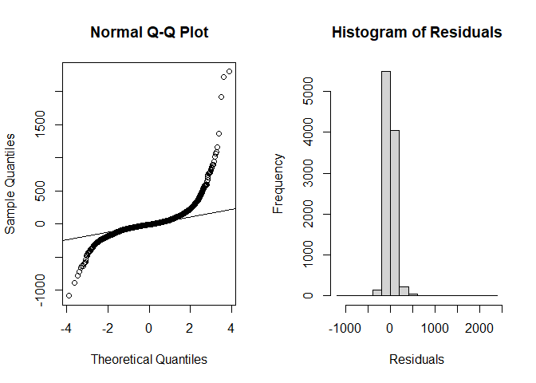
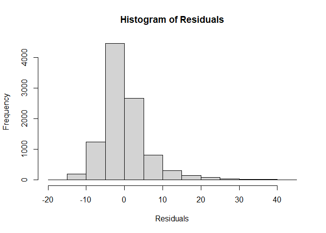
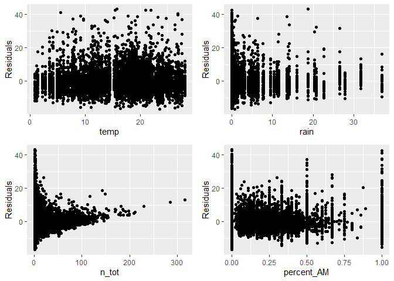

Part 2: Linear regression models
================
Charles Julien, Chike Odenigbo, Atul Sharma, Gabriel Jobert
10/20/2023

# Instructions

• Explore linear regression models for the response variables of
interest, specifically, for trip lengths (duration) and revenue.

• Be sure that your analyses allow you to answer well formulated
business / research questions that you wish to explore through these
models. The goal is to use linear regression models to provide
interesting and relevant insights from the data.

• Comment on findings and discuss the main takeaways from these analyses
from a business perspective. Be sure to provide relevant model outputs
that support your discussion.

• Discuss any shortcomings or limitations of the analyses carried out.

# Introduction Unlocking the Wheels of Urban Mobility: A Data-Driven Analysis of BIXI

In the fast-paced, ever-evolving landscape of urban transportation, the
quest to create efficient and sustainable solutions for city dwellers
continues to be a paramount concern. Amidst the diverse array of options
that have emerged in recent years, the BIXI public cycling service
stands as a beacon of sustainable urban mobility. Offering an
accessible, convenient, and eco-friendly mode of transportation, BIXI
has transformed the way people navigate and experience cities.

As part of our commitment to understanding and improving urban
transportation systems, our consultant team has embarked on an in-depth
exploration of BIXI’s operational data. The objective of this report is
to provide a comprehensive analysis of the data collected from the BIXI
service. By leveraging statistical and data analysis techniques, we aim
to uncover valuable insights into the usage patterns, financial
dynamics, and various factors affecting BIXI’s performance. Our study
covers an extensive range of factors, including ridership trends,
environmental conditions, user classifications, and more.

One of the central questions addressed in this report is whether revenue
generated by the BIXI service and trip duration significantly varies
during weekends compared to weekdays. we also delve into the other
factors affecting the duration of trips and the revenue generated by
non-members. Our methodology combines data analysis, data visualization,
and statistical modeling, with a primary focus on using R, a powerful
statistical tool, to extract meaningful information from the BIXI
dataset.

By analyzing this data, we aim to assist BIXI in making data-informed
decisions to enhance the efficiency and quality of their services,
ultimately contributing to the betterment of urban living. We believe
that the findings and recommendations presented in this report will not
only provide valuable insights to BIXI but also serve as a valuable
reference for urban planners, researchers, and policymakers who are
dedicated to creating more sustainable, convenient, and enjoyable urban
environments.

The following sections of the report will delve into the specifics of
our data analysis, share our findings, and provide recommendations based
on the insights gathered during this project.

# Business/Research questions

Do members travel more than non-members during the rain periods? (Shows
commitment of members)

Do members travel more during weekends than non-members? (Shows
commitment of members)

Do stations more commonly traveled in the mornings have lower duration
per trip than stations more commonly traveled in the afternoon?

Do members prefer to travel in the morning as opposed to non-members?
(Members are work commuters, non-members are recreational)

Do members prefer to travel in the morning as opposed to non-members?
Also including the weekend vs weekday.

Examples :

Are revenues significantly higher during the weekend?

Does the average trip duration varies from member to non-member?

How does weather interact with weekday in determining the number of
trips?

# Build some regression models, discuss their relevances and test assumptions

# Research Question 1: How do seasonal factors impact trip durations and revenue for BIXI Montréal?

## Seasonal effect on trip duration

    ## 
    ## Call:
    ## lm(formula = dur ~ mm + temp * rain, data = df_main)
    ## 
    ## Residuals:
    ##    Min     1Q Median     3Q    Max 
    ## -343.2 -189.2  -81.4   94.5 3910.2 
    ## 
    ## Coefficients:
    ##              Estimate Std. Error t value Pr(>|t|)    
    ## (Intercept) 129.79659   14.32005   9.064  < 2e-16 ***
    ## mm5          76.47150   14.43951   5.296 1.21e-07 ***
    ## mm6          91.81831   16.61872   5.525 3.38e-08 ***
    ## mm7         117.72149   16.03643   7.341 2.29e-13 ***
    ## mm8         101.18642   17.49632   5.783 7.55e-09 ***
    ## mm9         134.18174   14.88978   9.012  < 2e-16 ***
    ## mm10         38.83674   13.56798   2.862  0.00421 ** 
    ## mm11         18.82041   16.09615   1.169  0.24233    
    ## temp          4.16439    0.84554   4.925 8.57e-07 ***
    ## rain         -3.65130    1.58760  -2.300  0.02147 *  
    ## temp:rain    -0.06314    0.09347  -0.676  0.49937    
    ## ---
    ## Signif. codes:  0 '***' 0.001 '**' 0.01 '*' 0.05 '.' 0.1 ' ' 1
    ## 
    ## Residual standard error: 300.5 on 9989 degrees of freedom
    ## Multiple R-squared:  0.04691,    Adjusted R-squared:  0.04596 
    ## F-statistic: 49.17 on 10 and 9989 DF,  p-value: < 2.2e-16

### Findings and interpretation

From a business perspective, here’s how you would interpret the output
of the linear model:

**Model Overview**: The model is trying to observe the effect of month
(`mm`), average temperature (`temp`), and rainfall (`rain`), along with
the interaction between temperature and rainfall (`temp:rain`) on the
trip duration (`dur`).

**Coefficients**: - **(Intercept)**: The base duration (when all other
factors are 0) is approximately 129.8. However, since some factors (like
temperature) cannot realistically be zero, we have to interpret this
value with caution.

- **Month (`mm`)**: Compared to April :

  - Trips in May (`mm5`) are on average 76.5 minutes longer.
  - Trips in June are approximately 91.8 minutes longer.
  - July sees the most significant increase with trips being about 117.7
    minutes longer.
  - This trend decreases a bit in August with an increase of 101.2
    minutes.
  - September trips are approximately 134.2 units minutes.
  - The effect diminishes in the later months with October seeing an
    increase of just 38.8 minutes and November just 18.8 minutes.
    However, note that the coefficient for November is not statistically
    significant (p-value \> 0.05).

- **Temperature (`temp`)**: For each additional degree Celsius in
  temperature, trip duration increases by around 4.16 minutes, all else
  being equal.

- **Rainfall (`rain`)**: For each additional millimeter of rain, trip
  duration decreases by approximately 3.65 minutes. All else being
  equal. This might suggest that people tend to shorten their trips when
  it rains.

- **Interaction Term (`temp:rain`)**: The interaction term is not
  statistically significant (p-value \> 0.05), which means that the
  combined effect of temperature and rainfall on trip duration is not
  distinctly different from the sum of their individual effects.

**Model Fit**: - The **Multiple R-squared** value is 0.04691, which
means that only about 4.69% of the variance in trip duration can be
explained by the model. This is a pretty low value, suggesting that
there may be other factors not considered in the model that influence
trip duration.

- The overall **F-statistic** has a very low p-value (p \< 2.2e-16),
  indicating that the model is statistically significant and that at
  least one of the predictors has a relationship with trip duration.

**Business Implications**:

1.  **Seasonality**: There’s a clear seasonality in trip duration, with
    trips tending to be longer in the middle of the year (around July
    and September) compared to April. This could be due to various
    reasons like vacations, events, or other factors that influence trip
    behavior during these months.

2.  **Weather**: Temperature has a positive relationship with trip
    duration, meaning people might take longer trips when it’s warmer.
    On the other hand, rainfall tends to reduce trip length, which could
    be due to discomfort or safety concerns associated with traveling
    during rain.

3.  **Model Improvements**: The low R-squared value indicates there are
    other factors not in the model affecting trip duration. Further
    research could help improve the predictive power of the model.

4.  **Operational Decisions**: If a business relies on this data, it
    could optimize operations based on these insights. For example, they
    might expect longer trips and possibly more revenue during warmer,
    drier months. On rainy days, they might expect shorter trips and can
    adjust resources and strategies accordingly.

## Seasonal effect on revenue

    ## 
    ## Call:
    ## lm(formula = rev ~ mm + temp + rain, data = df_main)
    ## 
    ## Residuals:
    ##    Min     1Q Median     3Q    Max 
    ## -35.02 -17.16  -7.91   6.28 780.11 
    ## 
    ## Coefficients:
    ##             Estimate Std. Error t value Pr(>|t|)    
    ## (Intercept)  10.6632     2.6304   4.054 5.12e-05 ***
    ## mm5           4.5252     2.6259   1.723   0.0849 .  
    ## mm6           8.6248     2.9339   2.940   0.0033 ** 
    ## mm7          17.2568     2.8647   6.024 1.83e-09 ***
    ## mm8          15.7850     3.0995   5.093 3.67e-07 ***
    ## mm9          18.6931     2.6860   6.959 3.88e-12 ***
    ## mm10         12.1186     2.4922   4.863 1.20e-06 ***
    ## mm11          6.9401     2.9942   2.318   0.0205 *  
    ## temp          0.3833     0.1456   2.632   0.0085 ** 
    ## rain         -0.4932     0.1097  -4.495 7.13e-06 ***
    ## ---
    ## Signif. codes:  0 '***' 0.001 '**' 0.01 '*' 0.05 '.' 0.1 ' ' 1
    ## 
    ## Residual standard error: 35.98 on 4724 degrees of freedom
    ##   (5266 observations deleted due to missingness)
    ## Multiple R-squared:  0.04008,    Adjusted R-squared:  0.03825 
    ## F-statistic: 21.92 on 9 and 4724 DF,  p-value: < 2.2e-16

**Objective of Analysis:** This regression model is examining the impact
of the month (`mm`), average daily temperature (`temp`), and total
amount of rainfall (`rain`) on the revenue (`rev`) generated by trips
leaving from a specified station.

**Business Interpretation:**

**Seasonality (Month):** - The revenue seems to have a seasonal pattern.
Compared to April (reference month), May (`mm5`) sees an increase in
revenue by about 4.525. This increase is even more pronounced in the
following months, with September (`mm9`) having the most substantial
uplift of around 18.693\$.

**Temperature (`temp`):** - For every 1°C increase in temperature, the
revenue increases by approximately 0.383 \$, which is statistically
significant (p-value: 0.0085). - This suggests that warmer days tend to
generate more revenue.

**Rainfall (`rain`):** - For every additional mm of rainfall, the
revenue decreases by approximately 0.493\$, which is statistically
significant (p-value: 7.13e-06). - This implies that rainfall negatively
impacts the revenue.

**Model Fit:** - The Multiple R-squared value (0.04008) implies that
around 4% of the variation in revenue is explained by the predictors in
the model. While statistically significant (F-statistic p-value: \<
2.2e-16), the model might benefit from considering additional predictors
or non-linear effects to explain more of the variance in revenue.

**Recommendations for Business:**

1.  **Operational Adjustments:** Given that revenue is higher in warmer
    months, consider optimizing operations for this period. This might
    involve higher staffing, more promotional activities, or ensuring
    optimal equipment availability.

2.  **Rainy Day Strategies:** Since rainfall seems to negatively impact
    revenue, consider implementing strategies to mitigate this. For
    instance, promotional offers or special activities/events for rainy
    days might help attract customers.

## residual Analysis

<!-- --><!-- -->

1.  **Histogram of Residuals**: These histograms have a clear right-skew
    with a peak close to zero and a long tail towards the right. This
    suggests that most residuals are clustered around zero, but there
    are a few larger positive residuals. This is an indication that the
    normality assumption of the residuals may be violated.

2.  **Normal Q-Q Plot**: Most of the points are close to the line, which
    is a good sign. However, there’s a clear deviation from the line on
    the top right corner, suggesting the presence of larger residuals
    that are not explained by a normal distribution. This reiterates the
    presence of the right skew seen in these histograms.

**Overall Interpretation**: The residuals are not perfectly normal. They
show a positive skewness, indicating there might be some observations
with higher residuals (perhaps outliers or instances where the model
systematically underpredicts). The deviation from normality might not be
a problem because the sample is large enough.

# Research Question 2: How do daily and weekly patterns impact trip durations and revenue for BIXI Montréal?

## Effect of daily and weekly pattern on revenue (duration is the target variable in the lm)

    ## 
    ## Call:
    ## lm(formula = dur ~ dd + wday + holiday + n_AM + n_PM + n_AM * 
    ##     n_PM, data = df_main)
    ## 
    ## Residuals:
    ##      Min       1Q   Median       3Q      Max 
    ## -1085.87   -44.46    -8.88    32.17  2299.39 
    ## 
    ## Coefficients:
    ##                 Estimate Std. Error t value Pr(>|t|)    
    ## (Intercept)    30.770092   3.688401   8.342  < 2e-16 ***
    ## dd             -0.068808   0.126157  -0.545  0.58548    
    ## wdayMonday    -27.967133   4.166831  -6.712 2.03e-11 ***
    ## wdaySaturday   29.102294   4.086573   7.121 1.14e-12 ***
    ## wdaySunday     11.197715   4.116155   2.720  0.00653 ** 
    ## wdayThursday  -11.920230   4.143795  -2.877  0.00403 ** 
    ## wdayTuesday   -29.246774   4.164437  -7.023 2.31e-12 ***
    ## wdayWednesday -18.285884   4.133963  -4.423 9.82e-06 ***
    ## holiday1       56.235008   7.609070   7.391 1.58e-13 ***
    ## n_AM            8.514027   0.345613  24.635  < 2e-16 ***
    ## n_PM           19.121895   0.145336 131.570  < 2e-16 ***
    ## n_AM:n_PM      -0.092015   0.006692 -13.750  < 2e-16 ***
    ## ---
    ## Signif. codes:  0 '***' 0.001 '**' 0.01 '*' 0.05 '.' 0.1 ' ' 1
    ## 
    ## Residual standard error: 109.8 on 9988 degrees of freedom
    ## Multiple R-squared:  0.8727, Adjusted R-squared:  0.8725 
    ## F-statistic:  6223 on 11 and 9988 DF,  p-value: < 2.2e-16

**Overall Model** (the above model is not the one described below)

- The model explains approximately 87.87% of the variation in revenue
  (`rev`) generated by trips taken by non-members, as indicated by the
  `Multiple R-squared` value.
- The model is statistically significant (F-statistic p-value is
  extremely small), suggesting that the predictors in the model
  collectively have an effect on revenue.

**Intercept** - When all other variables are at their reference level
(Friday during non holiday period), the average revenue is about
\$1.845.

**Coefficients** - **dd (Day of the Month)**: The revenue increases by
\$0.01299 for each day later in the month, although this effect is not
statistically significant (p = 0.54263).

- **wday (Weekday)**: Compared to the reference weekday (likely Friday
  since it’s not listed) (We should probably show this in the correct
  order):

  - **Monday**: Revenue is lower by about \$2.81 on average.
  - **Saturday**: Revenue is higher by about \$1.93 on average.
  - **Sunday**: Revenue is higher by about \$0.612 on average, but this
    is not statistically significant.
  - **Thursday**: Revenue is lower by about \$2.63 on average.
  - **Tuesday**: Revenue is lower by about \$4.33 on average.
  - **Wednesday**: Revenue is lower by about \$3.13 on average.

  Most of these weekday effects are statistically significant, implying
  certain days of the week have distinctive revenue patterns for
  non-members.

- **Holiday**: On holidays, revenue is on average higher by about \$5.78
  compared to non-holidays. This suggests that non-members are more
  likely to use the bike sharing service on holidays, generating higher
  revenue.

- **n_AM (Number of Trips in the Morning)**: For each additional trip in
  the morning, revenue increases by about \$2.96 on average. This is
  significant, implying that more morning trips by non-members translate
  to more revenue.

- **n_PM (Number of Trips in the Afternoon)**: For each additional trip
  in the afternoon, revenue increases by about \$5.50 on average. This
  indicates afternoon trips by non-members are particularly profitable.

- **Interaction Term (n_AM:n_PM)**: The positive coefficient (0.1036)
  suggests that as the number of trips in both the morning and afternoon
  increases, there’s a rise in the overall revenue. However, this
  coefficient is too small to have a real impact.

**Business Implications**:

1.  **Promotion and Marketing**: The company can offer special
    promotions for non-members on Saturdays and holidays when the
    revenue from non-members is typically higher. While members might
    provide a steady stream of revenue, there’s significant revenue
    potential from non-members, especially on specific days and times.
    Marketing campaigns can target potential non-members to convert them
    or at least encourage them to ride more.

2.  **Pricing Strategy**: Given the significant revenue differences
    across weekdays, dynamic pricing or special offers targeted towards
    non-members on lower revenue days (like Monday, Tuesday) could boost
    earnings.

3.  **Operational Strategy**: Afternoon trips are highly lucrative.
    Ensuring bike availability and visibility during afternoons can
    drive higher non-member usage.

4.  **Further Investigation**: While this analysis gives insights into
    non-member behavior, comparing it with member behavior would provide
    a more comprehensive view and allow for better-targeted strategies.

## Effect of daily and weekly pattern on trip duration

    ## 
    ## Call:
    ## lm(formula = dur ~ dd + wday + holiday + n_AM + n_PM + n_AM * 
    ##     n_PM, data = df_main)
    ## 
    ## Residuals:
    ##      Min       1Q   Median       3Q      Max 
    ## -1085.87   -44.46    -8.88    32.17  2299.39 
    ## 
    ## Coefficients:
    ##                 Estimate Std. Error t value Pr(>|t|)    
    ## (Intercept)    30.770092   3.688401   8.342  < 2e-16 ***
    ## dd             -0.068808   0.126157  -0.545  0.58548    
    ## wdayMonday    -27.967133   4.166831  -6.712 2.03e-11 ***
    ## wdaySaturday   29.102294   4.086573   7.121 1.14e-12 ***
    ## wdaySunday     11.197715   4.116155   2.720  0.00653 ** 
    ## wdayThursday  -11.920230   4.143795  -2.877  0.00403 ** 
    ## wdayTuesday   -29.246774   4.164437  -7.023 2.31e-12 ***
    ## wdayWednesday -18.285884   4.133963  -4.423 9.82e-06 ***
    ## holiday1       56.235008   7.609070   7.391 1.58e-13 ***
    ## n_AM            8.514027   0.345613  24.635  < 2e-16 ***
    ## n_PM           19.121895   0.145336 131.570  < 2e-16 ***
    ## n_AM:n_PM      -0.092015   0.006692 -13.750  < 2e-16 ***
    ## ---
    ## Signif. codes:  0 '***' 0.001 '**' 0.01 '*' 0.05 '.' 0.1 ' ' 1
    ## 
    ## Residual standard error: 109.8 on 9988 degrees of freedom
    ## Multiple R-squared:  0.8727, Adjusted R-squared:  0.8725 
    ## F-statistic:  6223 on 11 and 9988 DF,  p-value: < 2.2e-16

**Overall Model** - The model explains approximately 87.27% of the
variation in the trip duration. - The model is statistically significant
(F-statistic p-value is extremely small), suggesting that the predictors
in the model collectively have an effect on the trip duration.

**Intercept** - When all other variables are at their reference level
(Friday not on a holiday), the predicted trip duration is about 30.77
minutes on average.

**Coefficients** - **dd (Day of the Month)**: For each day later in the
month, the trip duration decreases by about 0.0688 minutes on average,
although this effect is not statistically significant (p = 0.58548).

- **wday (Weekday)**: Compared to the Friday:

  - **Monday**: Trips are shorter by about 27.97 minutes on average.
  - **Saturday**: Trips are longer by about 29.10 minutes on average.
  - **Sunday**: Trips are longer by about 11.20 minutes on average.
  - **Thursday**: Trips are shorter by about 11.92 minutes on average.
  - **Tuesday**: Trips are shorter by about 29.25 minutes on average.
  - **Wednesday**: Trips are shorter by about 18.29 minutes on average.
  - The coefficients for all these weekdays are statistically
    significant.

- **Holiday**: On holidays, trips are on average longer by about 56.24
  minutes compared to non-holidays. This effect is statistically
  significant, suggesting holidays might lead to longer leisure trips or
  normal trips to different destinations than workdays.

- **n_AM (Number of Trips in the Morning)**: For each additional trip in
  the morning, the trip duration increases by about 8.51 minutes on
  average. This is statistically significant, implying that when there
  are more trips in the morning, they tend to be longer.

- **n_PM (Number of Trips in the Afternoon)**: For each additional trip
  in the afternoon, the trip duration increases by about 19.12 minutes
  on average. This is statistically significant and implies that
  afternoon trips tend to be longer.

- **Interaction Term (n_AM:n_PM)**: The negative coefficient (-0.0920)
  suggests that as the number of trips in both the morning and afternoon
  increases, there’s a slight decrease in the overall trip duration.
  However, given the fact that the coefficient is really weak, the
  impact will be almost imperceptible.

**Business Implications**:

1.  **Promotion and Marketing**: If the bike sharing company wants to
    run promotions, they might consider targeting days when users take
    longer trips, like Saturdays or holidays.

2.  **Resource Allocation**: Understanding that afternoon trips are
    longer might help in resource allocation, e.g., ensuring bikes are
    available and well-maintained for the afternoon surge.

3.  **Pricing Strategy**: The company can consider dynamic pricing based
    on the day of the week or if it’s a holiday, adjusting prices for
    longer trip durations on certain days.

4.  **Operational Strategy**: The interaction term suggests that on
    particularly busy days (both morning and afternoon), the average
    trip duration decreases slightly. This could be due to increased
    congestion or users taking shorter trips when they notice many bikes
    are in use.

## CHIKE

Are revenues significantly higher during the weekend?

Does the average trip duration varies from member to non-member?

How does weather interact with weekday in determining the number of
trips?

Do members travel more than non-members during the rain periods? (Shows
commitment of members)

Do members travel more during weekends than non-members? (Shows
commitment of members)

Do stations more commonly traveled in the mornings have lower duration
per trip than stations more commonly traveled in the afternoon?

Do members prefer to travel in the morning as opposed to non-members?
(Members are work commuters, non-members are recreational)

Do members prefer to travel in the morning as opposed to non-members?
Also including the weekend vs weekday.

``` r
model <- lm(n_AM_PM_delta ~ long_wknd_ind + season + rain_ind + mem, data = df_main) # Goal is to look at stations more used in the mornings than afternoons
summary(model)
```

    ## 
    ## Call:
    ## lm(formula = n_AM_PM_delta ~ long_wknd_ind + season + rain_ind + 
    ##     mem, data = df_main)
    ## 
    ## Residuals:
    ##      Min       1Q   Median       3Q      Max 
    ## -117.382   -2.083    1.433    4.928   24.147 
    ## 
    ## Coefficients:
    ##                      Estimate Std. Error t value Pr(>|t|)    
    ## (Intercept)           -4.1407     0.8188  -5.057 4.33e-07 ***
    ## long_wknd_indWeekday   1.7079     0.8182   2.087   0.0369 *  
    ## long_wknd_indWeekend   0.4048     0.8293   0.488   0.6255    
    ## seasonSpring          -0.1763     0.2692  -0.655   0.5126    
    ## seasonSummer          -1.5288     0.2199  -6.951 3.86e-12 ***
    ## rain_indRain           1.6899     0.2006   8.424  < 2e-16 ***
    ## mem1                  -8.1851     0.1951 -41.950  < 2e-16 ***
    ## ---
    ## Signif. codes:  0 '***' 0.001 '**' 0.01 '*' 0.05 '.' 0.1 ' ' 1
    ## 
    ## Residual standard error: 9.726 on 9993 degrees of freedom
    ## Multiple R-squared:  0.1587, Adjusted R-squared:  0.1582 
    ## F-statistic: 314.2 on 6 and 9993 DF,  p-value: < 2.2e-16

``` r
#df_main 
# SHORTER TRIPS ON WEEKDAYS THAN WEEKENDS
model <- lm(avg ~ long_wknd_ind + season + rain_ind + mem, data = df_main)
summary(model)
```

    ## 
    ## Call:
    ## lm(formula = avg ~ long_wknd_ind + season + rain_ind + mem, data = df_main)
    ## 
    ## Residuals:
    ##     Min      1Q  Median      3Q     Max 
    ## -15.872  -3.611  -1.152   2.113  43.681 
    ## 
    ## Coefficients:
    ##                      Estimate Std. Error t value Pr(>|t|)    
    ## (Intercept)           16.1900     0.5321  30.429  < 2e-16 ***
    ## long_wknd_indWeekday  -1.0186     0.5317  -1.916   0.0554 .  
    ## long_wknd_indWeekend   0.6199     0.5389   1.150   0.2501    
    ## seasonSpring           2.8607     0.1749  16.353  < 2e-16 ***
    ## seasonSummer           1.6624     0.1429  11.631  < 2e-16 ***
    ## rain_indRain          -1.0075     0.1304  -7.728  1.2e-14 ***
    ## mem1                  -2.4147     0.1268 -19.044  < 2e-16 ***
    ## ---
    ## Signif. codes:  0 '***' 0.001 '**' 0.01 '*' 0.05 '.' 0.1 ' ' 1
    ## 
    ## Residual standard error: 6.321 on 9993 degrees of freedom
    ## Multiple R-squared:  0.0812, Adjusted R-squared:  0.08064 
    ## F-statistic: 147.2 on 6 and 9993 DF,  p-value: < 2.2e-16

``` r
# MEMBERS TAKE SHORTER TRIPS
# MEMBERS TAKE LONGER TRIPS IN THE RAIN
model <- lm(avg ~ (rain_ind *mem) + long_wknd_ind, data = df_main)
summary(model)
```

    ## 
    ## Call:
    ## lm(formula = avg ~ (rain_ind * mem) + long_wknd_ind, data = df_main)
    ## 
    ## Residuals:
    ##     Min      1Q  Median      3Q     Max 
    ## -15.676  -3.701  -1.221   2.310  43.073 
    ## 
    ## Coefficients:
    ##                      Estimate Std. Error t value Pr(>|t|)    
    ## (Intercept)           17.2772     0.5396  32.021  < 2e-16 ***
    ## rain_indRain          -1.4170     0.1938  -7.312 2.84e-13 ***
    ## mem1                  -2.5621     0.1633 -15.693  < 2e-16 ***
    ## long_wknd_indWeekday  -0.7002     0.5362  -1.306   0.1916    
    ## long_wknd_indWeekend   0.9991     0.5438   1.837   0.0662 .  
    ## rain_indRain:mem1      0.5474     0.2647   2.068   0.0387 *  
    ## ---
    ## Signif. codes:  0 '***' 0.001 '**' 0.01 '*' 0.05 '.' 0.1 ' ' 1
    ## 
    ## Residual standard error: 6.411 on 9994 degrees of freedom
    ## Multiple R-squared:  0.05475,    Adjusted R-squared:  0.05428 
    ## F-statistic: 115.8 on 5 and 9994 DF,  p-value: < 2.2e-16

``` r
#HIGHER REVENUE PER TRIP IN SPRING AND SUMMER THAN WINTER
model <- lm(rev_per_trip ~ long_wknd_ind + season + rain_ind, data = df_main)
summary(model)
```

    ## 
    ## Call:
    ## lm(formula = rev_per_trip ~ long_wknd_ind + season + rain_ind, 
    ##     data = df_main)
    ## 
    ## Residuals:
    ##     Min      1Q  Median      3Q     Max 
    ## -2.5592 -0.6838 -0.1753  0.4379  6.5634 
    ## 
    ## Coefficients:
    ##                      Estimate Std. Error t value Pr(>|t|)    
    ## (Intercept)           3.60460    0.13423  26.854  < 2e-16 ***
    ## long_wknd_indWeekday -0.16215    0.13525  -1.199    0.231    
    ## long_wknd_indWeekend  0.19319    0.13702   1.410    0.159    
    ## seasonSpring          0.58644    0.04544  12.905  < 2e-16 ***
    ## seasonSummer          0.32748    0.03601   9.094  < 2e-16 ***
    ## rain_indRain         -0.18870    0.03346  -5.639 1.81e-08 ***
    ## ---
    ## Signif. codes:  0 '***' 0.001 '**' 0.01 '*' 0.05 '.' 0.1 ' ' 1
    ## 
    ## Residual standard error: 1.105 on 4728 degrees of freedom
    ##   (5266 observations deleted due to missingness)
    ## Multiple R-squared:  0.06704,    Adjusted R-squared:  0.06605 
    ## F-statistic: 67.95 on 5 and 4728 DF,  p-value: < 2.2e-16

``` r
#df_main 
# AS BIXI SEASON GOES ON, WEEKDAY NUMBER OF TRIPS GO UP WITH A STATISTICAL SIGNIFICANCE
model <- lm(n_tot ~ (long_wknd_ind*week_num), data = df_main)
summary(model)
```

    ## 
    ## Call:
    ## lm(formula = n_tot ~ (long_wknd_ind * week_num), data = df_main)
    ## 
    ## Residuals:
    ##     Min      1Q  Median      3Q     Max 
    ## -21.290 -15.548  -8.577   6.966 294.938 
    ## 
    ## Coefficients:
    ##                               Estimate Std. Error t value Pr(>|t|)    
    ## (Intercept)                    29.4754     7.7757   3.791 0.000151 ***
    ## long_wknd_indWeekday          -13.4649     7.8444  -1.716 0.086103 .  
    ## long_wknd_indWeekend           -8.7238     7.9243  -1.101 0.270971    
    ## week_num                       -0.3531     0.2302  -1.534 0.125152    
    ## long_wknd_indWeekday:week_num   0.4896     0.2325   2.106 0.035231 *  
    ## long_wknd_indWeekend:week_num   0.3068     0.2353   1.304 0.192407    
    ## ---
    ## Signif. codes:  0 '***' 0.001 '**' 0.01 '*' 0.05 '.' 0.1 ' ' 1
    ## 
    ## Residual standard error: 23.77 on 9994 degrees of freedom
    ## Multiple R-squared:  0.002469,   Adjusted R-squared:  0.001969 
    ## F-statistic: 4.946 on 5 and 9994 DF,  p-value: 0.0001588

## residual Analysis

<!-- -->

**Histogram of Residuals**: - At first glance, the residuals appear to
be roughly normally distributed as the majority of them are centered
around zero.

**Normal Q-Q Plot**: - If the residuals were perfectly normally
distributed, the points would lie exactly on the diagonal line. - For
the most part, the points closely follow the lines, suggesting that the
residuals are approximately normally distributed. - Nevertheless,
there’s a deviation from the line at both the lower and upper ends. This
implies that there are some residuals that are more extreme than what
we’d expect under a perfect normal distribution, indicating the presence
of outliers or potentially heavy tails in the residual distribution.

**Implications**:

- The residuals being approximately centered around zero and their
  near-normal distribution suggest that the model’s assumption of
  linearity and constant variance (homoscedasticity) are likely met.
  This is good for the validity of the regression analysis.

- The presence of outliers or extreme values, as indicated by the tails
  in the histogram and the deviations in the Q-Q plot, might influence
  the regression results. These influential observations could distort
  the regression coefficients and reduce the precision of predictions.

- The existence of outliers suggests that it might be beneficial to
  investigate these specific data points further to determine if they’re
  genuine observations or potential errors. If they’re genuine, one
  might consider robust regression techniques or transformations to
  minimize their influence.

# Research Question 3: What variables impact the average bixi trip duration?

The idea is to identify the driving factors of a bixi trip length when
we control for most of the variables.

Average trip duration for members is a good proxy for the revenue they
would bring if they were non-members.

Variables that make business sense to include:

From our seasonality analysis we identified: - Season (season) -
Temperature in degrees celcius (temp) - Rainfall in mm (rain)

From our daily and weekly pattern analysis we identified: - Part of the
week i.e. weekend or weekday (wknd_ind) - If it is a holiday (holiday)

Some other variables that are interesting: - If the user is a member
(mem) - Location of the bixi station compared to Parc Lafontaine
(North_South) and (West_East) - Proportion of trips in the morning
versus the whole day (percent_AM) - total number of trips (n_tot)

Interactions: In our EDA we observed a different week day usage of the
member and non members, thus an interaction term between members and day
of week would be interesting. (wday\*mem).

    ## 
    ## Call:
    ## lm(formula = avg ~ season + temp + rain + wknd_ind * mem + holiday + 
    ##     North_South + West_East + n_tot + percent_AM, data = df_main)
    ## 
    ## Residuals:
    ##     Min      1Q  Median      3Q     Max 
    ## -16.925  -3.442  -0.919   2.150  43.083 
    ## 
    ## Coefficients:
    ##                       Estimate Std. Error t value Pr(>|t|)    
    ## (Intercept)          13.769734   0.261207  52.716  < 2e-16 ***
    ## seasonSpring          2.331761   0.172909  13.485  < 2e-16 ***
    ## seasonSummer          0.380118   0.181875   2.090  0.03664 *  
    ## temp                  0.143744   0.013388  10.737  < 2e-16 ***
    ## rain                 -0.125413   0.011991 -10.459  < 2e-16 ***
    ## wknd_indWeekend       2.638923   0.197185  13.383  < 2e-16 ***
    ## mem1                 -0.385385   0.168773  -2.283  0.02242 *  
    ## holiday1              1.069557   0.415570   2.574  0.01008 *  
    ## North_SouthSouth      0.355471   0.125786   2.826  0.00472 ** 
    ## West_EastWest        -0.234144   0.131813  -1.776  0.07571 .  
    ## n_tot                -0.055315   0.003098 -17.855  < 2e-16 ***
    ## percent_AM           -2.351044   0.307849  -7.637 2.43e-14 ***
    ## wknd_indWeekend:mem1 -1.868383   0.272843  -6.848 7.94e-12 ***
    ## ---
    ## Signif. codes:  0 '***' 0.001 '**' 0.01 '*' 0.05 '.' 0.1 ' ' 1
    ## 
    ## Residual standard error: 6.169 on 9987 degrees of freedom
    ## Multiple R-squared:  0.1252, Adjusted R-squared:  0.1241 
    ## F-statistic: 119.1 on 12 and 9987 DF,  p-value: < 2.2e-16

**Overall Model** - The model explains approximately 12.52% of the
variation in the average trip duration. which means that other factors
are also at play and not included in the model.

**Intercept** - The interpretation of the intercept does not make sense
in this case since the number of trips would have to be zero.

**Coefficients** - **Season**: The reference level is fall. We can see
that on average trip duration during spring and summer are respectively
2.33 and 0.38 minutes longer than in fall holding everything else
constant.

- **Temperature**: The coefficient of temperature is 0.14 which means
  that an increase in temperature of 1 degree celcius corresponds to an
  increase of average trip duration of 0.14 minutes on average holding
  all else constant.

- **Rainfall**: The coefficient for rain is -0.12 which means that an
  increase in rainfall of 1 mm corresponds to a decrease of average trip
  duration of 0.12 minutes on average holding all else constant.

- **Effect of Weekend Indicator and membership**: Since there exists an
  interaction between both variables, it is no longer possible to
  interpret one without the other. This implies that the relation
  between average trip duration and membership is different depending on
  the moment of the week. The opposite is also true, the relation
  between average trip duration and the moment of the week is different
  depending on the membership status.

- Weekend indicator’s coefficient 2.638923 is the average difference
  between average trip duration during weekend and weekday for
  non-members. In other words, for non-members, average trip duration is
  higher on average than for members holding all else constant.

- Membership’s coefficient -0.385385 is the average difference between
  average trip duration for members and non-members for weekdays. In
  other words, during weekdays, the average trip duration is shorter on
  average for members than for non-members holding all else constant.

- Interaction term’s coefficient -1.868383 is …

- **Holiday**: The coefficient for holiday is 1.069557 which means that
  during holidays average trip duration is 1.069 minutes higher on
  average than during non-holidays, holding all else constant.

- **North_South and West_East**: Their coefficients are 0.35 and -0.23
  which means that on average the average trip duration for trips
  starting at a station South of Parc Lafontaine or West is 0.35 and
  -0.23 minutes different from their counter parts respectively, holding
  all else constant.

- **Total number of trips**: The coefficient is -0.055315 which means
  that on average as number of trips increase, the average trip length
  in minutes decreases, holding all else constant.

- **Percent AM**: The magnitude of the coefficient -2.351044 is less
  important than its sign for our interpretation. What it means is that
  as the proportion of trips in the morning increases, the average trip
  duration generally decreases when holding all else constant. This
  hints that trips in the morning might be shorter on average than trip
  in the afternoon, hence bring in less revenue.

**Business Implications**:

1.  **Promotion and Marketing**: For the same temperature, average trip
    length tends to be the longest in spring. This indicates that users
    are eager to use bikes after winter. This insight could be used for
    promotion purposes.

2.  **Resource Allocation**: Expect longer trips when it is hot and
    non-rainy outside. Even more if it is a weekend or holiday. Also,
    bikes tend to be borrowed longer during the afternoon than in the
    morning. Stations south of Parc Lafontaine have on average longer
    trip duration, which may suggests that stations are further from one
    another. There might be some space for additional stations.

3.  **Pricing Strategy**: The usage that is associated with the longest
    trip length based on our interaction term is for non-members during
    the weekend. Charging a heftier price for these people at that time
    may increase profit margins significantly.

4.  **Operational Strategy**: It is important to keep in mind the
    tradeoff between the number of trips and the average trip length.
    Indeed, as the number of trips increase for a given day, the average
    trip length decreases. This may suggest that the additional trips
    during those days are short haul.

### Verificaiton of Normality of Residuals

<!-- -->

### Verificaiton of Heteroscedasticity

<!-- -->

blablabla

# Limitations and shortcomings

- Causation vs. Correlation: The regression model captures relationships
  but does not establish causation.
- Data Exclusions: The data only considers trips under 60 minutes, which
  might exclude a segment of users who use BIXI for longer journeys.
- Other External Factors: Events, road conditions, or public
  transportation disruptions can affect BIXI usage but are not captured
  in the dataset.

# Contribution

Charles Julien :

Gabriel Jobert :

Chike Odenigbo:

Atul Sharma:
